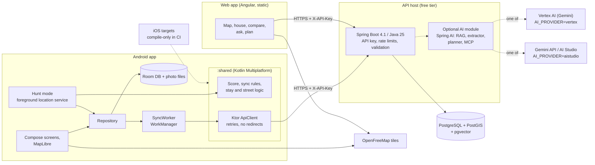

# Doorprints

**Remember every house you've seen.**

[](https://github.com/Sriram-Codes-SW/doorprints/actions/workflows/backend.yml) [](https://github.com/Sriram-Codes-SW/doorprints/actions/workflows/web.yml) [](https://github.com/Sriram-Codes-SW/doorprints/actions/workflows/android.yml) [](https://github.com/Sriram-Codes-SW/doorprints/actions/workflows/security.yml) [](https://github.com/Sriram-Codes-SW/doorprints/actions/workflows/shared-ios.yml)

MIT licensed ([LICENSE](LICENSE)) · Report vulnerabilities privately ([SECURITY.md](SECURITY.md)) ·
Repository: [`Sriram-Codes-SW/doorprints`](https://github.com/Sriram-Codes-SW/doorprints)

Doorprints is a personal, zero-cost app for keeping track of the houses you visit while looking for a home to rent
or buy in India. It is **not** a property-listings site: it holds only the houses you have seen yourself. Save each
house with its price, BHK, a 10-point checklist, star rating, photos, contact and notes; compare your favourites side
by side; and switch on **Hunt mode** while you walk around, so your phone tells you when you pass a house or enter a
street you have already seen. The Android app works fully offline and syncs to your own server and a web app when you
are online.

English · हिन्दी · தமிழ் · తెలుగు

> Doorprints was called **House Hunt** until 2026-09-22. Code packages (`com.househunt`), storage keys and database
> names keep the old name on purpose ([ADR-13](docs/03-design.md#14-architecture-decision-records)). The old
> repository URL (`house-hunt`) redirects here.

## Key features

> **What this table describes.** The **Android** column is the app as released. The **Web** column includes the
> Sprint 4a work — local-first storage, the six offline copies and the installable PWA — which is in the **Sprint 4a
> change set, not pushed yet**; the rows where that matters say so and are marked **4a**. The authoritative list of
> what is released and what is not is the *Unreleased* section of [CHANGELOG.md](CHANGELOG.md), with
> [docs/10 §11](docs/10-sprint-log.md).

| Feature | What it does | Android | Web |
|---|---|---|---|
| **Hunt mode alerts** | While you walk, a notification when you are within 30 m (configurable) of a house you saved, at most once per house per 30 minutes | Yes | – |
| **Street memory** | "You've been on this street before": counts and first visit date when you enter a street with saved houses or visits | Yes | – |
| **Stay detection** | Stand still for a few minutes and the app records a visit, or asks "Are you at a house?" and pre-fills a new house at that spot | Yes | – |
| **Checklist and scoring** | Water, power, parking, sunlight, noise, security and four more, each 0–5, blended with your star rating into one score | Yes | Yes |
| **Compare** | Two to four houses side by side: checklist, rating, price in ₹, score | Yes | Yes |
| **Photos** | Camera or gallery, resized, location metadata removed; optional upload on Wi-Fi only | Yes | Yes |
| **Map and list** | OpenFreeMap vector tiles (no API key), India's boundaries as the Government of India shows them, markers by status, search, filter, sort | Yes | Yes |
| **Offline copies** (**4a**) | Save everything as HTML, PDF, CSV, XLSX, Markdown or a JSON backup, built on the device; the JSON backup can be read back in | Yes (import too) | Export yes; **import in Sprint 4b** (only a Doorprints *Full backup* can be imported: [docs/01 §6.9](docs/01-requirements.md)) |
| **Offline-first** | Everything works without a network; sync resumes by itself with retries and captive-portal detection | Yes | Yes (**4a**: the web app keeps your houses and photos in the browser with IndexedDB and needs no server; before 4a it needed one) |
| **Four languages** | English, Hindi, Tamil, Telugu, switchable in the app; ₹ with lakh/crore grouping. **Hindi, Tamil and Telugu are *under review***: machine-drafted, with the native-speaker review still to come (owner decision of 2026-09-23, [docs/05](docs/05-ux-accessibility-i18n.md) I18N-B03) | Yes (hi/ta/te under review) | Yes (hi/ta/te under review) |
| **Accessibility** | TalkBack labels, 48 dp targets, 200 % font scale, dark theme (Android); WCAG 2.2 AA target (web) | Yes | Yes |
| **Privacy** | No account. Your own server if you want one, encrypted API key on the phone, no raw GPS tracks stored, export and delete-all | Yes | Yes (**4a**: no server needed at all) |
| Optional AI (off by default) | Ask questions about your houses with cited sources, fill a house from pasted listing text, plan a walking route of visits | Yes | Yes |

Coming in Sprint 4b: **Hunt mode reminders** before a planned viewing and **hunting areas** that offer Hunt mode when
you enter a neighbourhood you are searching in (opt-in; see the roadmap and the location permission note below).

## Screenshots

_Placeholder. To be added from a device run: `docs/img/android-map.png`, `docs/img/android-hunt-alert.png`,
`docs/img/android-house.png`, `docs/img/web-map.png`, `docs/img/web-compare.png`._

## Platforms

| Platform | How you get it | Status |
|---|---|---|
| **Android** 8.0+ (API 26) | Sideloaded APK from GitHub Actions (no Play Store listing: by the owner's rule of 2026-09-23 there is no Play Store release, and no public server, until the release security gate exists and passes; [docs/10 §12.5](docs/10-sprint-log.md)) | Available |
| **Web** (desktop and mobile browsers) | **https://doorprints.web.app** — the static Angular app on **Firebase Hosting** (free Spark plan, no billing account; owner decision 2026-09-23, [ADR-21](docs/03-design.md#14-architecture-decision-records)). The owner's setup is done; `web.yml` deploys it on pushes to `main`, so the address answers from the first deploy of the Sprint 4a change set (nothing is deployed yet). It is served with the full security headers of `web/firebase.json` on its own origin ([F-31, RR-11](docs/02-threat-model.md)); GitHub Pages and Cloudflare Pages are not used. Always share the full `https://` address; never share the twin `doorprints.firebaseapp.com` ([docs/12](docs/12-brand-and-naming.md)). You can host your own copy on any static host that sends the same headers | Available. **Local-first since Sprint 4a** (in the Sprint 4a change set, not pushed yet): your data lives in the browser, no account and no server needed, and connecting your own server is optional and only adds sync with the Android app |
| **iPhone / iPad** | The web app in Safari; *Share → Add to Home Screen* installs it | **PWA built in Sprint 4a** (in the Sprint 4a change set, not pushed yet): manifest, service worker, offline start, share target. Not yet tried on a real device — and browser storage is not permanent, so **export a backup** ([02](docs/02-threat-model.md) RR-10) |
| Native iOS app | **Not planned**: it would need a Mac and the paid Apple Developer Program (zero-cost rule). The Android logic lives in a Kotlin Multiplatform module, `:shared`, that CI already compiles for iOS, so a native app stays possible later ([ADR-14](docs/03-design.md#14-architecture-decision-records)) | Phase 2 option |

**Location permissions.** Doorprints asks only for location "While using the app" (or "Only this time"); Hunt mode
is a visible foreground service you start and stop. "Allow all the time" will be requested only if you turn on the
Sprint 4b *hunting areas* feature, after a screen that explains why, and that feature switches itself off if you take
the permission back ([docs/11](docs/11-feature-parity-and-export-spec.md) 5.18).

## Architecture



- **Android** (Kotlin 2.4, Compose, Room, WorkManager, MapLibre 13.6; minSdk 26, targetSdk 36, compileSdk 37,
  AGP 9.4): offline-first; the platform-neutral rules and the Ktor HTTP client are in `android/shared`
  ([module README](android/shared/README.md), [03 §4.2.1](docs/03-design.md)).
- **API** (Spring Boot 4.1.1, Java 25, Flyway): last-write-wins sync with a change feed, geospatial queries in PostGIS,
  photos, export and delete-all.
- **Web** (Angular 22, zoneless, MapLibre GL 6.10): review, edit and compare on a large screen.
- **AI** (Spring AI 2.0.1, off unless `APP_AI_ENABLED=true`): **Vertex AI** is the provider this project is set up
  for (project `doorprints-ai`: chat in Mumbai, `asia-south1`; embeddings on Google's `global` endpoint), and
  **AI Studio** stays one setting away (`AI_PROVIDER=aistudio`, also the code default until the first Vertex eval
  run is green). Details: [docs/ai/ai-design.md](docs/ai/ai-design.md), [docs/ai/vertex-setup.md](docs/ai/vertex-setup.md).

### AI access policy

- **Guests get no cloud AI.** On supported Android phones they will get on-device AI (Gemini Nano through ML Kit,
  Sprint 5); elsewhere AI entry points are hidden. Nothing in the app needs AI.
- **Cloud AI** is for the owner and people the owner invites, on the owner's **paid key with a hard cap** (in-app
  daily caps, a Google Cloud spend cap budget, budget alerts). Today only the owner's own install uses it.
- **No bring-your-own-key**: users never paste their own Gemini or Vertex key.
- Real user data goes only to Vertex AI or a paid Gemini tier; the free AI Studio tier is for synthetic eval data only.
  Contact names and phone numbers are redacted before anything reaches the model.

Policy: [docs/11](docs/11-feature-parity-and-export-spec.md) 5.13 (D-21, D-22), requirements AI-013..AI-017 in
[docs/01](docs/01-requirements.md).

## Quick start

### Install the Android app (no build needed)

1. Open [**Actions → Android**](https://github.com/Sriram-Codes-SW/doorprints/actions/workflows/android.yml), pick the latest green run on `main` and
   download the artifact **`doorprints-debug-apk`** (or **`doorprints-release-apk`**, signed, when the `HH_*`
   signing secrets are set; its signer fingerprint is printed in the "Verify APK signature" step). Unzip it.
2. Copy the `.apk` to the phone and open it (allow "Install unknown apps" for your file manager when asked).
3. Open Doorprints. It works right away without a server; to sync, go to **Settings**: server URL `https://…`, paste
   the API key, **Save and test**, then **Sync now**.

A signed release build cannot be installed over a debug build (different signer): sync first, uninstall, then
install. Builds from before the rename (package `com.househunt.app`) are a separate app; sync them, install
Doorprints (package `app.doorprints`), sync again, then uninstall the old one.

### Run the API locally (Docker)

```bash
export APP_API_KEY=$(openssl rand -hex 32)   # the API refuses to start without a key of 32+ characters
docker compose up --build                    # PostGIS + pgvector and the API on http://127.0.0.1:8080
curl -H "X-API-Key: $APP_API_KEY" http://127.0.0.1:8080/api/stats
```

Android emulator: use `http://10.0.2.2:8080` as the server URL (plain `http://` is allowed only for localhost and the
emulator; everything else must be `https://`).

The compose file allows browser calls only from the dev server (`APP_CORS_ORIGINS` defaults to
`http://localhost:4200`). To sync the live web app at **https://doorprints.web.app** with this server, allow its
origin too — `export APP_CORS_ORIGINS=http://localhost:4200,https://doorprints.web.app` (no path, no trailing slash)
before `docker compose up` — and give the server an `https://` address, because a page served over HTTPS may not call
an `http://` API ([docs/07 §6.3](docs/07-secure-build-and-deploy.md#63-web-firebase-hosting)).

AI locally: export `APP_AI_ENABLED=true` and `AI_API_KEY=<Gemini API key>` before `docker compose up` (use a free key
only with test data). Vertex AI locally: `gcloud auth application-default login`, then run the backend with
`AI_PROVIDER=vertex GCP_PROJECT_ID=… GCP_LOCATION=asia-south1 AI_VERTEX_EMBEDDING_LOCATION=global` via
`cd backend && mvn spring-boot:run` (the dev compose file does not pass the Vertex settings yet;
[vertex-setup step 11](docs/ai/vertex-setup.md)).

### Run the web app (dev server)

```bash
cd web
npm ci
npm start          # ng serve on http://localhost:4200
```

The web app is local-first and works with no server at all — no route is guarded. To sync with the Android
app, open **Connect** and enter `http://localhost:8080` and the API key; that is optional. Tests: `npm run test:ci`.

### Build the Android app yourself

JDK 21 and the Android SDK (compileSdk 37): `cd android && ./gradlew assembleDebug testDebugUnitTest`.

## Map data and credits

Both apps draw OpenFreeMap vector tiles (OpenStreetMap data, ODbL, credited in the map's attribution) with
OpenFreeMap's "liberty" style. **India's boundaries are shown as the Government of India depicts them**, the only view,
because every user is in India: all of Jammu and Kashmir and Ladakh and Arunachal Pradesh inside India, one solid
outline, no Line of Control or Line of Actual Control ([docs/03](docs/03-design.md) ADR-22). That outline comes from
[Natural Earth](https://www.naturalearthdata.com/) (public domain; `natural-earth-vector` commit `ca96624`, India
point of view), bundled as `web/public/geo/in-boundaries.geojson` and `android/app/src/main/assets/geo/in-boundaries.geojson`
and built by `web/scripts/geo/build_in_boundaries.py`. Public-domain data needs no credit; the web app credits
"Natural Earth" in the map attribution anyway. Both apps apply the same rules. The outline alone draws India's whole border with China (the
base map's own pieces of that line are left out). Where the base map's tiles draw India's border with Nepal, Bhutan
or Myanmar themselves, or in the Wakhan, the outline is drawn only in the country view and the tiles' more precise
line takes over from zoom 5, so the border is one line; the Assam-Arunachal Pradesh state line, which the tiles leave
undrawn, is drawn from zoom 5 from the same file (branch `fix/india-boundary-lines`, PR #16, not yet deployed). Known
limits: the outline is typically 1.5-3 km off the true line, up to about 5 km in a few mountain stretches, visible
only when zoomed into the Himalaya; at street zoom a hand-over to the tiles' line shows as a small step, and at
Sikkim's two tri-junctions as a small loop of about 3-5 km; and while closer tiles load, or offline without them,
those stretches show no line from zoom 5 (ADR-22 *Consequences*).

## Deploy for free

Full steps and the environment variable reference: [docs/07](docs/07-secure-build-and-deploy.md#6-free-tier-deployment).

1. **Database**: a free Supabase (Mumbai region) or Neon project with the `postgis` extension; `sslmode=require`.
2. **API**: Render or Koyeb free web service from `backend/` (Docker), or an Oracle Cloud Always Free VM behind Caddy.
   Set `DB_URL`, `DB_USER`, `DB_PASSWORD`, `APP_API_KEY` (32+ random characters) and `APP_CORS_ORIGINS`: the
   **origin** of every web app that will call it, with no path — `https://doorprints.web.app` for the live web
   app. Without it every browser sync from that site fails. Rotate the key later without breaking sync with
   `APP_API_KEY_NEXT` ([runbook 5.1](docs/08-operations-runbook.md)).
3. **Web**: Firebase Hosting, free Spark plan with no billing account, at `https://doorprints.web.app`. `web.yml`
   builds and tests it, checks `web/firebase.json`, deploys with a pinned `firebase-tools` and a short-lived Workload
   Identity token that only `web.yml` on `main` can get (no key anywhere), and then checks the live security headers.
   The one-time owner setup — a Firebase project, a service account with *Firebase Hosting Admin* only, a Workload
   Identity pool and provider, two repository secrets (`FIREBASE_WIF_PROVIDER`, `FIREBASE_SA_EMAIL`) and two
   variables (`FIREBASE_PROJECT_ID`, `FIREBASE_SITE_ID`), GitHub Pages off — was done on 2026-09-23
   ([docs/07 §6.3](docs/07-secure-build-and-deploy.md#63-web-firebase-hosting)). `web/firebase.json` supplies the
   Content-Security-Policy, HSTS, frame protection and the rest. Roll back a bad release in the Firebase console
   ([runbook IR-10](docs/08-operations-runbook.md)).
4. **Android**: the APK from the quick start above.

## Repository structure

| Path | What |
|---|---|
| [`android/app/`](android/app/) | Android app: Compose UI, Room, WorkManager sync, Hunt mode service, MapLibre, translations |
| [`android/shared/`](android/shared/) | Kotlin Multiplatform module `:shared`: models, score, sync rules, stay and street logic, DTOs, Ktor API client (Android + compile-only iOS) |
| [`backend/`](backend/) | Spring Boot API, Flyway migrations (V1 schema, V2 optional pgvector, V3 photo tombstones), optional AI module, tests; `backend/db` is the PostGIS + pgvector image |
| [`web/`](web/) | Angular 22 single-page app ([web/README.md](web/README.md)) |
| [`docs/`](docs/) | Secure-SDLC documents 01–11 and the AI docs |
| [`.github/`](.github/) | CI workflows and Dependabot |
| [`docker-compose.yml`](docker-compose.yml) | Local API + database |
| [`CHANGELOG.md`](CHANGELOG.md) | Release notes (Keep a Changelog) |

CI workflows (`.github/workflows/`): `backend.yml` (tests on PostGIS, SBOM, image check), `web.yml` (Vitest, build),
`android.yml` (APK, unit tests incl. `:shared`, lint, signed release), `security.yml` (Semgrep, gitleaks, Trivy, npm
audit, Android dependency graph, manual ZAP), `shared-ios.yml` (`:shared` iOS compile on macOS), `codeql.yml`
(CodeQL SAST) and `ai-evals.yml` (manual AI evaluation against a real model). Since 2026-09-23 the path-filtered
workflows and `security.yml` run on a push to **any branch** and on pull requests to `main`; `codeql.yml` runs on a
push to any branch (not on pull requests). Deploying and release signing stay on `main` (for signing, only while
the workflow is unmodified until its secrets move to a `main`-only environment, [docs/07 §4](docs/07-secure-build-and-deploy.md#4-secrets-handling)).
Details: [docs/07 §1](docs/07-secure-build-and-deploy.md#1-pipeline-overview).

## Documentation

| Doc | Topic |
|---|---|
| [Docs index](docs/README.md) | How the documents fit together and how to update them |
| [01 Requirements](docs/01-requirements.md) | FR/NFR/SEC/PRV/AI requirements and the traceability matrix |
| [02 Threat model](docs/02-threat-model.md) | STRIDE, abuse cases, findings F-01a/F-01b..F-30 and their status |
| [03 Design](docs/03-design.md) | Architecture, KMP module boundaries, data model, API reference, sync algorithm, ADRs |
| [04 Data flows](docs/04-data-flow-diagrams.md) | DFDs, data classification, data residency |
| [05 UX, accessibility, i18n](docs/05-ux-accessibility-i18n.md) | Design tokens, WCAG 2.2 AA, TalkBack, translations and glossary |
| [06 Test plan](docs/06-test-plan.md) | Unit, contract, integration, security, field and AI tests |
| [07 Build and deploy](docs/07-secure-build-and-deploy.md) | CI/CD, supply chain, free-tier deployment, environment variables |
| [08 Operations](docs/08-operations-runbook.md) | Monitoring, backups, key rotation, incidents, Google Cloud trial end checklist |
| [09 OSI resilience](docs/09-osi-layer-analysis.md) | Bad GPS, captive portals, flaky networks, cold starts |
| [10 Sprint log](docs/10-sprint-log.md) | Sprint goals, stories, sign-offs, CI results, product-owner decisions |
| [11 Feature parity and export](docs/11-feature-parity-and-export-spec.md) | Local-first plan, exports, AI access policy, Sprint 4b reminders, hunting areas and location permissions |
| [AI design](docs/ai/ai-design.md) | Providers, RAG, extractor, planner, MCP, evals, API contract |
| [Vertex AI setup](docs/ai/vertex-setup.md) | Owner's step-by-step Google Cloud setup and this project's results |
| [CHANGELOG](CHANGELOG.md) · [SECURITY.md](SECURITY.md) · [LICENSE](LICENSE) | Changes per version · private vulnerability reporting · MIT |

## Roadmap

| When | What |
|---|---|
| Done | Sprints 1–3: app, API, web, CI, security hardening, AI features (off by default), Vertex AI provider, rename to Doorprints. Sprint 3.5: Kotlin Multiplatform `:shared` module with a Ktor client and compile-only iOS CI |
| **Sprint 4a** | Local-first web app (IndexedDB), installable **PWA** (iPhone included), offline copies in HTML, PDF, CSV, XLSX, Markdown and a JSON backup with import. The whole-app UX audit of both apps, the go-ahead for the first deploy, is approved ([docs/10 §11.7](docs/10-sprint-log.md)) |
| **Sprint 4b** | **Import a backup in the web app** (only a Doorprints *Full backup*; approved definition in [docs/01 §6.9](docs/01-requirements.md)), weighted criteria and ranking, viewing questions, rooms, photo tags, viewings with reminders, *Add a shared listing* (Share to Doorprints); **Hunt mode reminders** and **hunting areas** with the foreground-first location permission model |
| **Sprint 5** | Optional Google Sign-In, sync per user, Google Drive for photos and backups, signed-in devices, account deletion, AI access tiers (on-device AI for guests) |
| **Phase 2 (KMP)** | Room and DataStore in the shared module, then a native iOS app only if a Mac and the Apple Developer Program become available ([03 §4.2.1](docs/03-design.md)) |

Plan and sizing: [docs/11 §14](docs/11-feature-parity-and-export-spec.md) and the [sprint log](docs/10-sprint-log.md).

## Contributing

Doorprints is a personal project built in the open. **External pull requests are not expected** and may be closed
without review; issues with ideas are welcome. Security problems: never open a public issue, use private
vulnerability reporting ([SECURITY.md](SECURITY.md)). Anything you do contribute is under the MIT [LICENSE](LICENSE).

House rules for the maintainers (full list in [docs/README.md](docs/README.md#how-to-update-these-documents)):

1. Code and docs change together; CI (`Backend`, `Web`, `Android`, `Security`, and `Shared iOS compile` for shared
   code) must be green on the branch before it is merged into `main` (the workflows run on every branch push): the
   latest run of each workflow the branch triggered, read in the Actions tab filtered by the branch (path filters work
   per push, so the head commit's checks alone can hide an older red run), with the branch up to date with `main`
   (rebase or merge `main` and push again, or open the PR, if `main` has moved); add a line under *Unreleased* in
   [CHANGELOG.md](CHANGELOG.md).
2. Every user-visible string in all four languages: `web/src/app/i18n/{en,hi,ta,te}.ts` and
   `android/app/src/main/res/values{,-hi,-ta,-te}/strings.xml` ([docs/05](docs/05-ux-accessibility-i18n.md#9-translation-workflow)).
3. Database changes are new Flyway files `V<n>__description.sql`. Room changes need a version bump, a `Migration`
   and a new exported schema file; `RoomSchemaTest` guards version 2.
4. `android/shared/src/commonMain` stays free of `java.*` and `android.*` (the iOS compile job enforces it).
5. Security-relevant changes update the threat model (02), the DFDs (04) and, for network behaviour, the OSI review (09).
6. Secrets never go into git: environment variables and GitHub Secrets only. Workflow logs and artifacts are public.

## Change log

| Date | Change |
|---|---|
| 2026-09-22 | First version of this README (Sprint 1). |
| 2026-09-22 | Sprint 2: links to the sprint log (docs/10) and CHANGELOG, 32-character API key and `APP_API_KEY_NEXT` rotation, signed release APK, compileSdk 37, MapLibre GL 6.10, findings F-01..F-29, CI test and scan list. |
| 2026-09-22 | Sprint 3: documentation index lists threat-model findings F-01a/F-01b..F-30 (31 findings; F-01 split into F-01a and F-01b, new F-30 contact redaction). |
| 2026-09-22 | Renamed the product to **Doorprints** (tagline "Remember every house you've seen."): title and description (a personal record, not a listings site), note that the repository is still `house-hunt`, install steps with the `doorprints-debug-apk` / `doorprints-release-apk` artifacts and the upgrade note for pre-rename builds. |
| 2026-09-22 | Repository renamed to `Sriram-Codes-SW/doorprints` and made public: removed the "repository still named `house-hunt`" note, added the license (MIT) and security lines under the title, install step links the `doorprints` repository, docs table lists 11, `SECURITY.md` and `LICENSE`, contributing rules for public logs and private vulnerability reporting, AI access note (cloud AI for the owner and invited users). |
| 2026-09-22 | Feature table: cloud AI is for the server owner today; invited users are planned (Sprint 5, AI-013). |
| 2026-09-22 | Local AI note: free AI Studio key only with test data; Vertex AI as the alternative provider (`AI_PROVIDER=vertex`, link to `docs/ai/vertex-setup.md`). |
| 2026-09-22 | **Full refresh** (product owner request): CI badges for Backend, Web, Android, Security and Shared iOS compile; key features; platforms (Android APK, web app and iPhone through the browser, installable PWA in Sprint 4a, no native iOS app, KMP-ready `:shared` module); architecture diagram with `:shared` and the Vertex AI / AI Studio switch; AI access policy; quick start (APK artifact, docker compose, web dev server); repository structure; full documentation index (01-11, AI design, Vertex setup); roadmap (Sprint 4a, 4b with Hunt mode reminders and hunting areas, 5, Phase 2 KMP); contributing note (no external pull requests expected). |
| 2026-09-22 | Sprint 4a (built, **not released**; *"on `main`" corrected on 2026-09-23: the change set is not pushed yet*): the **Web** platform row and the **Offline-first** and **Privacy** feature rows say the web app is **local-first** (browser storage, no account, no server; connecting one is optional and only adds sync) instead of "online; needs your server"; new **Offline copies** feature row (six formats, and that the web app exports but cannot import yet); the **iPhone / iPad** row records the installable PWA as built but untried on a device, with the browser-storage warning ([02](docs/02-threat-model.md) RR-10); the web dev-server step no longer tells you to enter a server on the Connect page as if it were the way in; and a note above the feature table marks the unreleased 4a work as such and points at CHANGELOG *Unreleased* and [docs/10 §11](docs/10-sprint-log.md). |
| 2026-09-22 | **Web** platform row: GitHub Pages is switched on, so the row gives the real URL (https://sriram-codes-sw.github.io/doorprints/, live from the first Sprint 4a push) instead of "once the owner switches Pages on", and says what is missing there (response headers, a separate origin) and that [02](docs/02-threat-model.md) F-31 / RR-11 await the owner's decision. |
| 2026-09-22 | **CORS for the web app's hosts** (fifth review round): the deploy steps and *Run the API locally* now say that `APP_CORS_ORIGINS` takes origins without a path, give the GitHub Pages origin `https://sriram-codes-sw.github.io` (the compose default allows only `http://localhost:4200`, so the live site could not sync with a compose server), and that such a server needs an `https://` address. |
| 2026-09-23 | **Web hosting moved to Cloudflare Pages** (owner decision): the **Web** platform row gives the address as `https://<project>.pages.dev` until the first deploy reports it, and drops the GitHub Pages URL and the open-risk note (F-31 fixed by the move, RR-11 closed); *Run the API locally* and *Deploy for free* give the Cloudflare Pages origin for `APP_CORS_ORIGINS` and the owner's setup (API token, two repository secrets, GitHub Pages off); link to docs/07 §6.3 follows its new heading. |
| 2026-09-23 | Review fixes: the **Web** row no longer links an address guessed from the project name as the likely one (the name is unclaimed until the first deploy, so anyone could register it); it keeps `https://<project>.pages.dev` until the owner records the address the deploy reports. The feature-table note and the Web and iPhone rows say the Sprint 4a work is in the change set and **not pushed yet**, instead of "on `main`". *Deploy for free* recommends the two Cloudflare secrets as environment secrets of `cloudflare-pages` restricted to `main` ([docs/07 §4](docs/07-secure-build-and-deploy.md#4-secrets-handling)). |
| 2026-09-23 | **Web hosting moved to Firebase Hosting at https://doorprints.web.app** (owner decision, with the brand advisor; the Cloudflare Pages plan was never set up, because a `pages.dev` address reads as a test site): the **Web** platform row gives the real address, *Run the API locally* and *Deploy for free* give `https://doorprints.web.app` for `APP_CORS_ORIGINS` and describe the Firebase deploy (Workload Identity, no key) and its owner setup, done on 2026-09-23. The *Offline copies* row and the Sprint 4b roadmap row say that web import comes in Sprint 4b under the approved import definition, and use *Add a shared listing* ([docs/12](docs/12-brand-and-naming.md)). |
| 2026-09-23 | Final Sprint 4a round: the **Android** platform row states the owner's release guard (no Play Store release and no public server until the release security gate exists and passes), and the **Sprint 4a** roadmap row notes that the whole-app UX audit, the go-ahead for the first deploy, is approved on both apps ([docs/10](docs/10-sprint-log.md) §11.7, §12.5). The licence is still MIT: the approved move to `AGPL-3.0-only` is a separate follow-up (§12.6). |
| 2026-09-23 | The **Four languages** feature row says that Hindi, Tamil and Telugu ship *under review* (machine-drafted, native-speaker review pending), the owner's decision in the first release's Definition of Done ([docs/10](docs/10-sprint-log.md) §12.5 Decision 4). The **Android** row's release-guard link now leads to the full release security gate as the owner approved it (§12.5 Decision 1). |
| 2026-09-23 | **CI on every branch** (owner decision): the CI paragraph under *Repository structure* says the workflows run on a push to any branch as well as on pull requests to `main`, with deploying and release signing on `main` only; house rule 1 asks for green branch runs before a merge ([docs/10](docs/10-sprint-log.md) §12.5 Decision 5). |
| 2026-09-23 | Review fixes to the CI-on-every-branch rows: the CI paragraph lists `codeql.yml` and says it runs on a push to any branch but not on pull requests; deploying stays on `main` and signing does so only while the workflow is unmodified, until the `HH_*` secrets move to a `main`-only environment; house rule 1 says what green means (the latest run of each triggered workflow on the branch, with the branch up to date with `main`; [docs/07](docs/07-secure-build-and-deploy.md) §3.1). |
| 2026-09-24 | New *Map data and credits* (owner issue P0, India's boundaries on the map): the map shows India's external boundary as the Government of India depicts it, with no Line of Control or Line of Actual Control; the outline is bundled Natural Earth data (public domain), credited on the web ([docs/03](docs/03-design.md) ADR-22). |
| 2026-09-24 | *Map data and credits*: both apps apply the same boundary rules, and the known limits are stated with the measured figures (the outline a median of about 1.5-1.6 km off the true line; a second, close line in a few mountain stretches; no Assam-Arunachal Pradesh state line from zoom 5), from [docs/03](docs/03-design.md) ADR-22 v0.18. |
| 2026-09-24 | *Map data and credits*: one line from zoom 5 (the outline alone draws India's border with China; where the base map draws India's border with Nepal, Bhutan, Myanmar or in the Wakhan, its line takes over, so the second, close line is gone) and the Assam-Arunachal Pradesh state line is drawn from zoom 5 (branch `fix/india-boundary-lines`, PR #16, [docs/10](docs/10-sprint-log.md) §12.10); the known limits restated (1.5-3 km, up to about 5 km in a few mountain stretches; the hand-over step and the Sikkim tri-junction loops; no line on those stretches from zoom 5 while tiles load or offline). |
