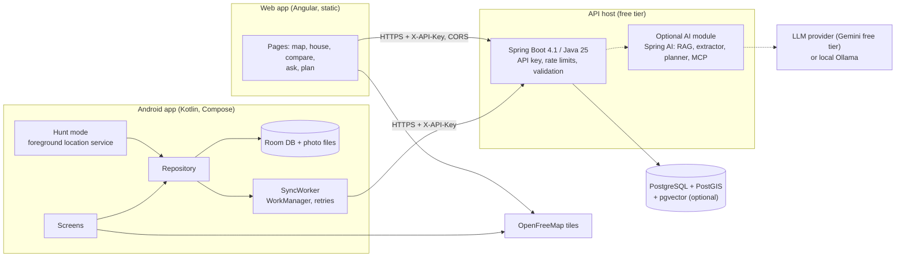

# House Hunt

A personal, zero-cost app for hunting rental and for-sale houses in India. Save every house you see with its
price, BHK, a 10-point checklist, star rating, photos, contact and notes; compare your favourites side by side; and
turn on **Hunt mode** while you walk around, so your phone tells you when you pass a house or enter a street you have
already seen. Works fully offline on Android and syncs to your own server and a web app when you are online.

English · हिन्दी · தமிழ் · తెలుగు

## Features

| | Android app | Web app |
|---|---|---|
| Houses: save at your GPS position or anywhere on the map, checklist (0–5 × 10), rating, status, price in ₹, photos, visits | Yes (offline-first) | Yes |
| Map (OpenFreeMap tiles, no API key), list with search, filter and sort, side-by-side compare | Yes | Yes |
| **Hunt mode**: alerts near visited houses and known streets, automatic visit detection, battery-aware | Yes | – |
| Sync: offline edits, photo deletes and tombstones; photos on Wi-Fi only (optional) | Yes | Always online |
| Four languages, WCAG 2.2 AA (web), TalkBack support and dark theme (Android) | Yes | Yes |
| Optional AI (off by default): ask questions about your houses with cited sources, fill a house from pasted listing text, plan a walking route of visits | Yes | Yes |
| Privacy: your own server, encrypted API key on the phone, photos stored without location metadata, export and delete-all | Yes | Yes |

## Screenshots

_Placeholder: add `docs/img/android-map.png`, `docs/img/android-house.png`, `docs/img/web-map.png` and
`docs/img/web-compare.png` once a build has been run on a device._

## Architecture



| Folder | What |
|---|---|
| [`backend/`](backend/) | Spring Boot API, Flyway migrations (V1 schema, V2 optional pgvector, V3 photo tombstones), tests |
| [`android/`](android/) | Android app (minSdk 26, targetSdk 36), AGP 9.4 with built-in Kotlin |
| [`web/`](web/) | Angular 22 single-page app, see [web/README.md](web/README.md) |
| [`docs/`](docs/) | Secure-SDLC documents 01–09 and the AI design |
| [`.github/`](.github/) | CI workflows (backend, web, android, security scans) and Dependabot |

## Quick start (local)

You need Docker. Everything else runs in containers.

```bash
export APP_API_KEY=$(openssl rand -hex 24)   # the API refuses to start without a key
docker compose up --build                    # PostGIS + pgvector and the API on http://127.0.0.1:8080
curl -H "X-API-Key: $APP_API_KEY" http://127.0.0.1:8080/api/stats
```

Web app: `cd web && npm install && npx ng serve`, open <http://localhost:4200>, enter `http://localhost:8080` and the
key. Android emulator: use `http://10.0.2.2:8080` as the server URL (plain `http://` is allowed only for localhost and
the emulator; everything else must be `https://`).

To try the AI features locally, also export `APP_AI_ENABLED=true` and `AI_API_KEY=<free Gemini API key>` before
`docker compose up` (details in [docs/ai/ai-design.md](docs/ai/ai-design.md)).

## Deploy for free

Full steps and the environment variable reference are in
[docs/07-secure-build-and-deploy.md](docs/07-secure-build-and-deploy.md#6-free-tier-deployment). In short:

1. **Database**: a free Supabase (Mumbai region) or Neon project with the `postgis` extension. Use `sslmode=require`.
2. **API**: Render or Koyeb free web service from `backend/` (Docker), or an Oracle Cloud Always Free VM behind Caddy.
   Set `DB_URL`, `DB_USER`, `DB_PASSWORD`, `APP_API_KEY` (32+ random characters) and `APP_CORS_ORIGINS`.
3. **Web**: Cloudflare Pages (or Netlify), root `web`, build `npm run build`, output `dist/web/browser`.
   `public/_headers` adds the Content-Security-Policy and HSTS.
4. **Android**: see below.

## Install the Android app

There is no Play Store listing. Every push to `main` builds a debug APK:

1. On GitHub, open **Actions → Android → the latest green run**, download the artifact **`house-hunt-debug-apk`**
   and unzip it.
2. Copy the `.apk` to the phone and open it (allow "Install unknown apps" for your file manager when asked).
3. Open House Hunt → **Settings**: server URL `https://…`, paste the API key, **Save and test**, then **Sync now**.

The app works without a server too; everything is stored on the phone until you connect one. Signed release builds
are planned (docs/07 §5).

## Documentation

| Doc | Topic |
|---|---|
| [01 Requirements](docs/01-requirements.md) | FR/NFR/SEC/PRV/AI requirements and the traceability matrix |
| [02 Threat model](docs/02-threat-model.md) | STRIDE, abuse cases, findings F-01..F-26 and their status |
| [03 Design](docs/03-design.md) | Architecture, data model, API reference, sync algorithm, ADRs |
| [04 Data flows](docs/04-data-flow-diagrams.md) | DFDs and data classification |
| [05 UX, accessibility, i18n](docs/05-ux-accessibility-i18n.md) | Design tokens, WCAG 2.2 AA, TalkBack, translations and glossary |
| [06 Test plan](docs/06-test-plan.md) | Unit, integration, security, field and AI tests |
| [07 Build and deploy](docs/07-secure-build-and-deploy.md) | CI/CD, supply chain, free-tier deployment, environment variables |
| [08 Operations](docs/08-operations-runbook.md) | Monitoring, backups, key rotation, incidents, export and deletion |
| [09 OSI resilience](docs/09-osi-layer-analysis.md) | Behaviour under bad GPS, captive portals, flaky networks, cold starts |
| [AI design](docs/ai/ai-design.md) | Providers, RAG, extractor, planner, MCP, API contract |

## Contributing and keeping the docs current

This is a personal project, but it follows a secure SDLC, so changes follow a few rules:

1. **One pull request per change, code and docs together.** CI must be green: `Backend`, `Web`, `Android` and
   `Security` workflows (tests, Semgrep, gitleaks, Trivy, npm audit).
2. **Strings**: add every user-visible text in all four languages: `web/src/app/i18n/{en,hi,ta,te}.ts` (the build fails
   if one is missing) and `android/app/src/main/res/values{,-hi,-ta,-te}/strings.xml` (lint reports missing ones).
   Rules and glossary: [docs/05](docs/05-ux-accessibility-i18n.md#9-translation-workflow).
3. **Database changes** are new Flyway files `V<n>__description.sql` (next free number; never edit an applied one).
   Room schema changes need a version bump and a `Migration`.
4. **Security-relevant changes** (new endpoint, data flow, third party, auth or storage change) update the threat model
   (02), the DFDs (04) and, for network behaviour, the OSI review (09).
5. **Docs versioning**: bump the document version, add a dated change-log row, keep requirement and test ids stable,
   and update the traceability matrix in 01 and the test plan in 06. The full rules are in
   [docs/README.md](docs/README.md#how-to-update-these-documents).
6. **Secrets** never go into git: use environment variables and GitHub Secrets. `.env`, keystores and APKs are ignored.
