# 03: Software design document

| Field | Value |
|---|---|
| Document | Software Design Document (SDD) |
| Version | 0.22 |
| Date | 2026-09-24 |
| Author | Claude (Cowork) |
| Status | Draft |

## Change log

| Version | Date | Author | Change |
|---|---|---|---|
| 0.1 | 2026-09-22 | Claude (Cowork) | First version: architecture, C4, deployment, ERD, sequences, states, API reference, sync, geospatial, ADRs. Android edit and settings screens are described from the intended behaviour. |
| 0.2 | 2026-09-22 | Claude (Cowork) | Wave 2: filter chain (headers, size limit, rate limit, deny-by-default key check), photo tombstones (V3), ordered sync versions, client clock guard, export/erase endpoints, Android networking/i18n/Assistant, web AI pages and confirm dialog. Sequences 7.5 to 7.7 now describe built code. |
| 0.3 | 2026-09-22 | Claude (Cowork) | Sprint 1 fixes and Sprint 2 ([10](10-sprint-log.md)): web MapLibre GL 6.10 (ESM module worker served from `/maplibre/`, CSP `worker-src 'self'`, no `blob:` worker; F-27), compileSdk 37, embedded Tomcat 11.0.25 override (F-28), 32-char API key minimum and `APP_API_KEY_NEXT` dual key (F-01, SEC-017), release signing config (F-11), `SyncRules`/`StreetAlerts` extracted on Android, DB image runs as `postgres` (F-29). |
| 0.4 | 2026-09-22 | Claude (Cowork) | Sprint 3 ([10](10-sprint-log.md)): section 13 Providers row: embeddings now go to the native Gemini endpoint `models/{model}:batchEmbedContents` with the key in the `x-goog-api-key` header (`GeminiEmbeddingModel`, `AI_EMBEDDING_PROVIDER`, default `google-genai`; `openai` for Ollama); reindex returns 503 when a batch fails. Sequence 7.5 shows the question embedding call. Corrected the redaction claims (system context diagram, section 7.5 Ask sequence, AI data sources row): the contact name is not redacted before the LLM provider ([02](02-threat-model.md) F-30). |
| 0.5 | 2026-09-22 | Claude (Cowork) | Sprint 3 lead decisions ([10](10-sprint-log.md)): contact redaction (C-13, F-30 Fixed by the AI team): the system context diagram, sequence 7.5 and the section 13 AI data sources row now say that `ContactRedactor` keeps the contact name and phone out of the embedding text, Ask context and tool results. F-01 split in [02](02-threat-model.md) v0.6: `WebConfig` row points at F-01a, ADR-03 at F-01a/F-01b. |
| 0.6 | 2026-09-22 | Claude (Cowork), Docs team | New **ADR-13**: product renamed from House Hunt to **Doorprints** (tagline "Remember every house you've seen."): reason, what changed (display name, tagline, `applicationId` `app.doorprints`, CI artifact names, launcher icon, export file name, MCP server name) and what did not (Java/Kotlin packages and class names, repository name, storage keys, database, role, image and volume names, export format id, MCP tool names). System context and container diagrams, the export row in section 9 and the MCP row in section 13 use the new names. |
| 0.7 | 2026-09-22 | Claude (Cowork), Docs team | Vertex AI provider (AI team, same change set; [01](01-requirements.md) AI-016, [10](10-sprint-log.md) C-24). Section 13 Providers row now describes both providers and the `app.ai.provider` (`AI_PROVIDER`) switch: **aistudio** (default; OpenAI-compatible chat, native `batchEmbedContents` with `x-goog-api-key`) and **vertex** (chat through Spring AI's Google GenAI starter with the app's own google-genai `Client`; embeddings through the app's `VertexEmbeddingModel`, `:embedContent` or `:predict`, one text per call; OAuth bearer tokens from Application Default Credentials, no API key; `<location>-aiplatform.googleapis.com`). Section 9 and 13: the `503` problem for provider quota errors now carries `code: AI_QUOTA_EXHAUSTED` and a `Retry-After: 60` header; the spend cap case is open (AI-017). Section 2 context diagram and section 4.1 errors row updated. Review fix: section 9 and the section 4.1 errors row add the `setupHint` property on Vertex AI 401/403/404 (`AiExceptionHandler.SETUP_HINT_PROPERTY`). |
| 0.8 | 2026-09-22 | Claude (Cowork), Docs team | Sprint 3.5 "KMP foundation" (commit `8f583af`, [10](10-sprint-log.md) §9). New **ADR-14**: Kotlin Multiplatform-ready Android code base with a `:shared` module (Android + compile-only `iosArm64`/`iosSimulatorArm64`), Ktor 3.6 client replacing OkHttp's `RetryInterceptor`, Room staying in `:app` until Phase 2. Section 1 Android row (Ktor client with the OkHttp 5.5 engine, version catalog); section 4.2 component diagram and table (`ApiClient`, `RetryPolicy`, `SyncOutcome`, `SyncRules`, `StayDetector`, `StreetAlerts`, `Geo`, `HouseScore` now in `:shared`; `Api.kt` holds the app-wide `HttpClient`); new section 4.2.1 with the module boundaries and the Phase 2 plan; section 6.2: Room schema export on, `2.json` committed and `RoomSchemaTest` pins the identity hash; 6.3 score in `HouseScore`; **R-06** partly closed (migration test still open). ADR-01 notes the Sprint 4b *Hunting areas* exception (Geofencing API with an opt-in background permission, [11](11-feature-parity-and-export-spec.md) 5.17); the 11 proposals renumber to ADR-15..ADR-18. |
| 0.9 | 2026-09-22 | Claude (Cowork), Docs team | **Sprint 4a (S4-06): local-first clients and the offline copy.** New **section 16**: where the exporters live (one pure model in `:shared` and its TypeScript port, platform glue per app, no clock inside), what a copy contains and the single gate (`ExportBundle.build`) that applies every option, import (`ImportPlan`: merge by last-write-wins, import-as-a-copy with re-identified rows and a `photoSources` map, validation before any write), and the web app as a local-first installable app (IndexedDB, `MemoryDb` fallback, app-shell-only service worker, announced updates, install as a menu item, stated durability, GitHub Pages hosting and its header gap). New **ADR-19** (the local-first web app adds **no npm dependency**: own IndexedDB wrapper, own ZIP writer, own XLSX writer, `crypto.subtle`, hand-written service worker — with the cost stated) and **ADR-20** (one backup format `doorprints-backup/1` implemented three times, ZIP entries **stored** not deflated so the output stays byte-identical). Section 9: `GET /api/export` now emits the shared format, new `POST /api/import` with `?dryRun=true` and its two 413 caps. Section 4.3 web components rewritten (`configGuard` gone, `LocalDb`/`LocalStore`, `SyncService`, `StorageService`, `PwaService`, exporters). ADR-13's "export format id unchanged" note marked superseded. **R-05 closed.** Where the code differs from [11](11-feature-parity-and-export-spec.md) 5.2/5.10 the code is described, not the plan: four CSV tables rather than seven, no PDF writer on the web (print view instead), no Dexie/`idb`/`fflate`/`@angular/pwa`. |
| 0.10 | 2026-09-22 | Claude (Cowork), Docs team | Review fix, §16.4: the durability bullet said the browser will not promise persistence "(always the case in Safari)". Reworded to what [MDN's *Storage quotas and eviction criteria*](https://developer.mozilla.org/en-US/docs/Web/API/Storage_API/Storage_quotas_and_eviction_criteria) actually states — Safari and Chromium decide automatically from interaction history without prompting (Safari commonly denies), Safari evicts script-written storage after seven days without user interaction, and a Home Screen / Dock web app gets the browser app's quota — with the same conclusion: persistence is not something to rely on. Matches [02](02-threat-model.md) RR-10 v0.16. No design or code change. |
| 0.11 | 2026-09-22 | Claude (Cowork), Docs team | Fifth review round (docs versus the web code as built). **§4.3 `PwaService`**: it no longer "registers `/sw.js`" for "an Install app menu item" — it registers `sw.js` beside `index.html` with the scope taken from `document.baseURI` (`/` or `/doorprints/`), keeps `beforeinstallprompt` for the permanent *Install the app* card on *Your data* and a **one-time banner** after the first saved house with a **30-day** "Not now", and gates the update reload on unsaved changes. **§16.4**: the "Install is a menu item" bullet is replaced by what is built (banner once, snooze, one non-error banner at a time in the order migration > update > install > storage risk, permanent card); the service-worker bullet and the diagram said "app shell only" and "network first" — the worker precaches **every file of this build** and answers navigations **from the cache first**; the hosting bullet records the build-stamped absolute manifest `id`. **§16.2 PDF row**: on the web, **phones** (Android and iOS, browser or installed) open the HTML copy in a **new tab** with a translated hint, **desktops** print it through a hidden frame. **ADR-20** says how the format is pinned today (server and Android read the canonical sample; the web golden is compared with it by `BackupParityTest`). |
| 0.12 | 2026-09-23 | Claude (Cowork), Docs team | **Owner decision (Sriram, 2026-09-23): the web app is hosted on Cloudflare Pages, not GitHub Pages.** New **ADR-21** (hosting; ADR-15..ADR-18 stay reserved for the Sprint 5 decisions named in [11](11-feature-parity-and-export-spec.md)). **§5** deployment: the diagram shows `web.yml` deploying to Cloudflare Pages with `wrangler pages deploy`, and the *Web* row names Cloudflare Pages as the host, its SPA fallback (no `404.html` in the build) and the post-deploy header check. **§4.3 `PwaService`** and **§16.4 Hosting**: the site is served from the root (`/`, manifest `"id": "/"`); the `/doorprints/` project path and the shared `github.io` origin are gone. **§16.3**: how Android writes an import — merge row by row (interruptible, finished by importing again), copy in one transaction (all or nothing), Android handover item 10. |
| 0.13 | 2026-09-23 | Claude (Cowork), Docs team | Review fixes to 0.12. **ADR-21** alternative (c) overclaimed: Cloudflare's SPA mode and `_headers` handling were not "verified against the build"; they are documented by Cloudflare and were read from workers-sdk, and the first live check is TC-S-23. The secure-doc-viewer evidence now cites its `gh-pages` branch at `68e3a625`. **§16.4 Hosting**: one line on caching — no long-lived rule in `_headers`, because the SPA fallback answers a missing chunk with HTML and status 200 (the Web team removed those rules on 2026-09-23). |
| 0.14 | 2026-09-23 | Claude (Cowork), Docs team | **Owner decision of 2026-09-23: Firebase Hosting at `https://doorprints.web.app` replaces the Cloudflare Pages plan**, which was never set up. **ADR-21** rewritten as the hosting decision with its history: GitHub Pages rejected (shared origin, no response headers), Cloudflare Pages rejected by the owner because a `*.pages.dev` address reads as a development or test site, Firebase Hosting (Spark plan, no billing account, project and site `doorprints`) chosen with the brand advisor; deploy by `web.yml` with Workload Identity Federation (no key) and a pinned `firebase-tools`; this also retires the old Consequences sentence about "two repository secrets" (coordinator minor). **§5**: the diagram and the *Web* row describe Firebase Hosting, `web/firebase.json` and the post-deploy header check, and the row now lists `Referrer-Policy` among the headers checked (coordinator minor); the *TLS* row names Firebase. **§4.3** `PwaService` and the *Pages* row (the AI helper is now *Fill in from listing text*); **§12** *Transport* (HSTS from `web/firebase.json`); **§16.4 Hosting** rewritten; the container diagram's static host. |
| 0.15 | 2026-09-23 | Claude (Cowork), Docs team | **ADR-13**: one line added. Since the final Sprint 4a round the web icons (`favicon.svg`, the PWA icons, `apple-touch-icon.png`) are redrawn from the same launcher mark, so both platforms show the door-and-footprints icon. The brand rule is [12](12-brand-and-naming.md) N-06. |
| 0.16 | 2026-09-24 | Claude (Cowork), Docs team | **Owner issue P0 of 2026-09-24: India's boundaries on the map** (Jammu and Kashmir, and the same issue near Arunachal Pradesh; branch `fix/india-boundaries`). New **ADR-22**: both apps show India's external boundary as the Government of India depicts it, the only view, with no Line of Control, Line of Actual Control or other claim line; the data (Natural Earth, India point of view, public domain, `natural-earth-vector` commit `ca96624`, the four claim boxes), the five style rules as built (web `shared/india-boundaries.ts`, Android `ui/IndiaView.kt` and `ui/IndiaViewRules.kt`), the alternatives and the consequences. **§4.2** `MapScreen` and **§4.3** the map-style row name the rules and where they run (Android `loadStyle`, web `createMlMap` on every `style.load`). **ADR-02** points to ADR-22. Working tree, not yet built in CI. |
| 0.17 | 2026-09-24 | Claude (Cowork), Docs team | Round 1 review of the Docs change for India's boundaries (two majors, one minor). **ADR-22** re-synced with the code as of 2026-09-23 19:56 UTC (2026-09-24 01:26 IST) (Android `IndiaViewRules.kt`, `IndiaView.kt`, `IndiaViewRulesTest.kt` and `android/shared/README.md` 1.37 changed after 0.16 was written; web `india-boundaries.ts` compared rule by rule). Rule 2 now says what Android does: `boundary_2` draws only lines that carry at least one adm0 side and are not a PAK/CHN pair, and why (MapLibre shows a zoom 0-4 parent tile while a zoom 5+ tile loads or is missing offline, and checks minzoom against the map zoom); the web lacks the adm0 part, recorded as an **open parity gap** handed to Web ([11](11-feature-parity-and-export-spec.md) §10), so "identically on both apps" is gone. Rule 3: Android's `in-boundary-world` maxzoom is `Math.nextDown(5f)`, the same behaviour as the web's exclusive maxzoom 5. **Consequences** corrected: `boundary_2` is not clipped to the boxes, so inside them the tiles' non-disputed country lines draw beside the 1:10m outline (two close lines when zoomed in; where, from a decode of the zoom 5 and 6 tiles of the 2026-09-13 planet); offline at zoom 5+ with only zoom 0-4 tiles, only the outline draws; `boundary_3` (dashed admin lines) is left as Liberty has it, and in the decoded tiles no Pakistani or Chinese unit line inside the outline passes its filter. New backlog ids [10](10-sprint-log.md) S4b-BL-11 and S4b-BL-12. |
| 0.18 | 2026-09-24 | Claude (Cowork), Docs team | Docs re-synced with the code at HEAD `3ad2b58` (comment and docs round, no behaviour change). **ADR-22:** the "open parity gap (web)" is removed: the web's `shared/india-boundaries.ts` applies the same rules as Android, and the constant names are now the code's (`COUNTRY_LINE_RULE`, `COUNTRY_LINE_RULE_LEGACY`, `TILE_ZOOM_GUARD`; the 0.17 names `NOT_PAKISTAN_CHINA*` no longer exist). Rule 2 gains the **tile-zoom guard** `[">=", ["zoom"], 5]` on `boundary_2`, `boundary_3` and every other `boundary` line layer from zoom 5 (never `boundary_disputed`; a deprecated-syntax filter is left unguarded with a warning, also in rule 5). **Renderer claim corrected** (0.17 said both renderers draw a zoom 0-4 parent tile's lines through a minzoom 5 layer): read from the sources, neither does. maplibre-gl 6.10.0 skips a layer's bucket for a tile below `floor(minzoom)` (`worker_tile.ts:109`, `style_layer.ts:321-322`), and maplibre-native android-v13.6.1 leaves such a layer out in `GeometryTile::setLayers` (`geometry_tile.cpp:317`) before the worker's parse loop (`geometry_tile_worker.cpp:446-502`, which has no check of its own and evaluates filters with `overscaledZ` at :502). So the adm0 clause and the tile-zoom guard are defence in depth on both apps, not the Android fix that this round's brief and `android/shared/README.md` 1.39 state (the Web team's `web/README.md` row of 2026-09-24, finding (4), raised `geometry_tile.cpp:317`; Docs checked it in the source). Not observed on a device. **Consequences:** "about a kilometre" replaced by the measured figures (claim versus the true line: median about 1.55 km Jammu-Sialkot, about 1.6 km McMahon line, p90 3.9 km; tile versus claim: median 1.5-2.8 km, at most 5.3 km); the doubled-line list follows `android/shared/README.md` 1.38 item 38 (b) (Arunachal-Bhutan, Arunachal-Myanmar and Jammu-Sialkot are not doubled; in the east box only Bhutan's south-east corner and Myanmar south of 26.65 N; the Wakhan added); new known limit, the Assam-Arunachal Pradesh state line is not drawn from zoom 5 (S4b-BL-15); style-side fix for the doubled lines S4b-BL-16 ([10](10-sprint-log.md) §12.7). |
| 0.19 | 2026-09-24 | Claude (Code), lead | **ADR-13**: the favicon no longer leaves the toes out; since option C ([14](14-lead-backlog-and-handoff.md) N3, PR #15) it has the same three footprints as the app icons. |
| 0.20 | 2026-09-24 | Claude (Code), Docs team | **ADR-22** re-synced with branch `fix/india-boundary-lines` (PR #16, HEAD `9e0036e`; S4b-BL-11, S4b-BL-15, S4b-BL-16). **Rule 2** also leaves out India's line with China (China on one side, India or no country on the other; `INDIA_CHINA_LINE` on both apps, both syntaxes): the outline draws the whole India-China border at every zoom. **Data:** new file (415 689 bytes, sha256 `2c497e2e…56d7`), three kinds: `world` now also holds the 7 **shared stretches** of India's outline with Nepal, Bhutan, Myanmar and, in the Wakhan, Afghanistan along which the tiles draw India's border themselves (drawn below zoom 5 only), `claim` the rest with a connector of about 7 km at most at each hand-over and none at a box edge, new `state` (the Assam-Arunachal Pradesh line, Natural Earth 1:10m admin-1); how `find_shared_stretches.py` finds the stretches. **Rule 3:** new layer `in-boundary-state` from zoom 5, directly above `boundary_3` and drawn like it. **Consequences:** the two close lines and the missing state line are gone; new: the hand-over steps, the 3-5 km loops at Sikkim's two tri-junctions, and the shared stretches without a line at zoom 5+ while tiles load or offline. |
| 0.21 | 2026-09-24 | Claude (Code), Docs team | **ADR-22** after the Singalila spur fix (round 2 reviews): new data file (415 608 bytes, sha256 `25984afa…a024`; `claim` 5 pieces, 1 667 points; `world`, `state` and the 7 shared stretches unchanged), a cut within 1e-4 degrees of a `claim` line's end counts as the end, so no connector-only spur (two had shown into Nepal on the Singalila ridge). **Consequences:** the tri-junction loops sized (about 13 x 3 km at Nepal-China-India from about zoom 10, on glaciers; about 2 km at Doklam), the tile line running on past two hand-overs from about zoom 10 (a small hook at Jomotsangkha from zoom 9) (Jomotsangkha about 9 km, Longwa about 3 km; S4b-BL-17), and `INDIA_CHINA_LINE` also hiding about 12 km of the China-North Korea line on the Tumen islets (harmless for India). |
| 0.22 | 2026-09-24 | Claude (Code), Docs team | **Owner request of 2026-09-24: "The Compose needs to be changed to Kotlin Compose to allow easy iOS app creation".** New **ADR-23**: the Android UI moves from Jetpack Compose to JetBrains **Compose Multiplatform** in a new KMP module `:ui`, in phases P1..P8 plus a maplibre-compose spike ([10](10-sprint-log.md) §13, CMP-1..CMP-9). It amends **ADR-14** (which rejected a Compose Multiplatform UI in Sprint 3.5) and settles its Phase 2 item (4), SwiftUI or CMP. **§4.2.1** now shows `:ui` in the module diagram and the layer table; phase 1 (CMP-1) is done in commit `be86f50`: theme, list rows, server status, the Map and India view rules and a few small UI types moved to `:ui` `commonMain`, no visual change. §1 names the third module. |

Related: [Requirements](01-requirements.md) · [Threat model](02-threat-model.md) · [DFDs](04-data-flow-diagrams.md) · [UX/a11y/i18n](05-ux-accessibility-i18n.md) · [Build and deploy](07-secure-build-and-deploy.md) · [AI docs](ai/)

---

## 1. Architecture overview

| Part | Tech | Responsibility | Source |
|---|---|---|---|
| Android app | Kotlin 2.4.10, Jetpack Compose (Material 3), moving to JetBrains Compose Multiplatform 1.12.1 (ADR-23), Navigation, Room 2.8, WorkManager 2.10, DataStore, Play services location, MapLibre Android 13.6, Ktor client 3.6 (OkHttp 5.5 engine), kotlinx.serialization, Coil 3. minSdk 26, targetSdk 36, compileSdk 37 (AGP 9.4, built-in Kotlin). Two Gradle modules since Sprint 3.5: `:app` and the Kotlin Multiplatform module `:shared` (platform-neutral rules, DTOs and the API client; ADR-14); a third since 2026-09-24, the Compose Multiplatform module `:ui` (the UI an iOS app would reuse; ADR-23). Versions in one catalog, `android/gradle/libs.versions.toml`. | Offline-first capture, Hunt mode, map/list/compare, background sync | `android/` |
| API | Java 25, Spring Boot 4.1.1 (Web MVC, Data JPA, Validation, Actuator, Flyway; embedded Tomcat pinned to 11.0.25 by `tomcat.version`, F-28), PostgreSQL JDBC | REST API, LWW upserts, change feed, geospatial queries, photo storage | `backend/` |
| Database | PostgreSQL 15+ with PostGIS 3 (pgvector planned) | System of record, spatial indexes, `sync_seq` | `backend/src/main/resources/db/migration/V1__init.sql` |
| Web app | Angular 22 (standalone, zoneless, signals), MapLibre GL 6.10 (ESM, module worker from `/maplibre/`), static build | Desktop review/edit/compare | `web/` |
| AI (planned) | Spring AI 2.0.1, pgvector, Gemini free tier or Ollama, MCP server | RAG Q&A, listing extraction, route planner, MCP tools | [ai/](ai/) |

Main ideas:

- **Offline-first on Android.** Room is the phone's source of truth. The server is a sync hub plus the web app's backend.
- **Client-generated UUIDs** for houses, visits and photos. Creates are idempotent (`PUT /api/houses/{id}`, photo `id` form field).
- **Change feed by sequence.** Every write takes `nextval('sync_seq')`. Clients pull `since=<cursor>`.
- **Simple single-user security.** One API key in the `X-API-Key` header, CORS allowlist, TLS at the host edge.
- **Zero cost.** Every component has a free-tier home (section 5).

## 2. C4 level 1: system context


## 3. C4 level 2: containers

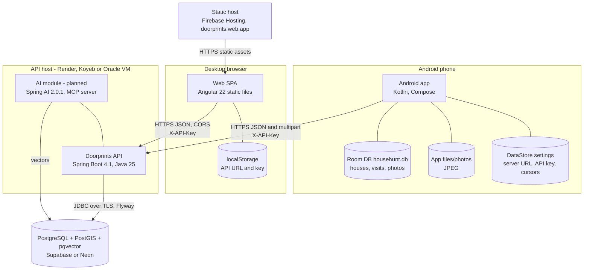

## 4. C4 level 3: components

### 4.1 API components

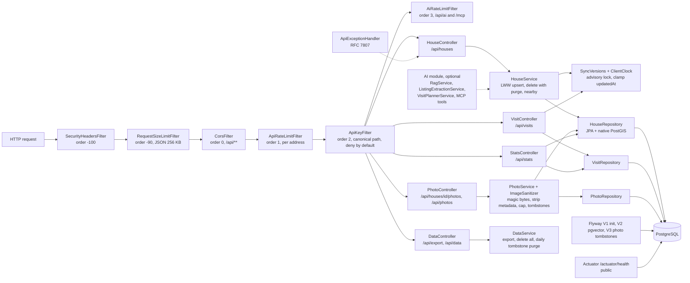

| Component | Class / file | Notes |
|---|---|---|
| Config | `config/AppProperties`, `config/WebConfig` | Fails at startup if `APP_API_KEY` is missing or shorter than 32 chars, or `APP_API_KEY_NEXT` is set and shorter than 32 (`ApiKeyFilter.validateKeys`, F-01a). Registers the filter chain (see diagram) and `@EnableScheduling`. `app.rate-limit.*`, `app.limits.*`, `app.sync.*`, `app.privacy.*`. |
| Auth | `config/ApiKeyFilter`, `RequestPaths` | Deny by default. Allowlist: `GET/HEAD /actuator/health[/**]` and CORS preflights. Non-canonical paths get 400 first. Accepts the current key and, during a rotation, the next key (SEC-017); every configured key is compared in constant time. Failed keys logged (salted address hash) and throttled to 429. |
| Limits and headers | `config/ApiRateLimitFilter`, `RequestSizeLimitFilter`, `SecurityHeadersFilter` | Token bucket per address (reuses `TokenBucketRateLimiter`), JSON body cap, `nosniff`/`DENY`/`no-referrer`/CSP/HSTS/`no-store` |
| Sync safety | `sync/SyncVersions`, `sync/ClientClock` | Advisory lock + `nextval` (section 10.4); clamp or reject client times |
| Privacy | `privacy/DataController`, `DataService` | Export, delete-all with confirmation header, daily purge of tombstones older than 90 days |
| Houses | `house/HouseController`, `HouseService`, `HouseRepository`, `House`, `HouseDto`, `HouseStatus` | Checklist is an `@ElementCollection` into `house_checklist` |
| Visits | `visit/VisitController`, `VisitRepository`, `Visit`, `VisitDto`, `VisitSource` | LWW logic is in the controller (not in a service, unlike houses). A deleted visit keeps no place (`purgePlace`). |
| Photos | `photo/PhotoController`, `PhotoService`, `ImageSanitizer`, `PhotoRepository`, `Photo`, `PhotoDto` | `bytea` storage, 30-day private cache header, tombstones with sync versions, change feed |
| Stats | `house/StatsController` | Counts |
| Errors | `common/ApiExceptionHandler`, `NotFoundException`, `ConflictException` | 400 / 404 / 409 / 413 as `ProblemDetail` (428 from `DataController`, 429 from the filters, 503 from `AiExceptionHandler`, with `code: AI_QUOTA_EXHAUSTED` and `Retry-After: 60` when the provider's quota is exhausted, and `setupHint` on a Vertex AI 401/403/404) |

### 4.2 Android components

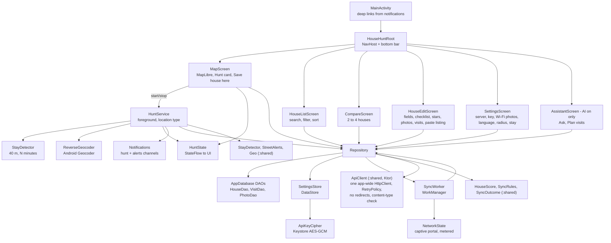

| Component | File | Responsibility |
|---|---|---|
| `HouseHuntApp` / `AppContainer` | `HouseHuntApp.kt` | Manual DI. Initialises MapLibre, notification channels and periodic sync. |
| `MainActivity` | `MainActivity.kt` | Turns notification extras into a `DeepLink` (open house / new house at lat,lon with visitId) |
| `HouseHuntRoot` | `ui/Root.kt` | Tabs: Map, Houses, Compare, (Assistant when AI is on), Settings. Routes `house/{id}` and `new?lat&lon&visitId`. Wraps everything in `HouseHuntTheme` (`ui/Theme.kt`: web tokens, dark scheme). |
| `MapScreen` | `ui/MapScreen.kt` | GeoJSON source of houses coloured by status, location dot, tap to open, long-press to create, Hunt card, permission requests (fine + coarse + notifications). Every style load (`loadStyle`, the only `setStyle` in `android/`, first load and each retry) first calls `applyIndiaView(style)` (`ui/IndiaView.kt`; the rules as data in `ui/IndiaViewRules.kt`): India's boundary as the Government of India shows it (ADR-22) |
| `HouseListScreen`, `CompareScreen` | `ui/*.kt` | List with search/filter/sort. Compare up to 4 (shortlisted first). |
| `HouseEditScreen` | `ui/HouseEditScreen.kt` | Every FR-002..FR-007 field; status as segmented buttons; rating and each checklist item as radio groups (TalkBack state); camera/gallery via `FileProvider` (`cache/camera/`), 20-photo cap; visit list, "I am here now"; "Paste listing" (AI) fills empty fields from `POST /api/ai/extract-listing` |
| `SettingsScreen` | `ui/SettingsScreen.kt` | Server URL (HTTPS check, `ServerUrl`), API key (masked hint, blank keeps the saved key), Save and test, Sync now, last sync result (translated `SyncOutcome`), photos only on Wi-Fi, language picker (`i18n/AppLocale`), Hunt settings, privacy note |
| `AssistantScreen` | `ui/AssistantScreen.kt` | Ask (answer without `[house:id]` markers, cited houses as cards) and Plan visits (stops in order with leg distance and time) |
| `HuntService` | `location/HuntService.kt` | Section 7.2, 7.3, 8.2 |
| `StayDetector`, `StreetAlerts`, `Geo` | `:shared` `com.househunt.shared.location` | Pure stay logic, street-alert rule and haversine distance (`Geo.distanceM`), unit-tested in `commonTest` (section 4.2.1) |
| `ReverseGeocoder` | `location/ReverseGeocoder.kt` | Android Geocoder wrapper (API 33+ async), 10 s limit |
| `Repository` | `data/Repository.kt` | Only way to write data. Sets `dirty` + `updatedAt`, calls `syncSoon`, handles photos (downscale, EXIF rotation, JPEG q80, cap, offline delete queue), sync algorithm (section 10), AI calls and `aiEnabled` state |
| `SyncWorker` | `data/SyncWorker.kt` | Unique one-time "sync-now" (3 s delay, REPLACE) + 30-min periodic job + "sync-photos-wifi" (UNMETERED). Needs a network; skips captive portals. Exponential backoff from 30 s, up to 5 attempts; no retry on auth failure. |
| `ApiClient`, `RetryPolicy`, DTOs, `IsoTime`, `ApiException` | `:shared` `com.househunt.shared.api` (since Sprint 3.5; replaced `data/RetryInterceptor.kt` and the OkHttp client) | Suspending Ktor client: `X-API-Key`, own JSON encoding (`ignoreUnknownKeys`, `explicitNulls = false`), `Content-Type` check before decoding (captive portals), redirects never followed, typed `ApiException` kinds, retries of idempotent calls and the marked photo upload on network errors and 408/429/502/503/504 with full-jitter backoff (1 s base, 15 s cap, 3 attempts, short `Retry-After` honoured), 4-minute limit per call including retries (`ApiTimeoutException`), streamed photo upload (docs/09 L4) |
| `Api` | `data/Api.kt` | One app-wide Ktor `HttpClient` (`AndroidApiHttp`: OkHttp engine, connect 20 s, read 90 s, write 60 s, no redirects), so every `ApiClient` shares one connection pool; debug log of status, method and path only |
| Mappers | `data/Mappers.kt`, `data/ModelLabels.kt` | Room entity ↔ DTO (epoch ms ↔ ISO-8601 through `IsoTime`), translated labels for shared statuses and checklist keys |
| `SettingsStore`, `ApiKeyCipher`, `ServerUrl` | `data/*.kt` | DataStore settings; the key is stored as `v1:` + Base64(IV + AES-GCM ciphertext); URL validation (`java.net.URI`) |
| `SyncOutcome`, `SyncRules`, `HouseScore` | `:shared` `com.househunt.shared.sync`, `.model` | Last sync result as a stored code (errors classified without server text), last-edit-wins rule, overall score and ranking |
| `AppLocale` | `i18n/AppLocale.kt` | Per-app language: `LocaleManager` on API 33+, SharedPreferences + context wrapping on 26–32 |

### 4.2.1 Kotlin Multiplatform module boundaries (`:shared`, Sprint 3.5, ADR-14; `:ui`, ADR-23)

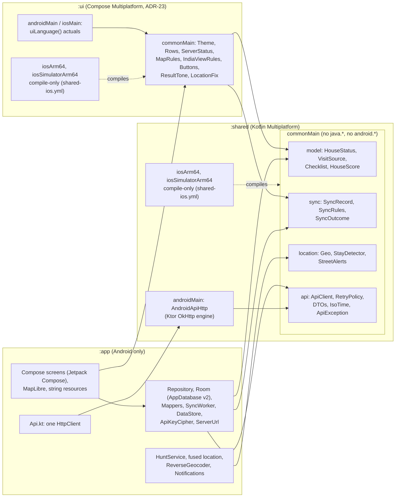

| Layer | Contents | Rule |
|---|---|---|
| `commonMain` | Everything an iOS app would reuse: wire and database names, business rules, the HTTP client and its DTOs | Only Kotlin stdlib, `kotlin.time`, `kotlin.math`, kotlinx.coroutines, kotlinx.serialization, kotlinx.io and Ktor client core. No `java.*`, `android.*`, `System.*`, `String.format`, `Thread`. The macOS job `shared-ios.yml` enforces this by compiling the iOS targets. Names with a wire or database meaning (`HouseStatus`, `VisitSource`, checklist keys, `SyncOutcome` codes) never change; tests pin them. |
| `androidMain` | `AndroidApiHttp` (Ktor OkHttp engine, timeouts, `followRedirects(false)`) | Platform glue behind a common type (`HttpClientEngine`) or an injected function (`debugLog`) |
| `iosMain` | Not created yet (Phase 2: `ktor-client-darwin`) | – |
| `:ui` (ADR-23, since `be86f50`) | Compose Multiplatform UI code that is not tied to Android: the theme (`HouseHuntTheme`, language lookup `expect fun uiLanguage()`), list rows, the server status and its rules, the Map and India view rules, `ButtonLabel`, `ResultTone`, `LocationFix`; `ServerStatusTest` in `commonTest`. Kotlin package `com.househunt.app.ui`, Android namespace `com.househunt.ui` | Same `commonMain` rules as `:shared`; `api(project(":shared"))` and the Compose Multiplatform libraries (1.12.1; material3 1.9.0). The screens move here phase by phase ([`android/ui/README.md`](../android/ui/README.md) §6) |
| `:app` | Room (entities implement the shared `SyncRecord`), mappers, WorkManager, DataStore and Keystore, location and notification services, the Compose screens not yet moved to `:ui`, MapLibre, translations | Stays Android-only until its ADR-23 phase; reasons per item in `android/shared/README.md` section 3 |

Build and test: `:shared` uses the Kotlin Multiplatform plugin and AGP's `com.android.kotlin.multiplatform.library`
(`kotlin { android { … withHostTest {} } }`). Its JVM tests are the task `:shared:testAndroidHostTest`, which
`:app:testDebugUnitTest` depends on and `android.yml` also names. On Linux the iOS tasks are skipped
(`kotlin.native.enableKlibsCrossCompilation=false`); `shared-ios.yml` compiles the iOS main and test klibs on
macOS without linking, signing or a simulator. `:ui` is built the same way (plus the `kotlin.compose` plugin): `:ui:testAndroidHostTest`, which `:app:testDebugUnitTest` also depends on and `android.yml` names, and its iOS klibs in the same `shared-ios.yml` job. Test detail: [06](06-test-plan.md) §3; CI: [07](07-secure-build-and-deploy.md) §1.

Behaviour kept from the OkHttp client (pinned by `ApiClientContractTest`): same request JSON and URLs, same retry
rules and numbers, captive-portal detection, no redirects, same error kinds. Intentional, invisible differences:
Ktor's `Accept`/`Accept-Charset`/`User-Agent` headers, and a connection dropped while a retriable response body is
read is now retried too. MapLibre Android 13.6.1 is built against OkHttp 4.12 but runs on the OkHttp 5.5.0 that Ktor
brings; no CI job exercises MapLibre networking, so `android/shared/README.md` §5 has a manual map-tile smoke test
for every Ktor, OkHttp or MapLibre version change.

**Phase 2 plan (not scheduled; ADR-14):** (1) Room KMP (Room 2.8 in `commonMain` with the bundled SQLite driver),
keeping `househunt.db`, version 2, `MIGRATION_1_2` and the committed `2.json`, plus a migration test from real v1/v2
files; then the mappers move. (2) DataStore KMP for settings and cursors; `expect/actual` secret storage (Android
Keystore / iOS Keychain). (3) `ServerUrl` as a common parser or `expect/actual`. (4) An iOS app (SwiftUI over the
shared framework, or Compose Multiplatform), only when a Mac and the Apple Developer Program are available; there is
no paid Apple account today, so iPhone users are served by the PWA ([11](11-feature-parity-and-export-spec.md) 5.10).
(5) iOS platform services (`CLLocationManager`, `CLGeocoder`, `BGTaskScheduler`, `NWPathMonitor`).
**Since 2026-09-24 this plan is folded into ADR-23:** items (1)-(3) are its phase P4 (CMP-4), item (4) is decided for
Compose Multiplatform (the `:ui` module, phases P1-P8), and item (5) comes with the iOS shell (P8) behind the
platform seams of P3. Signing, device installs and the App Store stay out of scope while there is no Mac and no paid
Apple account.

### 4.3 Web components

| Component | File | Responsibility |
|---|---|---|
| `ConfigService` | `core/config.*` | Base URL + key in sessionStorage, or localStorage with "Remember on this device". **Since Sprint 4a `configGuard` is gone** and no route is guarded: the app is local-first, and a configured server only adds sync (section 16.4). |
| `LocalDb`, `MemoryDb`, `LocalStore` | `data/local-db.ts`, `data/local-store.service.ts` | The browser's own copy of everything: IndexedDB stores `houses`, `visits`, `photos` (blobs) and `settings`, database `doorprints` version 1. A hand-written wrapper rather than Dexie or `idb` (ADR-19). `MemoryDb` is the fallback when IndexedDB is blocked — the app still works for the session and says clearly that nothing is being kept. |
| `SyncService`, `syncRules` | `data/sync.service.ts`, `data/sync-rules.ts` | The same push/pull, cursor and last-write-wins rules as Android (section 10), against the API-key server when one is configured. Optional. |
| `StorageService` | `data/storage.service.ts` | `navigator.storage.persist()` / `estimate()`; drives the durability warnings of NFR-027. |
| `PwaService` | `core/pwa.service.ts` | Registers `sw.js` **beside `index.html`** three seconds after start (never competing with the first paint), with its URL and scope taken from `document.baseURI` (`serviceWorkerRegistration`: `/sw.js` with scope `/` at the root of `https://doorprints.web.app` on Firebase Hosting, the live host since 2026-09-23 (ADR-21); the same code gives `/<path>/sw.js` with scope `/<path>/` if a build is ever served from a sub-path). Keeps the `beforeinstallprompt` event for the permanent *Install the app* card on *Your data* and for a **one-time install banner** (`AppBanners`) after the first saved house; "Not now" there is remembered for 30 days (`INSTALL_SNOOZE_MS`). Surfaces a waiting service worker as an update banner, and the reload it offers checks `UnsavedChanges` first. Records why registration did not happen (`registrationProblem`) for a debugger, never for the user. |
| `ExportService` and the format writers | `export/*.ts` | The six formats of section 16; `zip.ts` is a small stored-entry ZIP writer and `sha256.ts` the manifest hashes, so no npm dependency was added (ADR-19). |
| `AiService`, `aiErrorMsg`, `splitCitations` | `core/ai.service.ts` | `GET /api/ai/status` → `enabled` signal (hides all AI UI when false); extract, ask, plan calls; 429/503 messages; `[house:id]` markers to links |
| `ConfirmService`, `ConfirmDialog` | `core/confirm.service.ts`, `shared/confirm-dialog.ts` | Promise-based, translated, native modal `<dialog>` replacing `window.confirm()` |
| `apiInterceptor` | `core/api.interceptor.ts` | Only for `/api/...` URLs: adds the base URL prefix and `X-API-Key`. Third-party requests (Nominatim) are untouched. |
| `HouseApiService` | `core/house-api.service.ts` | All endpoints in section 9 |
| `GeocodeService` | `core/geocode.service.ts` | Nominatim reverse geocoding, only on button press |
| `resizeImage` | `core/image-resize.ts` | 1600 px JPEG q0.8 via canvas (drops EXIF) |
| `AuthImage` | `shared/auth-image.ts` | Fetches photos as blobs with the key header, then object URLs |
| `LocationMap`, `MAP_STYLE_URL`, `createMap` | `shared/*` | MapLibre GL 6 with OpenFreeMap "liberty" style. MapLibre 6 is ESM-only and no longer builds its worker from a `blob:` URL: `angular.json` copies `maplibre-gl-worker.mjs` and `maplibre-gl-shared.mjs` to `/maplibre/`, `shared/map-style.ts` calls `setWorkerUrl`, so the CSP can use `worker-src 'self'`. No WebGL 2 → a translated `role="status"` message instead of the map. Popups use `setDOMContent` + `textContent` only (F-27). **India's boundaries (ADR-22):** `createMlMap` registers `applyIndiaBoundaries` (`shared/india-boundaries.ts`) on every `style.load`, before any page listener, so the first load and every reload by `watchMapStyle` get the five rules; the data is the same-origin `geo/in-boundaries.geojson`, resolved against the base href. |
| Pages | `pages/connect`, `map`, `house-detail`, `compare`, `ask`, `plan` | FR-024; `ask` and `plan` (FR-037, FR-039) are routed always but linked only when AI is on; `house-detail` has "Fill in from listing text" for new houses (FR-038; called "Import from listing text" until 2026-09-23, keys `listingFill.*`) |

## 5. Deployment (free tier)

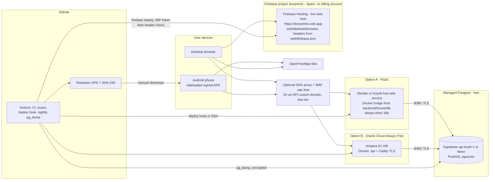

| Concern | Choice | Free-tier note (check current provider terms) |
|---|---|---|
| API runtime | Render/Koyeb free Docker service, **or** Oracle Always Free VM | PaaS sleeps after about 15 min idle, so cold starts take 30 to 60 s. The Android client uses a 90 s read timeout (NFR-002). Oracle VM is always on, but you run TLS (Caddy) and patching yourself. |
| Memory | `JAVA_TOOL_OPTIONS=-XX:MaxRAMPercentage=75 -XX:+UseSerialGC -Xss512k`, Hikari pool 5 | Fits 512 MB |
| DB | Supabase (Mumbai region available) or Neon | About 0.5 GB storage. Supabase pauses inactive free projects, so a keep-alive job is needed (08). |
| Web | **Firebase Hosting** (ADR-21), project and site `doorprints`, deployed by `web.yml` job `deploy-firebase` on pushes to `main` and manual runs; served from the root of its own origin **`https://doorprints.web.app`** (the twin `doorprints.firebaseapp.com` is never shared). Configuration `web/firebase.json` (Web team): SPA fallback = the `**` → `/index.html` rewrite (existing files win; the build has no `404.html`); headers on `**`: CSP incl. `frame-ancestors 'none'` and `worker-src 'self'`, HSTS, `X-Frame-Options`, `nosniff`, `Referrer-Policy`, `Permissions-Policy`, COOP and `Cache-Control: no-cache`. After each deploy the job checks on the live address: `/` and `/compare` for the CSP with `frame-ancestors 'none'`, `X-Frame-Options`, `nosniff`, `Referrer-Policy`, `Permissions-Policy`, COOP and `no-cache`; `sw.js` and the manifest; the build's hashed `main-*.js`; HSTS reported as a warning only on `web.app` ([07](07-secure-build-and-deploy.md) §6.3). GitHub Pages is switched off; Cloudflare Pages was never set up | Spark plan, no billing account: 10 GB storage (old releases count; 10 kept); transfer 360 MB/day on the pricing page or 10 GB/month on the quota page, plan for the stricter; **over the limit the site is disabled** until the period resets, and Spark has no budget alert ([08](08-operations-runbook.md) §2, §7 IR-5) |
| TLS | Provider edge TLS (Render/Koyeb, Firebase Hosting) or Caddy on the VM | Required by SEC-004 |
| CI | GitHub Actions | Free for public repos, 2 000 min/month for private |

## 6. Data model

### 6.1 Server ERD (matches `V1__init.sql` + `V3__photo_tombstones_and_privacy.sql`)

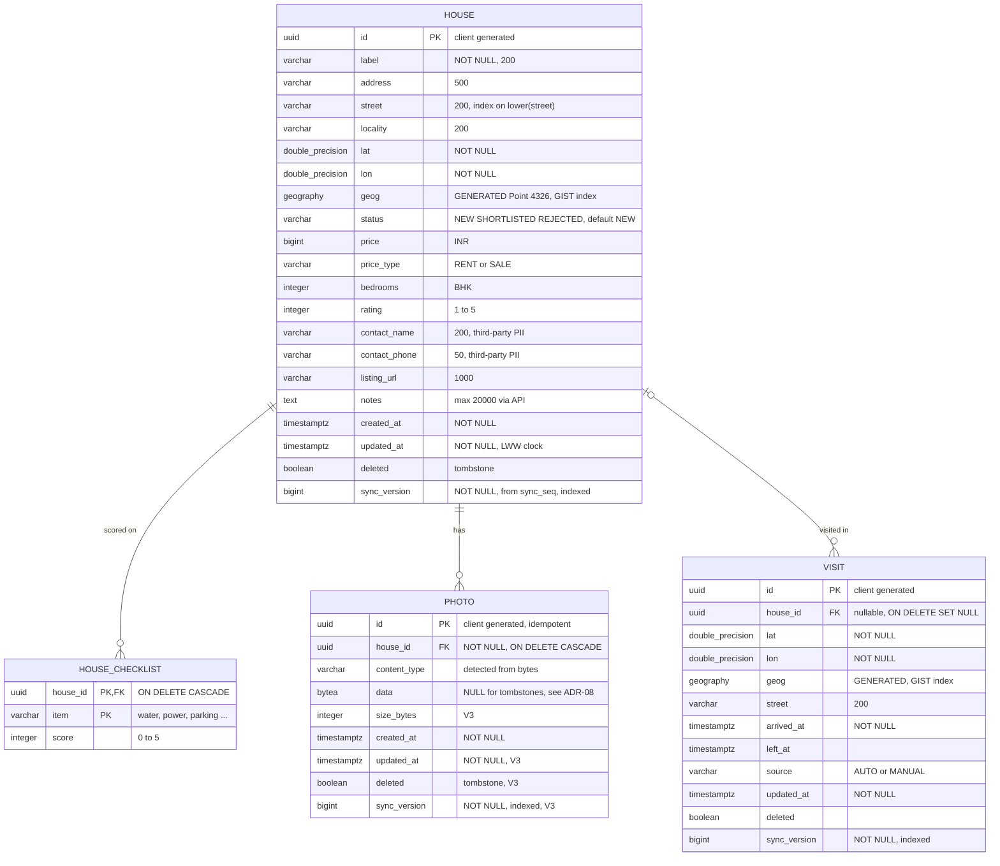

Sequence `sync_seq` is shared by `house`, `visit` and (since V3) `photo`. V2 (optional pgvector `vector_store`) belongs to the AI module. A deleted house keeps only `id`, `deleted`, timestamps and `sync_version` (content blanked, location 0,0); a deleted visit keeps no place.

### 6.2 Android Room schema (`househunt.db`, version 2)

| Table | Columns beyond the server model | Indexes |
|---|---|---|
| `houses` | `checklist` as a JSON string (TypeConverter). Epoch-ms timestamps. `dirty` flag. No `syncVersion`. | `street` |
| `visits` | epoch-ms timestamps, `dirty` | `houseId`, `street` |
| `photos` | `path` (file in `filesDir/photos`), `uploaded` flag, `deleted` flag (v2: delete queued for the server) | `houseId` |

Migration 1→2 (`AppDatabase.MIGRATION_1_2`) adds `photos.deleted INTEGER NOT NULL DEFAULT 0`. Since Sprint 3.5 `exportSchema = true` (KSP argument `room.schemaLocation`): `app/schemas/com.househunt.app.data.AppDatabase/2.json` is committed and `RoomSchemaTest` checks that both it and the generated `AppDatabase_Impl` carry the identity hash of the shipped version-2 layout (`539964c2013f14439605fab0d18a142a`), so a table change through the shared enums fails the unit tests instead of crashing upgraded installs. A real schema change needs a version bump, a migration and a new `<version>.json`, never an edit to `2.json`. Still open: a `MigrationTestHelper` test of 1→2 (R-06).

### 6.3 Derived values

| Value | Formula | Implemented in |
|---|---|---|
| Overall score | `mean(checklist)` blended 50/50 with `rating` when both exist, else whichever exists, else null | `HouseScore.of` in `:shared` (used by `HouseEntity.score`), web `houseScore()` |
| Distinct streets | `count(distinct lower(street))` over live houses | `HouseRepository.countDistinctStreets` |

## 7. Sequence diagrams

### 7.1 Save a house offline, then sync

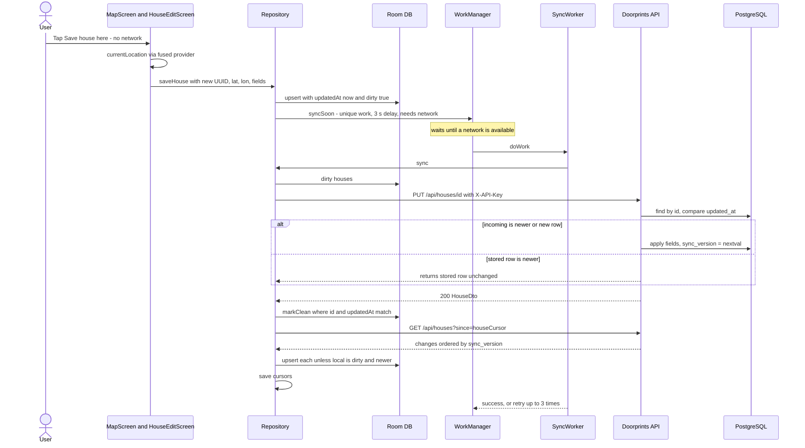

### 7.2 Hunt mode: passing a visited house, entering a known street

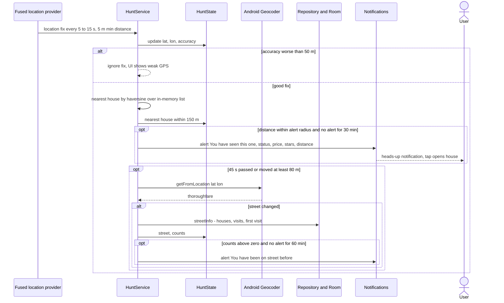

### 7.3 Stay detection and "Are you at a house?" prompt

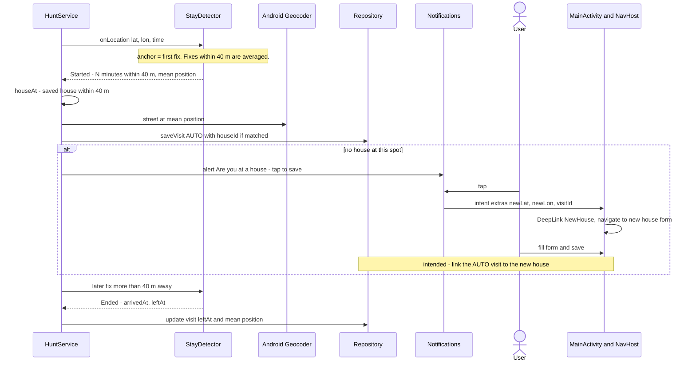

### 7.4 Photo capture and upload

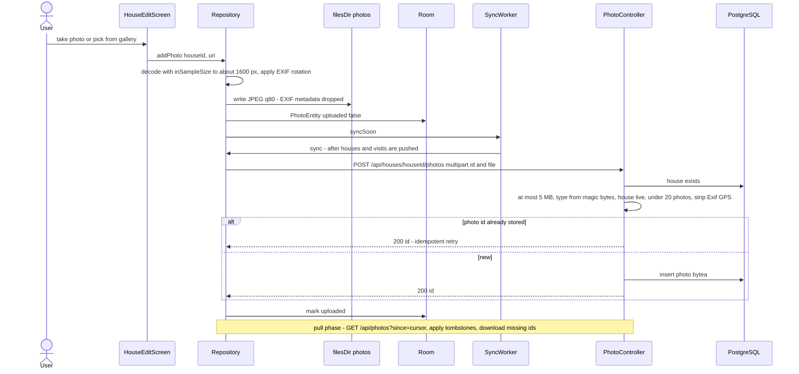

The web app uses the same endpoint. It resizes in the browser (`resizeImage`) and generates the photo UUID on the client.

### 7.5 RAG question: "Ask my house hunt" (built; UI: web `pages/ask`, Android `AssistantScreen`)

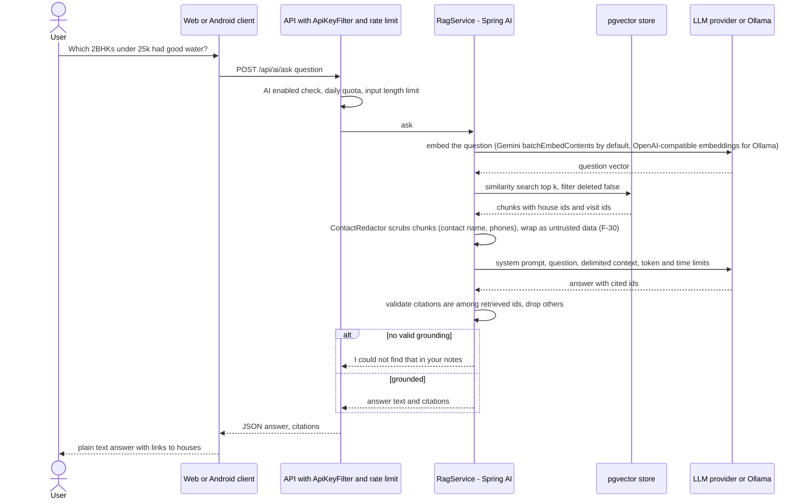

### 7.6 Listing text extraction (built; UI: web new-house form, Android "Paste listing")

The request field is `text` at `POST /api/ai/extract-listing`; the response is `HouseDraft` with `warnings` (see [ai/ai-design.md](ai/ai-design.md) §13). The clients copy only fields the listing provided, append amenities to the notes and show the warnings.

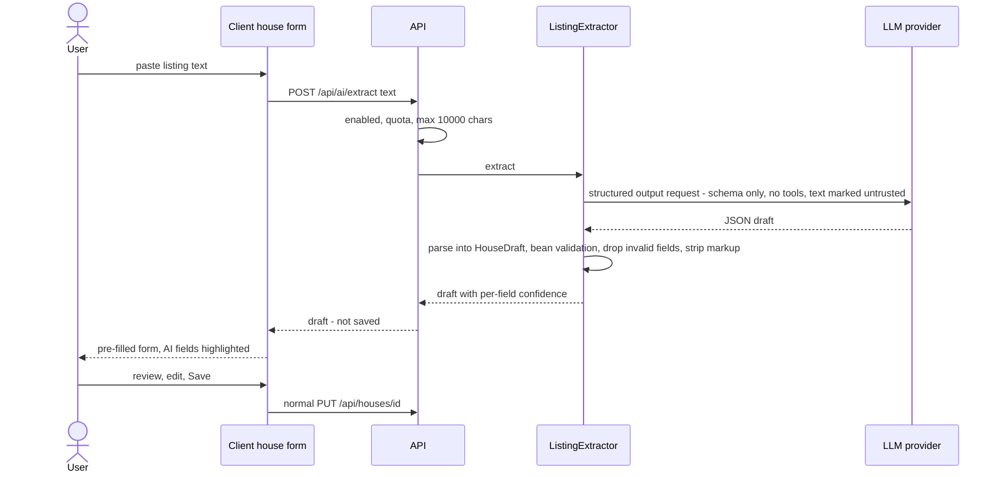

### 7.7 Plan my visits (built; UI: web `pages/plan`, Android `AssistantScreen`)

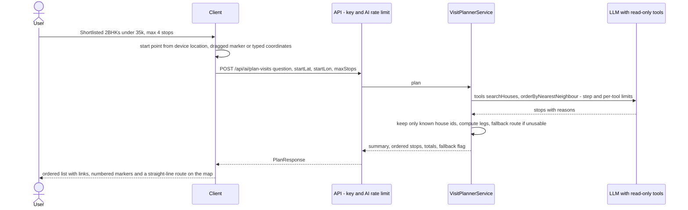

## 8. State diagrams

### 8.1 House status

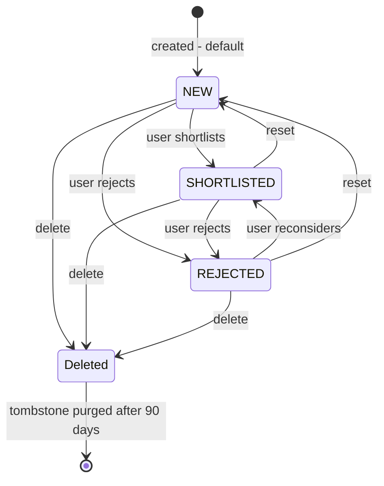

Status is a plain field with no server-side transition rules. Any value can change to any other. "Deleted" is the `deleted` flag, not a status value.

### 8.2 Hunt service

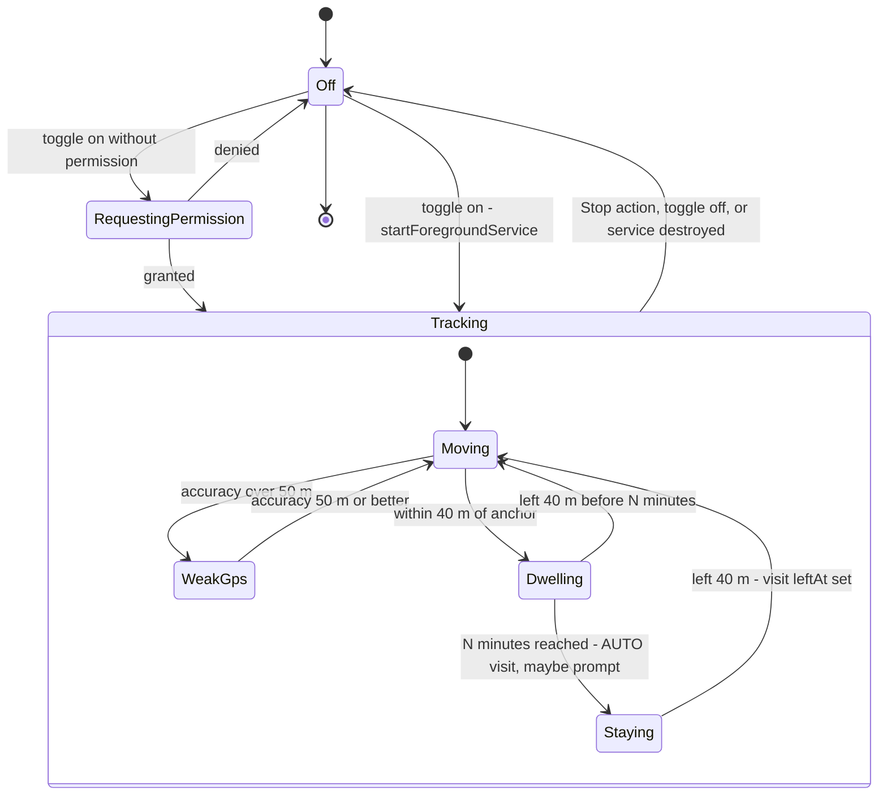

`HuntState` exposes `active`, `staying`, `street`, nearest house and accuracy to the UI. `onStartCommand` returns `START_STICKY`. See R-01 for Android 12+/14 restart limits.

## 9. API reference

Base path `/api`. Auth: header `X-API-Key: <key>` on every `/api/**` call (401 JSON on failure). Errors: RFC 7807 `ProblemDetail`. Times: ISO-8601 UTC. IDs: UUID.

| Method | Path | Params / body | Response | Notes |
|---|---|---|---|---|
| GET | `/api/houses` | `since` (long, optional) | `HouseDto[]` | Without `since`: live houses, newest `updatedAt` first. With `since`: all changes including tombstones, ordered by `syncVersion`. |
| GET | `/api/houses/{id}` | - | `HouseDto` | 404 if unknown (tombstones are returned) |
| PUT | `/api/houses/{id}` | `HouseDto` JSON (validated) | `HouseDto` | Create or LWW update. Returns the stored row if it is newer. |
| DELETE | `/api/houses/{id}` | - | 204 | Tombstone + new sync version; content blanked, photos tombstoned, visits unlinked. A PUT with `deleted: true` does the same. |
| GET | `/api/houses/nearby` | `lat` (−90..90), `lon` (−180..180), `radius` (m, > 0, default 50, capped 5000) | `HouseDto[]` with `distanceMeters` | At most 50, nearest first, live only. 400 on out-of-range values. |
| GET | `/api/houses/street` | `name` (1..200) | `HouseDto[]` | Case-insensitive exact match on `lower(street)` (uses the index), live only |
| GET | `/api/houses/{houseId}/photos` | - | `UUID[]` | Live photos, ordered by `createdAt` |
| POST | `/api/houses/{houseId}/photos` | multipart: `file` (JPEG/PNG/WebP by magic bytes, at most 5 MB), `id` (UUID, optional) | `{ "id": UUID }` | Idempotent on `id` (never resurrects a deleted photo). 404 if the house is unknown or deleted, 400 if not an image, 409 over 20 photos, 413 over 5 MB. Metadata stripped. |
| GET | `/api/photos?since=` | `since` (long, required) | `PhotoDto[]` | Change feed: `{id, houseId, contentType, sizeBytes, createdAt, updatedAt, deleted, syncVersion}`, no bytes |
| GET | `/api/photos/{id}` | - | image bytes | `Cache-Control: private, max-age=2592000`. 404 for tombstones. |
| DELETE | `/api/photos/{id}` | - | 204 | Tombstone (bytes removed) + new sync version. No error if missing or already deleted. |
| GET | `/api/visits` | `since` or `houseId` (optional) | `VisitDto[]` | `since`: change feed. `houseId`: live visits for the house, newest first. Neither: all live visits. |
| PUT | `/api/visits/{id}` | `VisitDto` JSON | `VisitDto` | LWW. `source` defaults to MANUAL. |
| DELETE | `/api/visits/{id}` | - | 204 | Tombstone; the place (lat/lon/street/leftAt) is removed |
| GET | `/api/stats` | - | `{houses, shortlisted, rejected, visits, streets}` | |
| GET | `/api/export` | - | `BackupData`: `{format: "doorprints-backup/1", exportedAt, houses[], visits[], photos[]}` | **Changed in Sprint 4a** (ADR-20): the response is now the shared backup object — the same thing a device backup carries as `data.json` — instead of the old `house-hunt-export/1` shape, so there is one format and no converter ([schemas/README.md](schemas/README.md)). `Content-Disposition: attachment; filename="Doorprints-backup-<UTC date>.json"`. Live data only; photo **bytes** are not in it (fetch them from `GET /api/photos/{id}`; a device backup puts them in the ZIP's `photos/` folder). |
| POST | `/api/import` | `BackupData` JSON (a backup's `data.json`), optional `?dryRun=true` | `ImportReport` | **New in Sprint 4a.** Restores a backup onto the server. `dryRun=true` runs the same validation and the same merge decisions and writes nothing — that is the preview the clients show before asking the user to confirm. Same API key as everything else. Two caps, both 413: the body (`app.limits.max-import-bytes`, applied by `RequestSizeLimitFilter`, which lets only this path exceed the 256 KB JSON cap) and the row count (`app.limits.max-import-rows`). Anything else wrong with the file is a 400 that names the rows. |
| DELETE | `/api/data` | header `X-Confirm-Delete: DELETE-ALL-MY-DATA` | 204 | Hard-deletes houses, visits, photos and AI index rows. 428 without the exact header. Devices keep their local copies. |
| GET | `/actuator/health` | - | `{"status":"UP"}` | **Public**, no details |
| GET, POST | `/api/ai/status`, `/api/ai/extract-listing`, `/api/ai/ask`, `/api/ai/plan-visits`, `/api/ai/reindex` | see [ai/ai-design.md](ai/ai-design.md) §13 | | Same key; AI rate limit (except status); 404 when AI is off |
| POST, GET | `/mcp` | MCP Streamable HTTP | | Off by default; same key (or Bearer) |

Common statuses: 400 invalid input or non-canonical path, 401 missing/wrong key, 404, 409 conflict (photo cap, photo id of another house), 413 body too large, 428 missing confirmation header, 429 rate limited (`Retry-After`), 503 AI provider unavailable (`"retryable": true`; when the provider answered HTTP 429 / `RESOURCE_EXHAUSTED`, AI Studio or Vertex AI, the problem also has `"code": "AI_QUOTA_EXHAUSTED"` and the response a `Retry-After: 60` header, so clients and the eval harness can tell a quota stop from an outage without parsing text; the status stays 503 so existing clients keep working; on Vertex AI 401/403/404 the problem also has `setupHint`, an owner-facing string with env-var names (`GCP_LOCATION`, `AI_VERTEX_EMBEDDING_LOCATION`) and the configured location only, never the project id or the provider message). A spend cap trip has no distinct code yet ([01](01-requirements.md) AI-017).

**HouseDto** fields: `id, label*, address, street, locality, lat*, lon*, status, price, priceType, bedrooms, rating, contactName, contactPhone, listingUrl, notes, checklist{item→0..5}, createdAt, updatedAt, deleted, syncVersion, distanceMeters`. Validation is in [01 FR-002](01-requirements.md#61-houses).
**VisitDto** fields: `id, houseId, lat*, lon*, street, arrivedAt*, leftAt, source, updatedAt, deleted, syncVersion`.

## 10. Sync algorithm

### 10.1 Principles

| Rule | Detail |
|---|---|
| Identity | UUIDs created on the client, so offline creates never collide and retries are idempotent |
| Local change tracking | `dirty = true` and `updatedAt = now()` on every local write (`Repository.saveHouse/saveVisit`) |
| Server ordering | Each accepted write takes the advisory lock, then `sync_version = nextval('sync_seq')` (one sequence for houses, visits and photos), so versions become visible in order (10.4) |
| Cursors | Separate `houseCursor`, `visitCursor` and `photoCursor` in DataStore. They reset to 0 when the server URL changes. The photo cursor does not move past downloads skipped on a metered network. |
| Conflict policy | LWW on `updatedAt`, applied on the server (stored newer means the incoming write is ignored) and on the client (local dirty and newer means the incoming change is skipped). The server clamps a client `updatedAt` more than 5 min ahead to its own clock (`ClientClock`). |
| Deletes | Tombstones (`deleted = true`) travel through the same feeds; they carry no content and are purged after 90 days |
| Photos | Push: queued deletes first (any network), then uploads of rows with `uploaded = false` if their house is not deleted (unmetered only, when the Wi-Fi setting is on). A permanent 4xx (not an image, cap reached) keeps the photo local only. Pull: `GET /api/photos?since=photoCursor`; tombstones delete local files, new photos of live houses are downloaded. |

### 10.2 Client pseudocode (`Repository.sync`)

```text
if server not configured: return "offline"
for h in houses where dirty:   PUT house; markClean(h.id, h.updatedAt)   # only if not edited meanwhile
for v in visits where dirty:   PUT visit; markClean(v.id, v.updatedAt)
for p in photos where deleted:  DELETE photo (404 is fine); remove row
for p in photos where !uploaded and house not deleted:
    if photos not allowed on this network: waiting++ ; continue
    POST photo(id); uploaded = true              # 400/404/409 -> keep local only
(hc, vc, pc) = cursors
for dto in GET houses?since=hc: hc = max(hc, dto.syncVersion)
    if local.dirty and local.updatedAt > dto.updatedAt: skip else upsert(dto, dirty=false)
same for visits with vc
save cursors (hc, vc)
for ch in GET photos?since=pc:
    if ch.deleted: delete local file and row
    else if missing locally and house live: download (or waiting++ and stop advancing pc)
    advance pc while every change so far is fully handled
save photo cursor; return SyncOutcome(pushed, pulled, waiting)
```

The server's LWW decision is final. After a push that lost, the client gets the winning row back on the next pull, because a write that lost does not advance `sync_version`. The pull then overwrites the (now clean) local row.

### 10.3 Triggers

`syncSoon` (3 s delay, unique REPLACE, so bursts of edits collapse) after each change. Periodic every 30 min. Both need a network; a captive portal skips the run. Exponential backoff from 30 s, up to 5 attempts (none after an auth failure). When photos are waiting for Wi-Fi, a unique UNMETERED job (`sync-photos-wifi`) runs as soon as Wi-Fi is available. Inside a run, each idempotent request is retried up to 3 times with full-jitter backoff ([09](09-osi-layer-analysis.md) L4).

### 10.4 Sync correctness fixes (wave 2) and remaining issues

**Ordered sync versions (F-09, fixed).** Without coordination, transaction A can take version 41, B take 42 and commit first; a client that pulls in between stores cursor 42 and never sees 41. Every writer now calls `SyncVersions.lock()` (`select count(*) from pg_advisory_xact_lock(0x48480000002A)`) before reading the row it will change, and `SyncVersions.next()` (lock, then `nextval`). The lock is held until commit or rollback, so while version N is uncommitted nobody can take N+1: versions become visible in exactly the order they were assigned, and a reader either sees N or nothing above N−1. Rolled-back versions leave harmless gaps. Readers never take the lock. The same lock makes the last-write-wins check and the write atomic. Cost: writes are serialised, a few milliseconds each, which is fine for one user. Alternatives considered: a "safe watermark" (return only versions below the oldest in-flight one, needs tracking of in-flight transactions) and an overlap window (`since = cursor − k` with de-duplication, needs a guess for k).

**Client clock (F-08, fixed).** `ClientClock.accept`: null means now; more than `app.sync.max-clock-skew-seconds` (300) ahead is clamped to server now; more than `max-future-days` (365) ahead or before 2000 is a 400. Visit arrival/departure times are validated but not clamped (they describe events, not edit order).

| Issue | Ref | Status |
|---|---|---|
| Photo deletes were not synced and photos had no version | F-15 | Fixed: V3 tombstones + `/api/photos?since=` + Android delete queue |
| Push is not atomic: a crash between PUT and `markClean` repeats the PUT | - | Harmless, because the upsert is idempotent |
| `GET ?since=` is unbounded | F-19 | Add `limit` + loop until empty |

## 11. Geospatial design

| Aspect | Design |
|---|---|
| Storage | `lat`, `lon` as `double precision`, plus the generated column `geog geography(Point, 4326) = ST_SetSRID(ST_MakePoint(lon, lat), 4326)::geography`. Clients never write `geog`. |
| Why geography | Distances in metres on the spheroid with no projection choices. India spans several UTM zones (ADR-05). |
| Index | `GIST (geog)` on `house` and `visit` |
| Nearby query | `ST_DWithin(h.geog, point::geography, :radius)` (uses the index) + `ST_Distance` for ordering, `LIMIT 50`, radius capped at 5 000 m |
| Street query | `findLiveOnStreet`: native `lower(street) = lower(:street)`, which uses `house_street_idx`. For Indic scripts `lower()` is a no-op (no letter case), so matching is exact. |
| On-device matching | The phone holds all live houses in memory (`repo.houses` Flow) and computes haversine distance per fix, so no network is needed (NFR-003, NFR-004). The stay radius is 40 m, the alert radius 30 m (configurable), and fixes worse than 50 m are ignored. |
| Street names | Android: `Address.thoroughfare` from the Android Geocoder. Web: Nominatim `road`/`pedestrian`/`residential`. The two geocoders can spell the same street differently ("1st Main Rd" vs "1st Main Road"), which can make street alerts miss. Planned: normalise names (lower case, expand Rd/St/Mn, trim numbers) before comparing. |
| Coordinates precision | The web rounds to 6 decimals (about 0.1 m) |

## 12. Security design (summary)

Full analysis is in [02](02-threat-model.md).

| Control | Current | Planned |
|---|---|---|
| Authentication | `ApiKeyFilter`: deny by default, canonical paths only, shared key, constant-time compare, failed attempts logged and throttled. Startup fails if a key is shorter than 32 chars. Optional `APP_API_KEY_NEXT` for zero-downtime rotation. | Per-device keys later (SEC-025) |
| Transport | Host-edge TLS; HSTS from the API over HTTPS and from `web/firebase.json` on the web (on `*.web.app` the whole `.app` TLD is HSTS-preloaded in browsers anyway); Android cleartext only for local dev hosts, system CAs only, no redirects | Cert pinning rejected (09 §7) |
| CORS | Allowlist from `APP_CORS_ORIGINS`, `/api/**` only, methods GET/POST/PUT/DELETE/OPTIONS, headers `X-API-Key`, `Content-Type`, `Authorization`, `X-Confirm-Delete`; exposes `Retry-After`, `Content-Disposition`; max-age 1 h | Unchanged |
| Input validation | Bean validation on DTOs and query params. JSON 256 KB, multipart 5 MB file / 6 MB request. Image type from magic bytes. 20 photos per house. Client clock checks. | Unchanged |
| Output | JSON via Jackson. Angular/Compose render text (no HTML). API CSP `default-src 'none'`, `nosniff`, `no-store`. Web strict CSP (`script-src 'self'`, `worker-src 'self'`, `object-src 'none'`, `frame-ancestors 'none'`). | – |
| Rate limiting | In-app token buckets: 600/min per address, 10/min wrong keys, AI 10/min | Cloudflare in front where the host allows |
| Secrets | Env vars (`APP_API_KEY`, optional `APP_API_KEY_NEXT`, `DB_*`); Keystore-encrypted key on the phone; sessionStorage by default on the web; release keystore only as CI secrets (`HH_*`) or outside the repo | GitHub Secrets / provider secret store |
| Data at rest | Provider disk encryption (Supabase/Neon). Android FBE. No backups of the key. | Encrypted backups (age) |
| Privacy | No raw tracks, EXIF dropped on clients and server, visible FGS, tombstones without content, 90-day purge, export and erase endpoints | App buttons for export/erase, web privacy page |

## 13. AI integration design (overview)

The AI team owns the details in [docs/ai/](ai/). This document only fixes the integration contract:

| Item | Contract |
|---|---|
| Packaging | A Spring module/package in the same API process (free tier: one service). Beans are created only when `app.ai.enabled=true` and a provider is configured (AI-001). |
| Providers | Chosen by configuration only: `app.ai.provider` (`AI_PROVIDER`), **`aistudio`** (default) or **`vertex`**; both use the same model ids (`gemini-3.5-flash` chat, `gemini-embedding-2` at 768 dimensions), so the index stays valid across a switch (re-index once anyway). `AiDefaultsEnvironmentPostProcessor` selects the matching Spring AI auto-configurations and forces all of them off when AI is off. **aistudio:** chat through Spring AI 2.0.1 `ChatClient` over the OpenAI-compatible API of Gemini (API key `AI_API_KEY`; paid tier for real data, PRV-022) or Ollama (local/VM). Embeddings (since Sprint 3, `app.ai.embedding.provider`): by default the app's own `GeminiEmbeddingModel` calls the **native** Gemini API, `POST {AI_EMBEDDING_BASE_URL}/models/{model}:batchEmbedContents` (up to 100 texts per call, `outputDimensionality` 768), with the key only in the `x-goog-api-key` header, never in the URL; errors carry the HTTP status only. Gemini's OpenAI-compatible `/embeddings` is not used because its response omits `data[].index`, which Spring AI's OpenAI client rejects. With `AI_EMBEDDING_PROVIDER=openai` (Ollama) embeddings use the OpenAI-compatible `/embeddings` like chat. **vertex:** Google Cloud Vertex AI in an AI-only project. Chat through Spring AI's Google GenAI starter (`spring-ai-starter-model-google-genai`, `GoogleGenAiChatModel`) with the app's own google-genai `Client` (`VertexAiConfiguration`: project, location, timeout, bounded retries), `POST https://<location>-aiplatform.googleapis.com/v1beta1/projects/<p>/locations/<l>/publishers/google/models/<model>:generateContent` (`global`: `aiplatform.googleapis.com`). Embeddings through the app's own `VertexEmbeddingModel`: `:embedContent` for `gemini-embedding-2` (one text per call) or `:predict` for `gemini-embedding-001`, same retries, `Retry-After` handling, normalisation and exception type as `GeminiEmbeddingModel`; optional separate `AI_VERTEX_EMBEDDING_LOCATION`. Auth: `Authorization: Bearer` OAuth access tokens from Google **Application Default Credentials** (`GoogleAccessTokenSource`: Workload Identity Federation in CI, the attached service account on Cloud Run, `gcloud` locally); no API key or express mode. Default location `asia-south1` (data residency attribute, 04 DF-21/DF-32). **Both:** vectors in pgvector in the same Postgres (`CREATE EXTENSION vector`, Flyway migration owned by the AI team). `ProviderErrors` classifies HTTP 429 / `RESOURCE_EXHAUSTED` from either provider as a quota error: the API answers 503 with `code: AI_QUOTA_EXHAUSTED` and `Retry-After: 60`, and `POST /api/ai/reindex` stops at the first such batch (it returns 503 if any batch fails). `AI_INDEX_ON_CHANGE=false` embeds only on re-index. Trust boundaries: 02 T-I20, T-I22; flows: 04 E6, DF-21, DF-32. Details: [ai/ai-design.md](ai/ai-design.md) §2.1, §3.1, §3.3; owner setup [ai/vertex-setup.md](ai/vertex-setup.md). |
| Data sources | `house` (label, locality, notes, checklist, price, status), `visit` (street, times). The contact name and phone are never included: `HouseDocuments` has no Contact line and redacts free text, `RagService` scrubs retrieved chunks (also ones indexed before the fix) and the agent/MCP tool results carry no contact fields (`ContactRedactor`, AI-010, [02](02-threat-model.md) F-30 Fixed in Sprint 3; details in [ai/](ai/ai-design.md) §9.1). |
| Endpoints | Under `/api/ai/**`, so they are covered by `ApiKeyFilter`, CORS, the general and the AI rate limits. Clients: web `core/ai.service.ts`, Android `ApiClient` AI methods; both hide AI UI unless `GET /api/ai/status` says `enabled`. |
| MCP | House tools (search, get, nearby, stats) exposed through the Spring AI MCP server at `/mcp`; it reports `serverInfo.name` `doorprints` (`spring.ai.mcp.server.name`); tool names such as `askHouseHunt` are unchanged (ADR-13). Same key. Read-only by default (AI-007). |
| Sequences | Sections 7.5 and 7.6 |
| Safety | AI-003..AI-011, threat IDs T-T7, T-I7, T-I8, T-D4, T-E2, T-S6 |

## 14. Architecture decision records

| ADR | Decision | Alternatives | Rationale / consequences |
|---|---|---|---|
| ADR-01 | **Foreground location service + in-app distance checks** for Hunt mode | Android Geofencing API | Geofencing needs `ACCESS_BACKGROUND_LOCATION` (a hard permission for sideloaded apps and more invasive for privacy), allows 100 geofences per app, has a background latency of minutes, and cannot do street detection or stay detection. A visible FGS runs only while the user wants it (PRV-001/002), gives 5 to 15 s updates and uses all houses. Cost: higher battery use while on (NFR-005), and Android 14 FGS type rules. **Still holds for Hunt mode.** Sprint 4b adds one opt-in exception (product owner, 2026-09-22): *Hunting areas* use the Geofencing API only to **offer** Hunt mode when the user enters a neighbourhood they marked, and ask for "Allow all the time" only when the user turns that feature on; Hunt mode itself stays a foreground service started by a tap ([11](11-feature-parity-and-export-spec.md) 5.17, 5.18; [01](01-requirements.md) PRV-024..PRV-027). |
| ADR-02 | **MapLibre + OpenFreeMap** tiles | Google Maps SDK, Mapbox, raw OSM tile servers | No API key, no billing account, vector tiles, same style on web and Android, OSM data is good in Indian cities. The OSM tile server policy forbids heavy app use. Risk: a community service with no SLA, so the style URL is a single constant and easy to swap. The style draws the ISO view of India's borders, so both apps change it on every load (ADR-22). |
| ADR-03 | **Single API key** for v1 | OAuth2/OIDC (Keycloak, Auth0 free, Supabase Auth), per-device keys | One user and no login UI. Works for background sync without token refresh. Risks accepted with rotation, TLS and rate limits ([02](02-threat-model.md): F-01a key length and rotation Fixed, F-01b per-device keys Open). The upgrade path is per-device hashed keys, then OIDC. |
| ADR-04 | **Offline-first with client UUIDs, server sequence cursor, LWW** | CRDTs, per-field merge, server timestamps as cursor | Simple and fits a single user. A sequence cursor avoids clock problems in the feed. LWW can drop concurrent edits (RR-06). |
| ADR-05 | **PostGIS `geography`** with a generated column | `geometry` + projection, plain lat/lon + haversine in SQL | Correct metres, index support, clients stay unaware of it |
| ADR-06 | **Node only as a build tool**, static SPA | Angular SSR / Node API | No Node server to patch or host. Free static hosting. One backend language (Java). Smaller attack surface. |
| ADR-07 | **Android Geocoder** for Hunt-mode street lookup, **Nominatim** only on web button press | Nominatim everywhere, paid geocoders | Nominatim's policy forbids periodic/automatic use. The Android Geocoder is free and keyless (it sends coordinates to Google, disclosed in PRV-007). |
| ADR-08 | **Photos in Postgres `bytea`** for v1 | Object storage (Cloudflare R2, Supabase Storage), filesystem | One store, transactional, a single backup, no extra credentials. Consequences: DB quota and memory (F-06). Revisit when the DB reaches 60% of quota. |
| ADR-09 | **Flyway** SQL migrations, `ddl-auto: none` | Hibernate auto DDL | Reviewable, reproducible schema. PostGIS features need hand-written SQL anyway. |
| ADR-10 | **Sideloaded signed APK** from GitHub Releases | Play Store ($25), F-Droid | Zero cost. The user must allow "install unknown apps" and check the checksum (SEC-018). No automatic updates. |
| ADR-11 | **AI optional and in-process**, pgvector in the same DB | Separate AI service, hosted vector DB | Free tier allows one service and one DB. Feature flag keeps the core app independent (AI-001). |
| ADR-12 | **Manual DI** (`AppContainer`) on Android | Hilt/Koin | Small app, fewer dependencies (supply chain), faster builds |
| ADR-13 | **Rename the product from House Hunt to Doorprints** (2026-09-22, product owner), tagline "Remember every house you've seen.". Names only, no behaviour change | Keep "House Hunt"; a full rename including code packages, repository, storage keys and database names | **Reason:** "House Hunt" made the app sound like a property-listings site (search houses for rent or sale), while it is a personal record of the houses the user has seen in person. **Changed:** the display name in all four languages (Android `app_name`, now translatable and the same in every language; notification channel text and the lock-screen public version "Doorprints alert"; web `<title>`, header and page titles "<page> · Doorprints", `application-name`); a translated tagline (Android `app_tagline` on the empty house list and in a new Settings *About* section; web `app.tagline`, also the meta description); a new Android launcher icon (a door with footprints), which since the final Sprint 4a round is also the web's favicon and PWA icons (the favicon has the same three footprints since 2026-09-24, option C; [12](12-brand-and-naming.md) N-06); Android `applicationId` **`app.doorprints`** (was `com.househunt.app`) and Gradle root project `Doorprints`; CI artifact names **`doorprints-debug-apk`**, **`doorprints-release-apk`**, **`doorprints-web-dist`** (were `house-hunt-*`); web package `doorprints-web`; Maven `<name>` and `spring.application.name` `doorprints-api`; MCP `serverInfo.name` `doorprints`; export download file `doorprints-export-<date>.json`; eval scorecard title; docs, README and CHANGELOG. **Not changed, on purpose:** Java/Kotlin packages (`com.househunt`, `com.househunt.app`, which is also the Android `namespace` for `R` and `BuildConfig`) and class names (`HouseHuntApp`, `HouseHuntRoot`, `HouseHuntTheme`), so no source file moves; the repository name `house-hunt`; storage keys that hold existing data: web `localStorage` `house-hunt.lang` and `house-hunt.api-config`, the Android Keystore alias `house_hunt_api_key_v1`, the Room file `househunt.db`; database, role and schema names (`househunt`, `househunt_app`), the compose volume `dbdata18` and project name, the image names `house-hunt-api` and `house-hunt-db`, Maven `groupId`/`artifactId`; the export `format` id `house-hunt-export/1` (**superseded in Sprint 4a**: `GET /api/export` now emits `doorprints-backup/1`, the shared format of ADR-20; the old id is gone because the endpoint had no other reader than the owner); MCP tool names (`askHouseHunt`, …); the `HH_*` signing secrets and the CI keystore file name; the feature name "Hunt mode". Renaming any of these would lose saved settings or data, break existing deployments and backups, or touch every source file for no user benefit. **Consequences:** Android treats `app.doorprints` as a new app: builds made before the rename (`com.househunt.app`, never published) are not upgraded, install side by side and keep their own local data, so sync them first and then uninstall them (08 §6.2). Everything derived from the id follows it (FileProvider authority `${applicationId}.files`). `adb` commands name the activity by its class: `app.doorprints/com.househunt.app.MainActivity`. |
| ADR-14 | **Kotlin Multiplatform-ready Android code base, iOS later** (Sprint 3.5, product owner 2026-09-22; commit `8f583af`). A `:shared` KMP module holds the platform-neutral code (models and wire names, score, sync rules and outcome codes, stay detection, street alerts, distance, DTOs, ISO time, the API client and its retry policy); targets Android and, **compile-only**, `iosArm64` + `iosSimulatorArm64`. The HTTP client moves from OkHttp 4 with an interceptor (`RetryInterceptor`) to a **Ktor 3.6** client (`ktor-client-core` in commonMain, OkHttp engine on Android) with the same behaviour. Room, WorkManager, DataStore, Keystore, location services and the Compose UI stay in `:app` | (a) Keep everything in `:app` until an iOS app is funded; (b) full KMP now, including Room KMP and a Compose Multiplatform UI; (c) Kotlin/JS or a shared TypeScript core with the web app; (d) keep OkHttp and wrap it in `expect/actual` | **Reason:** no Mac, no iPhone and no Apple Developer Program fee (zero cost, CON-01), so no iOS app now; but the rules and the client an iOS app would reuse should already compile without JVM or Android APIs, so Phase 2 does not start with a large refactor. (a) lets JVM-only code creep in; (b) touches every tester's on-device database (identity hash, migration 1→2, TypeConverter) and the UI in one sprint; (c) the web app is Angular and would not share Kotlin code; (d) OkHttp does not run on iOS. **Guard rails:** `shared-ios.yml` (macOS runner, free for public repositories) compiles the iOS main and test klibs on every `android/shared/**` or root Gradle change; nothing is linked, signed or run. `ApiClientContractTest` (Ktor `MockEngine`, responses recorded from the backend's DTOs and handlers) pins the wire format and the retry, captive-portal, redirect and timeout rules the old `RetryInterceptorTest` covered; the other pure suites moved to `commonTest`. `RoomSchemaTest` pins the Room identity hash because the entities now use the shared enums. **Consequences:** one version catalog (`android/gradle/libs.versions.toml`) for both modules; `:shared` is `api(ktor-client-core)`, so `:app` sees Ktor types; MapLibre runs on OkHttp 5.5.0 instead of 4.12.0 (manual map smoke test per version change, `android/shared/README.md` §5); `Api.kt` keeps one app-wide `HttpClient`; package `com.househunt.shared` (packages keep the old name, ADR-13); the iOS tests themselves are not run anywhere yet. **Phase 2** (section 4.2.1): Room KMP, DataStore KMP and `expect/actual` secrets, `ServerUrl`, then an iOS app and its platform services. Until then iPhone users use the PWA. **Amended by ADR-23 (2026-09-24):** the UI now moves to Compose Multiplatform in a `:ui` module (alternative (b)'s UI half, done in phases), and Phase 2 item (4) is decided for Compose Multiplatform over SwiftUI. |
| ADR-19 | **The local-first web app adds no npm dependency** (Sprint 4a). IndexedDB is used through a ~120-line wrapper (`data/local-db.ts`), the ZIP files are written by a ~100-line stored-entry writer (`export/zip.ts`), SHA-256 comes from `crypto.subtle`, and the XLSX file is built by a small SpreadsheetML writer | Dexie or `idb` for IndexedDB (both named in [11](11-feature-parity-and-export-spec.md) 5.10); `fflate` for ZIP; SheetJS for XLSX; `@angular/pwa` for the service worker | **Reason:** every new runtime dependency is supply-chain surface (T-T5) in an app whose whole point is holding the user's data locally, and it has to be kept current by Dependabot for years for a feature that is a few hundred lines. The wrapper needs six operations (get, getAll, put, putAll, delete, clear); `fflate`'s value is compression, which we deliberately do not want (see ADR-20); SheetJS's current releases are not on npm at all; `@angular/pwa` would pull in `@angular/service-worker` and regenerate the lock file for a service worker whose whole policy is "cache the app shell, never the API". **Cost, accepted:** we own the bugs. The mitigations are that each piece is small enough to read in one sitting, `zip.spec.ts` and `local-db.spec.ts` cover them, and the golden-file tests (TC-U-26) fail loudly if the byte output ever drifts. **Consequence:** `MemoryDb` had to be written anyway, because jsdom has no IndexedDB — and it turned out to be the right fallback for a blocked browser too. |
| ADR-20 | **One backup format, `doorprints-backup/1`, implemented three times, with ZIP entries *stored* rather than deflated** (Sprint 4a). The format is pinned in [schemas/README.md](schemas/README.md); the server's `GET /api/export` and `POST /api/import` speak its `data.json` half | A server-side export format plus per-client formats and converters; keeping `house-hunt-export/1` on the server; deflating the ZIP to save space | **Reason:** a copy made on the phone must import in the browser and on the server, and the cheapest way to guarantee that is to have no conversion anywhere — the field names are the DTO names, so an imported row can go straight to the sync layer. Three implementations of one format is a real cost, paid for by the golden files: the same fixture must produce the same bytes in Kotlin and in TypeScript, so a drift on one side fails a test rather than a user's restore. **Stored, not deflated:** compression would make the output depend on the compressor's version and settings, which kills byte-for-byte determinism (NFR-023) and with it the golden tests; photos are JPEG and do not compress further anyway; and it removes the need for a compression library on the web (ADR-19). The price is a larger CSV/XLSX archive — text that would have compressed well — which is acceptable for a file the user saves once. **Consequences:** a format change is a three-sided change (the schemas README says so); `manifest.json` is written last because its hashes cover the other entries; there is no ZIP64, which is safe because the import validator refuses more than 5 000 entries long before the 65 535 limit. **How it is pinned (end of 4a, working tree):** by the canonical sample `docs/schemas/backup-sample.json` — the server and Android read it and compare parsed JSON (Kotlin writes a whole-number `0` as `0.0`, so a byte comparison is impossible there), and the web writer's byte golden is compared with it by the backend's `BackupParityTest`, which also pins the one `data.json` cap (16 MiB) in all three readers ([06](06-test-plan.md) TC-I-34). |
| ADR-21 | **The web app is hosted on Firebase Hosting at `https://doorprints.web.app`, at the root of its own origin** (owner decision, Sriram, 2026-09-23, with the brand advisor; supersedes the same morning's Cloudflare Pages decision, which was never set up). Firebase project and default site `doorprints`, no-cost **Spark** plan with **no billing account**, kept apart from the AI project `doorprints-ai`. `web.yml` job `deploy-firebase` deploys the tested production build on pushes to `main` and manual runs with a pinned `firebase-tools` (15.30.2), authenticated by **Workload Identity Federation** (pool `github`, provider `github-web-deploy`, attribute condition pinned to this repository's id, `main`, `.github/workflows/web.yml` and push/`workflow_dispatch`) impersonating the service account `firebase-hosting-deploy`, whose **only role is Firebase Hosting Admin**; there is no JSON key anywhere. The Web team's `web/firebase.json` carries the headers and the SPA rewrite; CI validates it before any credential exists and checks the live headers after each deploy ([07](07-secure-build-and-deploy.md) §6.3). GitHub Pages is switched off for this repository | (a) GitHub Pages with the gap accepted (only a `<meta>` CSP); (b) GitHub Pages plus a standing rule that the owner's other Pages sites never run script; (c) **Cloudflare Pages** at `<project>.pages.dev` (chosen 07:30 IST, then rejected); (d) Netlify Free; (e) Vercel Hobby; (f) a custom domain (`doorprints.in`) in front of any of them; (g) `FirebaseExtended/action-hosting-deploy` instead of the CLI | **History and reasons.** (a)/(b): **GitHub Pages cannot send response headers**, so the CSP's `frame-ancestors`, `X-Frame-Options`, `nosniff`, `Permissions-Policy` and COOP were impossible there ([02](02-threat-model.md) F-31), and **every Pages site of one account shares one origin**, `https://sriram-codes-sw.github.io`, which also serves the owner's repository secure-doc-viewer; IndexedDB, `localStorage` (the saved API key) and a service worker's reach are per origin. Checked on 2026-09-23 that secure-doc-viewer's Pages site ran no scripts (its `gh-pages` branch at `68e3a625` has no `<script>` element), but (b) would have made that a rule on a repository the owner keeps developing, which he declined. Nothing was ever published to GitHub Pages. (c) fixed both and was the owner's first choice (07:30 IST), but **he rejected it later that morning because a `*.pages.dev` address reads as a development or test site** to the IT-literate families who use the app; no account, token or deploy ever existed. The brand advisor then compared addresses ([12](12-brand-and-naming.md) sections A and E): `doorprints.web.app` reads as a product ("web app"), is short to say in Hindi, Tamil and Telugu, and needs no card. (d) pauses **all** of an account's sites when its 300 monthly credits run out; (e) is for non-commercial use only and its name is hard to say; (f) costs money every year (CON-01) and, because browser storage is per origin, must not happen before the web can import a backup ([12](12-brand-and-naming.md) section D); (g) requires a long-lived service-account JSON key (its Workload Identity support is an open feature request), which our policy forbids. **Consequences:** the site is served from `/`: manifest `id` `"/"`, worker scope `/`, no `404.html` (the `**` rewrite answers deep links with status 200); `web/public/_headers` and `_redirects` are gone and the CSP's single source is `web/firebase.json`, from which the build also writes the `<meta>` CSP. The server's `APP_CORS_ORIGINS` must list `https://doorprints.web.app` for browser sync ([07](07-secure-build-and-deploy.md) §7). The owner's one-time setup (project, site, APIs, service account, Workload Identity, two repository secrets `FIREBASE_WIF_PROVIDER` and `FIREBASE_SA_EMAIL` and two variables `FIREBASE_PROJECT_ID` and `FIREBASE_SITE_ID`, GitHub Pages off) was **done on 2026-09-23**; until the four values existed the deploy job skipped cleanly. New residual risks ([02](02-threat-model.md) RR-13, RR-14, RR-15; RR-12, the Cloudflare per-deployment addresses, is withdrawn): the Spark transfer quota disables the site when exceeded and there is no budget alert without billing; Firebase's reserved `/__/*` paths are not under our headers; HSTS on `web.app` comes from the `.app` preload and may not be our value. Renaming `web.yml` breaks deploys until the owner edits the provider's condition. Old releases are kept for rollback in the console but, unlike Cloudflare deployments, are **not** served at their own addresses. No PR preview channels (each would be a public address and would need tokens on `pull_request` runs). Zero cost. |
| ADR-22 | **India's boundaries are shown as the Government of India depicts them, on both apps, as the only view** (owner decision, Sriram, 2026-09-24; P0 issue on the live site `https://doorprints.web.app`, first near Jammu and Kashmir, then the same issue near Arunachal Pradesh). All of Jammu and Kashmir and Ladakh are inside India, including Pakistan-occupied Kashmir (the tiles call it "Azad Kashmir"), Gilgit-Baltistan, the Shaksgam valley and Aksai Chin, and so is Arunachal Pradesh; the map draws one solid outline and **no Line of Control, no Line of Actual Control and no other de facto or claim line**. Every user is in India, so there is no switch. The reference the owner gave is Google Maps as shown in India. **Data:** `in-boundaries.geojson` (415 608 bytes, sha256 `25984afa…a024`; the file before branch `fix/india-boundary-lines` was 412 853 bytes, `700646ea…4954`), byte-identical in `web/public/geo/` and `android/app/src/main/assets/geo/`, built by the lead's `web/scripts/geo/build_in_boundaries.py` (commit `a37ecbd`, extended on `fix/india-boundary-lines`) from **Natural Earth** (public domain), `natural-earth-vector` commit `ca96624`. The build is reproducible: the old file was first rebuilt byte for byte from that commit. Three features, property `kind`: **`world`** (359 lines) = the 1:50m land boundary lines whose India point-of-view class (`FCLASS_IN`, else the ISO class) is an international boundary, cut out of the four boxes below, and the **shared stretches** of India's own outline (below), used **below zoom 5 only**; **`claim`** (5 pieces, 1 667 points) = the rest of the land-boundary parts of India's own polygon from the 1:10m India point-of-view countries file (`ne_10m_admin_0_countries_ind`) inside four boxes, used **at every zoom**; **`state`** (2 lines, 213 points) = the Assam-Arunachal Pradesh state line from the 1:10m admin-1 lines (`ne_10m_admin_1_states_provinces_lines`, the two features "Assam - Arunachal Pradesh", notes India_20 and India_200), used **from zoom 5**. **Shared stretches:** the 7 stretches of the outline along which the OpenFreeMap tiles draw India's border themselves from zoom 5 (planet 20260913), none of them with China: Nepal near Kalapani (77.5 km), Sikkim and the Darjeeling and Kalimpong hills (West Bengal) with Nepal (13.5 and 75.2 km) and with Bhutan (44.6 km), Bhutan's south-east corner (79.3 km), Myanmar south of about 26.65 N (31.3 km) and the Wakhan (105.9 km). There the outline draws below zoom 5 only, and from zoom 5 the tiles' own, more precise (OpenStreetMap) line is the only line. At each hand-over the `claim` piece ends with a short straight connector (about 7 km at most) to the tile line, so from zoom 5 the border is one continuous line with no gap; where a stretch starts or ends at a `claim` line's end (a box edge) there is no connector, because a connector alone would be a spur (a cut within 1e-4 degrees of a `claim` line's end counts as the end, because `SHARED` is rounded to 5 decimals; before that, two connector-only pieces on the Singalila ridge (2.5 km and 2.3 km) showed as spurs into Nepal from zoom 5). The whole India-China border (Ladakh with Aksai Chin, Himachal Pradesh and Uttarakhand with Tibet, Sikkim with Tibet, Arunachal Pradesh), Jammu and Kashmir and Ladakh (with PoK, Gilgit-Baltistan and Shaksgam), Jammu-Sialkot and Arunachal Pradesh with Bhutan and Myanmar keep the `claim` outline at every zoom, with no hand-over along the India-China border. The stretches come from `web/scripts/geo/find_shared_stretches.py`: it decodes the 20260913 planet tiles at zooms 7, 9 and 11, samples the outline every 250 m and counts a sample as shared only when, at all three zooms, a line that `boundary_2` draws after rule 2 and that is India's (India's side missing or IND, the other side not China; or the Wakhan's Pakistan-Afghanistan line) runs beside it within 7 km and 60 degrees, not past one of its ends. Shared runs count from 2 km; each hand-over is put at the point of least separation within 5 km of the stretch's end; a stretch that reaches the end of a `claim` line (a box edge) runs to that end; short end pieces and gaps (under 30 km) are shared when the tile line stays within 12 km (tile-line ends accepted there). Tile downloads are retried and written atomically to the cache `web/scripts/geo/.tilecache` (git-ignored). Its output is pasted into `SHARED` in `build_in_boundaries.py`, which also drops repeated points; `build_in_boundaries.py --no-shared` builds the whole outline that the finder needs. It is re-run after each OpenFreeMap planet or style update (S4b-BL-9). The boxes (lon, lat): **west** 72.4–81.2 E, 32.35–37.2 N (Jammu, Kashmir and Ladakh with PoK, Gilgit-Baltistan, Shaksgam and Aksai Chin); **middle** 78.3–81.2 E, 29.9–32.35 N (Himachal Pradesh and Uttarakhand with Tibet, Kalapani); **sikkim** 88.0–89.3 E, 27.0–28.2 N (Sikkim with Tibet, the Doklam tri-junction); **east** 91.5–97.5 E, 26.5–29.6 N (Arunachal Pradesh). **Style rules**, applied on every load of OpenFreeMap Liberty by both apps, the same on both (compared rule by rule with the code at HEAD `3ad2b58`, 2026-09-24; [11](11-feature-parity-and-export-spec.md) §10): (1) layer `boundary_disputed` hidden (every disputed line: the LoC, the LAC, the "Actual Ground Position Line", Chinese claim lines); (2) `boundary_2` (country lines) from zoom 5 (minzoom `max(its own, 5)`), its filter ANDed with the country-line rule "at least one of `adm0_l` / `adm0_r` present (`["any", ["has", "adm0_l"], ["has", "adm0_r"]]`), not both in PAK/CHN, and not India's line with China (`CHN` on one side and `IND` or no country on the other)" (the second part drops the Khunjerab line through Gilgit-Baltistan; the third, `INDIA_CHINA_LINE` on both apps and in both syntaxes, since branch `fix/india-boundary-lines`, drops India's line with China, which the tiles cut into short undisputed (drawn) and disputed (hidden) pieces that showed as stray pieces beside the outline at zoom 10-12, for example at Shipki La and the Mana Pass; the outline draws that whole border instead, and China's lines with Nepal, Bhutan and Myanmar still draw; below zoom 5 the tiles' lines come from Natural Earth's ISO view with no country codes, so no filter can remove the Pakistan line through Kashmir there, which is why the `world` lines replace them): web `COUNTRY_LINE_RULE`, and `COUNTRY_LINE_RULE_LEGACY` for a layer whose own filter is in the deprecated syntax; Android `IndiaViewRules.COUNTRY_LINE_EXTRA_FILTER` and `COUNTRY_LINE_EXTRA_FILTER_LEGACY`. **Tile-zoom guard (step 2b in both apps):** `boundary_2`, `boundary_3` (state lines, admin levels 3 to 6, dashed) and every other line layer on source layer `boundary` whose minzoom is 5 or more get their filter ANDed with `[">=", ["zoom"], 5]` (web `TILE_ZOOM_GUARD`, chosen by `takesTileZoomGuard`; Android `IndiaViewRules.TILE_ZOOM_GUARD`, chosen by `tileZoomGuardedLayers`); never `boundary_disputed` (hidden), a symbol layer or a line layer meant for zoom 0-4. A filter's `zoom` is the zoom of the tile the feature comes from, not the map's (maplibre-native evaluates the filter with the tile's `overscaledZ`, `src/mln/tile/geometry_tile_worker.cpp:502` at `android-v13.6.1`; maplibre-gl builds the bucket with the worker tile's zoom), so no feature of a zoom 0-4 tile passes, at any map zoom. The guard has no deprecated-syntax form: a layer whose own filter is in that syntax (none in Liberty) is left as it is with a warning, and for `boundary_2` the adm0 clause, which has both forms, still holds. **What the two parts guard against, and what the renderers already do:** MapLibre shows a zoom 0-4 parent tile while a zoom 5+ tile loads or is not cached offline; the zoom 0-4 tiles' ISO-view country lines (through Jammu and Kashmir, Ladakh, Aksai Chin and Arunachal Pradesh) carry no adm0 side, and zoom 4 tile 4/11/6 has undisputed admin-4 lines along the Line of Control north of the Kashmir valley and across Aksai Chin that `boundary_3`'s own filter lets through. Neither renderer builds a layer's bucket from a tile whose zoom is below `floor(minzoom)`: **maplibre-gl 6.10.0** (web) skips the layer in the worker (`src/source/worker_tile.ts:109`, `isHidden(this.zoom, true)`; `src/style/style_layer.ts:321-322`), and **maplibre-native android-v13.6.1** (Android) leaves it out before the worker gets it (`GeometryTile::setLayers`, `src/mln/tile/geometry_tile.cpp:317`, `id.overscaledZ < std::floor(minZoom)`; called for new and re-laid-out tiles at `src/mln/renderer/tile_pyramid.cpp:167,193`), although the worker's own parse loop (`geometry_tile_worker.cpp` lines 446-502) has no such check. So with Liberty's minzoom 5 on `boundary_2` and `boundary_3`, no zoom 0-4 tile's line is drawn at zoom 5 and above on either app, and the adm0 clause and the tile-zoom guard are **defence in depth on both apps**: they still hold if a later style lowers those layers' minzoom (both are guarded by name) and, for the adm0 clause, in the deprecated syntax. This is read from the renderer sources (Docs, 2026-09-24), not observed on a device or on the live site; TC-M-25 steps (7) to (9) check it. `android/shared/README.md` 1.38-1.39 and the `IndiaViewRules.kt` KDoc call the guard the fix on Android and cite only the worker's parse loop (S4b-BL-13); (3) GeoJSON source `in-boundaries` (web: `geo/in-boundaries.geojson` against the base href; Android: `asset://geo/in-boundaries.geojson`) with line layers `in-boundary-world` (kind `world`, below zoom 5: web maxzoom 5, which maplibre-gl excludes; Android maxzoom `Math.nextDown(5f)`, the largest float below 5, because maplibre-native includes both ends of a zoom range; the same behaviour, so at exactly 5.0 only `boundary_2` draws and no zoom draws neither) and `in-boundary-claim` (kind `claim`) inserted directly above `boundary_2`, with its line colour, width and opacity copied at load time and round joins and caps (without `boundary_2`: above the first `boundary` source-layer layer, else below the first symbol layer, else on top); and `in-boundary-state` (kind `state`, minzoom 5; web `IN_BOUNDARY_STATE_LAYER`; Android `IndiaViewRules.STATE_OVERLAY_LAYER`, `STATE_FILTER`, `STATE_MIN_ZOOM` = 5, added by `IndiaView.kt` step 3b) directly above `boundary_3`, with its line colour, width, dash array and opacity copied at load time (Android `statePaint()`) and butt caps like `boundary_3` (round caps would fill the dashes' gaps); without `boundary_3`, directly below `in-boundary-world` (Android `statePlacement()`) and drawn with Liberty's own `boundary_3` values (web `STATE_FALLBACK_LINE_PAINT`; Android `STATE_FALLBACK_LINE_COLOR`, `STATE_FALLBACK_LINE_WIDTH`, `STATE_FALLBACK_LINE_DASHARRAY`); (4) every `place` symbol layer that can show a state (Liberty: `label_state`, and `label_other`, where it changes nothing) ANDed with "`coalesce(name:en, name)` not Azad Kashmir / Azad Jammu and Kashmir / Gilgit-Baltistan, and `name` not آزاد کشمیر / گلگت بلتستان"; city labels such as Islamabad stay; (5) a missing layer is skipped with a warning (web `console.warn`, Android `Log.w`, tag `IndiaView`), a refused map call too, never a crash, and the overlay is still added. A layer whose own filter is in MapLibre's deprecated syntax gets rules 2 and 4 in that syntax, because a filter mixing the two is refused, except the tile-zoom guard, which that syntax cannot express: such a layer is left unguarded with a warning (Liberty uses expressions throughout, so this is a safety net). Code: web `web/src/app/shared/india-boundaries.ts` (`indiaBoundaryStyle`, pure; `applyIndiaBoundaries` on the live map, registered by `createMlMap` in `map-style.ts`), Android `ui/IndiaViewRules.kt` (the rules as data) and `ui/IndiaView.kt` (`applyIndiaView`, called from `MapScreen.loadStyle` before the house layers). Nothing else in the base map changes, and there is no new network host: the file is bundled (web same-origin, precached by `sw.js`, served as `application/geo+json` by `web/firebase.json`; Android asset), so the CSP and the Android network policy are unchanged | (a) **Hide all disputed lines only** (rule 1 alone): leaves no line at all between PoK and the rest of India's territory in the tiles from zoom 5, and keeps the ISO-view Pakistan line through Kashmir below zoom 5, where the tiles carry no country codes to filter on; (b) a **paid basemap with a worldview option** (for example a commercial vector-tile service that serves an India worldview): money every month, against the zero-cost constraint (CON-01); (c) a **Survey of India outline file**: the authoritative source, but its licence and whether it may be redistributed inside an open-source app and its web build are unclear; (d) a **switch between views**: rejected by the owner, every user is in India | **Reason:** the owner's requirement, and the setting: section 2(2) of the Criminal Law (Amendment) Act, 1961 makes publishing a map of India not in conformity with the Survey of India's maps an offence, and users in India treat a different external boundary as a serious matter (read on Indian Kanoon, 2026-09-24; this ADR records the owner's decision, not legal advice). Natural Earth's India point of view is the closest public-domain, redistributable source at zero cost. **Consequences:** the `claim` outline is 1:10m, so it is off the true line by a median of about 1.55 km along Jammu-Sialkot and about 1.6 km along the McMahon line, 3.9 km at the 90th percentile (Web team's tile decode, 2026-09-24); that shows only when zoomed into the mountains, where the outline and the tiles' own features (rivers, roads) may not line up exactly. Below zoom 5 the bundled 1:50m `world` lines replace the tiles' country lines everywhere, not only near India, so small-scale borders look slightly different from the rest of Liberty. From zoom 5 the tiles' own `boundary_2` lines are drawn everywhere, **inside the boxes too**: the rules remove disputed lines, the PAK/CHN line and India's line with China and do not clip `boundary_2` to the boxes. Where the tiles draw India's border themselves (the shared stretches above), the `claim` outline stops at zoom 5 and the tiles' line takes over, so the two close lines that showed there before branch `fix/india-boundary-lines` (a median 1.5-2.8 km apart, at most 5.3 km; S4b-BL-11, S4b-BL-16) are gone and one line draws at every zoom. Along the India-China border the tiles' line is left out by rule 2, and elsewhere in the boxes the tiles have only disputed lines, which rule 1 hides, so the `claim` outline is the only line. At street zoom a hand-over shows as a small step where the connector joins the tile line, and at Sikkim's two tri-junctions (Nepal-China-India in the north-west, and Doklam, Bhutan-China-India, in the north-east) India's outline and the tiles' neighbour lines meet in small loops, because Natural Earth and OpenStreetMap put the tri-junctions a few km apart: about 13 x 3 km at Nepal-China-India (on glaciers, seen only from about zoom 10) and about 2 km at Doklam; and at two hand-overs the tile line runs on past the hand-over and stops in open ground, from about zoom 10 (a small hook at Jomotsangkha from zoom 9): about 9 km at Jomotsangkha (Bhutan's south-east corner) and about 3 km at Longwa (Nagaland-Myanmar) (cosmetic, known minors; [10](10-sprint-log.md) S4b-BL-17 would end the outline where it first crosses the tile line at the tri-junctions and hand over at the tile line's end at Jomotsangkha and Longwa). `INDIA_CHINA_LINE` is global, not limited to India: it also hides about 12 km of the China-North Korea line on the Tumen river islets (130.24-130.45 E, 42.55-42.78 N; tile sides none and CHN), which is harmless for India. Where the outline is drawn it stays Natural Earth 1:10m (the owner's summary: typically 1.5-3 km off the true line, up to about 5 km in a few mountain stretches, visible only when zoomed into the Himalaya, never in a city); where the tiles' line draws, the zoom 5+ border is OpenStreetMap's, which is more precise. **The Assam-Arunachal Pradesh state line** is drawn from zoom 5 from the bundled `state` kind (S4b-BL-15): in the tiles it is an admin-level-4 line with `disputed=1` and `claimed_by` CN, so Liberty's `boundary_3` never draws it and it stays hidden there. The other hidden admin-level-4 lines (China's claim lines in the middle sector, one line in Aksai Chin marked `claimed_by` IN, and Pakistan's lines in PoK and Gilgit-Baltistan) stay hidden on purpose. Offline at zoom 5 or more with only zoom 0-4 tiles cached, rule 2 leaves no tile country or state line (on both apps already through the minzoom, with the adm0 clause and the tile-zoom guard behind it), and the `world` lines stop below 5, so only the `claim` outline (and, from zoom 5, the `state` line) draws until closer tiles arrive; the 7 shared stretches then show no line at zoom 5 and above, the same degraded state the tiles' other country lines already have (the India-China border always shows, because it is the outline's): no line is better than a wrong line through Indian territory. Apart from the tile-zoom guard, the rules leave `boundary_3` (admin levels 3 to 6, dashed, from zoom 5) as Liberty has it; its own filter already drops disputed lines, and in the decoded zoom 5 and 6 tiles every Pakistani or Chinese unit line inside India's outline (Azad Kashmir-Gilgit-Baltistan, and Xinjiang-Tibet through Aksai Chin) or along it (Gilgit-Baltistan and Azad Kashmir with Khyber Pakhtunkhwa and Punjab) is `disputed`, so inside the outline only Indian internal lines (Jammu and Kashmir-Ladakh) draw, apart from a few short stretches that run along the outline near 73.6 E, 33.3 N; zoom 7 and above are not decoded and are checked by TC-M-25 (backlog S4b-BL-12 if one shows). If OpenFreeMap renames Liberty's layers or changes their meaning, the warnings appear and the overlay still draws, but a new disputed layer would show; so the rules are re-checked after each OpenFreeMap planet or style update ([10](10-sprint-log.md) §12.8, S4b-BL-9) and after any basemap change ([02](02-threat-model.md) RR-16, §9). A Survey of India-derived outline stays a candidate (S4b-BL-10). The web credits "Natural Earth" in the map attribution (courtesy; `IN_BOUNDARIES_ATTRIBUTION`); Android does not, because MapLibre Android 13.6.1 has no API to set a runtime GeoJSON source's attribution, and public-domain data needs none. The web build gains the 416 KB file (a separate same-origin file, not part of the JavaScript bundle), precached once by the service worker; the APK carries the same file as an asset. Requirement [01](01-requirements.md) FR-098; tests [06](06-test-plan.md) §15 (TC-U-54, TC-U-55, TC-S-25, TC-M-25). Branch `fix/india-boundaries` merged to `main` (PRs #13 and #14) and deployed; the shared stretches, the India-China rule and the state line are on branch `fix/india-boundary-lines` (PR #16; CI green on `5af2f4d`, HEAD `9e0036e` running; **not yet deployed**); this ADR was last compared with the code at `9e0036e` (2026-09-24). Zero cost. |
| ADR-23 | **The Android UI moves to JetBrains Compose Multiplatform, in phases, so an iOS app can reuse it** (owner request, Sriram, 2026-09-24: "The Compose needs to be changed to Kotlin Compose to allow easy iOS app creation"; amends ADR-14). A new KMP module **`:ui`** (`android/ui`, [README](../android/ui/README.md)) holds the Compose UI: plugins `kotlin.multiplatform`, `android.kotlin.multiplatform.library` and `kotlin.compose`; targets Android and, **compile-only** like `:shared`, `iosArm64` + `iosSimulatorArm64`; Compose Multiplatform 1.12.1 (runtime, foundation, ui), material3 1.9.0, material-icons-core 1.7.3, `api(project(":shared"))`. The moved files keep the Kotlin package `com.househunt.app.ui` (Android namespace `com.househunt.ui`), so `:app`'s imports do not change. `:app` stays the Android application around the screens. **Phases** (one pull request each, [10](10-sprint-log.md) §13): **P1** (CMP-1, done, `be86f50`) the module, the theme and pure UI code (`Theme.kt` with `expect fun uiLanguage()`, `Rows.kt`, `ServerStatus.kt`, `MapRules.kt`, `IndiaViewRules.kt`, `Buttons.kt`, `ResultTone`, `LocationFix`); **P2** (CMP-2) the four `strings.xml` files to compose-resources (`ui/src/commonMain/composeResources/values{,-hi,-ta,-te}`, plugin `org.jetbrains.compose`, `Res.string`, `getString(Res.string)` in services, `Locale.setDefault` in `AppLocale` on API 26-32, `StringParityTest`); **P3** (CMP-3) platform seams (`PlatformServices`: announce, screen reader, share and URLs, pickers, permission state, work progress) and `Format.kt` (an `expect` date format; Indian digit grouping in common), `LiveMessage`, `DeletedHouseUndo`, `ActionBar`, `ResultCard` and the pure helpers; **P4** (CMP-4) data in common: P4a Room KMP (the catalog's version, 2.8.5 since Dependabot #12) in `:shared` (db v2 identity hash kept, migration test), P4b DataStore KMP, a `SecretStore` interface (Keystore, later Keychain) and `ServerUrl` in common, P4c a `Repository` interface in common, then `CompareScreen` and `HouseFormRules`; **P5** (CMP-5) JetBrains navigation-compose 2.9.2 and lifecycle 2.11.0, ViewModels with injected dependencies; HouseList, Assistant, Settings, NotifyAsk and LocationPermission; **P6** (CMP-6) P6a `HouseEditScreen` (photo picker and camera behind a seam), P6b the Export and Import screens and `ImportViewModel` (workers behind an interface); **P7** (CMP-7) the map: common `MapScreen` chrome and `expect PlatformMap` (Android: the existing MapLibre `MapView` in `AndroidView`; iOS: `UIKitView` around `MLNMapView` from Swift); India's boundary logic lifted into a common `applyIndiaView(ops: StyleOps)` with `IndiaViewOpsTest` in commonTest; TC-M-25 re-run (ADR-22); **P8** (CMP-8) the iOS shell (`iosApp` in Xcode, `ComposeUIViewController`, MapLibre iOS via SPM), built for the simulator on GitHub's macOS runners with `CODE_SIGNING_ALLOWED=NO`. **Spike** (CMP-9): maplibre-compose (`org.maplibre.compose` 0.17) | (a) SwiftUI screens over the `:shared` framework (ADR-14 Phase 2 (4)); (b) keep Jetpack Compose in `:app` and write the iOS UI later; (c) move every screen in one change; (d) maplibre-compose now for both map engines | **Reason:** one UI code base for Android and iOS in Kotlin, which the Android team already writes; (a) means a second UI in Swift, kept in step by hand in four languages; (b) leaves the whole cost for later and lets Android-only UI code grow; (c) is too large to review and keeps `android.yml` red for too long; (d) maplibre-compose is pre-1.0, needs Kotlin 2.4.20 and would replace the Android map engine that ADR-22's India view is tested on, so it is a spike, re-assessed at its 1.0. **Guard rails:** every phase keeps `android.yml` green and runs the CLAUDE.md review steps; no visual change unless a phase says so; `shared-ios.yml` compiles `:ui`'s iOS main and test klibs (watches `android/ui/**`); `:app:testDebugUnitTest` depends on `:ui:testAndroidHostTest`. **Consequences:** declarations `:app` uses are `public` instead of `internal`; `commonMain` rules of `android/shared/README.md` §6 apply to `:ui` (for example no `Math.nextDown`, and `Float.nextDown()` is JVM-only too: `WORLD_MAX_ZOOM` is computed from the float's bits); `android.yml` compiles each KMP module's commonMain metadata on Linux (`compileCommonMainKotlinMetadata`), which catches JVM-only calls in common code, and the iOS klibs are compiled by CI on macOS. **Out of scope** until there is a Mac and a paid Apple Developer account (about US$99 a year, against the zero-cost rule): signing, device installs, TestFlight and the App Store; iPhone users keep the PWA until then ([14](14-lead-backlog-and-handoff.md) P3). |

## 15. Design risks and open items

| ID | Risk / open item | Mitigation / next step |
|---|---|---|
| R-01 | Android 12+ restricts starting foreground services from the background. A `START_STICKY` restart of a location FGS after process death may throw or silently fail without background location permission. | Sprint 2: `HuntService.onStartCommand` catches the `startForeground` failure (missing permission on API 34+, background restart on API 31+), stops itself and returns `START_NOT_STICKY`; `HuntService.start` returns false without a location permission, and the map card then asks for it. Still to do: field test TC-F-07 and a "Hunt mode stopped, tap to resume" notification. |
| R-02 | Street name mismatch between geocoders | Normalisation (section 11) |
| R-03 | Cold starts delay the first sync by up to 60 s | 90 s timeout. The web shows a "waking server" message. Optional keep-alive (check provider terms). |
| R-04 | DB free quota used up by photos | F-06 actions, size monitoring (08) |
| R-05 | ~~Export is JSON only; photos are fetched one by one via `photoUrl`. No export/erase buttons in the apps yet.~~ | **Closed (Sprint 4a).** Both apps build six formats on the device, from their own store, with no server call at all (section 16); the heap worry that made a ZIP look expensive is answered by never holding photo bytes in the model and streaming them into the archive. `GET /api/export` remains, now in the shared format (ADR-20). |
| R-06 | The 1→2 Room migration is untested | Part (Sprint 3.5): schema export on, `2.json` committed, `RoomSchemaTest` pins the identity hash. Still to do: a `MigrationTestHelper` test that opens a real v1 database (Sprint 4a S4-00, [11](11-feature-parity-and-export-spec.md) TC-I-25) |
| R-07 | Hard delete-all leaves copies on devices (no tombstones for hard deletes) | Documented in 08 §6.2; users clear app data per device |
| R-08 | The advisory lock serialises all writes | Fine for one user; revisit if multi-user |

## 16. Local-first clients and the offline copy (Sprint 4a)

Sprint 4a changed where the web app's data lives and gave both apps a way to take the whole record out of the app.
Requirements: [01](01-requirements.md) 6.8 (FR-042..FR-048, FR-070..FR-073). Format: [schemas/README.md](schemas/README.md).
Decisions: ADR-19 (no new npm dependency), ADR-20 (one format, stored ZIP entries).

### 16.1 Where the exporters live

The rule that shapes everything else: **the part that decides what a copy contains is written once, and the part
that touches a file or a clock is written per platform.**

| Layer | Android | Web | What is in it |
|---|---|---|---|
| Pure model and writers | `android/shared/.../shared/export/` (`ExportModel`, `ExportRows`, `ExportStrings`, `HtmlWriter`, `CsvWriter`, `XlsxWriter`, `MarkdownWriter`, `Backup`, `ImportPlan`) | `web/src/app/export/*.ts` (the same set, hand-ported) | Filtering, ordering, redaction, ranking, row building, escaping, the manifest, the import decisions |
| Platform glue | `android/app/.../app/export/` (`ExportBuilder`, `Exporters`, `PdfExporter`, `Zip`, `Saf`, `PhotoBytes`, `ExportWorker`, `BackupReader`, `Imports`, `ImportWorker`, `AutoBackupWorker`) | `export.service.ts`, `zip.ts`, `sha256.ts`, `pages/data/` | Room/IndexedDB reads, photo bytes, the ZIP container, the PDF canvas, SAF or download, WorkManager |

The shared model has no clock and no time zone database: `ExportOptions` carries `exportedAtMillis` and
`utcOffsetMinutes`, which the platform supplies. That is what makes a golden-file test possible at all — and it also
means a copy is a snapshot at a fixed offset, so a later daylight-saving rule change cannot alter what an
already-saved file says.

`ExportPhoto` carries a file name, never bytes. A photo's data goes from the store straight into the archive, so no
exporter can accidentally hold two thousand images in memory (T-D8).

### 16.2 What a copy contains, and the one place options are applied

`ExportBundle.build` is the single gate: it filters by scope and "include rejected", drops the contact name and
phone when the user turned contacts off, sorts houses by `createdAt` then `id` (visits by `arrivedAt`, photos by
`createdAt`), and pre-computes the ranking the HTML and PDF show. Every writer reads the finished bundle, so no
writer can forget an option — which is why PRV-012's "leave out contacts" is true of `data.json` as well as of the
visible formats.

| Format | File | Notes |
|---|---|---|
| HTML | `Doorprints-<date>.html` | Self-contained: inline CSS, photos as `data:` URIs, **no JavaScript**, and a `default-src 'none'; img-src data:; style-src 'unsafe-inline'` CSP meta so an old copy can neither run anything nor call home. `@media print`: one house per page |
| PDF | `Doorprints-<date>.pdf` (Android) | Android draws it with `android.graphics.pdf.PdfDocument` and `StaticLayout`, which means the platform text stack shapes Devanagari, Tamil and Telugu and embeds the font subsets. **The web app has no PDF writer**: the `pdf` choice builds the HTML copy and hands it to the browser's print path ("Save as PDF"), because the small JS PDF libraries do not shape Indic scripts correctly. Two paths, chosen by device (`printInTab` in `data-page.ts`): **phones** — Android Chrome, iOS Safari and both installed apps — open the copy in a **new tab** (opened inside the tap) and show a translated hint on how to print from there (`data.pdfAndroidHint`, `data.pdfIosHint`), because `iframe.contentWindow.print()` prints the parent page or nothing on them; **desktops** print it through a **hidden frame** (`ExportService.printPdf`, which rejects with a translated reason if the frame never loads). The button says *Open print view*, not *Download* ([05](05-ux-accessibility-i18n.md) §14.1; manual check [06](06-test-plan.md) TC-M-20) |
| CSV | `Doorprints-<date>-csv.zip` | `houses.csv`, `scores.csv`, `visits.csv`, `photos.csv` — four tables, not the seven [11](11-feature-parity-and-export-spec.md) 5.2 lists, because rooms, answers and viewings are Sprint 4b data that does not exist yet. UTF-8 with BOM, RFC 4180, formula guard |
| XLSX | `Doorprints-<date>.xlsx` | One sheet per CSV table, written as SpreadsheetML by hand (ADR-19) |
| Markdown | `Doorprints-<date>.md` | Photos listed by file name, not embedded |
| JSON backup | `Doorprints-backup-<date>.zip` | `manifest.json` (format, counts, options, SHA-256 per entry), `data.json`, `photos/<id>.jpg`, **and the HTML copy**, so a backup is also readable without the app |

Determinism (NFR-023) rests on four things, all of them visible in the code: the fixed ordering above; the passed-in
export time; JSON written with `encodeDefaults`, `explicitNulls = false` and no pretty-printing; and ZIP entries
stored, with the export time as each entry's timestamp (ADR-20).

### 16.3 Import

`ImportPlan` is pure: it is given the file's rows plus `id -> updatedAt` maps of what is already local, and returns
either a **preview** (new / newer in the file / newer here / unchanged, per entity) or the **rows to write**.

- **Merge** uses the same rule as sync (`SyncRules`): the file wins only when its `updatedAt` is strictly greater.
  Equal timestamps mean "already have it", which is what makes importing the same file twice a no-op (FR-047).
- **Import as a copy** re-identifies everything — new house ids, new visit ids, new photo ids — and keeps a
  `photoSources` map from the new id to the ZIP entry, because the row's id changes while the file inside the
  archive keeps the name the backup gave it. Nothing already on the device is touched.
- **Writing (Android).** A merge writes its rows one by one, not in one transaction, so a very large import that is
  interrupted keeps what it wrote; because a merge is idempotent, importing the same file again finishes it. A copy
  import writes every house, visit and photo row in **one transaction** and deletes the photo files it already wrote
  when that fails or is stopped, so a copy is all or nothing — a half-made set of duplicates could not be finished by
  importing again (`Repository`, `ImportWorker`; [05](05-ux-accessibility-i18n.md) §14.3).
- A visit whose house is in neither the file nor the local store is skipped rather than imported as an orphan.
- Validation (SEC-041, [02](02-threat-model.md) T-T8) runs **before** any of this: format id, per-entry SHA-256,
  entry count, uncompressed size, compression ratio, `data.json` size, and a path check on **every** entry, so a
  zip-slip name fails the file even if the importer would never have opened that entry.

Server side, `POST /api/import` (section 9) runs the same decisions over `data.json` and offers `?dryRun=true` as
the preview. **State of the feature at the end of Sprint 4a:** Android and the server can import; the web app can
export but not yet import ([10](10-sprint-log.md) section 11).

### 16.4 The web app as a local-first, installable app

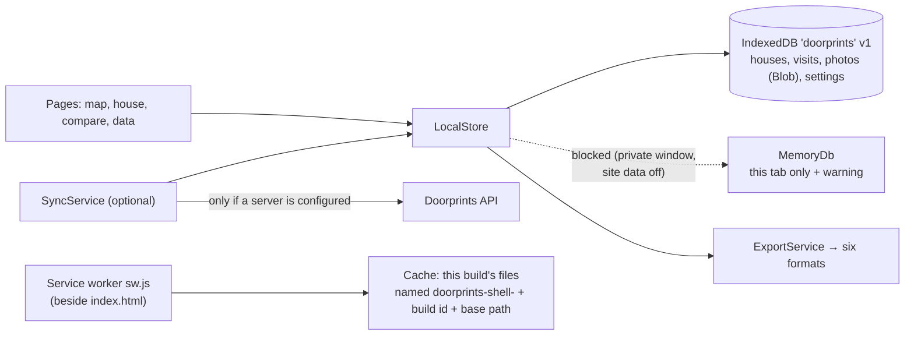

- **No route is guarded.** The app opens on the map with whatever the browser holds; `/connect` still exists for
  someone who wants sync, and that is all a server adds.
- **The service worker caches this build's files and nothing about the user.** `npm run build` stamps `sw.js` with
  a build id and the list of every file of the build (`scripts/sw-precache.mjs`), `install` downloads all of them
  into one cache per build, and `activate` drops this app's older caches for the same deployment path. Same-origin
  GET under the app's own base path only; `/api/...` and `sw.js` are skipped; cross-origin requests (tiles, fonts,
  the user's own server) are not touched at all. So there is no second copy of the user's data outside IndexedDB
  (SEC-044, [02](02-threat-model.md) T-I17). **Navigations are answered from the cache first**, with this build's
  `index.html`, so a weak connection never means a blank page; a new deploy arrives as a new worker and is
  announced (next bullet) rather than slipped in under the old one.
- **Updates are announced, not applied.** A waiting worker sets a signal; the page offers a reload; only then does
  the page post `skip-waiting`. Nothing reloads under the user's hands.
- **Install is offered, never pushed.** `beforeinstallprompt` is captured and kept, and the browser's own dialog opens
  only from a tap on *Install app*. The offer has a **permanent card** on *Your data* (*Install the app*, or "You are
  using the installed app") and appears **once** as a banner under the header, only after the first saved house;
  "Not now" there hides it for **30 days** (persisted), and the card stays. At most one non-error banner shows at a
  time, in the order **migration > update > install > storage risk** (`AppBanners`); the "browser is not storing
  anything" error can sit above one of them. iOS gets the Add-to-Home-Screen steps instead, because Safari has no
  such event ([05](05-ux-accessibility-i18n.md) §14.4).
- **Durability is stated, not assumed.** `StorageService` asks for `navigator.storage.persist()` and shows the
  answer and the used space. Safari and Chromium answer automatically from the user's interaction history without
  prompting (Safari commonly denies); Firefox asks. Safari also deletes script-written storage for an origin with no
  user interaction in the last seven days of browser use, and a site saved to the Home Screen or the Dock gets the
  browser app's quota ([MDN, *Storage quotas and eviction criteria*](https://developer.mozilla.org/en-US/docs/Web/API/Storage_API/Storage_quotas_and_eviction_criteria)).
  So persistence is never something to rely on: when the browser will not promise, the app says so and points at a
  backup ([02](02-threat-model.md) RR-10). When IndexedDB is unavailable entirely, `MemoryDb` keeps the session working and the app says
  plainly that nothing is being kept — a visible degradation rather than silent data loss.
- **Hosting (ADR-21).** `web.yml` deploys the ordinary production build (base href `/`) to **Firebase Hosting** on
  pushes to `main` and manual runs, at the root of the site's own origin `https://doorprints.web.app`. Every PWA path
  is relative (`"start_url"`/`"scope"` `"./"`), and the build writes the manifest's `"id"` as the absolute base path
  read from the built `<base href>`, so it is `"/"` there (it would be `"/<path>/"` if a build were served from a
  sub-path), because an `id` resolves against the origin ([07](07-secure-build-and-deploy.md) §6.3). Firebase sends
  the headers of `web/firebase.json`: the CSP (with `frame-ancestors`), HSTS, `X-Frame-Options`, `nosniff`,
  `Referrer-Policy`, `Permissions-Policy` and COOP reach the browser; the build-time `<meta>` CSP (copied from the
  same file) and the app's refusal to start inside a frame stay as defence in depth for copies on hosts that ignore
  `firebase.json` ([02](02-threat-model.md) F-31, T-T13). Caching: `Cache-Control: no-cache` on every path
  (Firebase's own default would be `max-age=3600`, and a rule for `/index.html` alone would not match `/` or a deep
  link); the service worker precache makes that cheap. A long `max-age` or `immutable` rule must not come back
  unless the rewrite is first narrowed, because the `**` rewrite answers a missing old chunk with the HTML shell and
  status 200 and header rules match the request path ([07](07-secure-build-and-deploy.md) §6.3).
