# 03: Software design document

| Field | Value |
|---|---|
| Document | Software Design Document (SDD) |
| Version | 0.7 |
| Date | 2026-09-22 |
| Author | Claude (Cowork) |
| Status | Draft |

## Change log

| Version | Date | Author | Change |
|---|---|---|---|
| 0.1 | 2026-09-22 | Claude (Cowork) | First version: architecture, C4, deployment, ERD, sequences, states, API reference, sync, geospatial, ADRs. Android edit and settings screens are described from the intended behaviour. |
| 0.2 | 2026-09-22 | Claude (Cowork) | Wave 2: filter chain (headers, size limit, rate limit, deny-by-default key check), photo tombstones (V3), ordered sync versions, client clock guard, export/erase endpoints, Android networking/i18n/Assistant, web AI pages and confirm dialog. Sequences 7.5 to 7.7 now describe built code. |
| 0.3 | 2026-09-22 | Claude (Cowork) | Sprint 1 fixes and Sprint 2 ([10](10-sprint-log.md)): web MapLibre GL 6.10 (ESM module worker served from `/maplibre/`, CSP `worker-src 'self'`, no `blob:` worker; F-27), compileSdk 37, embedded Tomcat 11.0.25 override (F-28), 32-char API key minimum and `APP_API_KEY_NEXT` dual key (F-01, SEC-017), release signing config (F-11), `SyncRules`/`StreetAlerts` extracted on Android, DB image runs as `postgres` (F-29). |
| 0.4 | 2026-09-22 | Claude (Cowork) | Sprint 3 ([10](10-sprint-log.md)): section 13 Providers row: embeddings now go to the native Gemini endpoint `models/{model}:batchEmbedContents` with the key in the `x-goog-api-key` header (`GeminiEmbeddingModel`, `AI_EMBEDDING_PROVIDER`, default `google-genai`; `openai` for Ollama); reindex returns 503 when a batch fails. Sequence 7.5 shows the question embedding call. Corrected the redaction claims (system context diagram, section 7.5 Ask sequence, AI data sources row): the contact name is not redacted before the LLM provider ([02](02-threat-model.md) F-30). |
| 0.5 | 2026-09-22 | Claude (Cowork) | Sprint 3 lead decisions ([10](10-sprint-log.md)): contact redaction (C-13, F-30 Fixed by the AI team): the system context diagram, sequence 7.5 and the section 13 AI data sources row now say that `ContactRedactor` keeps the contact name and phone out of the embedding text, Ask context and tool results. F-01 split in [02](02-threat-model.md) v0.6: `WebConfig` row points at F-01a, ADR-03 at F-01a/F-01b. |
| 0.6 | 2026-09-22 | Claude (Cowork), Docs team | New **ADR-13**: product renamed from House Hunt to **Doorprints** (tagline "Remember every house you've seen."): reason, what changed (display name, tagline, `applicationId` `app.doorprints`, CI artifact names, launcher icon, export file name, MCP server name) and what did not (Java/Kotlin packages and class names, repository name, storage keys, database, role, image and volume names, export format id, MCP tool names). System context and container diagrams, the export row in section 9 and the MCP row in section 13 use the new names. |
| 0.7 | 2026-09-22 | Claude (Cowork), Docs team | Vertex AI provider (AI team, same change set; [01](01-requirements.md) AI-016, [10](10-sprint-log.md) C-24). Section 13 Providers row now describes both providers and the `app.ai.provider` (`AI_PROVIDER`) switch: **aistudio** (default; OpenAI-compatible chat, native `batchEmbedContents` with `x-goog-api-key`) and **vertex** (chat through Spring AI's Google GenAI starter with the app's own google-genai `Client`; embeddings through the app's `VertexEmbeddingModel`, `:embedContent` or `:predict`, one text per call; OAuth bearer tokens from Application Default Credentials, no API key; `<location>-aiplatform.googleapis.com`). Section 9 and 13: the `503` problem for provider quota errors now carries `code: AI_QUOTA_EXHAUSTED` and a `Retry-After: 60` header; the spend cap case is open (AI-017). Section 2 context diagram and section 4.1 errors row updated. Review fix: section 9 and the section 4.1 errors row add the `setupHint` property on Vertex AI 401/403/404 (`AiExceptionHandler.SETUP_HINT_PROPERTY`). |

Related: [Requirements](01-requirements.md) · [Threat model](02-threat-model.md) · [DFDs](04-data-flow-diagrams.md) · [UX/a11y/i18n](05-ux-accessibility-i18n.md) · [Build and deploy](07-secure-build-and-deploy.md) · [AI docs](ai/)

---

## 1. Architecture overview

| Part | Tech | Responsibility | Source |
|---|---|---|---|
| Android app | Kotlin 2.4, Jetpack Compose (Material 3), Navigation, Room 2.8, WorkManager 2.10, DataStore, Play services location, MapLibre Android 13, OkHttp 4, kotlinx.serialization, Coil 3. minSdk 26, targetSdk 36, compileSdk 37 (AGP 9.4, built-in Kotlin). | Offline-first capture, Hunt mode, map/list/compare, background sync | `android/` |
| API | Java 25, Spring Boot 4.1.1 (Web MVC, Data JPA, Validation, Actuator, Flyway; embedded Tomcat pinned to 11.0.25 by `tomcat.version`, F-28), PostgreSQL JDBC | REST API, LWW upserts, change feed, geospatial queries, photo storage | `backend/` |
| Database | PostgreSQL 15+ with PostGIS 3 (pgvector planned) | System of record, spatial indexes, `sync_seq` | `backend/src/main/resources/db/migration/V1__init.sql` |
| Web app | Angular 22 (standalone, zoneless, signals), MapLibre GL 6.10 (ESM, module worker from `/maplibre/`), static build | Desktop review/edit/compare | `web/` |
| AI (planned) | Spring AI 2.0.1, pgvector, Gemini free tier or Ollama, MCP server | RAG Q&A, listing extraction, route planner, MCP tools | [ai/](ai/) |

Main ideas:

- **Offline-first on Android.** Room is the phone's source of truth. The server is a sync hub plus the web app's backend.
- **Client-generated UUIDs** for houses, visits and photos. Creates are idempotent (`PUT /api/houses/{id}`, photo `id` form field).
- **Change feed by sequence.** Every write takes `nextval('sync_seq')`. Clients pull `since=<cursor>`.
- **Simple single-user security.** One API key in the `X-API-Key` header, CORS allowlist, TLS at the host edge.
- **Zero cost.** Every component has a free-tier home (section 5).

## 2. C4 level 1: system context

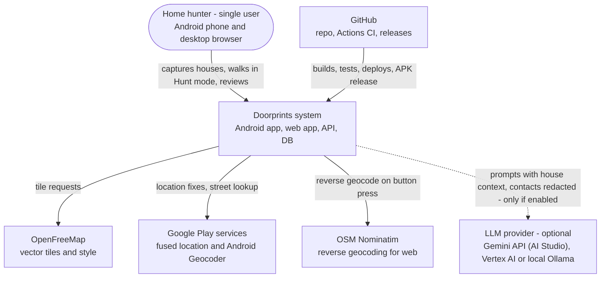

## 3. C4 level 2: containers

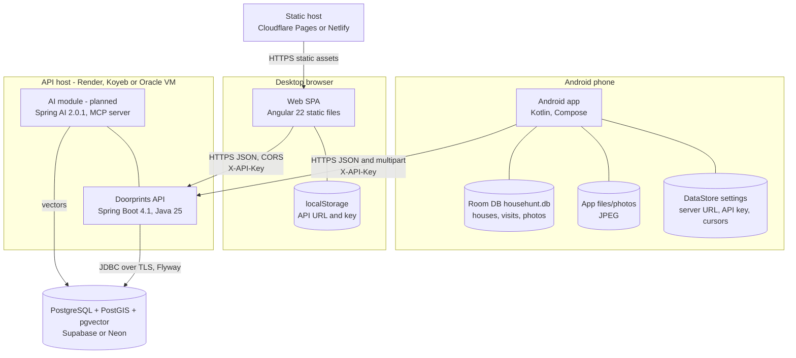

## 4. C4 level 3: components

### 4.1 API components

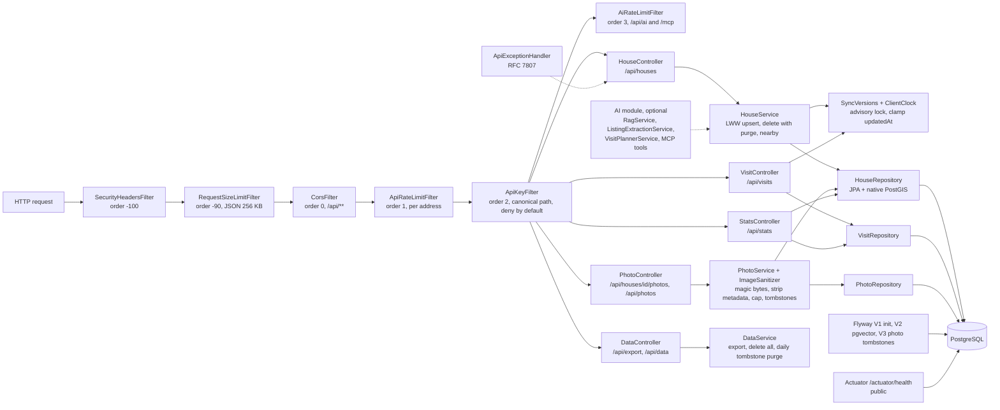

| Component | Class / file | Notes |
|---|---|---|
| Config | `config/AppProperties`, `config/WebConfig` | Fails at startup if `APP_API_KEY` is missing or shorter than 32 chars, or `APP_API_KEY_NEXT` is set and shorter than 32 (`ApiKeyFilter.validateKeys`, F-01a). Registers the filter chain (see diagram) and `@EnableScheduling`. `app.rate-limit.*`, `app.limits.*`, `app.sync.*`, `app.privacy.*`. |
| Auth | `config/ApiKeyFilter`, `RequestPaths` | Deny by default. Allowlist: `GET/HEAD /actuator/health[/**]` and CORS preflights. Non-canonical paths get 400 first. Accepts the current key and, during a rotation, the next key (SEC-017); every configured key is compared in constant time. Failed keys logged (salted address hash) and throttled to 429. |
| Limits and headers | `config/ApiRateLimitFilter`, `RequestSizeLimitFilter`, `SecurityHeadersFilter` | Token bucket per address (reuses `TokenBucketRateLimiter`), JSON body cap, `nosniff`/`DENY`/`no-referrer`/CSP/HSTS/`no-store` |
| Sync safety | `sync/SyncVersions`, `sync/ClientClock` | Advisory lock + `nextval` (section 10.4); clamp or reject client times |
| Privacy | `privacy/DataController`, `DataService` | Export, delete-all with confirmation header, daily purge of tombstones older than 90 days |
| Houses | `house/HouseController`, `HouseService`, `HouseRepository`, `House`, `HouseDto`, `HouseStatus` | Checklist is an `@ElementCollection` into `house_checklist` |
| Visits | `visit/VisitController`, `VisitRepository`, `Visit`, `VisitDto`, `VisitSource` | LWW logic is in the controller (not in a service, unlike houses). A deleted visit keeps no place (`purgePlace`). |
| Photos | `photo/PhotoController`, `PhotoService`, `ImageSanitizer`, `PhotoRepository`, `Photo`, `PhotoDto` | `bytea` storage, 30-day private cache header, tombstones with sync versions, change feed |
| Stats | `house/StatsController` | Counts |
| Errors | `common/ApiExceptionHandler`, `NotFoundException`, `ConflictException` | 400 / 404 / 409 / 413 as `ProblemDetail` (428 from `DataController`, 429 from the filters, 503 from `AiExceptionHandler`, with `code: AI_QUOTA_EXHAUSTED` and `Retry-After: 60` when the provider's quota is exhausted, and `setupHint` on a Vertex AI 401/403/404) |

### 4.2 Android components

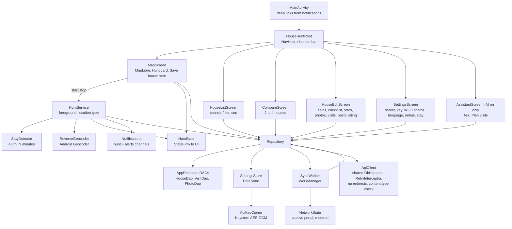

| Component | File | Responsibility |
|---|---|---|
| `HouseHuntApp` / `AppContainer` | `HouseHuntApp.kt` | Manual DI. Initialises MapLibre, notification channels and periodic sync. |
| `MainActivity` | `MainActivity.kt` | Turns notification extras into a `DeepLink` (open house / new house at lat,lon with visitId) |
| `HouseHuntRoot` | `ui/Root.kt` | Tabs: Map, Houses, Compare, (Assistant when AI is on), Settings. Routes `house/{id}` and `new?lat&lon&visitId`. Wraps everything in `HouseHuntTheme` (`ui/Theme.kt`: web tokens, dark scheme). |
| `MapScreen` | `ui/MapScreen.kt` | GeoJSON source of houses coloured by status, location dot, tap to open, long-press to create, Hunt card, permission requests (fine + coarse + notifications) |
| `HouseListScreen`, `CompareScreen` | `ui/*.kt` | List with search/filter/sort. Compare up to 4 (shortlisted first). |
| `HouseEditScreen` | `ui/HouseEditScreen.kt` | Every FR-002..FR-007 field; status as segmented buttons; rating and each checklist item as radio groups (TalkBack state); camera/gallery via `FileProvider` (`cache/camera/`), 20-photo cap; visit list, "I am here now"; "Paste listing" (AI) fills empty fields from `POST /api/ai/extract-listing` |
| `SettingsScreen` | `ui/SettingsScreen.kt` | Server URL (HTTPS check, `ServerUrl`), API key (masked hint, blank keeps the saved key), Save and test, Sync now, last sync result (translated `SyncOutcome`), photos only on Wi-Fi, language picker (`i18n/AppLocale`), Hunt settings, privacy note |
| `AssistantScreen` | `ui/AssistantScreen.kt` | Ask (answer without `[house:id]` markers, cited houses as cards) and Plan visits (stops in order with leg distance and time) |
| `HuntService` | `location/HuntService.kt` | Section 7.2, 7.3, 8.2 |
| `StayDetector`, `Geo`, `ReverseGeocoder` | `location/*.kt` | Pure stay logic (easy to unit test), haversine distance, Geocoder wrapper (API 33+ async) |
| `Repository` | `data/Repository.kt` | Only way to write data. Sets `dirty` + `updatedAt`, calls `syncSoon`, handles photos (downscale, EXIF rotation, JPEG q80, cap, offline delete queue), sync algorithm (section 10), AI calls and `aiEnabled` state |
| `SyncWorker` | `data/SyncWorker.kt` | Unique one-time "sync-now" (3 s delay, REPLACE) + 30-min periodic job + "sync-photos-wifi" (UNMETERED). Needs a network; skips captive portals. Exponential backoff from 30 s, up to 5 attempts; no retry on auth failure. |
| `ApiClient`, `RetryInterceptor` | `data/Api.kt`, `data/RetryInterceptor.kt` | Blocking OkHttp client on a shared pool, DTO mapping (epoch ms to ISO-8601), AI DTOs, typed `ApiException` kinds; retries with full-jitter backoff (docs/09 L4) |
| `SettingsStore`, `ApiKeyCipher`, `ServerUrl`, `SyncOutcome` | `data/*.kt` | DataStore settings; the key is stored as `v1:` + Base64(IV + AES-GCM ciphertext); URL validation; last sync result as a code |
| `AppLocale` | `i18n/AppLocale.kt` | Per-app language: `LocaleManager` on API 33+, SharedPreferences + context wrapping on 26–32 |

### 4.3 Web components

| Component | File | Responsibility |
|---|---|---|
| `ConfigService`, `configGuard` | `core/config.*` | Base URL + key in sessionStorage, or localStorage with "Remember on this device". Routes guarded until configured. |
| `AiService`, `aiErrorMsg`, `splitCitations` | `core/ai.service.ts` | `GET /api/ai/status` → `enabled` signal (hides all AI UI when false); extract, ask, plan calls; 429/503 messages; `[house:id]` markers to links |
| `ConfirmService`, `ConfirmDialog` | `core/confirm.service.ts`, `shared/confirm-dialog.ts` | Promise-based, translated, native modal `<dialog>` replacing `window.confirm()` |
| `apiInterceptor` | `core/api.interceptor.ts` | Only for `/api/...` URLs: adds the base URL prefix and `X-API-Key`. Third-party requests (Nominatim) are untouched. |
| `HouseApiService` | `core/house-api.service.ts` | All endpoints in section 9 |
| `GeocodeService` | `core/geocode.service.ts` | Nominatim reverse geocoding, only on button press |
| `resizeImage` | `core/image-resize.ts` | 1600 px JPEG q0.8 via canvas (drops EXIF) |
| `AuthImage` | `shared/auth-image.ts` | Fetches photos as blobs with the key header, then object URLs |
| `LocationMap`, `MAP_STYLE_URL`, `createMap` | `shared/*` | MapLibre GL 6 with OpenFreeMap "liberty" style. MapLibre 6 is ESM-only and no longer builds its worker from a `blob:` URL: `angular.json` copies `maplibre-gl-worker.mjs` and `maplibre-gl-shared.mjs` to `/maplibre/`, `shared/map-style.ts` calls `setWorkerUrl`, so the CSP can use `worker-src 'self'`. No WebGL 2 → a translated `role="status"` message instead of the map. Popups use `setDOMContent` + `textContent` only (F-27). |
| Pages | `pages/connect`, `map`, `house-detail`, `compare`, `ask`, `plan` | FR-024; `ask` and `plan` (FR-037, FR-039) are routed always but linked only when AI is on; `house-detail` has "Import from listing text" for new houses (FR-038) |

## 5. Deployment (free tier)

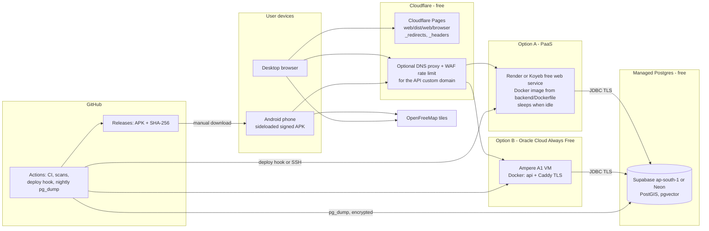

| Concern | Choice | Free-tier note (check current provider terms) |
|---|---|---|
| API runtime | Render/Koyeb free Docker service, **or** Oracle Always Free VM | PaaS sleeps after about 15 min idle, so cold starts take 30 to 60 s. The Android client uses a 90 s read timeout (NFR-002). Oracle VM is always on, but you run TLS (Caddy) and patching yourself. |
| Memory | `JAVA_TOOL_OPTIONS=-XX:MaxRAMPercentage=75 -XX:+UseSerialGC -Xss512k`, Hikari pool 5 | Fits 512 MB |
| DB | Supabase (Mumbai region available) or Neon | About 0.5 GB storage. Supabase pauses inactive free projects, so a keep-alive job is needed (08). |
| Web | Cloudflare Pages / Netlify, SPA fallback via `public/_redirects`, headers (CSP incl. `worker-src 'self'`) via `public/_headers` | Unlimited static requests |
| TLS | Provider edge TLS (Render/Koyeb/Pages) or Caddy on the VM | Required by SEC-004 |
| CI | GitHub Actions | Free for public repos, 2 000 min/month for private |

## 6. Data model

### 6.1 Server ERD (matches `V1__init.sql` + `V3__photo_tombstones_and_privacy.sql`)

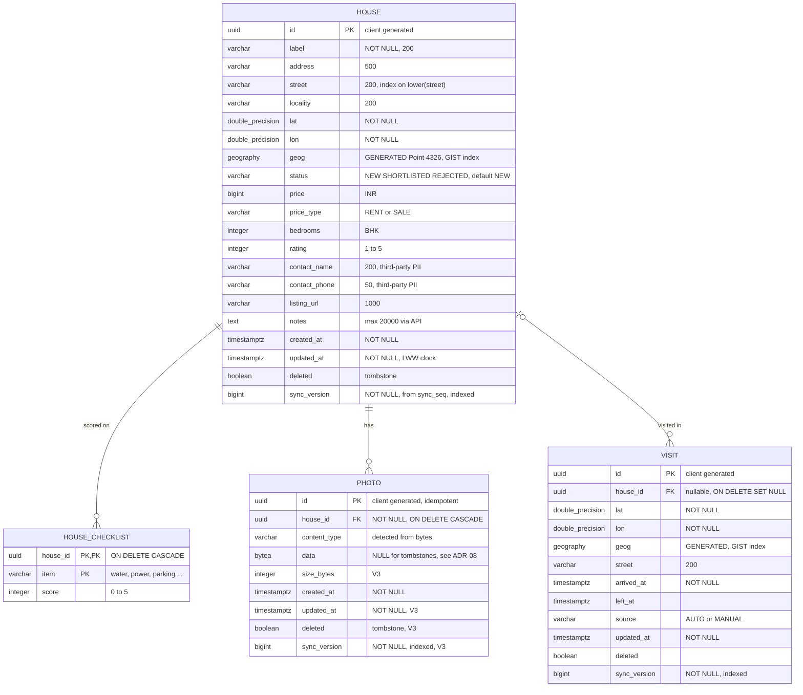

Sequence `sync_seq` is shared by `house`, `visit` and (since V3) `photo`. V2 (optional pgvector `vector_store`) belongs to the AI module. A deleted house keeps only `id`, `deleted`, timestamps and `sync_version` (content blanked, location 0,0); a deleted visit keeps no place.

### 6.2 Android Room schema (`househunt.db`, version 2)

| Table | Columns beyond the server model | Indexes |
|---|---|---|
| `houses` | `checklist` as a JSON string (TypeConverter). Epoch-ms timestamps. `dirty` flag. No `syncVersion`. | `street` |
| `visits` | epoch-ms timestamps, `dirty` | `houseId`, `street` |
| `photos` | `path` (file in `filesDir/photos`), `uploaded` flag, `deleted` flag (v2: delete queued for the server) | `houseId` |

Migration 1→2 (`AppDatabase.MIGRATION_1_2`) adds `photos.deleted INTEGER NOT NULL DEFAULT 0`. `exportSchema = false` still: turn it on and add a migration test (R-06).

### 6.3 Derived values

| Value | Formula | Implemented in |
|---|---|---|
| Overall score | `mean(checklist)` blended 50/50 with `rating` when both exist, else whichever exists, else null | `HouseEntity.score`, web `houseScore()` |
| Distinct streets | `count(distinct lower(street))` over live houses | `HouseRepository.countDistinctStreets` |

## 7. Sequence diagrams

### 7.1 Save a house offline, then sync

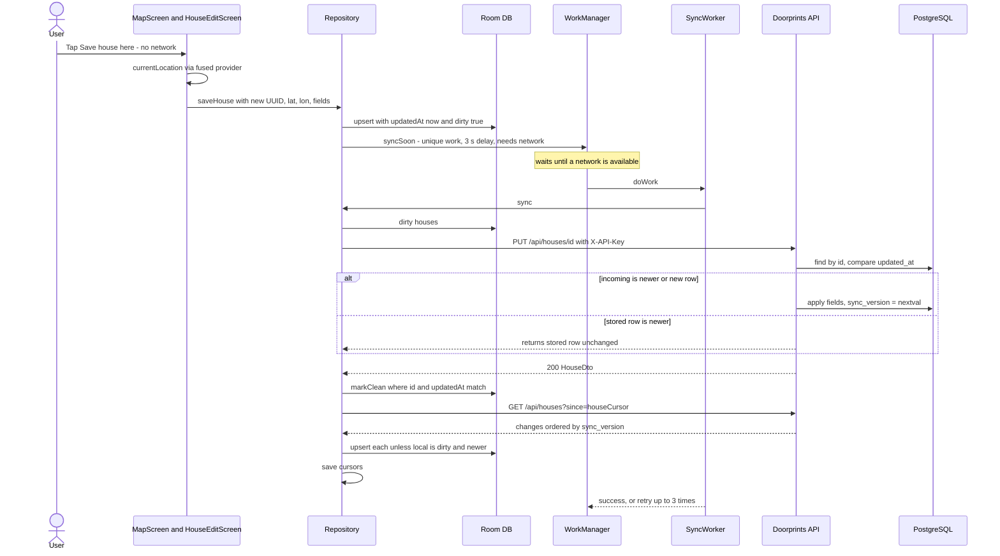

### 7.2 Hunt mode: passing a visited house, entering a known street

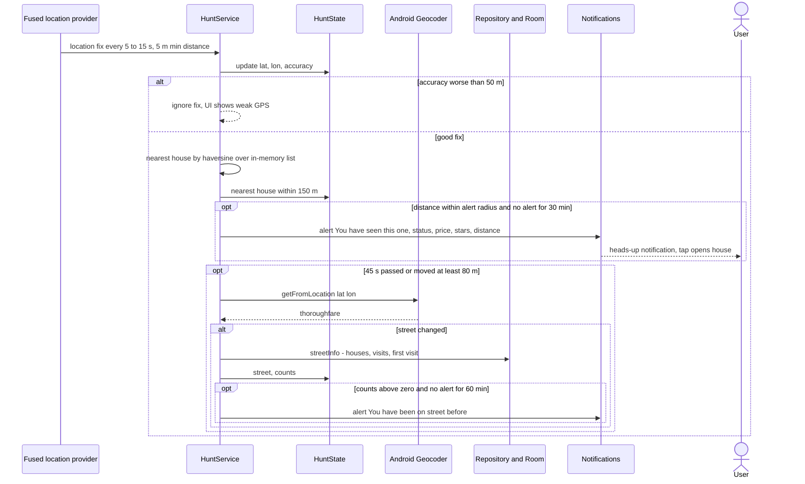

### 7.3 Stay detection and "Are you at a house?" prompt

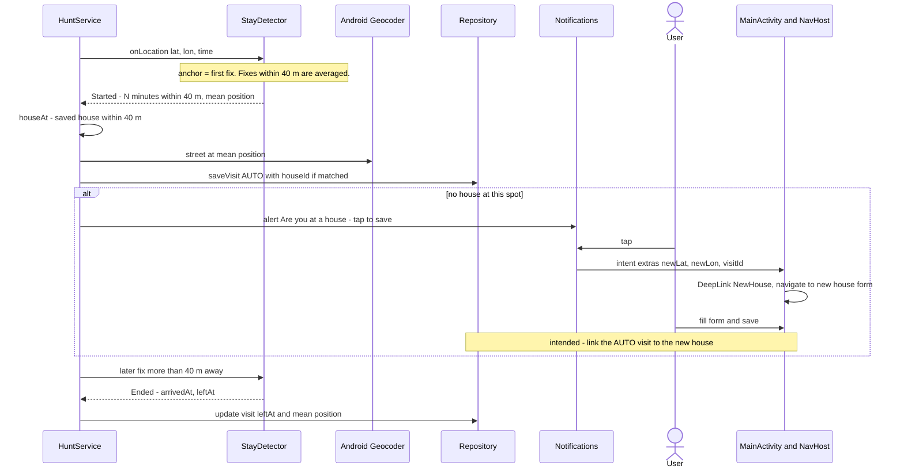

### 7.4 Photo capture and upload

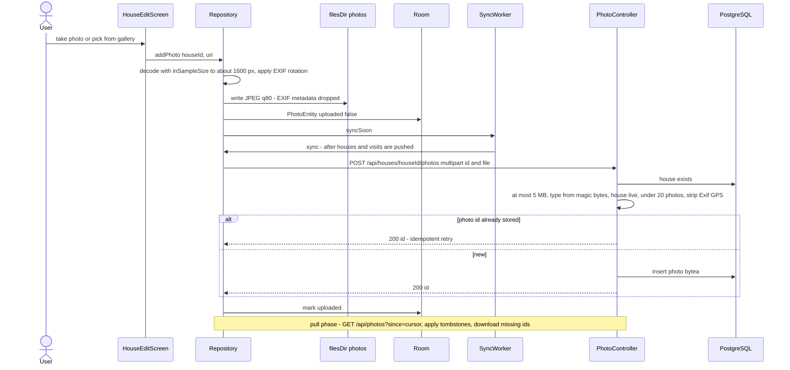

The web app uses the same endpoint. It resizes in the browser (`resizeImage`) and generates the photo UUID on the client.

### 7.5 RAG question: "Ask my house hunt" (built; UI: web `pages/ask`, Android `AssistantScreen`)

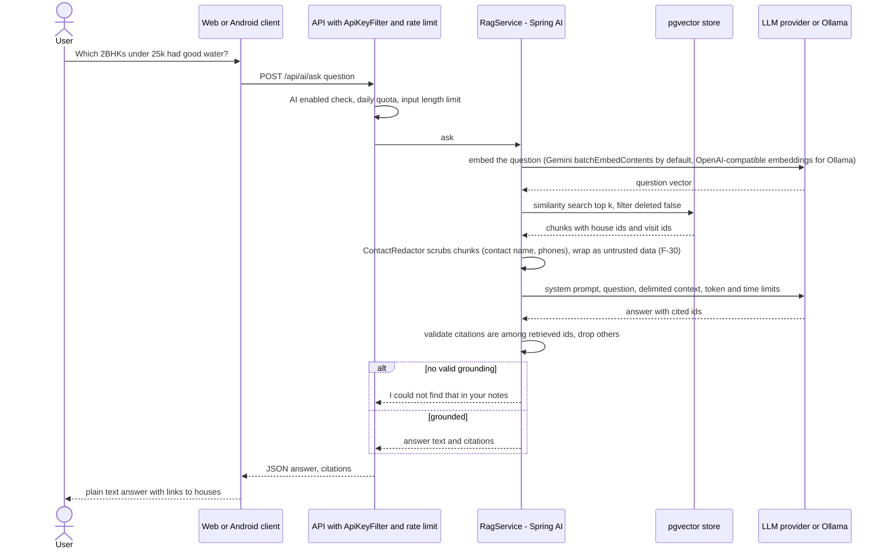

### 7.6 Listing text extraction (built; UI: web new-house form, Android "Paste listing")

The request field is `text` at `POST /api/ai/extract-listing`; the response is `HouseDraft` with `warnings` (see [ai/ai-design.md](ai/ai-design.md) §13). The clients copy only fields the listing provided, append amenities to the notes and show the warnings.

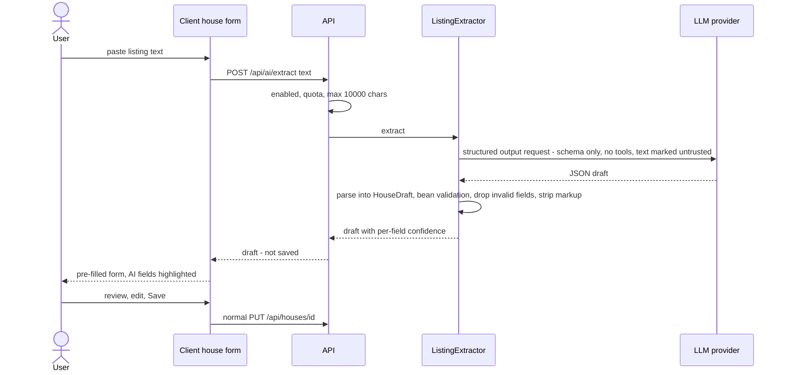

### 7.7 Plan my visits (built; UI: web `pages/plan`, Android `AssistantScreen`)

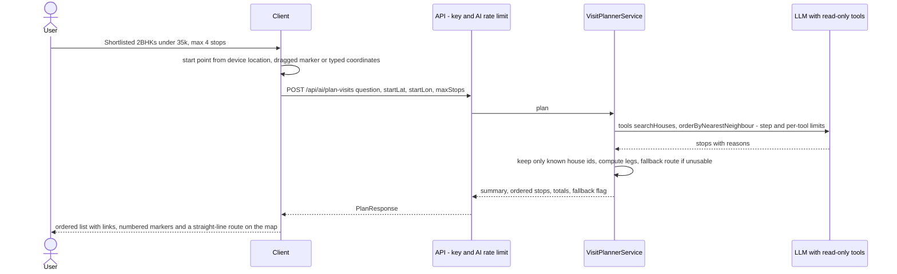

## 8. State diagrams

### 8.1 House status

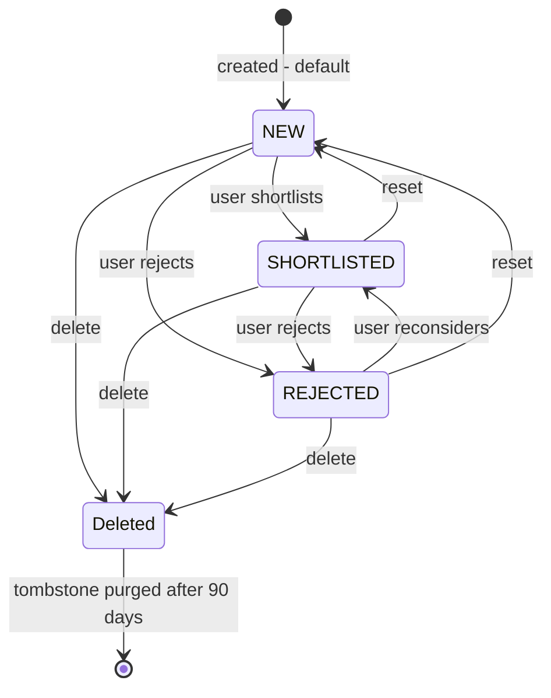

Status is a plain field with no server-side transition rules. Any value can change to any other. "Deleted" is the `deleted` flag, not a status value.

### 8.2 Hunt service

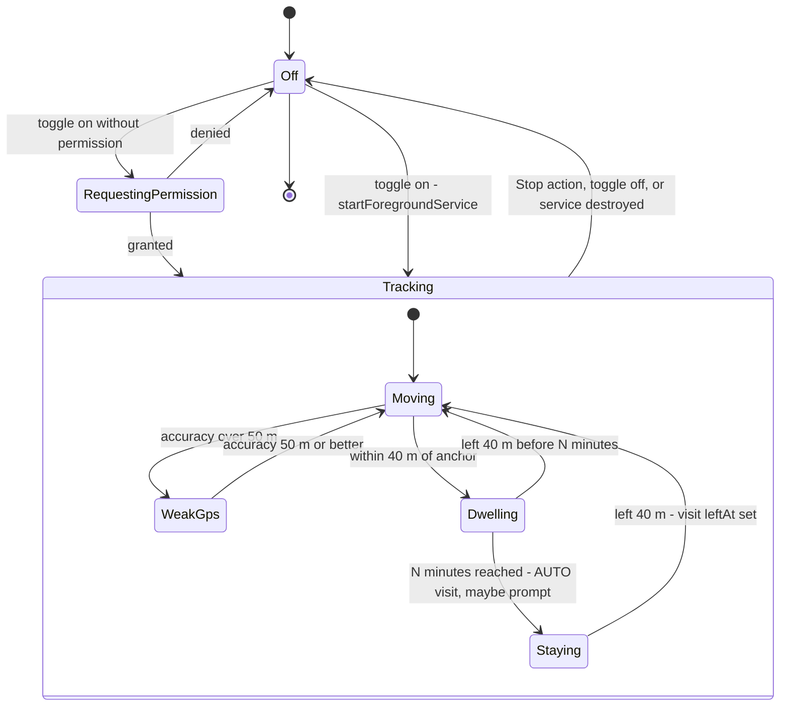

`HuntState` exposes `active`, `staying`, `street`, nearest house and accuracy to the UI. `onStartCommand` returns `START_STICKY`. See R-01 for Android 12+/14 restart limits.

## 9. API reference

Base path `/api`. Auth: header `X-API-Key: <key>` on every `/api/**` call (401 JSON on failure). Errors: RFC 7807 `ProblemDetail`. Times: ISO-8601 UTC. IDs: UUID.

| Method | Path | Params / body | Response | Notes |
|---|---|---|---|---|
| GET | `/api/houses` | `since` (long, optional) | `HouseDto[]` | Without `since`: live houses, newest `updatedAt` first. With `since`: all changes including tombstones, ordered by `syncVersion`. |
| GET | `/api/houses/{id}` | - | `HouseDto` | 404 if unknown (tombstones are returned) |
| PUT | `/api/houses/{id}` | `HouseDto` JSON (validated) | `HouseDto` | Create or LWW update. Returns the stored row if it is newer. |
| DELETE | `/api/houses/{id}` | - | 204 | Tombstone + new sync version; content blanked, photos tombstoned, visits unlinked. A PUT with `deleted: true` does the same. |
| GET | `/api/houses/nearby` | `lat` (−90..90), `lon` (−180..180), `radius` (m, > 0, default 50, capped 5000) | `HouseDto[]` with `distanceMeters` | At most 50, nearest first, live only. 400 on out-of-range values. |
| GET | `/api/houses/street` | `name` (1..200) | `HouseDto[]` | Case-insensitive exact match on `lower(street)` (uses the index), live only |
| GET | `/api/houses/{houseId}/photos` | - | `UUID[]` | Live photos, ordered by `createdAt` |
| POST | `/api/houses/{houseId}/photos` | multipart: `file` (JPEG/PNG/WebP by magic bytes, at most 5 MB), `id` (UUID, optional) | `{ "id": UUID }` | Idempotent on `id` (never resurrects a deleted photo). 404 if the house is unknown or deleted, 400 if not an image, 409 over 20 photos, 413 over 5 MB. Metadata stripped. |
| GET | `/api/photos?since=` | `since` (long, required) | `PhotoDto[]` | Change feed: `{id, houseId, contentType, sizeBytes, createdAt, updatedAt, deleted, syncVersion}`, no bytes |
| GET | `/api/photos/{id}` | - | image bytes | `Cache-Control: private, max-age=2592000`. 404 for tombstones. |
| DELETE | `/api/photos/{id}` | - | 204 | Tombstone (bytes removed) + new sync version. No error if missing or already deleted. |
| GET | `/api/visits` | `since` or `houseId` (optional) | `VisitDto[]` | `since`: change feed. `houseId`: live visits for the house, newest first. Neither: all live visits. |
| PUT | `/api/visits/{id}` | `VisitDto` JSON | `VisitDto` | LWW. `source` defaults to MANUAL. |
| DELETE | `/api/visits/{id}` | - | 204 | Tombstone; the place (lat/lon/street/leftAt) is removed |
| GET | `/api/stats` | - | `{houses, shortlisted, rejected, visits, streets}` | |
| GET | `/api/export` | - | `{format, exportedAt, houses[], visits[], photos[{photo, photoUrl}]}` | `Content-Disposition: attachment; filename="doorprints-export-<UTC date>.json"` (was `house-hunt-export-…` before the rename). `format` stays `house-hunt-export/1`: it versions the file layout (ADR-13). Live data only; photo bytes via `photoUrl`. |
| DELETE | `/api/data` | header `X-Confirm-Delete: DELETE-ALL-MY-DATA` | 204 | Hard-deletes houses, visits, photos and AI index rows. 428 without the exact header. Devices keep their local copies. |
| GET | `/actuator/health` | - | `{"status":"UP"}` | **Public**, no details |
| GET, POST | `/api/ai/status`, `/api/ai/extract-listing`, `/api/ai/ask`, `/api/ai/plan-visits`, `/api/ai/reindex` | see [ai/ai-design.md](ai/ai-design.md) §13 | | Same key; AI rate limit (except status); 404 when AI is off |
| POST, GET | `/mcp` | MCP Streamable HTTP | | Off by default; same key (or Bearer) |

Common statuses: 400 invalid input or non-canonical path, 401 missing/wrong key, 404, 409 conflict (photo cap, photo id of another house), 413 body too large, 428 missing confirmation header, 429 rate limited (`Retry-After`), 503 AI provider unavailable (`"retryable": true`; when the provider answered HTTP 429 / `RESOURCE_EXHAUSTED`, AI Studio or Vertex AI, the problem also has `"code": "AI_QUOTA_EXHAUSTED"` and the response a `Retry-After: 60` header, so clients and the eval harness can tell a quota stop from an outage without parsing text; the status stays 503 so existing clients keep working; on Vertex AI 401/403/404 the problem also has `setupHint`, an owner-facing string with env-var names (`GCP_LOCATION`, `AI_VERTEX_EMBEDDING_LOCATION`) and the configured location only, never the project id or the provider message). A spend cap trip has no distinct code yet ([01](01-requirements.md) AI-017).

**HouseDto** fields: `id, label*, address, street, locality, lat*, lon*, status, price, priceType, bedrooms, rating, contactName, contactPhone, listingUrl, notes, checklist{item→0..5}, createdAt, updatedAt, deleted, syncVersion, distanceMeters`. Validation is in [01 FR-002](01-requirements.md#61-houses).
**VisitDto** fields: `id, houseId, lat*, lon*, street, arrivedAt*, leftAt, source, updatedAt, deleted, syncVersion`.

## 10. Sync algorithm

### 10.1 Principles

| Rule | Detail |
|---|---|
| Identity | UUIDs created on the client, so offline creates never collide and retries are idempotent |
| Local change tracking | `dirty = true` and `updatedAt = now()` on every local write (`Repository.saveHouse/saveVisit`) |
| Server ordering | Each accepted write takes the advisory lock, then `sync_version = nextval('sync_seq')` (one sequence for houses, visits and photos), so versions become visible in order (10.4) |
| Cursors | Separate `houseCursor`, `visitCursor` and `photoCursor` in DataStore. They reset to 0 when the server URL changes. The photo cursor does not move past downloads skipped on a metered network. |
| Conflict policy | LWW on `updatedAt`, applied on the server (stored newer means the incoming write is ignored) and on the client (local dirty and newer means the incoming change is skipped). The server clamps a client `updatedAt` more than 5 min ahead to its own clock (`ClientClock`). |
| Deletes | Tombstones (`deleted = true`) travel through the same feeds; they carry no content and are purged after 90 days |
| Photos | Push: queued deletes first (any network), then uploads of rows with `uploaded = false` if their house is not deleted (unmetered only, when the Wi-Fi setting is on). A permanent 4xx (not an image, cap reached) keeps the photo local only. Pull: `GET /api/photos?since=photoCursor`; tombstones delete local files, new photos of live houses are downloaded. |

### 10.2 Client pseudocode (`Repository.sync`)

```text
if server not configured: return "offline"
for h in houses where dirty:   PUT house; markClean(h.id, h.updatedAt)   # only if not edited meanwhile
for v in visits where dirty:   PUT visit; markClean(v.id, v.updatedAt)
for p in photos where deleted:  DELETE photo (404 is fine); remove row
for p in photos where !uploaded and house not deleted:
    if photos not allowed on this network: waiting++ ; continue
    POST photo(id); uploaded = true              # 400/404/409 -> keep local only
(hc, vc, pc) = cursors
for dto in GET houses?since=hc: hc = max(hc, dto.syncVersion)
    if local.dirty and local.updatedAt > dto.updatedAt: skip else upsert(dto, dirty=false)
same for visits with vc
save cursors (hc, vc)
for ch in GET photos?since=pc:
    if ch.deleted: delete local file and row
    else if missing locally and house live: download (or waiting++ and stop advancing pc)
    advance pc while every change so far is fully handled
save photo cursor; return SyncOutcome(pushed, pulled, waiting)
```

The server's LWW decision is final. After a push that lost, the client gets the winning row back on the next pull, because a write that lost does not advance `sync_version`. The pull then overwrites the (now clean) local row.

### 10.3 Triggers

`syncSoon` (3 s delay, unique REPLACE, so bursts of edits collapse) after each change. Periodic every 30 min. Both need a network; a captive portal skips the run. Exponential backoff from 30 s, up to 5 attempts (none after an auth failure). When photos are waiting for Wi-Fi, a unique UNMETERED job (`sync-photos-wifi`) runs as soon as Wi-Fi is available. Inside a run, each idempotent request is retried up to 3 times with full-jitter backoff ([09](09-osi-layer-analysis.md) L4).

### 10.4 Sync correctness fixes (wave 2) and remaining issues

**Ordered sync versions (F-09, fixed).** Without coordination, transaction A can take version 41, B take 42 and commit first; a client that pulls in between stores cursor 42 and never sees 41. Every writer now calls `SyncVersions.lock()` (`select count(*) from pg_advisory_xact_lock(0x48480000002A)`) before reading the row it will change, and `SyncVersions.next()` (lock, then `nextval`). The lock is held until commit or rollback, so while version N is uncommitted nobody can take N+1: versions become visible in exactly the order they were assigned, and a reader either sees N or nothing above N−1. Rolled-back versions leave harmless gaps. Readers never take the lock. The same lock makes the last-write-wins check and the write atomic. Cost: writes are serialised, a few milliseconds each, which is fine for one user. Alternatives considered: a "safe watermark" (return only versions below the oldest in-flight one, needs tracking of in-flight transactions) and an overlap window (`since = cursor − k` with de-duplication, needs a guess for k).

**Client clock (F-08, fixed).** `ClientClock.accept`: null means now; more than `app.sync.max-clock-skew-seconds` (300) ahead is clamped to server now; more than `max-future-days` (365) ahead or before 2000 is a 400. Visit arrival/departure times are validated but not clamped (they describe events, not edit order).

| Issue | Ref | Status |
|---|---|---|
| Photo deletes were not synced and photos had no version | F-15 | Fixed: V3 tombstones + `/api/photos?since=` + Android delete queue |
| Push is not atomic: a crash between PUT and `markClean` repeats the PUT | - | Harmless, because the upsert is idempotent |
| `GET ?since=` is unbounded | F-19 | Add `limit` + loop until empty |

## 11. Geospatial design

| Aspect | Design |
|---|---|
| Storage | `lat`, `lon` as `double precision`, plus the generated column `geog geography(Point, 4326) = ST_SetSRID(ST_MakePoint(lon, lat), 4326)::geography`. Clients never write `geog`. |
| Why geography | Distances in metres on the spheroid with no projection choices. India spans several UTM zones (ADR-05). |
| Index | `GIST (geog)` on `house` and `visit` |
| Nearby query | `ST_DWithin(h.geog, point::geography, :radius)` (uses the index) + `ST_Distance` for ordering, `LIMIT 50`, radius capped at 5 000 m |
| Street query | `findLiveOnStreet`: native `lower(street) = lower(:street)`, which uses `house_street_idx`. For Indic scripts `lower()` is a no-op (no letter case), so matching is exact. |
| On-device matching | The phone holds all live houses in memory (`repo.houses` Flow) and computes haversine distance per fix, so no network is needed (NFR-003, NFR-004). The stay radius is 40 m, the alert radius 30 m (configurable), and fixes worse than 50 m are ignored. |
| Street names | Android: `Address.thoroughfare` from the Android Geocoder. Web: Nominatim `road`/`pedestrian`/`residential`. The two geocoders can spell the same street differently ("1st Main Rd" vs "1st Main Road"), which can make street alerts miss. Planned: normalise names (lower case, expand Rd/St/Mn, trim numbers) before comparing. |
| Coordinates precision | The web rounds to 6 decimals (about 0.1 m) |

## 12. Security design (summary)

Full analysis is in [02](02-threat-model.md).

| Control | Current | Planned |
|---|---|---|
| Authentication | `ApiKeyFilter`: deny by default, canonical paths only, shared key, constant-time compare, failed attempts logged and throttled. Startup fails if a key is shorter than 32 chars. Optional `APP_API_KEY_NEXT` for zero-downtime rotation. | Per-device keys later (SEC-025) |
| Transport | Host-edge TLS; HSTS from the API over HTTPS and from `_headers` on the web; Android cleartext only for local dev hosts, system CAs only, no redirects | Cert pinning rejected (09 §7) |
| CORS | Allowlist from `APP_CORS_ORIGINS`, `/api/**` only, methods GET/POST/PUT/DELETE/OPTIONS, headers `X-API-Key`, `Content-Type`, `Authorization`, `X-Confirm-Delete`; exposes `Retry-After`, `Content-Disposition`; max-age 1 h | Unchanged |
| Input validation | Bean validation on DTOs and query params. JSON 256 KB, multipart 5 MB file / 6 MB request. Image type from magic bytes. 20 photos per house. Client clock checks. | Unchanged |
| Output | JSON via Jackson. Angular/Compose render text (no HTML). API CSP `default-src 'none'`, `nosniff`, `no-store`. Web strict CSP (`script-src 'self'`, `worker-src 'self'`, `object-src 'none'`, `frame-ancestors 'none'`). | – |
| Rate limiting | In-app token buckets: 600/min per address, 10/min wrong keys, AI 10/min | Cloudflare in front where the host allows |
| Secrets | Env vars (`APP_API_KEY`, optional `APP_API_KEY_NEXT`, `DB_*`); Keystore-encrypted key on the phone; sessionStorage by default on the web; release keystore only as CI secrets (`HH_*`) or outside the repo | GitHub Secrets / provider secret store |
| Data at rest | Provider disk encryption (Supabase/Neon). Android FBE. No backups of the key. | Encrypted backups (age) |
| Privacy | No raw tracks, EXIF dropped on clients and server, visible FGS, tombstones without content, 90-day purge, export and erase endpoints | App buttons for export/erase, web privacy page |

## 13. AI integration design (overview)

The AI team owns the details in [docs/ai/](ai/). This document only fixes the integration contract:

| Item | Contract |
|---|---|
| Packaging | A Spring module/package in the same API process (free tier: one service). Beans are created only when `app.ai.enabled=true` and a provider is configured (AI-001). |
| Providers | Chosen by configuration only: `app.ai.provider` (`AI_PROVIDER`), **`aistudio`** (default) or **`vertex`**; both use the same model ids (`gemini-3.5-flash` chat, `gemini-embedding-2` at 768 dimensions), so the index stays valid across a switch (re-index once anyway). `AiDefaultsEnvironmentPostProcessor` selects the matching Spring AI auto-configurations and forces all of them off when AI is off. **aistudio:** chat through Spring AI 2.0.1 `ChatClient` over the OpenAI-compatible API of Gemini (API key `AI_API_KEY`; paid tier for real data, PRV-022) or Ollama (local/VM). Embeddings (since Sprint 3, `app.ai.embedding.provider`): by default the app's own `GeminiEmbeddingModel` calls the **native** Gemini API, `POST {AI_EMBEDDING_BASE_URL}/models/{model}:batchEmbedContents` (up to 100 texts per call, `outputDimensionality` 768), with the key only in the `x-goog-api-key` header, never in the URL; errors carry the HTTP status only. Gemini's OpenAI-compatible `/embeddings` is not used because its response omits `data[].index`, which Spring AI's OpenAI client rejects. With `AI_EMBEDDING_PROVIDER=openai` (Ollama) embeddings use the OpenAI-compatible `/embeddings` like chat. **vertex:** Google Cloud Vertex AI in an AI-only project. Chat through Spring AI's Google GenAI starter (`spring-ai-starter-model-google-genai`, `GoogleGenAiChatModel`) with the app's own google-genai `Client` (`VertexAiConfiguration`: project, location, timeout, bounded retries), `POST https://<location>-aiplatform.googleapis.com/v1beta1/projects/<p>/locations/<l>/publishers/google/models/<model>:generateContent` (`global`: `aiplatform.googleapis.com`). Embeddings through the app's own `VertexEmbeddingModel`: `:embedContent` for `gemini-embedding-2` (one text per call) or `:predict` for `gemini-embedding-001`, same retries, `Retry-After` handling, normalisation and exception type as `GeminiEmbeddingModel`; optional separate `AI_VERTEX_EMBEDDING_LOCATION`. Auth: `Authorization: Bearer` OAuth access tokens from Google **Application Default Credentials** (`GoogleAccessTokenSource`: Workload Identity Federation in CI, the attached service account on Cloud Run, `gcloud` locally); no API key or express mode. Default location `asia-south1` (data residency attribute, 04 DF-21/DF-32). **Both:** vectors in pgvector in the same Postgres (`CREATE EXTENSION vector`, Flyway migration owned by the AI team). `ProviderErrors` classifies HTTP 429 / `RESOURCE_EXHAUSTED` from either provider as a quota error: the API answers 503 with `code: AI_QUOTA_EXHAUSTED` and `Retry-After: 60`, and `POST /api/ai/reindex` stops at the first such batch (it returns 503 if any batch fails). `AI_INDEX_ON_CHANGE=false` embeds only on re-index. Trust boundaries: 02 T-I20, T-I22; flows: 04 E6, DF-21, DF-32. Details: [ai/ai-design.md](ai/ai-design.md) §2.1, §3.1, §3.3; owner setup [ai/vertex-setup.md](ai/vertex-setup.md). |
| Data sources | `house` (label, locality, notes, checklist, price, status), `visit` (street, times). The contact name and phone are never included: `HouseDocuments` has no Contact line and redacts free text, `RagService` scrubs retrieved chunks (also ones indexed before the fix) and the agent/MCP tool results carry no contact fields (`ContactRedactor`, AI-010, [02](02-threat-model.md) F-30 Fixed in Sprint 3; details in [ai/](ai/ai-design.md) §9.1). |
| Endpoints | Under `/api/ai/**`, so they are covered by `ApiKeyFilter`, CORS, the general and the AI rate limits. Clients: web `core/ai.service.ts`, Android `ApiClient` AI methods; both hide AI UI unless `GET /api/ai/status` says `enabled`. |
| MCP | House tools (search, get, nearby, stats) exposed through the Spring AI MCP server at `/mcp`; it reports `serverInfo.name` `doorprints` (`spring.ai.mcp.server.name`); tool names such as `askHouseHunt` are unchanged (ADR-13). Same key. Read-only by default (AI-007). |
| Sequences | Sections 7.5 and 7.6 |
| Safety | AI-003..AI-011, threat IDs T-T7, T-I7, T-I8, T-D4, T-E2, T-S6 |

## 14. Architecture decision records

| ADR | Decision | Alternatives | Rationale / consequences |
|---|---|---|---|
| ADR-01 | **Foreground location service + in-app distance checks** for Hunt mode | Android Geofencing API | Geofencing needs `ACCESS_BACKGROUND_LOCATION` (a hard permission for sideloaded apps and more invasive for privacy), allows 100 geofences per app, has a background latency of minutes, and cannot do street detection or stay detection. A visible FGS runs only while the user wants it (PRV-001/002), gives 5 to 15 s updates and uses all houses. Cost: higher battery use while on (NFR-005), and Android 14 FGS type rules. |
| ADR-02 | **MapLibre + OpenFreeMap** tiles | Google Maps SDK, Mapbox, raw OSM tile servers | No API key, no billing account, vector tiles, same style on web and Android, OSM data is good in Indian cities. The OSM tile server policy forbids heavy app use. Risk: a community service with no SLA, so the style URL is a single constant and easy to swap. |
| ADR-03 | **Single API key** for v1 | OAuth2/OIDC (Keycloak, Auth0 free, Supabase Auth), per-device keys | One user and no login UI. Works for background sync without token refresh. Risks accepted with rotation, TLS and rate limits ([02](02-threat-model.md): F-01a key length and rotation Fixed, F-01b per-device keys Open). The upgrade path is per-device hashed keys, then OIDC. |
| ADR-04 | **Offline-first with client UUIDs, server sequence cursor, LWW** | CRDTs, per-field merge, server timestamps as cursor | Simple and fits a single user. A sequence cursor avoids clock problems in the feed. LWW can drop concurrent edits (RR-06). |
| ADR-05 | **PostGIS `geography`** with a generated column | `geometry` + projection, plain lat/lon + haversine in SQL | Correct metres, index support, clients stay unaware of it |
| ADR-06 | **Node only as a build tool**, static SPA | Angular SSR / Node API | No Node server to patch or host. Free static hosting. One backend language (Java). Smaller attack surface. |
| ADR-07 | **Android Geocoder** for Hunt-mode street lookup, **Nominatim** only on web button press | Nominatim everywhere, paid geocoders | Nominatim's policy forbids periodic/automatic use. The Android Geocoder is free and keyless (it sends coordinates to Google, disclosed in PRV-007). |
| ADR-08 | **Photos in Postgres `bytea`** for v1 | Object storage (Cloudflare R2, Supabase Storage), filesystem | One store, transactional, a single backup, no extra credentials. Consequences: DB quota and memory (F-06). Revisit when the DB reaches 60% of quota. |
| ADR-09 | **Flyway** SQL migrations, `ddl-auto: none` | Hibernate auto DDL | Reviewable, reproducible schema. PostGIS features need hand-written SQL anyway. |
| ADR-10 | **Sideloaded signed APK** from GitHub Releases | Play Store ($25), F-Droid | Zero cost. The user must allow "install unknown apps" and check the checksum (SEC-018). No automatic updates. |
| ADR-11 | **AI optional and in-process**, pgvector in the same DB | Separate AI service, hosted vector DB | Free tier allows one service and one DB. Feature flag keeps the core app independent (AI-001). |
| ADR-12 | **Manual DI** (`AppContainer`) on Android | Hilt/Koin | Small app, fewer dependencies (supply chain), faster builds |
| ADR-13 | **Rename the product from House Hunt to Doorprints** (2026-09-22, product owner), tagline "Remember every house you've seen.". Names only, no behaviour change | Keep "House Hunt"; a full rename including code packages, repository, storage keys and database names | **Reason:** "House Hunt" made the app sound like a property-listings site (search houses for rent or sale), while it is a personal record of the houses the user has seen in person. **Changed:** the display name in all four languages (Android `app_name`, now translatable and the same in every language; notification channel text and the lock-screen public version "Doorprints alert"; web `<title>`, header and page titles "<page> · Doorprints", `application-name`); a translated tagline (Android `app_tagline` on the empty house list and in a new Settings *About* section; web `app.tagline`, also the meta description); a new Android launcher icon (a door with footprints); Android `applicationId` **`app.doorprints`** (was `com.househunt.app`) and Gradle root project `Doorprints`; CI artifact names **`doorprints-debug-apk`**, **`doorprints-release-apk`**, **`doorprints-web-dist`** (were `house-hunt-*`); web package `doorprints-web`; Maven `<name>` and `spring.application.name` `doorprints-api`; MCP `serverInfo.name` `doorprints`; export download file `doorprints-export-<date>.json`; eval scorecard title; docs, README and CHANGELOG. **Not changed, on purpose:** Java/Kotlin packages (`com.househunt`, `com.househunt.app`, which is also the Android `namespace` for `R` and `BuildConfig`) and class names (`HouseHuntApp`, `HouseHuntRoot`, `HouseHuntTheme`), so no source file moves; the repository name `house-hunt`; storage keys that hold existing data: web `localStorage` `house-hunt.lang` and `house-hunt.api-config`, the Android Keystore alias `house_hunt_api_key_v1`, the Room file `househunt.db`; database, role and schema names (`househunt`, `househunt_app`), the compose volume `dbdata18` and project name, the image names `house-hunt-api` and `house-hunt-db`, Maven `groupId`/`artifactId`; the export `format` id `house-hunt-export/1`; MCP tool names (`askHouseHunt`, …); the `HH_*` signing secrets and the CI keystore file name; the feature name "Hunt mode". Renaming any of these would lose saved settings or data, break existing deployments and backups, or touch every source file for no user benefit. **Consequences:** Android treats `app.doorprints` as a new app: builds made before the rename (`com.househunt.app`, never published) are not upgraded, install side by side and keep their own local data, so sync them first and then uninstall them (08 §6.2). Everything derived from the id follows it (FileProvider authority `${applicationId}.files`). `adb` commands name the activity by its class: `app.doorprints/com.househunt.app.MainActivity`. |

## 15. Design risks and open items

| ID | Risk / open item | Mitigation / next step |
|---|---|---|
| R-01 | Android 12+ restricts starting foreground services from the background. A `START_STICKY` restart of a location FGS after process death may throw or silently fail without background location permission. | Sprint 2: `HuntService.onStartCommand` catches the `startForeground` failure (missing permission on API 34+, background restart on API 31+), stops itself and returns `START_NOT_STICKY`; `HuntService.start` returns false without a location permission, and the map card then asks for it. Still to do: field test TC-F-07 and a "Hunt mode stopped, tap to resume" notification. |
| R-02 | Street name mismatch between geocoders | Normalisation (section 11) |
| R-03 | Cold starts delay the first sync by up to 60 s | 90 s timeout. The web shows a "waking server" message. Optional keep-alive (check provider terms). |
| R-04 | DB free quota used up by photos | F-06 actions, size monitoring (08) |
| R-05 | Export is JSON only; photos are fetched one by one via `photoUrl`. No export/erase buttons in the apps yet. | A ZIP export would need streaming (heap limit); add app buttons that call the API |
| R-06 | Room `exportSchema=false`; the 1→2 migration is untested | Enable schema export and add a `MigrationTestHelper` test |
| R-07 | Hard delete-all leaves copies on devices (no tombstones for hard deletes) | Documented in 08 §6.2; users clear app data per device |
| R-08 | The advisory lock serialises all writes | Fine for one user; revisit if multi-user |
