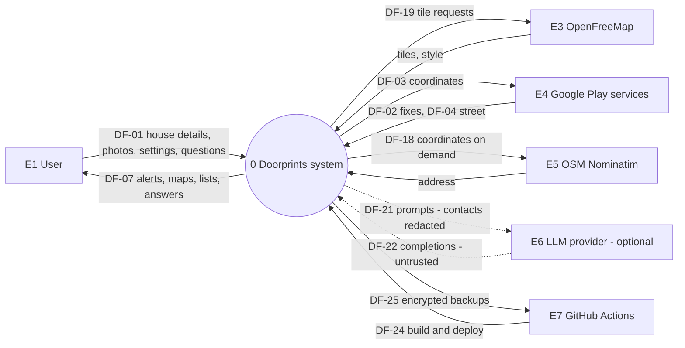
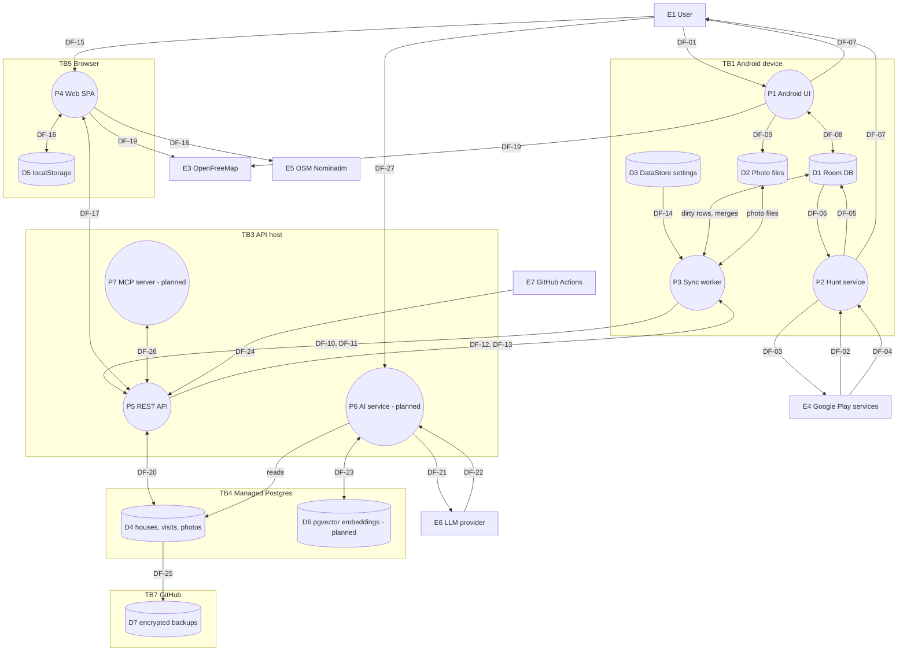
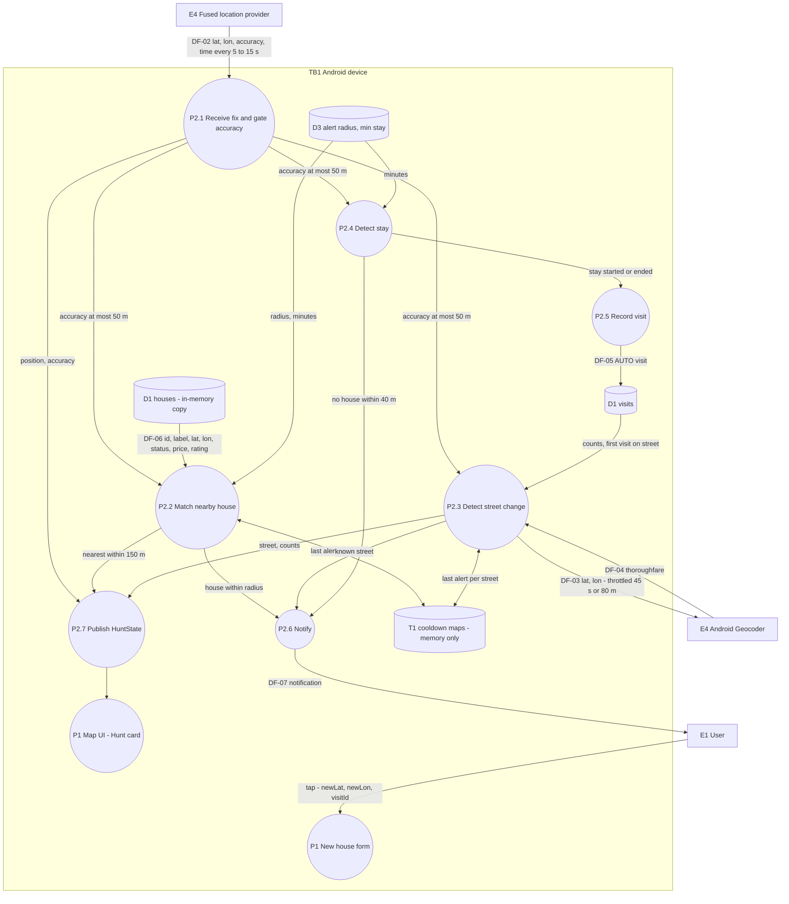
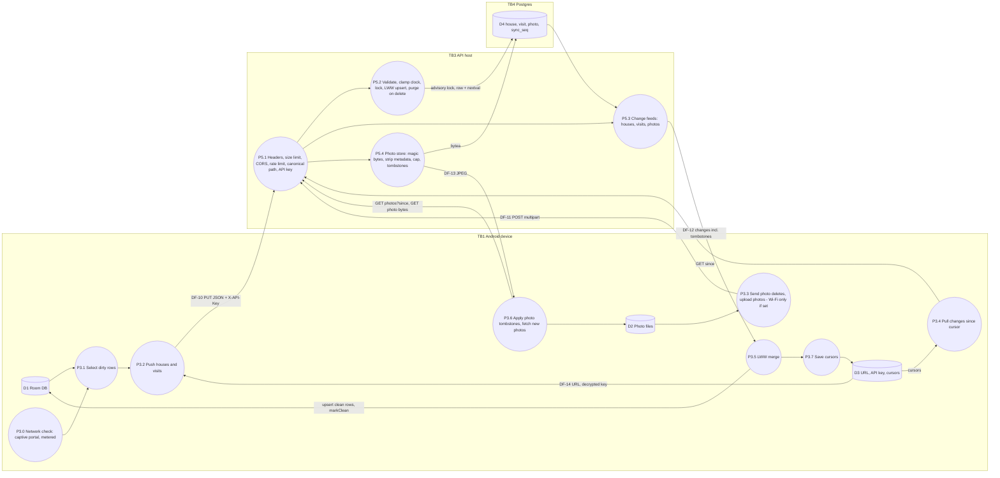
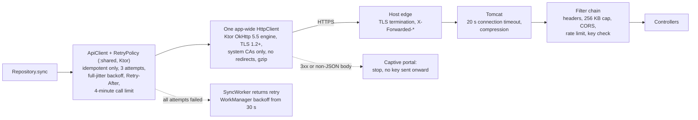
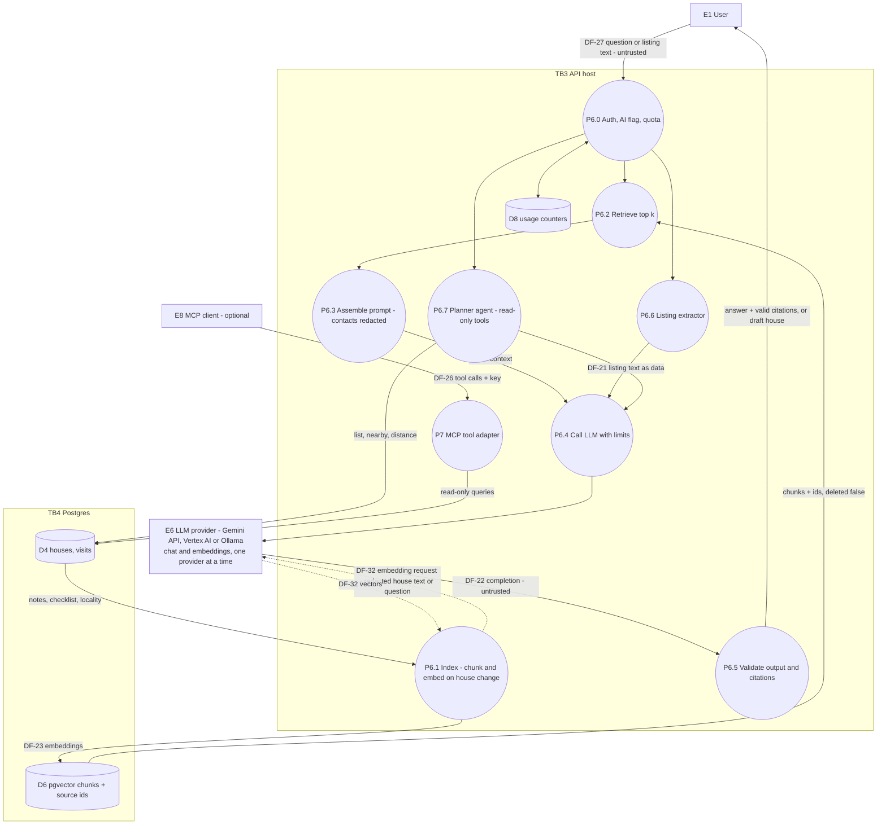

# 04: Data flow diagrams

| Field | Value |
|---|---|
| Document | Data flow diagrams (DFD) and data dictionary |
| Version | 0.7 |
| Date | 2026-09-22 |
| Author | Claude (Cowork) |
| Status | Draft |

## Change log

| Version | Date | Author | Change |
|---|---|---|---|
| 0.1 | 2026-09-22 | Claude (Cowork) | First version: DFD levels 0 and 1, level 2 for Hunt mode, Sync and AI/RAG. Data dictionary with sensitivity classes. |
| 0.2 | 2026-09-22 | Claude (Cowork) | Wave 2: sync DFD with the server filter chain, photo tombstone feed, network checks and Wi-Fi-only photos; new level-2 DFDs for the AI UI flows (section 6.1) and for the OSI transport path (section 5.1); data dictionary and stores updated (encrypted key, sessionStorage, export/erase, retention). |
| 0.3 | 2026-09-22 | Claude (Cowork) | Sprint 3 ([10](10-sprint-log.md)): the unnamed embedding request in the AI DFD (section 6) is now **DF-32** (P6 ↔ E6), with a data dictionary row: by default embeddings go to the native Gemini endpoint `models/{model}:batchEmbedContents` with the key in the `x-goog-api-key` header; Ollama uses the OpenAI-compatible `/embeddings`. Same external host as chat, no new trust boundary. DF-23 (P6 ↔ D6 vectors in pgvector) is unchanged. The contact name is part of the DF-32 embedding text and the DF-21 context and is not redacted ([02](02-threat-model.md) F-30): C2 handling rule, DF-21 and DF-32 rows and the level-0/AI diagram labels ("redacted" removed from DF-21 and P6.3) corrected. |
| 0.4 | 2026-09-22 | Claude (Cowork) | Sprint 3 lead decisions ([10](10-sprint-log.md)): contact redaction (C-13) is in code, so F-30 is Fixed ([02](02-threat-model.md) v0.6): C2 handling rule, DF-21 and DF-32 rows and the diagram labels (level-0 DF-21, AI P6.3 and DF-32) say the contact name and phone are redacted. |
| 0.5 | 2026-09-22 | Claude (Cowork), Docs team | Product rename to **Doorprints** ([03](03-design.md) ADR-13), names only: level-0 process P0 and DF-07 (lock screen shows "Doorprints alert"). The store names `househunt.db` (D1) and `house-hunt.api-config` (D5) are unchanged on purpose so existing data and settings keep working. No new flow, store or trust boundary. |
| 0.6 | 2026-09-22 | Claude (Cowork), Docs team | Vertex AI provider (AI team, same change set; [10](10-sprint-log.md) C-24 asked for this sync when the code landed). **E6** now has three forms chosen by `AI_PROVIDER`: Gemini API / AI Studio (`generativelanguage.googleapis.com`, `x-goog-api-key`), **Vertex AI** (`<location>-aiplatform.googleapis.com`, or `aiplatform.googleapis.com` for `global`, or `aiplatform.<loc>.rep.googleapis.com` for the multi-regions `us`/`eu` (added in review); OAuth bearer tokens from Application Default Credentials / Workload Identity Federation) and Ollama. New note in section 6 on E6. **DF-21** and **DF-32** give the endpoint, credential and the Vertex **location as a data-residency attribute** (default `asia-south1`, Mumbai; `global` gives no residency guarantee; embeddings may use a separate `AI_VERTEX_EMBEDDING_LOCATION`). DF-22 unchanged. |
| 0.7 | 2026-09-22 | Claude (Cowork), Docs team | Sprint 3.5 (KMP `:shared` module, commit `8f583af`, [03](03-design.md) ADR-14): section 5.1 transport path shows the shared Ktor `ApiClient` with `RetryPolicy` and the app-wide `HttpClient` on the OkHttp 5.5 engine instead of OkHttp's `RetryInterceptor`; same rules (idempotent only, 3 attempts, full jitter, `Retry-After`, no redirects, content-type check, 4-minute call limit). Vertex AI setup outcome (owner, 2026-09-22): the E6 Vertex row and **DF-32** record the configured locations (chat `asia-south1`; embeddings `global`, because `gemini-embedding-2` is not offered in `asia-south1`), so embedding text leaves India residency ([02](02-threat-model.md) T-I20). |

Related: [Threat model](02-threat-model.md) (uses these element IDs) · [Design](03-design.md) · [Requirements](01-requirements.md) · [AI docs](ai/)

---

## 1. Notation

| Symbol (Mermaid) | DFD element | ID prefix |
|---|---|---|
| Rectangle `["..."]` | External entity | E |
| Circle `(("..."))` | Process | P (level 1), P2.x (level 2) |
| Cylinder `[("...")]` | Data store | D |
| Arrow with label | Data flow | DF (see the data dictionary, section 7) |
| Dashed subgraph | Trust boundary | TB |

**Sensitivity classes** (used in section 7):

| Class | Name | Examples | Handling |
|---|---|---|---|
| C3 | Restricted | API key, location fixes, visits (time + place), house coordinates together with notes, backups | TLS in transit. Never logged. Encrypted backups. Minimal third-party exposure. |
| C2 | Confidential | Notes, ratings, prices, photos, contact name/phone (third-party PII), LLM prompts | TLS. Kept out of logs. Stored contact name and phone never sent to an LLM: `ContactRedactor` redacts them in embedding text, Ask context and tool results (AI-010, [02](02-threat-model.md) F-30 Fixed in Sprint 3). |
| C1 | Internal | Stats, street names alone, tile coordinates, build artifacts | TLS preferred |
| C0 | Public | Health status, static web assets, map styles | None |

## 2. Level 0: context diagram

## 3. Level 1: system decomposition

| Element | Description | Code |
|---|---|---|
| P1 | Compose UI: map, list, compare, edit, settings | `android/.../ui/*`, `MainActivity` |
| P2 | Hunt foreground service | `location/HuntService`, `StayDetector`, `ReverseGeocoder` |
| P3 | WorkManager sync | `data/SyncWorker`, `Repository.sync`, `ApiClient` |
| P4 | Angular SPA | `web/src/app/*` |
| P5 | Spring Boot API | `backend/src/main/java/com/househunt/*` |
| P6, P7 | AI service, MCP server (planned) | [ai/](ai/) |
| D1 | `househunt.db`: `houses`, `visits`, `photos` | `data/AppDatabase` |
| D2 | `filesDir/photos/*.jpg` (and `cache/camera/` for captures) | `Repository.addPhoto`, `res/xml/file_paths.xml` |
| D3 | DataStore `settings`: serverUrl, **apiKey**, radius, stay minutes, cursors, last sync | `data/Settings.kt` |
| D4 | Postgres `house`, `house_checklist`, `visit`, `photo`, `sync_seq` | `V1__init.sql` |
| D5 | `house-hunt.api-config` = {baseUrl, **apiKey**} (key name kept at the Doorprints rename) | `core/config.service.ts` |
| D6 | Vector store (planned) | AI team |
| D7 | Nightly `pg_dump`, encrypted with age | 08 section 3 |

## 4. Level 2: Hunt mode (P2)

Privacy notes: raw fixes are **never stored** (only DF-05 stay points). T1 is in memory only and is cleared when the service stops. DF-03 goes to Google (PRV-007).

## 5. Level 2: Sync (P3 ↔ P5)

### 5.1 Transport path of one sync request (see [09](09-osi-layer-analysis.md))

## 6. Level 2: AI / RAG (P6, built; off by default)

The AI team owns the detailed design ([ai/](ai/)). This diagram fixes the trust boundaries the threat model assumes.

**E6, the LLM provider, has one of three forms**, chosen by `AI_PROVIDER` (`app.ai.provider`) and never mixed at run
time ([03](03-design.md) §13, [ai/ai-design.md](ai/ai-design.md) §2.1, §3.3):

| Form | Host | Credential on the wire | Where the data is processed |
|---|---|---|---|
| Gemini API / AI Studio (`aistudio`, default) | `generativelanguage.googleapis.com` (chat on the OpenAI-compatible path, embeddings on the native API) | API key: `Authorization: Bearer` for chat (OpenAI-compatible client), `x-goog-api-key` header for embeddings; never in the URL | Google chooses; the free tier may use prompts to improve Google products, so real data only with a paid-tier key (PRV-022, [02](02-threat-model.md) T-I20) |
| Vertex AI (`vertex`) | `<location>-aiplatform.googleapis.com` (for example `asia-south1-aiplatform.googleapis.com`), or `aiplatform.googleapis.com` for `global`; the multi-regions `us` and `eu` use `aiplatform.<loc>.rep.googleapis.com` (for example `aiplatform.eu.rep.googleapis.com`, `VertexEndpoints`); path `/v1beta1/projects/<project>/locations/<location>/publishers/google/models/<model>:generateContent`, `:embedContent` or `:predict` | Short-lived OAuth access token (`Authorization: Bearer`) from Application Default Credentials: Workload Identity Federation in CI, the attached service account on Cloud Run, `gcloud` locally, or a JSON key only on a non-Google host ([02](02-threat-model.md) T-I22); optional `x-goog-user-project`. No API key | The **location** is a data-residency attribute of the flow: `GCP_LOCATION` (default `asia-south1`, Mumbai) for chat and `AI_VERTEX_EMBEDDING_LOCATION` (default the same) for embeddings; `global` lets Google pick the region, with no residency guarantee. Model availability per location is checked in [ai/vertex-setup.md](ai/vertex-setup.md) step 8. **Configured (owner, 2026-09-22):** chat in `asia-south1`; embeddings on `global` (`gemini-embedding-2` is not offered in `asia-south1`), so DF-32 has no India residency guarantee ([02](02-threat-model.md) T-I20) |
| Ollama (`aistudio` with `AI_BASE_URL` and `AI_EMBEDDING_PROVIDER=openai`) | localhost or the owner's VM | Any non-empty value | On the owner's machine |

In every form chat and embeddings go to the same provider, so the TB3 ↔ TB6 boundary of [02](02-threat-model.md)
is the only one crossed; Vertex AI adds the token exchange with Google's identity services, which carries no house
data.

### 6.1 AI flows from the clients (wave 2 UI)

The start location for "Plan visits" (class C3) goes to the API and, as part of the planner's tool results, may reach the LLM provider. The UI discloses that questions and matching house notes are sent to the configured provider (AI-010).

## 7. Data dictionary

| DF | From → To | Data elements | Class | Protocol / protection | Notes |
|---|---|---|---|---|---|
| DF-01 | E1 → P1 | label, address, price, BHK, contact name/phone, listing URL, notes, rating, checklist, status, photos, settings | C2 (contact = third-party PII) | On device | FR-002..FR-007 |
| DF-02 | E4 → P2 | lat, lon, accuracy, time | **C3** | Play services IPC | Not persisted |
| DF-03 | P2 → E4 | lat, lon | **C3** | Google (TLS) | Throttled. Disclosed (PRV-007). |
| DF-04 | E4 → P2 | thoroughfare, locality, address line | C1 | TLS | |
| DF-05 | P2 → D1 | AUTO visit: id, houseId, lat, lon, street, arrivedAt, leftAt | **C3** | Room (app sandbox, FBE) | Stay points only |
| DF-06 | D1 → P2 | live houses | C2 | In process | |
| DF-07 | P2/P1 → E1 | Notification: house label, status, price, stars, distance, street counts | C2 | System UI | Private visibility; lock screen shows "Doorprints alert" only (F-14 fixed) |
| DF-08 | P1 ↔ D1 | house/visit rows | C2/C3 | Room | |
| DF-09 | P1 → D2 | JPEG (EXIF removed) | C2 | App files | PRV-008 |
| DF-10 | P3 → P5 | HouseDto / VisitDto JSON + `X-API-Key` | **C3** | HTTPS only (cleartext only to local dev hosts), gzip responses | F-02 fixed |
| DF-11 | P3 → P5 | multipart photo + id | C2 | HTTPS | at most 5 MB; metadata stripped again on the server; Wi-Fi only by default |
| DF-12 | P5 → P3 | change feeds incl. tombstones (houses, visits, photo metadata) | **C3** | HTTPS | Tombstones carry no content. Unbounded (F-19 limit is backlog). |
| DF-13 | P5 → P3 | photo bytes | C2 | HTTPS | private cache 30 d |
| DF-14 | D3 → P3 | server URL, **API key**, cursors | **C3** | DataStore; key AES-256-GCM with a Keystore key (F-03 fixed) | |
| DF-15 | E1 → P4 | API base URL, API key | **C3** | Typed by the user | |
| DF-16 | P4 ↔ D5 | {baseUrl, apiKey} | **C3** | sessionStorage by default; localStorage only with "remember" (F-04 fixed) | |
| DF-17 | P4 ↔ P5 | all API calls, photo blobs | **C3** | HTTPS + CORS | |
| DF-18 | P4 → E5 | lat, lon (+ IP, Referer, User-Agent) | C3 point / C1 result | HTTPS | Only on button press |
| DF-19 | P1/P4 → E3 | tile z/x/y, style (+ IP) | C1 | HTTPS | Shows the area viewed |
| DF-20 | P5 ↔ D4 | SQL rows, photo bytea | **C3** | JDBC, TLS required (SEC-019) | |
| DF-21 | P6 → E6 | system prompt, question, retrieved house text (contact name and phone redacted, F-30 Fixed) or listing text | C2 | HTTPS to the provider chosen by `AI_PROVIDER` (section 6, E6): AI Studio `generativelanguage.googleapis.com/v1beta/openai/` with the API key; Vertex AI `POST https://<location>-aiplatform.googleapis.com/v1beta1/projects/
/locations/<l>/publishers/google/models/<model>:generateContent` (host `aiplatform.googleapis.com` for `global`, `aiplatform.<loc>.rep.googleapis.com` for the multi-regions `us`/`eu`) with an OAuth bearer token from ADC (no API key); or localhost for Ollama. **Location (Vertex AI):** `GCP_LOCATION`, default `asia-south1` (processing in India); `global` has no residency guarantee | Opt-in (AI-001, AI-010). Real user data only to a paid tier or Vertex AI (PRV-022). Credential: [02](02-threat-model.md) T-I20, T-I22 |
| DF-22 | E6 → P6 | completion, structured JSON | C2, **untrusted** | HTTPS | Validated (AI-005) |
| DF-23 | P6 ↔ D6 | vectors + source IDs + chunk text | C2 | JDBC TLS | Deleted with the source (AI-011) |
| DF-24 | E7 → P5 | container image / deploy hook | C1 (integrity critical) | HTTPS, GitHub OIDC or secret | 07 |
| DF-25 | D4 → D7 | `pg_dump` custom format, age-encrypted | **C3** | TLS + encryption at rest | 08 |
| DF-26 | E8 ↔ P7 | MCP tool calls/results | **C3** | stdio/localhost or HTTPS + key | Read-only by default |
| DF-27 | E1 → P6 | question, listing text | C2, **untrusted** | HTTPS + key | Prompt injection source |
| DF-28 | P5 → monitor | `/actuator/health` status | C0 | HTTPS | Public |
| DF-29 | P5 → E1 (download) | `GET /api/export` JSON of all live data | **C3** | HTTPS + key | Attachment; handle as sensitive |
| DF-30 | E1 → P5 | `DELETE /api/data` + `X-Confirm-Delete` | – | HTTPS + key | Irreversible; logged at WARN |
| DF-31 | P1/P4 → P5 → P6 | plan-visits start lat/lon | **C3** | HTTPS + key | Only on user action |
| DF-32 | P6 ↔ E6 | Embedding request: house text built by `HouseDocuments` (label, address, street, locality, price, size, status, rating, checklist, visit summary, notes; no contact line, and the contact name and phone-like numbers in free text are replaced by `[contact]` / `[phone]`) on indexing, the question on Ask; response: 768-d vectors | C2 | `AI_PROVIDER=aistudio` (default) with `AI_EMBEDDING_PROVIDER=google-genai`: HTTPS to the native Gemini API `POST …/v1beta/models/{model}:batchEmbedContents` (up to 100 texts per call), key only in the `x-goog-api-key` header (never in the URL), no redirects followed. `openai` (Ollama): OpenAI-compatible `/embeddings` at `AI_BASE_URL`, localhost or HTTPS. `AI_PROVIDER=vertex`: HTTPS `POST https://<location>-aiplatform.googleapis.com/v1beta1/projects/
/locations/<l>/publishers/google/models/<model>:embedContent` (host as in DF-21, including `aiplatform.<loc>.rep.googleapis.com` for `us`/`eu`) (`gemini-embedding-2`) or `:predict` (`gemini-embedding-001`), **one text per call**, OAuth bearer token from ADC, no API key; **location** `AI_VERTEX_EMBEDDING_LOCATION` (default `GCP_LOCATION`, `asia-south1`) is the data-residency attribute and may differ from the chat location; **configured: `global`** (2026-09-22, [ai/vertex-setup.md](ai/vertex-setup.md) step 8), so the redacted house text and Ask questions are processed outside India residency | Opt-in (AI-001). Same provider and TB3 ↔ TB6 boundary as DF-21/DF-22 (02), so no new trust boundary. With `AI_INDEX_ON_CHANGE=false` the per-save embedding request is not sent; only the re-index sends house text. Contact redaction by `ContactRedactor` since Sprint 3 (F-30 Fixed, [02](02-threat-model.md)); reindex once after deploying. Named in v0.3 (the flow existed unnamed since v0.1). |

## 8. Data store inventory and retention

| Store | Content | Class | Encryption at rest | Retention (target) |
|---|---|---|---|---|
| D1 Room | houses, visits, photo index | C3 | Android FBE | Until the user deletes it / uninstalls |
| D2 Photo files | JPEGs | C2 | Android FBE | Same as D1 |
| D3 DataStore | URL, **API key** (encrypted), cursors, prefs | C3 | Key: AES-256-GCM, Android Keystore; excluded from backup and device transfer | Until reset |
| D4 Postgres | everything | C3 | Provider-managed disk encryption | Tombstones (no content) purged after 90 d (`DataService.purgeTombstones`). `DELETE /api/data` erases everything. |
| D5 sessionStorage / localStorage | URL, **API key** | C3 | None (origin-isolated; strict CSP) | Tab lifetime by default; until "Disconnect" with "remember" |
| D6 pgvector | chunks, vectors | C2 | Provider | Deleted with the source |
| D7 Backups | pg_dump | C3 | age (X25519) | 30 days rolling |
