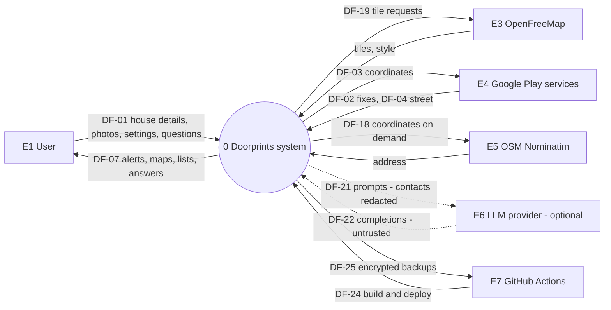
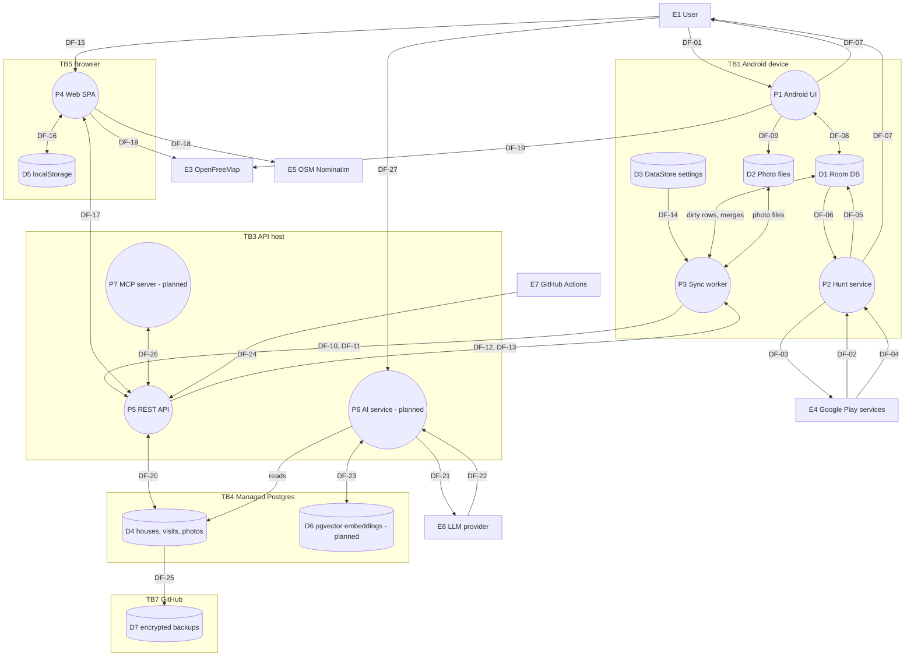
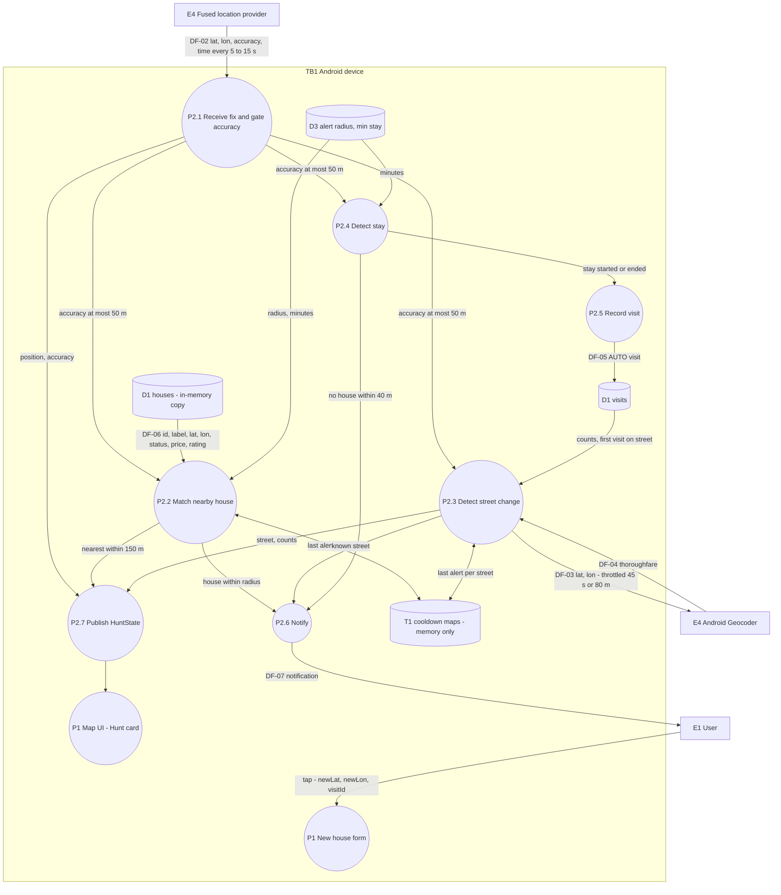
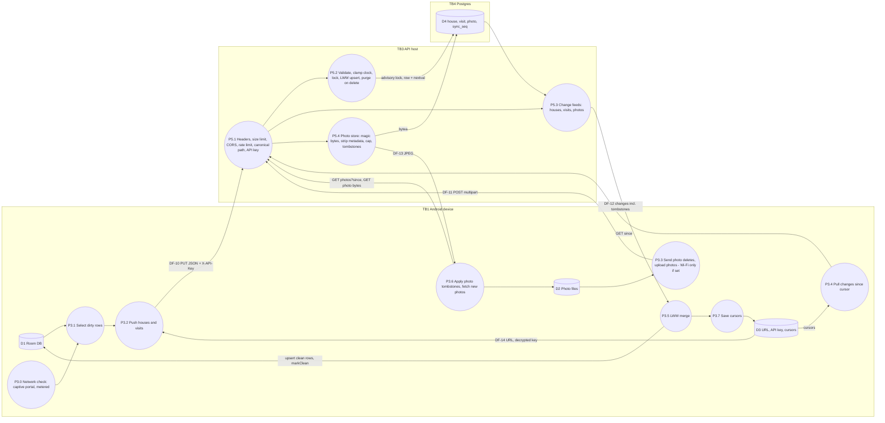
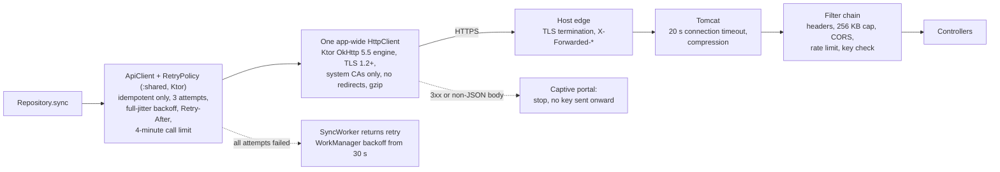
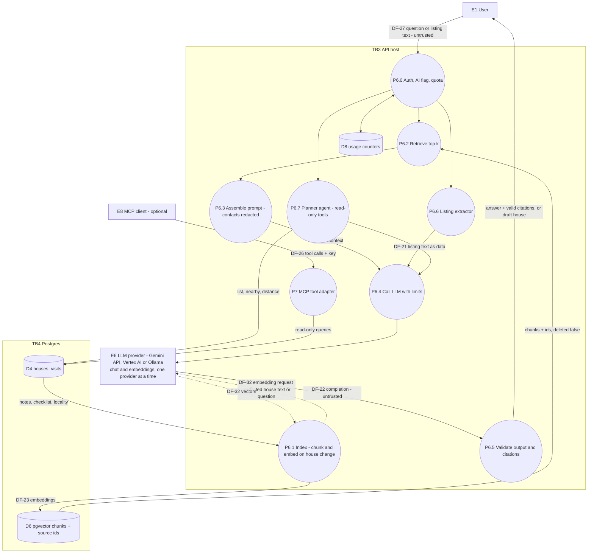
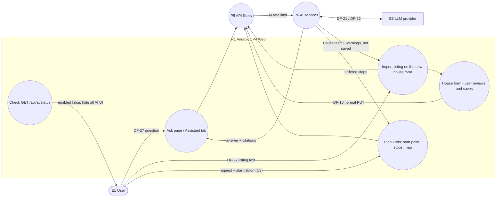
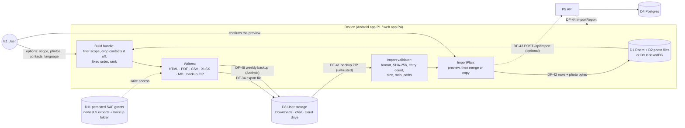
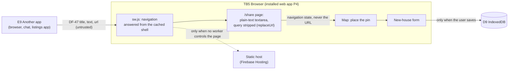

# 04: Data flow diagrams

| Field | Value |
|---|---|
| Document | Data flow diagrams (DFD) and data dictionary |
| Version | 0.17 |
| Date | 2026-09-24 |
| Author | Claude (Cowork) |
| Status | Draft |

## Change log

| Version | Date | Author | Change |
|---|---|---|---|
| 0.1 | 2026-09-22 | Claude (Cowork) | First version: DFD levels 0 and 1, level 2 for Hunt mode, Sync and AI/RAG. Data dictionary with sensitivity classes. |
| 0.2 | 2026-09-22 | Claude (Cowork) | Wave 2: sync DFD with the server filter chain, photo tombstone feed, network checks and Wi-Fi-only photos; new level-2 DFDs for the AI UI flows (section 6.1) and for the OSI transport path (section 5.1); data dictionary and stores updated (encrypted key, sessionStorage, export/erase, retention). |
| 0.3 | 2026-09-22 | Claude (Cowork) | Sprint 3 ([10](10-sprint-log.md)): the unnamed embedding request in the AI DFD (section 6) is now **DF-32** (P6 ↔ E6), with a data dictionary row: by default embeddings go to the native Gemini endpoint `models/{model}:batchEmbedContents` with the key in the `x-goog-api-key` header; Ollama uses the OpenAI-compatible `/embeddings`. Same external host as chat, no new trust boundary. DF-23 (P6 ↔ D6 vectors in pgvector) is unchanged. The contact name is part of the DF-32 embedding text and the DF-21 context and is not redacted ([02](02-threat-model.md) F-30): C2 handling rule, DF-21 and DF-32 rows and the level-0/AI diagram labels ("redacted" removed from DF-21 and P6.3) corrected. |
| 0.4 | 2026-09-22 | Claude (Cowork) | Sprint 3 lead decisions ([10](10-sprint-log.md)): contact redaction (C-13) is in code, so F-30 is Fixed ([02](02-threat-model.md) v0.6): C2 handling rule, DF-21 and DF-32 rows and the diagram labels (level-0 DF-21, AI P6.3 and DF-32) say the contact name and phone are redacted. |
| 0.5 | 2026-09-22 | Claude (Cowork), Docs team | Product rename to **Doorprints** ([03](03-design.md) ADR-13), names only: level-0 process P0 and DF-07 (lock screen shows "Doorprints alert"). The store names `househunt.db` (D1) and `house-hunt.api-config` (D5) are unchanged on purpose so existing data and settings keep working. No new flow, store or trust boundary. |
| 0.6 | 2026-09-22 | Claude (Cowork), Docs team | Vertex AI provider (AI team, same change set; [10](10-sprint-log.md) C-24 asked for this sync when the code landed). **E6** now has three forms chosen by `AI_PROVIDER`: Gemini API / AI Studio (`generativelanguage.googleapis.com`, `x-goog-api-key`), **Vertex AI** (`<location>-aiplatform.googleapis.com`, or `aiplatform.googleapis.com` for `global`, or `aiplatform.<loc>.rep.googleapis.com` for the multi-regions `us`/`eu` (added in review); OAuth bearer tokens from Application Default Credentials / Workload Identity Federation) and Ollama. New note in section 6 on E6. **DF-21** and **DF-32** give the endpoint, credential and the Vertex **location as a data-residency attribute** (default `asia-south1`, Mumbai; `global` gives no residency guarantee; embeddings may use a separate `AI_VERTEX_EMBEDDING_LOCATION`). DF-22 unchanged. |
| 0.7 | 2026-09-22 | Claude (Cowork), Docs team | Sprint 3.5 (KMP `:shared` module, commit `8f583af`, [03](03-design.md) ADR-14): section 5.1 transport path shows the shared Ktor `ApiClient` with `RetryPolicy` and the app-wide `HttpClient` on the OkHttp 5.5 engine instead of OkHttp's `RetryInterceptor`; same rules (idempotent only, 3 attempts, full jitter, `Retry-After`, no redirects, content-type check, 4-minute call limit). Vertex AI setup outcome (owner, 2026-09-22): the E6 Vertex row and **DF-32** record the configured locations (chat `asia-south1`; embeddings `global`, because `gemini-embedding-2` is not offered in `asia-south1`), so embedding text leaves India residency ([02](02-threat-model.md) T-I20). |
| 0.8 | 2026-09-22 | Claude (Cowork), Docs team | **Sprint 4a (S4-06): export and import flows.** New **section 6a** (level 2) showing that both apps build every copy from their own store with no server and no network, that the user's own choice is the trust boundary on the way out, and that everything on the way in is untrusted. New flows **DF-34** (device → user storage: the six formats, contacts included unless turned off — the file then leaves our control), **DF-41** (a picked backup ZIP → the validator, untrusted), **DF-42** (the rows an import writes), **DF-43**/**DF-44** (`POST /api/import` and its report), **DF-45** (the web app ↔ IndexedDB, new because the web app is now local-first) and **DF-46** (the service worker's app-shell-only cache, which deliberately holds no API data). New stores **D8** user storage (no encryption and no retention rules of ours), **D9** IndexedDB (not guaranteed — Safari eviction, RR-10) and **D10** Cache Storage. The new ids start at DF-41 because [11](11-feature-parity-and-export-spec.md) §12.2 has DF-35..DF-40 reserved for Sprint 4b/5 flows; DF-34 keeps the meaning 11 gave it. |
| 0.9 | 2026-09-22 | Claude (Cowork), Docs team | Review fix, section 8 store **D9**: the retention cell still said `navigator.storage.persist()` "is requested but Safari never grants it" and that Safari evicts "after about seven days without a visit" — both rejected in the same review round for [02](02-threat-model.md) RR-10 v0.16 and [03](03-design.md) section 16.4 v0.10. Reworded to the criterion [MDN, *Storage quotas and eviction criteria*](https://developer.mozilla.org/en-US/docs/Web/API/Storage_API/Storage_quotas_and_eviction_criteria) actually states: persistence is decided automatically from interaction history without a prompt (Safari commonly denies, Firefox asks), Safari deletes script-written storage for an origin with no user interaction in the last seven days of **browser use**, and a Home Screen / Dock web app gets the browser app's quota. Same MDN citation as 02 and 03; no flow, store or code change. Passed to the Web team: `web/src/app/data/storage.service.ts:14` carries the same stale comment. |
| 0.10 | 2026-09-22 | Claude (Cowork), Docs team | Review fix after the Web team's S4-05a and the owner switching GitHub Pages on: **DF-46** called Cache Storage "origin-isolated" and **D10** said only "replaced on each deploy". Browser storage is scoped to the *origin*, and on `https://sriram-codes-sw.github.io/doorprints/` that origin is shared with every other project site of the owner, so it is no boundary there. DF-46 and D10 now say so and describe what the app does about it: its cache is named `doorprints-shell-<build id><base path>` (S4-05a introduced the path suffix; the fixed `v1` has since become a per-build id), and `sw.js` `activate` and "Remove all Doorprints data from this browser" delete only this app's caches. The same fact, which the app cannot work around, is added to **DF-45** (IndexedDB) and **D5** (`localStorage`, which can hold the API key): another project site on the same github.io origin can read them ([02](02-threat-model.md) F-31). |
| 0.11 | 2026-09-22 | Claude (Cowork), Docs team | Review fix, **DF-46** and **D10**: both still said Cache Storage holds "the application shell only: `index.html` and hashed build assets". Since the Web team's per-build stamp (recorded in v0.10), `install` precaches **every file of this build** — entry and lazy chunks, the unhashed MapLibre worker under `maplibre/`, `manifest.webmanifest` and the icons — and `fetchAndKeep` also keeps any other successful same-origin, non-navigation GET under the base path. Navigations are not written back, and `/api/...` and cross-origin requests never reach the cache. The C0 classification and SEC-044 are unchanged. |
| 0.12 | 2026-09-22 | Claude (Cowork), Docs team | Fifth review round (docs versus the code as built). New **section 6b** and **DF-47**: the PWA **share target** as an inbound flow — another app (new external entity **E9**) opens `/share?title&text&url`; the text is untrusted and may carry an owner's phone number; `sw.js` answers the navigation from the cached shell, `share-page.ts` strips the query from the address bar and the tab's history entry and passes the text on only in navigation state *(overstated, corrected in 0.13: the text stays in `history.state`)*. New **DF-48**: Android's weekly backup into the granted folder (S4-07). New store **D11**: Android's **persisted Storage Access Framework grants** — the newest 5 "Save to…" export documents and the backup folder, released when pushed out, on failure, and when the weekly backup is turned off (the folder is then forgotten) or the folder changes ([02](02-threat-model.md) T-I25). Section 6a's diagram gains DF-48 and the grants. **D10**: "deletes every cache with the `doorprints-shell-` prefix and no other" also matches the **legacy unscoped `doorprints-shell-v1`** of builds before S4-05a — which carries no deployment path and so may have belonged to a Doorprints deployment at another path on the same origin — and `sw.js` `activate` deletes that name too; both now say so. |
| 0.13 | 2026-09-22 | Claude (Cowork), Docs team | Sixth review round. **DF-47** and section 6b overstated the share-target control: navigation state is stored by Angular in `history.state`, so the listing text (often with a phone number) stays in session history — in the `/` entry until the map's `forgetHandover()` strips it, and in an unsaved `/houses/new` entry until the tab closes — and survives a reload and possibly session restore. New bullet in 6b, DF-47 lists it as residual ([02](02-threat-model.md) T-I26 v0.21). The 0.12 row is annotated. |
| 0.14 | 2026-09-23 | Claude (Cowork), Docs team | **Owner decision (2026-09-23): the web app is hosted on Cloudflare Pages** ([03](03-design.md) ADR-21), at the root of its own origin `https://<project>.pages.dev`. **DF-45**, **DF-46**, **D5** and **D10** no longer say the origin is shared with the owner's other GitHub Pages sites: it is Doorprints' own, so IndexedDB, `localStorage` and Cache Storage are readable only by Doorprints (the path-scoped cache names and the prefix-only deletion stay, as a guard for any other deployment path). §6 share-target diagram: the static host is Cloudflare Pages, and a first-visit `/share` request is answered by its SPA fallback (`index.html`), not `404.html` ([02](02-threat-model.md) T-I26). |
| 0.15 | 2026-09-23 | Claude (Cowork), Docs team | **Owner decision of 2026-09-23: the web app is on Firebase Hosting at `https://doorprints.web.app`** ([03](03-design.md) ADR-21), replacing the Cloudflare Pages plan, which was never set up. **DF-45**, **DF-46**, **D5** and **D10** name that origin (Doorprints' own; the twin `doorprints.firebaseapp.com` is a different origin with its own, separate browser storage and is never shared); the §6b share-target diagram and its note name Firebase Hosting and its `**` rewrite. No flow changes. |
| 0.16 | 2026-09-24 | Claude (Code), engineer | Legacy House Hunt names renamed (owner request of 2026-09-24; [03](03-design.md) ADR-24). D1 is the Room file `doorprints.db` (renamed from `househunt.db` at start), D5 the key `doorprints.api-config` (moved from `house-hunt.api-config` at start); paths follow the moved packages. |
| 0.17 | 2026-09-24 | Claude (Code), engineer | CMP-4 P4b ([03](03-design.md) ADR-23 P4b): D3's code is in `:shared` commonMain; the store itself (file, entries, the sealed key) did not change. |

Related: [Threat model](02-threat-model.md) (uses these element IDs) · [Design](03-design.md) · [Requirements](01-requirements.md) · [AI docs](ai/)

---

## 1. Notation

| Symbol (Mermaid) | DFD element | ID prefix |
|---|---|---|
| Rectangle `["..."]` | External entity | E |
| Circle `(("..."))` | Process | P (level 1), P2.x (level 2) |
| Cylinder `[("...")]` | Data store | D |
| Arrow with label | Data flow | DF (see the data dictionary, section 7) |
| Dashed subgraph | Trust boundary | TB |

**Sensitivity classes** (used in section 7):

| Class | Name | Examples | Handling |
|---|---|---|---|
| C3 | Restricted | API key, location fixes, visits (time + place), house coordinates together with notes, backups | TLS in transit. Never logged. Encrypted backups. Minimal third-party exposure. |
| C2 | Confidential | Notes, ratings, prices, photos, contact name/phone (third-party PII), LLM prompts | TLS. Kept out of logs. Stored contact name and phone never sent to an LLM: `ContactRedactor` redacts them in embedding text, Ask context and tool results (AI-010, [02](02-threat-model.md) F-30 Fixed in Sprint 3). |
| C1 | Internal | Stats, street names alone, tile coordinates, build artifacts | TLS preferred |
| C0 | Public | Health status, static web assets, map styles | None |

## 2. Level 0: context diagram

## 3. Level 1: system decomposition

| Element | Description | Code |
|---|---|---|
| P1 | Compose UI: map, list, compare, edit, settings | `android/.../ui/*`, `MainActivity` |
| P2 | Hunt foreground service | `location/HuntService`, `StayDetector`, `ReverseGeocoder` |
| P3 | WorkManager sync | `data/SyncWorker`, `Repository.sync`, `ApiClient` |
| P4 | Angular SPA | `web/src/app/*` |
| P5 | Spring Boot API | `backend/src/main/java/app/doorprints/server/*` |
| P6, P7 | AI service, MCP server (planned) | [ai/](ai/) |
| D1 | `doorprints.db` (`househunt.db` until 2026-09-24, renamed at start): `houses`, `visits`, `photos` | `data/AppDatabase` |
| D2 | `filesDir/photos/*.jpg` (and `cache/camera/` for captures) | `Repository.addPhoto`, `res/xml/file_paths.xml` |
| D3 | DataStore `settings`: serverUrl, **apiKey** (Keystore-sealed, entry `apiKeyEnc`), radius, stay minutes, cursors, last sync | `data/Settings.kt` (`:shared` commonMain since CMP-4 P4b; the file is opened in `:app`) |
| D4 | Postgres `house`, `house_checklist`, `visit`, `photo`, `sync_seq` | `V1__init.sql` |
| D5 | `doorprints.api-config` = {baseUrl, **apiKey**} (`house-hunt.api-config` until 2026-09-24; moved to the new name at start, `core/storage-keys.ts`) | `core/config.service.ts` |
| D6 | Vector store (planned) | AI team |
| D7 | Nightly `pg_dump`, encrypted with age | 08 section 3 |

## 4. Level 2: Hunt mode (P2)

Privacy notes: raw fixes are **never stored** (only DF-05 stay points). T1 is in memory only and is cleared when the service stops. DF-03 goes to Google (PRV-007).

## 5. Level 2: Sync (P3 ↔ P5)

### 5.1 Transport path of one sync request (see [09](09-osi-layer-analysis.md))

## 6. Level 2: AI / RAG (P6, built; off by default)

The AI team owns the detailed design ([ai/](ai/)). This diagram fixes the trust boundaries the threat model assumes.

**E6, the LLM provider, has one of three forms**, chosen by `AI_PROVIDER` (`app.ai.provider`) and never mixed at run
time ([03](03-design.md) §13, [ai/ai-design.md](ai/ai-design.md) §2.1, §3.3):

| Form | Host | Credential on the wire | Where the data is processed |
|---|---|---|---|
| Gemini API / AI Studio (`aistudio`, default) | `generativelanguage.googleapis.com` (chat on the OpenAI-compatible path, embeddings on the native API) | API key: `Authorization: Bearer` for chat (OpenAI-compatible client), `x-goog-api-key` header for embeddings; never in the URL | Google chooses; the free tier may use prompts to improve Google products, so real data only with a paid-tier key (PRV-022, [02](02-threat-model.md) T-I20) |
| Vertex AI (`vertex`) | `<location>-aiplatform.googleapis.com` (for example `asia-south1-aiplatform.googleapis.com`), or `aiplatform.googleapis.com` for `global`; the multi-regions `us` and `eu` use `aiplatform.<loc>.rep.googleapis.com` (for example `aiplatform.eu.rep.googleapis.com`, `VertexEndpoints`); path `/v1beta1/projects/<project>/locations/<location>/publishers/google/models/<model>:generateContent`, `:embedContent` or `:predict` | Short-lived OAuth access token (`Authorization: Bearer`) from Application Default Credentials: Workload Identity Federation in CI, the attached service account on Cloud Run, `gcloud` locally, or a JSON key only on a non-Google host ([02](02-threat-model.md) T-I22); optional `x-goog-user-project`. No API key | The **location** is a data-residency attribute of the flow: `GCP_LOCATION` (default `asia-south1`, Mumbai) for chat and `AI_VERTEX_EMBEDDING_LOCATION` (default the same) for embeddings; `global` lets Google pick the region, with no residency guarantee. Model availability per location is checked in [ai/vertex-setup.md](ai/vertex-setup.md) step 8. **Configured (owner, 2026-09-22):** chat in `asia-south1`; embeddings on `global` (`gemini-embedding-2` is not offered in `asia-south1`), so DF-32 has no India residency guarantee ([02](02-threat-model.md) T-I20) |
| Ollama (`aistudio` with `AI_BASE_URL` and `AI_EMBEDDING_PROVIDER=openai`) | localhost or the owner's VM | Any non-empty value | On the owner's machine |

In every form chat and embeddings go to the same provider, so the TB3 ↔ TB6 boundary of [02](02-threat-model.md)
is the only one crossed; Vertex AI adds the token exchange with Google's identity services, which carries no house
data.

### 6.1 AI flows from the clients (wave 2 UI)

The start location for "Plan visits" (class C3) goes to the API and, as part of the planner's tool results, may reach the LLM provider. The UI discloses that questions and matching house notes are sent to the configured provider (AI-010).

## 6a. Level 2: Offline copy and import (Sprint 4a)

Both apps build every copy from their **own** store — Android from D1/D2, the web app from D9 — so this whole
picture works with the network off and with no server configured. The only server involvement is the optional
`POST /api/import` path on the right, which restores a backup onto D4.

Three things this diagram is meant to make obvious:

1. **The user's choice is the trust boundary on the way out.** DF-34 ends in D8, which Doorprints does not control
   and cannot clean up. That is the feature working as intended, and it is why the warning about contact numbers
   is shown *before* the file is built (PRV-012) rather than after.
2. **Everything on the way in is untrusted.** DF-41 comes from a file picker, so the validator sits between the
   file and any write, and the user sees a preview before a single row changes ([02](02-threat-model.md) T-T8).
3. **The server is optional on both paths.** No arrow from `bundle` or `writers` touches P5.

**State at the end of Sprint 4a:** DF-34 exists on Android and on the web; DF-41/DF-42 and DF-48 exist on Android;
DF-43/DF-44 exist on the server. The web app has no import yet, so it has no DF-41 ([10](10-sprint-log.md) §11).
On Android, writing into D8 after the user has left the screen needs a **persisted** grant (D11): every "Save to…"
export keeps one so Stop, a retry and the notification's Open/Share still work, bounded to the newest five, and the
weekly backup keeps one on its folder until the user turns the backup off or picks another folder
([02](02-threat-model.md) T-I25).

## 6b. Level 2: Share target (inbound, Sprint 4a)

The installed web app is registered as a GET share target (`manifest.webmanifest` `share_target`, FR-072), so
another app can hand it a listing. It is the only path by which another app on the device pushes data into P4.

- **Untrusted.** DF-47 is whatever the other app sends: it may be crafted, and a real listing usually carries the
  owner's or broker's phone number (third-party PII, C2). The page shows it as plain text in a `<textarea>`; nothing
  is parsed (the parser is Sprint 4b, S4-13) and nothing is stored until the user saves the house form.
- **Kept out of URLs.** `share-page.ts` replaces the entry the system opened with a query-less one
  (`replaceUrl`), and hands the text to the map and the form in navigation **state**. Whether the browser's global
  history keeps the original visit is browser-specific ([02](02-threat-model.md) T-I26).
- **But not out of session history.** Navigation state *is* session history: Angular stores it in `history.state`
  of the entry it writes. The text stays in the `/` entry until the map strips it (`forgetHandover()`: pin placed,
  coordinates typed, or add mode cancelled) and in the `/houses/new` entry until the house is saved (`replaceUrl`
  to `/houses/:id`); a form abandoned without saving keeps it there, across reloads, until the tab closes, and
  browser session restore may keep it after that. Residual, [02](02-threat-model.md) T-I26.
- **Not sent to the host while the worker is in control.** `sw.js` answers every app navigation from this build's
  cached `index.html` (`navigationPlan` → `shell`), so the query stays on the device; on a first visit, or before
  the worker controls the page, the request reaches the host (Firebase Hosting answers it with `index.html` through the `**` rewrite), whose logs
  may keep it.

## 7. Data dictionary

| DF | From → To | Data elements | Class | Protocol / protection | Notes |
|---|---|---|---|---|---|
| DF-01 | E1 → P1 | label, address, price, BHK, contact name/phone, listing URL, notes, rating, checklist, status, photos, settings | C2 (contact = third-party PII) | On device | FR-002..FR-007 |
| DF-02 | E4 → P2 | lat, lon, accuracy, time | **C3** | Play services IPC | Not persisted |
| DF-03 | P2 → E4 | lat, lon | **C3** | Google (TLS) | Throttled. Disclosed (PRV-007). |
| DF-04 | E4 → P2 | thoroughfare, locality, address line | C1 | TLS | |
| DF-05 | P2 → D1 | AUTO visit: id, houseId, lat, lon, street, arrivedAt, leftAt | **C3** | Room (app sandbox, FBE) | Stay points only |
| DF-06 | D1 → P2 | live houses | C2 | In process | |
| DF-07 | P2/P1 → E1 | Notification: house label, status, price, stars, distance, street counts | C2 | System UI | Private visibility; lock screen shows "Doorprints alert" only (F-14 fixed) |
| DF-08 | P1 ↔ D1 | house/visit rows | C2/C3 | Room | |
| DF-09 | P1 → D2 | JPEG (EXIF removed) | C2 | App files | PRV-008 |
| DF-10 | P3 → P5 | HouseDto / VisitDto JSON + `X-API-Key` | **C3** | HTTPS only (cleartext only to local dev hosts), gzip responses | F-02 fixed |
| DF-11 | P3 → P5 | multipart photo + id | C2 | HTTPS | at most 5 MB; metadata stripped again on the server; Wi-Fi only by default |
| DF-12 | P5 → P3 | change feeds incl. tombstones (houses, visits, photo metadata) | **C3** | HTTPS | Tombstones carry no content. Unbounded (F-19 limit is backlog). |
| DF-13 | P5 → P3 | photo bytes | C2 | HTTPS | private cache 30 d |
| DF-14 | D3 → P3 | server URL, **API key**, cursors | **C3** | DataStore; key AES-256-GCM with a Keystore key (F-03 fixed) | |
| DF-15 | E1 → P4 | API base URL, API key | **C3** | Typed by the user | |
| DF-16 | P4 ↔ D5 | {baseUrl, apiKey} | **C3** | sessionStorage by default; localStorage only with "remember" (F-04 fixed) | |
| DF-17 | P4 ↔ P5 | all API calls, photo blobs | **C3** | HTTPS + CORS | |
| DF-18 | P4 → E5 | lat, lon (+ IP, Referer, User-Agent) | C3 point / C1 result | HTTPS | Only on button press |
| DF-19 | P1/P4 → E3 | tile z/x/y, style (+ IP) | C1 | HTTPS | Shows the area viewed |
| DF-20 | P5 ↔ D4 | SQL rows, photo bytea | **C3** | JDBC, TLS required (SEC-019) | |
| DF-21 | P6 → E6 | system prompt, question, retrieved house text (contact name and phone redacted, F-30 Fixed) or listing text | C2 | HTTPS to the provider chosen by `AI_PROVIDER` (section 6, E6): AI Studio `generativelanguage.googleapis.com/v1beta/openai/` with the API key; Vertex AI `POST https://<location>-aiplatform.googleapis.com/v1beta1/projects/
/locations/<l>/publishers/google/models/<model>:generateContent` (host `aiplatform.googleapis.com` for `global`, `aiplatform.<loc>.rep.googleapis.com` for the multi-regions `us`/`eu`) with an OAuth bearer token from ADC (no API key); or localhost for Ollama. **Location (Vertex AI):** `GCP_LOCATION`, default `asia-south1` (processing in India); `global` has no residency guarantee | Opt-in (AI-001, AI-010). Real user data only to a paid tier or Vertex AI (PRV-022). Credential: [02](02-threat-model.md) T-I20, T-I22 |
| DF-22 | E6 → P6 | completion, structured JSON | C2, **untrusted** | HTTPS | Validated (AI-005) |
| DF-23 | P6 ↔ D6 | vectors + source IDs + chunk text | C2 | JDBC TLS | Deleted with the source (AI-011) |
| DF-24 | E7 → P5 | container image / deploy hook | C1 (integrity critical) | HTTPS, GitHub OIDC or secret | 07 |
| DF-25 | D4 → D7 | `pg_dump` custom format, age-encrypted | **C3** | TLS + encryption at rest | 08 |
| DF-26 | E8 ↔ P7 | MCP tool calls/results | **C3** | stdio/localhost or HTTPS + key | Read-only by default |
| DF-27 | E1 → P6 | question, listing text | C2, **untrusted** | HTTPS + key | Prompt injection source |
| DF-28 | P5 → monitor | `/actuator/health` status | C0 | HTTPS | Public |
| DF-29 | P5 → E1 (download) | `GET /api/export` JSON of all live data | **C3** | HTTPS + key | Attachment; handle as sensitive |
| DF-30 | E1 → P5 | `DELETE /api/data` + `X-Confirm-Delete` | – | HTTPS + key | Irreversible; logged at WARN |
| DF-31 | P1/P4 → P5 → P6 | plan-visits start lat/lon | **C3** | HTTPS + key | Only on user action |
| DF-32 | P6 ↔ E6 | Embedding request: house text built by `HouseDocuments` (label, address, street, locality, price, size, status, rating, checklist, visit summary, notes; no contact line, and the contact name and phone-like numbers in free text are replaced by `[contact]` / `[phone]`) on indexing, the question on Ask; response: 768-d vectors | C2 | `AI_PROVIDER=aistudio` (default) with `AI_EMBEDDING_PROVIDER=google-genai`: HTTPS to the native Gemini API `POST …/v1beta/models/{model}:batchEmbedContents` (up to 100 texts per call), key only in the `x-goog-api-key` header (never in the URL), no redirects followed. `openai` (Ollama): OpenAI-compatible `/embeddings` at `AI_BASE_URL`, localhost or HTTPS. `AI_PROVIDER=vertex`: HTTPS `POST https://<location>-aiplatform.googleapis.com/v1beta1/projects/
/locations/<l>/publishers/google/models/<model>:embedContent` (host as in DF-21, including `aiplatform.<loc>.rep.googleapis.com` for `us`/`eu`) (`gemini-embedding-2`) or `:predict` (`gemini-embedding-001`), **one text per call**, OAuth bearer token from ADC, no API key; **location** `AI_VERTEX_EMBEDDING_LOCATION` (default `GCP_LOCATION`, `asia-south1`) is the data-residency attribute and may differ from the chat location; **configured: `global`** (2026-09-22, [ai/vertex-setup.md](ai/vertex-setup.md) step 8), so the redacted house text and Ask questions are processed outside India residency | Opt-in (AI-001). Same provider and TB3 ↔ TB6 boundary as DF-21/DF-22 (02), so no new trust boundary. With `AI_INDEX_ON_CHANGE=false` the per-save embedding request is not sent; only the re-index sends house text. Contact redaction by `ContactRedactor` since Sprint 3 (F-30 Fixed, [02](02-threat-model.md)); reindex once after deploying. Named in v0.3 (the flow existed unnamed since v0.1). |
| DF-34 | P1/P4 → D8 (user storage) | An **offline copy**: HTML, PDF, CSV ZIP, XLSX, Markdown or the `doorprints-backup/1` ZIP. Contains everything the options selected — labels, addresses, prices, notes, checklists, visits, photo images, and **contact names and phone numbers unless the user turned them off** | **C3** (C2 when contacts are left out) | Android: Storage Access Framework (`content://` the user picked) or the share sheet via `FileProvider` from `cache/exports/`; web: a `blob:` download or Web Share. No network, no server, works in flight mode | The trust boundary is crossed **by the user's choice**: after this flow the file is an ordinary document in Downloads, a chat or a cloud drive, outside the app's reach (PRV-018, [02](02-threat-model.md) T-I13, RR-07). Nothing is written to app-private storage, so an uninstall does not take the copy with it. The `cache/exports/` staging copy used for sharing is deleted after 24 h |
| DF-41 | D8 (user storage) → P1 | A backup ZIP the user picked, **entirely untrusted**: entry names, sizes, hashes and rows all come from outside | C2/C3, **untrusted** | Read through SAF; validated before any write (SEC-041) | Zip slip, zip bomb, checksum and DTO checks run first ([02](02-threat-model.md) T-T8). Only `manifest.json`, `data.json` and `photos/<name>` are ever read; every other entry is still path-checked |
| DF-42 | P1 → D1/D2 (import) | Rows and photo bytes the import decided to write: new rows, or rows whose `updatedAt` is newer in the file, or (import as a copy) everything with fresh ids | C2/C3 | In process, one transaction per batch | The decision is `ImportPlan`, the same last-write-wins rule as sync; a preview is shown first and a confirmation is required whenever anything would be replaced (FR-047) |
| DF-43 | P3/P4 → P5 | `POST /api/import` with a backup's `data.json` (optionally `?dryRun=true`) | **C3** | HTTPS + `X-API-Key` | Same validation on the server; body and row caps return 413. `dryRun` writes nothing and returns the counts |
| DF-44 | P5 → P3/P4 | `ImportReport`: what was created, updated and skipped | C1 | HTTPS + key | Counts only, no row content |
| DF-45 | P4 ↔ D9 (IndexedDB) | The web app's own copy: houses, visits, photo **blobs**, settings, sync cursors | **C3** | IndexedDB in the browser profile, scoped to the origin, which on Firebase Hosting is Doorprints' own (`https://doorprints.web.app`; the twin `https://doorprints.firebaseapp.com` is a different origin with a separate store and is never shared, [12](12-brand-and-naming.md) N-02; the GitHub Pages origin `sriram-codes-sw.github.io`, shared with the owner's other Pages sites, was dropped before anything was deployed there, [02](02-threat-model.md) F-31); OS disk encryption where the user has it | New in Sprint 4a: the web app is local-first, so the browser now holds a full copy rather than a view of the server ([03](03-design.md) §16.4). Cleared by "Remove all Doorprints data from this browser" ([02](02-threat-model.md) T-I17) |
| DF-47 | E9 (another app) → P4 `/share` | Shared `title`, `text`, `url` of a listing, as a GET query | C2 (often an owner's or broker's phone number), **untrusted** | On the device (Android share sheet → browser); answered by `sw.js` from the cached shell, so it reaches the static host only when no worker controls the page | Section 6b. Shown as plain text; stripped from the address bar and from the URL of the tab's history entry at once; passed on only in navigation state, which is `history.state`: **residual**, the text stays in the `/` entry until the map strips it and in an unsaved `/houses/new` entry until the tab closes, survives a reload and may be kept by session restore; stored only if the user saves a house ([02](02-threat-model.md) T-I26) |
| DF-48 | P1 → D8 (backup folder, Android) | The weekly `doorprints-backup/1` ZIP (S4-07): built with the default export options plus all photos (`ExportBuilder.defaults(…).copy(photos = ALL)`), so contact names and phone numbers are included | **C3** | Storage Access Framework into the folder the user granted once (`OpenDocumentTree`), written under a `partial-` name and renamed when complete; no network of its own (a cloud-provider folder uploads it on whatever connection it has, [10](10-sprint-log.md) §11.3 item 8) | Retention keeps the newest *n* finished backups (default 4, 1–20) by modified time. Uses the persisted folder grant in D11 |
| DF-46 | P4 → D10 (Cache Storage) | Every file of this build, precached by `install` (`index.html`, entry and lazy chunks, the MapLibre worker under `maplibre/`, `manifest.webmanifest`, icons), plus other successful same-origin GETs under the base path kept by `fetchAndKeep` (never a navigation response); never `/api/...` or cross-origin | C0 | Cache Storage, scoped to the **origin**, not the app. On Firebase Hosting (`https://doorprints.web.app`) the origin is Doorprints' own; the app still names its cache `doorprints-shell-<build id><base path>` and deletes only its own caches (S4-05a, written for the shared GitHub Pages origin that was dropped on 2026-09-23), which costs nothing and keeps a second deployment path safe | **Deliberately excludes every `/api/...` response and every cross-origin request** (SEC-044), so no copy of the user's data exists outside D9. The fetch handler also ignores every request outside its own base path |

## 8. Data store inventory and retention

| Store | Content | Class | Encryption at rest | Retention (target) |
|---|---|---|---|---|
| D1 Room | houses, visits, photo index | C3 | Android FBE | Until the user deletes it / uninstalls |
| D2 Photo files | JPEGs | C2 | Android FBE | Same as D1 |
| D3 DataStore | URL, **API key** (encrypted), cursors, prefs | C3 | Key: AES-256-GCM, Android Keystore; excluded from backup and device transfer | Until reset |
| D4 Postgres | everything | C3 | Provider-managed disk encryption | Tombstones (no content) purged after 90 d (`DataService.purgeTombstones`). `DELETE /api/data` erases everything. |
| D5 sessionStorage / localStorage | URL, **API key** | C3 | None (scoped to the origin, which on Firebase Hosting is Doorprints' own, `https://doorprints.web.app`; strict CSP) | Tab lifetime by default; until "Disconnect" with "remember" |
| D6 pgvector | chunks, vectors | C2 | Provider | Deleted with the source |
| D7 Backups | pg_dump | C3 | age (X25519) | 30 days rolling |
| D8 User storage (new, 4a) | Exported copies: HTML, PDF, CSV ZIP, XLSX, Markdown, `doorprints-backup/1` ZIP with photo images | **C3** (C2 without contacts) | **None by Doorprints.** Whatever the user's chosen location gives: device encryption, a cloud provider's encryption, or nothing at all in a chat thread | **Outside our control and our retention rules** — there is no expiry and no remote wipe. The only Doorprints-managed part is the Android share staging folder `cache/exports/`, cleared after 24 h, and the optional weekly backup, which keeps the last four files in the folder the user granted |
| D9 IndexedDB (new, 4a) | The web app's houses, visits, photo blobs, settings, cursors | **C3** | Browser profile; OS disk encryption where enabled | Until the user clears it. **Not guaranteed**: a browser may evict it under storage pressure. `navigator.storage.persist()` is requested, but Safari and Chromium browsers decide it automatically from the user's interaction history **without prompting** (Safari commonly denies; Firefox asks), and Safari additionally deletes script-written storage for an origin with **no user interaction in the last seven days of browser use** (server-set cookies are exempt); a site saved to the Home Screen or the Dock gets the browser app's quota instead of the smaller in-app WebKit one (NFR-027, [02](02-threat-model.md) RR-10; [MDN, *Storage quotas and eviction criteria*](https://developer.mozilla.org/en-US/docs/Web/API/Storage_API/Storage_quotas_and_eviction_criteria)). When IndexedDB is blocked the app falls back to memory for the tab only, and says so |
| D10 Cache Storage (new, 4a) | The app's own static files: every file of this build, plus other same-origin GETs under the base path (DF-46); no API response, nothing cross-origin | C0 | Browser profile | One cache per build, named `doorprints-shell-<build id><base path>` so that two deployment paths on one origin could never collide (written for the shared GitHub Pages origin; on Firebase Hosting the site is at `/` of its own origin, `https://doorprints.web.app`). `sw.js` `activate` deletes this app's older caches for the same deployment path, plus the **legacy unscoped `doorprints-shell-v1`** of builds before S4-05a; "Remove all Doorprints data from this browser" deletes every cache with the `doorprints-shell-` prefix, whatever its path. Neither touches a cache without that prefix. The one overlap to know: the legacy name carries no deployment path, so on a shared origin it may have belonged to a Doorprints deployment at another path, and either action removes it (that deployment only loses an offline copy it no longer uses: no current worker reads that name). Holds nothing about the user |
| D11 Persisted document grants (Android, new, 4a) | URIs of the newest **5** "Save to…" export documents (`ExportGrants.KEPT`) and of the weekly backup folder, with the OS's persisted read+write (or write-only) permission on each | C1 (the URIs name the user's files and folders) | Android system permission store; the list of held export grants in D3 | Export grants: released when a newer one pushes them out, and when a run fails or is abandoned. Folder grant: released when the weekly backup is turned off (the stored folder and its last error are cleared, so turning it on again opens the picker) or another folder is chosen; a run already writing keeps it until it ends. All go with an uninstall |
