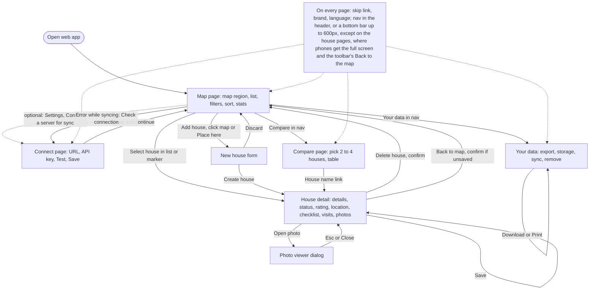
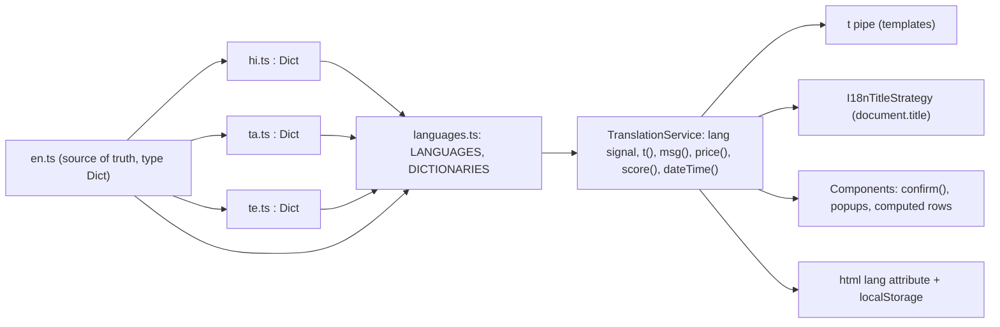

# Doorprints: UX, accessibility and internationalisation

| Field | Value |
|---|---|
| Document | 05 UX, accessibility and i18n |
| Version | 0.21 |
| Date | 2026-09-24 |
| Author | Claude (Cowork) – Design team |
| Status | Draft |
| Scope | Web app (`web/`) and Android app (`android/`), both implemented |

## Change log

| Version | Date | Author | Change |
|---|---|---|---|
| 0.1 | 2026-09-22 | Claude (Cowork) – Design team | First version. Design principles, tokens with contrast ratios, component inventory, screen flows, WCAG 2.2 AA checklist (web status, Android plan), i18n architecture for en/hi/ta/te, translation workflow, glossary, accessibility test plan. |
| 0.2 | 2026-09-22 | Claude (Cowork) – Design team | Wave 2: Android strings in 4 languages with an in-app language picker (LocaleManager on 13+, no AppCompat), TalkBack semantics, 48 dp targets, font-scaling layouts, web tokens and dark theme on Android (section 7.1, 8.2). Web: accessible confirm dialog replaces `confirm()` (A11Y-B05 closed), dismissible/hoverable map popup (A11Y-B01 closed), AI pages and import panel, "remember on this device". |
| 0.3 | 2026-09-22 | Claude (Cowork) – Docs team | Product rename to **Doorprints** ([03](03-design.md) ADR-13): title, page-title example ("Compare · Doorprints"), WCAG 3.1.2 brand note, translator rule (keep "Doorprints" unchanged) and two glossary rows: `app.name` (never translated) and `app.tagline` ("Remember every house you've seen.", web meta description and first-run house list / Settings *About* on Android). Section 8.1: the storage key `house-hunt.lang` is kept. Section 8.2: 197 strings per language; `app_name` is now in every language (was English only, `translatable="false"`). The Android launcher icon is now a door with footprints. The Hindi tagline is one value, "देखा हुआ हर मकान याद रखें।", now the same on Android and web. |
| 0.4 | 2026-09-22 | Claude (Cowork), Docs team | **Sprint 4a (S4-06).** New **section 14**: the export options screen (format → options → live count → one action, and why the PDF button says *Print* on the web), the contact warning with its four-language copy and the copy rules behind it, the import preview as the safety mechanism (equal-weight modes, zero lines hidden, a confirmation only when something would be replaced), install and update prompts that never appear on their own, and the storage warnings — three states, three sentences, plus the deliberate choice of visible degradation when IndexedDB is blocked. Glossary additions (*copy* vs *full backup*, *install*) and new gaps **UX-B07** (the web app exports but cannot import), **UX-B08** (the *selected houses* scope has no UI), **I18N-B06** (the ~90 new web keys and ~55 new Android strings are first drafts; the contact and storage warnings need native-speaker review first) and **A11Y-B07** (the new screens have not been run through axe or TalkBack). Section 6 flow updated: the web app opens on the map, the Connect page is optional, and *Your data* is a destination. |
| 0.5 | 2026-09-22 | Claude (Cowork), Docs team | Review fixes. §14.5: the iOS storage note said Safari can delete a site's data "after about a week without a visit"; reworded to MDN's actual criterion — no user interaction in the last seven days of **browser use**, with persistence decided automatically and commonly denied rather than prompted — so [01](01-requirements.md) NFR-027, [02](02-threat-model.md) RR-10 and this document now describe one reproducible rule. §14.7 **UX-B07**: "the pure `ImportPlan` port is the small part" read as if the port existed; there is no TypeScript import code in `web/src` at all, so the row now says what exists (Kotlin `ImportPlan` + test, the constants mirrored in `backup-export.ts`) and what does not. No copy, layout or i18n key changes. |
| 0.6 | 2026-09-22 | Claude (Cowork), Docs team | Fifth review round (docs versus the web code as built). **§14.4** said install is "a menu item, not a banner" and "dismissed for the session"; the web app has a permanent *Install the app* card on *Your data*, a **one-time banner** after the first saved house, a **30-day** "Not now", and at most one non-error banner at a time in the order migration > update > install > storage risk — rewritten, with the banner and card copy in four languages. **§14.1**: the busy label is *Preparing…* (was "Building…"), the PDF button says *Open print view* (was *Print*), *Photos* appears only for HTML, PDF and the full backup, a real `<progress>` bar with a visible label is announced at the start and at each quarter, and *Share* is outlined so the card has one filled primary action; the four-language copy of the new labels is added. **Phone navigation**: the component inventory, the AI entry points row, the flow diagram and WCAG 2.4.5, 2.4.11 and 3.2.3 described header navigation only; up to 600px the same `<nav>` is a Material 3 **bottom bar** (Connect moves into *Your data*), and 2.4.11 now records the measured `--nav-h` and the `scroll-padding` that keep a focused control clear of it. New **§14.8**: Android's weekly backup — turning it off forgets the folder, so turning it on again opens the picker. |
| 0.7 | 2026-09-22 | Claude (Cowork), Docs team | Android round of 2026-09-22 23:10–23:15 (`android/shared/README.md` 1.9, handover item 9). **§14.3** Preview: the new warning line "Houses whose checklist scores will be cleared, because the newer version in the file has none: *n*" with its four-language copy as it is in `values*/strings.xml` (`import_checklists_cleared`), merge mode only. **§14.1** Count: on Android a JSON backup of *All houses* also counts the visits that belong to no house yet; the web app does not carry them yet. |
| 0.8 | 2026-09-23 | Claude (Cowork), Docs team | Android rounds 8 and 9 (Design director and UX lead review, then the Android review; `android/shared/README.md` 1.10 and 1.11, handover items 10 and 12; `s4a-state/Android-review-8.json`). **§4**: the web's message tokens `--warn-*` and the `--error-border` / `--success-border` / `--surface-2` values are now in 4.1 and 4.2, and a new **§4.5** maps the tokens to the Android Compose theme (`surfaceVariant` = `--surface-2` #EEF2F0; `primaryContainer` = `--primary-soft` in both themes, dark #1D3B33; the `surfaceContainer*` ramp; progress tracks, sliders and tonal buttons on `primaryContainer`; `success*`, `errorBorder` and `warn*`). **§4.3**: an **Android row** — `IndicTypography` for hi/ta/te, M3's sizes with 1.6–1.7× line heights and no letter spacing, the counterpart of the web's `--leading: 1.7`. **§14.2**: the contact warning is a **calm amber note** on both platforms (web `.warn-box`, Android `WarnNote`), not grey help text and not a red alert; the copy rule is now "calm, not alarming" instead of "no scare styling". **§14.3** rewritten for what Android ships: the shipped mode labels (*Merge with what I have* / *Add everything as new copies*) and hints, the screen's states from empty to imported, the Replace dialog's **three** buttons (*Import as a copy instead* only switches the mode and writes nothing), the copy-mode duplicate warning (live houses only), the three "nothing would change" messages, all-or-nothing copy imports, four-language copy. **§14.1**: Android's count chips, the *Add a house on the map* empty-state action (the web still says *Map*: Web handover item 13), *Share this file*. **§14.8**: with the backup off, the folder and *Last backup* are hidden. **§14.7 I18N-B06**: the new Android strings added to the native-speaker list. New **§14.9**: the web app's refusal to start inside a frame (Web team, 2026-09-23, with the owner's move to Cloudflare Pages), its copy in four languages. |
| 0.9 | 2026-09-23 | Claude (Cowork), Docs team | **Android rounds 10–12** (`android/shared/README.md` 1.12–1.14; handover items 14 and 16, and item 16's qualification in 1.14), which 0.8 did not yet carry (coordinator finding of 2026-09-23). **§14.3** rewritten to what Android ships: the file header ("Backup made on …"), a status line per preview kind so each mode switch is announced, the opt-in undelete — switch "Also bring back *n* houses deleted on this phone", preview line "Deleted on this phone, brought back", the fourth "nothing would change" message with **Bring them back** as the primary and *Show as copies* as a text button, "Deleted on this phone; they stay deleted" — with the promise "with their visits and photos" **marked pending device check 10b**; the Replace dialog ("Replace *n* houses and *n* visits?", up to five names, *Keep mine, add only what's new* first); **Finish import** after a stopped merge; *Stop the other import*; the result sentence (non-zero parts only, lists of any length with `import_list_middle`) as the screen's heading and "Import finished." in the bar; results nobody was told about stay until seen; "Check that the phone has free space". **§14.1**: the bar is *Share* · **Save to…**, buttons stack at font scale 1.3; the amber partial-backup note with *Use everything* and "Saved a partial backup…"; the folder a file went to; the new intro; the shared progress phrasing "*done* of *total*"; the in-context notification ask. **§14.6**: "Full backup" only for a complete file, a narrowed one is a "partial backup"; the import / backup / copy vocabulary of [12](12-brand-and-naming.md) section G (*Import a backup*, *Readable copy*, *Add a shared listing*, *Fill in from listing text*). **§14.7**: I18N-B06 adds the round 10–12 strings, `import_list_middle` and the section G drafts; UX-B07 points to the approved import definition (FR-089..FR-097). New **§14.10** Android house list first run. §5 *AI entry points*: the AI helper is *Fill in from listing text*. **§14.9**: the live host is Firebase Hosting (`web/firebase.json`) at `https://doorprints.web.app`. |
| 0.10 | 2026-09-23 | Claude (Cowork), Docs team | **Whole-app UX audit and Android §9 handovers 20–34** (the go-ahead for the first deploy; `android/shared/README.md` 1.15–1.34, `web/README.md` audit rows and round 3; coordinator's final review of 2026-09-23, two majors and a minor). **§4.5**: `secondaryContainer` is `--primary-soft` (M3's selected state), no longer the amber star family; selection is never the fill alone (item 25 (a)). **§5**: the web header/bottom bar as of the UX lead's round 3 — under 600 px the house pages (`/houses/new`, `/houses/:id`) hide the bottom bar (`hidesBottomBar`) and get the full screen with the toolbar's Back, as Android shows its `NavigationBar` only on tab destinations; the 601–900 px header row; the add-house hint is a plain `<p>` referenced by *Cancel adding*'s `aria-describedby`, spoken once by the announcer, with the shorter `map.addHintShort` under 760 px; the web Save's `aria-busy` and, since the final round, its spoken "Saving…". New **§5.1** Android components: `DangerButton` confirmations, the segmented radio, `StateButton`, the amber note with its next step, the red result card and the card kept in place during a new run (`RefreshableResultCard`, "Updating…", item 34), Settings' withdrawn result, the legend, the house form's states, Compare's empty state; the keep-in-place retry rule now holds on the web too (final round). **§10**: a glossary row for the device-neutral *choose* (`map.addHintShort`, `plan.startHint`, `plan.startRequired` reworded in the final round). **§6** flow and **§7** WCAG: 1.4.1 Android column now "marker size, ring and opacity + legend" (item 31 (a)); 2.4.11 (`--nav-h` re-measures to 0 on the house pages, `.content` keeps `env(safe-area-inset-bottom)`; Android IME and measured overlays); 2.5.1 (north-up on both platforms; the web in the working tree since 2026-09-23, handover 33); 2.5.8 (legend and attribution, item 32 (b)); 3.2.3 (no bottom bar on the house pages); 4.1.3 (Android `houses_shown`, item 21 (b)). New **§7.2** the Map at large text and on a short map (items 28 (c), 29 (b), 30 (b)). **§14.1**: `common_add_on_map`; the web's `data.emptyAction` and partial-backup note are done (handovers 13, 17 (a)); new block *Location and notifications, asked in context* — nothing asked on arrival, the approximate / none notes per screen with their buttons, a refusal said once by the note, the reject haptic and one-sentence snackbar, the Assistant's rules (items 27 (c), 28–32). **§14.3**: the Replace dialog scrolls below 540 dp (was 480), *Replace* is the `DangerButton`, the copy preview's **Add *n* copies**, three undo state rows, and a new *Undoing a copy import* block (24 h, the list's result card and confirmation, focus, the "Just imported" input chip; items 23, 25, 26). **§14.6**: "Save a copy" replaces "Export a copy" (item 23 (c)); the web's Tamil *Full backup* is joined. **§14.7 I18N-B06**: `common_close`, `common_add_on_map`, `houses_restore` removed, and the strings of items 20–32, the 80 audit strings of 1.24, `settings_status_updating`, and the web's audit keys with `map.addHintShort`. **§14.10** rewritten: *Import a backup* under a filled *Add a house on the map*, the loading and no-match states, the pick-a-spot mode for Sprint 4b (items 20–22). **TC-A11Y-06** takes Android device check 19 (h). New **§15 Appendix: Design and UX self-check** (the design systems playbook of 2026-09-23; Definition of Ready verbatim, examples shortened). |
| 0.11 | 2026-09-23 | Claude (Cowork), Docs team | Docs pre-review buddy, one major and two minors. **Languages ship *under review*** (owner decision 2026-09-23 20:03 IST, the first release's Definition of Done, [10](10-sprint-log.md) §12.5 Decision 4): I18N-B03, I18N-B05 and I18N-B06 now say that Hindi, Tamil and Telugu are released as machine-drafted translations marked *under review*, with the native-speaker review still to come, instead of a review "before 1.0". **§14.1**: the web's `data.emptyAction` matches Android's `common_add_on_map` in hi and ta, but **not in te** (web ఇంటిని, Android ఇల్లు); the claim of v0.10 is corrected and the pair is added to I18N-B06 for the Telugu reviewer. **§5 House form Save (web)**: a save that fails cancels the pending "Saving…" (`Announcer.cancel()`), so the `role="alert"` error is the last thing heard (`announcer.service.spec.ts`, [06](06-test-plan.md) TC-U-53). **§15.5 rule 5**: checks moved into tooling go inside the existing workflows, with no new workflow and a flat CI runtime (owner decision 19:55 IST, [10](10-sprint-log.md) §12.5 Decision 3). |
| 0.12 | 2026-09-23 | Claude (Cowork), Docs team | Round 1 review of the Docs final Sprint 4a round (major, with [10](10-sprint-log.md) v0.26). **§15.5** opens with the owner-approved review rules, in use since the final Sprint 4a round (one complete pass in round 1; later rounds the delta plus its regressions only, no new finding on unchanged code unless a blocker; the blocker/major/minor rubric; out-of-scope findings as `BACKLOG:` minors that never block; `NEW RULE:` for a new class), pointing to [10](10-sprint-log.md) §12.5 S4b-EFF-4. **Rule 6**: the goal "double first-pass approvals within two sprints" is now the approved target, more than 70 % first-pass by the end of Sprint 4b. |
| 0.13 | 2026-09-23 | Claude (Cowork), Docs team | **Pre-deploy close-out** (Sprint 4a; coordinator's final review of 2026-09-23). **§15.3 R9, R16, R17** gain the `NEW RULE:` items of Sprint 4a. **R9** gets two rules from the web README's round 2 handover. First, an in-progress message is replaced or withdrawn on every way its task can end, and a shared announcer's cancel removes only its caller's message. Second, an alert or status that the same button can show twice with the same words is keyed on its run: a background re-read keeps its run, and a Retry the user asks for is a new run. **R17**: every busy indicator has its failure and cancel paths checked, and its destroy path where the page can be left. **R16**: markdown tables have a header and a delimiter row with matching column counts, code fences are balanced, and the header version equals the last change-log row. **§9.3** and **I18N-B03**: the owner confirmed that Hindi, Tamil and Telugu ship marked *under review* (machine-drafted, native-speaker review pending). The coordinator's other rule candidates are listed in [10](10-sprint-log.md) §12.7 and are not in the playbook yet. |
| 0.14 | 2026-09-23 | Claude (Cowork), Docs team | **Last Docs sync before the first deploy** (the delivery coordinator's final review of the pre-deploy close-out): the Web team's round 1, 2 and 3 review rows in `web/README.md`, which landed after v0.13; the last row applied is the round 3 row ([README](README.md) update rule 11). **§5** gains the row *Start point (web)* for Plan and the new-house start: the default view is never a start the user chose (`loadStartPoint` skips the untouched country view); every way of setting the start (map click, marker drag, typing both fields, editing one field over a set start, the newest house, *Use my location*) withdraws the message under the start fields; `start-msg` is in both fields' `aria-describedby` while it shows, and the field *Plan route* focuses is `aria-invalid` while *Choose a start point first* shows. **§15.3 R6** gains a NEW rule (pointer from R11): a value the app writes by itself, such as a default or a value saved by a first-layout event, is never read back as the user's choice. **R9** gains a NEW rule (pointer from R18): when a message is referenced from a field's `aria-describedby`, every path that resolves its cause withdraws it, not only the path that raised it ([10](10-sprint-log.md) §12.7 candidates (i) and (j)). |
| 0.15 | 2026-09-24 | Claude (Cowork), Docs team | **India's boundaries on the map** (owner issue P0 of 2026-09-24, [03](03-design.md) ADR-22; `android/shared/README.md` 1.36 §9 item 37 and the `web/README.md` row of 2026-09-24, the last rows applied from each). New **§7.3**: what users see on every map of both apps (one solid outline of India as the Government of India shows it, Jammu and Kashmir, Ladakh and Arunachal Pradesh inside India, no Line of Control or Line of Actual Control, no "Azad Kashmir" or "Gilgit-Baltistan" label), what does not change (no new string, control, colour or setting; en/hi/ta/te unchanged), the attribution difference between the apps, and the manual check. |
| 0.16 | 2026-09-24 | Claude (Cowork), Docs team | Round 1 review of the Docs change for India's boundaries (two majors, with [03](03-design.md) v0.17). **§7.3** re-synced with the code as of 2026-09-23 19:56 UTC (2026-09-24 01:26 IST; `android/shared/README.md` 1.37). *No other lines there* no longer says only India's outline is drawn in the four areas: from zoom 5 the tiles' non-disputed country lines along the same borders (Nepal, Bhutan, Myanmar, parts of the China border) draw beside it, so two close lines can show when zoomed in (known limit, [10](10-sprint-log.md) S4b-BL-11). *Country lines* says the tiles' lines are used everywhere from zoom 5, not only outside the four areas, and only those that carry a country code, so a zoom 0-4 tile shown while a closer tile loads, or offline, never draws its line (Android); *Offline and errors* records the web's open parity gap (no such guard yet; [11](11-feature-parity-and-export-spec.md) §10) and what shows offline at zoom 5+. The check names TC-M-25's new loading, offline and admin-line steps. **§15.3 R20** gains the `NEW RULE:` of this review: a parity claim is checked against both implementations' rules and the test files right before hand-in, every difference is recorded as deliberate or routed as an open gap, and the doc records the timestamp of the code it compared. |
| 0.17 | 2026-09-24 | Claude (Cowork), Docs team | **§7.3** re-synced with the code at HEAD `3ad2b58` (comment and docs round, no behaviour change): the web applies the same rules as Android ([03](03-design.md) ADR-22 rule 2, the adm0 clause and the tile-zoom guard), so the *Open parity gap (web)* in *Offline and errors* and the "(Android; …)" qualifier are removed. *Country lines*: the doubled stretches follow `android/shared/README.md` 1.38 item 38 (b) (Arunachal-Bhutan, Arunachal-Myanmar and Jammu-Sialkot have only India's outline; the Wakhan, Bhutan's south-east corner and Myanmar south of 26.65 N added) with the measured separation (median 1.5-2.8 km, at most 5.3 km) instead of "about a kilometre". New row *State lines* with the known limit: the Assam-Arunachal Pradesh state line is not drawn from zoom 5 (S4b-BL-15). *Known limits* give the measured outline offsets. |
| 0.18 | 2026-09-24 | Claude (Code), Docs team | **§7.3** re-synced with branch `fix/india-boundary-lines` (PR #16, HEAD `9e0036e`; [03](03-design.md) ADR-22 v0.20). *India's outline*: the whole India-China border is the outline's at every zoom; along the 7 shared stretches (with Nepal, Bhutan, Myanmar and, in the Wakhan, Afghanistan) it draws below zoom 5 only and the tiles' line takes over from zoom 5, with a connector of about 7 km at most at each hand-over. *Country lines*: never India's line with China from the tiles; one line everywhere, no more two close lines (S4b-BL-11, S4b-BL-16). *State lines*: the Assam-Arunachal Pradesh line is drawn from zoom 5 like the other state lines (S4b-BL-15). *Offline and errors* and the known limits: the shared stretches show no line at zoom 5+ until tiles are cached; the hand-over steps and the 3-5 km loops at Sikkim's two tri-junctions. |
| 0.19 | 2026-09-24 | Claude (Code), Docs team | **§7.3** known limits after the Singalila spur fix (round 2 reviews): the Sikkim tri-junction loops sized (about 13 x 3 km at Nepal-China-India, on glaciers, from about zoom 10; about 2 km at Doklam) and the tile line running on past the hand-over at Jomotsangkha (about 9 km) and Longwa (about 3 km) from about zoom 10 (a small hook at Jomotsangkha from zoom 9) ([10](10-sprint-log.md) S4b-BL-17). |
| 0.20 | 2026-09-24 | Claude (Code), engineer | Legacy House Hunt names renamed (owner request of 2026-09-24; [03](03-design.md) ADR-24). The language key is `doorprints.lang` (a choice saved as `house-hunt.lang` is moved at start); type names (`DoorprintsTheme`, `LocalDoorprintsColors`) and paths follow the code. No UI change. |
| 0.21 | 2026-09-24 | Claude (Code), Docs team | Reviews of PR #19 (CMP-2, [03](03-design.md) ADR-23). **§8.2**: the strings have two homes, the UI strings as Compose resources in `android/ui/src/commonMain/composeResources` (403 strings and 16 plurals per language) and the service strings as Android resources (83 strings and 4 plurals, plus `resolved_language`), 17 keys in both with the same text (was "197 strings each" in `res/values*`); placeholders positional only; the plurals that exist; *Per-app language* explains `AppLocale.applyDefault` on every API level and `localeFilters` ([Marathi, Hindi] resolves to Hindi); *Lint* names `StringParityTest`. **§9.1 step 5**: where a new Android string goes (UI: Compose resources with a plain `'`; service: `res/values*` with `\'`; both: both places). **§9.2 step 5**: a new language in both homes, `localeFilters` and `StringParityTest`. §14.3's intro, I18N-B06 and the §15 R2 grep include the Compose resources. |

---


## Contents

1. [Scope and targets](#1-scope-and-targets)
2. [Design principles](#2-design-principles)
3. [Personas and accessibility needs](#3-personas-and-accessibility-needs)
4. [Design tokens](#4-design-tokens)
5. [Component inventory](#5-component-inventory)
6. [Screen flows](#6-screen-flows)
7. [WCAG 2.2 AA checklist](#7-wcag-22-aa-checklist)
8. [Internationalisation architecture](#8-internationalisation-architecture)
9. [Translation workflow](#9-translation-workflow)
10. [Glossary](#10-glossary)
11. [Accessibility test plan](#11-accessibility-test-plan)
12. [Requirements (UX, A11Y, I18N)](#12-requirements-ux-a11y-i18n)
13. [Known gaps and backlog](#13-known-gaps-and-backlog)
14. [Sprint 4a: your data, install and storage](#14-sprint-4a-your-data-install-and-storage-ux-a11y-copy)
15. [Appendix: Design and UX self-check](#15-appendix-design-and-ux-self-check)

---

## 1. Scope and targets

| Target | Web | Android |
|---|---|---|
| Accessibility standard | WCAG 2.2 level AA | WCAG 2.2 AA as applied to mobile (W3C "WCAG2Mobile" guidance), Android accessibility guidelines |
| Screen readers | NVDA + Firefox/Chrome (Windows), VoiceOver + Safari (macOS/iOS), TalkBack + Chrome (Android) | TalkBack |
| Languages | English (`en`), Hindi (`hi`), Tamil (`ta`), Telugu (`te`) | Same four |
| Number, currency and date format | `en-IN`, `hi-IN`, `ta-IN`, `te-IN` via `Intl` (₹, lakh grouping: ₹12,50,000) | Same locales via `java.text.NumberFormat` / `DateTimeFormatter` |
| Themes | Light and dark (follows `prefers-color-scheme`) | Material 3 light/dark, dynamic colour off for status colours |
| Smallest supported viewport | 320 CSS px wide, 200 % zoom, 400 % zoom reflow | 320 dp wide, font scale 200 % |

## 2. Design principles

| ID | Principle | What it means in practice |
|---|---|---|
| UX-001 | **List first, map second** | Everything on the map is also in the house list. The list is the accessible, keyboard- and screen-reader-friendly view. The map is a visual aid. |
| UX-002 | **Never colour alone** | Status has a colour, an icon (● New, ★ Shortlisted, ✕ Rejected) and a text label. Map markers also differ in size. Best values in the comparison get a ✓ and "(best)" for screen readers. |
| UX-003 | **One build, any language** | Language switches instantly without reload. Nothing is baked into images. Layouts allow 40 % text growth (Tamil and Telugu labels are often longer than English). |
| UX-004 | **Native controls first** | Real `<button>`, `<a>`, `<input type="radio">`, `<select>`, `<dialog>`. ARIA only where HTML has no element (live regions, `aria-pressed` toggle chips, region labels). |
| UX-005 | **Forgiving** | Confirm before destructive actions, warn before leaving unsaved changes, every rating can be cleared, errors say what happened and what to do. |
| UX-006 | **Quiet feedback** | Saves, uploads and language changes are announced in a polite live region. Errors use `role="alert"`. Focus never jumps unexpectedly. |
| UX-007 | **Field-ready** | Large targets (44 px preferred), one-handed layout on phones, works with gloves, in sunlight (high contrast) and on slow networks (skeleton loading states). |
| UX-008 | **Tokens, not magic numbers** | All colours, spacing, radii and type sizes are CSS custom properties in `web/src/styles.css` (section 4). Android mirrors them in the Compose theme. |

## 3. Personas and accessibility needs

The product personas are defined in [01 Requirements](01-requirements.md). The design team adds these accessibility and language needs. Each maps to requirements in section 12.

| Persona | Context | Needs | Design response |
|---|---|---|---|
| **Priya**, 29, primary house hunter, Chennai | Uses the Android app on the street in bright sun, one hand on a scooter handle or an umbrella. Reads Tamil and English. | High contrast outdoors, big targets, quick status change, Tamil UI. | 44 px targets, ≥ 5:1 status colours, status radio group near top, `ta` UI. |
| **Ramesh**, 63, Priya's father, Hyderabad | Reviews the shortlist on a laptop at home. Mild low vision, uses 175–200 % browser zoom. Prefers Telugu. | Zoom without horizontal scroll, readable fonts, clear focus. | Reflow at 320 px, rem-based type, 3 px focus ring, `te` UI with Noto Sans Telugu fallback. |
| **Anjali**, 35, screen-reader user, Pune | Blind, uses NVDA on Windows and TalkBack on Android. Compares houses her partner visited. Hindi and English. | Everything reachable without the map, meaningful labels, table headers, announcements. | List equivalent of map, labelled landmarks, `<caption>`/`scope` on the comparison table, live region, translated `aria-label`s. |
| **Karthik**, 41, motor impairment (tremor), Bengaluru | Keyboard and switch access on desktop, voice control on phone. | No drag-only actions, no tiny targets, visible labels that match accessible names (for voice control). | "Place here" button and latitude/longitude fields instead of dragging, visible labels contained in accessible names (WCAG 2.5.3). |
| **Meena**, 52, vestibular disorder | Motion makes her dizzy. | No animated panning or shimmer. | `prefers-reduced-motion` stops skeleton animation and transitions. MapLibre skips camera animations. |

## 4. Design tokens

Source of truth: `web/src/styles.css` (`:root` and the `prefers-color-scheme: dark` block). Contrast ratios are WCAG 2.x relative-luminance ratios, computed from the hex values. Text needs 4.5:1 (3:1 for large text), non-text UI parts and graphical objects need 3:1.

### 4.1 Colour: light theme

| Token | Value | Used for | Pair | Ratio | Passes |
|---|---|---|---|---|---|
| `--text` | `#1C2421` | Body text | on `--surface` `#FFFFFF` / `--bg` `#F4F6F5` | 15.86 / 14.62 | AA, AAA |
| `--muted` | `#5F6B67` | Secondary text, hints | on `#FFFFFF` / `#F4F6F5` | 5.55 / 5.11 | AA |
| `--primary` | `#1F6F5C` | Links, primary buttons, header, focus ring | on `#FFFFFF` (and white on it) | 6.02 | AA |
| `--primary-dark` | `#17574A` | Primary hover | white on it | 8.40 | AA, AAA |
| `--primary-soft` | `#E3F0EC` | Stats, selected chip, table head | `--text` on it | 13.55 | AA, AAA |
| `--status-new` | `#3C5A99` | NEW pill and marker | white on it / it on white map | 6.74 | AA |
| `--status-shortlisted` | `#1A7A43` (**changed** from `#1F8A4C`) | SHORTLISTED pill and marker | white on it | 5.37 (was 4.38, failed) | AA |
| `--status-rejected` | `#B3261E` | REJECTED pill and marker, errors | white on it | 6.54 | AA |
| `--star` | `#A86A00` (**changed** from `#E8A317`) | Stars | on `#FFFFFF` | 4.44 (was 2.17, failed 3:1) | 3:1 graphic |
| `--border-strong` | `#7D8985` (**new**) | Input, button, chip borders | on `#FFFFFF` / `#F4F6F5` | 3.63 / 3.34 | 3:1 (1.4.11) |
| `--border` | `#D9E0DD` | Decorative card dividers only | – | 1.34 | Not relied on |
| `--error-text` on `--error-bg` | `#B3261E` on `#FBECEB` | Error messages | – | 5.70 | AA |
| `--success-text` on `--success-bg` | `#1A7A43` on `#E7F5ED` | Success messages | – | 4.78 | AA |
| `--warn-text` on `--warn-bg` | `#8A5A00` on `#FFF4E0` | Cautions that are not failures (`.warn-box`): the contact-details note (14.2), rows a sync left out | – | 5.44 (5.93 on white) | AA |
| `--error-border` / `--success-border` / `--warn-border` | `#E8B4B0` / `#B5DCC4` / `#F0C987` | 1 px edge of the three message boxes; the fills alone are within about 1.1:1 of white, so the edge is what shows the box | – | – | Decorative; the ⚠ / ✓ glyph and the text carry the meaning (1.4.1) |
| `--surface-2` | `#EEF2F0` | Count chips, secondary fills | `--muted` on it | 4.91 | AA |
| `--on-best` on `--best` | `#1A7A43` on `#DFF3E7` | Best cell in comparison | – | 4.63 | AA (was 3.77 with old green) |
| Header nav, current page | white on teal darkened 25 % | Current nav link (plus 3 px underline) | – | ≥ 6.0 | AA (was 4.1 with a lightened background) |

### 4.2 Colour: dark theme

| Token | Value | Pair | Ratio |
|---|---|---|---|
| `--bg` / `--surface` / `--surface-2` | `#101614` / `#19211F` / `#212B28` | – | – |
| `--text` | `#E4EBE8` | on `--surface` / `--bg` | 13.57 / 15.13 |
| `--muted` | `#A7B3AE` | on `--surface` | 7.59 |
| `--primary` | `#6FD1B3` | on `--surface`; `--on-primary` `#0B1F19` on it | 8.95; 9.35 |
| `--header-bg` | `#173F35` | white on it | 11.67 |
| `--status-new` / `-shortlisted` / `-rejected` | `#9DB4EA` / `#6FD69A` / `#FF8E86` | `--on-status` `#0E1412` on each | 9.00 / 10.43 / 8.40 |
| `--star` | `#F2B84B` | on `--surface` | 9.18 |
| `--border-strong` | `#7F8C87` | on `--surface` | 4.70 |
| `--error-text` on `--error-bg` | `#FF8E86` on `#3A1B19` | – | 7.01 |
| `--success-text` on `--success-bg` | `#6FD69A` on `#15301F` | – | 7.98 |
| `--warn-text` on `--warn-bg` | `#F2B84B` on `#33260F` | – | 8.23 (9.18 on `--surface`) |
| `--error-border` / `--success-border` / `--warn-border` | `#6E2C27` / `#2B5A3B` / `#6B4F1A` | – | Decorative edge |
| `--primary-soft` | `#1D3B33` | `--text` on it; `--primary` on it | 10.05; 6.63 |
| `--on-best` on `--best` | `#6FD69A` on `#173524` | – | 7.49 |

Map tiles (OpenFreeMap "liberty") stay light in both themes, so map markers and the legend dots always use the light-theme status colours.

### 4.3 Type scale

Base size is the browser default (16 px), so user font settings and zoom work. No `px` font sizes.

| Token | rem | px @ 100 % | Use |
|---|---|---|---|
| `--text-xs` | 0.75 | 12 | Pills, legend, stat labels |
| `--text-sm` | 0.875 | 14 | Hints, meta, table |
| `--text-md` | 1 | 16 | Body, inputs |
| `--text-lg` | 1.125 | 18 | h2, stat values |
| `--text-xl` | 1.375 | 22 | h1, score |
| `--text-2xl` | 1.75 | 28 | Reserved (stars) |
| `--leading` | 1.5 (1.7 for `hi`, `ta`, `te`) | – | Indic scripts need room for matras and vowel signs |

**Android** has no CSS, and Material 3's type scale sets a fixed line height (bodySmall 12/16 sp, bodyMedium 14/20) that overrides the taller spacing of the Indic fallback fonts, so the subscript conjuncts of one Tamil or Telugu line meet the vowel signs of the next. `DoorprintsTheme` (`ui/Theme.kt`) therefore switches to **`IndicTypography`** when the configuration's locale is `hi`, `ta` or `te` (the per-app language on every supported API level). It keeps M3's sizes and weights, sets **letter spacing 0** (Latin tracking pulls conjuncts apart) and these line heights, about 1.6–1.7× — the Android counterpart of `--leading: 1.7`:

| M3 style | Size (sp) | Line height, default → hi/ta/te (sp) |
|---|---|---|
| headlineSmall | 24 | 32 → **36** |
| titleLarge | 22 | 28 → **32** |
| titleMedium | 16 | 24 → **28** |
| titleSmall | 14 | 20 → **24** |
| bodyLarge | 16 | 24 → **28** |
| bodyMedium | 14 | 20 → **24** |
| bodySmall | 12 | 16 → **20** |
| labelLarge | 14 | 20 → **22** |
| labelMedium | 12 | 16 → **20** |
| labelSmall | 11 | 16 → **18** |

Checked on a device: not yet (Tamil at 200 % font in landscape and Telugu `bodySmall` wrapping are open device checks, A11Y-B07).

Font stack: `system-ui, -apple-system, 'Segoe UI', Roboto, 'Helvetica Neue', Arial, 'Noto Sans', 'Noto Sans Devanagari', 'Noto Sans Tamil', 'Noto Sans Telugu', sans-serif`. The three Noto families load from Google Fonts in `index.html` with `display=swap`. Google Fonts splits them by `unicode-range`, so a browser downloads a script's font only if that script appears and the device lacks a local font. Letter-spacing and `text-transform: uppercase` are not used: both break Indic conjuncts or have no meaning in those scripts.

### 4.4 Spacing, shape, size, motion

| Token | Value | Token | Value |
|---|---|---|---|
| `--space-1` | 4 px | `--radius-sm` | 6 px |
| `--space-2` | 8 px | `--radius` | 10 px |
| `--space-3` | 12 px | `--radius-pill` | 999 px |
| `--space-4` | 16 px | `--target` | 44 px (preferred target) |
| `--space-5` | 24 px | `--target-min` | 32 px (dense controls, still > 24 px WCAG 2.5.8 minimum) |
| `--space-6` | 32 px | `--header-h` | 56 px minimum, grows when it wraps |
| `--space-7` | 48 px | `--duration` | 150 ms (0.01 ms with reduced motion) |

Focus ring: `outline: 3px solid var(--focus)` with 2 px offset. In the teal header `--focus` switches to white.

### 4.5 Android: the same tokens in the Compose theme

Android uses these tokens, not Material dynamic colour, so the ratios above hold on both platforms (A11Y-A07).
`ui/Theme.kt` sets **every** colour role a component reads: a role left unset falls back to Material 3's baseline
lavender or pink, and components read more roles than the screens name (the Switch's unchecked track is
`surfaceContainerHighest`, the NavigationBar `surfaceContainer`). Since the Design review of 2026-09-22
(`android/shared/README.md` 1.11):

| Compose role or Doorprints colour | Web token | Light | Dark | Note |
|---|---|---|---|---|
| `background` / `surface` | `--bg` / `--surface` | `#F4F6F5` / `#FFFFFF` | `#101614` / `#19211F` | |
| `surfaceVariant` | `--surface-2` | `#EEF2F0` (was `#F4F6F5`) | `#212B28` | Count chips; `onSurfaceVariant` (`--muted`) on it 4.91:1 |
| `primaryContainer` | `--primary-soft` | `#E3F0EC` | `#1D3B33` (was `--header-bg` `#173F35`) | The chosen format card; dark `onPrimaryContainer` 10.05:1, `primary` 6.63:1 |
| `surfaceContainerLowest` … `Highest`, `surfaceDim`, `surfaceBright` | – (between `--bg` and `--surface`) | `#FFFFFF`, `#F7F9F8`, `#F1F4F3`, `#EBEFED`, `#E3E8E6`; `#DCE2DF`, `#FFFFFF` | `#0B100F`, `#151C1A`, `#1B2422`, `#212B28`, `#2A3531`; `#101614`, `#343F3B` | A neutral green-grey ramp instead of M3's lavender (navigation bar, switch track, dialogs on `surfaceContainerHigh`) |
| `secondary` | `--star` | `#A86A00` | `#F2B84B` | Star colour only (the stars themselves use `LocalDoorprintsColors.star`) |
| `secondaryContainer` / `onSecondaryContainer` | `--primary-soft` | `#E3F0EC` / `#0B3B30` (10.66:1) | `#1D3B33` / `#E4EBE8` (10.05:1) | M3's **selected state**: the selected FilterChip and InputChip, the NavigationBar's active pill, the SegmentedButton, progress tracks, the Slider's inactive track and tonal buttons. It was the amber star family (`#FBE7C2` / `#3A2C10`) until Android 1.21, which painted selected chips and the active tab amber. `WorkProgress`, `brandSliderColors()` and `tonalPrimaryColors()` still name `primaryContainer`, now only as a safety net (`android/shared/README.md` §9 item 25 (a)) |
| `errorContainer` / `onErrorContainer` / `errorBorder` | `--error-bg` / `--error-text` / `--error-border` | `#FBECEB` / `#B3261E` / `#E8B4B0` | `#3A1B19` / `#FF8E86` / `#6E2C27` | Error result card, 1 dp border |
| `success` / `onSuccess` / `successBorder` | `--success-bg` / `--success-text` / `--success-border` | `#E7F5ED` / `#1A7A43` / `#B5DCC4` | `#15301F` / `#6FD69A` / `#2B5A3B` | "Done" result card, 1 dp border |
| `warn` / `onWarn` / `warnBorder` | `--warn-bg` / `--warn-text` / `--warn-border` | `#FFF4E0` / `#8A5A00` / `#F0C987` | `#33260F` / `#F2B84B` / `#6B4F1A` | The calm amber note (`WarnNote`, 14.2) |
| `outline` / `outlineVariant` | `--border-strong` / `--border` | `#7D8985` / `#D9E0DD` | `#7F8C87` / `#2E3A36` | Dark `outlineVariant` differs from the web's dark `--border` `#2E3935` by one step in two channels; decorative only |

The sticky action bar on the Export and Import screens is a **flat** `surface` with a top `outlineVariant` divider
and no tonal elevation: M3's tonal tint at 3 dp turned the bar the same colour as the result cards and chips drawn on
it (1.00–1.04:1). Result cards and count chips carry a 1 dp border for the same reason as on the web.

**Selection is never the fill alone** (since Android 1.21, item 25 (a)): `--primary-soft` against the background is
only about 1.1–1.2:1 (WCAG 1.4.1, 1.4.11). A selected toggle chip therefore has a ✓ and a 2 dp `primary` border, an
unselected one a 1 dp `outline` (`--border-strong`) edge, as the web's `.chip[aria-pressed='true']`; the
NavigationBar's active label is `primary` (M3's default is `secondary`, which is the star colour here). The ✓ is for
toggle chips only: exclusive choices use the segmented radio of §5.1, which has no ✓.

## 5. Component inventory

| Component | Where | Semantics and behaviour | Notes |
|---|---|---|---|
| Skip link | App shell | First focusable element, visible on focus, moves focus to `<main id="main" tabindex="-1">` | Implemented with a click handler because `<base href>` would turn `#main` into a navigation. |
| Header / nav | App shell | `<header>`, `<nav aria-label="Main">`, `aria-current="page"` via `ariaCurrentWhenActive`. Above 600 px the nav sits in the header. **Up to 600 px the same `<nav>` becomes a fixed Material 3 bottom bar** (icon + one-word label per item, like Android's `NavigationBar`), the header shrinks to one row (brand and language), and *Connect* moves into *Your data* so the bar keeps at most five items. The bar's height is measured (`--nav-h`, ResizeObserver) and reserved below the content; safe-area insets are padded for the installed iPhone app (`viewport-fit=cover`). **On the house pages (`/houses/new`, `/houses/:id`) the bottom bar is hidden under 600 px** (`hidesBottomBar` in `web/src/app/nav-section.ts`, `.nav.bar-hidden`; since the UX lead's audit round 3): the form gets the full screen, and the house toolbar's Back returns to the map, as Android shows its `NavigationBar` only on tab destinations (`Root.kt`). *Map* stays the current item there (`aria-current="true"`; `"page"` on the map itself). From 601 to 900 px the header keeps one scrolling row with the brand as its icon; a fade at the edge shows that more items follow, the current item is scrolled into view, and the focus ring is inset so it is not clipped | Brand link has an accessible name even when its text is hidden. The nav stays inside `<header>` in the DOM, so keyboard and screen-reader order is the same on phones even though the bar is drawn at the bottom. |
| Language switcher | App shell, every page | Native `<select>` labelled "Language" (visually hidden label, 🌐 icon), options in native script with `lang` attributes | Announces "Language changed to …" in the new language. |
| Live region | App shell | One `role="status" aria-live="polite" aria-atomic="true"` fed by `Announcer` | Used for saved, visit recorded, photo uploaded/deleted, address filled, disconnected. |
| Page title | Router | `I18nTitleStrategy` translates route `title` keys and re-translates on language change | – |
| Focus on navigation | App shell | After a route change, focus moves to the page `<h1>` | First page load keeps browser default. |
| Button (`.btn`, `-primary`, `-danger`, `-sm`) | All | Native `<button>`, min 44 px (36 px for `-sm`), 3:1 border | Disabled buttons keep text contrast via 0.6 opacity on high-contrast colours. |
| Toggle chip (`.chip[aria-pressed]`) | Map filters, compare picker | `<button aria-pressed>` inside `role="group"` with a label, ✓ and thicker border when pressed | Not colour alone. |
| Status pill (`.pill-*`) | List, compare | Icon + text, ≥ 5:1 | – |
| Segmented radio (`.options .option`) | Status, checklist | Real `<input type="radio">` inside `<fieldset>`/`<legend>`, visually styled `<span>`, arrow keys work natively | Checklist has a "–" option ("Not scored") so a score can be cleared without "click again to clear". |
| Star rating | House detail | Radio group 1–5 in a `<fieldset>`, ★ filled / ☆ outlined (shape, not only colour), "Clear rating" button | Screen-reader text "3 out of 5 stars". |
| Text field | Forms | `<label for>` + `id`, required marked with * and a legend line, `aria-invalid` + `aria-describedby` on error | Placeholders are examples only, never the label. |
| Map region | Map page, house detail | `role="region"` + `aria-label` + `aria-describedby` hint pointing to the list or to the coordinate fields | MapLibre control labels translated through its `locale` option. |
| Add-house mode | Map page | One button whose label says the state (*Add house* / *Cancel adding*; no `aria-pressed` on top of it), a centre crosshair and a "Place here" button. The hint is a plain `<p id="add-hint">`, **not** a live region: *Cancel adding* points to it with `aria-describedby` while add mode is on, and turning add mode on speaks the full sentence once through the app's announcer (`map.addHint`, or `map.pickShared` for a shared listing). **Under 760 px** the hint sits at the top of the map, clear of the crosshair, the bottom row and MapLibre's control column, and shows the shorter `map.addHintShort` ("Move the map so the cross is on the house, then choose “Place here”."), so a Tamil or Telugu hint does not grow down onto the crosshair; the version not shown is `display: none`, so it is not part of the description either. Without WebGL 2 the page offers *Add at my location* and *Type latitude and longitude* instead of a dead *Place here* | Keyboard alternative to clicking the map. Android's counterpart is planned as an accessible pick-a-spot mode (Sprint 4b, [11](11-feature-parity-and-export-spec.md) §10). |
| Coordinates fields | House detail | Latitude/longitude number inputs, validated, update the pin | Alternative to dragging (WCAG 2.5.7). |
| House list | Map page | `<ul>` of links, results count in `role="status"`, focus or hover shows the map popup | Equivalent of the map (UX-001). |
| Stats | Map page | `<dl>` with `<dt>`/`<dd>` | Numbers use locale grouping. |
| Comparison table | Compare | `<caption>`, `<th scope="col">`, `<th scope="row">`, sticky row headers, scroll container is a focusable labelled region | Symbolic cells (★★★☆☆, –, …) have screen-reader text. |
| Photo tile | House detail | Image inside a `<button>` ("Photo 2 of Green Villa, open larger view"), delete button labelled "Delete photo 2" | Alt text is generated from the house name and position. |
| Photo viewer | House detail | Native `<dialog>` with `showModal()`: focus trap, Esc closes, focus returns; labelled "Photo viewer"; visible Close button; backdrop click closes | – |
| Empty state | List, compare, not found | Icon (decorative), message, primary action | – |
| Loading state | List, detail, compare | Skeleton bars (`aria-hidden`) + visually hidden "Loading…" in `role="status"`; shimmer stops with reduced motion | – |
| Error message | All | `role="alert"`, ⚠ icon, message + action (Try again / Check connection) | Server `detail` text is shown as is (API is English). |
| Unsaved-changes guard | House detail | `canDeactivate` asks (in-app dialog) before leaving with unsaved edits | – |
| Confirm dialog | App shell (`shared/confirm-dialog.ts`, `ConfirmService`) | Native modal `<dialog>` labelled by its message; buttons in the app language; destructive actions style the confirm button red and focus Cancel first; Esc = Cancel; focus returns to the opener | Replaces `window.confirm()` (A11Y-B05). |
| Map popup | Map page | Shown on list hover/focus and marker hover; stays while the pointer moves onto it; closes with Esc (anywhere), its close button, a map click or another hover | WCAG 1.4.13 (A11Y-B01). |
| AI entry points | Main navigation — header, or the bottom bar on phones — (Ask, Plan visits), new-house form (*Fill in from listing text*; "Import from listing text" until 2026-09-23) | Rendered only when `GET /api/ai/status` returns `enabled: true`. Answer text is plain text; `[house:id]` markers become numbered links with an accessible name ("Source 1: Blue gate house"); results in a polite live region; errors in `role="alert"` | Plan page: ordered list of stops is the accessible equivalent of the route map. |
| Remember-me | Connect page | Checkbox "Remember on this device" with a hint; off = sessionStorage | SEC-010. |
| House form Save (web) | House page toolbar | While saving: `aria-disabled` (not `disabled`, so focus stays and a second press is ignored) and `aria-busy="true"`; the label stays as it is, so the button keeps its width, and the state slot beside it shows a small spinner with the words "Saving…" (visible on wider screens, readable by a screen reader that reaches the slot, but not a live region). Since the final Sprint 4a round the announcer says "Saving…" (`house.saving`) when the save starts, as Android's Save button does, and "Saved" when it ends (a save that ends within the announcer's 100 ms is heard only as "Saved"). A save that **fails** cancels the pending "Saving…" (`Announcer.cancel()`, which also empties the region if it was already spoken), so a failure inside the 100 ms is not followed by a late "Saving…" and the `role="alert"` error is the last thing heard (`core/announcer.service.spec.ts`, [06](06-test-plan.md) TC-U-53) | The Web gate round 4 minor (no spoken "Saving") is closed in the working tree, [10](10-sprint-log.md) §11.7. |
| Start point (web) | Plan (the two start fields and the map), the new-house form opened with no position | **The default view is never a start the user chose.** The map page saves its view (`doorprints.mapView`) on its first layout, while it still shows the untouched country view (`COUNTRY_VIEW`, all of India). Plan's first start and a new house with no position take the last map view only through `loadStartPoint`, which skips the country centre at any zoom; next comes the newest house. Without either, Plan leaves the start unset and the new-house form opens on the country view at country zoom, so neither starts at a spot in central India that nobody picked. The newest house, read after the page opens, never overwrites fields the user has typed in. **Typing the start:** with no start set, both fields are needed; a coordinate typed in one field is kept only while that field is valid, and is dropped when the field turns invalid or is cleared (`nextTypedStart`). **The message under the start fields** (`<p id="start-msg">`: *Choose a start point first*, location blocked, location unavailable) is withdrawn by **every** way of setting the start: a map click, a marker drag, typing both fields, editing one field over a set start, the newest house, and *Use my location*, not only by the path that raised it. While it shows, `start-msg` is in **both** fields' `aria-describedby`, so it is read with whichever field gets focus. *Plan route* with an unusable start focuses the first field still to fix (`startFieldToFix`), and that field is `aria-invalid` while *Choose a start point first* shows | `pages/plan/start-field.ts`, `shared/map-center.ts` ([06](06-test-plan.md) TC-U-53, TC-S-19; `web/README.md`, close-out round 1 and 2 rows). Known open: invalid fields have no visible style yet ([10](10-sprint-log.md) §12.7 S4b-BL-6), and the page wiring has no TestBed spec (S4b-BL-7). |

### 5.1 Android components and states added by the whole-app UX audit

The Android column of section 7 and the table above name web components. These are the Android ones the whole-app
UX audit (the go-ahead for the first deploy, 2026-09-22/23; `android/shared/README.md` 1.21–1.34, §9 items 25–34)
added or changed. Files are under `android/app/src/main/java/app/doorprints/ui/`.

| Component | Where | Behaviour | Source |
|---|---|---|---|
| Confirmation with a danger choice | *Replace* (import), *Remove copies* (list undo), *Delete house*, *Discard* (house form) | An irreversible choice is an error-outlined `DangerButton` (`error` label, 1 dp `error` edge, 48 dp); the safe choice is a text button. This replaces "*Remove copies* is a text button in the error colour" | `ActionBar.kt`; item 26 (a) |
| Segmented radio | House form: checklist rows, Rent/Buy | Exclusive choices are radios, never FilterChips: each checklist row is 0–5 and then "–" (not scored; last since 1.24) as fixed 48 dp squares, the chosen one `primary` with an `onPrimary` label and no ✓, the others with a 1 dp `outline` edge, wrapping when the row does not fit; Rent/Buy is a two-segment `SingleChoiceSegmentedButtonRow`; Status is three radio rows with the ● ★ ✕ glyph (TalkBack reads only the status). The ✓ is for toggle chips only (§4.5) | `HouseEditScreen.kt`; items 26 (b), 27 (d) |
| State button | Export and Import bars, Assistant *Ask* / *Plan visits* | A button that changes with a running task keeps its node and its place (Save/Share → Stop → Save/Share; Import → Stop → Finish import / See your houses; Ask → Cancel), so TalkBack focus stays on it | `StateButton` in `ActionBar.kt`; item 23 (b) |
| Amber note with a next step | Map's Hunt card (location, notifications), house form, Assistant, Export (contacts, partial backup) | `WarnNote`: `onWarn` text on `warn` with a 1 dp `warnBorder`; the warning sign is 16 sp, centred on the first line in every script; a note's next step is a 48 dp text button **inside the note, under its text**. A refusal is the user's choice, so it is never error red; a real failure (no fix with precise location allowed) is the red result card | `Rows.kt`; items 28 (b), 30 (a) |
| Result card | Settings (the automatic backup's failure), and the two rows below | `ResultCard` in the outcome's tone (success, neutral, error) with a 1 dp border and the warning sign for an error, inside a `LiveMessage` (assertive when it failed). The automatic backup's failure is a plain red card: it has no run to be kept through | `ResultCard.kt`; README 1.31–1.32 |
| Result card, kept during a new run | Settings (*Save and test*, *Sync now*), Assistant (the Ask error, the *Plan visits* request errors and the no-fix failure) | While a new run is busy the earlier card **keeps its slot**, so nothing below it moves: only its icon and 1 dp border are dimmed to 50 % (`STALE_RESULT_ALPHA`; 1.32 dimmed the whole card to 38 %, about 2:1 for error text, superseded), the text keeps full contrast, the indeterminate bar runs along its foot, and the card, its text and the bar are one TalkBack item whose state is "Updating…" (`settings_status_updating`) or "Thinking…" / "Planning…". The node is keyed on the run (Settings) or the failure (Assistant), so a new result, even with the same words, is announced; assertive only for an error once the run has ended. With no earlier result there is the bar alone (Settings) or the bar and "Thinking…" / "Planning…" (Assistant); the Assistant's error is cleared on success or cancel and replaced when the new request fails. "Answer ready" / "Plan ready" stay the muted caption, and a refused location the amber note (not kept or dimmed). **Settings: a rejected address withdraws the result until the next run ends** (`withdrawnRun`, `serverResultWithdrawn`): when *Save and test* rejects the address (not https, malformed, empty) the last card goes; typing starts no run, so no older result comes back; *Sync now* (it syncs the saved server) or *Save and test* with a valid address ends with its own card. This supersedes 1.32's "no card while the field shows its error" | `RefreshableResultCard` in `ResultCard.kt`, `ServerStatus.kt`; README 1.32–1.33, §9 item 34 |
| Map legend | Map | `MapLegend`: ● New / ★ Shortlisted / ✕ Rejected, dots sized and ringed like the markers (the web's `.dot`); TalkBack hears "Legend" (`map_legend`) and each name. Its place follows its **measured** width: beside or above *Save house here*, at the start of the landscape row, or as the last item of the top band (a 360 dp phone at 200 % in Tamil); one line or one item per line, never a mix; hidden while the map loads or failed | `MapScreen.kt`, `MapRules.kt`; items 31, 32 (b) |
| House form states | House form | Unsaved-changes dialog ("Leave without saving?" / "Discard this new house?", *Keep editing* / *Discard* / *Save*); photo delete with a 10 s *Undo* snackbar (the web confirms instead: a deliberate difference); not-found state ("This house is no longer on this phone.", *Back to your houses*); "removed while open" error card; *Clear rating*; "This house was changed on another device." with *Show their version* / *Keep mine*; *Save and add photos*; a photo viewer; Location after Street / Locality with Latitude / Longitude fields; delete a visit; *Save as a new house*; *Undo* after deleting a house; at most 640 dp wide (`ContentMaxWidth`) | `HouseEditScreen.kt`; items 26 (c), 27 (d), 28 (c) |
| Compare empty state | Compare | With fewer than two houses that can be compared: a glyph, "Add at least two houses to compare." (`compare_empty`), "Rejected houses are left out." and one filled action, **Add a house on the map** (`common_add_on_map`). The selection survives leaving and rotation, and the limit is said ("You can compare up to 4. Untick one to pick another.", `compare_max`) | `CompareScreen.kt`; item 27 (d) |

**Retry: one rule on both clients.** The coordinator's final review found that the web's Ask, Plan and Connect pages
cleared their alert when a retry started, so the content below jumped. In the final Sprint 4a round (working tree,
2026-09-23; `web/README.md` change log) the web adopted the Android rule: the earlier error or result card stays in
place until the run ends, its ⚠/✓ glyph and border dimmed to the new `--stale-alpha` token (0.5, Android's
`STALE_RESULT_ALPHA`), its text at full contrast, with an indeterminate bar along its foot (`.refresh-slot`,
`.refresh-bar` in `styles.css`). The bar is a `role="progressbar"` named "Thinking…", "Planning…" or "Testing…",
outside the live region, so a screen reader finds it by browsing but it is not announced; each card is keyed on its
run (`shared/run-result.ts`), so a new failure with the same words is still read.

## 6. Screen flows



Keyboard path on the map page (tab order): skip link → brand → nav → language → Add house → Show all → map canvas (arrow keys pan, +/− zoom) → map zoom and location buttons → search → status chips → sort → list items.

## 7. WCAG 2.2 AA checklist

Status: **Met** (implemented and checked by code review), **Partial** (known gap, see section 13), **N/A**, **Verify** (implemented, needs the manual test in section 11 before release). The Android column was written as the plan for the Compose app; the rows the whole-app UX audit changed (1.4.1, 2.4.11, 2.5.1, 2.5.8, 4.1.3; `android/shared/README.md` 1.24–1.33) now say what Android does, checked by the UX lead's code review, not yet on a device (A11Y-B06).

| SC | Name | Level | Web status | Web implementation | Android plan |
|---|---|---|---|---|---|
| 1.1.1 | Non-text content | A | Met | Photos: generated alt ("Photo 2 of …"). Icons `aria-hidden` with text next to them. Score badge `role="img"` with label. Brand image `alt=""`. | `contentDescription` on every icon button, image and marker; decorative images `contentDescription = null`. |
| 1.2.1–1.2.5 | Time-based media | A/AA | N/A | No audio or video. | N/A |
| 1.3.1 | Info and relationships | A | Met | Landmarks, headings, `<fieldset>`/`<legend>` for status, rating and each checklist item, `<label for>`, `<dl>` stats, table `scope`/`caption`, lists. | `Modifier.semantics { heading() }`, `selectableGroup()` for radio rows, `Role.RadioButton`, merged list items. |
| 1.3.2 | Meaningful sequence | A | Met | DOM order matches visual order; map before list on phones and desktop. | Traversal order follows layout; `traversalIndex` only if needed. |
| 1.3.3 | Sensory characteristics | A | Met | Instructions name controls ("Place here"), not shapes or positions only. | Same strings. |
| 1.3.4 | Orientation | AA | Met | No orientation lock. | No `screenOrientation` lock in the manifest. |
| 1.3.5 | Identify input purpose | AA | Met | `autocomplete="url"` on API URL; other fields describe third parties (contact), so `autocomplete="off"`. | `KeyboardOptions(keyboardType=Uri/Phone)`; autofill hints on URL. |
| 1.4.1 | Use of colour | A | Met | Status = icon + text (+ marker size); best cell ✓ + "(best)"; selected chip ✓ + bold border; stars ★/☆ shapes; links underlined. | Status chip with icon + text; marker size, ring and opacity + legend (`MapLegend`, the web's encoding: shortlisted largest with a 3 dp ring, rejected smallest at 75 %; `MapRulesTest.markersTellStatusBySizeNotOnlyColour`). The legend's place follows its measured width, and MapLibre's attribution "i" is lifted above it, so the OpenStreetMap credit stays visible and tappable; MapLibre's logo is off, as on the web. |
| 1.4.2 | Audio control | A | N/A | No audio. | N/A (Hunt mode notification uses system sound settings). |
| 1.4.3 | Contrast (minimum) | AA | Met | Section 4: all text ≥ 4.5:1 in both themes (status green and header states fixed). | Same palette in `Color.kt`; check with Accessibility Scanner. |
| 1.4.4 | Resize text | AA | Verify | rem type scale, no `maximum-scale`, header and toolbars wrap. | `sp` units everywhere, test at 200 % font scale. |
| 1.4.5 | Images of text | AA | Met | None. | None. |
| 1.4.10 | Reflow | AA | Verify | Single column below 760 px, 320 px checked for checklist row (7 × 34 px fits), header wraps. Comparison table scrolls horizontally inside a labelled region (allowed exception for data tables). | Layouts use `FlowRow`/`LazyColumn`; no fixed widths; test on 320 dp. |
| 1.4.11 | Non-text contrast | AA | Met | Control borders `--border-strong` 3.63:1, focus ring 6:1, stars 4.44:1, markers ≥ 5.37:1 on white tiles. | Outline colour ≥ 3:1 in both themes. |
| 1.4.12 | Text spacing | AA | Verify | No fixed-height text containers except the 72 px score circle (short numeric content). | Avoid fixed heights on text. |
| 1.4.13 | Content on hover or focus | AA | Partial | List-item hover/focus shows a map popup; it can be dismissed by moving away or clicking the map but not with Esc, and it is not hoverable. Information is duplicated in the list. | No hover content. |
| 2.1.1 | Keyboard | A | Met | All actions are native controls; add-house has "Place here"; pin has coordinate fields; photo opens from a button. | D-pad/keyboard focus on all clickables (`Modifier.clickable` / `selectable`). |
| 2.1.2 | No keyboard trap | A | Met | Native `<dialog>` releases focus on Esc/Close; map canvas lets Tab leave. | No custom focus traps. |
| 2.1.4 | Character key shortcuts | A | N/A | Only MapLibre's shortcuts, which work only when the map has focus. | N/A |
| 2.2.1 | Timing adjustable | A | N/A | No time limits. | N/A |
| 2.2.2 | Pause, stop, hide | A | Met | Skeleton shimmer only while loading and stops with reduced motion. | Same with `LocalReduceMotion` / animator duration scale. |
| 2.3.1 | Three flashes | A | Met | No flashing. | Same. |
| 2.4.1 | Bypass blocks | A | Met | Skip link to `<main>`; landmarks. | N/A on native (TalkBack headings navigation instead). |
| 2.4.2 | Page titled | A | Met | Translated per route ("Compare · Doorprints"; brand last so tabs stay distinguishable). The meta description is the translated tagline. | `Activity` / screen titles announced via `paneTitle`. |
| 2.4.3 | Focus order | A | Met | DOM order; focus moves to `<h1>` after navigation, to section headings after deleting a visit or photo. | Default order; move accessibility focus after navigation. |
| 2.4.4 | Link purpose (in context) | A | Met | "Open" listing link has label "Open the listing (opens in a new tab)"; house links use the house name. | Same. |
| 2.4.5 | Multiple ways | AA | Met | Main navigation (header, or the bottom bar on phones), list with search/filter, map, compare links. | Bottom nav + search. |
| 2.4.6 | Headings and labels | AA | Met | One `<h1>` per page, `<h2>` per card, descriptive labels. | Same structure. |
| 2.4.7 | Focus visible | AA | Met | 3 px `:focus-visible` ring everywhere, white in header, inset on list items and photos. | Material focus indication for keyboard users. |
| 2.4.11 | Focus not obscured (minimum) | AA | Verify | Sticky toolbar on detail page is short; `scroll-padding-top: var(--sticky-top)` keeps a focused field below it. On phones the bottom bar is fixed over the scroller, so the scroller reserves the bar's **measured** height (`padding-bottom: var(--nav-h)`, set from a ResizeObserver, including the safe-area inset and a label that wraps at 200 % text) rather than a fixed 64 px, and `scroll-padding-bottom: calc(var(--nav-h) + space)` keeps a focused control above the bar. On the house pages, where phones hide the bar (section 5), `--nav-h` re-measures to 0 (a `display: none` bar measures 0) and `.content` still keeps `env(safe-area-inset-bottom)` (`padding-bottom: max(var(--nav-h, …), env(safe-area-inset-bottom))`), so the last field clears the iPhone home indicator. Check both at 200 % zoom and 200 % text size. | `imePadding` on the house form, Settings and the Assistant (the app is edge-to-edge, so the window no longer resizes for the keyboard). On the Map, overlays are placed from measured sizes (`MapRules`, `MapRulesTest`): the top band stops above the bottom controls and scrolls, a location note is brought into view (`BringIntoViewRequester`), and no refusal snackbar covers the note's own button (removed in 1.28). |
| 2.5.1 | Pointer gestures | A | Met | Map pinch/drag has buttons (zoom +/−, Show all, list). Every map is north-up and flat, because the zoom control has no compass and a rotated map had no single-pointer way back to north: `createMlMap` (`web/src/app/shared/map-style.ts`) turns off drag-rotate, two-finger twist and tilt, and Shift+arrow rotate (Android handover 33; in the working tree since 2026-09-23, Web team). | Zoom in / Zoom out buttons on the map. The map is north-up (`MAP_NORTH_UP`, since 1.31): rotation, tilt and the compass are off, and a camera saved before is restored at bearing 0. |
| 2.5.2 | Pointer cancellation | A | Met | Native click (up-event) activation. | Compose `clickable` activates on up. |
| 2.5.3 | Label in name | A | Met | Accessible names start with or contain the visible text in all four languages (checked for Show/Hide key, Call, Open). | Same rule for `contentDescription`. |
| 2.5.4 | Motion actuation | A | N/A | No motion input. | N/A |
| 2.5.7 | Dragging movements | AA | Met | Pin: click on map or type coordinates. Map pan: keyboard arrows and zoom buttons. | "Use my location" and coordinate entry as alternatives to dragging the pin. |
| 2.5.8 | Target size (minimum) | AA | Met | 44 px default, and on touch screens (`pointer: coarse`) 44 px for chips, the language select, photo delete, the checklist squares and every MapLibre control button (the ≤ 400 px shrink of the checklist is gone since the audit). | 48 × 48 dp (`minimumInteractiveComponentSize`). On the Map nothing covers a control: the legend's place follows its measured width (beside or above *Save house here*, at the start of the landscape row, or in the top band) and MapLibre's attribution button is lifted above it, so the credit stays tappable. |
| 3.1.1 | Language of page | A | Met | `<html lang>` updated on every switch. | Per-app language sets the locale. |
| 3.1.2 | Language of parts | AA | Met | Language options carry `lang`; brand name "Doorprints" is a proper noun, written in Latin script in every language. User-entered text (notes in another language) is not marked, see section 13. | `LocaleSpan`/`Modifier.semantics` not needed for UI; same limit for user text. |
| 3.2.1 | On focus | A | Met | Focus only shows a popup; no navigation. | Same. |
| 3.2.2 | On input | A | Met | Changing language or sort changes presentation only; no navigation. | Same. |
| 3.2.3 | Consistent navigation | AA | Met | Same navigation, in the same order, on every page that shows it: in the header on wider screens, in the bottom bar up to 600 px (where *Connect* is reached from *Your data*). Under 600 px the house pages (`/houses/new`, `/houses/:id`) hide the bottom bar and give the form the full screen, with the toolbar's Back to the map, as Android does. | The same bottom `NavigationBar` on every tab destination; a house form, Import and Export are full-screen with a top-bar Back (`Root.kt`). |
| 3.2.4 | Consistent identification | AA | Met | Same icon + label for statuses everywhere. | Same. |
| 3.2.6 | Consistent help | A | N/A | No help mechanism yet. | N/A |
| 3.3.1 | Error identification | A | Met | Missing name: field `aria-invalid`, message tied with `aria-describedby`, focus moved; invalid coordinates explained. | `isError` + `supportingText` on `TextField`. |
| 3.3.2 | Labels or instructions | A | Met | Visible labels, required marker explained, checklist scale explained. | Same. |
| 3.3.3 | Error suggestion | AA | Met | Messages say how to fix ("Use an https:// address", coordinate ranges). | Same strings. |
| 3.3.4 | Error prevention (legal, financial, data) | AA | Met | Delete confirmations; unsaved-changes guard. Not a legal/financial app. | Undo snackbar for delete. |
| 3.3.7 | Redundant entry | A | Met | "Fill address from map" avoids retyping; nothing asked twice. | Same. |
| 3.3.8 | Accessible authentication (minimum) | AA | Met | API key can be pasted and shown; no cognitive test. | Same; allow paste and password managers. |
| 4.1.2 | Name, role, value | A | Met | Native controls; `aria-pressed` on toggles; radio `checked`; dialog labelled. | Compose semantics roles and state descriptions ("Selected"). |
| 4.1.3 | Status messages | AA | Met | Polite live region (saved, uploaded, results count), `role="alert"` for errors. The add-house hint is not a live region: the announcer says it once when add mode starts (section 5). | Met since the audit (code review; device checks open): statuses are polite live regions, assertive only for failures, most of them through `LiveMessage`, whose node exists before its text arrives (the Map's notes, the Assistant, Settings' server result). Known minor: the automatic backup's error region in Settings is created already assertive, so it may not be announced ([10](10-sprint-log.md) §11.7). The house list says "Houses shown: *x* of *y*" (`houses_shown`, the web's `map.shown`), always visible and announced 500 ms after typing pauses while a search or status filter is on; Settings' result and the Assistant's error card stay in place during a retry with the state "Updating…" / "Thinking…" / "Planning…" (§5.1). |
| 2.3.3 (AAA, adopted) | Animation from interactions | AAA | Met | `prefers-reduced-motion` honoured. | Respect "Remove animations". |

### 7.1 Android (implemented in wave 2)

| ID | Item | Status | Detail (files under `android/app/src/main/java/app/doorprints/ui/`) |
|---|---|---|---|
| A11Y-A01 | TalkBack labels | Done | Every `Icon`/`IconButton` has a translated `contentDescription` (Back, Delete house, Delete photo N, My location, photo "Photo N of {name}"); nav bar icons are decorative because the tabs have visible labels. The map canvas has a description pointing to the Houses tab (markers are not individually focusable, as on the web: A11Y-B02). |
| A11Y-A02 | Touch targets | Done | Star and sort options are 48 dp boxes; whole rows are the target for switches (Hunt mode, Wi-Fi photos), checkboxes (Compare) and radio buttons (language); photo delete is a 48 dp `IconButton` on a surface. |
| A11Y-A03 | Dynamic font scaling | Done | Text in `sp` via Material typography; `FlowRow` for card metadata and photo buttons; Compare cells use a minimum height (not a fixed one) and rows share one height (`IntrinsicSize.Min`); house names are no longer cut to one line. To verify at 1.3 and 2.0 (TC-A-04). |
| A11Y-A04 | RTL-safe layouts | Done | `start`/`end` paddings only; `supportsRtl="true"`. |
| A11Y-A05 | Radio semantics | Done | Rating: `selectableGroup()` + `selectable(role = Role.RadioButton)` with "N out of 5 stars" and a group `stateDescription`; checklist chips have `Role.RadioButton` and "{item}: N out of 5"; sort options and language are radio groups; status uses Material segmented buttons (single choice). |
| A11Y-A06 | Hunt mode notification | Done | All notification texts and channel names from `strings.xml` (localised context on Android 8–12). |
| A11Y-A07 | Colour | Done | `ui/Theme.kt`: web light and dark tokens (section 4), not dynamic colour; status and star colours per theme (`LocalDoorprintsColors`); map markers always use the light colours because tiles stay light. |
| A11Y-A08 | Headings | Done | `semantics { heading() }` on screen titles and section headings (`SectionHeading`). |
| A11Y-A09 | Live updates | Done | Sync result, Hunt card street/nearest/GPS state and assistant results use polite live regions; errors assertive. |
| A11Y-A10 | Dark theme | Done | `DoorprintsTheme(dark = isSystemInDarkTheme())`; `values-night/themes.xml` sets a dark window background so there is no white flash. |

### 7.2 Android: the Map at large text and on a short map (whole-app UX audit)

What the audit rounds 3–10 (`android/shared/README.md` 1.26–1.33, §9 items 28 (c), 29 (b), 30 (b), 32 (b)) settled
for WCAG 1.3.4, 1.4.4, 1.4.10, 2.4.11 and 2.5.8 on the Map. The rules are pure functions in `ui/MapRules.kt`, held
by `MapRulesTest` ([06](06-test-plan.md) TC-U-51); device check 21 (s), (v), (x) and (y) is the proof on a phone.

| Situation | Rule |
|---|---|
| Large text (130–200 %) | The top band (the Hunt card and its notes) stops above the **measured** bottom controls and scrolls; it is never under a button. With Hunt mode on, the switch's subtitle is gone (the switch itself says on). *Save house here* keeps its label and width while finding the location: only its icon becomes a spinner, and "Finding your location…" is its state for TalkBack. |
| Short map (below 480 dp of map height: a phone in landscape, split-screen, a half-open foldable) | The controls are one row at the bottom end — [Zoom out] [Zoom in] [My location] [Save house here], 8 dp apart — so the Hunt card never sits under a button (`mapControlsInRow`). |
| Snackbar | In the row layout it sits beside the row at the bottom start when at least 288 dp is left for it (`snackbarBesideRow`), otherwise above the controls. It may cover the band for its few seconds but never resizes it. An action goes on its own line when its measured label takes more than 30 % of the snackbar. While a snackbar sits beside the row, the legend and MapLibre's attribution "i" are hidden (never half covered) and come back in the same place. |
| Legend and attribution | See section 7, rows 1.4.1 and 2.5.8: the legend's place follows its measured width; the "i" sits on the 16 dp gutter 8 dp above the legend's place and stays there while the legend fades out for a snackbar; the band and the snackbar keep 37 dp (`MAP_ATTRIBUTION_STACK_DP`: the 8 dp gap, the 21 dp "i", 8 dp) above a legend at the bottom start; MapLibre's logo is off. |
| Refusals | Said once, by the Hunt card's note (section 14.1, *Location and notifications, asked in context*); no refusal snackbar covers the note's own button. |
| Rotation | None: the map is north-up (section 7, row 2.5.1). |
| Content width | The house form, the Assistant and Settings are a centred column at most 640 dp wide (`ContentMaxWidth`), the scroll still full width. Below 480 dp of window height the Assistant shows its tabs without the title (a known minor: no screen heading there, [10](10-sprint-log.md) §11.7). |

Markers differ in size, ring and opacity by status as the web's do, so UX-002, A11Y-003 and the WCAG 1.4.1 row hold on
Android too.

### 7.3 Both apps: India's boundaries on the map (owner decision, 2026-09-24)

Every map in both apps (web: Map, Plan and the house pages; Android: the Map tab) shows India's external boundary as
the Government of India depicts it, the way Google Maps shows it to users in India. It is the only view: every user is
in India, so there is no switch ([03](03-design.md) ADR-22, [01](01-requirements.md) FR-098).

| What the user sees | Rule |
|---|---|
| **India's outline** | One solid line, in the base map's own country-line colour, width and opacity, with round joins and caps, around all of Jammu and Kashmir and Ladakh (including the areas the tiles call Azad Kashmir, Gilgit-Baltistan, the Shaksgam valley and Aksai Chin) and along the Himachal Pradesh and Uttarakhand border with Tibet and Nepal (Kalapani inside India), the Sikkim border with Tibet (the Doklam tri-junction) and around Arunachal Pradesh: Natural Earth's India point-of-view outline in those four areas, at every zoom, the whole India-China border included (one line, with no hand-over along it), except along the 7 stretches where the tiles draw India's border themselves (Nepal near Kalapani; Sikkim and the Darjeeling and Kalimpong hills (West Bengal) with Nepal and with Bhutan; Bhutan's south-east corner; Myanmar south of about 26.65 N; the Wakhan): there the outline draws below zoom 5 only, and from zoom 5 the tiles' own, more precise line is the border. At each hand-over a short straight connector (about 7 km at most) joins the two, so the border is one continuous line. |
| **No de facto or claim line** | No Line of Control, no Line of Actual Control and no other de facto or claim line, dashed or solid, at any zoom, also while closer tiles are still loading and offline, on both apps; no line between Pakistan-occupied Kashmir and the rest of Jammu and Kashmir, and none across Aksai Chin or Arunachal Pradesh; and the tiles' Pakistan-China line at the Khunjerab pass is not drawn (India's own outline is the line there). From zoom 5 the border is one line everywhere: see the next row. Inside the outline, in the tiles checked (zoom 5 and 6, planet of 2026-09-13), only Indian internal lines (for example Jammu and Kashmir-Ladakh, dashed) are drawn, apart from a few short stretches along the outline itself: the lines of Pakistani and Chinese administrative units there are flagged disputed, so the base style itself hides them (zoom 7 and above: TC-M-25). |
| **Country lines** | Below zoom 5 every country line comes from the bundled Natural Earth file (1:50m, India's classification), so the world view looks much as before except near India. From zoom 5 the tiles' own country lines are drawn everywhere, only those from a zoom 5 or closer tile that carry a country code (so never a line of the zoom 0-4 tile shown while a closer tile loads) and never the Pakistan-China line or India's line with China (China on one side, India or no country on the other: the tiles cut it into drawn and hidden pieces, so India's outline draws all of it; China's lines with Nepal, Bhutan and Myanmar still draw). The four areas are not cut out, but along the stretches where the tiles draw India's border themselves (*India's outline*) India's outline stops at zoom 5, so the two close lines shown there before branch `fix/india-boundary-lines` are gone ([10](10-sprint-log.md) S4b-BL-11 and S4b-BL-16, done). Along the whole India-China border, Arunachal Pradesh's borders with Bhutan and with Myanmar and the Jammu International Border at Sialkot, the tiles' lines are left out or hidden, so India's outline is the only line. A second line beside the border anywhere is a failure of [06](06-test-plan.md) TC-M-25. |
| **State lines** | State and other administrative lines (dashed, the base map's own style) from zoom 5, as before, now only from a zoom 5 or closer tile. The Assam-Arunachal Pradesh state line is drawn from zoom 5 on both apps, dashed and in the same colour and width as the other state lines: the tiles carry it as a disputed line claimed by China, which the base style never draws, so it comes from the bundled Natural Earth file (1:10m) and sits directly above the base map's state lines ([03](03-design.md) ADR-22; [10](10-sprint-log.md) S4b-BL-15, done). The other disputed state lines in the tiles (China's claim lines in the middle sector, one in Aksai Chin, Pakistan's lines in PoK and Gilgit-Baltistan) stay hidden on purpose. |
| **Place names** | No "Azad Kashmir" / "Azad Jammu and Kashmir" or "Gilgit-Baltistan" state label (English or Urdu name). "Jammu and Kashmir", "Ladakh" and "Arunachal Pradesh" stay, and so do city labels such as Islamabad. |
| **Attribution** | Web: "Natural Earth" is added to the map's attribution next to the OpenStreetMap / OpenFreeMap credits (a courtesy: the data is public domain). Android: not added, because MapLibre Android 13.6.1 cannot set a runtime source's attribution; a deliberate difference, listed in `android/shared/README.md` 1.36 and [11](11-feature-parity-and-export-spec.md) §10. |
| **Offline and errors** | The outline is bundled (web: precached with the app; Android: an asset), so it needs no network of its own and appears whenever the base style loads, including after the web's offline retry. On both apps, offline at zoom 5 or more with only the country view's tiles cached, no tile country or state line is drawn (only India's outline and the Assam-Arunachal Pradesh state line) until closer tiles load, so the 7 stretches where the tiles' line is the border show no line at zoom 5 or more until then (the India-China border always shows: it is India's outline); no line is better than a wrong line through Indian territory. If the base style has changed and a layer is missing, the map still works and the outline is still drawn; the app logs a warning (web console, Android `Log.w`) and shows the user nothing. |

**Unchanged:** no new string, control, colour token, setting or permission; en/hi/ta/te, the legend, the markers,
the controls and every other layer of the base map are as before. **Known limits:** the outline is 1:10m Natural
Earth data, a median of about 1.55 km (Jammu-Sialkot) to 1.6 km (McMahon line) off the true line, 3.9 km at the 90th
percentile, so when zoomed far into the mountains it may not line up with the tiles' rivers and roads (the owner's summary:
typically 1.5-3 km off, up to about 5 km in a few mountain stretches, visible only when zoomed into the Himalaya,
never in a city); at street zoom each hand-over to the tiles' line shows as a small step, and at Sikkim's two tri-junctions
(Nepal-China-India, and Doklam) India's outline and the tiles' neighbour lines meet in small loops,
because Natural Earth and OpenStreetMap put the tri-junctions a few km apart: about 13 x 3 km at Nepal-China-India (on glaciers, seen only from about zoom 10) and about 2 km at Doklam; at two hand-overs the tile line runs on past the hand-over and stops in open ground, from about zoom 10 (a small hook at Jomotsangkha from zoom 9): about 9 km at Jomotsangkha (Bhutan's south-east corner) and about 3 km at Longwa (Nagaland-Myanmar); and while closer tiles load, or offline without them, the
stretches where the tiles' line is the border show no line at zoom 5 or more (*Offline and errors*).
**Check:** [06](06-test-plan.md) TC-M-25 (country view and zoom 5 to 8 over Kashmir and Arunachal Pradesh, compared
with Google Maps from India; zooming in while tiles load and offline; no Pakistani or Chinese administrative line
inside the outline; a second line beside the border anywhere fails; the Assam-Arunachal Pradesh state line from zoom 5),
on the live site and on an Android device. This section was last compared with the code at `9e0036e` (branch
`fix/india-boundary-lines`, 2026-09-24).

## 8. Internationalisation architecture

### 8.1 Web: runtime dictionaries



| Decision | Choice | Why |
|---|---|---|
| Library | Own ~150-line runtime (`web/src/app/i18n/`), not `@angular/localize` | One build, instant switching without reload, free static hosting of a single `dist/`. |
| Dictionaries | Typed TS objects. `en` is the source; `type Dict = { readonly [K in keyof typeof en]: string }`; `const hi: Dict = {...}` | A missing or extra key in any language fails `ng build`. Keys used in templates are type-checked (`TKey`) under `strictTemplates`. |
| State | `lang` signal in `TranslationService`; persisted in `localStorage['doorprints.lang']` (in `try/catch`; a choice saved under the pre-rename key `house-hunt.lang` is moved to it at start, `core/storage-keys.ts`, 03 ADR-24); default from `navigator.languages` if supported, else `en` | Signals make templates, `computed()` values and the pipe update without zone.js. |
| Template API | `{{ 'house.save' \| t }}`, `{{ 'common.bhk' \| t: { n: 2 } }}` (impure pipe that reads the signal) | Cheap: one map lookup per binding. |
| Code API | `i18n.t(key, params)`, `i18n.msg({ key, params })` | Used for `confirm()`, MapLibre popups, control labels and table rows. |
| Messages in state | Errors and announcements are stored as `Msg` objects (`{ key, params }`), not strings; params can nest a `Msg` (e.g. "Save failed: {reason}") | A message on screen changes language with the UI. |
| Interpolation | `{name}` placeholders; number params are formatted with the locale | Keeps word order free for each language. |
| Plurals | Avoided by phrasing ("Houses shown: 3 of 7") | Hindi, Tamil and Telugu plural rules differ; add `Intl.PluralRules` only when a string needs it. |
| Formatting | `Intl.NumberFormat` / `DateTimeFormat` with `en-IN`, `hi-IN`, `ta-IN`, `te-IN`; currency INR, 0 decimals | ₹12,50,000 (lakh grouping) in all four; dates like "22 सित॰ 2026, 4:00 pm". Latin digits are the default numbering system for these locales and are what users expect for prices. |
| Page title | Route `title` holds a key; `I18nTitleStrategy` translates it and re-runs on language change | – |
| MapLibre UI | `locale` map option with translated zoom, location, attribution, close labels | Applied when a map is created (next page visit after a switch). |
| Fonts | System fonts first, Noto Sans Devanagari/Tamil/Telugu from Google Fonts as fallback; build-time font inlining disabled (`optimization.fonts: false`) so CI does not need to reach Google at build time | – |
| Server text | RFC 7807 `detail` from the API is shown as is | API is English-only; translating server errors is backlog item I18N-B01. |

Files: `web/src/app/i18n/en.ts`, `hi.ts`, `ta.ts`, `te.ts`, `languages.ts`, `translation.service.ts`, `t.pipe.ts`, `i18n-title.strategy.ts`, and `web/src/app/core/announcer.service.ts` for the live region.

### 8.2 Android: resource-based (implemented)

| Item | Implementation |
|---|---|
| Strings | Two homes since [03](03-design.md) ADR-23 CMP-2 (PR #19). **UI strings** (screens, dialogs, snackbars): Compose Multiplatform resources in `android/ui/src/commonMain/composeResources/values/strings.xml` (English, default) plus `values-hi/`, `values-ta/`, `values-te/`, **403 strings and 16 plurals** in each language; screens call `stringResource(Res.string.x)` (generated class `app.doorprints.ui.res.Res`), and code outside composition (click handlers, effects) calls `Context.getString(StringResource)` in `:app`'s `ui/UiStrings.kt`, a blocking helper removed in CMP-3. **Service strings** (notifications and their channels, the workers, `HuntService`, the manifest's label): Android resources in `android/app/src/main/res/values*/strings.xml`, **83 strings and 4 plurals** in each language, plus `resolved_language` (`en`, `hi`, `ta`, `te`; see *Per-app language*). **17 keys are in both places** (`app_name`, `common_score_value`, the three `status_*`, the three `count_*` plurals, `price_per_month` and eight `export_*`/`import_*`/`auto_backup_*` progress strings) with the same text (TC-U-59); `price_per_month` is read from the Android resources by `ui/Format.kt` in `:app`, and its Compose copy is kept for CMP-3's common `Format`. Since the Doorprints rename `app_name`, `app_tagline` and `settings_about` are in every language; `app_name` is "Doorprints" in all four. Names mirror web keys with `_` instead of `.`: `house.save` → `house_save`, `check.water` → `check_water`. Screen-specific Android keys use the same `area_thing` pattern (`map_hunt_mode`, `settings_photos_wifi`, `ai_plan_leg`). |
| Placeholders | Positional only, `%1$s`, `%2$d`, in both homes: Compose resources fill in nothing else (a bare `%d` or `%s` would be shown as written). Every language keeps exactly the same placeholders as English, counted and in position (`StringParityTest`, TC-U-59). Web `{name}` maps to `%1$s`. |
| Plurals | Mostly avoided by phrasing, as on the web ("Visits: %1$d"). Where a count reads as a word: `<plurals>` with `one` and `other`, 16 on the Compose side (`pluralStringResource`) and 4 on the Android side (`count_houses`, `count_visits`, `count_photos`, `import_restored_result`). Every plural has an `other` form in every language (TC-U-59). |
| Per-app language | `res/xml/locales_config.xml` (`en`, `hi`, `ta`, `te`) and `android:localeConfig` in the manifest (Android 13+ system settings). In-app picker in Settings (`i18n/AppLocale.kt`): on API 33+ it calls the platform `LocaleManager.setApplicationLocales(...)` (the system stores the choice and recreates the activity); on API 26–32 it stores the tag in a small SharedPreferences file and wraps each `Activity`/`Service` base context (`attachBaseContext`) with that locale, then recreates the activity. **No AppCompat dependency** (the app is Compose-only on `ComponentActivity`). Notification channels are re-created with the localised context so their names follow the language. **Compose resources and the process's default locale:** Compose resources take the language from the default locale, not from a configuration, and match that one locale only, while Android resources choose from the configuration's whole list. So `AppLocale.applyDefault(context)` sets `LocaleList.setDefault` **on every API level** to the language Android resolved for the resources (read from the `resolved_language` string in each `res/values*` folder), followed by the rest of the configuration's list. It is called from `AppLocale.wrap()`, `DoorprintsApp.onCreate` and `DoorprintsApp.onConfigurationChanged` (the framework resets the default on a process-level configuration change). `androidResources.localeFilters` = `en`, `hi`, `ta`, `te` in `app/build.gradle.kts` keeps the libraries' other translations (for example androidx's `values-mr`) out of the APK, so a phone set to [Marathi, Hindi] resolves to Hindi on both sides instead of to Marathi and then English (`AppLocaleTest`, TC-U-60). |
| Formatting | `ui/Format.kt`: app language + region IN (`hi-IN`, …): `NumberFormat.getCurrencyInstance` with 0 fraction digits (₹12,50,000), `DateTimeFormatter.ofLocalizedDateTime(MEDIUM, SHORT)`, scores with one decimal. Coordinates always with `Locale.ROOT`. |
| Checklist keys | Stored keys (`water`, `power`, …) are language-neutral and shared with the API and web; only labels are translated (`Checklist.items` maps key → string resource). |
| Server-side text | The sync result is stored as a code (`SyncOutcome`) and rendered in the current language; server error bodies are never shown. |
| Lint | `MissingTranslation` and `ExtraTranslation` are errors in `app/build.gradle.kts`; CI runs lint and reports it (not yet blocking, see 07). Lint sees only the Android resources; `StringParityTest` (TC-U-59, part of `testDebugUnitTest`, blocking) checks both homes: the same keys in every language, the same placeholders, no Android escapes on the Compose side, and the same text for a key in both places. |
| Fonts | System Noto fonts (present on all supported Android versions). |

## 9. Translation workflow

### 9.1 Add or change a string (web)

1. Add the key to `web/src/app/i18n/en.ts` in the right group (`area.thing`). Use `{placeholders}`, full sentences and no concatenation.
2. `npx ng build` now fails for `hi.ts`, `ta.ts`, `te.ts`. Add the key to each. Until a translator has reviewed it, you may copy the English text and add a `// TODO(i18n-review)` comment on that line.
3. Use it: `{{ 'area.thing' | t }}` in templates, `this.i18n.t('area.thing')` in code, or store `{ key: 'area.thing' }` in a signal.
4. Keep the same placeholders in every language (a CI check can compare them; see TC-I18N-02).
5. Add the matching Android string (`area_thing`) in all four languages in the same pull request, with the same
   positional placeholders (`%1$s`, `%2$d`) in every language. Where it goes depends on what shows it:
   - **UI** (a screen, dialog or snackbar):
     `android/ui/src/commonMain/composeResources/values{,-hi,-ta,-te}/strings.xml`.
     Write a plain `'`: Compose resources show Android's escapes (`\'`, `\"`, `\@`, `\?`) as written.
   - **Service** (a notification, a worker, `HuntService`): `android/app/src/main/res/values{,-hi,-ta,-te}/strings.xml`.
     Escape `'` as `\'` there (Android XML).
   - **Both:** in both places, with the same text (each written in its own place's syntax).

   `StringParityTest` (TC-U-59) fails the Android build when a language, a placeholder or a shared text differs.
6. Ask a native-speaker reviewer for each language to review the pull request (see 9.3).

Changing the English meaning of an existing key: rename the key instead of editing it, so stale translations cannot survive silently.

### 9.2 Add a language (web)

1. Create `web/src/app/i18n/<code>.ts` with `export const <code>: Dict = { ... }` (the compiler lists missing keys).
2. Add the code to the `Lang` type, `LANGUAGES` (native name + locale such as `mr-IN`), `DICTIONARIES` and `isLang()` in `languages.ts`.
3. Add a Noto font family for the script to the Google Fonts link in `index.html` and to `--font-sans`, and add the language to the `:lang()` line-height rule if the script needs it.
4. For RTL languages (for example Urdu) also set `document.documentElement.dir` in `TranslationService.setLang()` and audit physical CSS properties (`left`, `margin-left`) for logical equivalents.
5. Android: add `values-<code>/strings.xml` in both homes (`android/ui/src/commonMain/composeResources` and
   `android/app/src/main/res`, the latter with `resolved_language` set to the code), the code to
   `androidResources.localeFilters` in `app/build.gradle.kts` and to `languages` in `StringParityTest`, the locale to
   `locales_config.xml`, the code to `AppLocale.SUPPORTED` and its native name to `languageNames` in
   `SettingsScreen.kt`.
6. Extend the glossary (section 10) first, then translate.

### 9.3 Quality rules for translators

- Use everyday words people use when renting in that region, not formal or Sanskritised/literary forms. Prefer a native word when it is common (किराया, வாடகை, అద్దె); keep English loanwords when they are what people say (पार्किंग, BHK, API).
- Keep "BHK", "API", "URL", "CORS", "Doorprints", "OpenStreetMap" unchanged (the brand is never translated or transliterated; attach suffixes with a hyphen or directly, as in "Doorprints-க்கு").
- Buttons are verbs (imperative, polite form: हिन्दी "-एँ", Tamil plain imperative as in Android Tamil UI, Telugu "-ండి" forms for actions).
- Keep labels short; Tamil and Telugu can be 30–50 % longer. The layouts wrap, but check the header and the checklist on a 320 px screen.
- Accessible names must contain the visible label text (WCAG 2.5.3).
- Reviewers: one native speaker per language checks meaning, tone and truncation on a phone.

**Status for the first release (owner decision, 2026-09-23; confirmed at the pre-deploy close-out: "Under Review it is for now").** The Hindi, Tamil and Telugu text is machine-drafted, and no native speaker has reviewed it yet. It ships in the first release marked **under review**. The review above follows the release instead of preceding it, and the status stays until it is done (I18N-B03, I18N-B05, I18N-B06; [10](10-sprint-log.md) §12.5 Decision 4). The status is written in the docs and on the README's *Four languages* row. The apps do not show it: an in-app label would be a Web and Android change.

## 10. Glossary

| Term (key) | English | हिन्दी (hi) | தமிழ் (ta) | తెలుగు (te) | Notes |
|---|---|---|---|---|---|
| app.name | Doorprints | Doorprints | Doorprints | Doorprints | Brand, never translated (was "House Hunt" until 2026-09-22). |
| app.tagline | Remember every house you've seen. | देखा हुआ हर मकान याद रखें। | நீங்கள் பார்த்த ஒவ்வொரு வீட்டையும் நினைவில் வையுங்கள். | మీరు చూసిన ప్రతి ఇంటినీ గుర్తుంచుకోండి. | Web `app.tagline`, Android `app_tagline` (same wording on both). |
| house | House | मकान | வீடு | ఇల్లు | Hindi "घर" means home; "मकान" is the building being rented or bought. |
| map | Map | नक्शा | வரைபடம் | మ్యాప్ | Telugu loanword is more common in apps than "పటం". |
| compare | Compare | तुलना | ஒப்பிடு | పోల్చండి | – |
| status.NEW | New | नया | புதியது | కొత్తది | – |
| status.SHORTLISTED | Shortlisted | चुना गया | தேர்வானது | ఎంపికైంది | Plural in stats: चुने गए / தேர்வானவை / ఎంపికైనవి. |
| status.REJECTED | Rejected | अस्वीकृत | நிராகரிக்கப்பட்டது | తిరస్కరించబడింది | – |
| score | Score | अंक | மதிப்பெண் | స్కోర్ | Overall 0–5 score. |
| rating | Your rating | आपकी रेटिंग | உங்கள் மதிப்பீடு | మీ రేటింగ్ | Personal 1–5 stars. |
| checklist | Checklist | जाँच सूची | சரிபார்ப்புப் பட்டியல் | తనిఖీ జాబితా | – |
| visit | Visit(s) | दौरा / दौरे | வருகை / வருகைகள் | సందర్శన / సందర్శనలు | A trip to see the house. |
| rent | Rent (per month) | किराया (प्रति माह) | வாடகை (மாதத்திற்கு) | అద్దె (నెలకు) | – |
| sale | Sale | बिक्री | விற்பனை | అమ్మకం | – |
| per month | /month | /माह | /மாதம் | /నెల | Suffix after the price. |
| BHK | BHK | BHK | BHK | BHK | Never translated. |
| street | Street | सड़क | தெரு | వీధి | – |
| locality | Locality | इलाका | பகுதி | ప్రాంతం | Neighbourhood or area name. |
| latitude / longitude | Latitude / Longitude | अक्षांश / देशांतर | அட்சரேகை / தீர்க்கரேகை | అక్షాంశం / రేఖాంశం | – |
| photos | Photos | तस्वीरें | படங்கள் | ఫోటోలు | – |
| notes | Notes | नोट | குறிப்புகள் | గమనికలు | – |
| legend | Legend | संकेत | குறிப்பு | సూచిక | Map key. |
| best | (best) | (सबसे अच्छा) | (சிறந்தது) | (ఉత్తమం) | Screen-reader text on comparison cells. |
| check.water | Water supply | पानी की आपूर्ति | தண்ணீர் வசதி | నీటి సరఫరా | – |
| check.power | Power backup | बिजली बैकअप | மின் காப்பு (பவர் பேக்கப்) | పవర్ బ్యాకప్ | Inverter/generator. |
| check.parking | Parking | पार्किंग | வாகன நிறுத்தம் | పార్కింగ్ | – |
| check.sunlight | Sunlight | धूप | சூரிய ஒளி | సూర్యరశ్మి | – |
| check.ventilation | Ventilation | हवादारी | காற்றோட்டம் | గాలి ప్రసరణ | – |
| check.noise | Quiet (low noise) | शांति (कम शोर) | அமைதி (குறைந்த இரைச்சல்) | ప్రశాంతత (తక్కువ శబ్దం) | Higher score = quieter. |
| check.security | Safety and security | सुरक्षा | பாதுகாப்பு | భద్రత | – |
| check.maintenance | Building condition | इमारत की हालत | கட்டிடத்தின் நிலை | భవనం పరిస్థితి | – |
| check.neighbourhood | Neighbourhood | आस-पड़ोस | சுற்றுப்புறம் | పరిసరాలు | – |
| check.commute | Commute | आने-जाने की सुविधा | போக்குவரத்து வசதி | రాకపోకల సౌలభ్యం | – |
| API key | API key | API कुंजी | API விசை | API కీ | "API" kept. |
| choose (a spot, an option) | Choose | चुनें | தேர்ந்தெடுக்கவும் | ఎంచుకోండి | Device-neutral: web hints never say "tap" or "click" (a keyboard, mouse or switch user cannot tap). Used by `map.addHint`, `house.mapHint` and, since the final Sprint 4a round, `map.addHintShort`, `plan.startHint` and `plan.startRequired`. Android keeps "tap" and "long-press" in its own hints (`houses_empty`, `map_add_tip`), since it is used by touch. |

## 11. Accessibility test plan

### 11.1 Tools and environments

| Tool / AT | Platform | Used for |
|---|---|---|
| axe DevTools (browser extension) and `@axe-core/playwright` in CI (planned) | Chrome, Firefox | Automated rules on every page in light and dark theme and all four languages. |
| Keyboard only | Chrome + Firefox, Windows/macOS | Full task walk-throughs. |
| NVDA 2025.x + Firefox, NVDA + Chrome | Windows | Screen-reader walk-through (English and Hindi voices). |
| VoiceOver | macOS Safari, iOS Safari | Spot checks. |
| TalkBack | Android Chrome (web) and the Android app | Mobile screen-reader walk-through; Tamil/Telugu TTS via Google speech services. |
| Browser zoom 200 % and 400 %, viewport 320 × 640 | Chrome DevTools | Resize and reflow. |
| Text spacing bookmarklet | Chrome | WCAG 1.4.12. |
| OS settings: dark mode, reduced motion, Windows contrast themes | All | Theme and motion. |
| Colour-contrast analyser | – | Spot checks of new colours. |
| Accessibility Scanner | Android | Touch targets, contrast, labels in the Android app. |

### 11.2 Test cases

| ID | Test | Steps | Expected |
|---|---|---|---|
| TC-A11Y-01 | Automated scan | Run axe on Connect, Map (empty, with houses, add mode, error), House detail (new, existing, photo viewer open), Compare, in light and dark, for `en`, `hi`, `ta`, `te`. | 0 critical/serious issues. Moderate issues triaged. |
| TC-A11Y-02 | Keyboard-only walk | Without a mouse: skip link → add a house with "Place here" → fill name, set status with arrow keys, rate 4 stars, score all checklist items, type coordinates → create → mark visited → add photo → open and close the photo viewer with Esc → compare 2 houses → change language. | Every step possible; focus always visible and never lost; no trap; focus lands on the `<h1>` after each navigation. |
| TC-A11Y-03 | NVDA walk | Same task with NVDA, browse and focus modes. | Landmarks (banner, navigation, main, map region) and headings announced; radio groups announce legend, option and position ("Water supply, grouping, 3, radio button, checked, 5 of 7"); save and upload announced once via live region; errors announced immediately; table headers read for each cell. |
| TC-A11Y-04 | TalkBack walk (web and app) | On Android: explore by touch and swipe navigation through the list, open a house, change status, compare. | All controls have meaningful labels in the chosen language; targets easy to hit; nothing announced as "unlabelled". |
| TC-A11Y-05 | 200 % zoom | At 1280 × 800 set zoom 200 %; walk all pages. | No loss of content or function; header wraps; no horizontal page scroll except the comparison table region. |
| TC-A11Y-06 | 320 px reflow (400 %) | Viewport 320 px wide (or 1280 px at 400 %). Android: a 320 dp window at 200 % font, the house form's checklist (`android/shared/README.md` §8 device check 19 (h)). | Single column; checklist row fits or wraps; toolbar wraps; no text cut off in any language. Android: each checklist row is 0–5 then "–" as 48 dp squares that wrap, no square clipped. |
| TC-A11Y-07 | Text spacing | Apply line height 1.5, paragraph spacing 2, letter spacing 0.12, word spacing 0.16. | No clipped or overlapping text. |
| TC-A11Y-08 | Colour independence | Greyscale mode (OS filter). | Status, selected chips, best cells and ratings are all still distinguishable. |
| TC-A11Y-09 | Dark theme and forced colours | OS dark mode; Windows high contrast theme. | All text readable, focus visible, selected radios/chips visible. |
| TC-A11Y-10 | Reduced motion | Enable "reduce motion"; load pages, fit map, open house. | No shimmer, no animated camera moves. |
| TC-A11Y-11 | Target size | Measure smallest targets on a 360 px phone. | All ≥ 24 × 24 CSS px; primary actions ≥ 44 px. |
| TC-A11Y-12 | Label in name (voice control) | With Voice Access / Dragon, say the visible label of Show, Call, Open, Place here, each status, in English and Hindi. | Each control activates. |
| TC-I18N-01 | Language switch | Switch en → hi → ta → te on each page, including a visible error and an open confirm. | All text changes without reload; `<html lang>` and page title update; choice survives reload; prices show ₹ with lakh grouping. |
| TC-I18N-02 | Dictionary integrity | `ng build`; script comparing `{placeholders}` per key across languages. | Build passes; no placeholder mismatch (0 today across 208 keys). |
| TC-I18N-03 | Default language | Fresh profile with browser language `ta-IN`, then `fr-FR`. | Starts in Tamil, then English. |
| TC-I18N-04 | Font fallback | Device without Indic fonts (for example a Linux VM without Noto); block `fonts.googleapis.com`. | With Google Fonts: glyphs render. Blocked: app still works, text may show boxes (documented limitation). |
| TC-I18N-05 | Truncation | Longest strings (Telugu/Tamil) on a 320 px screen: header, add-hint, chips, toolbar. | Text wraps, nothing truncated without a way to read it. |

### 11.3 Release gate

A release that changes UI needs TC-A11Y-01, -02 and TC-I18N-01, -02 to pass. Every UI change touching a flow runs the keyboard walk for that flow. The full set (all TC-A11Y and TC-I18N) runs before each baseline version (1.0 and later). Results go into the test report in [06 Test plan](06-test-plan.md).

## 12. Requirements (UX, A11Y, I18N)

| ID | Requirement | Priority | Verified by |
|---|---|---|---|
| UX-001 … UX-008 | Design principles in section 2 | Must | Design review |
| A11Y-001 | Web app conforms to WCAG 2.2 AA (section 7). | Must | TC-A11Y-01…12 |
| A11Y-002 | Every map feature has a keyboard- and screen-reader-accessible equivalent (list, "Place here", coordinates). | Must | TC-A11Y-02, -03 |
| A11Y-003 | Status is shown by text + icon, never colour alone. | Must | TC-A11Y-08 |
| A11Y-004 | Text contrast ≥ 4.5:1, UI part contrast ≥ 3:1 in light and dark themes. | Must | Section 4, TC-A11Y-01, -09 |
| A11Y-005 | Targets ≥ 24 px (web, 44 px preferred) and ≥ 48 dp (Android). | Must | TC-A11Y-11 |
| A11Y-006 | Results of actions and errors are announced (live region / alert). | Must | TC-A11Y-03 |
| A11Y-007 | Honour reduced motion and dark mode preferences. | Should | TC-A11Y-09, -10 |
| A11Y-008 | Android meets A11Y-A01…A10. | Must | TC-A-03, TC-A-07, Accessibility Scanner |
| I18N-001 | UI available in English, Hindi, Tamil and Telugu; all user-visible strings, labels, titles and confirm texts translated. | Must | TC-I18N-01 |
| I18N-002 | Language switch without reload, persisted per device, default from the browser/OS. | Must | TC-I18N-01, -03 |
| I18N-003 | Numbers, ₹ prices and dates formatted for `xx-IN` locales. | Must | TC-I18N-01 |
| I18N-004 | Build fails on missing translations. | Must | TC-I18N-02 |
| I18N-005 | Android uses resource-based per-app languages (`locales_config`, in-app picker). | Must | TC-L-05 |

## 13. Known gaps and backlog

| ID | Gap | Impact | Plan |
|---|---|---|---|
| ~~A11Y-B01~~ | Map popup on list hover/focus was not hoverable and had no Esc dismissal (1.4.13). | – | **Closed in v0.2**: Esc anywhere dismisses it, it has a close button, and it no longer disappears when the pointer leaves the marker (so it is hoverable). |
| A11Y-B02 | MapLibre canvas: markers are not individually focusable. | Low: list is the equivalent (UX-001). | Keep; document in the in-app hint (done). |
| A11Y-B03 | MapLibre control labels update only when a map is created. | Low: after switching language on the map page, zoom-button tooltips stay in the old language until the page is reopened. | Recreate controls on language change. |
| A11Y-B04 | User-entered text (name, notes) is not marked with its language. | Screen readers may read Tamil notes with a Hindi voice. | Optional per-note language, or `lang` detection. |
| ~~A11Y-B05~~ | `confirm()` dialogs used the browser's own OK/Cancel labels. | – | **Closed in v0.2**: `ConfirmService` + `ConfirmDialog` (native modal `<dialog>`, app language, Esc = Cancel, focus return). |
| A11Y-B06 | Android: TalkBack checks (TC-A-07) and font scale 2.0 (TC-A-04) have not been run on a device yet. | Medium until verified. | Run on a Pixel emulator and one low-end device. |
| I18N-B05 | Android strings and the new web AI strings are first drafts by the design team, not yet reviewed by native speakers (same as I18N-B03). | Medium. | Native-speaker review. Released *under review* like the rest (I18N-B03). |
| I18N-B01 | Server error `detail` is English only. | Medium for non-English users on validation errors. | API returns error codes; map them to keys. |
| I18N-B02 | Nominatim addresses come back in the local default language. | Low. | Pass `accept-language` matching the UI language. |
| I18N-B03 | Translations written by the design team; not yet reviewed by native speakers. | Medium. | **Owner decision 2026-09-23 (20:03 IST, the first release's Definition of Done, [10](10-sprint-log.md) §12.5 Decision 4): Hindi, Tamil and Telugu ship in the first release marked *under review*** — machine-drafted, native-speaker review pending. The review per 9.3 follows the release instead of preceding it; the README's *Four languages* row says the same. The owner confirmed it at the pre-deploy close-out (2026-09-23: "Under Review it is for now"), and 9.3 now carries the status. The apps do not show the status themselves (an in-app label would be a Web and Android change). |
| I18N-B04 | Noto fonts come from Google Fonts (third-party request that reveals IP address to Google). | Privacy note for 02/04. | Option to self-host the subset fonts in `public/`. |

## 14. Sprint 4a: your data, install and storage (UX, a11y, copy)

The screens Sprint 4a added are the ones where the app asks the user to make a decision about **their own data**
leaving the app, or about the app's hold on the data being weaker than they assume. Both deserve plain words and no
persuasion. Requirements: [01](01-requirements.md) 6.8; design: [03](03-design.md) §16.

### 14.1 Export options: the shape of the screen

Order on both platforms — Android *Settings → Your data*, web `/data` — is **format, then options, then a live
count, then one action**:

| Step | Control | Why it is shaped this way |
|---|---|---|
| Format | A radio group, each row a name plus one line of plain help ("A page you can read and print", "For Excel or Google Sheets", "Everything, to restore later") | Six formats is a lot to hold in the head. The help line answers "which one do I want?" without a glossary. Radio buttons, not a dropdown: the choice changes what the rest of the screen means, so it should be visible, not hidden behind a click. |
| Scope | *All houses* / *Shortlisted only* | The model also has a *selected houses* scope; **no UI exposes it yet** (FR-046 Part), so it is not drawn here. |
| Photos | *All* / *Shortlisted only* / *None* — shown **only for HTML, PDF and the full backup**, the formats that can carry photos (web `PHOTO_FORMATS`, Android `usesPhotos`); the stored choice is kept when it is hidden | The biggest lever on file size. Kept next to scope because they read together. Hidden for CSV, XLSX and Markdown, which only name photos, so the screen never offers a choice that changes nothing. |
| Rejected | A checkbox | Off means "the houses I said no to stay out of the copy I send my family". |
| Contacts | A checkbox, **on by default**, with the warning text below it | See 14.2. |
| Language | The four languages, each in its own script | The copy's language is independent of the app's language: a user reading the app in Tamil may be sending the file to someone who reads Hindi. |
| Count | A `role="status"` line: "12 houses, 34 visits, 56 photos" that updates as options change | Makes the options concrete before the work starts, and is the honest answer to "did 'shortlisted only' do what I meant?" On Android, for a **JSON backup** of *All houses*, the visit count also includes the visits Hunt mode recorded at places that are not houses yet, because the backup carries them and the readable copies do not (`ExportScreen`, `ExportBundle.unlinkedVisits`); the web app does not carry them yet ([10](10-sprint-log.md) §11.3 item 11) |
| Progress (web) | While a file is built: a real `<progress>` bar with a visible `<label>` ("Preparing photos 12 of 56…"), redrawn at most every 250 ms. **Shared phrasing (both platforms, since `android/shared/README.md` 1.13):** the activity on its own ("Preparing photos", Android "Saving your copy…"), then the counter as "*done* of *total*" with no noun and tabular figures — Android `export_progress_count`: en "12 of 80", hi "80 में से 12", ta "80 இல் 12", te "80 లో 12"; the web's `data.progressExport` already reads "Preparing photos 12 of 56…". It is **not** a live region; the page announces the start and each quarter (at most one announcement per 1.5 s), and the result line says 100 % | A counter that is read out on every photo floods a screen reader and is still talking after the file is saved. |
| Action | **One filled primary button**: **Download** — or **Open print view** when the format is PDF on the web. *Share* (phones that can share files) is an **outlined** button beside it, and *Cancel* appears while a file is built. Android: *Save to…* and *Share* | The PDF label changes because the web app has no PDF writer: it hands the HTML copy to the browser's print path — a new tab with a translated hint on phones, a print dialog over the page on desktops ([03](03-design.md) §16.2). Calling that button "Download", or even "Print" when a phone first opens a tab, would promise the wrong thing. One filled button per card keeps the main action obvious. |

Accessibility: the format radio group and each option group are real `<fieldset>`/`<legend>` groups; the contact
warning is tied to its checkbox with `aria-describedby`, so a screen-reader user hears the warning *as part of* the
control rather than as stray text nearby; the count line and the result line are `role="status"`, so they are
announced without stealing focus; the busy state changes the button's label (*Preparing…*) rather than only a
spinner, and every option is disabled while the file is built (Cancel is the only live control), so the file always
matches the screen. Android: 48 dp rows, TalkBack labels on every option, and the screen survives a 200% font scale because
the options are a vertical list, not a grid.

**Android specifics** (`android/shared/README.md` 1.10–1.11): the formats are selectable cards (two per row from 600 dp
up; the chosen one has a 2 dp primary border on `primaryContainer`, and a card locked while a copy is being made
looks disabled); the count is three bordered chips read by TalkBack as one sentence; the bottom action bar holds
*Save to…* (hi "सहेजें…", ta "சேமி…", te "సేవ్ చేయండి…") and *Share*, and the result card's own action is
*Share this file* (hi "यह फ़ाइल साझा करें", ta "இந்தக் கோப்பைப் பகிர்", te "ఈ ఫైల్‌ను షేర్ చేయండి"), so *Share*
in the bar keeps one meaning. *Shortlisted only* with no match offers *All houses*. With no houses at all the
screen shows an empty state whose action is **Add a house on the map** (`common_add_on_map`, renamed from
`export_empty_action` in 1.17 and shared with the house list's first run and Compare's empty state; hi "नक्शे पर मकान
जोड़ें", ta "வரைபடத்தில் ஒரு வீட்டைச் சேர்", te "మ్యాప్‌లో ఒక ఇల్లు చేర్చండి"). The web data page has the same button
(`data.emptyAction`, in all four languages; Android handover item 13, done by the Web team in Sprint 4a). The words match
in en, hi and ta. **Telugu differs**: the web says "మ్యాప్‌లో ఒక ఇంటిని చేర్చండి" (ఇంటిని, the object form) where Android says
"మ్యాప్‌లో ఒక ఇల్లు చేర్చండి" (ఇల్లు); the pair is in I18N-B06 for the Telugu reviewer, who picks one for both platforms.

**Android since rounds 10–12** (`android/shared/README.md` 1.12–1.13):

- **The bar is *Share* · Save to…**, so the filled primary is last; on both Export and Import the bar's buttons
  stack one per row from font scale 1.3 (the filled one at the bottom).
- **A narrowed *Full backup* says so.** "Full backup" is reserved for the complete file (14.6). When *Full backup* is
  chosen with *Shortlisted only*, rejected houses left out, photos other than all, or contacts off, a calm amber
  note (the `WarnNote` of 14.2) sits directly under the format cards: "This backup leaves out houses that are not
  shortlisted, photos and contact details. Restoring from it will not bring those back." (`export_partial_note`;
  the gaps come from the pure rule `BackupCompleteness.gaps` in `:shared`), with a **Use everything** button that
  resets the options. The result card and the notification then say "Saved a partial backup (to *folder*): *name*".
  The web's `/data` shows the same amber note with *Use everything* since the whole-app UX audit (`partialNote` from
  `backupGaps` in `web/src/app/export/backup-completeness.ts`, a port of `BackupCompleteness`; Android handover
  17(a)), and says "Saved a partial backup".
- **Where the file went:** "Saved to Download: …" when the provider exposes the folder (the device's own storage,
  or "Downloads"); other providers keep "Saved: …".
- **Intro:** "The copy is made on this phone, offline. It goes only where you save or share it." (`export_intro`;
  it no longer claims that nothing is sent anywhere).
- **Notifications, asked in context once.** The first *Save to…*, *Share* or *Import* while notifications are off
  asks for them with "So we can tell you when a long copy is finished." and *Allow notifications* / *Not now*, and
  goes ahead either way. A finished run that nobody was told about (notifications off), or a failure, stays on the
  screen however old until it has been seen once, and never again once closed.

**Location and notifications, asked in context (Android, whole-app UX audit; `android/shared/README.md` 1.24–1.30,
§9 items 27 (c) and 28–32).** The same rules as the in-context notification ask above, for the rest of the app:

- **Nothing is asked on arrival.** The Map asks for nothing when it opens. Location is asked only from the Hunt
  switch, *Save house here* and *My location* on the Map, *Use my current location* on the house form and *Plan
  visits* in the Assistant; notifications only when Hunt mode is turned on, with the reason "Hunt mode tells you with a
  notification when you pass a house you have seen." (`map_hunt_notify_rationale`). Refused notifications show "Notifications are off, so Hunt mode cannot tell you when you pass a house." with *Allow notifications* in the Hunt card.
- **Three location states, one amber note** (`LocationAccess`: precise, approximate only, none; `LocationPermissionNote`,
  a `WarnNote` with its button inside, §5.1). Android 12+ offers *Approximate* as an equal choice, so it is its own
  state, never treated as a refusal and never error red:

  | State | Note (lead + this screen's reason) | Button |
  |---|---|---|
  | Approximate only | "Doorprints has only your approximate location." (`location_approximate_only`) then, on the Map, "Hunt mode and ‘Save house here’ need precise location." (`map_needs_precise`); on the house form, "Placing this house needs precise location, or type the latitude and longitude." (`house_needs_precise`); in the Assistant, "‘Plan visits’ needs precise location to start from where you are." (`ai_plan_needs_precise`) | *Turn on precise location* (Android then asks "Change to precise location?"); once Android will not ask, *Open settings*, and the note adds "In settings, open Permissions, then Location, and turn on ‘Use precise location’." (`location_precise_in_settings`) |
  | None | Map: "Location is off for Doorprints. Hunt mode and ‘Save house here’ need it." (`map_location_off`); house form: "Location is off for Doorprints. Allow it, or type the latitude and longitude below." (`house_location_denied`; the same pattern as the web's `house.locationDenied`, which names the browser's site settings instead); Assistant: "Location is off for Doorprints. ‘Plan visits’ needs it to start from where you are." (`ai_plan_location_off`) | *Allow location* while Android will ask, then *Open settings* |

- **A refusal is said once, by the note.** The Map shows no refusal snackbar (it covered the Hunt card's own button on
  a short map, WCAG 2.4.11; `map_location_not_allowed` and `map_precise_not_allowed` are withdrawn). The note is
  hidden while Android's prompt is up, appears after the answer, is read once by TalkBack (a polite live region) and
  is scrolled into view. Its text is bodyMedium, the size of its button's label. A weak GPS signal is muted text,
  not red: a condition, not a failure.
- **A tap that starts nothing is still answered.** When Android will not ask again, a tap on a Map location control
  brings the note into view. With TalkBack, focus moves to the note (the Assistant's *Plan visits* does the same).
  Without TalkBack there is also a "reject" haptic and a one-sentence snackbar, "Location is off for Doorprints."
  (`location_off_short`) or "Doorprints has only your approximate location.", with *Open settings* on its own line,
  shown for the long duration; the note keeps the reason.
- **The Assistant** asks on the first tap of *Plan visits*, plans only with precise location (otherwise it asks, or
  shows the note, with no "Planning…" flash first), and plans again by itself when precise location is granted later,
  even in system settings.
- **Web parity:** the house form's denied text follows the same pattern (what is off, then "type the latitude and longitude"); the web tells a blocked permission from a
  timeout (`locationErrorKey`, `map-center.spec.ts`), and Plan no longer asks for the location on arrival.

### 14.2 The contact warning, and why it sits where it does

The warning is shown **before** the file is built, attached to the control that causes it:

| Key | English | हिन्दी | தமிழ் | తెలుగు |
|---|---|---|---|---|
| `data.contactsWarning` | This copy will contain phone numbers of owners and brokers. Share it carefully. | इस प्रति में मालिकों और ब्रोकरों के फ़ोन नंबर होंगे। इसे सोच-समझकर साझा करें। | இந்த நகலில் உரிமையாளர்கள் மற்றும் தரகர்களின் தொலைபேசி எண்கள் இருக்கும். கவனமாகப் பகிருங்கள். | ఈ కాపీలో యజమానులు, బ్రోకర్ల ఫోన్ నంబర్లు ఉంటాయి. జాగ్రత్తగా షేర్ చేయండి. |
| `data.deterministic` | The same houses and the same options always produce the same file, so two exports can be compared. | एक ही मकान और एक ही विकल्प हमेशा एक जैसी फ़ाइल बनाते हैं, इसलिए दो निर्यातों की तुलना की जा सकती है। | ஒரே வீடுகளும் ஒரே விருப்பங்களும் எப்போதும் ஒரே கோப்பையே உருவாக்கும், எனவே இரு ஏற்றுமதிகளை ஒப்பிட முடியும். | ఒకే ఇళ్లు, ఒకే ఎంపికలు ఎప్పుడూ ఒకే ఫైల్‌ను తయారు చేస్తాయి, కాబట్టి రెండు ఎగుమతులను పోల్చవచ్చు. |

**How it looks, on both platforms** (since the Android round of 2026-09-22; `android/shared/README.md` 1.11): while
*Include contact details* is on, the sentence is a **calm amber note** under the control — web `.warn-box` (⚠,
`--warn-text` on `--warn-bg` with a 1 px `--warn-border`, section 4.1), Android `WarnNote` (a 16 dp warning icon,
`onWarn` on `warn` with a 1 dp `warnBorder`, 12/8 dp padding, 10 dp corners). Before, Android drew it as the same grey
help text as every other row and the web already as a warning box, and this section matched neither. With contacts
off, the note goes and a plain grey hint says what will happen instead: web `data.contactsLeftOutHint` "Contact
names and phone numbers will be left out.", Android `export_contacts_left_out` "Names and phone numbers will be
left out." Android's `export_contacts_hint` is the `data.contactsWarning` text in the table verbatim, in all four
languages.

Copy rules this follows, and which the 4b and 5 screens should keep:

- **Name the third party, not the abstraction.** "phone numbers of owners and brokers", not "personal data" — the
  user recognises the first and can weigh it.
- **Say what the user should do** ("Share it carefully"), not how bad it would be if they did not.
- **Calm, not alarming.** It is a caution about sharing, not a failure: amber, never the error red, no dialog, no
  second confirmation. It is a note rather than grey help text so that it is not lost among the other hints. The
  control is on by default because a copy without contacts is useless for calling someone back; the note is the
  price of that default.
- **The copy is true of every format.** Turning contacts off strips them from `data.json` too, so the sentence does
  not need a "except in the backup" caveat ([03](03-design.md) §16.2, PRV-012).

### 14.3 Import: the preview is the safety mechanism

The import screen (Android; the web app has no import yet, [10](10-sprint-log.md) §11.3 item 1 — it is Sprint 4b,
under the approved definition in [01](01-requirements.md) §6.9 and the names of [12](12-brand-and-naming.md)
section G) is deliberately
three screens' worth of information in one page, in this order: **pick the file → choose how to import → read what
would happen → confirm.** It uses the Export screen's sticky action bar: the intro, *Backup made on …*, the mode and the
preview scroll, and one status line with full-width 48 dp buttons stays at the bottom. What follows is what Android
ships (`android/shared/README.md` 1.10 to 1.14, strings in `values*/strings.xml`; since CMP-2 the Compose resources
in `android/ui/src/commonMain/composeResources`).

| State | Status line and card | Buttons in the bar |
|---|---|---|
| No file yet | A designed empty state: a restore glyph, "Bring back houses, visits and photos from a Doorprints backup." (`import_lead`), and the accepted file types as fine print (`import_intro`) | **Choose a backup file** — the picker opens at the weekly-backup folder when one is set (14.8) |
| Checking | "Checking the file…" with an indeterminate bar | *Cancel* |
| Refused | Error card: "This file cannot be imported: *reason*" | **Choose another file** |
| Ready | A file header above the preview (the file's name and "Backup made on …"; the file-type fine print is shown only on the empty state and under a refused file). The status line names the preview on screen, so each switch of mode or of the undelete switch is announced as a new status: "Showing what a merge would change. Nothing is imported until you tap Import." (`import_ready_merge`), "Showing what a merge would change, with *n* houses deleted on this phone brought back. …" (`import_ready_restore`), or the copy line (`import_copy_shown`) | *Choose another file* · **Import** |
| Nothing to do | A neutral card with one of four messages (below) | **Choose another file**, or **Bring them back** when deleted houses are the reason |
| Importing | "Importing…" with a determinate bar | *Stop*. If another import blocks this one: *Stop the other import* |
| Imported | The success sentence fills the body as its heading ("Brought back 3 houses. Added … Updated …"); the bar says only "Import finished." (`import_finished`), or shows the lost-photos card | *Choose a backup file* · **See your houses** |
| Imported as copies, undo on offer | The bar says "Import finished."; the heading is the success sentence on the green success tick, with "You can undo this until <date, time>" (`import_undo_until`) under it and *Choose a backup file* as a text button under the heading | *Undo this import* (outlined, `import_undo_copy`) · **See your houses** (opens the list on the copies) |
| Undoing | "Removing the copies…" (`import_undoing`) and an indeterminate bar | *Undo this import* and *See your houses* disabled in place |
| Undone | The bar says "Undo finished." (`import_undo_finished`); the heading says what the undo did ("Removed 40 copies. Kept 2 houses you had edited since.") on the restore glyph in neutral colours. A failure is an assertive error card and the undo stays on offer | *Choose a backup file* · **See your houses** (on the kept copies, if any) |
| Stopped or failed | A card that says what was kept (below). A stopped **merge** is previewed again in place: "Import stopped. What was already added stays. Tap Finish import to add the rest of this file." (`import_stopped_resume`) | **Finish import** (stopped merge) or **Choose a backup file** |

| Element | Copy (English; hi / ta / te in the notes) | Note |
|---|---|---|
| Mode | Two radio rows of equal weight: **Merge with what I have** — "A house already on this phone is updated only if the backup's version is newer." / **Add everything as new copies** — "Nothing on this phone is changed. Houses you already have will appear twice." | hi "जो मेरे पास है उसमें मिलाएँ" / "सब कुछ नई कॉपियों के रूप में जोड़ें" (प्रतियों until 1.20); ta "என்னிடம் உள்ளதுடன் இணை" / "அனைத்தையும் புதிய நகல்களாகச் சேர்"; te "నా దగ్గర ఉన్నదానితో కలపండి" / "అన్నింటినీ కొత్త కాపీలుగా చేర్చండి". The copy mode is the safe one for what is on the phone, and the hint says its price — duplicates, which can be removed together for 24 hours with *Undo this import*, and one house at a time after that. Both rows are locked while an import runs. |
| Preview | Grouped houses / visits / photos, each line a sign, a label and the number in its own right-aligned column with tabular figures (so the numbers can be scanned down one edge instead of ending a wrapped Tamil sentence): + for new, a refresh sign for "the backup has a newer version", an info sign for "Kept, because this phone has a newer version", and a **warning sign in the error colour** on the lines about something lost or missing — "Houses whose checklist scores will be cleared, because the newer version in the file has none" (merge only, `import_checklists_cleared`; since `android/shared/README.md` 1.9) and "Photos listed but not in the file". The label text itself stays plain. | Lines that are zero are hidden, so every line that *is* shown matters. The checklist line in hi "जिन मकानों के जाँच सूची अंक मिट जाएँगे, क्योंकि फ़ाइल के नए रूप में कोई अंक नहीं है", ta "சரிபார்ப்புப் பட்டியல் மதிப்பெண்கள் அழிக்கப்படும் வீடுகள், கோப்பிலுள்ள புதிய பதிப்பில் மதிப்பெண்கள் இல்லாததால்", te "తనిఖీ జాబితా స్కోర్లు తొలగిపోయే ఇళ్లు, ఫైల్‌లోని కొత్త వెర్షన్‌లో స్కోర్లు లేనందున" — without the trailing ": *n*" of v0.7, because the number now has its own column; first drafts (I18N-B06). |
| Copy-mode duplicates | In copy mode the **first** preview line is a warning: "Already on this phone, will appear twice: *n*" (`import_copy_duplicates`; hi "पहले से इस फ़ोन पर, दो बार दिखेंगे", ta "ஏற்கெனவே இந்தத் தொலைபேசியில் உள்ளவை, இரண்டு முறை தோன்றும்", te "ఇప్పటికే ఈ ఫోన్‌లో ఉన్నవి, రెండుసార్లు కనిపిస్తాయి") | *n* counts houses in the file that are **live** on this phone (`ImportPlan.copyDuplicates` in `:shared`, tested in `ImportPlanTest`). A house deleted on this phone is not counted: the copy is its only visible row — the "I deleted them, now restore the backup" case. Since 1.13 that case has its own answer in a merge, the undelete below, so a copy is no longer the one way back; the duplicate count still leaves those houses out. The same rule is shared so the web importer uses it. |
| Deleted on this phone | **In a merge, houses the file has but this phone deleted** are counted apart. By default they stay deleted: "Deleted on this phone; they stay deleted: *n*" (`import_deleted_here`; hi "इस फ़ोन पर हटाए गए; ये हटे ही रहेंगे", ta "இந்தத் தொலைபேசியில் நீக்கப்பட்டவை; அவை நீக்கப்பட்டே இருக்கும்", te "ఈ ఫోన్‌లో తొలగించినవి; అవి తొలగించినట్లే ఉంటాయి"). Under the mode, an **opt-in switch, off by default**: "Also bring back *n* houses deleted on this phone" (`import_restore_switch`), hint "As they are in the backup, with their visits and photos. Nothing else is added twice." (`import_restore_switch_hint`). With it on, the preview line is "Deleted on this phone, brought back: *n*" (`import_restored_houses`; hi "इस फ़ोन पर हटाए गए, वापस लाए जाएँगे", ta "இந்தத் தொலைபேசியில் நீக்கப்பட்டவை, திரும்பக் கொண்டுவரப்படும்", te "ఈ ఫోన్‌లో తొలగించినవి, తిరిగి తీసుకురాబడతాయి") and those houses' visits and photos count as new | The import **brings exactly those houses back, with their own ids** (nothing else is added twice) and stamps them as edited now, so the undelete wins the next sync. **Pending device check 10b** (`android/shared/README.md` §8): the promise "with their visits and photos", which the hint and the fourth "nothing would change" message already make, is true in code for a phone that has already synced the delete only since 1.14 (the visits are relinked and the photos written under fresh ids) and has not been seen on a device and on the web yet. Until 10b passes, documents and release notes say "brings exactly those houses back with their own ids"; the shipped strings stay as they are. The switch's count always comes from the plain merge, so it does not change while the switch is flipped. |
| Nothing to do | One of four messages, each saying what actually happened: "This backup has no houses or visits in it." (`import_nothing_empty`) / "Nothing would change: this phone already has the same or newer versions of everything in this backup." (`import_nothing_newer`) / "Nothing would change: this backup is already on the phone." (`import_nothing`) / **when the only reason is houses deleted on this phone:** "Nothing would change in a merge: *n* houses in this backup were deleted on this phone. Tap Bring them back to restore them, with their visits and photos." (`import_nothing_deleted`; the clause about visits and photos pending device check 10b, above), whose primary is **Bring them back** (`import_bring_back`; turns the switch on), with *Show as copies* (`import_show_copies`) as a secondary text button. No *Import* button in the first three | Re-importing the same backup is a no-op by design (FR-047); saying why is better than a button that appears to do nothing. hi "इस बैकअप में कोई मकान या दौरा नहीं है।" / "कुछ नहीं बदलेगा: इस बैकअप की हर चीज़ का वही या नया रूप इस फ़ोन पर पहले से है।" / "कुछ नहीं बदलेगा: यह बैकअप पहले से फ़ोन पर है।"; ta and te in `values-ta`, `values-te`. |
| Confirmation | A dialog only when something would be **replaced**. Title: "Replace *n* houses and *n* visits?" (`import_confirm_title_parts`, counting houses and visits apart); the body says "The backup has a newer version of these. What is on this phone will be replaced, and that cannot be undone." (`import_confirm_text`) and then names up to five of the houses and "and *n* more houses" (`import_confirm_more`). Stacked full-width buttons, **safest first**: **Keep mine, add only what's new** (tonal; `import_keep_mine`; hi "मेरे वाले रखें, सिर्फ़ नया जोड़ें", ta "என்னுடையதை வைத்திரு, புதியதை மட்டும் சேர்", te "నావి ఉంచండి, కొత్తవి మాత్రమే జోడించండి") — replaces nothing and writes only the new rows, so it starts the import directly; **Replace** (the error-outlined `DangerButton` of §5.1; hi "बदल दें", ta "மேலெழுது", te "భర్తీ చేయండి"); *Import as a copy instead* (text button); *Cancel*. The title and body scroll between the icon and the pinned buttons, and below 540 dp of height the whole dialog scrolls (`COMPACT_DIALOG_HEIGHT` in `ImportScreen.kt`; this section said 480 dp until v0.10) | Asking every time would train the user to tap through it. *Keep mine* is offered only when it would add something; otherwise *Import as a copy instead* keeps the tonal place. *Import as a copy instead* (hi "इसके बजाय कॉपी के रूप में आयात करें", ta "பதிலாக நகலாக இறக்குமதி செய்", te "బదులుగా కాపీగా దిగుమతి చేయండి") **only switches the mode and writes nothing**: the preview redraws as the copy preview and the status line says "Showing what adding copies would change: *n* houses already on this phone would appear twice. Nothing is added until you tap the ‘Add’ button." (`import_copy_shown_duplicates`), and the import button then reads **Add *n* copies** (since 1.18); with no duplicates the line is "Showing what adding copies would change. Nothing is imported until you tap ‘Import’." (`import_copy_shown`). So the copy's own numbers, duplicates first, are always seen before anything is written. TalkBack announces the switched preview (TC-A-09; Android device checks 6 and 14). |
| Another import running | "Another import was still running, so yours has not started. When it has finished, tap Import again." (`import_blocked`) | A second tap on *Import* while one is starting does nothing; the bar shows *Importing…* from the tap itself. |
| Interrupted | Merge stopped: previewed again in place with **Finish import** (Ready/Stopped rows above). Merge failed: "The import stopped part-way — some items may already be added. Check that the phone has free space, then import the same file again to finish." (`import_write_failed`). **A copy is all or nothing**: "Import stopped. Nothing was added." / "The import could not be finished, so nothing was added. Check that the phone has free space, then try again." (`import_write_failed_copy`) | A merge is idempotent, so finishing it is safe; a half-made set of copies would not be, so a copy import runs in one transaction. "Check that the phone has free space" rather than "Free up space": the failure covers any write or database error, not only a full disk (a distinct *no space* problem is a Sprint 4b item). |
| Result | "Brought back 3 houses." (`import_restored_result`, when the undelete ran) then "Added *n* houses, *n* visits and *n* photos. Updated *n* houses and *n* visits." (`import_added`, `import_updated`), **non-zero parts only**; nothing written at all is "Import finished. Nothing needed to be added or updated." (`import_done_nothing`) | Lists of any length are joined per language: `import_list_two` ("a and b"), `import_list_three` ("a, b and c") and, since 1.14, `import_list_middle` ("a, b") for everything before the last two, so "a, b, c and d" keeps every item (`ImportWorker.joinList`, `JoinListTest`). The same helper builds the Export screen's partial-backup note, which exists to name every gap. |

The counts come from the pure `ImportPlan`, so the number in the dialog is the number of rows that will actually be
written — not an estimate. `ImportPlanTest` checks, for every combination of the two flags (`restoreDeleted`,
`skipUpdates`) and eight phone states, that the preview equals the plan ([06](06-test-plan.md) TC-U-42).

**Undoing a copy import** (Android, `android/shared/README.md` 1.18–1.23, §9 items 23, 25 and 26; tests
`CopyUndoTest`, `ImportUndoTest`, `ImportModeTagTest`, [06](06-test-plan.md) TC-U-52):

- **What it does.** For 24 hours after a copy import, *Undo this import* removes exactly the rows that import added,
  as tombstones that sync, and keeps any house edited since (and any house that got a visit or photo the import did
  not add): "Removed 40 copies. Kept 2 houses you had edited since." Choosing another file or closing the result
  does **not** end the undo.
- **On the Import screen**, straight after the result, the undo is **one tap** (the state rows above).
- **On the house list.** *See your houses* opens the list on the copies behind a "Just imported (*n*)" chip — an
  **input chip** (an applied filter) in its own row above the status chips, not one of them. It turns on once, when
  *See your houses* opens the list, and turns off when a house that is not a copy is added; an undo that kept edited
  houses leaves them behind the chip. Under the chip a **result card** offers the undo: neutral "Imported from your
  backup at <date, time>: *n* copies." (`houses_imported_row`) with "You can undo this until …", *Undo this import*
  and a close button; success after the undo, with *Close* in the button's place; an error card if it failed, which
  also has a close button. The list shows the newest copy import that can still be undone (or the one it was opened
  for, if that is newer); closing the row hides it for that import only, and the chip and the Import screen's undo
  stay.
- **From the list the undo is confirmed** (UX-005): title "Remove the *n* copies imported at <date, time>?"
  (`houses_undo_confirm_title`), body "Houses you have edited since are kept. The copies are also removed from your
  other devices, and this cannot be undone.", buttons **Remove copies** (the error-outlined `DangerButton`) and *Keep
  them* (a text button). After the dialog closes, TalkBack's focus returns to the row's button: *Undo this import*
  after *Keep them*; *Close* once the result has been read after *Remove copies* (*Undo this import* again if it
  failed).
- **Focus rule for any button that changes with a running task:** the action bar's buttons keep their place when the
  state changes (Save/Share → Stop → Save/Share; Import → Stop → Finish import / See your houses), so TalkBack focus
  stays on them (`StateButton`, §5.1).
- **Web:** the web import (Sprint 4b) takes the same undo, including the confirmation away from the result (Android
  handover 24, [10](10-sprint-log.md) §12.1).

### 14.4 Install and update prompts

Nothing pops up on its own, and the browser's own install dialog opens only from a tap on *Install app*
(`beforeinstallprompt` is captured and kept until then).

- **A permanent home.** *Your data* has an **Install the app** card: the *Install app* button where the browser offers
  installation (Chromium), the Add-to-Home-Screen steps on iPhone and iPad, a line saying where to look in Chrome or
  Edge when the browser is not offering it right now, and "You are using the installed app" once it is installed.
- **Offered once as a banner.** Under the header, and only **after the first saved house** — the moment the app also
  asks the browser to keep the data, and the first moment installing is worth anything to the user. **Not now**
  hides it for **30 days**, across reloads (stored in `localStorage`); the card on *Your data* stays, so dismissing
  loses nothing.
- **One banner at a time.** Of the non-error banners only one is shown, in this order: the one-off **migration**
  question, the **update**, the **install** offer, the **storage-risk** advice; the next appears when the current one
  is answered. On a 640 px phone two or three stacked banners took a third of the map. The error banner ("this
  browser is not storing anything") is the exception and can sit above one of them, because data is being lost now.
  Only the error is a live region (`role="alert"`); the others are labelled regions, so a screen reader does not read
  the install offer on every start, and the update is announced once.
- **iOS** has no install event, so the banner and the card give the real steps ("Tap Share… Choose *Add to Home
  Screen*… Tap *Add*"). This is the one place the app tells the user to use a browser feature, and it earns that
  because on iOS installing is also the way to get the browser app's storage quota (14.5).
- **Update** is a banner with a button, never an automatic reload: a waiting service worker only takes over after
  the user agrees, and the reload first checks for unsaved changes, because a reload in the middle of typing a note
  loses the note.

| Key | English | हिन्दी | தமிழ் | తెలుగు |
|---|---|---|---|---|
| `pwa.install` | Install app | ऐप इंस्टॉल करें | செயலியை நிறுவு | యాప్ ఇన్‌స్టాల్ చేయండి |
| `pwa.installTitle` | Install Doorprints | Doorprints इंस्टॉल करें | Doorprints-ஐ நிறுவுங்கள் | Doorprints ఇన్‌స్టాల్ చేయండి |
| `pwa.installBody` | Install it to open Doorprints from your home screen and use it offline. | इंस्टॉल करें ताकि Doorprints होम स्क्रीन से खुले और ऑफ़लाइन भी चले। | நிறுவினால் Doorprints-ஐ முகப்புத் திரையிலிருந்து திறக்கலாம், இணையம் இல்லாமலும் பயன்படுத்தலாம். | ఇన్‌స్టాల్ చేస్తే Doorprintsను హోమ్ స్క్రీన్ నుండి తెరవవచ్చు, ఆఫ్‌లైన్‌లోనూ వాడవచ్చు. |
| `pwa.dismiss` | Not now | अभी नहीं | இப்போது வேண்டாம் | ఇప్పుడు వద్దు |
| `data.installHeading` | Install the app | ऐप इंस्टॉल करें | செயலியை நிறுவுதல் | యాప్ ఇన్‌స్టాల్ చేయడం |
| `pwa.updateTitle` | A new version is ready | नया संस्करण तैयार है | புதிய பதிப்பு தயாராக உள்ளது | కొత్త వెర్షన్ సిద్ధంగా ఉంది |
| `pwa.reload` | Reload | दोबारा लोड करें | மீண்டும் ஏற்று | రీలోడ్ చేయండి |

### 14.5 Storage warnings: saying the uncomfortable thing

The web app cannot promise to keep the user's data, and pretending otherwise would be the worst possible UX here.
The *Your data* page therefore states the actual state in one sentence and offers the one action that helps:

| Key | English | हिन्दी | தமிழ் | తెలుగు |
|---|---|---|---|---|
| `storage.atRisk` | This browser may delete your data when space runs low. Keep a backup. | जगह कम होने पर यह ब्राउज़र आपका डेटा मिटा सकता है। बैकअप रखें। | இடம் குறையும்போது இந்த உலாவி உங்கள் தரவை நீக்கக்கூடும். காப்புப் பிரதி வைத்திருங்கள். | స్థలం తగ్గినప్పుడు ఈ బ్రౌజర్ మీ డేటాను తొలగించవచ్చు. బ్యాకప్ ఉంచుకోండి. |
| `data.clearHeading` | Remove data from this browser | इस ब्राउज़र से डेटा हटाएँ | இந்த உலாவியிலிருந்து தரவை நீக்கு | ఈ బ్రౌజర్ నుండి డేటా తొలగించండి |

Three states, three different sentences — "checking", "this browser has promised to keep your data", "this browser
may delete your data" — rather than one hedge that covers all three. Used space is shown as plain text next to it.
The iOS note names the real behaviour — Safari decides persistence automatically from the user's interaction history
without prompting and commonly denies it, and it deletes script-written storage for an origin with **no user interaction
in the last seven days of browser use** ([MDN, *Storage quotas and eviction criteria*](https://developer.mozilla.org/en-US/docs/Web/API/Storage_API/Storage_quotas_and_eviction_criteria),
[02](02-threat-model.md) RR-10) — and the real fix (add to the Home Screen, which gets the browser app's quota, **and** export a backup). When IndexedDB is blocked outright — private browsing, or
site data switched off — the app does not fail: it keeps working for the tab and says that nothing is being kept.
That is a deliberate choice of *visible degradation* over silent data loss.

*Remove data from this browser* is in a `danger` card of its own at the bottom, with its own confirmation. It is the
only destructive action on the page and it is worded as what it does, not as "sign out" or "reset".

### 14.6 Glossary additions

| Term (key) | English | हिन्दी (hi) | தமிழ் (ta) | తెలుగు (te) | Notes |
|---|---|---|---|---|---|
| data.exportHeading | Save a copy | एक प्रति सहेजें | ஒரு நகலைச் சேமி | ఒక కాపీ సేవ్ చేయండి | The feature's name on Android and the web ([12](12-brand-and-naming.md) §G: *Save a copy* sends data out, *Import* brings a backup in). The web's `data.exportHeading` reads so in all four languages; until v0.10 this row said "Export a copy". "copy", not "backup", for the five readable formats — a backup is the one you can import. Hindi keeps प्रति for an exported copy; an **imported** copy is कॉपी on Android (`import_mode_copy` and the other import strings, since 1.20), a choice for the native-speaker review (I18N-B06). |
| (format) Full backup | Full backup | पूरा बैकअप | முழு காப்புப்பிரதி | పూర్తి బ్యాకప్ | Reserved for the **complete** `doorprints-backup/1` file (the ZIP, or a bare `data.json`), because it is the only importable one. Never used for the HTML or CSV copy. A backup made with narrowed options is a **partial backup** ("Saved a partial backup…", 14.1). hi/ta/te from [12](12-brand-and-naming.md) G.1: first drafts; Tamil uses the joined spelling காப்புப்பிரதி everywhere (the web's `data.formatBackup` now has it too: "முழு காப்புப்பிரதி (ZIP)") |
| Import a backup | Import a backup | बैकअप आयात करें | காப்புப்பிரதியை இறக்குமதி செய் | బ్యాకప్ దిగుమతి చేయండి | The only thing ever called "import" ([12](12-brand-and-naming.md) G.3). Android `import_title`; the web adopts it with its import (4b). Never "restore" as a button label. |
| Readable copy | Readable copy | पढ़ने योग्य प्रति | படிக்கக்கூடிய நகல் | చదవగలిగే కాపీ | The five formats that cannot be imported (HTML, PDF, CSV, XLSX, Markdown). Files are named `Doorprints-copy-<date>.<ext>` (web HTML since 2026-09-23; Android in 4b). First drafts |
| Add a shared listing | Add a shared listing | शेयर की गई लिस्टिंग जोड़ें | பகிர்ந்த விளம்பரத்தைச் சேர் | షేర్ చేసిన లిస్టింగ్ జోడించండి | The share-in feature (Sprint 4b): it creates **one new house** and is not an import. In the system share sheet only the brand shows. First drafts |
| listingFill.title | Fill in from listing text | – | – | – | The AI form helper, called "Import from listing text" until 2026-09-23 (web keys moved from `import.*` to `listingFill.*` by the Web team); the hi/ta/te titles already said *fill in* (भरें / நிரப்பு / నింపండి) |
| install | Install app | ऐप इंस्टॉल करें | செயலியை நிறுவு | యాప్ ఇన్‌స్టాల్ చేయండి | The loanword is what users see in their browsers in all four languages. |
| data.print | Open print view | प्रिंट दृश्य खोलें | அச்சுப் பார்வையைத் திற | ప్రింట్ వీక్షణ తెరవండి | The web PDF button (14.1). Says what happens next, which differs by device: a new tab on phones, a print dialog on desktops. |
| data.building | Preparing… | तैयार किया जा रहा है… | தயாராகிறது… | సిద్ధం చేస్తోంది… | Busy label of the action button. |
| data.progressExport | Preparing photos {done} of {total}… | फ़ोटो तैयार हो रही हैं: {total} में से {done}… | புகைப்படங்கள் தயாராகின்றன: {total}-இல் {done}… | ఫోటోలు సిద్ధమవుతున్నాయి: {total}లో {done}… | Label of the `<progress>` bar and the quarter announcements. |
| data.pdfAndroidHint | The copy opened in a new tab. There, open the ⋮ menu → Share → Print, then choose Save as PDF. | प्रति एक नए टैब में खुल गई है। वहाँ ⋮ मेनू → Share → Print खोलें, फिर Save as PDF चुनें। | நகல் புதிய தாவலில் திறந்துள்ளது. அங்கே ⋮ மெனு → Share → Print திறந்து, Save as PDF என்பதைத் தேர்ந்தெடுக்கவும். | కాపీ కొత్త ట్యాబ్‌లో తెరుచుకుంది. అక్కడ ⋮ మెనూ → Share → Print తెరిచి, Save as PDF ఎంచుకోండి. | Android Chrome and the installed app (TC-M-20); iOS has `data.pdfIosHint` with Safari's *Share → Print → Save to Files*. The browser's menu names are left in English in all four languages, as in the code; a phone whose browser runs in Hindi, Tamil or Telugu shows them translated, so this is one of the sentences for native-speaker review (I18N-B06). |

### 14.7 Gaps

| ID | Gap | Impact | Plan |
|---|---|---|---|
| UX-B07 | The web app has an export screen but no import screen (FR-047 Part) | A web-only user can make a backup and cannot restore it — the worst half to ship first | Carried in [10](10-sprint-log.md) §11.3 item 1. Nothing of the web import exists yet: the `ImportPlan` and its test are **Kotlin only**, and `web/src/app/export/backup-export.ts` mirrors the validation constants and nothing else. The plan port is the small part by volume and the correctness-sensitive one; the file picker, the ZIP reader and writing photo blobs back into IndexedDB are the rest **Sprint 4b:** the web import follows the approved definition ([01](01-requirements.md) §6.9, FR-089..FR-097; [schemas](schemas/README.md) §0) and Android's current behaviour (handovers 11(b), 13, 15 and 17(c) in `android/shared/README.md` §9: copy only after the preview, all or nothing; the undelete switch and **Bring them back**; *Keep mine, add only what's new*; the 1.14 relink and fresh photo ids; a status region that stays in the DOM) |
| UX-B08 | The *selected houses* export scope exists in the model and in no UI (FR-046 Part) | "Export these three to send my brother" needs a workaround (shortlist them first) | Add a picker to both export screens |
| I18N-B06 | The ~90 new web keys and ~55 new Android strings for export, import, install and storage are first drafts, like the rest (I18N-B03). Added by the Android rounds 8 and 9: `import_copy_shown`, `import_copy_shown_duplicates`, `import_copy_duplicates`, `import_stopped_copy`, `import_write_failed_copy`, `import_mode_copy_hint`, `import_see_houses`, `import_lead`, `import_nothing_empty`, `import_nothing_newer`, `import_blocked`, `export_share_file`, `common_add_on_map` (renamed from `export_empty_action` in 1.17, same text), `common_close` (replaces `common_dismiss` since 1.21: hi "बंद करें", ta "மூடு", te "మూసివేయండి", the web's reviewed `common.close`; the old translations read as *Reject* / *Remove*) and the reworded `settings_auto_backup_last`. Added by rounds 10–12 (`android/shared/README.md` 1.12–1.14, handovers 14 and 16): the reworded `import_checked` (no longer "see below", WCAG 1.3.3), `import_write_failed`, `import_write_failed_copy`, `export_intro`, `import_deleted_here`, `import_bring_back`, `import_nothing_deleted`; the new `import_show_copies`, `import_stop_other`, `import_finish`, `import_stopped_resume`, `import_added`, `import_updated`, `import_done_nothing`, `import_list_two`, `import_list_three`, `import_list_middle`, `export_partial_note`, the six `export_gap_*`, `export_done_partial*`, `export_ready_partial`, `export_done_in`, `export_location_downloads`, `export_use_everything`, `export_progress_count`, `notify_*`, `import_ready_merge`, `import_ready_restore`, `import_restore_switch`, `import_restore_switch_hint`, `import_restored_houses`, `import_restored_result`, `import_keep_mine`, `import_confirm_title_parts`, `import_confirm_more`, `import_finished`. Added by the naming decisions of 2026-09-23 ([12](12-brand-and-naming.md) G.1, G.2; not shipped yet): *Full backup*, *Readable copy*, *Add a shared listing* and the two import-screen sentences in hi/ta/te, and the Tamil spelling காப்புப்பிரதி. **Removed** (v0.10): `houses_restore`, deleted in Android 1.15 (the button uses `import_title`, whose text is reviewed with the rest). **Added by Android 1.15–1.23** (`android/shared/README.md` §9 items 20, 21, 23, 25 and 26): the Tamil `settings_server_intro` (now with the joined காப்புப்பிரதி); `houses_clear_filters` (the web's `map.clearFilters` copy), `houses_clear_search`, `houses_shown` (the web's `map.shown`) and the reworded `houses_no_match` (the web's `map.noMatch`); `map_add_tip`, `map_add_tip_a11y`, `map_save_needs_location`, `house_open`, `houses_sort_value`, `houses_just_imported`, `import_undo_copy` (a shorter, verb-first form is welcome), `import_undoing`, `import_undone`, `import_undone_kept`, `import_undone_nothing`, `import_undo_failed`, `import_go_copies`, the reworded `import_copy_shown_duplicates`, `import_undo_finished`, `import_undo_until`, `houses_imported_row` (with the time: how a formatted date-time takes a postposition — hi को, ta அன்று, te న — is a question for the reviewer), `houses_undo_confirm_title`, `houses_undo_confirm_body`, `houses_undo_confirm_remove`, `houses_undo_confirm_keep`; the Hindi undo wording वापस लें instead of the formal पूर्ववत (`import_undo_copy`, `import_undo_finished`, `import_undo_until`, `import_undo_failed`) and one Hindi term for an imported copy, कॉपी (§14.6); the house form's `common_undo`, `house_saving`, `house_leave_title`, `house_discard_new_title`, `house_unsaved_body`, `house_discard`, `house_keep_editing`, `house_photo_deleted`, `house_not_found`, `house_not_found_body`, `house_back_to_list`, `house_removed_while_open`, `house_clear_rating`, `house_check_option_none`. **Added by the whole-app UX audit on Android** (1.24–1.34, items 27–34): the 80 strings of the "Whole-app UX audit" block of `values*/strings.xml` (1.24; since CMP-2 the UI strings are in `android/ui/src/commonMain/composeResources/values*/strings.xml` and the service strings in `android/app/src/main/res/values*/strings.xml`) and the reworded `house_save_first_photos` and `compare_hint` (`map_zoom_in` / `map_zoom_out`, `house_lat` / `house_lon`, `house_visit_recorded`, `house_photo_viewer`, `house_listing_open`, `settings_show_key` / `settings_hide_key` reuse the web's reviewed wording); `location_approximate_only` (now the lead only), `location_turn_on_precise`, `location_precise_in_settings` (it names the system switch ‘Use precise location’, whose wording varies by Android version and OEM, so the reviewer compares it with a phone set to each language, device check 21 (r)), `map_needs_precise`, `house_needs_precise`, `ai_plan_needs_precise`, `house_location_denied`, `ai_plan_location_off`, `location_off_short`, `map_legend` (Legend / संकेत / குறிப்பு / సూచిక, the web's `map.legend`), the reworded Telugu `map_notifications_off` (for a native Telugu reviewer), and `settings_status_updating` ("Updating…"; hi "अपडेट हो रहा है…", ta "புதுப்பிக்கிறது…", te "అప్‌డేట్ చేస్తోంది…"); the English-only rewording of `map_location_off`, `map_save_needs_location` and `location_precise_in_settings`; and one quote style, ‘ ’, for UI labels named in running text in all four locales (en `houses_empty`, `map_add_tip`, `map_add_tip_a11y` and the import strings; in hi, ta and te the same keys plus `map_save_needs_location`; the house-name example keeps “ ” as sample text). Withdrawn: `map_location_not_allowed`, `map_precise_not_allowed`, `map_hunt_on`. **Added by the whole-app UX audit on the web** (`web/README.md` change log, audit rows): 53 new keys in all four languages, then `ask.questionRequired` and `plan.questionRequired` (round 2) and `map.addHintShort` (round 3, the phone's short add hint; its "tap" became "choose" in the final Sprint 4a round, as did `plan.startHint` and `plan.startRequired`, whose rewording is also for review) | Medium: the contact warning, the storage warning and the import's loss and duplicate lines are exactly the sentences that must not be vague in translation | Native-speaker review of the contact and storage warnings and the 14.3 warning lines first, before the rest of 9.3. Released *under review* in the first release (I18N-B03). **For the Telugu reviewer:** the empty-state action reads "మ్యాప్‌లో ఒక ఇంటిని చేర్చండి" on the web (`data.emptyAction`) and "మ్యాప్‌లో ఒక ఇల్లు చేర్చండి" on Android (`common_add_on_map`); choose one wording and both teams align to it (§14.1) |
| A11Y-B07 | The new screens have not been run through axe or TalkBack yet | Medium until verified | TC-A-08 (web) and TC-A-09 (Android) in [06](06-test-plan.md) |

### 14.8 Android: the weekly automatic backup

The *Weekly automatic backup* switch in the data section of Android *Settings* (S4-07, FR-048) is off by default. Turning it on the first time
opens the system folder picker; the backup then runs once a week while the phone is charging, and the screen shows
the folder ("Saved to: …"), the last backup, *Back up now* and how many backups to keep (a slider from 1 to 8, default 4; the stored value is clamped to 1–20).
Those details sit in one card that appears with the switch (*Change folder* and *Back up now* share a row that
wraps). **While the switch is off** the folder, "Saved to:" and "Last backup: …" are all hidden; only an error is
shown, with the choose-folder button when the folder has gone (below).

- **Turning it off forgets the folder.** The app releases its access to the folder, clears the stored folder and the
  last error (which described a setup that no longer exists). Turning it on again therefore **opens the folder picker
  again**, rather than silently resuming into a folder the user may have forgotten granting. A backup already being
  written finishes first and keeps its access until then.
- **Choosing another folder** releases the old folder's access.
- **A folder that disappears** (deleted, or the grant revoked) turns the feature off with a reason — "The folder is no
  longer available. Choose it again." — and a notification, instead of failing every week in silence.

Why: a standing permission to write into one of the user's folders is only acceptable while the user wants the
feature ([02](02-threat-model.md) T-I25); keeping it after they switched the feature off would be a grant nobody
remembers.

### 14.9 Web: when the app is shown inside another site's frame

Since 2026-09-23 the web app is hosted on Firebase Hosting at `https://doorprints.web.app`, whose `frame-ancestors 'none'`
and `X-Frame-Options: DENY` headers (from `web/firebase.json`) make the browser refuse to load it in another site's
frame at all. As defence in depth for a copy on a host that ignores `firebase.json`, the page also checks for itself: inside a frame it **does not start** and shows
one short message instead, in the language the user chose (`web/src/app/core/frame-guard.ts`, Web team; [06](06-test-plan.md)
TC-U-49). A link opens the app in its own tab, and the address is printed as plain text for the case where the
framing page blocks new tabs. The copy states what is happening and what to do, without blaming the other site
(it may be a harmless preview) and without a warning colour. It is under the Design director's and UX lead's review;
the four languages as in `web/src/app/i18n/*.ts` on 2026-09-23:

| Key | English | हिन्दी | தமிழ் | తెలుగు |
|---|---|---|---|---|
| `frame.title` | Doorprints opens in its own tab | Doorprints अपने अलग टैब में खुलता है | Doorprints தனித் தாவலில் திறக்கும் | Doorprints దాని సొంత ట్యాబ్‌లో తెరుచుకుంటుంది |
| `frame.body` | Another website is showing Doorprints inside its own page. To keep your saved houses safe, Doorprints only runs in its own tab. | कोई दूसरी वेबसाइट Doorprints को अपने पेज के अंदर दिखा रही है। आपके सहेजे मकानों को सुरक्षित रखने के लिए Doorprints सिर्फ़ अपने अलग टैब में चलता है। | வேறொரு இணையதளம் Doorprints-ஐத் தன் பக்கத்துக்குள் காட்டுகிறது. நீங்கள் சேமித்த வீடுகளைப் பாதுகாப்பாக வைக்க, Doorprints தனித் தாவலில் மட்டுமே இயங்கும். | వేరే వెబ్‌సైట్ Doorprintsను తన పేజీ లోపల చూపిస్తోంది. మీరు సేవ్ చేసిన ఇళ్లను సురక్షితంగా ఉంచడానికి, Doorprints దాని సొంత ట్యాబ్‌లో మాత్రమే పనిచేస్తుంది. |
| `frame.open` | Open Doorprints in a new tab | Doorprints नए टैब में खोलें | Doorprints-ஐப் புதிய தாவலில் திற | Doorprintsను కొత్త ట్యాబ్‌లో తెరవండి |
| `frame.copyHint` | If nothing opens, copy this address into your browser: | अगर कुछ न खुले, तो यह पता कॉपी करके अपने ब्राउज़र में डालें: | எதுவும் திறக்கவில்லை என்றால், இந்த முகவரியை நகலெடுத்து உங்கள் உலாவியில் ஒட்டவும்: | ఏదీ తెరుచుకోకపోతే, ఈ చిరునామాను కాపీ చేసి మీ బ్రౌజర్‌లో పేస్ట్ చేయండి: |

### 14.10 Android: the house list's first run

Since `android/shared/README.md` 1.12–1.13 a new install's house list is a hero rather than an empty list, and since
1.15–1.18 (§9 items 20 and 21) it reads:

- **The hero:** the tagline, how to add a house ("No houses yet. On the Map tab, tap ‘Save house here’ when you
  visit one, or long-press the map.", `houses_empty`), and **two buttons, centred, stacked and of one width**: a
  filled **Add a house on the map** (`common_add_on_map`, shared with Export's and Compare's empty states), which opens
  the Map tab and shows a tip in a snackbar (`map_add_tip`, naming *Save house here* and long-press; with TalkBack or
  without location permission `map_add_tip_a11y`, which leaves long-press out), above an outlined **Import a backup** (`import_title`)
  with the restore glyph, which opens the Import screen. *Restore from a backup* (`houses_restore`) is gone since 1.15
  (G.3 rule 3 of [12](12-brand-and-naming.md)); this section described it until v0.10. No search field, chips or
  sort until there is a house.
- **Loading:** until the list has loaded, only the "Houses" heading shows, so no search, chips or sort flash first.
- **No match:** with houses but none matching, a search-glyph empty state says "No houses match your search or
  filter." (`houses_no_match`, the web's `map.noMatch`) with an outlined **Clear search and filter**
  (`houses_clear_filters`), which clears both the search and the status filter, as the web's no-match state.
- **The list itself:** the search field, the chips, sort and the list scroll as one list; sort is one "Sort: Best
  score ▾" menu button, as the web's select; the search field has a Search key and a *Clear search* button; the
  count "Houses shown: *x* of *y*" (`houses_shown`) is always shown and announced while a search or filter is on
  (section 7, row 4.1.3). The list keeps its search, sort and filter across rotation and process death.
- **After a copy import** the list can open on "Just imported (*n*)" with the undo row (14.3).

The long-press tip alone is not an accessible way to add a house at a chosen spot (A11Y-B02): TalkBack and
switch-access users cannot long-press, and *Save house here* uses the current location. Android's counterpart of the
web's add mode, an accessible **pick-a-spot mode** (a centre crosshair and a 48 dp *Save house at centre* button), is
planned for Sprint 4b ([11](11-feature-parity-and-export-spec.md) §10, Android handover 22).

---

## 15. Appendix: Design and UX self-check

Published here on 2026-09-23 (v0.10) at the delivery coordinator's request, from the design systems playbook of the same day; the owner adopted self-checks and the review rules below as Sprint 4b efficiency measures ([10](10-sprint-log.md) §12.5). The **Definition of Ready (15.1) is verbatim** and is the checklist every Android and Web hand-off to the Design Director or the UX lead carries; the families, rules and review changes are as written, with the real examples ("Seen") shortened. Inside the Definition of Ready, "§3" means 15.4 of this appendix. Its security counterpart is [07](07-secure-build-and-deploy.md) Appendix A. A rule added or corrected by a reviewer is changed here, with a change-log row.

Version 1, 2026-09-23. Owner: design systems. Reviewers who add rules: Design Director (DD), Senior Lead UX Developer (UX lead).

**Why this exists.** Between 2026-09-22 and 2026-09-23 the DD and the UX lead ran 57 review rounds on Android and Web, plus
two whole-app audits. 37 of the 57 rounds (65 %) sent the work back. After removing duplicates, they raised **466 UX findings**
(2 blockers, 130 majors, 334 minors). Most of them fall into the 24 rule families below, and the same families came back
round after round. For example, "a snackbar covers the note it points to" was raised in 5 rounds, and "a status line that
TalkBack never announces" was carried through 4 go-ahead gates. This playbook turns those findings into checks you run
before hand-off.

**How it was counted.** Sources: the Sprint 4a review files of the Design Director and the UX lead (the Android and Web reviews, open-item lists, whole-app UX audits and go-ahead gate progress, and every design director / UX lead result in the workflow journals; kept with the team's working state, not in this repository). Each finding is counted once, under its main family. "+N related" counts findings filed under another family that also broke this rule. Another 18 findings were about security headers, the build, sync internals or review process, and are left out (15.6). Examples name the file and the failure as the reviewer reported it; most have been fixed since, and they are shortened here. They are there to show the pattern.


### 15.1 Definition of Ready for review (tick all, or write N/A with a reason)

- [ ] **Indic and large text:** checked in `ta` and `te` at 200 % font (Android) or 200 % zoom (Web), 320–360 wide, in portrait **and** landscape. No clipped labels and no words broken mid-word. (R2)
- [ ] **State survives:** rotated, switched the app language, and killed the process (Android "Don't keep activities") or reloaded / went Back and Forward (Web). Typed input, selections and results were all still there. (R11)
- [ ] **Announcements:** every async result and error is announced exactly once, and nothing is announced faster than about every 2 s. (R9)
- [ ] **Focus:** no focused control disappears or becomes `disabled` unless focus first moves to a stable target. (R18)
- [ ] **Destructive actions:** each one has a confirm (danger style, Cancel as the default) or an undo, and the safe choice has the most visual weight. (R8)
- [ ] **Unsaved input:** leaving with unsaved input asks first, whether by Back, a tab, a deep link, a reload or an update. (R24)
- [ ] **States:** every screen I touched has loading, empty, error and offline states, and each one gives a next step. (R4)
- [ ] **Overlap:** nothing covers map attribution, the compass, map controls, system bars, the keyboard or the bottom nav. Snackbars never cover what they point to. (R5, R23)
- [ ] **Tokens:** no new colour, dp, px or type-size literal. No M3 baseline colour role leaks through. Status is never shown by colour alone. (R3, R7)
- [ ] **Controls:** one component per role (radio vs checkbox), every control has an accessible name, targets are at least 44 px / 48 dp, and there is one filled primary action per screen or card. (R10, R14, R19)
- [ ] **Copy:** words come from the glossary (docs/12 §G, docs/05 §10 and §14.6). No sentences built by joining strings. Counts use plural resources. Buttons are polite verbs. Device verbs are neutral (not "tap" or "click"). (R1)
- [ ] **What the screen says matches what happens:** previews and counts come from the same code as the writer. Options are locked while a job runs. Double taps are guarded. (R6, R17)
- [ ] **Permissions:** each case (not asked, denied, "don't ask again", approximate only, prompt dismissed) shows a note for this screen with a next step. (R12)
- [ ] **Parity:** I checked how the same feature behaves on the other platform. Deliberate differences are listed in the README. (R20)
- [ ] **Docs:** docs/05, docs/11, docs/12 and the README / handover register are updated for every renamed string or changed behaviour. The self-check (§3) is attached. (R16)


### 15.2 Families ranked by how often they came back

| # | Family (rule) | Findings | Android / Web | Major+ | Rounds seen | Related |
|---|---|---|---|---|---|---|
| R1 | Brand vocabulary, copy and translation meaning | **43** | 21 / 21 | 3 | 30 | |
| R2 | Indic text expansion, 200 % font, reflow, no fixed widths, no concatenation | **36** | 23 / 13 | 13 | 24 | +47 |
| R3 | Layout rhythm: gutters, spacing, alignment, max width, iconography | **36** | 25 / 11 | 2 | 18 | |
| R4 | Loading, empty, error and offline states | **33** | 13 / 20 | 10 | 17 | |
| R5 | Overlap with map chrome, system bars, keyboard (edge-to-edge insets) | **29** | 19 / 10 | 12 | 20 | +20 snackbar placement |
| R6 | The screen's promise equals the outcome (previews, counts, result text) | **28** | 21 / 7 | 11 | 14 | |
| R7 | M3 tokens, colour roles, tonal elevation, contrast, never colour alone | **23** | 19 / 4 | 7 | 15 | |
| R8 | Destructive actions need confirm + undo, and the safe path is emphasised | **22** | 18 / 4 | 7 | 16 | |
| R9 | Live-region announcements (missing, flooding, doubled) | **20** | 14 / 6 | 7 | 15 | +23 |
| R10 | One component per role; semantics and accessible names | **20** | 18 / 2 | 3 | 13 | |
| R11 | State restoration (rotation, language change, process death, Back) | **18** | 13 / 5 | **11** | 8 | |
| R12 | Permission denied, "don't ask again" and approximate states | **18** | 16 / 2 | 6 | 10 | |
| R13 | Visible feedback next to the action; results do not go stale | **16** | 8 / 8 | 4 | 9 | |
| R14 | Touch targets and one-handed reach | **15** | 5 / 10 | 6 | 11 | |
| R15 | Platform integration (PWA install/update, print, share, notifications) | **15** | 3 / 12 | 3 | 10 | |
| R16 | Docs, README and KDoc drift | **15** | mixed | 2 | 15 | |
| R17 | Long and in-flight operations: double-tap guard, progress, cancel | **14** | 12 / 2 | 8 | 12 | |
| R18 | Focus management (removed or disabled focused element, order, ring) | **13** | 5 / 8 | 2 | 12 | +16 |
| R19 | Action hierarchy: one primary, the common path first, a next step | **13** | 10 / 3 | 1 | 13 | |
| R20 | Android ↔ web parity | **11** | 8 / 3 | 5 | 8 | about 90 findings cite the other platform |
| R21 | Navigation, back stack, deep links, wayfinding | **10** | 3 / 7 | 5 | 6 | |
| R22 | Layout stability and motion (flashes, width jumps, reduced motion) | **9** | 9 / 0 | 0 | 8 | |
| R23 | Snackbars: length, duration, duplication | **5** | 5 / 0 | 1 | 5 | +20 |
| R24 | Unsaved-change guards | **4** | 2 / 2 | 3 | 4 | +9 lost-input |

Severity signal: **R11 state restoration** is the family most likely to block. 11 of its 18 findings were major or blocker,
including the only Android blocker. R2, R5, R6 and R17 are next. R1 and R3 come up most often but are mostly minor,
and they are the easiest to catch yourself.


### 15.3 The rules

Each rule has five parts: **Rule**, **Why** (the harm to the user), **Check** (what to grep for or try), notes for Android (**A**) and Web (**W**), and **Seen**: real findings, given as the file and what went wrong.

#### R1 · Brand vocabulary, copy and translation meaning (43)
**Rule.** Use the glossary word for every concept. A translation has to mean the same thing and use the same register as the English. Buttons are verbs.
**Why.** A Tamil user reads "Dismiss" as "Reject" and marks houses rejected. A user told to "export a backup" ends up with an HTML file they can never import.
**Check.** `grep -rn -i "restore\|export a backup\|take a copy\|import from" android/app/src/main/res web/src/app/i18n`. For each new key, compare the hi, ta and te values with docs/12 §G.1 and docs/05 §9.3 (Telugu buttons use `-ండి`, Hindi `-एँ`, Tamil backup is spelled `காப்புப்பிரதி`). Quote UI names the same way in every language. Web: `grep -n "tap\|click" web/src/app/i18n/en.ts`. Hints must work with any input device ("Choose").
**A.** One key per context. Don't reuse `export_empty_action` on the house list, because re-wording one would change both. (Note, v0.10: that key is now `common_add_on_map`, shared on purpose by the house list's first run and the Export and Compare empty states since Android 1.17, because the three must say the same thing; a shared key needs that decision written down.)
**W.** `{reason}` strings are full sentences. Don't wrap them in parentheses (they produce "(…).)").
**Seen.** `values-hi|ta|te/strings.xml` `export_save` "Save to…" was translated as "Save HERE…", the opposite meaning (DD r2). `values-ta` `common_dismiss` = நிராகரி ("Reject") sat 8 dp above the "Rejected" chip (flagged twice).

#### R2 · Indic text expansion, 200 % font, reflow, no fixed widths, no concatenation (36, +47 related)
**Rule.** Every text-bearing layout wraps or stacks. No width is guessed for text, no sentence is built by joining strings, counts use plurals, and Indic line heights are about 1.7.
**Why.** Tamil and Telugu labels run 30–50 % longer. A plain `Row` crushes the second button into a sliver, and fixed heights clip vattulu and matras. docs/05 §1 targets 320 dp at 200 %.
**Check.** A: `grep -n "Row(" ui/*.kt` → look for two buttons or chips with no `weight`, `FlowRow` or stack rule. Also grep `maxLines = 1`, `MIN_WIDTH_DP`, `textSize(`, `getString(.*) + " "` and `%d` inside a `<string>` (it should be a `<plurals>`). W: grep `white-space: nowrap`, `text-overflow`, `overflow-wrap: anywhere` (breaks words mid-word), `line-height: 1.2`, and `px` font sizes. Run the screen in `ta` at 200 % on 360 dp, in portrait and landscape.
**A.** Measure widths with `TextMeasurer`. Don't use constants, and don't count UTF-16 chars as a width stand-in. M3 Typography needs the Indic line-height override.
**W.** `:lang(hi|ta|te)` must raise heading and button line heights, not only `--leading` for body text.
**Seen.** `SettingsScreen.kt`: Export and Import in a plain `Row`, and the Tamil Import label was crushed at 200 % (DD and UX both, r4). `MapRules.kt` `MAP_LEGEND_MIN_WIDTH_DP = 120` vs 159 dp needed for நிராகரிக்கப்பட்டது, which broke mid-word (3 rounds).

#### R3 · Layout rhythm: gutters, spacing, alignment, max width, iconography (36)
**Rule.** 16 dp / `--space-4` gutter on every screen. Section gaps are larger than the gap between a heading and its content. Content has a max width. One icon language (Material SVG, no emoji or `⚠` text glyphs).
**Why.** Edges that don't line up and inconsistent page tops make the app look unfinished. On tablets and in landscape, lines 800 dp long are unreadable.
**Check.** A: grep `padding(` inside components that are already padded (nested padding gives 32 dp gutters). Watch `spacedBy` with a conditional child: it still adds a gap for an empty slot. Check for a max width (`FORM_MAX_WIDTH`). W: page top, `h1` and intro use the shared `.page-head`, widths come from `--content-*`, and there are no literal px gaps.
**Seen.** `MapScreen.kt` Hunt card at 12 dp vs the 16 dp gutter. `Rows.kt` `HeroEmptyState` doubled the padding.

#### R4 · Loading, empty, error and offline states (33)
**Rule.** Every screen designs five states: loading, empty (no data), no match, error (with the true cause and a way to retry), and offline or unavailable. None of them may invent data.
**Why.** This is a local-first app used on the street. Offline is normal. A blank grey map with no message, or a house silently saved at 0,0 in the Gulf of Guinea, looks broken and corrupts data.
**Check.** Write down the five states in the hand-off and link each to its code. `grep -n "?: 0.0\|?? 0\|: 0, lon\|lat: 0"` for defaults that invent a location. Every new error type maps to a translated `error.*` message, never the raw exception or browser text. Empty state = glyph + sentence + one primary action.
**Seen.** `web/src/app/shared/map-style.ts`: offline, the style never loads, no pins show, and nothing retries. Android `MapScreen.kt` had the same problem (audit, both platforms).

#### R5 · Overlap with map chrome, system bars and keyboard (29, +20 snackbar placement)
**Rule.** Every overlay is placed from **measured** sizes, and nothing covers map attribution or the logo (ODbL requires them), the compass, zoom and locate controls, the status or navigation bar, the IME, or the bottom nav. Focus is never hidden under fixed chrome.
**Why.** Blocked controls cannot be tapped. Hiding the attribution breaks the licence. A keyboard over the Notes field means the user types blind.
**Check.** A: the app is edge-to-edge (`enableEdgeToEdge`, targetSdk 36). Every screen with a text field needs `imePadding()`. Map: `uiSettings.setAttributionMargins/LogoMargins/CompassMargins` must be derived from the overlay rects. Add a `MapRules` unit test for each layout (column, row, band-beside, `IN_BAND`). W: `viewport-fit=cover` + `env(safe-area-inset-*)` if `black-translucent` is used; `scroll-padding-bottom` equal to the fixed bottom nav; `fitBounds` padding from measured overlays. Try it at 360×800, 640×360 landscape, split-screen and 200 %.
**Seen.** `MapScreen.kt`: the legend covered the MapLibre logo and "i" (major, r6), the compass sat under the Hunt card or zoom (3 findings), and a snackbar covered the note it pointed to (5 rounds). `HouseEditScreen.kt`: the keyboard covered half the form (no IME insets).

#### R6 · The screen's promise equals the outcome (28)
**Rule.** What the screen shows (counts, previews, "Full backup", result text) is computed by the same code that does the work. Options that affect a running job are locked until it ends. A message never advises an action that would cause harm.
**Why.** "Did 'Shortlisted only' do what I meant?" A "full backup" that is really partial loses data at restore time. "Import the same file again" after a partial COPY import duplicates every house.
**Check.** Previews and counts call the writer's planner (for example `ImportPlan.plan`). Add a unit test that preview == plan for the same input, including tombstones and orphans. Fieldsets or rows are disabled while `running`. Read each result string against the code path that shows it.
**Seen.** `ExportScreen.kt`: the count ignored scope and photos, and Save stayed enabled with nothing to save (DD and UX r4). The "Full backup" label was kept with partial options on Android and Web.
**NEW (the delivery coordinator's final review of the pre-deploy close-out, from `web/README.md` round 1 row; added here 2026-09-23; also R11).** **A value the app writes by itself is never read back as the user's choice.** A default, or a value saved by an event the app or a library fires on its own (a first layout, a first fit, a restore), is not something the user picked. Code that reads a stored preference back as a choice (a start, a pin, a filter, a selection) refuses the value the app itself wrote, or stores who made it. **Check.** For each stored preference, list who writes it. If the app or a library can write it before the user acts (a `moveend` from the first `resize()`, a default saved on first run), the reader must tell that value apart. W: `parseMapView` refuses the untouched `COUNTRY_VIEW`, and `loadStartPoint` refuses the country centre at any zoom (`shared/map-center.ts`, `map-center.spec.ts`). **Seen.** MapLibre's first-layout `moveend` saved the country view to `doorprints.mapView`, so Plan's first start and the new-house form opened over central India as if the user had looked there ([06](06-test-plan.md) TC-U-53, TC-S-19).

#### R7 · M3 tokens, colour roles, tonal elevation, contrast, never colour alone (23)
**Rule.** Colours, type and elevation come from `Theme.kt` / `styles.css` tokens (docs/05 §4). Set every M3 role that a component reads. No tonal elevation on bars that hold cards. Status = colour + glyph + text (+ size on the map). Refusals are not error red.
**Why.** An unset role falls back to M3 lavender or amber. A 3 dp tonal tint made the cards on the bar 1.00:1. Green vs red markers look identical to deuteranopes.
**Check.** A: `grep -n "tonalElevation\|Color(0x" ui/*.kt` (outside `Theme.kt`). For each new M3 component, list the roles it reads (FilterChip, NavigationBar and Slider use `secondaryContainer`; Snackbar uses `inverseSurface`). W: grep for `#[0-9a-f]{6}` and `font-size: .*px` in component CSS. Run a contrast check on any new colour pair, in dark mode too.
**Seen.** `Theme.kt` `secondaryContainer` = amber painted chips, the nav pill, progress and sliders (2 rounds). `ActionBar.kt` `tonalElevation = 3.dp` gave cards 1.00:1.

#### R8 · Destructive actions: confirm + undo, safe path emphasised (22)
**Rule.** Deleting, replacing, clearing or overwriting needs a confirm (danger-styled confirm, focus on Cancel) **or** an immediate undo, and bulk actions get both. The safe alternative has the most weight and never skips its own preview. Say how long an undo lasts. Stop in-flight writers before clearing.
**Why.** One stray tap while scrolling deleted a photo file. The "safer" button silently added 40 duplicates. "Remove all data" kept writing rows from an in-flight sync.
**Check.** `grep -n "delete\|remove\|replace\|clear\|overwrite" ` in onClick handlers. Each call must go through `ConfirmService.choose(…, {danger:true})` (W) or `DangerButton` / a `DeletedHouseUndo` snackbar (A). AI fill and "Fill address" must only fill empty fields, or ask first.
**Seen.** `HouseEditScreen.kt`: photo trash was one tap with an immediate `File.delete()` (major r21). `HouseListScreen.kt`: the undo row could undo the **wrong** import in one tap.

#### R9 · Live-region announcements (20, +23 related)
**Rule.** Every async result and error reaches a screen reader once. A: use `LiveMessage` (the node exists before the message arrives). W: use `Announcer` or an always-rendered `role="status"`, with `role="alert"` for errors. Throttle progress. Never announce the same thing twice.
**Why.** TalkBack users tapped Ask and heard nothing, while others heard "12 of 140" several times a second and could not reach Stop.
**Check.** A: `grep -n "liveRegion" ui/*.kt | grep -v LiveMessage.kt`. Any `x?.let { Text(…, liveRegion) }` or `if (msg != null)` wrapped around a live region is a bug. W: grep `role="status"` inside `@if`/`*ngIf` (inserted together with its text, so it is not announced). A region plus `announcer.announce` for the same text announces it twice. Throttle progress updates to ≥ 2 s or 10 % steps.
**Seen.** `SettingsScreen.kt`: the Save-and-test status was composed only when non-null, carried across 4 gates. `AssistantScreen.kt`: nothing announced (audit major).
**NEW (Sprint 4a web pre-review rounds 1 and 2, the round 1 reviewers; handed over in `web/README.md`, round 2 row; added here 2026-09-23).** Two more rules:
- **An in-progress message ends on every path.** An in-progress announcement ("Saving…", "Preparing photos … of …") is **replaced or withdrawn on every way its task can end**: success, failure, cancel, a closed share sheet, leaving the page. A shared announcer's cancel **removes only the message its own caller added**, pending or shown, and never another feature's. W: `Announcer.cancel(msg)` (`core/announcer.service.ts`) takes the message the caller queued. A: the in-progress text lives in the screen's own `LiveMessage` and is replaced by the result on every end path.
- **A repeatable alert or status is keyed on its run.** Any alert or status that the same button can show twice in a row with the same words is keyed on its run, so the second one is read again. W: `RunResult` (`shared/run-result.ts`) and `@for (c of [card]; track c.run)`. A: the caller keys the card on its run (`RefreshableResultCard`, §5.1). A background re-read that fails the same way **keeps its run** and is not read out again (W: `nextRunResult`). A Retry the user asks for is a new run.

**Check (the two NEW rules).** For each announced progress text, list the task's end paths (success, error, cancel, closed sheet, destroy) and find the replacing message or the `cancel(msg)` on each one. A `cancel` on a shared announcer that does not name its caller's message is a finding. W: grep `role="alert"\|role="status"` for a live message shown inside `@if` with no `track …run`, and check that a background path uses `nextRunResult`.
**Seen (the two NEW rules).** Web house form: a fast IndexedDB refusal was followed by a late "Saving…" after the "Could not save…" alert. `Announcer.cancel()` could drop another feature's "Photo deleted" queued during a failed save. The export's "Preparing photos … of …" stayed after a failure or a closed share sheet (`data-page.ts`). Before the run keys, a second identical failure was silent (`announcer.service.spec.ts`, `run-result.spec.ts`, [06](06-test-plan.md) TC-U-53).
**NEW (the delivery coordinator's final review of the pre-deploy close-out, from `web/README.md` round 2 row; added here 2026-09-23; also R18).** **A message a field points to is withdrawn by every path that resolves its cause.** When a message is referenced from a field's `aria-describedby`, every path that removes its cause withdraws it, not only the path that raised it. Otherwise a stale message is read with the field on every focus, after the problem is gone. **Check.** For each message in an `aria-describedby`, list its cause and every way the cause can end (for a missing start: a map click, a marker drag, typing, *Use my location*, the newest house), and find where each one clears the message. W: Plan's `setStart` clears `startMsg` whatever its key (`plan-page.ts`). **Seen.** Plan's *location blocked* and *location unavailable* notes stayed under the start fields after the start was set from the map or by typing, because only *Choose a start point first* was cleared, and were read through the fields' `aria-describedby` on each focus (§5, *Start point (web)*).

#### R10 · One component per role; semantics and accessible names (20)
**Rule.** Exclusive choice = radio semantics (segmented button, or a `RadioRow` / `.options` radio), and never a `FilterChip`/checkbox. Toggle = `aria-pressed` with a fixed label. Every slider, icon button and table has a name and a state. The same pattern uses the same component throughout the app.
**Why.** TalkBack said "Rent, checkbox, checked" for a one-of-two choice. It read "35 percent" for a radius slider. It read Compare cells with no row or column.
**Check.** A: `grep -n "FilterChip" ui/*.kt` → is it inside `selectableGroup()`? Then it needs `Role.RadioButton` or a different component. `Slider(` needs a `semantics { contentDescription; stateDescription }`. Headings get `semantics { heading() }`. W: native `disabled` vs `aria-disabled` (keep controls focusable), and never change both label and `aria-pressed`. IME: `KeyboardCapitalization`, `ImeAction.Next`.
**Seen.** `HouseEditScreen.kt`: Rent/Buy were FilterChips inside `selectableGroup`, and the checklist radio showed a ✓ chip (DD and UX r21). `HouseListScreen.kt`: two chips selected at once in a single-choice group.

#### R11 · State restoration: rotation, language change, process death, Back (18, 11 major+)
**Rule.** Anything the user typed, picked or paid for (an AI answer) survives rotation, the in-app language switch, dark-mode change, process death while a picker or camera is open, and a Back round-trip. One-shot intents are consumed once.
**Why.** Edits were silently lost. A rotation reopened a notification's house again (blocker). An AI answer the user paid for had to be asked again.
**Check.** A: `grep -n "remember {" ui/*.kt | grep -v Saveable` → any user-input or selection state must be `rememberSaveable` or a `SavedStateHandle`. SAF/launcher callbacks must not depend on plain `remember`. `MainActivity`: handle intents only when `savedInstanceState == null` or in `onNewIntent`. Test with "Don't keep activities". W: state that must outlive navigation (filters, selection, answers, drafts) goes in a root service, the URL query or `sessionStorage`, not in component signals.
**Seen.** `HouseEditScreen.kt`: `var draft by remember` lost everything typed (major r21). `ExportScreen.kt` / `ImportScreen.kt`: `launched` was null after process death, so Save did nothing (majors r4).
**See also R6 (NEW, 2026-09-23):** a value restored from storage that the app wrote by itself (a default, a first-layout save) is not restored as the user's choice.

#### R12 · Permission denied, "don't ask again" and approximate states (18)
**Rule.** Model each case explicitly: never asked, can ask, denied (can ask again), "don't ask again", approximate only, prompt dismissed. For each one, show a calm note (amber, not error red) that names the action just tried, plus the right button (Allow or Open settings) and an alternative (type coordinates). Ask in context, never on screen entry.
**Why.** Users who chose "Approximate" were told location was off. After a second refusal every tap seemed to do nothing. Hunt mode ran for hours with notifications blocked.
**Check.** `LocationPermission.kt` covers `ACCESS_COARSE_LOCATION`. `grep -n "LaunchedEffect(Unit)" ` near permission requests → move them to user taps. Each screen passes its own `deniedText`. Check that a tap in "don't ask again" gives a visible and a spoken response. W: tell code 1 (denied) apart from timeout. Don't call `getCurrentPosition` on page load.
**Seen.** `LocationPermission.kt` checked FINE only (major r2). The approximate note named features that aren't on that screen (2 rounds).

#### R13 · Visible feedback next to the action; results don't go stale (16)
**Rule.** A result or error appears next to the control that caused it (or scrolls into view). Background failures surface where the user works. Clear old results when the inputs change or the screen is reopened. Show human names, never URIs or ids.
**Why.** The photo error appeared at the top while the user was down in Photos. The success message read "Saved: msf%3A1000001234". Revoked sync keys went unnoticed for weeks.
**Seen.** `house-detail-page.html`: every error went into one alert at the top (audit major). `ExportScreen.kt`: SAF doc id in the success line, and stale results persisted.

#### R14 · Touch targets and one-handed reach (15)
**Rule.** 48 dp on Android. 44 px (`--target`) on touch for the web, including chips, checklist radios, `.btn-sm` and map controls. Primary actions sit in the bottom third. Maps inside scrolling pages use cooperative gestures.
**Why.** The app is used outdoors, one-handed, during a visit (UX-007).
**Check.** W: `@media (pointer: coarse)` sets `min-height: var(--target)` for every new control class, and MapLibre `.maplibregl-ctrl-group button` is enlarged. A: no `Modifier.size(<48.dp)` on clickables. Check that the primary is reachable without scrolling 1,000 dp.
**Seen.** `house-detail-page.css`: checklist radios 40 → 34 px on the smallest phones (major). `styles.css`: `.chip` / `.photo-del` 36 px.

#### R15 · Platform integration: PWA install/update, print, share, notifications (15)
**Rule.** Persist dismissals. Install is a menu item, not a banner that appears by itself (docs/05 §14.4; today the web has an *Install the app* card and one banner, offered once after the first saved house). Test print and share on real iOS and Android. Notification small icons are monochrome, and each job has its own notification id and a Stop action.
**Seen.** `pwa.service.ts`: "Not now" was kept in memory only, so the banner came back on every launch (DD and UX). `export.service.ts`: iframe print on iOS and Android printed the wrong page.

#### R16 · Docs, README and KDoc drift (15)
**Rule.** A renamed string key, label or behaviour updates docs/05 (§10, §14.x), docs/11, docs/12 and the README in the same hand-off. For files owned by the Docs team, add a handover item (`android/shared/README.md` §9, `web/README.md`).
**Check.** `grep -rn "<old key or label>" docs/ android/shared/README.md web/README.md` before hand-off.
**Seen.** docs/05 §14.10 still said "Restore from a backup" (flagged 4 times). The §14.6 glossary said "Export a copy".
**NEW (Sprint 4a Docs review rounds, `NEW RULE:` raised by the Docs reviewers; added here 2026-09-23).** **Markdown stays well-formed.** Every block of table rows has a header row and a delimiter row, and every row has the same number of columns. Code fences are balanced. A document's header **Version** equals the version of the last row of its change log. **Check.** Run a table and fence checker over every changed `.md` before hand-off; the Docs team's script counts the `|` cells per row against the header, flags a table row with no header above it, and compares the header version with the last change-log row. **Seen.** [06](06-test-plan.md) v0.22: a blank line separated the new change-log row from its table, so it rendered as a paragraph (fixed in v0.23).

#### R17 · Long and in-flight operations: double-tap guard, progress, cancel (14)
**Rule.** Set the busy flag **synchronously** before launching work. Keep the button in place with a busy label. Anything over about 1 s shows progress, and anything over about 5 s can be cancelled. Work the user left behind reports back (a notification or the result on return). Cancelling cleans up partial output.
**Why.** A double tap popped the back stack twice and left an empty NavHost. Two GPS taps stacked two new-house forms, which created duplicate houses.
**Check.** A: every `scope.launch { …; onDone() }` behind a button has a guard. WorkManager `KEEP` + `startedRunId` must handle the dropped request. W: `if (busy()) return` at the top of the handler.
**Seen.** `ImportViewModel.kt`: a double tap made the run id mismatch and the screen stayed stuck (2 rounds). `HouseEditScreen.kt`: a double Save gave a blank screen (major r21).
**NEW (Sprint 4a web pre-review round 1, the round 1 reviewers; handed over in `web/README.md`, round 2 row; added here 2026-09-23).** **Every busy indicator has its failure and cancel paths checked**, not only success. Each busy flag, `aria-busy`, progress bar or busy label is cleared, and its in-progress message ended (R9), when the work fails, is cancelled or stopped, or the page is left while it runs. **Check.** For each place that sets a busy indicator, find where it is cleared on success, on error (`catch`/`finally`), on cancel or Stop, and on destroy (W: `ngOnDestroy`/`DestroyRef`; A: the coroutine's cancellation). A path that leaves it set is a finding. **Seen.** Web: leaving the house page while a listing read or an address lookup was running still filled the form and announced on another page (fixed in round 2 by dropping the run on leave).

#### R18 · Focus management (13, +16 related)
**Rule.** Never remove, swap or `disable` the focused element without first moving focus to a stable target (the next control, the result heading or the region). A state button keeps one node and changes its label. Focus order follows the visual order, and the focus ring is never clipped.
**Why.** TalkBack and NVDA users were thrown back to the top of the screen just after starting a long export.
**Check.** A: `if (busy) OutlinedButton(…) else Button(…)` → use `StateButton`/`BarButton` instead. `requestFocus()` does not move TalkBack focus, so pair it with a `LiveMessage`. W: grep `[disabled]` on buttons that can hold focus → use `aria-disabled`. For every `@if` that removes a button, check where focus goes.
**Seen.** `ExportScreen.kt` / `ImportScreen.kt`: Save→Stop dropped focus (major r16). `AssistantScreen.kt` repeated the same thing.
**See also R9 (NEW, 2026-09-23):** a message in the focused field's `aria-describedby` is withdrawn on every path that resolves its cause, so focus never reads a stale one.

#### R19 · Action hierarchy: one primary, the common path first, a next step (13)
**Rule.** One filled primary per screen or card, and it is the common path, not the rare one. Same order on sibling screens. The primary gets the icon if only one button has one. After success, offer the next step.
**Seen.** `HouseListScreen.kt`: on first run the only button was an outlined "Import a backup" (DD and UX r14). `data-page.html`: two filled primaries.

#### R20 · Android ↔ web parity (11, about 90 findings used the other platform as the benchmark)
**Rule.** Before hand-off, open the sibling file (docs/11 feature-parity table) and match its behaviour, safeguards and wording. List any deliberate difference in the README.
**Seen.** `HouseEditScreen.kt`: the unsaved guard and photo-delete confirm were missing on Android but present on the web (majors r21). `sync.service.ts` never reset cursors on a server change, while Android did.
**NEW (round 1 review of the Docs change for India's boundaries, `NEW RULE:` raised by the Docs reviewer; added here 2026-09-24).** **A parity claim is checked against the code right before hand-in.** "Identical on both apps", "the same rules" and every test count are written only after comparing the rule constants and filters of both implementations (for example `IndiaViewRules.kt` against `india-boundaries.ts`) and counting the tests in the test files, not from the teams' READMEs. Every difference found is either recorded as a deliberate difference (docs/11 §10 and the team README) or routed as an open parity gap with a handover to the team that closes it. The doc records the timestamp of the code it last compared against. **Check.** Diff the constants and filters side by side; `grep -c "@Test"` and `grep -cE "^\s*it\("` on the test files; `ls -l --time-style=full-iso` on every compared file, repeated just before hand-in. **Seen.** docs/11 §10 v0.13 said "Identical on both" and docs/06 TC-U-55 "12 tests"; about 25 minutes later Android added an adm0 guard to `boundary_2`, a `nextDown(5)` maxzoom and a 13th test, and the web had no guard (fixed in docs/11 v0.14 and docs/06 v0.28).

#### R21 · Navigation, back stack, deep links, wayfinding (10)
**Rule.** Back returns to where the user came from, with scroll and filters intact. Deep links use the right `popUpTo`/`launchSingleTop` and never push over an unsaved form. Some nav item always shows "current". A cancelled guard keeps the history intact.
**Seen.** `app.config.ts`: `Location.back()` + canDeactivate Cancel rewrote history (major, go-ahead 2). `house-detail-page.ts`: `initBack()` always saw a null navigation.

#### R22 · Layout stability and motion (9)
**Rule.** No first-frame flash of the loaded layout while data is null. Buttons keep their width across busy states. Content appears with a `--duration` / `AnimatedVisibility` transition. Reduced motion is read live, not once.
**Seen.** `HouseListScreen.kt`: the chips flashed, then collapsed into the hero (DD and UX, same round). `AssistantScreen.kt` / `MapScreen.kt`: button widths jumped (3 findings).

#### R23 · Snackbars: length, duration, duplication (5, +20 placement findings)
**Rule.** A snackbar holds one short sentence. Anything longer, or anything the user must act on, goes into a persistent inline note. Use `Long` + an action only when it needs one, and allow for TalkBack's longer timeouts. Never show the same message in a snackbar and a note at once, and never over the control it points to.
**Seen.** `MapScreen.kt`: the refusal snackbar carried 3 sentences as `Short`, so it wrapped to 10–20 lines in ta/te (major r6). A snackbar and the note said the same thing at the same time.

#### R24 · Unsaved-change guards (4, +9 other lost-input findings)
**Rule.** A dirty form is protected on every exit: top-bar back, system Back, tab switch, deep link, dialog tap-outside, reload, update banner and tab discard. Offer Keep editing / Discard / Save.
**Check.** A: `BackHandler(enabled = dirty)` covers the top-bar arrow too. W: `canDeactivate`, `beforeunload`, and `UnsavedChanges.register` for any programmatic `location.reload()`. Drafts go to `sessionStorage`.
**Seen.** `HouseEditScreen.kt`: Back discarded edits silently (major r21). `pwa.service.ts` `applyUpdate()` reloaded past the guard.


### 15.4 Self-check to attach to every hand-off (copy, fill, paste)

```
Self-check v1 — <team> <feature/round> — <engineer> — <date>
Screens/files touched: …
DoR ticks: R2 [x]  R11 [x]  R9 [x]  R18 [x]  R8 [x/NA: …]  R24 [ ]  R4 [x]  R5/R23 [x]  R3/R7 [x]
           R10/R14/R19 [x]  R1 [x]  R6/R17 [x]  R12 [NA: no permission]  R20 [x]  R16 [x]
Evidence: ta+te 200 % screenshots (portrait/landscape) · rotation/lang/process-death notes ·
          grep output for R2/R7/R9/R11 checks · states table (loading/empty/no-match/error/offline)
Parity: sibling file(s) checked … ; deliberate differences …
Known open (not to be re-reported): <finding, owner, target round>
New rule proposed? <yes/no + one line>
```

**Quick grep pack** (run from the repo root; every hit needs a reason or a fix):

```
# Android
grep -rn "remember {" android/app/src/main/java --include=*.kt | grep -v -e rememberSaveable -e FocusRequester -e MutableInteractionSource   # R11
grep -rn "liveRegion" android/app/src/main/java | grep -v LiveMessage.kt                                    # R9
grep -rn "tonalElevation\|Color(0x" android/app/src/main/java | grep -v Theme.kt                            # R7
grep -rn "FilterChip\|Slider(" android/app/src/main/java                                                   # R10
grep -rnE 'stringResource\([^)]*\) *\+ *"|getString\([^)]*\) *\+ *"' android/app/src/main/java             # R2
grep -n "%[ds]" android/app/src/main/res/values/strings.xml android/ui/src/commonMain/composeResources/values/strings.xml  # R2: each hit inside <plurals>; never a bare %d/%s on the Compose side
grep -rLn "imePadding\|WindowInsets.ime" android/app/src/main/java/app/doorprints/ui/*Screen.kt           # R5: screens with fields
# Web
grep -rn "font-size: *[0-9.]*px\|#[0-9a-fA-F]\{6\}" web/src/app --include=*.css --include=*.ts            # R7
grep -rn "white-space: *nowrap\|overflow-wrap: *anywhere\|line-height: *1\.2" web/src                      # R2
grep -rn '\[disabled\]\|role="status"' web/src/app --include=*.html --include=*.ts                        # R18, R9
grep -rniw "tap\|click" web/src/app/i18n/en.ts                                                              # R1
grep -rn "location.reload\|getCurrentPosition\|?? 0" web/src/app                                           # R24, R12, R4
```


### 15.5 How reviews change

**Owner-approved review rules** (2026-09-23, in use since the final Sprint 4a round; full text in [10](10-sprint-log.md) §12.5 Decision 2, S4b-EFF-4): round 1 reviews everything in scope in one complete pass; later rounds review only the delta plus the regressions it could cause, with no new finding on unchanged code unless it is a blocker; severity rubric (blocker: data loss, security hole, crash or a flow that cannot be completed; major: a user is misled, some users are blocked (a11y/i18n) or a documented rule is broken; minor: polish); out-of-scope findings are `BACKLOG:` minors that never block approval; a new class of problem is flagged `NEW RULE:`. The rules below add to them.

1. **No self-check, no review.** Every hand-off from Android and Web to the DD or UX lead includes the filled 15.4 block. An unticked box needs an N/A reason. Reviewers bounce a hand-off that has no self-check without reviewing it. That costs minutes, where a full review round costs hours.
2. **Review against the self-check first.** The reviewer spot-checks 2–3 ticked claims (for example re-runs one grep, or opens one ta 200 % screenshot), then does the design and UX pass. Each finding gets a `rule: R#` field in the review JSON. A finding in a family the engineer ticked is tagged `self-check-miss`, so the team can see which checks don't work.
3. **New class of issue → new rule, in the same review.** When a finding fits no family, the reviewer adds a rule here: ID, one-line rule, why, check, A/W notes and the real example. They mark it `NEW (round, reviewer)` and list it at the top of their feedback. Engineers apply it from the next hand-off. A rule the reviewers corrected (for example R12's per-screen approximate text, which the UX lead withdrew) gets updated here, not only in chat.
4. **Carried-over minors are tracked, not re-found.** Minors that are accepted as open go into "Known open" with an owner and a target round. A minor carried over twice becomes a major. This stops fixes like the Settings live region from going around 4 gates.
5. **Move checks into tooling.** Each sprint, the most-repeated greppable checks become lint or CI checks. Candidates: user-input state held in plain `remember` (R11), `liveRegion` used outside `LiveMessage` (R9), `%d` inside `<string>` (R2), px font sizes and raw hex in component CSS (R7), and string concatenation of `getString`/`t()` (R2). A check that moves into CI is marked `(CI)` here. It goes **inside an existing workflow, with no new workflow file and the CI runtime kept flat** (owner decision 2026-09-23, [10](10-sprint-log.md) §12.5 Decision 3).
6. **Re-rank each sprint and watch the numbers.** Recount the families from the review JSON (`rule` field) and re-order 15.2. Track the **first-pass approval rate** (now 20 of 57 DD/UX rounds approved, 35 %) and self-check misses per family. The goal (owner-approved, [10](10-sprint-log.md) §12.5 S4b-EFF-6) is **more than 70 % first-pass by the end of Sprint 4b**. A rule with no hits for three sprints moves to a short "habits" list.
7. **Pair on the top five.** For R1, R2, R3, R4 and R5, the DD and UX lead run one 30-minute walk-through per team, using the real examples above. Engineers leave with the greps and the device setup (ta, 200 %, 360 dp, landscape, "Don't keep activities").


### 15.6 Excluded findings (18)

These were not about UX, so no rule covers them. Their owners' own reviews track them. 9 were hosting and security
problems: Pages headers, CSP and frame protection (`docs/02` F-31, `web/public/_headers`, `sw-precache-core.mjs`), and
`sw.js` deleting other apps' caches. 3 were build, test or golden-file problems (`sync.service.spec.ts`,
`backup.golden.ts`). 1 was a sync-cursor internal. 3 were Android code-quality notes (the `PdfExporter.kt` memory risk and
two KDoc problems). 2 were workflow-input errors (the DD round 1 got an empty change list, and one task did not match
what the user asked).
