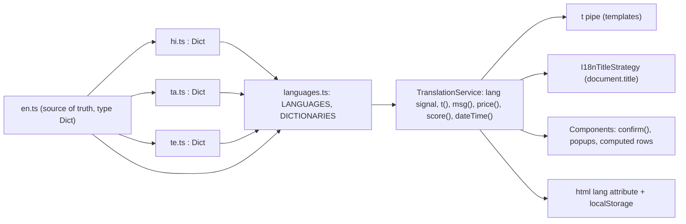

# House Hunt: UX, accessibility and internationalisation

| Field | Value |
|---|---|
| Document | 05 UX, accessibility and i18n |
| Version | 0.2 |
| Date | 2026-09-22 |
| Author | Claude (Cowork) – Design team |
| Status | Draft |
| Scope | Web app (`web/`) and Android app (`android/`), both implemented |

## Change log

| Version | Date | Author | Change |
|---|---|---|---|
| 0.1 | 2026-09-22 | Claude (Cowork) – Design team | First version. Design principles, tokens with contrast ratios, component inventory, screen flows, WCAG 2.2 AA checklist (web status, Android plan), i18n architecture for en/hi/ta/te, translation workflow, glossary, accessibility test plan. |
| 0.2 | 2026-09-22 | Claude (Cowork) – Design team | Wave 2: Android strings in 4 languages with an in-app language picker (LocaleManager on 13+, no AppCompat), TalkBack semantics, 48 dp targets, font-scaling layouts, web tokens and dark theme on Android (section 7.1, 8.2). Web: accessible confirm dialog replaces `confirm()` (A11Y-B05 closed), dismissible/hoverable map popup (A11Y-B01 closed), AI pages and import panel, "remember on this device". |

---

## Contents

1. [Scope and targets](#1-scope-and-targets)
2. [Design principles](#2-design-principles)
3. [Personas and accessibility needs](#3-personas-and-accessibility-needs)
4. [Design tokens](#4-design-tokens)
5. [Component inventory](#5-component-inventory)
6. [Screen flows](#6-screen-flows)
7. [WCAG 2.2 AA checklist](#7-wcag-22-aa-checklist)
8. [Internationalisation architecture](#8-internationalisation-architecture)
9. [Translation workflow](#9-translation-workflow)
10. [Glossary](#10-glossary)
11. [Accessibility test plan](#11-accessibility-test-plan)
12. [Requirements (UX, A11Y, I18N)](#12-requirements-ux-a11y-i18n)
13. [Known gaps and backlog](#13-known-gaps-and-backlog)

---

## 1. Scope and targets

| Target | Web | Android |
|---|---|---|
| Accessibility standard | WCAG 2.2 level AA | WCAG 2.2 AA as applied to mobile (W3C "WCAG2Mobile" guidance), Android accessibility guidelines |
| Screen readers | NVDA + Firefox/Chrome (Windows), VoiceOver + Safari (macOS/iOS), TalkBack + Chrome (Android) | TalkBack |
| Languages | English (`en`), Hindi (`hi`), Tamil (`ta`), Telugu (`te`) | Same four |
| Number, currency and date format | `en-IN`, `hi-IN`, `ta-IN`, `te-IN` via `Intl` (₹, lakh grouping: ₹12,50,000) | Same locales via `java.text.NumberFormat` / `DateTimeFormatter` |
| Themes | Light and dark (follows `prefers-color-scheme`) | Material 3 light/dark, dynamic colour off for status colours |
| Smallest supported viewport | 320 CSS px wide, 200 % zoom, 400 % zoom reflow | 320 dp wide, font scale 200 % |

## 2. Design principles

| ID | Principle | What it means in practice |
|---|---|---|
| UX-001 | **List first, map second** | Everything on the map is also in the house list. The list is the accessible, keyboard- and screen-reader-friendly view. The map is a visual aid. |
| UX-002 | **Never colour alone** | Status has a colour, an icon (● New, ★ Shortlisted, ✕ Rejected) and a text label. Map markers also differ in size. Best values in the comparison get a ✓ and "(best)" for screen readers. |
| UX-003 | **One build, any language** | Language switches instantly without reload. Nothing is baked into images. Layouts allow 40 % text growth (Tamil and Telugu labels are often longer than English). |
| UX-004 | **Native controls first** | Real `<button>`, `<a>`, `<input type="radio">`, `<select>`, `<dialog>`. ARIA only where HTML has no element (live regions, `aria-pressed` toggle chips, region labels). |
| UX-005 | **Forgiving** | Confirm before destructive actions, warn before leaving unsaved changes, every rating can be cleared, errors say what happened and what to do. |
| UX-006 | **Quiet feedback** | Saves, uploads and language changes are announced in a polite live region. Errors use `role="alert"`. Focus never jumps unexpectedly. |
| UX-007 | **Field-ready** | Large targets (44 px preferred), one-handed layout on phones, works with gloves, in sunlight (high contrast) and on slow networks (skeleton loading states). |
| UX-008 | **Tokens, not magic numbers** | All colours, spacing, radii and type sizes are CSS custom properties in `web/src/styles.css` (section 4). Android mirrors them in the Compose theme. |

## 3. Personas and accessibility needs

The product personas are defined in [01 Requirements](01-requirements.md). The design team adds these accessibility and language needs. Each maps to requirements in section 12.

| Persona | Context | Needs | Design response |
|---|---|---|---|
| **Priya**, 29, primary house hunter, Chennai | Uses the Android app on the street in bright sun, one hand on a scooter handle or an umbrella. Reads Tamil and English. | High contrast outdoors, big targets, quick status change, Tamil UI. | 44 px targets, ≥ 5:1 status colours, status radio group near top, `ta` UI. |
| **Ramesh**, 63, Priya's father, Hyderabad | Reviews the shortlist on a laptop at home. Mild low vision, uses 175–200 % browser zoom. Prefers Telugu. | Zoom without horizontal scroll, readable fonts, clear focus. | Reflow at 320 px, rem-based type, 3 px focus ring, `te` UI with Noto Sans Telugu fallback. |
| **Anjali**, 35, screen-reader user, Pune | Blind, uses NVDA on Windows and TalkBack on Android. Compares houses her partner visited. Hindi and English. | Everything reachable without the map, meaningful labels, table headers, announcements. | List equivalent of map, labelled landmarks, `<caption>`/`scope` on the comparison table, live region, translated `aria-label`s. |
| **Karthik**, 41, motor impairment (tremor), Bengaluru | Keyboard and switch access on desktop, voice control on phone. | No drag-only actions, no tiny targets, visible labels that match accessible names (for voice control). | "Place here" button and latitude/longitude fields instead of dragging, visible labels contained in accessible names (WCAG 2.5.3). |
| **Meena**, 52, vestibular disorder | Motion makes her dizzy. | No animated panning or shimmer. | `prefers-reduced-motion` stops skeleton animation and transitions. MapLibre skips camera animations. |

## 4. Design tokens

Source of truth: `web/src/styles.css` (`:root` and the `prefers-color-scheme: dark` block). Contrast ratios are WCAG 2.x relative-luminance ratios, computed from the hex values. Text needs 4.5:1 (3:1 for large text), non-text UI parts and graphical objects need 3:1.

### 4.1 Colour: light theme

| Token | Value | Used for | Pair | Ratio | Passes |
|---|---|---|---|---|---|
| `--text` | `#1C2421` | Body text | on `--surface` `#FFFFFF` / `--bg` `#F4F6F5` | 15.86 / 14.62 | AA, AAA |
| `--muted` | `#5F6B67` | Secondary text, hints | on `#FFFFFF` / `#F4F6F5` | 5.55 / 5.11 | AA |
| `--primary` | `#1F6F5C` | Links, primary buttons, header, focus ring | on `#FFFFFF` (and white on it) | 6.02 | AA |
| `--primary-dark` | `#17574A` | Primary hover | white on it | 8.40 | AA, AAA |
| `--primary-soft` | `#E3F0EC` | Stats, selected chip, table head | `--text` on it | 13.55 | AA, AAA |
| `--status-new` | `#3C5A99` | NEW pill and marker | white on it / it on white map | 6.74 | AA |
| `--status-shortlisted` | `#1A7A43` (**changed** from `#1F8A4C`) | SHORTLISTED pill and marker | white on it | 5.37 (was 4.38, failed) | AA |
| `--status-rejected` | `#B3261E` | REJECTED pill and marker, errors | white on it | 6.54 | AA |
| `--star` | `#A86A00` (**changed** from `#E8A317`) | Stars | on `#FFFFFF` | 4.44 (was 2.17, failed 3:1) | 3:1 graphic |
| `--border-strong` | `#7D8985` (**new**) | Input, button, chip borders | on `#FFFFFF` / `#F4F6F5` | 3.63 / 3.34 | 3:1 (1.4.11) |
| `--border` | `#D9E0DD` | Decorative card dividers only | – | 1.34 | Not relied on |
| `--error-text` on `--error-bg` | `#B3261E` on `#FBECEB` | Error messages | – | 5.70 | AA |
| `--success-text` on `--success-bg` | `#1A7A43` on `#E7F5ED` | Success messages | – | 4.78 | AA |
| `--on-best` on `--best` | `#1A7A43` on `#DFF3E7` | Best cell in comparison | – | 4.63 | AA (was 3.77 with old green) |
| Header nav, current page | white on teal darkened 25 % | Current nav link (plus 3 px underline) | – | ≥ 6.0 | AA (was 4.1 with a lightened background) |

### 4.2 Colour: dark theme

| Token | Value | Pair | Ratio |
|---|---|---|---|
| `--bg` / `--surface` / `--surface-2` | `#101614` / `#19211F` / `#212B28` | – | – |
| `--text` | `#E4EBE8` | on `--surface` / `--bg` | 13.57 / 15.13 |
| `--muted` | `#A7B3AE` | on `--surface` | 7.59 |
| `--primary` | `#6FD1B3` | on `--surface`; `--on-primary` `#0B1F19` on it | 8.95; 9.35 |
| `--header-bg` | `#173F35` | white on it | 11.67 |
| `--status-new` / `-shortlisted` / `-rejected` | `#9DB4EA` / `#6FD69A` / `#FF8E86` | `--on-status` `#0E1412` on each | 9.00 / 10.43 / 8.40 |
| `--star` | `#F2B84B` | on `--surface` | 9.18 |
| `--border-strong` | `#7F8C87` | on `--surface` | 4.70 |
| `--error-text` on `--error-bg` | `#FF8E86` on `#3A1B19` | – | 7.01 |
| `--success-text` on `--success-bg` | `#6FD69A` on `#15301F` | – | 7.98 |
| `--on-best` on `--best` | `#6FD69A` on `#173524` | – | 7.49 |

Map tiles (OpenFreeMap "liberty") stay light in both themes, so map markers and the legend dots always use the light-theme status colours.

### 4.3 Type scale

Base size is the browser default (16 px), so user font settings and zoom work. No `px` font sizes.

| Token | rem | px @ 100 % | Use |
|---|---|---|---|
| `--text-xs` | 0.75 | 12 | Pills, legend, stat labels |
| `--text-sm` | 0.875 | 14 | Hints, meta, table |
| `--text-md` | 1 | 16 | Body, inputs |
| `--text-lg` | 1.125 | 18 | h2, stat values |
| `--text-xl` | 1.375 | 22 | h1, score |
| `--text-2xl` | 1.75 | 28 | Reserved (stars) |
| `--leading` | 1.5 (1.7 for `hi`, `ta`, `te`) | – | Indic scripts need room for matras and vowel signs |

Font stack: `system-ui, -apple-system, 'Segoe UI', Roboto, 'Helvetica Neue', Arial, 'Noto Sans', 'Noto Sans Devanagari', 'Noto Sans Tamil', 'Noto Sans Telugu', sans-serif`. The three Noto families load from Google Fonts in `index.html` with `display=swap`. Google Fonts splits them by `unicode-range`, so a browser downloads a script's font only if that script appears and the device lacks a local font. Letter-spacing and `text-transform: uppercase` are not used: both break Indic conjuncts or have no meaning in those scripts.

### 4.4 Spacing, shape, size, motion

| Token | Value | Token | Value |
|---|---|---|---|
| `--space-1` | 4 px | `--radius-sm` | 6 px |
| `--space-2` | 8 px | `--radius` | 10 px |
| `--space-3` | 12 px | `--radius-pill` | 999 px |
| `--space-4` | 16 px | `--target` | 44 px (preferred target) |
| `--space-5` | 24 px | `--target-min` | 32 px (dense controls, still > 24 px WCAG 2.5.8 minimum) |
| `--space-6` | 32 px | `--header-h` | 56 px minimum, grows when it wraps |
| `--space-7` | 48 px | `--duration` | 150 ms (0.01 ms with reduced motion) |

Focus ring: `outline: 3px solid var(--focus)` with 2 px offset. In the teal header `--focus` switches to white.

## 5. Component inventory

| Component | Where | Semantics and behaviour | Notes |
|---|---|---|---|
| Skip link | App shell | First focusable element, visible on focus, moves focus to `<main id="main" tabindex="-1">` | Implemented with a click handler because `<base href>` would turn `#main` into a navigation. |
| Header / nav | App shell | `<header>`, `<nav aria-label="Main">`, `aria-current="page"` via `ariaCurrentWhenActive`, wraps on narrow screens | Brand link has an accessible name even when its text is hidden below 480 px. |
| Language switcher | App shell, every page | Native `<select>` labelled "Language" (visually hidden label, 🌐 icon), options in native script with `lang` attributes | Announces "Language changed to …" in the new language. |
| Live region | App shell | One `role="status" aria-live="polite" aria-atomic="true"` fed by `Announcer` | Used for saved, visit recorded, photo uploaded/deleted, address filled, disconnected. |
| Page title | Router | `I18nTitleStrategy` translates route `title` keys and re-translates on language change | – |
| Focus on navigation | App shell | After a route change, focus moves to the page `<h1>` | First page load keeps browser default. |
| Button (`.btn`, `-primary`, `-danger`, `-sm`) | All | Native `<button>`, min 44 px (36 px for `-sm`), 3:1 border | Disabled buttons keep text contrast via 0.6 opacity on high-contrast colours. |
| Toggle chip (`.chip[aria-pressed]`) | Map filters, compare picker | `<button aria-pressed>` inside `role="group"` with a label, ✓ and thicker border when pressed | Not colour alone. |
| Status pill (`.pill-*`) | List, compare | Icon + text, ≥ 5:1 | – |
| Segmented radio (`.options .option`) | Status, checklist | Real `<input type="radio">` inside `<fieldset>`/`<legend>`, visually styled ``, arrow keys work natively | Checklist has a "–" option ("Not scored") so a score can be cleared without "click again to clear". |
| Star rating | House detail | Radio group 1–5 in a `<fieldset>`, ★ filled / ☆ outlined (shape, not only colour), "Clear rating" button | Screen-reader text "3 out of 5 stars". |
| Text field | Forms | `<label for>` + `id`, required marked with * and a legend line, `aria-invalid` + `aria-describedby` on error | Placeholders are examples only, never the label. |
| Map region | Map page, house detail | `role="region"` + `aria-label` + `aria-describedby` hint pointing to the list or to the coordinate fields | MapLibre control labels translated through its `locale` option. |
| Add-house mode | Map page | Toggle button (`aria-pressed`), centre crosshair, "Place here" button, hint in `role="status"` | Keyboard alternative to clicking the map. |
| Coordinates fields | House detail | Latitude/longitude number inputs, validated, update the pin | Alternative to dragging (WCAG 2.5.7). |
| House list | Map page | `<ul>` of links, results count in `role="status"`, focus or hover shows the map popup | Equivalent of the map (UX-001). |
| Stats | Map page | `<dl>` with `<dt>`/`<dd>` | Numbers use locale grouping. |
| Comparison table | Compare | `<caption>`, `<th scope="col">`, `<th scope="row">`, sticky row headers, scroll container is a focusable labelled region | Symbolic cells (★★★☆☆, –, …) have screen-reader text. |
| Photo tile | House detail | Image inside a `<button>` ("Photo 2 of Green Villa, open larger view"), delete button labelled "Delete photo 2" | Alt text is generated from the house name and position. |
| Photo viewer | House detail | Native `<dialog>` with `showModal()`: focus trap, Esc closes, focus returns; labelled "Photo viewer"; visible Close button; backdrop click closes | – |
| Empty state | List, compare, not found | Icon (decorative), message, primary action | – |
| Loading state | List, detail, compare | Skeleton bars (`aria-hidden`) + visually hidden "Loading…" in `role="status"`; shimmer stops with reduced motion | – |
| Error message | All | `role="alert"`, ⚠ icon, message + action (Try again / Check connection) | Server `detail` text is shown as is (API is English). |
| Unsaved-changes guard | House detail | `canDeactivate` asks (in-app dialog) before leaving with unsaved edits | – |
| Confirm dialog | App shell (`shared/confirm-dialog.ts`, `ConfirmService`) | Native modal `<dialog>` labelled by its message; buttons in the app language; destructive actions style the confirm button red and focus Cancel first; Esc = Cancel; focus returns to the opener | Replaces `window.confirm()` (A11Y-B05). |
| Map popup | Map page | Shown on list hover/focus and marker hover; stays while the pointer moves onto it; closes with Esc (anywhere), its close button, a map click or another hover | WCAG 1.4.13 (A11Y-B01). |
| AI entry points | Header nav (Ask, Plan visits), new-house form (Import from listing text) | Rendered only when `GET /api/ai/status` returns `enabled: true`. Answer text is plain text; `[house:id]` markers become numbered links with an accessible name ("Source 1: Blue gate house"); results in a polite live region; errors in `role="alert"` | Plan page: ordered list of stops is the accessible equivalent of the route map. |
| Remember-me | Connect page | Checkbox "Remember on this device" with a hint; off = sessionStorage | SEC-010. |

## 6. Screen flows

```mermaid
flowchart TD
    Start(["Open web app"]) --> Configured{"API URL and key saved?"}
    Configured -->|"No"| Connect["Connect page: URL, API key, Test, Save"]
    Connect -->|"Save and continue"| Map
    Configured -->|"Yes"| Map["Map page: map region, list, filters, sort, stats"]
    Map -->|"Add house, click map or Place here"| NewHouse["New house form"]
    Map -->|"Select house in list or marker"| Detail["House detail: details, status, rating, location, checklist, visits, photos"]
    NewHouse -->|"Create house"| Detail
    NewHouse -->|"Discard"| Map
    Detail -->|"Save"| Detail
    Detail -->|"Delete house, confirm"| Map
    Detail -->|"Back to map, confirm if unsaved"| Map
    Detail -->|"Open photo"| Viewer["Photo viewer dialog"]
    Viewer -->|"Esc or Close"| Detail
    Map -->|"Compare in nav"| Compare["Compare page: pick 2 to 4 houses, table"]
    Compare -->|"House name link"| Detail
    Map -->|"Error: Check connection"| Connect
    Header["Header on every page: skip link, nav, language switcher"] -.-> Map
    Header -.-> Compare
    Header -.-> Connect
```

Keyboard path on the map page (tab order): skip link → brand → nav → language → Add house → Show all → map canvas (arrow keys pan, +/− zoom) → map zoom and location buttons → search → status chips → sort → list items.

## 7. WCAG 2.2 AA checklist

Status: **Met** (implemented and checked by code review), **Partial** (known gap, see section 13), **N/A**, **Verify** (implemented, needs the manual test in section 11 before release). Android column is the plan for the Compose app; it has not been reviewed yet.

| SC | Name | Level | Web status | Web implementation | Android plan |
|---|---|---|---|---|---|
| 1.1.1 | Non-text content | A | Met | Photos: generated alt ("Photo 2 of …"). Icons `aria-hidden` with text next to them. Score badge `role="img"` with label. Brand image `alt=""`. | `contentDescription` on every icon button, image and marker; decorative images `contentDescription = null`. |
| 1.2.1–1.2.5 | Time-based media | A/AA | N/A | No audio or video. | N/A |
| 1.3.1 | Info and relationships | A | Met | Landmarks, headings, `<fieldset>`/`<legend>` for status, rating and each checklist item, `<label for>`, `<dl>` stats, table `scope`/`caption`, lists. | `Modifier.semantics { heading() }`, `selectableGroup()` for radio rows, `Role.RadioButton`, merged list items. |
| 1.3.2 | Meaningful sequence | A | Met | DOM order matches visual order; map before list on phones and desktop. | Traversal order follows layout; `traversalIndex` only if needed. |
| 1.3.3 | Sensory characteristics | A | Met | Instructions name controls ("Place here"), not shapes or positions only. | Same strings. |
| 1.3.4 | Orientation | AA | Met | No orientation lock. | No `screenOrientation` lock in the manifest. |
| 1.3.5 | Identify input purpose | AA | Met | `autocomplete="url"` on API URL; other fields describe third parties (contact), so `autocomplete="off"`. | `KeyboardOptions(keyboardType=Uri/Phone)`; autofill hints on URL. |
| 1.4.1 | Use of colour | A | Met | Status = icon + text (+ marker size); best cell ✓ + "(best)"; selected chip ✓ + bold border; stars ★/☆ shapes; links underlined. | Status chip with icon + text; markers with icon glyph. |
| 1.4.2 | Audio control | A | N/A | No audio. | N/A (Hunt mode notification uses system sound settings). |
| 1.4.3 | Contrast (minimum) | AA | Met | Section 4: all text ≥ 4.5:1 in both themes (status green and header states fixed). | Same palette in `Color.kt`; check with Accessibility Scanner. |
| 1.4.4 | Resize text | AA | Verify | rem type scale, no `maximum-scale`, header and toolbars wrap. | `sp` units everywhere, test at 200 % font scale. |
| 1.4.5 | Images of text | AA | Met | None. | None. |
| 1.4.10 | Reflow | AA | Verify | Single column below 760 px, 320 px checked for checklist row (7 × 34 px fits), header wraps. Comparison table scrolls horizontally inside a labelled region (allowed exception for data tables). | Layouts use `FlowRow`/`LazyColumn`; no fixed widths; test on 320 dp. |
| 1.4.11 | Non-text contrast | AA | Met | Control borders `--border-strong` 3.63:1, focus ring 6:1, stars 4.44:1, markers ≥ 5.37:1 on white tiles. | Outline colour ≥ 3:1 in both themes. |
| 1.4.12 | Text spacing | AA | Verify | No fixed-height text containers except the 72 px score circle (short numeric content). | Avoid fixed heights on text. |
| 1.4.13 | Content on hover or focus | AA | Partial | List-item hover/focus shows a map popup; it can be dismissed by moving away or clicking the map but not with Esc, and it is not hoverable. Information is duplicated in the list. | No hover content. |
| 2.1.1 | Keyboard | A | Met | All actions are native controls; add-house has "Place here"; pin has coordinate fields; photo opens from a button. | D-pad/keyboard focus on all clickables (`Modifier.clickable` / `selectable`). |
| 2.1.2 | No keyboard trap | A | Met | Native `<dialog>` releases focus on Esc/Close; map canvas lets Tab leave. | No custom focus traps. |
| 2.1.4 | Character key shortcuts | A | N/A | Only MapLibre's shortcuts, which work only when the map has focus. | N/A |
| 2.2.1 | Timing adjustable | A | N/A | No time limits. | N/A |
| 2.2.2 | Pause, stop, hide | A | Met | Skeleton shimmer only while loading and stops with reduced motion. | Same with `LocalReduceMotion` / animator duration scale. |
| 2.3.1 | Three flashes | A | Met | No flashing. | Same. |
| 2.4.1 | Bypass blocks | A | Met | Skip link to `<main>`; landmarks. | N/A on native (TalkBack headings navigation instead). |
| 2.4.2 | Page titled | A | Met | Translated per route ("Compare · House Hunt"). | `Activity` / screen titles announced via `paneTitle`. |
| 2.4.3 | Focus order | A | Met | DOM order; focus moves to `<h1>` after navigation, to section headings after deleting a visit or photo. | Default order; move accessibility focus after navigation. |
| 2.4.4 | Link purpose (in context) | A | Met | "Open" listing link has label "Open the listing (opens in a new tab)"; house links use the house name. | Same. |
| 2.4.5 | Multiple ways | AA | Met | Nav, list with search/filter, map, compare links. | Bottom nav + search. |
| 2.4.6 | Headings and labels | AA | Met | One `<h1>` per page, `<h2>` per card, descriptive labels. | Same structure. |
| 2.4.7 | Focus visible | AA | Met | 3 px `:focus-visible` ring everywhere, white in header, inset on list items and photos. | Material focus indication for keyboard users. |
| 2.4.11 | Focus not obscured (minimum) | AA | Verify | Sticky toolbar on detail page is short; check that focused fields scroll clear of it at 200 % zoom. | Use `imePadding`/`bringIntoViewRequester`. |
| 2.5.1 | Pointer gestures | A | Met | Map pinch/drag has buttons (zoom +/−, Show all, list). | Zoom buttons on the map. |
| 2.5.2 | Pointer cancellation | A | Met | Native click (up-event) activation. | Compose `clickable` activates on up. |
| 2.5.3 | Label in name | A | Met | Accessible names start with or contain the visible text in all four languages (checked for Show/Hide key, Call, Open). | Same rule for `contentDescription`. |
| 2.5.4 | Motion actuation | A | N/A | No motion input. | N/A |
| 2.5.7 | Dragging movements | AA | Met | Pin: click on map or type coordinates. Map pan: keyboard arrows and zoom buttons. | "Use my location" and coordinate entry as alternatives to dragging the pin. |
| 2.5.8 | Target size (minimum) | AA | Met | 44 px default; smallest are checklist options 34 × 36 px at ≤ 400 px wide and MapLibre controls 29 px. | 48 × 48 dp (`minimumInteractiveComponentSize`). |
| 3.1.1 | Language of page | A | Met | `<html lang>` updated on every switch. | Per-app language sets the locale. |
| 3.1.2 | Language of parts | AA | Met | Language options carry `lang`; brand name "House Hunt" is a proper noun. User-entered text (notes in another language) is not marked, see section 13. | `LocaleSpan`/`Modifier.semantics` not needed for UI; same limit for user text. |
| 3.2.1 | On focus | A | Met | Focus only shows a popup; no navigation. | Same. |
| 3.2.2 | On input | A | Met | Changing language or sort changes presentation only; no navigation. | Same. |
| 3.2.3 | Consistent navigation | AA | Met | Same header on every page. | Same bottom bar. |
| 3.2.4 | Consistent identification | AA | Met | Same icon + label for statuses everywhere. | Same. |
| 3.2.6 | Consistent help | A | N/A | No help mechanism yet. | N/A |
| 3.3.1 | Error identification | A | Met | Missing name: field `aria-invalid`, message tied with `aria-describedby`, focus moved; invalid coordinates explained. | `isError` + `supportingText` on `TextField`. |
| 3.3.2 | Labels or instructions | A | Met | Visible labels, required marker explained, checklist scale explained. | Same. |
| 3.3.3 | Error suggestion | AA | Met | Messages say how to fix ("Use an https:// address", coordinate ranges). | Same strings. |
| 3.3.4 | Error prevention (legal, financial, data) | AA | Met | Delete confirmations; unsaved-changes guard. Not a legal/financial app. | Undo snackbar for delete. |
| 3.3.7 | Redundant entry | A | Met | "Fill address from map" avoids retyping; nothing asked twice. | Same. |
| 3.3.8 | Accessible authentication (minimum) | AA | Met | API key can be pasted and shown; no cognitive test. | Same; allow paste and password managers. |
| 4.1.2 | Name, role, value | A | Met | Native controls; `aria-pressed` on toggles; radio `checked`; dialog labelled. | Compose semantics roles and state descriptions ("Selected"). |
| 4.1.3 | Status messages | AA | Met | Polite live region (saved, uploaded, results count), `role="alert"` for errors. | `LiveRegionMode.Polite` on snackbars/status text. |
| 2.3.3 (AAA, adopted) | Animation from interactions | AAA | Met | `prefers-reduced-motion` honoured. | Respect "Remove animations". |

### 7.1 Android (implemented in wave 2)

| ID | Item | Status | Detail (files under `android/app/src/main/java/com/househunt/app/ui/`) |
|---|---|---|---|
| A11Y-A01 | TalkBack labels | Done | Every `Icon`/`IconButton` has a translated `contentDescription` (Back, Delete house, Delete photo N, My location, photo "Photo N of {name}"); nav bar icons are decorative because the tabs have visible labels. The map canvas has a description pointing to the Houses tab (markers are not individually focusable, as on the web: A11Y-B02). |
| A11Y-A02 | Touch targets | Done | Star and sort options are 48 dp boxes; whole rows are the target for switches (Hunt mode, Wi-Fi photos), checkboxes (Compare) and radio buttons (language); photo delete is a 48 dp `IconButton` on a surface. |
| A11Y-A03 | Dynamic font scaling | Done | Text in `sp` via Material typography; `FlowRow` for card metadata and photo buttons; Compare cells use a minimum height (not a fixed one) and rows share one height (`IntrinsicSize.Min`); house names are no longer cut to one line. To verify at 1.3 and 2.0 (TC-A-04). |
| A11Y-A04 | RTL-safe layouts | Done | `start`/`end` paddings only; `supportsRtl="true"`. |
| A11Y-A05 | Radio semantics | Done | Rating: `selectableGroup()` + `selectable(role = Role.RadioButton)` with "N out of 5 stars" and a group `stateDescription`; checklist chips have `Role.RadioButton` and "{item}: N out of 5"; sort options and language are radio groups; status uses Material segmented buttons (single choice). |
| A11Y-A06 | Hunt mode notification | Done | All notification texts and channel names from `strings.xml` (localised context on Android 8–12). |
| A11Y-A07 | Colour | Done | `ui/Theme.kt`: web light and dark tokens (section 4), not dynamic colour; status and star colours per theme (`LocalHouseHuntColors`); map markers always use the light colours because tiles stay light. |
| A11Y-A08 | Headings | Done | `semantics { heading() }` on screen titles and section headings (`SectionHeading`). |
| A11Y-A09 | Live updates | Done | Sync result, Hunt card street/nearest/GPS state and assistant results use polite live regions; errors assertive. |
| A11Y-A10 | Dark theme | Done | `HouseHuntTheme(dark = isSystemInDarkTheme())`; `values-night/themes.xml` sets a dark window background so there is no white flash. |

## 8. Internationalisation architecture

### 8.1 Web: runtime dictionaries

| Decision | Choice | Why |
|---|---|---|
| Library | Own ~150-line runtime (`web/src/app/i18n/`), not `@angular/localize` | One build, instant switching without reload, free static hosting of a single `dist/`. |
| Dictionaries | Typed TS objects. `en` is the source; `type Dict = { readonly [K in keyof typeof en]: string }`; `const hi: Dict = {...}` | A missing or extra key in any language fails `ng build`. Keys used in templates are type-checked (`TKey`) under `strictTemplates`. |
| State | `lang` signal in `TranslationService`; persisted in `localStorage['house-hunt.lang']` (in `try/catch`); default from `navigator.languages` if supported, else `en` | Signals make templates, `computed()` values and the pipe update without zone.js. |
| Template API | `{{ 'house.save' \| t }}`, `{{ 'common.bhk' \| t: { n: 2 } }}` (impure pipe that reads the signal) | Cheap: one map lookup per binding. |
| Code API | `i18n.t(key, params)`, `i18n.msg({ key, params })` | Used for `confirm()`, MapLibre popups, control labels and table rows. |
| Messages in state | Errors and announcements are stored as `Msg` objects (`{ key, params }`), not strings; params can nest a `Msg` (e.g. "Save failed: {reason}") | A message on screen changes language with the UI. |
| Interpolation | `{name}` placeholders; number params are formatted with the locale | Keeps word order free for each language. |
| Plurals | Avoided by phrasing ("Houses shown: 3 of 7") | Hindi, Tamil and Telugu plural rules differ; add `Intl.PluralRules` only when a string needs it. |
| Formatting | `Intl.NumberFormat` / `DateTimeFormat` with `en-IN`, `hi-IN`, `ta-IN`, `te-IN`; currency INR, 0 decimals | ₹12,50,000 (lakh grouping) in all four; dates like "22 सित॰ 2026, 4:00 pm". Latin digits are the default numbering system for these locales and are what users expect for prices. |
| Page title | Route `title` holds a key; `I18nTitleStrategy` translates it and re-runs on language change | – |
| MapLibre UI | `locale` map option with translated zoom, location, attribution, close labels | Applied when a map is created (next page visit after a switch). |
| Fonts | System fonts first, Noto Sans Devanagari/Tamil/Telugu from Google Fonts as fallback; build-time font inlining disabled (`optimization.fonts: false`) so CI does not need to reach Google at build time | – |
| Server text | RFC 7807 `detail` from the API is shown as is | API is English-only; translating server errors is backlog item I18N-B01. |

Files: `web/src/app/i18n/en.ts`, `hi.ts`, `ta.ts`, `te.ts`, `languages.ts`, `translation.service.ts`, `t.pipe.ts`, `i18n-title.strategy.ts`, and `web/src/app/core/announcer.service.ts` for the live region.

### 8.2 Android: resource-based (implemented)

| Item | Implementation |
|---|---|
| Strings | `res/values/strings.xml` (English, default) plus `values-hi/`, `values-ta/`, `values-te/`, 194 strings each. Names mirror web keys with `_` instead of `.`: `house.save` → `house_save`, `check.water` → `check_water`. Screen-specific Android keys use the same `area_thing` pattern (`map_hunt_mode`, `settings_photos_wifi`, `ai_plan_leg`). |
| Placeholders | Positional `%1$s`, `%2$d`; every language keeps exactly the same placeholders (checked when the files are generated). Web `{name}` maps to `%1$s`. |
| Plurals | Avoided by phrasing, as on the web ("Visits: %1$d"). |
| Per-app language | `res/xml/locales_config.xml` (`en`, `hi`, `ta`, `te`) and `android:localeConfig` in the manifest (Android 13+ system settings). In-app picker in Settings (`i18n/AppLocale.kt`): on API 33+ it calls the platform `LocaleManager.setApplicationLocales(...)` (the system stores the choice and recreates the activity); on API 26–32 it stores the tag in a small SharedPreferences file and wraps each `Activity`/`Service` base context (`attachBaseContext`) with that locale, then recreates the activity. **No AppCompat dependency** (the app is Compose-only on `ComponentActivity`). Notification channels are re-created with the localised context so their names follow the language. |
| Formatting | `ui/Format.kt`: app language + region IN (`hi-IN`, …): `NumberFormat.getCurrencyInstance` with 0 fraction digits (₹12,50,000), `DateTimeFormatter.ofLocalizedDateTime(MEDIUM, SHORT)`, scores with one decimal. Coordinates always with `Locale.ROOT`. |
| Checklist keys | Stored keys (`water`, `power`, …) are language-neutral and shared with the API and web; only labels are translated (`Checklist.items` maps key → string resource). |
| Server-side text | The sync result is stored as a code (`SyncOutcome`) and rendered in the current language; server error bodies are never shown. |
| Lint | `MissingTranslation` and `ExtraTranslation` are errors in `app/build.gradle.kts`; CI runs lint and reports it (not yet blocking, see 07). |
| Fonts | System Noto fonts (present on all supported Android versions). |

## 9. Translation workflow

### 9.1 Add or change a string (web)

1. Add the key to `web/src/app/i18n/en.ts` in the right group (`area.thing`). Use `{placeholders}`, full sentences and no concatenation.
2. `npx ng build` now fails for `hi.ts`, `ta.ts`, `te.ts`. Add the key to each. Until a translator has reviewed it, you may copy the English text and add a `// TODO(i18n-review)` comment on that line.
3. Use it: `{{ 'area.thing' | t }}` in templates, `this.i18n.t('area.thing')` in code, or store `{ key: 'area.thing' }` in a signal.
4. Keep the same placeholders in every language (a CI check can compare them; see TC-I18N-02).
5. Add the matching Android string (`area_thing`) in all four `values*/strings.xml` in the same pull request, with the same `%1$s` placeholders in every language. Escape `'` as `\'` in Android XML.
6. Ask a native-speaker reviewer for each language to review the pull request (see 9.3).

Changing the English meaning of an existing key: rename the key instead of editing it, so stale translations cannot survive silently.

### 9.2 Add a language (web)

1. Create `web/src/app/i18n/<code>.ts` with `export const <code>: Dict = { ... }` (the compiler lists missing keys).
2. Add the code to the `Lang` type, `LANGUAGES` (native name + locale such as `mr-IN`), `DICTIONARIES` and `isLang()` in `languages.ts`.
3. Add a Noto font family for the script to the Google Fonts link in `index.html` and to `--font-sans`, and add the language to the `:lang()` line-height rule if the script needs it.
4. For RTL languages (for example Urdu) also set `document.documentElement.dir` in `TranslationService.setLang()` and audit physical CSS properties (`left`, `margin-left`) for logical equivalents.
5. Android: add `values-<code>/strings.xml`, the locale to `locales_config.xml`, the code to `AppLocale.SUPPORTED` and its native name to `languageNames` in `SettingsScreen.kt`.
6. Extend the glossary (section 10) first, then translate.

### 9.3 Quality rules for translators

- Use everyday words people use when renting in that region, not formal or Sanskritised/literary forms. Prefer a native word when it is common (किराया, வாடகை, అద్దె); keep English loanwords when they are what people say (पार्किंग, BHK, API).
- Keep "BHK", "API", "URL", "CORS", "House Hunt", "OpenStreetMap" unchanged.
- Buttons are verbs (imperative, polite form: हिन्दी "-एँ", Tamil plain imperative as in Android Tamil UI, Telugu "-ండి" forms for actions).
- Keep labels short; Tamil and Telugu can be 30–50 % longer. The layouts wrap, but check the header and the checklist on a 320 px screen.
- Accessible names must contain the visible label text (WCAG 2.5.3).
- Reviewers: one native speaker per language checks meaning, tone and truncation on a phone.

## 10. Glossary

| Term (key) | English | हिन्दी (hi) | தமிழ் (ta) | తెలుగు (te) | Notes |
|---|---|---|---|---|---|
| house | House | मकान | வீடு | ఇల్లు | Hindi "घर" means home; "मकान" is the building being rented or bought. |
| map | Map | नक्शा | வரைபடம் | మ్యాప్ | Telugu loanword is more common in apps than "పటం". |
| compare | Compare | तुलना | ஒப்பிடு | పోల్చండి | – |
| status.NEW | New | नया | புதியது | కొత్తది | – |
| status.SHORTLISTED | Shortlisted | चुना गया | தேர்வானது | ఎంపికైంది | Plural in stats: चुने गए / தேர்வானவை / ఎంపికైనవి. |
| status.REJECTED | Rejected | अस्वीकृत | நிராகரிக்கப்பட்டது | తిరస్కరించబడింది | – |
| score | Score | अंक | மதிப்பெண் | స్కోర్ | Overall 0–5 score. |
| rating | Your rating | आपकी रेटिंग | உங்கள் மதிப்பீடு | మీ రేటింగ్ | Personal 1–5 stars. |
| checklist | Checklist | जाँच सूची | சரிபார்ப்புப் பட்டியல் | తనిఖీ జాబితా | – |
| visit | Visit(s) | दौरा / दौरे | வருகை / வருகைகள் | సందర్శన / సందర్శనలు | A trip to see the house. |
| rent | Rent (per month) | किराया (प्रति माह) | வாடகை (மாதத்திற்கு) | అద్దె (నెలకు) | – |
| sale | Sale | बिक्री | விற்பனை | అమ్మకం | – |
| per month | /month | /माह | /மாதம் | /నెల | Suffix after the price. |
| BHK | BHK | BHK | BHK | BHK | Never translated. |
| street | Street | सड़क | தெரு | వీధి | – |
| locality | Locality | इलाका | பகுதி | ప్రాంతం | Neighbourhood or area name. |
| latitude / longitude | Latitude / Longitude | अक्षांश / देशांतर | அட்சரேகை / தீர்க்கரேகை | అక్షాంశం / రేఖాంశం | – |
| photos | Photos | तस्वीरें | படங்கள் | ఫోటోలు | – |
| notes | Notes | नोट | குறிப்புகள் | గమనికలు | – |
| legend | Legend | संकेत | குறிப்பு | సూచిక | Map key. |
| best | (best) | (सबसे अच्छा) | (சிறந்தது) | (ఉత్తమం) | Screen-reader text on comparison cells. |
| check.water | Water supply | पानी की आपूर्ति | தண்ணீர் வசதி | నీటి సరఫరా | – |
| check.power | Power backup | बिजली बैकअप | மின் காப்பு (பவர் பேக்கப்) | పవర్ బ్యాకప్ | Inverter/generator. |
| check.parking | Parking | पार्किंग | வாகன நிறுத்தம் | పార్కింగ్ | – |
| check.sunlight | Sunlight | धूप | சூரிய ஒளி | సూర్యరశ్మి | – |
| check.ventilation | Ventilation | हवादारी | காற்றோட்டம் | గాలి ప్రసరణ | – |
| check.noise | Quiet (low noise) | शांति (कम शोर) | அமைதி (குறைந்த இரைச்சல்) | ప్రశాంతత (తక్కువ శబ్దం) | Higher score = quieter. |
| check.security | Safety and security | सुरक्षा | பாதுகாப்பு | భద్రత | – |
| check.maintenance | Building condition | इमारत की हालत | கட்டிடத்தின் நிலை | భవనం పరిస్థితి | – |
| check.neighbourhood | Neighbourhood | आस-पड़ोस | சுற்றுப்புறம் | పరిసరాలు | – |
| check.commute | Commute | आने-जाने की सुविधा | போக்குவரத்து வசதி | రాకపోకల సౌలభ్యం | – |
| API key | API key | API कुंजी | API விசை | API కీ | "API" kept. |

## 11. Accessibility test plan

### 11.1 Tools and environments

| Tool / AT | Platform | Used for |
|---|---|---|
| axe DevTools (browser extension) and `@axe-core/playwright` in CI (planned) | Chrome, Firefox | Automated rules on every page in light and dark theme and all four languages. |
| Keyboard only | Chrome + Firefox, Windows/macOS | Full task walk-throughs. |
| NVDA 2025.x + Firefox, NVDA + Chrome | Windows | Screen-reader walk-through (English and Hindi voices). |
| VoiceOver | macOS Safari, iOS Safari | Spot checks. |
| TalkBack | Android Chrome (web) and the Android app | Mobile screen-reader walk-through; Tamil/Telugu TTS via Google speech services. |
| Browser zoom 200 % and 400 %, viewport 320 × 640 | Chrome DevTools | Resize and reflow. |
| Text spacing bookmarklet | Chrome | WCAG 1.4.12. |
| OS settings: dark mode, reduced motion, Windows contrast themes | All | Theme and motion. |
| Colour-contrast analyser | – | Spot checks of new colours. |
| Accessibility Scanner | Android | Touch targets, contrast, labels in the Android app. |

### 11.2 Test cases

| ID | Test | Steps | Expected |
|---|---|---|---|
| TC-A11Y-01 | Automated scan | Run axe on Connect, Map (empty, with houses, add mode, error), House detail (new, existing, photo viewer open), Compare, in light and dark, for `en`, `hi`, `ta`, `te`. | 0 critical/serious issues. Moderate issues triaged. |
| TC-A11Y-02 | Keyboard-only walk | Without a mouse: skip link → add a house with "Place here" → fill name, set status with arrow keys, rate 4 stars, score all checklist items, type coordinates → create → mark visited → add photo → open and close the photo viewer with Esc → compare 2 houses → change language. | Every step possible; focus always visible and never lost; no trap; focus lands on the `<h1>` after each navigation. |
| TC-A11Y-03 | NVDA walk | Same task with NVDA, browse and focus modes. | Landmarks (banner, navigation, main, map region) and headings announced; radio groups announce legend, option and position ("Water supply, grouping, 3, radio button, checked, 5 of 7"); save and upload announced once via live region; errors announced immediately; table headers read for each cell. |
| TC-A11Y-04 | TalkBack walk (web and app) | On Android: explore by touch and swipe navigation through the list, open a house, change status, compare. | All controls have meaningful labels in the chosen language; targets easy to hit; nothing announced as "unlabelled". |
| TC-A11Y-05 | 200 % zoom | At 1280 × 800 set zoom 200 %; walk all pages. | No loss of content or function; header wraps; no horizontal page scroll except the comparison table region. |
| TC-A11Y-06 | 320 px reflow (400 %) | Viewport 320 px wide (or 1280 px at 400 %). | Single column; checklist row fits or wraps; toolbar wraps; no text cut off in any language. |
| TC-A11Y-07 | Text spacing | Apply line height 1.5, paragraph spacing 2, letter spacing 0.12, word spacing 0.16. | No clipped or overlapping text. |
| TC-A11Y-08 | Colour independence | Greyscale mode (OS filter). | Status, selected chips, best cells and ratings are all still distinguishable. |
| TC-A11Y-09 | Dark theme and forced colours | OS dark mode; Windows high contrast theme. | All text readable, focus visible, selected radios/chips visible. |
| TC-A11Y-10 | Reduced motion | Enable "reduce motion"; load pages, fit map, open house. | No shimmer, no animated camera moves. |
| TC-A11Y-11 | Target size | Measure smallest targets on a 360 px phone. | All ≥ 24 × 24 CSS px; primary actions ≥ 44 px. |
| TC-A11Y-12 | Label in name (voice control) | With Voice Access / Dragon, say the visible label of Show, Call, Open, Place here, each status, in English and Hindi. | Each control activates. |
| TC-I18N-01 | Language switch | Switch en → hi → ta → te on each page, including a visible error and an open confirm. | All text changes without reload; `<html lang>` and page title update; choice survives reload; prices show ₹ with lakh grouping. |
| TC-I18N-02 | Dictionary integrity | `ng build`; script comparing `{placeholders}` per key across languages. | Build passes; no placeholder mismatch (0 today across 208 keys). |
| TC-I18N-03 | Default language | Fresh profile with browser language `ta-IN`, then `fr-FR`. | Starts in Tamil, then English. |
| TC-I18N-04 | Font fallback | Device without Indic fonts (for example a Linux VM without Noto); block `fonts.googleapis.com`. | With Google Fonts: glyphs render. Blocked: app still works, text may show boxes (documented limitation). |
| TC-I18N-05 | Truncation | Longest strings (Telugu/Tamil) on a 320 px screen: header, add-hint, chips, toolbar. | Text wraps, nothing truncated without a way to read it. |

### 11.3 Release gate

A release that changes UI needs TC-A11Y-01, -02 and TC-I18N-01, -02 to pass. Every UI change touching a flow runs the keyboard walk for that flow. The full set (all TC-A11Y and TC-I18N) runs before each baseline version (1.0 and later). Results go into the test report in [06 Test plan](06-test-plan.md).

## 12. Requirements (UX, A11Y, I18N)

| ID | Requirement | Priority | Verified by |
|---|---|---|---|
| UX-001 … UX-008 | Design principles in section 2 | Must | Design review |
| A11Y-001 | Web app conforms to WCAG 2.2 AA (section 7). | Must | TC-A11Y-01…12 |
| A11Y-002 | Every map feature has a keyboard- and screen-reader-accessible equivalent (list, "Place here", coordinates). | Must | TC-A11Y-02, -03 |
| A11Y-003 | Status is shown by text + icon, never colour alone. | Must | TC-A11Y-08 |
| A11Y-004 | Text contrast ≥ 4.5:1, UI part contrast ≥ 3:1 in light and dark themes. | Must | Section 4, TC-A11Y-01, -09 |
| A11Y-005 | Targets ≥ 24 px (web, 44 px preferred) and ≥ 48 dp (Android). | Must | TC-A11Y-11 |
| A11Y-006 | Results of actions and errors are announced (live region / alert). | Must | TC-A11Y-03 |
| A11Y-007 | Honour reduced motion and dark mode preferences. | Should | TC-A11Y-09, -10 |
| A11Y-008 | Android meets A11Y-A01…A10. | Must | TC-A-03, TC-A-07, Accessibility Scanner |
| I18N-001 | UI available in English, Hindi, Tamil and Telugu; all user-visible strings, labels, titles and confirm texts translated. | Must | TC-I18N-01 |
| I18N-002 | Language switch without reload, persisted per device, default from the browser/OS. | Must | TC-I18N-01, -03 |
| I18N-003 | Numbers, ₹ prices and dates formatted for `xx-IN` locales. | Must | TC-I18N-01 |
| I18N-004 | Build fails on missing translations. | Must | TC-I18N-02 |
| I18N-005 | Android uses resource-based per-app languages (`locales_config`, in-app picker). | Must | TC-L-05 |

## 13. Known gaps and backlog

| ID | Gap | Impact | Plan |
|---|---|---|---|
| ~~A11Y-B01~~ | Map popup on list hover/focus was not hoverable and had no Esc dismissal (1.4.13). | – | **Closed in v0.2**: Esc anywhere dismisses it, it has a close button, and it no longer disappears when the pointer leaves the marker (so it is hoverable). |
| A11Y-B02 | MapLibre canvas: markers are not individually focusable. | Low: list is the equivalent (UX-001). | Keep; document in the in-app hint (done). |
| A11Y-B03 | MapLibre control labels update only when a map is created. | Low: after switching language on the map page, zoom-button tooltips stay in the old language until the page is reopened. | Recreate controls on language change. |
| A11Y-B04 | User-entered text (name, notes) is not marked with its language. | Screen readers may read Tamil notes with a Hindi voice. | Optional per-note language, or `lang` detection. |
| ~~A11Y-B05~~ | `confirm()` dialogs used the browser's own OK/Cancel labels. | – | **Closed in v0.2**: `ConfirmService` + `ConfirmDialog` (native modal `<dialog>`, app language, Esc = Cancel, focus return). |
| A11Y-B06 | Android: TalkBack checks (TC-A-07) and font scale 2.0 (TC-A-04) have not been run on a device yet. | Medium until verified. | Run on a Pixel emulator and one low-end device. |
| I18N-B05 | Android strings and the new web AI strings are first drafts by the design team, not yet reviewed by native speakers (same as I18N-B03). | Medium. | Native-speaker review. |
| I18N-B01 | Server error `detail` is English only. | Medium for non-English users on validation errors. | API returns error codes; map them to keys. |
| I18N-B02 | Nominatim addresses come back in the local default language. | Low. | Pass `accept-language` matching the UI language. |
| I18N-B03 | Translations written by the design team; not yet reviewed by native speakers. | Medium. | Native-speaker review per 9.3 before 1.0. |
| I18N-B04 | Noto fonts come from Google Fonts (third-party request that reveals IP address to Google). | Privacy note for 02/04. | Option to self-host the subset fonts in `public/`. |
