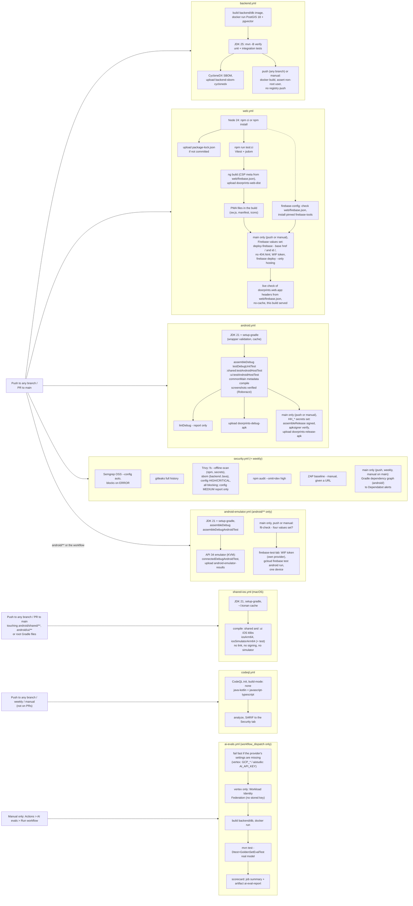

# 07: Secure build and deploy

| Field | Value |
|---|---|
| Document | Secure build, CI/CD and deployment guide |
| Version | 0.38 |
| Date | 2026-09-24 |
| Author | Claude (Cowork) |
| Status | Draft |

## Change log

| Version | Date | Author | Change |
|---|---|---|---|
| 0.1 | 2026-09-22 | Claude (Cowork) | First version: pipeline design, branch protection, secrets, APK signing, free-tier deployment (Supabase/Neon + Render/Koyeb/Oracle + Cloudflare Pages), env vars. No workflows exist in the repo yet. |
| 0.2 | 2026-09-22 | Claude (Cowork) | Wave 2: the pipeline now exists (`backend.yml`, `web.yml`, `android.yml`, `security.yml`, `dependabot.yml`); section 1 describes the real workflows and the CodeQL decision. Hardened Dockerfile and dev compose, `web/public/_headers` in the repo, new environment variables (rate limits, size limits, clock skew, retention, forward headers). |
| 0.3 | 2026-09-22 | Claude (Cowork) | Fixes after the first CI runs: Trivy scans the backend from a CycloneDX SBOM (`trivy sbom`) and runs `trivy fs --offline-scan` (the pom.xml resolution hit Maven Central `429 Too Many Requests`), Trivy DB cached with `actions/cache`; backend.yml publishes the SBOM; `permissions: {}` at the top with per-job `contents: read`; only PR runs are cancelled by newer pushes; Dependabot tuned (Monday schedule, 5 open PRs, grouped minor/patch and security updates, framework majors ignored); gitleaks history note. |
| 0.4 | 2026-09-22 | Claude (Cowork) | Sprint 1 close-out and Sprint 2 ([10](10-sprint-log.md)): section 6.3 CSP note fixed (MapLibre GL 6 module worker from `/maplibre/`, `worker-src 'self'`, no `blob:`); reviewed `.gitleaksignore`; Tomcat 11.0.25 override (F-28) and the version-override rule; `trivy config` blocking on HIGH/CRITICAL (DS-0002 fixed, F-29); `web.yml` runs unit tests; `android.yml` signed release job with `HH_*` secrets (F-11); `APP_API_KEY` minimum 32 and `APP_API_KEY_NEXT` implemented (F-01, SEC-017); compileSdk 37; CI results per sprint; `ai-evals.yml` (manual golden-set eval against a real model) in the section 1 table, diagram and secrets table; section 6.2 note on the non-root DB image (uid 999) and host bind-mount ownership; first-push CI row marked as reconstructed from the `689927d` commit message. |
| 0.5 | 2026-09-22 | Claude (Cowork) | Sprint 3: section 1 `ai-evals.yml` row now says the run also fails when zero cases ran or on a harness error (seeding or reindex failure), with *Errors* and *Why FAIL* sections in the scorecard (fix for the false PASS of the first eval run, E-02 in [10](10-sprint-log.md)); TC-AI-10 reference points to 06 §8. Environment variable table (section 7) lists the new `AI_EMBEDDING_*` settings. |
| 0.6 | 2026-09-22 | Claude (Cowork) | Sprint 3 lead decision: the dev `docker-compose.yml` is owned by the Backend team and now passes every `AI_*` / `APP_AI_*` / `APP_MCP_*` setting to the `api` service. Section 7: the single "AI variables" row is replaced by one row per setting group with the `application.yml` defaults, and a new **Dev compose** column says which variables the dev stack passes; note that `compose.prod.yml` passes only the core variables. |
| 0.7 | 2026-09-22 | Claude (Cowork), Docs team | Product rename to **Doorprints** ([03](03-design.md) ADR-13): CI artifacts are now `doorprints-debug-apk`, `doorprints-release-apk` and `doorprints-web-dist` (pipeline diagram, workflow table, section 5, section 6.4); planned release files `doorprints-vX.Y.Z.apk`; `APP_CORS_ORIGINS` example `https://<project>.pages.dev` with the project name filled in *(superseded in 0.18: section 7 now gives the example per host; since 0.21 no address guessed from the project name is given, only the one the deploy reports)*. Kept on purpose: the `HH_*` secrets, the CI keystore file `house-hunt-release.jks`, the image names `house-hunt-api` / `house-hunt-db` and the `househunt` database, user and role names. Section 5 notes that the new `applicationId` `app.doorprints` does not upgrade pre-rename builds. |
| 0.8 | 2026-09-22 | Claude (Cowork), Docs team | Product-owner decisions of 2026-09-22: the repository is renamed to **`Sriram-Codes-SW/doorprints`** and is **public** with an MIT `LICENSE` and `SECURITY.md` (private vulnerability reporting). Section 3 rewritten: the ruleset on `main` blocks deletion and force pushes; **required status checks are deliberately not enabled yet**, because the workflows have path filters and a required check that never runs blocks a PR; they will be enabled once a PR flow exists with an always-running **CI summary** check (3.1). Public-repository rules (3.2): logs and artifacts are public. **CodeQL** is now free (public repository) and is a **Sprint 4a candidate** (section 1). Section 7: new cloud AI access and cost-cap settings (planned, [11](11-feature-parity-and-export-spec.md) 5.13) and a pointer to [ai/vertex-setup.md](ai/vertex-setup.md) for the Vertex AI settings; section 6.5: time-limited staging on Google Cloud (trial credit). |
| 0.9 | 2026-09-22 | Claude (Cowork), Docs team | Review fixes. Section 4: new row for the **Vertex AI / Google Cloud credential** ([02](02-threat-model.md) T-I22): AI-only project, service account with `roles/aiplatform.user` only, no JSON key in repository, image, artifacts or logs, Workload Identity Federation (GitHub OIDC) for CI, quarterly rotation; exact variable names left to the AI team's `ai/vertex-setup.md` (being written). Section 6.5: spend cap budgets do not cover Cloud SQL, so staging needs its own budget alert and a fixed tear-down date. |
| 0.10 | 2026-09-22 | Claude (Cowork), Docs team | Vertex AI code and [ai/vertex-setup.md](ai/vertex-setup.md) landed in the same change set, so the "being written" markers are gone. Section 4: the Vertex AI row names the real settings (GitHub secrets `GCP_WIF_PROVIDER`, `GCP_SA_EMAIL`; GitHub variables `GCP_PROJECT_ID`, `GCP_LOCATION`, optional `AI_VERTEX_EMBEDDING_LOCATION`; `GOOGLE_APPLICATION_CREDENTIALS` for ADC) and splits rotation by credential type: Workload Identity Federation and the Cloud Run service account have no long-lived secret to rotate; only a JSON key on a non-Google host is rotated quarterly (the old "delete the old key" rule applies to that case only). The code supports ADC only, no Vertex API key. `ai-evals.yml` row: `provider` input (default `aistudio`; `vertex` chosen by hand after [ai/vertex-setup.md](ai/vertex-setup.md) steps 1-8; the default moves to `vertex` only after the step-10 run; corrected in review, an earlier draft said the default was `vertex`) and the quota stop. Section 7: new rows `AI_PROVIDER`, `GCP_PROJECT_ID`, `GCP_LOCATION`, `AI_VERTEX_EMBEDDING_LOCATION`, `AI_VERTEX_ENDPOINT`, `AI_VERTEX_API_VERSION`, `AI_INDEX_ON_CHANGE`, `GOOGLE_APPLICATION_CREDENTIALS`. |
| 0.11 | 2026-09-22 | Claude (Cowork), Docs team | Sprint 3.5 (KMP `:shared` module, commit `8f583af`, [03](03-design.md) ADR-14). Section 1: new workflow **`shared-ios.yml`** ("Shared iOS compile", job `shared-ios-compile` on `macos-latest`, JDK 21, `~/.konan` cache; compiles the `:shared` iOS main and test klibs only; path-filtered to `android/shared/**` and the root Gradle files; `contents: read`); `android.yml` runs `assembleDebug testDebugUnitTest :shared:testAndroidHostTest` and uploads the shared test reports too; `security.yml` job **`gradle-dependency-graph`** (Gradle dependency submission for `android/`, `contents: write` on that job only, never on pull requests, main/schedule/manual; iOS/native configurations excluded) closes the "Trivy cannot see Gradle" gap through Dependabot alerts; the flow diagram and conventions updated (the one job with a write scope; two third-party actions pinned by SHA: ZAP and `google-github-actions/auth` v3.0.0 after the DevSecOps review of `ai-evals.yml`); Dependabot ignores majors of `com.android.kotlin.multiplatform.library` with AGP. Section 4 Vertex row and section 7: this project's values (`GCP_PROJECT_ID=doorprints-ai`, `GCP_LOCATION=asia-south1`, `AI_VERTEX_EMBEDDING_LOCATION=global`, set 2026-09-22) and the recommended attribute condition with `refs/heads/main`. Section 6.5: trial credit ends 22 Dec 2026. |
| 0.12 | 2026-09-22 | Claude (Cowork), DevSecOps team | Section 1 `security.yml` row, job `gradle-dependency-graph`: corrected the effect of `dependency-graph-continue-on-failure: true` (only the submit/upload phase is non-blocking; a Gradle resolution or configuration-filter failure still fails the job; an earlier wording said a generate or submit failure only warns); new report check that warns when no graph JSON was produced; exit criterion is the `Submitted dependency-graph-reports/...` notice in the job log. |
| 0.13 | 2026-09-22 | Claude (Cowork), Docs team | Dependabot table (section 1) brought up to date with `.github/dependabot.yml` as it stands: new **`npm-dev-major`** group (one weekly PR for all major bumps of web devDependencies; production majors stay individual), the **docker `maven` ignore ranges that keep the build image on JDK 25** (Dependabot reads the JDK number as the last numeric version segment, so a JDK move is not a semver-major — PR #6), and a *not yet exercised* column for both. Section 1 `security.yml` row: the owner has **enabled Settings → Security → Dependency graph**, so the next Security run on `main` is the one whose log decides whether `dependency-graph-continue-on-failure` can be removed; the job stays non-blocking on submission until that notice is seen. |
| 0.14 | 2026-09-22 | Claude (Cowork), Docs team | **Two CI changes that landed in the same change set, and a security statement that had become false.** Section 1: new workflow row **`codeql.yml`** (Sprint 4a, candidate C-22 in [10](10-sprint-log.md) §11.1 — `java-kotlin` and `javascript-typescript` with `build-mode: none`, push to `main` + weekly + manual, SARIF to the Security tab, free only while the repository is public, **Android Kotlin deliberately not analysed** because buildless Kotlin needs a real Gradle build, and it gates nothing); the **`web.yml`** row now covers the `pwa-files`, **`build-pages`** (base href `/doorprints/`, `404.html` SPA fallback, base-tag assertion, absolute-PWA-scope regression guard, silent today because the Web team ships relative `scope`/`start_url` and derives the worker scope from the base URI) and **`deploy-pages`** jobs, with the `continue-on-error: true` exit criterion; the intro sentence and the pipeline diagram follow. **Corrected:** `gradle-dependency-graph` was described as “the only job in the repository with a write scope” — it is now one of three, so the Conventions *Least privilege* row names all four reviewed exceptions (`gradle-dependency-graph` `contents: write`, `codeql.yml` `analyze` `security-events: write`, `deploy-pages` `pages: write` + `id-token: write`, `ai-evals.yml` `id-token: write`). The “Why no CodeQL” paragraph is replaced by “CodeQL landed; **Semgrep stays the blocking SAST gate**” with the two open C-22 follow-ups. Section 6 says in one line that it is hosting guidance rather than the CI reference, and 6.3 gains a **GitHub Pages** note (no response headers → F-31/RR-11; the project path breaks the PWA scope). |
| 0.15 | 2026-09-22 | Claude (Cowork), Docs team | Review fix, section 1: the `codeql.yml` row and the "two SAST tools" paragraph described the extractors' coverage of the backend Java 25 sources, the Kotlin warning and the SARIF upload as observed behaviour. The workflow has **never run** — the caveat existed only in [10](10-sprint-log.md) §11.2 and C-22 follow-up (c). Both places now say the description is read off the workflow source, with the first run on `main` as the check that buildless `java-kotlin` really produces Java 25 results and that the Kotlin message is a warning rather than a job-failing error. No workflow change. |
| 0.16 | 2026-09-22 | Claude (Cowork), Docs team | **GitHub Pages is switched on** (owner, Settings → Pages → Source = “GitHub Actions”). Section 1 `web.yml` row, the pipeline diagram and 6.3 no longer say Pages is off: they give the real URL **https://sriram-codes-sw.github.io/doorprints/** instead of the `<owner>` placeholder, say `continue-on-error: true` is **still in `web.yml`** and turn the old exit criterion into the next action (first green `deploy-pages` on a 4a push to `main` plus the URL answering → DevSecOps removes `continue-on-error`), and record that nothing is deployed yet — no pushed commit has a Pages job, so the URL answers 404 until that push, and after it the site is public with no further gate. **Corrected:** 6.3 and section 1 said `manifest.webmanifest` sets `"id"`, `"start_url"` and `"scope"` to `"./"`; the Web team's **S4-05a** removed `id` (a relative `id` resolves against the *origin* of `start_url` — MDN — so `"./"` would have given every project site on `sriram-codes-sw.github.io` one app identity), so both places now say `start_url`/`scope` are `"./"` and `id` is deliberately absent. 6.3 names S4-05a and the shared-origin consequences (cache names scoped by deployment path, deletion limited to this app's caches; IndexedDB and `localStorage` are shared with the owner's other project sites), and records the build-time `<meta>` CSP the Web team's working tree now writes into the built `index.html` (`scripts/sw-precache.mjs`), with what it cannot cover — so [02](02-threat-model.md) RR-11 needs the owner's explicit acceptance before the first 4a push. Section 6 intro follows. No workflow change. |
| 0.17 | 2026-09-22 | Claude (Cowork), Docs team | Review fixes. **6.3**: "every push to `main` publishes" was too wide — `web.yml` runs on push only for `web/**` and `.github/workflows/web.yml` (plus `workflow_dispatch`), so it now reads "every push to `main` that touches `web/**` or `web.yml` (or a manual run)"; a docs-only or backend-only push publishes nothing. **6.3** list of headers missing on Pages now includes `Referrer-Policy`, with the note that the browser default (`strict-origin-when-cross-origin`) equals the value `_headers` sets ([02](02-threat-model.md) F-31 v0.19). **Section 1 and 6.3**, manifest identity: without `id` it "defaults to `start_url`, which resolves against the manifest URL (`/doorprints/`)" — not against `<base href>`; the two agree here only because the manifest sits in the app directory. 6.3 now points to the new live-URL check **TC-M-19** ([06](06-test-plan.md) §14.1 v0.16) instead of "06 §14" in general, and the F-10 gap to 06 §14.2; section 1 and 6.3 make TC-M-19 passing (not only "the URL answers") the condition for removing `continue-on-error` from `deploy-pages`. The shared-origin bullet now says which caches each of "Remove all data" and `activate` deletes (they differ). |
| 0.18 | 2026-09-22 | Claude (Cowork), Docs team | Fifth review round (docs versus the code as built). **Manifest `id`**: section 1 (`web.yml` row) and 6.3 said the manifest has no `"id"` on purpose; the build now writes one — `scripts/sw-precache.mjs` step 0, `stampManifestId`, sets `"id"` to the absolute base path read from the built `index.html` (`"/doorprints/"` on Pages, `"/"` otherwise), covered by `sw-precache.spec.ts` ([06](06-test-plan.md) TC-U-43). Both places now describe the build-stamped absolute `id`, why it keeps earlier installs the same app, and that the `web.yml` guard accepts it *(tightened in 0.19: the guard now requires `id` to equal the base href exactly and fails when it is absent)*; the guard is also described as it is (it **fails** the job, and checks `start_url`, `scope`, shortcut URLs and `id`), not as a warning about `"scope": "/"`. **CORS for the Pages site**: 6.3 step 3, the section 7 `APP_CORS_ORIGINS` row and the section 8 checklist gave only `https://<project>.pages.dev`; they now name the GitHub Pages origin **`https://sriram-codes-sw.github.io`** (an origin has no path, so not `…/doorprints/`), say that `docker-compose.yml` defaults to `http://localhost:4200` only, give the `export APP_CORS_ORIGINS=…` line for using the live site with a compose server, and repeat that such a server needs an `https://` address. The v0.7 row's example is marked as superseded. Section 7 gains `MAX_IMPORT_BYTES` (16 MiB, equal to the device readers' `data.json` cap) and `MAX_IMPORT_ROWS`. **Referrer**: 6.3's "the browser default equals `_headers`" is now true of Chromium and Firefox only; Safari's default is documented as *similar* ([02](02-threat-model.md) F-31 v0.20). |
| 0.19 | 2026-09-22 | Claude (Cowork), Docs team | Sixth review round: DevSecOps changed `backend.yml`, `android.yml` and `web.yml` after 0.18 was written (working tree, 2026-09-22 23:07–23:08; not yet triggered in CI). **Section 1 triggers**: the `backend.yml` row said "push/PR touching `backend/**`"; it now lists every path the workflow runs on and the test that reads each (`docs/ai/evals/**` → `GoldenSet`/`EvalScorerTest`; `docs/schemas/**` → `CanonicalSample`, `BackupMapperTest`, `BackupApiTest`; `docker-compose.yml`, `web/src/app/export/backup-export.ts`, `web/src/app/export/golden/**` and `android/shared/…/export/Backup.kt` → `BackupParityTest`). The `android.yml` row adds `docs/schemas/**` (`CanonicalSampleTest`). The section 1 intro says the three are path-filtered. **Section 3** required-checks row: the example is now path-neutral ("`backend.yml` runs only when its own inputs change"). **Manifest-id guard** (section 1 `web.yml` row and 6.3): it no longer "fails if an `id` resolves outside `/doorprints/`"; it requires `manifest.id` to equal the base href exactly and fails when `id` is absent (dropped `postbuild` stamp). The claim that the guard's comment in `web.yml` was stale is removed: DevSecOps rewrote that comment. |
| 0.20 | 2026-09-23 | Claude (Cowork), Docs team | **Owner decision (Sriram, 2026-09-23 07:30 IST): the web app is hosted on Cloudflare Pages, not GitHub Pages** ([03](03-design.md) ADR-21; [02](02-threat-model.md) F-31 Fixed, RR-11 closed). Written from DevSecOps' `web.yml` in the working tree (2026-09-23 02:15, not yet run in CI). **Section 1**: the GitHub Pages jobs `build-pages` and `deploy-pages` are gone; new job **`deploy-cloudflare`** (contents: read only) deploys the `build` job's artifact (base href `/`) with `cloudflare/wrangler-action@v4`, creates the project `doorprints` on the first run, and then fetches the new deployment and **fails unless the `_headers` security headers are served** (and `sw.js` is not cached as immutable); it **skips with a notice** until the two Cloudflare secrets exist, so `main` stays green. Diagram and `web.yml` row rewritten. **Section 4**: `CLOUDFLARE_API_TOKEN` and `CLOUDFLARE_ACCOUNT_ID`. **Section 6** intro and **6.3** rewritten: Cloudflare Pages by Direct Upload from CI (not Cloudflare's Git integration, which would need a Cloudflare app installed on the owner's GitHub account), the exact **owner setup** (Cloudflare account, one API token with *Account → Cloudflare Pages → Edit*, the account id, two repository secrets on this repository only, GitHub Pages switched off here, first run, reading the address), what the deploy checks, SPA fallback without `404.html`, the root path and manifest `id` `/`, old deployments (RR-12). **Section 7** and **8**: `APP_CORS_ORIGINS` names the Cloudflare Pages origin (`https://<project>.pages.dev`, no path) instead of `https://sriram-codes-sw.github.io`. |
| 0.21 | 2026-09-23 | Claude (Cowork), Docs team | Review fixes to 0.20, re-checked against `web/public/_headers` and `web/README.md` as the Web team left them at 02:27 and `_redirects` (02:05) and against `web.yml` (md5 `f84b4a86…`, unchanged since 02:15). **Caching (6.3 item 1)**: 0.20 said `_headers` gives hashed bundles long caching; the Web team removed every `max-age=31536000, immutable` rule (and the 7-day `/icons/*` rule) because Cloudflare Pages matches header rules by **request path** and its SPA fallback answers a missing file with the HTML shell and **status 200**, so a year-long rule would cache HTML under an old chunk's name. Item 1 now says: `no-cache` for `/sw.js`, `/manifest.webmanifest` and `/index.html` only; every other file gets Pages' default `public, max-age=0, must-revalidate` with an ETag, and the service worker precache serves the build after the first visit; no long `max-age` rule may come back. **Address**: the examples in 6.3 and section 7 that guessed the address from the project name are gone (the project name is unclaimed until the first deploy and anyone can take it); the docs say `https://<project>.pages.dev`, the address shown in the job summary. **Pinning** (Conventions): `cloudflare/wrangler-action` is pinned by the **major tag `@v4`**, not a commit SHA, in the one job that holds the Cloudflare token; recorded as an exception and handed to DevSecOps ([10](10-sprint-log.md) §11.6, [02](02-threat-model.md) T-T5). The `security.yml` row no longer lists `web.yml` `deploy-pages` among the write-scoped jobs. **Section 4 and 6.3 step 4**: repository secrets *are* available to pull-request runs from branches of this repository (only the job's `if:` keeps them out; fork PRs get none); both Cloudflare secrets are now recommended as **environment secrets of `cloudflare-pages`** restricted to `main`. **CORS** (6.3, section 7): Spring trims one trailing slash from configured and request origins (`CorsConfiguration.trimTrailingSlash`), so only a path makes an entry match nothing. **6.3 step 6** and the section 1 `web.yml` row: the first step to fail on a bad token or account id is *Does the Pages project exist?* **Section 8**: new checklist line, no long-lived caching rule in `_headers`. |
| 0.22 | 2026-09-23 | Claude (Cowork), Docs team | **Owner decision of 2026-09-23: the web app is hosted on Firebase Hosting at `https://doorprints.web.app`** (Spark plan, no billing account, project and site `doorprints`), replacing the Cloudflare Pages plan, which was never set up ([03](03-design.md) ADR-21, [12](12-brand-and-naming.md)). **§6.3 rewritten** as *Web: Firebase Hosting*: the decision and its history, the **status of the owner's setup** (steps 1–9 done on 2026-09-23, step 10 the first deploy), how `web.yml` deploys (`firebase-config`, `firebase-setup`, `deploy-firebase`; Workload Identity Federation with a provider pinned to `web.yml` on `main`; the service account's single role; `firebase-tools` 15.30.2 pinned; the `web/firebase.json` gate; the live header check), the owner's steps **as done**, copied from the DevSecOps owner guide of 23 Sep 2026, and the site's configuration (headers, `no-cache` everywhere, the `**` rewrite, reserved paths, releases and rollback, no preview channels, Spark limits). **§1**: diagram and `web.yml` row; *Least privilege* (`deploy-firebase` is the job with `id-token: write`); *Pinning* (the `wrangler-action` exception is gone with its job; the auth action is pinned by SHA; the coordinator minor about the wrangler commits is moot). **§4**: `CLOUDFLARE_*` rows replaced by `FIREBASE_WIF_PROVIDER`, `FIREBASE_SA_EMAIL`, `FIREBASE_PROJECT_ID` and `FIREBASE_SITE_ID`. **§6** intro, **§7** `APP_CORS_ORIGINS` (`https://doorprints.web.app`), **§8** checklist. New pointer page `docs/ops/firebase-hosting-setup.md`, which `web.yml`'s skip notice names. |
| 0.23 | 2026-09-23 | Claude (Cowork), Docs team | New **Appendix A, Security self-check**, published permanently at the delivery coordinator's request from the application security lead's playbook of 2026-09-23: the **Security Definition of Ready verbatim** (S1 claims = code, S5 untrusted files and export encoding, S2 backend API and web headers, S15 Android components, S4 Android storage, S10 web storage, S3 service worker, S7/S10/S9 sync, S11 CI identity, S6/S8 supply chain and gates, S12 secrets, S13 AI redaction, S14/S9 AI grounding and quota), the 15 families ranked by the 188 security findings of Sprint 4a, the rules with shortened examples, the security buddy pre-check and how reviews change. The owner's decision of the same day (security split; no Play Store release and no public server until the release security gate exists and passes) is recorded in [10](10-sprint-log.md) §12.5. No change to the pipeline, the deploy steps or the pre-deploy checklist. |
| 0.24 | 2026-09-23 | Claude (Cowork), Docs team | Appendix A.5, from the owner's recorded decisions ([10](10-sprint-log.md) §12.5; Docs pre-review buddy). **Item 5** names the release security gate as approved at 17:53 IST instead of a shorter list. Its automated part (S4b-SEC-1) adds a ZAP **API** scan against the backend started in CI, authorisation tests and the LLM prompt-injection set to MobSF, the ZAP baseline, TLS, the live header check and the licence scan. Its manual one-hour list is S4b-SEC-3, `docs/13-release-security-checklist.md`. A deep pentest comes before the Play Store launch and before Sprint 5 sign-in. Once the gate exists, web deploys pass it too. **Item 6**: checks moved into tooling go inside the existing workflows, with no new workflow and a flat CI runtime (Decision 3). The Security Definition of Ready (A.1) is unchanged. |
| 0.25 | 2026-09-23 | Claude (Cowork), Docs team | Round 1 review of the Docs final Sprint 4a round (major, with [10](10-sprint-log.md) v0.26). **Appendix A.5** opens with the owner-approved review rules, in use since the final Sprint 4a round (one complete pass in round 1; later rounds the delta plus its regressions only, no new finding on unchanged code unless a blocker; the blocker/major/minor rubric; out-of-scope findings as `BACKLOG:` minors that never block; `NEW RULE:` for a new class), pointing to [10](10-sprint-log.md) §12.5 S4b-EFF-4. |
| 0.26 | 2026-09-23 | Claude (Cowork), Docs team | **Owner decision (Sriram, 2026-09-23): the pipelines run on every branch** ([10](10-sprint-log.md) §12.5 Decision 5), written from DevSecOps' workflows in the working tree (`git diff HEAD -- .github/workflows`, re-read at hand-off; not yet run in CI). **Section 1**: new *Branch runs* paragraph and table (what runs on a branch push, what stays on `main`, two runs per workflow with a PR open, Dependabot branches, path-filter diff basis); the trigger column of every workflow row, the intro and the mermaid trigger labels say *push to any branch* / *PR to `main`*; `codeql.yml` now runs on every branch push and is **still** not on pull requests; `backend.yml` `image` runs on branch pushes on purpose (never pushed); `android.yml` signing is `main`-only (`release-signing-check` has the ref guard, `release` runs on its output); `firebase-setup` and `gradle-dependency-graph` wording says *never on another branch*. **Conventions**: Concurrency is `cancel-in-progress: ${{ github.ref != 'refs/heads/main' }}` everywhere including `codeql.yml`; Least privilege names the `main`-only jobs and `codeql.yml`'s branch SARIF upload; **Pinning**: `gradle/actions/setup-gradle` and `dependency-submission` are now pinned by commit (`9c971963…`, v6.3.0, checked with `git ls-remote`), found in the same diff. **Section 3**: required status checks stay off; branch pushes give the pre-merge signal; 3.1 says to merge only after green branch runs. **Sections 4, 5, 6.3**: `HH_*` secrets and `firebase-setup` / `firebase-config` wording follow. |
| 0.27 | 2026-09-23 | Claude (Cowork), Docs team | Pre-review fixes to 0.26 (one major, two minors). **The `main` ref guard on the signing jobs is not a security boundary** (Appendix A S11): a push runs the workflow file from the pushed branch, and the `HH_*` keystore secrets are repository secrets, so anyone with write access who edits `android.yml` on a branch (removing the guard or adding a step) runs branch code with the key on the next push, as [02](02-threat-model.md) T-E4 already said. §1 *Branch runs* (*Never* cell), Conventions *Least privilege*, §4 `HH_*` row and §5 *Build in CI* now say that an **unmodified** `android.yml` never signs off `main`, and that the control is moving `HH_*` into the `release` environment with a deployment-branch rule of `main` only, with `environment: release` on `release-signing-check` and `release` (handed to DevSecOps as [10](10-sprint-log.md) §12.7 **S4b-BL-8**; more pertinent since branch runs); the Firebase WIF condition is unaffected, since it does not depend on the workflow file. §3 *Environments* row: `release` and `production` are **planned, not in place**; the only environment a workflow names today is `firebase-hosting` (the deploy job's; it holds no secrets). **Concurrency** (*Branch runs* table and Conventions): with `cancel-in-progress: false` GitHub still cancels an older **pending** run in the same group when a newer one queues, so the wording is now *an in-progress run on `main` is never cancelled; if several pushes queue up, only the newest waiting run starts* (same for the deploy and `ai-evals` groups). **§3 and 3.1**: a branch gets the CI result *for the paths it changed*, not a full one; path filters work per push (a later docs-only push does not re-run `backend.yml`, so the head commit's checks can be green over a red backend run), and a branch-push run tests the branch head, not its merge with a `main` that has moved on; 3.1 says to check the latest run of each triggered workflow on the branch (Actions tab filtered by branch) and to bring the branch up to date with `main` and push again, or open the PR, before merging. Appendix A S11 *Seen* gains this case. With [02](02-threat-model.md) v0.26 and [10](10-sprint-log.md) v0.31. |
| 0.28 | 2026-09-24 | Claude (Cowork), Docs team | **India's boundary file in CI** (owner issue P0 of 2026-09-24, [03](03-design.md) ADR-22; DevSecOps' changes on branch `fix/india-boundaries`, working tree, not yet run). **Section 1**: `web.yml` `pwa-files` also requires `geo/in-boundaries.geojson` in the build (a GeoJSON FeatureCollection with kinds `world` and `claim`); `android.yml` also runs on `web/public/geo/**`, because `IndiaBoundaryDataTest` compares the web copy with the app's. **6.3 *What each deploy checks***: the live check also fetches `/geo/in-boundaries.geojson` (JSON type, `nosniff`, revalidated, the build's bytes). `web/firebase.json` types `**/*.geojson` as `application/geo+json`; the CSP is unchanged. [06](06-test-plan.md) TC-S-25. |
| 0.29 | 2026-09-24 | Claude (Code), Docs team | **§1 `web.yml` row:** `pwa-files` requires India's boundary file with the kinds `world`, `claim` and `state` (`state`, the Assam-Arunachal Pradesh state line, since branch `fix/india-boundary-lines`, PR #16; [03](03-design.md) ADR-22, [06](06-test-plan.md) TC-S-25). |
| 0.30 | 2026-09-24 | Claude (Code), Docs team | Compose Multiplatform track, phase 1 (CMP-1, commit `be86f50`; [03](03-design.md) ADR-23). **§1:** `android.yml` runs `assembleDebug testDebugUnitTest :shared:testAndroidHostTest :ui:testAndroidHostTest :shared:compileCommonMainKotlinMetadata :ui:compileCommonMainKotlinMetadata` (the metadata tasks since `06e482d`: common code compiled against the common libraries on Linux) (the new `:ui` module's `commonTest` on the JVM; its path filter `android/**` already covers `android/ui/**`). `shared-ios.yml` also watches `android/ui/**` and compiles `:ui:compileKotlinIosArm64`, `:ui:compileKotlinIosSimulatorArm64` and `:ui:compileTestKotlinIosSimulatorArm64`; its job name is unchanged in case it is a required check. The flowchart shows both. The `android-reports` artifact also uploads `android/ui/build/reports` and `test-results`. |
| 0.31 | 2026-09-24 | Claude (Code), Docs team | **Testing the APK and the live web UI** (owner request of 2026-09-24, commit `afe4064`; [06](06-test-plan.md) §16, [10](10-sprint-log.md) §13.3). **§1:** new workflow **`android-emulator.yml`** (the same triggers as `android.yml` (push to any branch, PR to `main`, manual), path-filtered on `android/**` and the workflow itself only; its push and pull_request path lists are identical and must stay so): job `emulator` (API 34 emulator, KVM, `connectedDebugAndroidTest`, artifact `android-emulator-results`), jobs `ftl-check` and `firebase-test-lab` (Firebase Test Lab, pushes to `main` and manual runs, keyless). `android.yml` runs its unit tests with `-Proborazzi.test.verify=true` (screenshot tests, TC-U-56) and uploads `app/build/outputs/roborazzi` in `android-reports`. The flowchart, the *Branch runs* table, the workflow table and the Conventions (least privilege: `id-token: write` only on `firebase-test-lab`; pinning of `ReactiveCircus/android-emulator-runner` v2.38.0 and `google-github-actions/setup-gcloud` v3.0.1; timeouts 5 to 45 minutes; artifact retention) are updated. New **§7.2**, the owner's Firebase Test Lab setup (APIs, service account `ftl-runner` with least-privilege roles, the Workload Identity provider's condition and the per-workflow impersonation, the secret `FTL_SA_EMAIL`), with a pointer file [ops/firebase-test-lab-setup.md](ops/firebase-test-lab-setup.md). `tools/live-ui` (the live web UI test, run by the lead after each merge, not by a workflow) is named in §1. |
| 0.32 | 2026-09-24 | Claude (Code), Docs team | **Round 2 of the test-harness pull request.** **§7.2 rewritten**: Firebase Test Lab uses a **Workload Identity provider of its own** (`github-test-lab`, in the pool `github` or a new pool; condition: `android-emulator.yml` on `main`, push or manual) and the new secret **`FTL_WIF_PROVIDER`**; the Hosting provider `github-web-deploy` is no longer widened (code review: "Don't widen the Hosting provider"); `ftl-runner` is granted only to that pool's principal set for this repository; the observation that `firebase-hosting-deploy` trusts the whole repository is kept as an optional hardening note. §1: `ftl-check` runs only on `refs/heads/main`; the `ftl_device` input is validated; the emulator job hides error dialogs; the emulator runner's pin is `a421e438…` (v2.38.0); the flowchart and the *Branch runs* row follow. §4: new row for `FTL_WIF_PROVIDER` and `FTL_SA_EMAIL`. |
| 0.33 | 2026-09-24 | Claude (Code), Docs team | Round 3 review of PR #18. §1: `emulator` is not main-only (it runs on every triggering push or PR; `ftl-check` runs only on `refs/heads/main`, `firebase-test-lab` only on its output); `android-emulator.yml` is path-filtered on `android/**` and the workflow itself only, unlike `android.yml` (intro, flowchart, workflow row; row 0.31 corrected). §7.2: a **new pool** `github-test-lab` is required (sharing the pool `github` would let the workflow act as the Hosting deploy account); the role pair is sourced to Firebase's IAM permissions page; `roles/storage.legacyBucketReader` on the bucket if the first run fails on `storage.buckets.get`; `ftl-runner` also reads Firebase Analytics (none in this project); Test Lab also runs on pushes to `main` that change the workflow file; the *New?* column says where each value comes from. |
| 0.34 | 2026-09-24 | Claude (Code), Docs team | Round 4 of PR #18: Test Lab writes to an **owner-created results bucket** (`--results-bucket`, new repository variable **`FTL_RESULTS_BUCKET`**, required by `ftl-check`), so Test Lab Admin plus Analytics Viewer is exactly Firebase's documented setup (the Editor caveat is gone). §7.2 step 3: the bucket (uniform access, 30-day delete rule), Storage Object Admin on it only, Legacy Bucket Reader if needed; **cost check: a bucket needs a billing account** (Cloud Storage for Firebase no longer supports Spark; Always Free needs billing and is US-only), so the step conflicts with the zero-cost rule and needs an owner decision. §1 rows, the flowchart and §4 name the variable. |
| 0.35 | 2026-09-24 | Claude (Code), Docs team | PR #18 round 7: §7.2 step 3 puts the bucket in `us-central1` (the only way to stay inside Always Free, option (b)) and says why the bucket grant is kept; Analytics Viewer is named as Firebase's documented pair; line wraps. |
| 0.36 | 2026-09-24 | Claude (Code), engineer | Legacy House Hunt names renamed (owner request of 2026-09-24; [03](03-design.md) ADR-24). Dev database defaults, the role and schema names (`doorprints`, `doorprints_app`, `doorprints_backup`), the image tags (`doorprints-api`, `doorprints-db`), the CI keystore temp file `doorprints-release.jks` and the example key alias `doorprints` (a keystore made earlier keeps its alias; `HH_KEY_ALIAS` holds it). Paths follow the moved packages. |
| 0.37 | 2026-09-24 | Claude (Code), Docs team | Reviews of PR #19, two find-and-replace errors of the rename: builds made before the Doorprints rename have the applicationId `com.househunt.app` (not `app.doorprints`), and the CI keystore's temporary file was `house-hunt-release.jks` until 2026-09-24 and is now `doorprints-release.jks` (it was not kept). |
| 0.38 | 2026-09-24 | Claude (Code), engineer | Owner rule refined (2026-09-24: "Do the web app testing only if the web app changes"): §1 says the live web UI test ([06](06-test-plan.md) TC-M-26) runs only after a merge to `main` that runs the `Web` deploy (`web.yml` path filter); an Android-only or docs-only merge skips it. |

Related: [Threat model](02-threat-model.md) · [Test plan](06-test-plan.md) · [Runbook](08-operations-runbook.md) · [AI docs](ai/)

---

## 1. Pipeline overview

The workflows live in `.github/workflows/` (F-22 fixed). `backend.yml`, `web.yml`, `android.yml` and `security.yml` run on **push to every branch** (`branches: ['**']`, since the owner decision of 2026-09-23, [10](10-sprint-log.md) §12.5 Decision 5), on pull requests to `main` and on manual dispatch; the security workflow also runs weekly. The first three are path-filtered: each runs only when its own inputs change, which for `backend.yml` and `android.yml` includes the files outside their module that their tests read (table below). `ai-evals.yml` is the exception: it is manual only (`workflow_dispatch`) and never runs on push or PR. `shared-ios.yml` (Sprint 3.5) runs on push to every branch and on pull requests to `main` only when `android/shared/**`, `android/ui/**` (since CMP-1), the root Gradle files or the workflow itself change, and on manual dispatch. `codeql.yml` (Sprint 4a) runs on **push to every branch**, weekly and on manual dispatch — still not on pull requests. Since 2026-09-23 `web.yml` also **deploys the site to Firebase Hosting** at `https://doorprints.web.app` on pushes to `main` and manual runs on `main` (job `deploy-firebase`, with `firebase-config` and `firebase-setup`), replacing the GitHub Pages jobs `build-pages` and `deploy-pages` that Sprint 4a had added and a Cloudflare Pages job planned the same morning, neither of which reached `main` (owner decision, [03](03-design.md) ADR-21). Since 2026-09-24 **`android-emulator.yml`** ("Android emulator") runs the instrumented smoke tests on an emulator, with the same triggers as `android.yml` (push to any branch, PR to `main`, manual), path-filtered on `android/**` and the workflow itself only; its push and pull_request path lists are identical and must stay so (unlike `android.yml`, it does not watch `docs/schemas/**` or `web/public/geo/**`), and in Firebase Test Lab on pushes to `main` and manual runs from `main`, once the owner has set Test Lab up (§7.2). The detailed test of the live web UI after a merge to `main` that runs the `Web` deploy (`tools/live-ui`, [06](06-test-plan.md) TC-M-26, owner rule of 2026-09-24, refined the same day; an Android-only or docs-only merge skips it) is run by the lead session once the deploy has finished; it is not a workflow.

**Branch runs (owner decision, 2026-09-23; [10](10-sprint-log.md) §12.5 Decision 5).** "We need to have the pipelines run on branches as well because we need to be sure that the code is right before merging into main." A push to **any** branch (`'**'` also matches names with a slash, such as `feature/x`) now runs the same build, test and scan jobs as a push to `main`, with the **same path filters** as before, so a red result shows up before the merge instead of after it. What changes and what does not:

| Topic | On a branch push | On `main` |
|---|---|---|
| Build, tests, scans | `backend.yml` `verify`, `web.yml` `build` / `pwa-files` / `firebase-config`, `android.yml` `build`, `android-emulator.yml` `emulator` (since 2026-09-24), `shared-ios.yml`, `security.yml` (Semgrep, gitleaks, Trivy, `npm audit`) and `codeql.yml` all run, path filters permitting | Same |
| `backend.yml` `image` | **Runs, on purpose**: `docker build` of the API image and the non-root check; the image is only built on the runner, never pushed to a registry | Same |
| Firebase Test Lab (since 2026-09-24) | **Never**: `android-emulator.yml` `ftl-check` requires `github.ref == 'refs/heads/main'` (push or manual run), so a branch push or a manual run from a branch skips both Test Lab jobs; the job's own provider (§7.2) also accepts only `refs/heads/main` | Push or manual run: the smoke tests on one Test Lab device, once set up |
| Deploy, signing, writes to repository contents | **Never**: `web.yml` `firebase-setup` / `deploy-firebase`, `android.yml` `release-signing-check` and `security.yml` `gradle-dependency-graph` each require `github.ref == 'refs/heads/main'` in their `if`; `android.yml` `release` has no ref check of its own but runs only when `release-signing-check` reports the four secrets present, so it is skipped wherever that job is (the ref guard on `release-signing-check` is new with this change; before it, a manual run on any branch could build a signed APK). **These guards hold only for an unmodified workflow**: a push runs the workflow file from the pushed branch, so someone with write access who edits `android.yml` on a branch (removing the guard, or adding a step that reads a secret) runs branch code with the `HH_*` keystore secrets on the next push, because they are repository secrets today ([02](02-threat-model.md) T-E4). The control for the key is moving `HH_*` into the `release` environment with a deployment-branch rule of `main` only (§4, [10](10-sprint-log.md) §12.7 S4b-BL-8, not done yet). Independently of the workflow file, the Firebase provider's attribute condition accepts only `web.yml` on `refs/heads/main` (6.3 Step 6, item 5), so even a branch job that asked for a token could not deploy | Push and manual runs (plus the weekly schedule for the dependency graph) |
| Gradle cache | Read-only (`cache-read-only: ${{ github.ref != 'refs/heads/main' }}`), unchanged | Written |
| Concurrency | A newer push to the same branch **cancels** the older run (`cancel-in-progress: ${{ github.ref != 'refs/heads/main' }}`) | An in-progress run is never cancelled; if several pushes queue up, only the newest waiting run starts (GitHub replaces a pending run in the same group with the newer one) |

With a pull request open, one push gives **two runs per workflow**: the branch push (ref `refs/heads/<branch>`) and the `pull_request` run (ref `refs/pull/<n>/merge`, the merge result with `main`; fork PRs arrive only this way and get no secrets). They are in different concurrency groups, so neither cancels the other; the doubled minutes are accepted (Actions minutes are free for a public repository, CON-04). `codeql.yml` has only the branch-push run. Dependabot's branches (`dependabot/**`) live in this repository, so its update PRs now get a branch-push run as well as the PR run; GitHub gives Dependabot-triggered runs Dependabot secrets only (not repository secrets) and a read-only token unless a job's `permissions` raises it, and every `main`-only job is skipped there anyway (`codeql.yml`'s SARIF upload from a `dependabot/**` branch is expected to work through its job-level `security-events: write` but has not been observed yet, per the workflow's own comment). Path filters on a push compare the pushed head with the branch's previous head; on the first push of a new branch GitHub diffs against the parent of the deepest pushed commit (GitHub *Workflow syntax*, "Git diff comparisons"). **Required status checks stay off** (§3): a red branch run does not block a merge by itself, it is the signal to fix the branch before merging. `ai-evals.yml` is unchanged (manual only). **Not yet run in CI**: this paragraph is written from the workflow files in the working tree.

| Run | Backend | Web | Android | Security |
|---|---|---|---|---|
| First push `4b034d3` (Sprint 1)¹ | Failed (test compile error) | Build passed; `npm audit` found F-27 | Failed (compileSdk) | Trivy fs hit Maven Central `429`; gitleaks flagged test keys |
| Commit `689927d` (end of Sprint 1) | Passed | Passed | Passed (`assembleDebug`, unit tests) | Failed only on Trivy: tomcat-embed-core 11.0.24 (F-28) and DS-0002 in `backend/db/Dockerfile` (F-29) |
| Sprint 2 | To be confirmed by the first CI run after merge: F-28 and F-29 fixed, new web unit tests, signed release job, dual-key tests (see [10](10-sprint-log.md)) | | | |

¹ Reconstructed from the `689927d` commit message ("Fix first CI run: test compile error, ... compileSdk 37, ..."); the CI logs of the first push were not reviewed.



`ai-evals.yml` is drawn apart from the push/PR flow on purpose (it does not run on branch pushes either): nothing triggers it except a person pressing Run workflow.

| Workflow | Trigger | What it does | Blocking gates |
|---|---|---|---|
| `backend.yml` | push to any branch or PR to `main` touching `backend/**` or any file outside it that `mvn verify` reads, manual. The extra paths (DevSecOps, working tree 2026-09-22, not yet triggered in CI) and the test that reads each: `docs/ai/evals/**` (`EvalScorerTest` through `GoldenSet`), `docs/schemas/**` (`CanonicalSample`, used by `BackupMapperTest` and `BackupApiTest`; also `BackupParityTest.theWebGoldenIsTheCanonicalSample`), `docker-compose.yml` (`BackupParityTest.theShippedConfigurationUsesTheSameNumber`), `web/src/app/export/backup-export.ts` and `android/shared/src/commonMain/kotlin/app/doorprints/shared/export/Backup.kt` (`BackupParityTest.theClientReadersUseTheSameNumber`), `web/src/app/export/golden/**` (`BackupParityTest.theWebGoldenIsTheCanonicalSample`), plus the workflow file. Push and PR lists are identical (no YAML anchors); whoever adds a test that reads outside `backend/` adds its path | Builds `backend/db` (service containers cannot be built, so it is `docker run` by hand), waits for TCP readiness, runs `mvn -B -ntp verify` on Temurin 25 with `DB_URL` etc., then generates a CycloneDX JSON SBOM (`cyclonedx-maven-plugin:2.9.3:makeAggregateBom`, runtime scopes) and uploads it as `backend-sbom-cyclonedx`; on push (any branch, since 2026-09-23 on purpose) and manual runs also builds the API image with `docker build` and checks it does not run as root; the image is never pushed to a registry | Tests pass; image user ≠ root |
| `web.yml` | push to any branch or PR to `main` touching `web/**`, `.github/firebase-tools/**` or the workflow itself, manual | Job `build`: Node 24, `npm ci` if `package-lock.json` exists else `npm install` (and uploads the generated lock file as artifact `web-package-lock` so it can be committed), **`npm run test:ci`** (`ng test --watch=false`: Vitest through `@angular/build:unit-test`, jsdom, no browser), `npm run build` (base href `/`; the `postbuild` step `scripts/sw-precache.mjs` stamps the service worker per build, writes the CSP of `web/firebase.json`'s `**` rule into the built `index.html` as a `<meta>` and stamps the manifest `"id"` from the `<base href>`, so `"/"`), uploads `doorprints-web-dist`. **`pwa-files`** (Sprint 4a) checks the uploaded artifact — the bytes that get deployed — for `sw.js`, a valid `manifest.webmanifest` with 192/512 icons that exist, `<link rel="manifest">` and a `<base href>`, and warns if a leftover `_headers`/`_redirects` comes back; since 2026-09-24 it also requires India's boundary file `geo/in-boundaries.geojson`, a GeoJSON FeatureCollection with features of kind `world`, `claim` and `state` (`state` since branch `fix/india-boundary-lines`) ([06](06-test-plan.md) TC-S-25). **`firebase-config`** (every run; `contents: read`): checks `web/firebase.json` against the deploy rules ([06](06-test-plan.md) TC-S-24) and installs the pinned `firebase-tools` (15.30.2, `--ignore-scripts`; uploads a generated lock file as `firebase-tools-package-lock` until one is committed). **`firebase-setup`** (`main` only, push or manual run, never on other branches or PRs; **no permissions**): are `FIREBASE_PROJECT_ID`, `FIREBASE_SITE_ID` (variables), `FIREBASE_WIF_PROVIDER` and `FIREBASE_SA_EMAIL` (secrets) set and well-formed? None → a notice, some → a warning naming them; either way the deploy is skipped and `main` stays green; malformed → red. **`deploy-firebase`** (*Deploy to Firebase Hosting*, since 2026-09-23; `contents: read` and `id-token: write`; environment `firebase-hosting` → `https://doorprints.web.app`; one at a time, never cancelled): sparse checkout of `web/firebase.json` and `.github/firebase-tools/` only; checks the IDs and `web/firebase.json` **before any credential exists**; downloads `doorprints-web-dist` (no second build) and fails unless `<base href="/">`, manifest `"id": "/"` and **no `404.html`**; installs the pinned CLI; authenticates with Workload Identity Federation (`google-github-actions/auth`, pinned by SHA); `firebase deploy --only hosting:<site> --project <project> --non-interactive --message "web.yml <sha>"`; then **Security headers are served** (`.github/firebase-tools/check-live-headers.sh`, [06](06-test-plan.md) TC-S-23) and a job summary with the live address and the rollback path (6.3) | Unit tests, build, `pwa-files` and `firebase-config` block. `deploy-firebase` blocks once the four values are set (no `continue-on-error`): a failed deploy or a missing header turns `main` red. The owner's setup is done (2026-09-23, 6.3), so the first push of this workflow to `main` deploys. **Nothing has been deployed yet**; nothing was ever deployed to GitHub Pages or Cloudflare Pages |
| `android.yml` | push to any branch or PR to `main` touching `android/**`, `docs/schemas/**` (the app's JVM test `CanonicalSampleTest` reads `docs/schemas/backup-sample.json`; added by DevSecOps in the working tree 2026-09-22, not yet triggered in CI) or `web/public/geo/**` (the app's JVM test `IndiaBoundaryDataTest` fails unless the web copy of `in-boundaries.geojson` is byte-identical to the app's, with the reviewed sha256; added by DevSecOps on 2026-09-24, not yet run), manual | Temurin 21, `gradle/actions/setup-gradle` pinned by SHA (`9c971963…`, v6.3.0; validates the wrapper JAR), `./gradlew assembleDebug testDebugUnitTest :shared:testAndroidHostTest :ui:testAndroidHostTest` (since 2026-09-24 with `-Proborazzi.test.verify=true`: the JVM screenshot tests, [06](06-test-plan.md) TC-U-56, fail on a changed screen and their diff images go into `android-reports` from `app/build/outputs/roborazzi`) (compileSdk 37; since Sprint 3.5 `:shared:testAndroidHostTest` runs the KMP module's `commonTest` suites on the JVM, and since CMP-1 (`be86f50`, [03](03-design.md) ADR-23) `:ui:testAndroidHostTest` runs those of the Compose Multiplatform module `:ui`; `:shared:compileCommonMainKotlinMetadata` and `:ui:compileCommonMainKotlinMetadata` compile both modules' `commonMain` against the common libraries on Linux, so a JVM-only call fails before the macOS job (it caught `Float.nextDown` in CMP-1); both are named explicitly so a moved module fails loudly, and `testDebugUnitTest` depends on both; `:shared:allTests` is not run on Linux, the iOS targets are skipped there by `kotlin.native.enableKlibsCrossCompilation=false`), `lintDebug` (report only), uploads **`doorprints-debug-apk`** and reports (`android-reports`, including `android/shared/build/reports`, `android/ui/build/reports` and their `test-results`). Only on `main` (push or manual run; since 2026-09-23 `release-signing-check` requires `refs/heads/main` and `release` runs only on its output, so neither another branch's push nor a manual run on a branch signs anything), never on PRs: job `release-signing-check` looks for the four `HH_*` secrets (a job-level `if` cannot read secrets); when present, job `release` builds a **signed** `assembleRelease` and uploads `doorprints-release-apk` (section 5) | Build + unit tests pass; release: `apksigner verify` passes |
| `security.yml` | push to any branch, PR to `main` (no path filter), weekly (Mon 04:17 UTC), manual | Semgrep (container `semgrep/semgrep:1.177.0`), gitleaks (`ghcr.io/gitleaks/gitleaks:v8.30.1`, full history), Trivy (`aquasec/trivy:0.74.0`, see below), `npm audit --audit-level=high --omit=dev` (dev-only tooling such as the Angular CLI is not shipped, so its advisories do not block), optional ZAP baseline against a URL given at dispatch. Since Sprint 3.5 also job **`gradle-dependency-graph`** ("Android dependency graph"): `gradle/actions/dependency-submission` (same pinned commit, v6.3.0) resolves the `android/` build and submits the full graph (Ktor, OkHttp, kotlinx-io, … including transitive ones) to GitHub's dependency graph, where Dependabot alerts cover it; iOS/native configurations are excluded by a regex; only on `main` (push, the weekly schedule and manual runs on `main`), never on other branches or pull requests, because it needs `contents: write` (it is the **only** job that writes repository contents, but no longer the only write-scoped job: `codeql.yml` `analyze` and `ai-evals.yml` each hold a narrower write scope — see the Conventions table below). Its first run on `8f583af` failed at the submission step, most likely because the repository's dependency graph is not enabled; DevSecOps' follow-up (2026-09-22) adds a read-only preflight warning and `dependency-graph-continue-on-failure: true`, which makes **only the submit/upload phase** non-blocking (in gradle/actions v6.3.0 the input wraps only finding and submitting the report JSON: a failed submission becomes a warning, while a Gradle resolution or configuration-filter failure still fails the job), plus a step that warns when no graph JSON was produced (otherwise the action only logs "No dependency graph files found to submit" and passes). A green job alone proves nothing while the input is on: the exit criterion is the notice `Submitted dependency-graph-reports/<file>.json` in the job log. The owner **enabled Settings → Security → Dependency graph on 2026-09-22** ([08](08-operations-runbook.md) §10.1), which removes the most likely cause of the original failure, but the setting being on is not the exit criterion either: the first Security run on `main` *after* that change is the one whose job log has to show the `Submitted ...` notice. Once it does, the input is removed and the job goes back to fail-closed. Sprint 3.5 closed with this item open ([10](10-sprint-log.md) §9.2, §9.4) | No Semgrep ERROR, no gitleaks hit, no unfixed Critical/High from Trivy (dependencies and Dockerfiles), no high npm advisory |
| `ai-evals.yml` | **Manual only** (`workflow_dispatch`), never on push or PR (it spends provider quota or credit and model answers are not deterministic). Inputs: `provider` (choice, default **`aistudio`**; choose `vertex` after [ai/vertex-setup.md](ai/vertex-setup.md) steps 1-8, which needs the secrets `GCP_WIF_PROVIDER`, `GCP_SA_EMAIL` and the variable `GCP_PROJECT_ID`; the default moves to `vertex` only after the owner's step-10 run, vertex-setup step 10 item 6), `types` (choice, default `extract,ask,plan`), `delay_ms` (pause between cases, default `4000`, validated as a whole number), `chat_model` and `embedding_model` (optional model overrides, validated as lower-case names; empty keeps the `application.yml` default) | Top-level `permissions: {}`, job-level `contents: read` and `id-token: write` (only used by the Workload Identity Federation step when `provider=vertex`); one run at a time (`concurrency: ai-evals`, never cancelled). Fails fast when the chosen provider's settings are missing: `vertex` needs the secrets `GCP_WIF_PROVIDER`, `GCP_SA_EMAIL` and the variable `GCP_PROJECT_ID` (section 4), `aistudio` needs the `AI_API_KEY` secret; `AI_API_KEY` is passed to the tests only on the `aistudio` path. With `vertex`, `google-github-actions/auth` exchanges the GitHub OIDC token for short-lived Google credentials (no stored key). Builds `backend/db` and runs it with `docker run`, then `mvn -B -ntp test -Dtest=GoldenSetEvalTest` on Temurin 25 with `APP_AI_ENABLED=true` against the golden set ([ai/evals/golden-set.json](ai/evals/golden-set.json)). Always publishes `backend/target/ai-eval-report.md` to the job summary and as artifact **`ai-eval-report`** (kept 30 days); on failure also uploads `ai-eval-test-reports` (7 days) | Not a merge gate. The run fails when no golden-set case ran (0 cases, including no case matching `types`), on any harness error (seeding the fixtures or `POST /api/ai/reindex` failed; listed under *Errors* in the scorecard) or when a metric misses the golden set's thresholds; the scorecard's *Why FAIL* section lists the reasons. When the provider's quota is exhausted (HTTP 429 / `RESOURCE_EXHAUSTED`, one wait of `Retry-After` did not help) the harness stops, the scorecard says **STOPPED: provider quota exhausted** and a separate step fails the job with an error annotation. A person reviews the scorecard (TC-AI-10, [06](06-test-plan.md) §8) |
| `codeql.yml` ("CodeQL", Sprint 4a, candidate **C-22** in [10](10-sprint-log.md) §8) | push to any branch (since 2026-09-23), weekly (Mon 05:23 UTC, away from `security.yml`'s 04:17), manual. **Still not on pull requests**: a branch's code is analysed by its branch push, which also covers a same-repository PR's head; fork PRs are not analysed by CodeQL until merged (Semgrep in `security.yml` covers them) | Matrix job `analyze` per language, `fail-fast: false` so one language failing does not hide the other's results: **`java-kotlin`** (the `backend/` Java 25 sources) and **`javascript-typescript`** (`web/`, including `web/public/sw.js`), both with **`build-mode: none`** — the extractors read the source, so no Maven or Gradle build, no database container, no JDK or Android toolchain and no dependency download. `github/codeql-action/init@v4` + `analyze@v4`, `paths-ignore` for `docs`, `node_modules`, `dist`, `build` and `backend/target`; results go to the Security tab as SARIF. Free only because the repository is public: on a private repository code scanning needs GitHub Advanced Security, so if the repository is ever made private again this workflow must be deleted or its upload starts failing. **Android Kotlin is deliberately not analysed**: Kotlin analysis needs a real AGP/Gradle build per scan, which a buildless run cannot do (CodeQL logs a warning, not an error); Kotlin stays covered by Semgrep in `security.yml`. Buildless Java is also slightly less precise than a `build-mode: manual` analysis of a compiled backend — accepted, because it keeps this workflow independent of `backend.yml` and of a Maven or PostGIS problem. **All of this is described from the workflow source: `codeql.yml` has never run** ([10](10-sprint-log.md) §11.2, C-22 follow-up (c)) — buildless `java-kotlin` coverage of **Java 25** sources is exactly the assumption a first run can falsify, so the first run (since 2026-09-23 that can be a branch push) is the check that Java results actually appear in the Security tab and that the Kotlin message is a warning rather than an error that fails the job | Job-level `contents: read` **plus `security-events: write`** for the SARIF upload (see the Conventions table). The job fails only when the analysis itself fails; **alerts do not block a merge** today, because no required status checks are enabled (§3) and nothing gates on code-scanning results. A person reads the Security tab. Semgrep stays the blocking SAST gate |
| `android-emulator.yml` ("Android emulator", 2026-09-24, owner request "Is there any way you can test the Android APK?") | The same triggers as `android.yml` (push to any branch, PR to `main`, manual), path-filtered on `android/**` and the workflow itself only; its push and pull_request path lists are identical and must stay so; manual input `ftl_device`, default `model=MediumPhone.arm,version=34`, checked against `^[A-Za-z0-9=.,_-]+$`. Unlike `android.yml` it does not watch `docs/schemas/**` or `web/public/geo/**`, whose JVM tests run in `android.yml`. The Test Lab jobs run only on `refs/heads/main` (a push or a manual run) | Job **`emulator`** (45 min): Temurin 21, `setup-gradle` (pinned commit, v6.3.0, cache read-only on branches), KVM enabled for the runner user by a udev rule, `assembleDebug assembleDebugAndroidTest`, then `ReactiveCircus/android-emulator-runner` (pinned `a421e438…`, v2.38.0): API 34, `google_apis`, x86_64, profile `pixel_6`, animations off, no window, swiftshader GPU, no snapshot; script `adb shell settings put global hide_error_dialogs 1` (a slow CI emulator showed the launcher's "isn't responding" dialog over the app on the first run), then `./gradlew connectedDebugAndroidTest` ([06](06-test-plan.md) TC-I-35). Artifact **`android-emulator-results`** (always; the screenshots in `connected_android_test_additional_output`, the HTML report and the results; 14 days). Job **`ftl-check`** (no permissions, 5 min): runs only on `refs/heads/main`, reads the variables `FIREBASE_PROJECT_ID` and `FTL_RESULTS_BUCKET` and the secrets `FTL_WIF_PROVIDER` and `FTL_SA_EMAIL` into environment variables and reports `ready`; when one is missing it posts a notice and the Test Lab job is skipped, not failed. Job **`firebase-test-lab`** (45 min, needs `ready`): builds the same APKs, `google-github-actions/auth` (pinned `7c6bc770…`, v3.0.0; Workload Identity Federation through its own provider `FTL_WIF_PROVIDER`, no key) as `FTL_SA_EMAIL`, `google-github-actions/setup-gcloud` (pinned `aa5489c8…`, v3.0.1), then `gcloud firebase test android run --type instrumentation --results-bucket "$BUCKET"` (the owner's bucket) on one device, 15 min timeout, no video (free Spark quota: 10 virtual and 5 physical device runs a day) | The emulator smoke tests, on every run. Test Lab, when set up (§7.2) |
| `shared-ios.yml` ("Shared iOS compile", Sprint 3.5; covers `:ui` since CMP-1) | push to any branch or PR to `main` touching `android/shared/**`, `android/ui/**` (since CMP-1), `android/build.gradle.kts`, `android/settings.gradle.kts`, `android/gradle.properties`, `android/gradle/**` or the workflow; manual | Job `shared-ios-compile` on **`macos-latest`** (free for public repositories), Temurin 21, `setup-gradle` (pinned commit, v6.3.0), `actions/cache@v6` for the Kotlin/Native toolchain (`~/.konan`, keyed on the root build script and the version catalog), then `./gradlew :shared:compileKotlinIosArm64 :shared:compileKotlinIosSimulatorArm64 :shared:compileTestKotlinIosSimulatorArm64` and, since CMP-1 ([03](03-design.md) ADR-23), the same three tasks for `:ui` (`:ui:compileKotlinIosArm64`, `:ui:compileKotlinIosSimulatorArm64`, `:ui:compileTestKotlinIosSimulatorArm64`). The job keeps its name `:shared iOS targets compile (macOS, JDK 21)` in case it is a required check. Nothing is linked, signed or run on a simulator; no Apple account or certificate is involved. A separate workflow so GitHub's path filter keeps macOS minutes for shared-code changes ([03](03-design.md) ADR-14) | `commonMain`/`commonTest` of `:shared` and `:ui` compile for iOS (TC-U-37). `permissions: {}` at the top, `contents: read` on the job |
| `deploy.yml`, `release.yml`, `backup.yml` | – | **Not built yet** (see sections 5, 6 and 08 §3) | – |

Conventions used in every workflow:

| Control | How |
|---|---|
| Least privilege | Top-level `permissions: {}` (no token scopes by default); every job declares `permissions: contents: read` and nothing more, with five reviewed exceptions, each scoped to its own job: `security.yml` **`gradle-dependency-graph`** has `contents: write` for the Dependency Submission API (`main` only: never on other branches or pull requests; checkout without persisted credentials); `codeql.yml` **`analyze`** has `security-events: write` to upload SARIF to the Security tab; `ai-evals.yml` adds `id-token: write` for Workload Identity Federation (manual runs only, used only on the `vertex` path). `web.yml` **`deploy-firebase`** (since 2026-09-23) adds `id-token: write` for Workload Identity Federation, on that job only; the job runs only on `main` (`github.ref == 'refs/heads/main'`), and the token it can get is accepted only for `web.yml` on `main` (6.3); `firebase-setup` has no permissions at all. `android-emulator.yml` **`firebase-test-lab`** (since 2026-09-24) adds `id-token: write` for Workload Identity Federation, on that job only; `emulator` has `contents: read` and runs on every triggering push or PR; `ftl-check` (no permissions) runs only on `refs/heads/main`, and `firebase-test-lab` only on its output. The token is accepted only by the job's own provider `github-test-lab`, whose condition names `android-emulator.yml` on `main` (§7.2; the Hosting provider is not widened), and the service account it becomes, `ftl-runner`, can run Test Lab and read Firebase Analytics (this project has none). (The GitHub Pages job planned in Sprint 4a, `deploy-pages`, with `pages: write` and `id-token: write`, and the Cloudflare job, with `contents: read` and an API token, never reached `main`.) No job asks for `contents: write` outside the first of these, and there is no `pull_request_target`. Branch pushes (since 2026-09-23) run with repository secrets like any push, and in an unmodified workflow every job that deploys, signs or writes repository contents is guarded to `refs/heads/main`: `web.yml` `firebase-setup` / `deploy-firebase`, `security.yml` `gradle-dependency-graph`, and `android.yml` `release-signing-check` (no permissions; `release`, `contents: read`, needs its output, so both are `main`-only; they are the only jobs that read the `HH_*` signing secrets). The guard lives in each branch's own copy of the workflow, so it does not stop someone with write access who edits it ([02](02-threat-model.md) T-E4): for the keystore the boundary has to be the `release` environment restricted to `main` (§4, S4b-BL-8, not done yet); for the web deploy it already is the Firebase provider's attribute condition (6.3), which does not depend on the workflow file. `codeql.yml` `analyze` keeps `security-events: write` on branch pushes: it uploads that branch's SARIF to the Security tab, and writes no code, release or deployment |
| Pinning | GitHub-owned actions by major version tag (`actions/checkout@v7`, `setup-java@v6`, `setup-node@v7`, `upload-artifact@v7`, latest majors on 2026-09-22; also `github/codeql-action/*@v4`); third-party actions by full commit SHA with a version comment (ZAP, `# v0.15.0`; **`gradle/actions/setup-gradle` and `gradle/actions/dependency-submission` at `9c971963bec38e04b3d30dcc455b5382be2fdbfb`, `# v6.3.0`**, pinned by DevSecOps in the working tree on 2026-09-23 — `gradle/actions` is owned by Gradle, not GitHub, and was listed with the major tags before; the commit is the peeled `refs/tags/v6.3.0` per `git ls-remote https://github.com/gradle/actions`; `google-github-actions/auth` at v3.0.0 since the DevSecOps review of `ai-evals.yml` on 2026-09-22), kept current by Dependabot. `android-emulator.yml` (2026-09-24) pins `ReactiveCircus/android-emulator-runner` at `a421e43855164a8197daf9d8d40fe71c6996bb0d` (`# v2.38.0`) and `google-github-actions/setup-gcloud` at `aa5489c8933f4cc7a4f7d45035b3b1440c9c10db` (`# v3.0.1`), and uses the same `auth` and `setup-gradle` commits as the other workflows. The web deploy job uses the same pinned `google-github-actions/auth` commit (`7c6bc770…`, v3.0.0) as `ai-evals.yml`, and its CLI is an npm package pinned to one exact version (`firebase-tools` 15.30.2 in `.github/firebase-tools/package.json`, installed with `--ignore-scripts`, Dependabot `npm` entry for that directory), never `npx …@latest`. The `cloudflare/wrangler-action@v4` exception recorded in v0.20–v0.21 is **gone with its job** (the Cloudflare plan was replaced before it was used; for the record, `v4` was v4.0.0 at `ebbaa158`, 2026-05-12, and v4.1.1 at `4e888469`, 2026-09-22, was newer; [02](02-threat-model.md) T-T5); scanners run as version-pinned container images instead of third-party actions with mutable tags (tag hijacking, T-T5); pin the images by digest once the first run has confirmed the tags |
| Credentials | `actions/checkout` with `persist-credentials: false` |
| Concurrency | One run per workflow and ref (`<workflow>-${{ github.workflow }}-${{ github.ref }}`); since 2026-09-23 a newer push to a branch or a pull request cancels the older run there (`cancel-in-progress: ${{ github.ref != 'refs/heads/main' }}`, in every workflow including `codeql.yml`, which before never cancelled); an in-progress run on `main` (push, weekly scan, manual) is never cancelled; if several pushes queue up, only the newest waiting run starts, because GitHub replaces a pending run in the same group with the newer one. A branch push and its PR run have different refs, so they do not cancel each other. `deploy-firebase` keeps its own group (one deployment at a time; an in-progress deploy is never cancelled, a waiting one gives way to a newer one) and `ai-evals.yml` its `ai-evals` group (the same rule) |
| Timeouts | Every job sets `timeout-minutes` (5 to 45) so a hung step cannot burn the free Actions minutes |
| Caching | Maven (`setup-java cache: maven`), Gradle (`setup-gradle`, read-only on branches), Trivy DB (`actions/cache@v6` on `~/.cache/trivy`, daily key), npm once the lock file is committed |
| Artifacts | APK 30 days, backend SBOM 30 days, web dist 14 days, emulator results (`android-emulator-results`) 14 days, reports 7 days (including the screenshot diffs in `android-reports`) |

**CodeQL and Semgrep: two SAST tools on purpose.** CodeQL was left out for as long as the repository was private, because code scanning and SARIF upload then need a paid GitHub Advanced Security / Code Security licence (CON-01, zero cost); Semgrep OSS covered SAST alone. Since the repository became public (2026-09-22) CodeQL is free, and **it landed in Sprint 4a** as `codeql.yml` (C-22, see the table above) — landed in the tree, **not yet run once** ([10](10-sprint-log.md) §11.2), so everything said about its coverage here is read off the workflow file. Both stay: **Semgrep OSS is the blocking SAST gate** — it runs on every push and pull request and fails the Security workflow on an ERROR — while CodeQL runs on every branch push (since 2026-09-23), weekly and on demand, reports into the Security tab and blocks nothing yet, and it does not cover Android Kotlin at all. So Semgrep is the gate, CodeQL is the deeper second opinion. Two follow-ups stay open (C-22): uploading the **Semgrep SARIF** to the Security tab as well (it is only an artifact today), and Kotlin — analysing `android/` would need advanced setup with a real Gradle build per scan.

**Trivy** (job `trivy` in `security.yml`). The first run failed with `remote Maven repository returned 429 Too Many Requests` for `spring-batch-bom-6.0.5.pom`: `trivy fs` resolves every parent POM and imported BOM of `backend/pom.xml` from Maven Central on each run. The job now:

| Step | What | Blocking |
|---|---|---|
| SBOM | `setup-java` (Maven cache) + `mvn org.cyclonedx:cyclonedx-maven-plugin:2.9.3:makeAggregateBom -DoutputFormat=json -DoutputName=bom -DincludeTestScope=false`. Maven resolves the tree (from the cache when warm); Trivy reads CycloneDX **JSON** only, not XML | – |
| DB cache | `actions/cache` on `~/.cache/trivy` (daily key, restore from the latest); the default `--db-repository` already prefers `mirror.gcr.io` over `ghcr.io` | – |
| `trivy fs --offline-scan` | npm lock file vulnerabilities and secrets in the whole repo (skips `docs`, `backend/target`, `backend/pom.xml`); `--offline-scan` means Trivy never fetches POMs remotely | Yes, High/Critical with a fix |
| `trivy sbom` | Backend Java dependencies from `backend/target/bom.json`; runs even if the fs step failed | Yes, High/Critical with a fix |
| `trivy config` (HIGH/CRITICAL) | `backend/Dockerfile`, `backend/db/Dockerfile` and compose (skips `docs`) | **Yes** since Sprint 2. DS-0002 ("Specify at least 1 USER command") in `backend/db/Dockerfile` was fixed at the source with `USER postgres` (F-29), not with a `.trivyignore` entry |
| `trivy config` (MEDIUM) | Same files | No (report only, so MEDIUM findings stay visible) |

The containers run as the runner's user (`--user $(id -u):$(id -g)`) with `--cache-dir /cache`, so `actions/cache` can save the DB. The SBOM is also uploaded (`backend-sbom-cyclonedx`). Known gap: Trivy only covers Gradle with a `gradle.lockfile`, which `android/` does not have. Since Sprint 3.5 the `gradle-dependency-graph` job submits the resolved Android graph to GitHub, so Dependabot alerts cover the Android dependencies (including the Ktor/OkHttp 5 tree of `:shared`); once lock files are committed, `trivy fs` scans them without a workflow change.

**Version overrides for security fixes.** When Trivy reports a Critical/High in a library whose version the Spring Boot BOM manages, and Boot has not shipped a patch yet, override only that version property in `backend/pom.xml` with a comment naming the CVEs and when to remove it. Sprint 2: `<tomcat.version>11.0.25</tomcat.version>` for tomcat-embed-core 11.0.24 CVE-2026-65182, CVE-2026-65905 and CVE-2026-68525 (F-28). Remove the property when the Spring Boot parent manages 11.0.25 or later (Dependabot's grouped Boot patch PR is the trigger to check). Never override across a major or minor line without the framework's support.

**gitleaks** scans the whole git history (`fetch-depth: 0`). The test API keys it flagged in the first commit (`4b034d3`) were throwaway values; the tests now generate their keys at runtime (`"it-" + UUID.randomUUID()`), so nothing key-like is in the current tree. Because the old commit stays in history, the two findings are listed by exact fingerprint (`<commit>:<file>:<rule>:<line>`) in a reviewed, commented `.gitleaksignore` (reviewed 2026-09-22). No `.gitleaks.toml` allowlist and no path-wide rule: any new key in the same file would still fail the scan. Every new entry needs a review note with a date; real secrets are rotated (08 §5), never ignored.

**Dependabot** (`.github/dependabot.yml`). The first push opened many PRs at once, so it is tuned:

| Setting | Value |
|---|---|
| Ecosystems | Maven (`/backend`), npm (`/web`), Gradle (`/android`), GitHub Actions (`/`), Docker (`/backend`, `/backend/db`) |
| Schedule | Weekly, Monday 06:00 Asia/Kolkata |
| Open PRs | `open-pull-requests-limit: 5` per ecosystem |
| Groups | One PR for all minor + patch version updates per ecosystem; security updates grouped separately; all Actions bumps in one PR |
| Groups (npm, since 2026-09-22) | **`npm-dev-major`**: one weekly PR for **all major bumps of web `devDependencies`** (test and build tooling such as jsdom and vitest), which the Web team evaluates as a unit instead of one PR per tool. Major bumps of *production* dependencies still arrive as individual PRs, and the Angular/TypeScript ignores below still win over this group. The two PRs that were already open when the group was added (#7 jsdom 30, #8 vitest 5) are left as they are for the Web team. |
| Ignored | Major bumps of the pinned frameworks: Spring Boot (`org.springframework.boot:*`), Angular (`@angular/*`, `@angular-devkit/*`; TypeScript minor/major, which follow Angular), AGP (`com.android.application`, `com.android.kotlin.multiplatform.library` since Sprint 3.5, `com.android.tools.build:*`), Kotlin (`org.jetbrains.kotlin*`, and KSP which follows Kotlin), Docker base image majors (JDK 25, PostgreSQL 18). These upgrades are planned and done by hand (`ng update`, Spring Boot migration guide, AGP upgrade assistant). |
| Ignored (docker): **the build image stays on JDK 25** | The Maven build stage of `backend/Dockerfile` is `maven:3.9-eclipse-temurin-25`. Dependabot reads that tag as the numeric version **3.9.25** — the JDK number is just the last segment — so moving to `3-eclipse-temurin-26` reads as **3.26**, a *minor* bump, and the blanket "no docker majors" rule does **not** stop it (that is how PR #6 proposed a non-LTS JDK 26 image). Docker ignores do not support tag wildcards, and `versions:` entries are Ruby Gem requirements over that numeric version, so the rule is written as ranges: `>= 3.9.26, < 3.10`, `>= 3.10.26, < 3.11`, `< 3.10.25, >= 3.10`, `>= 3.11`. Allowed: `3.9-eclipse-temurin-25` and `3.10-eclipse-temurin-25`. Blocked: any JDK above 25 on Maven 3.9 or 3.10, every floating `3-eclipse-temurin-NN` tag, and Maven 3.11 / 4. Lower JDKs need no rule (Dependabot drops downgrades itself). JDK moves — the next LTS is 29 — are done by hand together with `pom.xml` and the `setup-java` versions in CI. |
| Not yet exercised | Both rows above were written from `dependabot-core` on `main` (`docker/requirement.rb`, `tag.rb`) and from the Dependabot grouping documentation, **not** from a hosted Dependabot run: no Monday run has used them yet. Two checks after the next run: (1) PR #6 (`maven:3-eclipse-temurin-26`) is not reopened or superseded by a JDK 26/27 PR — if it is, replace the ranges with a plain `update-types: [version-update:semver-minor]` ignore for `maven`; (2) the web devDependency majors arrive as **one** `npm-dev-major` PR. This file does not close PR #6: the owner closes it or comments `@dependabot ignore this version`. |

OWASP Dependency-Check is not used: its NVD download is slow and needs an API key; Trivy covers the same Maven/npm ecosystems from the GitHub Advisory database.

## 2. Supply chain rules

| Rule | Why |
|---|---|
| Pin third-party Actions to full commit SHAs. Let Dependabot bump them. | Tag hijack (T-T5) |
| Commit lock files: `web/package-lock.json` (still missing: download the `web-package-lock` artifact from the first `web.yml` run and commit it), Gradle wrapper + optional dependency verification (`gradle/verification-metadata.xml`), Maven versions pinned by the Spring Boot BOM | Reproducible builds |
| `gradle/actions/setup-gradle` validates `gradle-wrapper.jar` | Wrapper tampering |
| Keep dependencies minimal (ADR-06, ADR-12) | Smaller attack surface |
| Build images from official `eclipse-temurin`/`maven` images and rebuild weekly for OS patches | Base image CVEs |
| Record the image digest in the release notes. Deploy by digest. | Integrity |

## 3. Repository and branch protection

The repository is **`Sriram-Codes-SW/doorprints`** (renamed from `house-hunt` on 2026-09-22; GitHub redirects the old
URL) and is **public** with an MIT `LICENSE` and a `SECURITY.md` that points to GitHub's **private vulnerability
reporting** (Security → Report a vulnerability).

| Setting | Value |
|---|---|
| Default branch | `main`, protected by a **ruleset**: **block deletion** and **block force pushes** (active since 2026-09-22). Rulesets are enforced on GitHub Free because the repository is public. |
| Required status checks | **Deliberately not enabled yet** (product-owner decision 2026-09-22). The workflows use path filters (for example `backend.yml` runs only when its own inputs change: `backend/**` and the files outside it that its tests read, section 1), so a required check such as `backend` would never report on a docs-only PR and the PR could not merge. They are enabled together with a PR flow (3.1). **Still off after the 2026-09-23 branch-run decision** ([10](10-sprint-log.md) §12.5 Decision 5): every workflow now also runs on a push to any branch (§1 *Branch runs*), so work pushed to a branch gets a CI result for the paths it changed **before** it is merged, but nothing enforces a green result; the owner checks the branch's runs before merging (3.1 says how, and what a branch run does not test). |
| Require PR, linear history, conversation resolution | Planned with the PR flow (3.1). Today the owner pushes to `main` directly. |
| Reviews | Solo developer: allow self-merge, but keep required checks once they exist. |
| Workflows | Top-level `permissions: {}`, per job `contents: read`. Grant `contents: write` / `packages: write` only in `release.yml`. **Never** use `pull_request_target` with a checkout of PR code (fork PRs on a public repository must not see secrets). Don't interpolate `${{ github.event.* }}` text into `run:`. Pass it through `env:`. |
| Fork PR workflows | Settings → Actions → General → "Approval for running fork pull request workflows from contributors": require approval for all external contributors, so an outside PR cannot run workflows before review. |
| Secret scanning | Enable GitHub secret scanning + push protection (free for public repos). gitleaks in CI either way. |
| Private vulnerability reporting | Enabled; `SECURITY.md` asks reporters not to open public issues. Triage in [08](08-operations-runbook.md) §7 IR-8. |
| Environments | **Planned, not in place**: `production` (deploy hook, DB URL for backups) and `release` (keystore), each with a deployment-branch rule of `main` (and release tags); the `HH_*` keystore secrets are still repository secrets (§4, [10](10-sprint-log.md) §12.7 S4b-BL-8). The only environment a workflow names today is `firebase-hosting` (`web.yml` `deploy-firebase`; GitHub creates it on first use); it holds no secrets, since the deploy uses Workload Identity (6.3). |
| CODEOWNERS | `docs/05-*` for design, `docs/ai/` for the AI team, `backend/src/main/resources/db/migration/` needs careful review |

### 3.1 Future: always-running "CI summary" check

When the PR flow starts (candidate C-23 in [10](10-sprint-log.md) §8), add one job named **`CI summary`** that runs on **every**
pull request (no path filter), waits for or inspects the other workflows for the head commit, and fails if any
triggered workflow failed; a workflow skipped by its path filter counts as passed. Only `CI summary` then becomes the
required status check (together with "require a pull request" and linear history). This avoids both the stuck-PR
problem of path-filtered required checks and running every workflow on every change. Until then, push work to a
branch first (since 2026-09-23 every workflow runs on branch pushes, §1) and merge only when these hold:

1. **The latest run of each workflow the branch triggered is green**, read in the Actions tab filtered by the branch,
   not only the checks on the head commit. Path filters work per push: a later push that touches only docs does not
   run `backend.yml` again, so the head commit can show green checks while the branch's last backend run is red.
2. **The branch is up to date with `main`.** A branch-push run tests the branch head, not its merge with a `main`
   that has moved on; only the `pull_request` run tests the merge result. If `main` has moved, rebase on it or merge
   it into the branch and push again (or open the PR) and wait for those runs.

After the merge, check the `main` run as well.

### 3.2 Rules that follow from a public repository

| Rule | Why |
|---|---|
| Everything in git history, workflow logs and Actions artifacts is public. Never commit or print secrets or personal data; DB dumps may be artifacts only when encrypted with `age` ([08](08-operations-runbook.md) §3) | [02](02-threat-model.md) T-I11, T-I21 |
| Eval fixtures and scorecards use synthetic data only | T-I20, T-I21 |
| Real user data never goes to the free AI Studio tier; the free key is for evals with synthetic data | [01](01-requirements.md) PRV-022 |
| Security reports go through private vulnerability reporting, not public issues | `SECURITY.md` |
| GitHub Actions minutes are free and unlimited for public repositories on standard runners (CON-04) | Cost |

## 4. Secrets handling

| Secret | Where it lives | Used by | Rotation |
|---|---|---|---|
| `APP_API_KEY` | Host secret store (Render/Koyeb env var marked secret, or VM `.env` with mode 600). Password manager. | API, clients | On suspicion / every 6 months (08 section 5.1) |
| `DB_URL`, `DB_USER`, `DB_PASSWORD` | Host secret store | API | Provider reset + redeploy |
| `BACKUP_DB_URL` | GitHub `production` environment secret (read-only DB role) | `backup.yml` | Yearly |
| `BACKUP_AGE_RECIPIENT` | GitHub variable (public key, not secret). The private key is **offline** in the password manager. | `backup.yml` | Yearly |
| `RENDER_DEPLOY_HOOK_URL` / `VM_SSH_KEY` | `production` environment secret | `deploy.yml` | Yearly / on staff change |
| `APP_API_KEY_NEXT` | Same place as `APP_API_KEY`, only during a rotation; empty otherwise | API | Promoted to `APP_API_KEY` at the end of each rotation (08 §5.1) |
| `HH_KEYSTORE_BASE64`, `HH_KEYSTORE_PASSWORD`, `HH_KEY_ALIAS`, `HH_KEY_PASSWORD` | Repository secrets today; the repo is public since 2026-09-22, so environment protection is free: move them to a `release` environment with a deployment-branch rule of `main` only, and add `environment: release` to `release-signing-check` and `release` (both read them), [10](10-sprint-log.md) §12.7 S4b-BL-8, owner DevSecOps with the owner's Settings change. **More pertinent since branch runs** (2026-09-23): as repository secrets they reach any push run, and the ref guard is in the branch's own copy of `android.yml`, so a branch that edits it can read them (§5, [02](02-threat-model.md) T-E4). The master keystore copy is offline. | `android.yml` jobs `release-signing-check` and `release` (an unmodified `android.yml` uses them only on `main`, push or manual run; never on pull requests) | Never for the key (key loss = no in-place updates). Passwords rotate yearly. |
| ~~`NVD_API_KEY`~~ | Not needed: OWASP Dependency-Check is not used (section 1) | – | – |
| LLM provider key `AI_API_KEY` (only with `AI_PROVIDER=aistudio`, the default) | Host secret store ([ai/](ai/) §11). For the manual AI eval run with `provider=aistudio` (TC-AI-10, `ai-evals.yml` (manual, workflow_dispatch)) a separate free-tier key as a repository secret, never exposed to PR runs, used **only with the synthetic golden set** ([01](01-requirements.md) PRV-022). The production key must be a **paid** Gemini API key or Vertex AI credentials with a hard cap (AI-015); Vertex AI: see the next row. | AI module, AI evals | On suspicion / quarterly |
| **Vertex AI / Google Cloud credential** (Application Default Credentials only; the code has no Vertex API key path). GitHub **secrets** `GCP_WIF_PROVIDER` (full Workload Identity provider name) and `GCP_SA_EMAIL` (service-account e-mail); GitHub **variables** `GCP_PROJECT_ID`, `GCP_LOCATION` and, only if needed, `AI_VERTEX_EMBEDDING_LOCATION` (identifiers, not credentials; `ai-evals.yml` also accepts the first two as secrets). On the host: `AI_PROVIDER=vertex`, `GCP_PROJECT_ID`, `GCP_LOCATION`, and `GOOGLE_APPLICATION_CREDENTIALS` only where a credential file is needed. Setup: [ai/vertex-setup.md](ai/vertex-setup.md) | Linked to a billing account, so treat it like a payment secret ([02](02-threat-model.md) T-I22). A **dedicated Google Cloud project for AI only**; a service account with **only** `roles/aiplatform.user` (never Owner or Editor). **CI** (`ai-evals.yml`, `provider=vertex`): **Workload Identity Federation with GitHub OIDC** through `google-github-actions/auth` (`id-token: write` on that job only, provider attribute condition `assertion.repository == 'Sriram-Codes-SW/doorprints'`, recommended with `&& assertion.ref == 'refs/heads/main'` since the DevSecOps review; the action is pinned by commit SHA); **this project** (set 2026-09-22): variables `GCP_PROJECT_ID=doorprints-ai`, `GCP_LOCATION=asia-south1`, `AI_VERTEX_EMBEDDING_LOCATION=global` ([ai/vertex-setup.md](ai/vertex-setup.md) step 8: the embedding model is not offered in `asia-south1`); the action writes a short-lived credential file in the workspace and sets `GOOGLE_APPLICATION_CREDENTIALS`; no key is stored. **Cloud Run**: the service runs as the service account and gets tokens from the metadata server; no key, no `GOOGLE_APPLICATION_CREDENTIALS`. **Local**: `gcloud auth application-default login` (the developer's own account). **Non-Google host** (Render, Koyeb, a VM), only if Vertex AI is used there: a service-account JSON key as a mode-600 secret file outside the image, named by `GOOGLE_APPLICATION_CREDENTIALS`. **Never** in the repository, the Docker image, build args, CI artifacts or logs. Blast-radius limit: the spend cap budget on the AI project ([08](08-operations-runbook.md) §10.2). | AI module (production), AI evals | WIF and Cloud Run: nothing to rotate (tokens live about an hour); on suspicion remove the principal binding or disable the service account (IR-2, IR-9). JSON key on a non-Google host only: quarterly and at once on suspicion; create the new key, switch, then delete the old key. Local ADC: `gcloud auth application-default revoke` when a machine is lost. |
| `FIREBASE_WIF_PROVIDER`, `FIREBASE_SA_EMAIL` (web deploy, since 2026-09-23) | **Repository secrets** of `Sriram-Codes-SW/doorprints` (set by the owner on 2026-09-23, 6.3 step 8): the full Workload Identity provider name `projects/<number>/locations/global/workloadIdentityPools/github/providers/github-web-deploy` and the service-account e-mail `firebase-hosting-deploy@doorprints.iam.gserviceaccount.com`. **Neither is a credential**: they are kept as secrets only to match the Vertex setup. The credential is the short-lived token Google issues, and only to a GitHub OIDC token of `web.yml` on `main` of this repository, on push or a manual run (the provider's attribute condition); forks and pull requests get none. **No JSON key exists** for this service account, and none may be created (never open its *Keys* tab, never run `firebase init hosting:github`). The existing `GCP_*` secrets of `doorprints-ai` are not used for the web | `web.yml` jobs `firebase-setup` (presence only) and `deploy-firebase` | Nothing to rotate (tokens live about an hour). On suspicion: remove the *Workload Identity User* binding on the service account or disable it (Cloud console), then investigate ([08](08-operations-runbook.md) §5.2) |
| `FTL_WIF_PROVIDER`, `FTL_SA_EMAIL`, and the variable `FTL_RESULTS_BUCKET` (Firebase Test Lab, since 2026-09-24; not set yet) | **Repository secrets**: the full name of the Test Lab's own Workload Identity provider `github-test-lab` and the service-account e-mail `ftl-runner@doorprints.iam.gserviceaccount.com` (§7.2). **Neither is a credential**, as for the web deploy: Google issues a short-lived token only to a GitHub OIDC token of `android-emulator.yml` on `main` of this repository, on push or a manual run. `ftl-runner` can run Test Lab, write to the owner's results bucket (repository **variable** `FTL_RESULTS_BUCKET`, not a secret: a bucket name) and read Firebase Analytics (this project has none); Firebase notes that the Test Lab roles can reach the project's Cloud Storage buckets (§7.2) | `android-emulator.yml` (`ftl-check`, `firebase-test-lab`) | Never (identifiers); revoke by removing the principal from `ftl-runner` or deleting the provider |
| `FIREBASE_PROJECT_ID`, `FIREBASE_SITE_ID` | **Repository variables** (not secrets): `doorprints` and `doorprints`. Validated against `^[a-z0-9][a-z0-9-]{0,29}$` before use; the site must equal `"site"` in `web/firebase.json` | `web.yml` | Never (the project ID and the default site ID can never change) |
| GitHub PAT | **Avoid**: use `GITHUB_TOKEN`. If you need one, use a fine-grained PAT, a single repo, minimal scopes, expiry ≤ 90 days. | Local tooling only | At expiry, **and immediately if it was ever pasted into chat, logs or a file** |

Rules: never commit keys (`.gitignore` already covers `.env`, `*.keystore`, `*.jks`, `local.properties`); never put secrets in Docker build args or the APK; never echo secrets in workflow logs; generate keys with `openssl rand -base64 32`; the `docker-compose.yml` defaults are **dev-only** (F-17).

## 5. Android release signing

| Step | Command / note |
|---|---|
| Create the keystore once, offline | `keytool -genkeypair -v -keystore doorprints-release.jks -alias doorprints -keyalg RSA -keysize 4096 -validity 10000` |
| Back up | The keystore + passwords go to the password manager and one offline encrypted copy. **If lost**, updates must be signed with a new key, which forces an uninstall and **wipes local unsynced data**. |
| Gradle config (done, Sprint 2) | `app/build.gradle.kts` reads `HH_KEYSTORE_FILE`, `HH_KEYSTORE_PASSWORD`, `HH_KEY_ALIAS`, `HH_KEY_PASSWORD` from Gradle properties (`-P…` or `~/.gradle/gradle.properties`, never the repo) or environment variables of the same names. `signingConfigs.release` is created only when all four are set; otherwise `assembleRelease` still works but produces an unsigned APK. |
| R8 | `isMinifyEnabled = false` **on purpose** for now: kotlinx.serialization, Room (KSP), MapLibre (JNI) and WorkManager need keep rules that are not written or tested, and there are no instrumented tests to catch a stripped class. Turn on `isMinifyEnabled`/`isShrinkResources` together with `proguard-rules.pro` and a release smoke test (F-11 stays Part until then). |
| Network security | Remove `usesCleartextTraffic="true"`. Add `network_security_config.xml` allowing cleartext only to `10.0.2.2` and `localhost` in `src/debug/` (F-02). |
| Backup | `android:allowBackup="false"` or `dataExtractionRules` excluding `database/`, `file/photos/`, `datastore/` (F-03) |
| Build in CI (done, Sprint 2) | `android.yml`: `release-signing-check` (no permissions) outputs whether all four secrets exist; `release` (needs `build`, `contents: read`) decodes `HH_KEYSTORE_BASE64` with `umask 077` to `$RUNNER_TEMP/doorprints-release.jks`, runs `./gradlew assembleRelease` with `HH_KEYSTORE_FILE` pointing there, verifies, deletes the file in `always()` and uploads `doorprints-release-apk` (30 days; the artifact was `house-hunt-release-apk` before the Doorprints rename; the keystore's temporary file was `house-hunt-release.jks` until 2026-09-24 and is now `doorprints-release.jks`). An unmodified `android.yml` never signs off `main`: it runs only on `main` (push, or a manual run on `main`; since 2026-09-23 `release-signing-check` requires `github.ref == 'refs/heads/main'`, and `release` runs only on its output), and pull requests from forks get no secrets. The ref guard lives in each branch's own copy of the workflow, so it does not stop someone with write access who edits it ([02](02-threat-model.md) T-E4); the control is moving `HH_*` into the `release` environment restricted to `main` (§4, [10](10-sprint-log.md) §12.7 S4b-BL-8, not done yet). To encode the keystore: `base64 -w0 doorprints-release.jks`. |
| Verify | CI runs `apksigner verify --print-certs` (latest installed build-tools) on `app-release.apk`. Compare the SHA-256 cert fingerprint in the log with the one published in the README. |
| Publish (planned, `release.yml`) | GitHub Release: `doorprints-vX.Y.Z.apk` + `doorprints-vX.Y.Z.apk.sha256`. Notes list the image digest, schema migrations and security fixes (see [CHANGELOG](../CHANGELOG.md)). Until then, download `doorprints-release-apk` from the Actions run. Since the Doorprints rename the `applicationId` is `app.doorprints`; builds made before it (`com.househunt.app`) are a different app to Android and are not upgraded: sync them, then uninstall them (03 ADR-13). |
| Install | The user checks the SHA-256, allows "Install unknown apps" for the browser/file manager once, and turns it off afterwards |

## 6. Free-tier deployment

Check the current free-tier terms before relying on them. Provider limits change.

This section is **hosting guidance, not the CI reference**: which hosts to use, and how to configure them, is
DevSecOps' and the owner's call; what CI actually does today is in section 1. For the web app the call is made:
**Firebase Hosting** at `https://doorprints.web.app` is the host (owner decision, 2026-09-23, [03](03-design.md) ADR-21),
deployed by `web.yml` (6.3). GitHub Pages is not used: it cannot send response headers, and every Pages site of the
owner shares the origin `https://sriram-codes-sw.github.io` with his other repositories ([02](02-threat-model.md) F-31,
RR-11). Cloudflare Pages, chosen the same morning, was never set up (its `pages.dev` address reads as a test site).

### 6.1 Database: Supabase or Neon

| Step | Supabase | Neon |
|---|---|---|
| Create | New project, region **ap-south-1 (Mumbai)** (PRV-010), strong generated DB password | New project, nearest region |
| Extensions | Enable `postgis` (and later `vector`) under Database → Extensions. Flyway's `CREATE EXTENSION IF NOT EXISTS postgis` then does nothing. | `CREATE EXTENSION postgis;` works for the owner role |
| Connection for the API | Use the **Session pooler** connection string (IPv4, port 5432). The direct host is IPv6-only on free, and the transaction pooler (6543) breaks JDBC prepared statements. `DB_URL=jdbc:postgresql://aws-0-ap-south-1.pooler.supabase.com:5432/postgres?sslmode=require` | Use the **direct (non-pooled)** endpoint so Flyway works. `?sslmode=require`. Expect about 1 s wake-up after scale-to-zero. |
| Least privilege (SEC-019) | Create a `doorprints_app` role that owns a `doorprints` schema. Use it for the API. Keep `postgres` for admin only. Create a read-only `doorprints_backup` role for backups. | Same |
| Inactivity | Free projects pause after about 1 week idle, so keep-alive via `keepalive.yml` (08) | Scale-to-zero, no pause |

### 6.2 API

**Option A: Render (or Koyeb)**, simplest:

1. New Web Service → connect the repo → Runtime **Docker**, root directory `backend`, instance type **Free**.
2. Env vars: section 7. Render provides `PORT`. The app reads it.
3. Health check path `/actuator/health`. Auto-deploy off. Deploy via the deploy hook from `deploy.yml` after CI passes.
4. Custom domain (optional) through Cloudflare DNS (proxied), so you can add a free WAF rate-limit rule (SEC-008).
5. Expect a cold start of 30 to 60 s after about 15 min idle (NFR-002).

**Option B: Oracle Cloud Always Free VM** (always on, you own the patching):

1. Ampere A1 VM, Ubuntu LTS, SSH key login only, `unattended-upgrades`, `ufw` allow 22 (your IP if possible), 80 and 443. Also open 80/443 in the OCI security list.
2. Install Docker. Use a **prod** compose file (not the dev `docker-compose.yml`, see F-17 / T-E5):

```yaml
# compose.prod.yml (keep on the VM, not in git with values)
services:
  api:
    image: ghcr.io/<owner>/doorprints-api@sha256:<digest>
    environment:
      DB_URL: ${DB_URL:?required}
      DB_USER: ${DB_USER:?required}
      DB_PASSWORD: ${DB_PASSWORD:?required}
      APP_API_KEY: ${APP_API_KEY:?required}
      APP_API_KEY_NEXT: ${APP_API_KEY_NEXT:-}   # only during a key rotation (08 §5.1)
      APP_CORS_ORIGINS: ${APP_CORS_ORIGINS:?required}
    restart: unless-stopped
    read_only: true
    tmpfs: [/tmp]
    # no "ports:" - only Caddy is exposed
  caddy:
    image: caddy:2
    ports: ["80:80", "443:443"]
    volumes: ["./Caddyfile:/etc/caddy/Caddyfile:ro", "caddy_data:/data"]
    restart: unless-stopped
volumes: { caddy_data: {} }
```

`Caddyfile`: `api.<your-domain> { reverse_proxy api:8080 }`. Caddy gets and renews Let's Encrypt certs automatically. A free DuckDNS subdomain works if you have no domain. If you self-host PostGIS on the VM instead of a managed DB, bind it to the internal network only (no `ports:`) and add the backup job.

**Dockerfile hardening** (F-23, done): the runtime stage creates user `app` (UID 10001) and runs as `USER 10001:10001`, adds `-XX:+ExitOnOutOfMemoryError` and a `HEALTHCHECK` that probes `/actuator/health` with bash's `/dev/tcp` (the JRE image has no curl or wget).

**Dev compose** (F-17, done): `docker-compose.yml` binds Postgres and the API to `127.0.0.1` only, refuses to start without `APP_API_KEY`, waits for a healthy database, and runs the API read-only with `cap_drop: ALL` and `no-new-privileges`. It is still for development only; on a VM use the prod file above.

**Dev/CI database image runs as `postgres`, uid 999** (F-29, Sprint 2): `backend/db/Dockerfile` ends with `USER postgres`, so the official entrypoint starts without root and **cannot `chown` the data directory**. The default `docker-compose.yml` uses the named volume `dbdata18` mounted at `/var/lib/postgresql`; a fresh named or anonymous volume inherits the image's ownership and just works. If you replace it with a **host bind mount** (for example `./pgdata:/var/lib/postgresql`), or reuse a volume first initialised by another uid, the directory must be owned by uid 999 before the first start, otherwise the container exits during startup with a permission error (`initdb` or the entrypoint cannot create or write `/var/lib/postgresql/18/docker`, or Postgres refuses a data directory with the wrong owner). Fix: `sudo chown -R 999:999 ./pgdata` (on the host), or go back to the named volume. Do not work around it with `user: root` in compose, which undoes F-29. The same applies if you self-host this image on a VM (section 6.2). Troubleshooting entry: [08 §9](08-operations-runbook.md#9-troubleshooting).

### 6.3 Web: Firebase Hosting

**Decision** (owner, Sriram, 2026-09-23, with the brand advisor; [03](03-design.md) ADR-21,
[12](12-brand-and-naming.md)): the web app is hosted on **Firebase Hosting**, no-cost **Spark** plan with **no billing
account**, Firebase project **`doorprints`**, default site **`doorprints`**, live at **`https://doorprints.web.app`**,
at the **root of its own origin**. The project is separate from the AI project `doorprints-ai` and must never be
linked to its trial billing account. Firebase also serves the site at `https://doorprints.firebaseapp.com`: never
share that address (a different origin, so a different browser store).

History, all on 2026-09-23: **GitHub Pages**, which Sprint 4a had wired up, was rejected because it cannot send
response headers (no frame protection, `nosniff`, `Permissions-Policy` or COOP) and because every Pages site of the
owner shares the origin `https://sriram-codes-sw.github.io` with his repository secure-doc-viewer
([02](02-threat-model.md) F-31, RR-11). **Cloudflare Pages** was then chosen (07:30 IST) and rejected by the owner the
same morning, because a `*.pages.dev` address reads as a development or test site; no Cloudflare account, token or
deploy ever existed. Nothing was ever deployed to either.

**Status of this project's setup** (owner report, 2026-09-23 09:40 IST):

| Step (below) | What | Status |
|---|---|---|
| 1 | Firebase project `doorprints` (Case A: the ID was accepted), Spark plan, no billing account, no Analytics, no Gemini | **Done** |
| 2 | Hosting opened; default site `doorprints` → `https://doorprints.web.app` | **Done**. *Releases to keep = 10*: not in the owner's report; check it on the first deploy (TC-M-19 item 12) |
| 3 | IAM Service Account Credentials, Security Token Service, IAM, Cloud Resource Manager and Firebase Hosting APIs on, without a billing prompt | **Done** |
| 4 | Service account `firebase-hosting-deploy@doorprints.iam.gserviceaccount.com`, role **Firebase Hosting Admin** only, no key | **Done** |
| 5 | Repository numeric ID looked up | **Done** (the value is in the provider condition, not in this document) |
| 6 | Workload Identity pool `github`, provider `github-web-deploy`, condition pinned to this repository, `main`, `web.yml`, push or manual run | **Done** |
| 7 | The repository (by id) may impersonate the service account (Workload Identity User) | **Done** |
| 8 | Repository **secrets** `FIREBASE_WIF_PROVIDER`, `FIREBASE_SA_EMAIL`; **variables** `FIREBASE_PROJECT_ID=doorprints`, `FIREBASE_SITE_ID=doorprints`; no Cloudflare secrets (never created) | **Done** |
| 9 | GitHub Pages switched off for this repository | **Done** |
| 10 | First deploy (*Actions → Web → Run workflow* on `main`, or the first push of the workflow change) | **Open**: waits for the `web.yml` change to reach `main`; then [06](06-test-plan.md) TC-S-23 and TC-M-19 |

**How it deploys** (section 1; `.github/workflows/web.yml`, DevSecOps):

- **`firebase-config`** (every run, branch pushes and pull requests included; `contents: read`): checks `web/firebase.json` against the
  deploy rules (below) and installs the pinned CLI, so a broken configuration or CLI update fails before `main`.
- **`firebase-setup`** (on `main` only, push or manual run, never on another branch; **no permissions**): are the two variables and two
  secrets set and well-formed? With none set it prints a notice, with some it warns naming the missing ones; either
  way the deploy is skipped and `main` stays green, and no deployment is recorded. Malformed values fail it.
- **`deploy-firebase`** (*Deploy to Firebase Hosting*; needs `build`, `pwa-files`, `firebase-config` and a ready
  `firebase-setup`; `contents: read` and **`id-token: write` on this job only**; environment `firebase-hosting`
  linking `https://doorprints.web.app`; one deploy at a time, never cancelled half-way):
  1. checks the project and site IDs (`^[a-z0-9][a-z0-9-]{0,29}$`) and `web/firebase.json` **before any credential
     exists**; the job's sparse checkout holds only `web/firebase.json` and `.github/firebase-tools/`, so no
     application code runs next to the token;
  2. downloads the tested `doorprints-web-dist` artifact (no second build) and fails unless it fits a root
     deployment: `<base href="/">`, manifest `"id": "/"`, no `404.html`;
  3. installs **`firebase-tools` 15.30.2**, pinned exactly in `.github/firebase-tools/package.json` (its own
     `npm-shrinkwrap.json` fixes the dependency tree), with `--ignore-scripts`; `npm ci` once the generated
     `package-lock.json` is committed (until then `npm install`, a warning and the artifact
     `firebase-tools-package-lock` to commit); Dependabot watches the directory. Never `npx firebase-tools@latest`;
  4. authenticates with **Workload Identity Federation** through `google-github-actions/auth` pinned by commit SHA
     (`7c6bc770…`, v3.0.0): a short-lived token for `firebase-hosting-deploy`; **no JSON key exists anywhere**;
     `FirebaseExtended/action-hosting-deploy` is not used because it requires one;
  5. runs `firebase deploy --only hosting:doorprints --project doorprints --non-interactive --message "web.yml <sha>"`
     (IDs from the variables, passed through `env`; no `.firebaserc`, no `--token`);
  6. **Security headers are served**: `.github/firebase-tools/check-live-headers.sh` checks the live site within one
     5-minute deadline (below; [06](06-test-plan.md) TC-S-23);
  7. writes the live address, the release message, the CLI version and the rollback path to the job summary.
- **Deploy identity.** The pool and provider live in the Firebase project, not in `doorprints-ai`: that project's
  pool trusts every workflow on `main` (including `ai-evals.yml`, which runs Maven and test code), and must not be
  able to replace the website; this one trusts only `web.yml` on `main` ([02](02-threat-model.md) T-T14). The
  service account's only role is **Firebase Hosting Admin** (`roles/firebasehosting.admin`), which covers what
  `firebase deploy --only hosting` checks (`firebase.projects.get`, `firebasehosting.sites.update`) and reads.
  **Not granted, on purpose:** *API Keys Viewer* (documented for CLI deploys, but in firebase-tools 15.30.2 only the
  Crashlytics onboarding calls that API; add it only if a first deploy fails on an `apikeys` permission, and record
  why), *Service Usage Consumer* (no quota project is set), and the Auth, Cloud Run and Functions roles (not used).
  Later hardening, optional: a custom role with `firebasehosting.sites.get`/`update` and `firebase.projects.get`.
- **Do not rename `web.yml`** without editing the provider's attribute condition first: a renamed file gets no token.

**Owner setup, as done on 2026-09-23** (the click-by-click steps the owner followed, kept for a re-creation; DevSecOps
senior manager, 23 Sep 2026). The status of each step is in the table above.

Before you start:

- Use the same Google account you used for `doorprints-ai`. This new project is **separate** from it, and **nothing
  in this guide touches `doorprints-ai`**.
- You will **not** enter a card, choose a billing account or click **Upgrade** at any point. If a screen asks for any
  of those, **stop and send us a screenshot**.
- You create **no keys** in this guide. Specifically:
  - Never open a service account's **Keys** tab.
  - Never click **Generate new private key** (Project settings > Service accounts). Firebase creates a
    `firebase-adminsdk-…` service account by itself; leave it alone.
  - Never run `firebase init hosting:github`. That command creates a JSON key and stores it in GitHub, which our
    policy forbids.
- Nothing you need to send us is secret (see "What to send back"). The two values that go into GitHub **secrets** are
  not really sensitive; we keep them as secrets only to match the Vertex setup.

**Step 1. Create the Firebase project (no Analytics, no billing)**

1. Open <https://console.firebase.google.com/> and sign in.
2. Click **Create a new Firebase project**. Some versions of the page say **Create a project** or **Add project**. Do
   **not** click the small link "Add Firebase to Google Cloud project". That link attaches Firebase to an existing
   Cloud project, and `doorprints-ai` would be one of the choices. `doorprints-ai` must never get Firebase.
3. **Project name**: type `Doorprints`.
4. Under the name, Firebase shows the **Project ID** it proposes. Click the **pencil (Edit)** icon and type
   `doorprints`.
   - If it is accepted (no red error), continue with that ID. **Case A.** *(This happened.)*
   - If it says the ID is taken or unavailable, type `doorprints-web` instead. If that is also taken, keep whatever ID
     Firebase proposes; in this case the ID is internal only. **Case B.** Write down which case you are in.
   - The project ID **can never be changed later**, so check it before you continue.
5. Tick the Firebase terms if asked and click **Continue**.
6. **AI assistance / Gemini in Firebase**: switch it **off**. We do not need it, and off is the smaller setting. Click
   **Continue**.
7. **Google Analytics for this project**: switch it **off**. Click **Create project** and wait for "Your new project
   is ready", then click **Continue**.
8. **Check the plan.** At the bottom of the left menu, you should see **Spark** / "No-cost $0/month" next to an
   **Upgrade** button. Do **not** click Upgrade.
   - You can also click the **gear icon** > **Usage and billing** > **Details & settings**. The plan should read
     **Spark (No-cost)**.
9. **Check billing from the Google Cloud side.**
   1. Open <https://console.cloud.google.com/>.
   2. In the project picker at the top, choose the new project. It **is** listed: a Firebase project is a Google
      Cloud project with Firebase turned on.
   3. Menu (≡) > **Billing**. It should say **"This project has no billing account"**. If it names a billing account
      (for example the trial one), stop and tell us. Do not link or unlink anything yourself.
10. On the Cloud console **Dashboard**, the **Project info** card shows the **Project ID** and the **Project number**
    (digits only). Write down both.

What you should have now: a project on the Spark plan with no billing account, and its **Project ID** and **Project
number** on paper.

**Step 2. Hosting: get the site `doorprints`**

1. Back in the Firebase console (<https://console.firebase.google.com/>, your new project), open the left menu and
   find **Hosting & Serverless** > **Hosting**. Older menus call the section **Build** > **Hosting**.
2. Click **Get started**. The wizard shows three screens of command-line instructions (install the CLI,
   `firebase init`, `firebase deploy`). **Run none of them.** Click **Next**, **Next**, then **Continue to console**.
   That is all this step does; our workflow does the deploying.
3. You now see the Hosting dashboard with a list of sites. Note each site name, and which one is marked as the
   default.
   - **Case A** (project ID `doorprints`): the default site should be **`doorprints`**, and the page should show
     **`doorprints.web.app`** and `doorprints.firebaseapp.com`. **Go to step 4.**
   - **Case B**: the default site is your project ID (for example `doorprints-web`). Scroll to the bottom of the
     Hosting page and click **Add another site**. Type `doorprints` and click **Add site**.
     - If Firebase says the ID is not available, try `doorprintsapp`, then `getdoorprints`, then `mydoorprints`. The
       first one it accepts is **your site ID** ([12](12-brand-and-naming.md) section B).
     - The default site stays too. It shows "Site Not Found" and costs nothing; ignore it.
   - If the Hosting page does **not** show any site after **Continue to console**, stop and send us a screenshot.
     The deploy tool needs the project to have a default site: in `--non-interactive` mode `firebase deploy` fails
     without one, even when `firebase.json` names a site. We would then create it once with the owner, and would
     not give the CI service account more rights.
4. **Keep only a few old releases.** On the Hosting page, open the **⋮** menu of the release history table for your
   site. Choose **Release storage settings** (or similar), set **Releases to keep** to `10`, then **Save**. Old
   releases count against the 10 GB of free storage.
5. Write down **your site ID**. It is `doorprints` unless step 3 gave you a fallback.

**Step 3. Check that the needed Google Cloud APIs are on**

1. Open <https://console.cloud.google.com/>, select the new project, then Menu > **APIs & Services** > **Enabled
   APIs & services**.
2. Look for **Firebase Hosting API**. It should be in the list, because Firebase enables it when you open Hosting.
3. Click **+ ENABLE APIS AND SERVICES**. Search for each of the following, open it and click **ENABLE** (each takes
   about a minute):
   - **IAM Service Account Credentials API**
   - **Security Token Service API**
   - **Identity and Access Management (IAM) API**
   - **Cloud Resource Manager API**. It is usually already on; if the page shows **MANAGE** instead of **ENABLE**, it
     is on.
   - **Firebase Hosting API**, only if step 2 did not find it.
4. **Stop rule:** these APIs are free. If any of them asks you to **enable billing** or to pick a billing account,
   **stop, cancel, and tell us which API asked**. Do not add billing. (The fallback would have been a pool in
   another project impersonating this project's service account; attaching billing would move Hosting to the
   Blaze plan. Not needed: no API asked.)

**Step 4. Create the deploy service account (Firebase Hosting Admin only)**

1. In the Cloud console, same project, go to Menu > **IAM & Admin** > **Service Accounts** > **+ CREATE SERVICE
   ACCOUNT**.
2. Fill in:
   - **Service account name**: `firebase-hosting-deploy`. The ID fills itself in with the same text.
   - **Description**: `GitHub Actions deploy of the Doorprints web app (Hosting only)`.
   - Click **CREATE AND CONTINUE**.
3. **Grant this service account access to project** > **Select a role**: type `Firebase Hosting Admin` and pick
   **Firebase Hosting Admin**. Add **no other role**. Click **CONTINUE**, then **DONE**.
4. The list now shows the email `firebase-hosting-deploy@PROJECT_ID.iam.gserviceaccount.com`, with your project ID in
   it. Write it down.
5. Do **not** open its **Keys** tab.

**Step 5. Find the repository's numeric ID (1 minute)**

Google recommends pinning the repository by its **number**, because a number cannot be re-registered by someone else
the way a name can.

1. In your browser, open <https://api.github.com/repos/Sriram-Codes-SW/doorprints>. It shows plain text.
2. Near the top, the **first** line that says `"id":` holds the repository ID, for example `"id": 861234567,`. Write
   the digits down.
   - Do **not** use the `"id"` found further down inside `"owner"`. That one is your account's ID.

**Step 6. Workload Identity pool and provider (only the web deploy workflow on `main`)**

1. In the Cloud console, same project, go to Menu > **IAM & Admin** > **Workload Identity Federation** > **GET
   STARTED** (or **+ CREATE POOL**).
2. **Pool**: **Name** `github`, **Pool ID** `github`, **Description** `GitHub Actions (Doorprints web deploy)`. Click
   **CONTINUE**.
3. **Provider**:
   - **Select a provider**: **OpenID Connect (OIDC)**.
   - **Provider name** and **Provider ID**: `github-web-deploy`.
   - **Issuer (URL)**: `https://token.actions.githubusercontent.com`.
   - **Audiences**: keep **Default audience**.
   - Click **CONTINUE**.
4. **Configure provider attributes**. The first row is already there; click **ADD MAPPING** for each extra row.

   | Google | OIDC |
   |---|---|
   | `google.subject` | `assertion.sub` |
   | `attribute.repository` | `assertion.repository` |
   | `attribute.repository_id` | `assertion.repository_id` |
   | `attribute.ref` | `assertion.ref` |
   | `attribute.workflow_ref` | `assertion.workflow_ref` |

5. **Attribute conditions** > **ADD CONDITION**. Paste the following **as one line**, replacing `REPO_ID` with the
   digits from step 5 and keeping the single quotes:

   ```
   assertion.repository_id == 'REPO_ID' && assertion.repository == 'Sriram-Codes-SW/doorprints' && assertion.ref == 'refs/heads/main' && assertion.workflow_ref == 'Sriram-Codes-SW/doorprints/.github/workflows/web.yml@refs/heads/main' && assertion.event_name in ['push', 'workflow_dispatch']
   ```

   With this condition, only the **Web** workflow file, running from **`main`** on a push or a manual run, can get a
   token. A fork, a pull request, another branch, or any other workflow in the repository (the AI evals job, for
   example) is refused. The condition does not use `sub`, so GitHub's new immutable `sub` format does not affect it.
6. Click **SAVE**.
7. Open the pool, then the provider `github-web-deploy`. Copy its full name from the top of the page. It looks like
   `projects/PROJECT_NUMBER/locations/global/workloadIdentityPools/github/providers/github-web-deploy`. This is the
   value of **`FIREBASE_WIF_PROVIDER`** (step 8).

**Step 7. Let that workflow act as the deploy service account**

1. Still on the pool page (**IAM & Admin** > **Workload Identity Federation** > pool `github`), click **GRANT
   ACCESS**.
2. Choose **Grant access using service account impersonation**.
3. **Service account**: pick `firebase-hosting-deploy@…`.
4. **Select principals**: choose **Only identities matching the filter**. **Attribute name**: `repository_id`.
   **Attribute value**: the digits from step 5.
5. Click **SAVE**. If a "Configure your application" dialog appears, click **DISMISS**. Do **not** download the config
   file it offers; we do not need it.

   Alternative, if the pool page looks different:
   1. Go to **Service Accounts** > `firebase-hosting-deploy@…` > **PRINCIPALS WITH ACCESS** > **GRANT ACCESS**.
   2. **New principals**: paste the following as one line, with your project **number** and repository ID:

      ```
      principalSet://iam.googleapis.com/projects/PROJECT_NUMBER/locations/global/workloadIdentityPools/github/attribute.repository_id/REPO_ID
      ```

   3. **Role**: **Workload Identity User**. Click **SAVE**.

**Step 8. GitHub: secrets and variables**

Go to GitHub > repository `Sriram-Codes-SW/doorprints` > **Settings** > **Secrets and variables** > **Actions**.

On the **Secrets** tab, click **New repository secret** for each:

| Name | Value |
|---|---|
| `FIREBASE_WIF_PROVIDER` | `projects/PROJECT_NUMBER/locations/global/workloadIdentityPools/github/providers/github-web-deploy` (from step 6.7) |
| `FIREBASE_SA_EMAIL` | `firebase-hosting-deploy@PROJECT_ID.iam.gserviceaccount.com` (from step 4.4) |

On the **Variables** tab, click **New repository variable** for each:

| Name | Value |
|---|---|
| `FIREBASE_PROJECT_ID` | the project **ID** (not the number), e.g. `doorprints` |
| `FIREBASE_SITE_ID` | your site ID from step 2.5, e.g. `doorprints` |

Rules:

- Leave `GCP_WIF_PROVIDER`, `GCP_SA_EMAIL`, `GCP_PROJECT_ID` and the other Vertex values **unchanged**. They belong
  to `doorprints-ai`.
- If you ever added `CLOUDFLARE_API_TOKEN` or `CLOUDFLARE_ACCOUNT_ID`, delete both secrets here. In Cloudflare, also
  delete the API token (My Profile > **API Tokens** > the token > **Delete**), and the Pages project `doorprints` if
  it exists (**Workers & Pages** > `doorprints` > **Settings** > **Delete project**). If you never created them,
  there is nothing to do. *(Never created: Cloudflare was never set up.)*

**Step 9. Turn GitHub Pages off**

1. Go to GitHub > repository `doorprints` > **Settings** > **Pages** (left sidebar, under "Code and automation").
2. **Only if** the page says **"Your site is live at …"**, click the **⋯** menu next to that message and choose
   **Unpublish site**. (Nothing was ever deployed to Pages from this repository, so normally there is nothing to
   unpublish.)
3. Under **Build and deployment** > **Source**, choose **Deploy from a branch**. In the branch drop-down, choose
   **None** and click **Save**.
4. Optional tidy-up: **Settings** > **Environments**. If an environment named `github-pages` or `cloudflare-pages` is
   listed, open it and click **Delete environment**. The new deploy creates its own environment, `firebase-hosting`,
   the first time it runs.

Nothing was ever deployed to Pages, so nobody loses anything. The only purpose is to leave no second, unprotected
copy of the site under `sriram-codes-sw.github.io`. This changes only `doorprints`; the owner's other repositories,
secure-doc-viewer included, keep their Pages sites as they are.

**Step 10. First deploy (after our workflow change is merged)**

1. We will tell you when the new **Web** workflow is on `main`. Then go to GitHub > **Actions** > **Web** > **Run
   workflow** > branch `main` > **Run workflow**.
2. The job **Deploy to Firebase Hosting** should turn green and end with "All security headers are present".
3. Open `https://doorprints.web.app` (or your fallback site). The app should load.
4. If the job fails with "Permission denied" or "PERMISSION_DENIED", copy the **red error line** (it contains no
   secret) and send it to us. Do **not** add roles on your own.

**What to send back** (nothing sensitive needs to be pasted in chat): Case A or B and the Project ID; the Project
number; Spark and "This project has no billing account" (yes/no); the site ID that worked and which site is the
default; releases to keep set to 10 (yes/no); all APIs of step 3 enabled without a billing prompt (yes/no); the
service account e-mail and "Firebase Hosting Admin is its only role" (yes/no); the repository ID; the provider's
full name and "the condition was pasted with the repository ID filled in" (yes/no); step 7 done (which way); the
four GitHub names added; GitHub Pages source set to None, and whether it had said "Your site is live"; Cloudflare
leftovers removed, or "never created". None of these values unlocks anything on its own: the provider name and the
service-account e-mail work only for a token that GitHub issues to `web.yml` on `main` of this repository.

**How the site is configured: `web/firebase.json`** (Web team; DevSecOps reviews every change and enforces the
rules in CI before any credential exists):

1. **Deploy rules** (`.github/firebase-tools/check-firebase-json.sh`, [06](06-test-plan.md) TC-S-24): one `hosting`
   object and no other top-level key; `"public": "dist/web/browser"`, never the workspace root (the auth action
   writes its credential file `gha-creds-*.json` there); `"site"` equal to `FIREBASE_SITE_ID`; no `predeploy` or
   `postdeploy` hook anywhere (Firebase runs them as shell commands next to the credential); no `source`,
   `frameworksBackend` or `target`; the only rewrite is to `/index.html` (no `function`, `run` or `dynamicLinks`).
   There is no `.firebaserc`.
2. **Headers** (F-10 fixed): one rule for `**` — it matches the **request path**, so it covers every file and every
   deep link — sends the CSP (with `frame-ancestors 'none'`), HSTS, `X-Content-Type-Options: nosniff`,
   `X-Frame-Options: DENY`, `Referrer-Policy: strict-origin-when-cross-origin` (Nominatim needs a referrer),
   `Permissions-Policy`, `Cross-Origin-Opener-Policy: same-origin` and `Cache-Control: no-cache`; a second rule gives
   `/manifest.webmanifest` its `Content-Type`. **No two rules set the same header**, because Firebase does not
   document which value wins when rules overlap. The CSP has one source, this rule: the build copies it into
   `index.html` as a `<meta>` (minus `frame-ancestors`) and fails if it is missing, set twice or set by another rule
   (`cspFromFirebaseConfig`). `web/public/_headers` and `_redirects` (Cloudflare-era) are deleted.
   `connect-src` allows `https:` because the API address is typed by the user at runtime; `worker-src 'self'`:
   MapLibre GL 6 loads its ES-module worker from `/maplibre/maplibre-gl-worker.mjs` (F-27); `angular.json` sets
   `inlineCritical: false` so `script-src 'self'` holds.
3. **Caching: `no-cache` on every path.** Firebase's default for a static file is `max-age=3600`, and a rule for
   `/index.html` alone would not match `/` or a deep link, which would keep an old shell for an hour while its chunks
   are gone. `no-cache` still revalidates with an ETag (a repeat visit costs a 304 per file), and after the first
   visit the service worker serves the whole build from its precache. **No `immutable` or long `max-age` rule for any
   path, hashed files included:** the `**` rewrite answers a missing file — say a previous build's
   `/chunk-OLDHASH.js`, asked for by a tab left open over a deploy — with the HTML shell and status 200, so a
   year-long rule would make the browser keep HTML under that chunk's name, breaking the lazy route and every later
   service-worker install for that user. If long caching is ever wanted, first narrow the rewrite so asset-shaped
   paths get a 404, then add the rules together with a CI check for that 404 (Web team decision; `web/README.md`
   "Deploy").
4. **SPA fallback: the `**` → `/index.html` rewrite**, the only mechanism. Firebase serves an existing file first and
   rewrites only paths that are not files, with status 200, so `/sw.js` and the chunks are served as themselves and
   `/houses/42` starts the app. The build must never contain a `404.html` (the deploy job checks it).
5. **Served from `/`.** The base href is `/`, the manifest's `"start_url"` and `"scope"` are `"./"` and its `"id"` is
   stamped `"/"` by the `postbuild` step; `PwaService` registers `/sw.js` with scope `/`. The base-path-relative code
   written for the GitHub Pages path `/doorprints/` (S4-05a) stays and gives these values at the root.
6. **Defence in depth for copies on other hosts.** The `<meta>` CSP and the app's refusal to start inside a frame
   (`web/src/app/core/frame-guard.ts`); on Firebase both are redundant with the headers and identical where they
   overlap, so nothing is loosened.
7. **HSTS and the origin.** The whole `.app` TLD is on the browsers' HSTS preload list and `web.app` is on the Public
   Suffix List, so `doorprints.web.app` is its own site as well as its own origin. Firebase may send its own HSTS
   value instead of ours, so the header check only **warns** about HSTS on `web.app`; make it a failure again if a
   custom domain is added ([02](02-threat-model.md) RR-15).
8. **Reserved paths.** Firebase reserves `/__/*` on every site (`/__/firebase/init.js`, `/__/auth/…`), outside our
   headers. **Do not register a Firebase Web App** in this project, so `init.js` exposes no configuration or API key
   ([02](02-threat-model.md) RR-14).
9. **Releases and rollback.** Each deploy is a release with the message `web.yml <sha>`; 10 are kept. Old releases
   are **not** served at addresses of their own. Rollback: Firebase console → Hosting → release history → **⋮** →
   **Rollback**, no build needed ([08](08-operations-runbook.md) §7 IR-10).
10. **No preview channels** for pull requests: they would need tokens on `pull_request` runs (widening the provider
    condition), each channel is a **public** address that lives 7 to 30 days, and they share the quota. The `build`
    artifact on each PR already lets a reviewer run the site locally. Revisit only for outside reviewers, and then
    as a manual `workflow_dispatch` preview from a protected environment.
11. **Spark limits.** Storage 10 GB (old releases count). Transfer: **360 MB a day** on Firebase's pricing page,
    **10 GB a month** on its quota page; plan for the stricter one — at a first visit of roughly 1.5–3 MB (an
    estimate; measure it on the first deploy) that is about 100–250 new visitors a day, and the precache makes repeat
    visits cheap. Over the limit Firebase **disables the site** until the period resets; Spark has no budget alert
    and cannot rate-limit a download loop ([02](02-threat-model.md) T-D9, RR-13; [08](08-operations-runbook.md) §2,
    IR-5). Never attach billing to lift it.

**What each deploy checks after the upload** ([06](06-test-plan.md) TC-S-23): `/` and `/compare` answer 200 with the
app shell, a CSP with `frame-ancestors 'none'`, `X-Frame-Options: DENY`, `X-Content-Type-Options: nosniff`,
`Referrer-Policy`, `Permissions-Policy`, `Cross-Origin-Opener-Policy` and `Cache-Control: no-cache`; `/sw.js` and
`/manifest.webmanifest` answer 200 with `no-cache`, no `immutable` and the right `Content-Type`; the `main-*.js` that
this build's `index.html` loads answers as JavaScript, and the live `/` references it (this release is being served).
`/geo/in-boundaries.geojson` (India's boundary on the map, since 2026-09-24) answers 200 with `application/geo+json` or
`application/json` (so not the rewritten shell), `nosniff`, `no-cache` and no `immutable`, and the same bytes as the
build's copy.
HSTS is reported and only warned about. Retries every 10 s within a 5-minute overall deadline; every problem and the
last `curl` error are printed before the step fails.

**Allow the web app's origin on the API**, then redeploy the API. `APP_CORS_ORIGINS` is a comma-separated list of
origins — scheme, host and port, **no path** — and must name every site that will call this server:

- the live site: **`https://doorprints.web.app`**. The browser's `Origin` header never carries a path, and the API
  compares the whole value (`WebConfig.corsFilter`, `CorsConfiguration.setAllowedOrigins`), so an entry with a path
  matches nothing. A trailing slash is tolerated (Spring trims one from each configured origin and from the
  request's `Origin`), but leave it out. The twin `https://doorprints.firebaseapp.com` is **not** listed: it is never
  shared, and a user who opened it would have a separate browser store anyway;
- the dev server: `http://localhost:4200`, the default in `application.yml` and in `docker-compose.yml`.

The dev compose file **defaults to `http://localhost:4200` only**. To use the live site with a server started from
`docker-compose.yml`, run `export APP_CORS_ORIGINS=http://localhost:4200,https://doorprints.web.app` before
`docker compose up`; without it every request from the site fails the CORS check, which the browser reports to the
app only as a failed request, indistinguishable from an unreachable server. The site is served over HTTPS, so that
server also needs an `https://` address: the Connect page warns that on an HTTPS page the browser blocks an `http://`
API address (some browsers exempt `http://localhost`, others do not — the CSP allows `http://localhost:*` and
`http://127.0.0.1:*` for a server on the user's own machine, and Chrome asks the user's permission for it; the Caddy
setup in 6.2 gives a real `https://` address). Whether the compose default should list `https://doorprints.web.app`
too is a lead decision ([10](10-sprint-log.md) §11.3 item 9): now that the address is fixed, it could.

The app is local-first since Sprint 4a: it works with no server at all. Connecting one (site → Connect → the
`https://` API URL + key) is optional and only adds sync with the Android app.

**Other hosts.** The same build works on any static host that provides an SPA fallback and sends the headers of
`firebase.json` translated into its own format (Netlify: `_headers` plus a `/* /index.html 200` rule). **GitHub Pages
must not be used** for this app (above). If the Spark quota ever becomes a problem, the owner decides between another
host with the same headers (Cloudflare Pages is the natural one **with** a custom domain) and the Blaze plan with a
budget, which is not zero-cost. **A custom domain comes later, and only after the Sprint 4b web import ships**,
because browser storage is per origin ([12](12-brand-and-naming.md) section D).

### 6.4 Android client

Install the APK (section 5): the signed `doorprints-release-apk` artifact of `android.yml` once the `HH_*` secrets are set, otherwise the debug APK from `doorprints-debug-apk`. A signed release cannot be installed over a debug build (different signer): sync, uninstall, then install. Settings → server URL `https://…` (the app rejects `http://` except for localhost and the emulator), paste the key, then Save and test, then Sync now.

### 6.5 Staging on Google Cloud (trial credit, time-limited)

From Sprint 4 the owner may run a **staging** backend on **Cloud Run** with **Cloud SQL for PostgreSQL** (PostGIS and
pgvector are supported extensions there) for up to the 90 days of the Google Cloud free trial (the owner's credit ends on **22 Dec 2026**), paid from the trial
credit ([10](10-sprint-log.md) §8, C-27; [08](08-operations-runbook.md) §10.3). Rules: staging holds **synthetic data only**;
secrets in Secret Manager (or Cloud Run secret env vars), not in the image; the smallest Cloud SQL tier, stopped when
unused; a budget with alerts on the staging project. Google Cloud **spend cap budgets do not cover Cloud SQL**, so
nothing stops Cloud SQL charges automatically: write a fixed **tear-down date** (at the latest the trial end) in the
password manager entry and tear down by then (the trial does not charge automatically unless the billing
account is upgraded). Production stays on the free-tier hosts above (CON-01).

## 7. Environment variables

The **Dev compose** column says whether the local `docker-compose.yml` passes the variable to the `api` service. The file is owned by the Backend team (since Sprint 3, [10](10-sprint-log.md) §1) and passes every `AI_*`, `APP_AI_*` and `APP_MCP_*` setting from the host shell or a git-ignored `.env` file, with the same defaults as `application.yml`; its header comment has a Gemini and a local Ollama example. Variables marked *No* still work through `application.yml` defaults but cannot be changed in the dev stack without editing the compose file. `compose.prod.yml` (section 6.2) passes only the core variables: add the AI ones there if you turn AI on.

| Variable | Required | Default (in code) | Example / notes | Secret | Dev compose |
|---|---|---|---|---|---|
| `DB_URL` | Yes (prod) | `jdbc:postgresql://localhost:5432/doorprints` | `jdbc:postgresql://<host>:5432/postgres?sslmode=require` | Yes (host info) | Yes (`jdbc:postgresql://db:5432/doorprints`) |
| `DB_USER` | Yes (prod) | `doorprints` (**dev only**) | `doorprints_app` | Yes | Yes (`doorprints`) |
| `DB_PASSWORD` | Yes (prod) | `doorprints` (**dev only**) | Generated, 32+ chars | Yes | Yes (`${POSTGRES_PASSWORD:-doorprints}`) |
| `DB_POOL_SIZE` | No | `5` | Keep ≤ 5 on free DBs | No | No (code default) |
| `APP_API_KEY` | **Yes** (startup fails if missing or shorter than **32** chars; since Sprint 2, was 16) | empty | `openssl rand -hex 32` (64 chars) | Yes | Yes, required (`:?`) |
| `APP_CORS_ORIGINS` | Yes for web | `http://localhost:4200` | Comma-separated **origins, no path** (an entry with a path matches nothing; a trailing slash is trimmed by Spring, but leave it out): the live web app **`https://doorprints.web.app`** (Firebase Hosting), required for browser sync from it; keep `http://localhost:4200` for the dev server. Example for the live site plus a compose server: `http://localhost:4200,https://doorprints.web.app` (6.3). Do not list the twin `https://doorprints.firebaseapp.com` (never shared) or GitHub Pages (`https://sriram-codes-sw.github.io`, not a Doorprints host) | No | Yes (default `http://localhost:4200` only) |
| `PORT` | No | `8080` | Set by Render/Koyeb | No | No (code default) |
| `JAVA_TOOL_OPTIONS` | No | Set in the Dockerfile: `-XX:MaxRAMPercentage=75 -XX:+UseSerialGC -Xss512k` | Keep for 512 MB hosts | No | No (Dockerfile default) |
| `FORWARD_HEADERS_STRATEGY` | No | `native` | Trust `X-Forwarded-*` from proxies Tomcat considers internal (private ranges): correct client address for rate limits and HTTPS detection for HSTS. Set `none` if the API is exposed directly. | No | No (code default) |
| `RATE_LIMIT_PER_MINUTE`, `RATE_LIMIT_BURST` | No | `600`, `300` | Per client address, all paths except health | No | No (code default) |
| `AUTH_FAILURES_PER_MINUTE`, `AUTH_FAILURE_BURST` | No | `10`, `10` | Wrong/missing keys per address before 429 | No | No (code default) |
| `MAX_JSON_BYTES` | No | `262144` | JSON body cap (413) | No | No (code default) |
| `MAX_PHOTOS_PER_HOUSE` | No | `20` | Keep equal to the Android `MAX_PHOTOS_PER_HOUSE` | No | No (code default) |
| `MAX_IMPORT_BYTES`, `MAX_IMPORT_ROWS` | No (Sprint 4a) | `16777216` (16 MiB), `20000` | Body and row caps of `POST /api/import` (413 when exceeded). 16 MiB equals the `data.json` cap of the Android and web readers (`BackupFormat.MAX_DATA_JSON_BYTES`), so any backup a device accepts also restores here; lowering it is safe, raising it only admits files no device can read. Pinned by `BackupParityTest` | No | Yes (same defaults) |
| `SYNC_MAX_CLOCK_SKEW_SECONDS`, `SYNC_MAX_FUTURE_DAYS` | No | `300`, `365` | Client clock clamp / reject (F-08) | No | No (code default) |
| `TOMBSTONE_RETENTION_DAYS` | No | `90` | Daily purge at 03:30 server time | No | No (code default) |
| `APP_API_KEY_NEXT` | No (SEC-017, Sprint 2) | empty (= no second key) | Second key accepted alongside `APP_API_KEY` during a rotation; ≥ 32 chars when set, blank means unset. Procedure: 08 §5.1 | Yes | Yes (empty) |
| `APP_AI_ENABLED`, `APP_MCP_ENABLED` | No, off by default (AI-001) | `false`, `false` | `true` turns on the AI endpoints / the MCP server ([ai/](ai/ai-design.md) §11) | No | Yes (`false`) |
| `AI_BASE_URL` | No | `https://generativelanguage.googleapis.com/v1beta/openai/` | Chat endpoint (OpenAI-compatible). Ollama in dev compose: `http://host.docker.internal:11434/v1` (compose maps `host.docker.internal` to `host-gateway`) | No | Yes |
| `AI_API_KEY` | Yes when `APP_AI_ENABLED=true` and `AI_PROVIDER=aistudio` (not used with `vertex`) | empty | Gemini API key (paid tier for real data, PRV-022; a free key only for synthetic evals); any non-empty value for Ollama | **Yes** | Yes (empty) |
| `AI_CHAT_MODEL`, `AI_TIMEOUT`, `AI_MAX_RETRIES` | No | `gemini-3.5-flash`, `60s`, `2` | Ollama: e.g. `qwen3:8b`, `180s` | No | Yes |
| `AI_EMBEDDING_PROVIDER` | No | `google-genai` | `google-genai` (native Gemini `batchEmbedContents`) or `openai` (`AI_BASE_URL` `/embeddings`; **needed for Ollama**); other values stop startup ([08](08-operations-runbook.md) §1.1) | No | Yes |
| `AI_EMBEDDING_MODEL`, `AI_EMBEDDING_DIMENSIONS` | No | `gemini-embedding-2`, `768` | Ollama: `nomic-embed-text`. Dimensions must stay `768` (`vector(768)` column) | No | Yes |
| `AI_EMBEDDING_BASE_URL` | No | `https://generativelanguage.googleapis.com/v1beta` | Only for `google-genai` | No | Yes |
| `AI_EMBEDDING_API_KEY` | No | `AI_API_KEY` | Only for `google-genai`, when embeddings use a different key. Dev compose passes `${AI_EMBEDDING_API_KEY:-${AI_API_KEY:-}}` so an unset value keeps the fallback | **Yes** | Yes |
| `AI_EMBEDDING_TASK_TYPE` | No | empty | Only with `gemini-embedding-001` (e.g. `RETRIEVAL_DOCUMENT`); `gemini-embedding-2` rejects task types | No | Yes |
| `AI_VECTOR_INIT_SCHEMA` | No | `false` | Flyway V2 creates the vector table; keep `false` | No | Yes |
| `AI_MAX_INPUT_CHARS`, `AI_MAX_QUESTION_CHARS`, `AI_MAX_OUTPUT_TOKENS` | No | `8000`, `1000`, `2048` | Input and output caps (AI-009) | No | Yes |
| `AI_RATE_LIMIT_PER_MINUTE`, `AI_RATE_LIMIT_BURST`, `MCP_RATE_LIMIT_PER_MINUTE` | No | `10`, `5`, `60` | Free-tier quota guards (AI-009) | No | Yes |
| `AI_RAG_TOP_K`, `AI_RAG_SIMILARITY_THRESHOLD` | No | `6`, `0.25` | RAG retrieval | No | Yes |
| `AI_AGENT_MAX_TOOL_CALLS`, `AI_AGENT_MAX_CALLS_PER_TOOL`, `AI_AGENT_MAX_STOPS` | No | `12`, `4`, `8` | Planner step limits | No | Yes |
| `AI_PROVIDER` | No | `aistudio` | `aistudio` = Gemini API key (`AI_API_KEY`, OpenAI-compatible chat, native embeddings); `vertex` = Google Cloud Vertex AI with Application Default Credentials ([ai/](ai/ai-design.md) §2.1, §3.3). Other values stop startup. `AI_CHAT_MODEL`, `AI_EMBEDDING_MODEL`, `AI_EMBEDDING_DIMENSIONS`, `AI_EMBEDDING_TASK_TYPE`, `AI_TIMEOUT` and `AI_MAX_RETRIES` apply to both | No | No (code default) |
| `GCP_PROJECT_ID` | Yes when `AI_PROVIDER=vertex` (startup fails without it) | empty | Project **id** of the AI-only project (not the number) | No | No |
| `GCP_LOCATION` | No | `asia-south1` | Vertex AI location for chat (and embeddings unless the next row is set); `global` has the widest model availability but no residency guarantee ([ai/vertex-setup.md](ai/vertex-setup.md) step 8) | No | No |
| `AI_VERTEX_EMBEDDING_LOCATION` | No | empty (= `GCP_LOCATION`) | Only if the embedding model is not offered in `GCP_LOCATION`, e.g. `global` or `us-central1`. **This project: `global`** (`gemini-embedding-2` is not offered in `asia-south1`; embedding text then has no India residency guarantee, [02](02-threat-model.md) T-I20) | No | No |
| `AI_VERTEX_ENDPOINT`, `AI_VERTEX_API_VERSION` | No | empty (derived: `https://<location>-aiplatform.googleapis.com`, `global` → `https://aiplatform.googleapis.com`), `v1beta1` | Base URL override (tests, Private Service Connect) and REST version (`v1` possible) | No | No |
| `AI_INDEX_ON_CHANGE` | No | `true` | `false` = saves are not embedded one by one; only `POST /api/ai/reindex` embeds (fewer provider calls; deletes still leave the index at once). The eval harness sets it to `false` | No | No |
| `GOOGLE_APPLICATION_CREDENTIALS` | Only for Vertex AI on a non-Google host (and in CI, where `google-github-actions/auth` sets it) | unset | Standard ADC variable: path to a credential file. Not needed on Cloud Run (metadata server) or after `gcloud auth application-default login` | The **file** it points to is secret (section 4) | No |

**Vertex AI and cloud AI access (2026-09-22).** Vertex AI is the second active provider next to the Gemini API (AI Studio), selected with `AI_PROVIDER` (rows above); the owner's step-by-step setup is [ai/vertex-setup.md](ai/vertex-setup.md) and the credential rules are in section 4. The planned cloud AI allowlist, per-user quota and global hard cap ([11](11-feature-parity-and-export-spec.md) 5.13, [01](01-requirements.md) AI-013, AI-015) will add settings in Sprint 5; this table gets them when the code lands.

### 7.1 Build-time variables (Android release signing, F-11)

Read by `android/app/build.gradle.kts` as Gradle properties or environment variables. All four must be set, otherwise the release build is unsigned.

| Variable | Where it comes from | Notes | Secret |
|---|---|---|---|
| `HH_KEYSTORE_FILE` | CI: `$RUNNER_TEMP/doorprints-release.jks` (decoded from the `HH_KEYSTORE_BASE64` secret). Local: an absolute path outside the repo | `*.jks`/`*.keystore` are gitignored anyway | Path only |
| `HH_KEYSTORE_PASSWORD` | GitHub secret / local `~/.gradle/gradle.properties` | – | Yes |
| `HH_KEY_ALIAS` | GitHub secret / local | e.g. `doorprints` (section 5; a keystore made earlier keeps the alias it was made with) | Low |
| `HH_KEY_PASSWORD` | GitHub secret / local | – | Yes |
| `HH_KEYSTORE_BASE64` | GitHub secret only | `base64 -w0 doorprints-release.jks`; used only by the CI decode step | Yes |

### 7.2 Firebase Test Lab (owner setup, keyless)

**What it is for.** `android-emulator.yml` job `firebase-test-lab` runs the smoke tests ([06](06-test-plan.md) TC-I-35)
on one Firebase Test Lab device (default `model=MediumPhone.arm,version=34`) on every push to `main` that touches
`android/**` or the workflow file, and on a manual run from `main`. It uses the free Spark quota: **10 virtual and 5
physical device runs a day**, one device per run. Owner choice of 2026-09-24 ([10](10-sprint-log.md) §13.3). The
workflow's header points to the short guide [ops/firebase-test-lab-setup.md](ops/firebase-test-lab-setup.md), which
points here.

**Status (2026-09-24): not set up, and step 3 conflicts with the zero-cost rule** (see *Cost* below). Until all four
values below exist, the job `ftl-check` posts the notice "Skipped: FIREBASE_PROJECT_ID and FTL_RESULTS_BUCKET
(variables), FTL_WIF_PROVIDER and FTL_SA_EMAIL (secrets) are not all set" and the Test Lab job is skipped.
`ftl-check` runs only on `refs/heads/main` (a push or a manual run); a run from any other branch skips both Test Lab
jobs. The emulator job does not depend on any of this.

**Design: a provider of its own.** Test Lab uses the Firebase project `doorprints` (Spark plan, no billing account), but
**not** the Hosting deploy's Workload Identity provider: `github-web-deploy` keeps accepting only `web.yml` on `main`
(6.3 step 6), unchanged. A second provider, `github-test-lab`, in a pool of its own, accepts only `android-emulator.yml`
on `main`, and only identities that come through it can act as the service account `ftl-runner`, which can run Test Lab
and read Firebase Analytics (this project has none). The code review asked for this ("Don't widen the Hosting
provider").

| Name | Kind | Value | New? |
|---|---|---|---|
| `FIREBASE_PROJECT_ID` | Variable | `doorprints` | No (6.3 step 8) |
| `FTL_WIF_PROVIDER` | Secret | `projects/PROJECT_NUMBER/locations/global/workloadIdentityPools/github-test-lab/providers/github-test-lab` | **Yes** (value from step 4, added in step 5) |
| `FTL_SA_EMAIL` | Secret | `ftl-runner@doorprints.iam.gserviceaccount.com` | **Yes** (value from step 2, added in step 5) |
| `FTL_RESULTS_BUCKET` | Variable | the bucket's name, for example `doorprints-test-lab-results` (no `gs://`) | **Yes** (value from step 3, added in step 5) |

The workflow also checks the manual-run input `ftl_device` against `^[A-Za-z0-9=.,_-]+$` before it reaches `gcloud`,
and passes `--results-bucket "$BUCKET"` (from `FTL_RESULTS_BUCKET`), so the results go to a bucket the owner owns.

**Stop rule, as in 6.3:** everything below is free. If any page asks you to **enable billing** or pick a billing
account, **stop, cancel and tell us which page asked**. Never create a JSON key for any service account.

**Step 1. Turn on two APIs.** In the Google Cloud console, project `doorprints`, go to Menu > **APIs & Services** >
**Library** and enable:

- **Cloud Testing API** (`testing.googleapis.com`);
- **Cloud Tool Results API** (`toolresults.googleapis.com`).

**Step 2. Create the service account `ftl-runner`.** Menu > **IAM & Admin** > **Service Accounts** > **+ CREATE
SERVICE ACCOUNT**. Name `ftl-runner`, description `GitHub Actions: Firebase Test Lab runs of the Doorprints smoke
tests`. At **Grant this service account access to project**, add exactly two roles:

- **Firebase Test Lab Admin** (`roles/cloudtestservice.testAdmin`): start test runs and read their state;
- **Firebase Analytics Viewer** (`roles/firebase.analyticsViewer`) (Firebase's documented pair).

With the owner's own results bucket (step 3), this pair is **exactly the setup Firebase documents** for tests started
from the gcloud CLI (Firebase, [*IAM permissions*, section "Firebase Test Lab
permissions"](https://firebase.google.com/docs/projects/iam/permissions)); no Editor role is needed. The same page
warns that these roles can reach all Cloud Storage buckets of the project; in `doorprints` that is only the results
bucket of step 3. Analytics Viewer also lets the account read Firebase Analytics, which this project does not use.

Add no other project role. The email is `ftl-runner@doorprints.iam.gserviceaccount.com`. Do not open its **Keys** tab.

**Step 3. The results bucket.** **Read *Cost* below first: in this Spark project with no billing account, the
console is expected to ask for billing here, and then the stop rule applies.** If it does not:

1. Menu > **Cloud Storage** > **Buckets** > **+ CREATE**. **Name**: `doorprints-test-lab-results` (bucket names are
   global; add a suffix if it is taken). **Location type**: *Region*, **`us-central1`**: the only way to stay inside
   Google Cloud's Always Free storage (option (b) under *Cost*), not the project's own region. **Storage class**:
   *Standard*. **Access control**: *Uniform* (keep *Enforce public access prevention* on).
   **Protection**: no versioning, no retention policy. Create.
2. Bucket > **Lifecycle** > **ADD A RULE** > *Delete object*, condition *Age* **30** days. Results older than a month
   are removed, which keeps the bucket small.
3. Bucket > **Permissions** > **GRANT ACCESS**. **New principals**: the `ftl-runner` email. **Role**: **Storage
   Object Admin** (`roles/storage.objectAdmin`). Save. Grant nothing on the project. This grant is kept even though
   the Test Lab roles already reach the project's buckets, so the job's access does not depend on that project-wide
   reach.
4. Only if the first Test Lab run fails on `storage.buckets.get`: also grant **Storage Legacy Bucket Reader**
   (`roles/storage.legacyBucketReader`) on the same bucket. For any other storage error, send us the red line.
5. The bucket's name is the value of the variable `FTL_RESULTS_BUCKET` (step 5).

`ftl-runner` can then read and write objects in that one bucket and nothing else in Cloud Storage beyond what the
Test Lab pair allows (the warning above).

**Cost: this step is not zero cost as things stand (checked 2026-09-24).** Results are small (logs, a JUnit XML, no
video: the workflow passes `--no-record-video`; one run a push to `main` touching `android/**`, well under 1 GB a month
with the 30-day rule), so the *usage* would fit any free quota. The *account* does not:

- Firebase: "Cloud Storage for Firebase no longer supports Firebase projects that are on the no-cost Spark pricing
  plan" ([FAQ, Sept 2024 changes](https://firebase.google.com/docs/storage/faqs-storage-changes-announced-sept-2024)).
  A plain Cloud Storage bucket is billed to the project's Cloud Billing account, and `doorprints` has none by design
  (6.3).
- Google Cloud's Always Free tier (5 GB-months of Standard storage) needs a billing account and applies only in
  `us-west1`, `us-central1` and `us-east1` ([Cloud Storage pricing](https://cloud.google.com/storage/pricing)), not in
  an Indian region.

So an owner-created bucket means linking a billing account (even if the bill stays at zero), which the zero-cost rule
and 6.3's stop rule exclude. **Owner decision needed**, one of: (a) leave Test Lab off (the emulator job already runs
the smoke tests on every push); (b) link a billing account to `doorprints` with a budget alert at ₹0 and a bucket in
`us-central1` inside Always Free, an exception to the Spark-only rule for the Hosting project; (c) go back to Test
Lab's own default bucket (free on Spark, no bucket of ours), which needs a workflow change and, per Firebase, the
project role Editor for `ftl-runner`. Until then, stop at this step.

**Step 4. A Workload Identity provider for the Test Lab workflow only.**

1. **A new pool.** **IAM & Admin** > **Workload Identity Federation** > **+ CREATE POOL**: name and ID
   `github-test-lab`. Do **not** reuse the pool `github`: a principal set names a pool, not a provider, so sharing it
   would let `android-emulator.yml` act as the Hosting deploy account (item 4).
2. **Provider.** In the pool `github-test-lab`: **ADD PROVIDER** > **OpenID Connect (OIDC)**, **Provider name** and
   **Provider ID** `github-test-lab`, **Issuer (URL)** `https://token.actions.githubusercontent.com`, **Audiences**
   *Default audience*. **Attribute mapping**: the same five rows as 6.3 step 6.4 (`google.subject` = `assertion.sub`,
   and `attribute.repository`, `attribute.repository_id`, `attribute.ref`, `attribute.workflow_ref` from the claims of
   the same names). **Attribute condition**, as one line, with the repository ID of 6.3 step 5 in place of `REPO_ID`:

   ```
   assertion.repository_id == 'REPO_ID' && assertion.repository == 'Sriram-Codes-SW/doorprints' && assertion.ref == 'refs/heads/main' && assertion.workflow_ref == 'Sriram-Codes-SW/doorprints/.github/workflows/android-emulator.yml@refs/heads/main' && assertion.event_name in ['push', 'workflow_dispatch']
   ```

   Only `android-emulator.yml`, running from `main` on a push or a manual run, gets a token from this provider. Forks,
   pull requests, other branches and every other workflow are refused. Save, then copy the provider's full name,
   `projects/PROJECT_NUMBER/locations/global/workloadIdentityPools/github-test-lab/providers/github-test-lab`:
   it is the value of **`FTL_WIF_PROVIDER`**.
3. **Let this repository act as `ftl-runner`.** Service Accounts > `ftl-runner@…` > **PRINCIPALS WITH ACCESS** >
   **GRANT ACCESS**. **New principals** (one line; your project **number** and the repository ID):

   ```
   principalSet://iam.googleapis.com/projects/PROJECT_NUMBER/locations/global/workloadIdentityPools/github-test-lab/attribute.repository_id/REPO_ID
   ```

   **Role**: **Workload Identity User** (`roles/iam.workloadIdentityUser`). Save. Do not give `ftl-runner` to any
   other principal, and do not give this principal any other service account.
4. **Why a new pool.** In the pool `github`, the principal above would also match tokens from `github-web-deploy`
   (`web.yml` on `main`), and the existing Hosting grant (6.3 step 7, `attribute.repository_id` in the pool `github`)
   would match tokens from a Test Lab provider there, so `android-emulator.yml` on `main` could act as the deploy
   account. A pool of its own keeps each workflow to its own account without touching the Hosting setup.

**Step 5. GitHub secrets and variable.** Repository > **Settings** > **Secrets and variables** > **Actions**. On the
**Secrets** tab, **New repository secret**, twice; on the **Variables** tab, **New repository variable**, once:

| Name | Kind | Value |
|---|---|---|
| `FTL_WIF_PROVIDER` | Secret | the provider's full name from step 4 item 2 |
| `FTL_SA_EMAIL` | Secret | `ftl-runner@doorprints.iam.gserviceaccount.com` |
| `FTL_RESULTS_BUCKET` | Variable | the bucket's name from step 3, for example `doorprints-test-lab-results` |

Leave `FIREBASE_WIF_PROVIDER`, `FIREBASE_SA_EMAIL` and the variables unchanged: they belong to the web deploy.

**Step 6. First run.** **Actions** > **Android emulator** > **Run workflow**, branch **`main`** (the `ftl_device` input
can stay empty for the default device). The job **Smoke tests in Firebase Test Lab** should turn green; its log links
to the run in the Firebase console (Test Lab); the raw results are in the bucket. The per-step screenshots are kept
only by the emulator job (Test Lab runs without the test storage service, which the tests allow). If it fails with
`PERMISSION_DENIED`, copy the red line (it holds no secret) and send it to us.

**Quota and cost.** Each push to `main` that touches `android/**` or the workflow file, and each manual run from
`main`, uses one virtual device run of the 10 a day. The device runs need no Blaze plan; the results bucket is the
cost question of step 3. To stop Test Lab runs, delete the secret `FTL_SA_EMAIL` or the variable
`FTL_RESULTS_BUCKET`: the job is then skipped again.

**Optional hardening, separate from Test Lab: `firebase-hosting-deploy` trusts the whole repository.** Its grant (6.3
step 7) is `…/workloadIdentityPools/github/attribute.repository_id/REPO_ID`, so any provider in the pool `github` that
accepts a workflow of this repository can act as the deploy account. Today `github-web-deploy` is the only provider
there and it accepts only `web.yml` on `main`, so this is safe as it stands. It matters only if another provider is
ever added to that pool, which step 4 avoids. The fix is to grant `firebase-hosting-deploy` to
`principalSet://iam.googleapis.com/projects/PROJECT_NUMBER/locations/global/workloadIdentityPools/github/attribute.workflow_ref/Sriram-Codes-SW/doorprints/.github/workflows/web.yml@refs/heads/main`
(Workload Identity User), check a manual **Web** run on `main` still deploys, then remove the `repository_id`
principal. Not verified: whether the console accepts the `@` in that value; if it refuses, keep the current grant and
tell us.

## 8. Pre-deploy checklist (per environment)

- [ ] `APP_API_KEY` is 32+ random chars (enforced at startup) and differs from dev/staging. `APP_API_KEY_NEXT` is empty unless a rotation is in progress.
- [ ] `DB_URL` has `sslmode=require` and uses the least-privilege role.
- [ ] No dev defaults (`doorprints/doorprints`, or the pre-2026-09-24 `househunt/househunt`) anywhere in prod; the old `local-dev-key-change-me` default no longer exists.
- [ ] The web headers are served: the `deploy-firebase` job's *Security headers are served* step passed for this release (or check by hand with `curl -I https://doorprints.web.app/` that `Content-Security-Policy` with `frame-ancestors 'none'`, `X-Frame-Options: DENY`, `X-Content-Type-Options: nosniff`, `Referrer-Policy`, `Permissions-Policy`, `Cross-Origin-Opener-Policy` and `Cache-Control: no-cache` are present); [06](06-test-plan.md) TC-M-19 passed once.
- [ ] `APP_CORS_ORIGINS` lists only the real web origin(s), written as origins without a path: `https://doorprints.web.app` (not the `firebaseapp.com` twin, not `https://sriram-codes-sw.github.io`).
- [ ] `web/firebase.json` has no `Cache-Control` rule with a long `max-age` or `immutable` for any path, hashed files included, and still has `no-cache` on `**` (6.3 item 3: the `**` rewrite answers a missing chunk with HTML and status 200); no `predeploy`/`postdeploy` hook; no Firebase Web App registered in the project (6.3 item 8).
- [ ] The API is reachable only over HTTPS. HTTP redirects or is closed.
- [ ] `/actuator/health` returns only `{"status":"UP"}`.
- [ ] The backup job ran successfully and a restore was tested in the last 90 days (TC-O-01).

---

## Appendix A. Security self-check

Published here on 2026-09-23 (v0.23) at the delivery coordinator's request, from the application security lead's playbook of the same day; the owner adopted it as a Sprint 4b story together with the security split and the release guard rule ([10](10-sprint-log.md) §12.5). The **Security Definition of Ready (A.1) is verbatim**: every hand-off to a manager carries its ticks, each with one line of evidence or "N/A: reason". The families, rules, buddy pre-check and review changes are as written, with the real examples ("Seen") shortened; a bare section reference in the text (§0 to §4, with no document name) means A.1 to A.5. The release-candidate tools named in A.5 item 5 (MobSF TC-S-06, ZAP baseline TC-S-04, TLS TC-S-09, the live header check TC-M-19 / TC-S-23) are defined in [06](06-test-plan.md). Its design counterpart is [05](05-ux-accessibility-i18n.md) §15. A rule added or corrected by a reviewer is changed here, with a change-log row.

Version 1, 2026-09-23. Owner: application security lead. Reviewers who add rules: the Android, Web, Backend, DevSecOps,
AI and Docs managers, and the delivery coordinator.

**Why this exists.** Between 2026-09-22 and 2026-09-23 the managers ran 130 review rounds and the coordinator ran 14
cross-team reviews. 34 manager rounds sent the work back. Across 692 raised items (477 manager issues, 145 coordinator
findings, 70 extra items in the team's working-state files), **188 unique findings** were about security, privacy, supply chain, secrets,
auth, input validation, file handling, CI permissions, headers/CSP, storage or AI safety: 4 blockers, 39 majors and
145 minors. They fall into the 15 families below. Several came back round after round. Examples: the `sw.js` cache
rules (4 rounds), `ContactRedactor` (3 AI rounds after the first fix), and the pinning/secrets wording in docs/07
(3 reviewers). Security docs that contradicted the code were the most common single cause of rework. This playbook
turns the findings into checks you run **before** you hand off.

**How it was counted.** Sources: every manager-review and coordinator result of the Sprint 4a workflows (19 workflows) and the review, open-item and coordinator files of the team's working state (kept outside this repository). Each finding is counted once, under its main family. Repeats were merged: the same defect raised by a manager and then by the coordinator, or carried into a later round, counts once. For example, `APP_API_KEY_NEXT` missing from compose was raised 4 times and counts as 1. Pure UX, i18n, layout and non-security test-path findings are left out; the design playbook ([05](05-ux-accessibility-i18n.md) §15) covers them. Most of these findings are fixed by now; the examples are shortened here and are there to show the pattern.


### A.1 Security Definition of Ready (tick each box and add one line of evidence, or write N/A with a reason)

- [ ] **S1 Claims = code.** Every security sentence I added or touched (docs/02, 07, 01 SEC-*, README, CHANGELOG, KDoc,
  workflow comments) names the file and line or config key that makes it true. "Verified" or "Fixed" comes with a run URL
  plus its head SHA, or a test name. *Evidence:* a claim → source table.
- [ ] **S5 Untrusted files.** Backup ZIPs, `data.json`, `POST /api/import` bodies and hand-edited files are treated as
  attacker input. Every id must match `Backup.isValidId` (`[A-Za-z0-9_-]{1,64}`) before it becomes a file name, map key or
  LazyColumn key. Byte limits count the bytes actually read, never `entry.size`. The zip-slip guard (`isSuspiciousPath`) applies. Missing or null
  required fields are refused, never turned into 0/0 or `{}`. One limit constant is shared by Android, web and server.
  *Evidence:* names of the fixtures I added: `../x` id, reserved key, size lie, missing lat.
- [ ] **S5 Export encoding.** CSV/XLSX cells go through the formula guard (`= + - @ \t \r \n`, the same set on both
  platforms). Markdown/HTML escape block syntax and `<`. The contact-inclusion warning is identical on both platforms. *Evidence:* shared fixture case.
- [ ] **S2 Backend API.** A new or changed `/api/**` route sits behind `ApiKeyFilter` and the rate limit. The body is capped
  **before** binding. Row, list and response sizes are capped (`MAX_REPORTED_PROBLEMS`). Errors are `ProblemDetail`
  with no internals. *Evidence:* the test names that reject an oversize and a malformed request.
- [ ] **S15 Android components.** The merged-manifest diff shows no new `exported="true"` without a reason. Intent and
  deep-link extras are validated (UUID, lat/lon range). PendingIntents are `FLAG_IMMUTABLE` except the documented geofence
  one. Services check the same permission the UI asks for (FINE vs COARSE). *Evidence:* manifest diff plus the extras test.
- [ ] **S4 Android storage and files.** `allowBackup="false"`, `data_extraction_rules` and `network_security_config`
  (cleartext only for localhost, 127.0.0.1 and 10.0.2.2) are unchanged or reviewed. The API key goes through
  `ApiKeyCipher`. SAF work that outlives the Activity holds its own persistable grant. Partial output is removed on every
  stop path, including process death. Retention sorts by timestamp. No `e.message` reaches the UI. *Evidence:* stop and kill test notes.
- [ ] **S10 Web storage and privacy.** No `innerHTML` or `bypassSecurityTrust*`. The API key is in `sessionStorage` by
  default. "Remove all data" clears IndexedDB, Cache Storage, every `doorprints.*` key but the language in local and session
  storage, and unregisters the worker. No listing text or contact data goes in a URL, a query or `history.state`. *Evidence:* the clear-all spec.
- [ ] **S2 Web headers.** Any CSP change is made in `web/firebase.json`, the live source. New `blob:`, worker, frame or
  connect origins get their own directive. `frame-ancestors 'none'` stays, and `frame-guard.ts` still runs. New file types
  are served with a correct MIME type under `nosniff`. The SPA fallback is never cached as `immutable`. *Evidence:* `curl -sI` output from the preview.
- [ ] **S3 Service worker.** Cache names and scope include the deployment base. `activate` deletes only
  `doorprints-shell-*<base>`. `cache.put` only stores responses that are `ok`, not redirected and of the expected
  content type. The precache list equals the build output. *Evidence:* `sw-precache.spec.ts` case names.
- [ ] **S7/S10/S9 Sync.** No bulk download or upload happens without the user's explicit yes, and "Not now" is
  persisted. Wire rows are validated (finite `syncVersion`, non-empty id) and a bad row cannot wedge the cursor. A local
  decision never writes tombstones over remote edits it has not pulled. 429 responses honour `Retry-After` up to a cap,
  and Stop is checked while waiting. *Evidence:* spec names.
- [ ] **S11 CI permissions and identity.** Top-level `permissions: {}`; each job gets the least it needs. `id-token: write`
  is set only on the job that authenticates, and the WIF condition pins repository, ref (and workflow). Deploy secrets are
  **environment** secrets restricted to `main`. No `${{ github.event.* }}` inside `run:`. `persist-credentials: false`. *Evidence:* the permissions diff.
- [ ] **S6/S8 CI supply chain and gates.** Third-party actions are pinned by full SHA with a `# vX.Y.Z` comment that I
  checked with `git ls-remote`. Tools come from lock files (`npm ci`, exact versions). New dependencies and their
  transitive diff went through `trivy sbom`. No `continue-on-error` on a security or deploy step without an exit criterion and
  a tracked id. No step can pass green when it produced nothing. *Evidence:* ls-remote output and the dependency diff.
- [ ] **S12 Secrets.** No secret value appears in git, logs, compose defaults, docs examples or a guessed hostname. Key
  rotation (`APP_API_KEY_NEXT`) works in every compose file and profile. A new credential type (ADC, WIF, token) is
  added to docs/02 and to docs/07 §4 with its rotation model. *Evidence:* `gitleaks detect --no-git` output.
- [ ] **S13 AI redaction.** Every new provider-bound path (embedding text, prompt context, agent/MCP tool result,
  citation or stop label) goes through `ContactRedactor` (`freeText()` for typed text, `place()` for address fields).
  Search filters match the redacted text. The provider endpoint and region are in docs/04. *Evidence:* `ContactRedactorTest`/`ToolResultRedactionTest` cases with the contact in label, address, notes and initials.
- [ ] **S14/S9 AI grounding and quota.** Listing text and notes stay inside nonce-delimited data blocks, and injection
  fixtures still pass. Citations come only from retrieved ids, and refusals are normalised before the check. Prompts
  contain no golden-set wording, and thresholds were not lowered. The scorecard is tied to its head SHA. There is no
  per-row provider fan-out. `Retry-After` is honoured. A spend-cap trip gets a clear message and is not retried. *Evidence:* eval run URL + SHA.


### A.2 Families ranked by how often managers and the coordinator raised them

| # | Family (rule) | Findings | Blocker+major | Raised by (team reviews) | Workflows |
|---|---|---|---|---|---|
| S1 | Security claims match code, config and evidence | **29** | 8 | Docs 22, DevSecOps 4, Backend 2, AI 1 | 13 |
| S2 | Response headers, CSP, CORS, frame refusal | **23** | 3 (2 blockers) | Web 11, Docs 6, Android 4, other 2 | 5 |
| S3 | Service worker scope, cache names, origin sharing | **17** | 4 (1 blocker) | Web 10, Docs 3, Android 2, DevSecOps 2 | 4 |
| S4 | Device file jobs: SAF grants, partial output, retention, memory, error text | **15** | 7 | Android 14, Web 1 | 2 |
| S5 | Backup import/export data is attacker input (ids, sizes, schema, encoding) | **12** | 4 | Android 6, Backend 4, other 2 | 3 |
| S6 | Supply chain: SHA pinning, lock files, dependency scanning | **12** | 1 | DevSecOps 8, AI 2, other 2 | 6 |
| S7 | Sync: validate wire data; destructive sync decisions | **11** | 6 (1 blocker) | Android 7, Web 4 | 4 |
| S8 | Security and deploy gates fail closed (no false green) | **11** | 0 | DevSecOps 8, Docs 2, Backend 1 | 6 |
| S9 | Rate limits, 429/Retry-After, AI quota and spend caps | **11** | 3 | Docs 4, Web 3, AI 3, Backend 1 | 4 |
| S10 | Privacy on shared devices and consent before data moves | **10** | 1 | Web 9, Docs 1 | 4 |
| S11 | CI identity: OIDC/WIF, secret scope, token permissions | **8** | 2 | DevSecOps 4, Docs 3, Android 1 | 3 |
| S12 | App secrets, API key rules and rotation, cloud credentials | **8** | 1 | Backend 3, Docs 3, AI 1, Web 1 | 5 |
| S13 | AI contact redaction and provider data flow (LLM02) | **8** | 3 | AI 6, Docs 2 | 3 |
| S14 | AI grounding, citations and eval integrity (LLM01/LLM09) | **8** | 0 | AI 8 | 4 |
| S15 | Android components, intents, PendingIntents, permissions | **5** | 0 | Android 3, Docs 2 | 3 |

Severity signal: **S7 sync** and **S4 device file jobs** have the highest share of majors, and both can lose or delete
user data. S2 and S3 hold 3 of the 4 blockers, all in the web hosting layer. S1 is the largest family and nearly all of
it is minor. It is also the cheapest to prevent: at hand-off, grep your own claims.


### A.3 The rules

Each rule has five parts: **Rule**, **Why** (the concrete harm), **Check** (a grep, a code check or a test to add),
notes for **A**ndroid / **W**eb / **B**ackend / **CI**, and **Seen** (real findings: the file and what went wrong).

#### S1 · Security claims match code, config and evidence (29)
**Rule.** A security statement in docs/02, 07, 01, README, CHANGELOG, a KDoc or a workflow comment is a control of record.
It must name its source and be true on the day you hand off. "Verified" needs a reproducible artefact: run URL + head SHA,
a test name, or a `curl` transcript. "Read in the source" is not "observed". A new endpoint, workflow, credential or
inbound flow gets a threat-model row in the same hand-off.
**Why.** Owners decide risk from these docs. A false "pinned by SHA" or "redacted" hides a live exposure. A stale
"Pages is off" sends the owner the wrong steps.
**Check.** `git diff -U0 docs README.md CHANGELOG.md .github | grep -nEi "verified|fixed|pinned|never|only|always|not available|redact"`.
For each hit, open the code or config line and paste it into the claim table. Run `grep -rn "<old value>" docs README.md` for any
number or name you changed (key length, cap, default provider).
**CI/Docs.** Describe a workflow or tool that has never run as "not yet run", and give it a C-item.
**Seen.** `docs/02-threat-model.md` F-30 said the Gemini eval run verified contact redaction, but no golden-set fixture house had a contact (major). `docs/07` §1 still said "Why no CodeQL… Sprint 4a candidate" after `codeql.yml` shipped, and described its coverage as observed although it had never run. docs/01/07/08 said the API key minimum was 16 characters after it became 32.

#### S2 · Response headers, CSP, CORS and frame refusal (23)
**Rule.** `web/firebase.json` is the single live header source. Every new capability gets an explicit CSP directive:
`blob:` frames, workers, `connect-src` origins. `frame-ancestors 'none'` and `X-Frame-Options: DENY` stay, backed by
`frame-guard.ts` for hosts that ignore headers. Every served file type gets a correct MIME type under `nosniff`. The
fallback `index.html` is never cached as `immutable`. CORS origins are exact, with no path. The loopback
`connect-src` exception stays documented, together with its browser limits.
**Why.** A missing directive silently breaks a feature, and a promise can then hang. Too broad a directive opens XSS or
framing. A long-lived cache on the SPA fallback pins stale HTML under a JS name for a year.
**Check.** `grep -n "Content-Security-Policy" web/firebase.json`, then run `grep -rn "blob:\|new Worker\|<iframe\|createObjectURL" web/src`
and confirm each hit has its directive. On the preview: `curl -sI <url>/ | grep -iE "content-security|x-frame|referrer|strict-transport|nosniff"`
and `curl -sI <url>/maplibre/maplibre-gl-worker.mjs | grep -i content-type`.
**W.** A meta CSP covers only the HTML documents. `sw.js` and workers get none, so do not rely on it for them.
**B.** `SecurityHeadersFilter` owns API headers. `APP_CORS_ORIGINS` is scheme + host (+ port) only.
**Seen.** `web/public/_headers` had no `frame-src`, so `printPdf()`'s `blob:` iframe was blocked and the promise never resolved (blocker). The Cloudflare SPA fallback served `index.html` for missing hashed names under the year-long `immutable` rule (major).

#### S3 · Service worker scope, cache names and origin sharing (17)
**Rule.** The worker, its cache name and the manifest `scope`/`start_url`/`id` are derived from the deployment base and
stamped per build. `activate` deletes only this app's own caches for this base. `cache.put` stores only
`response.ok && !response.redirected` responses with the expected `content-type`. Navigations never overwrite the shell
with non-HTML. The precache list is generated from the build output. A shared origin such as `*.github.io` counts as
hostile neighbours.
**Why.** `caches.keys()` is origin-wide. One careless filter wiped another app's offline cache, and an image opened in a
tab became the "app shell".
**Check.** `grep -n "caches.delete\|cache.put\|caches.keys\|registration.scope" web/public/sw.js web/scripts/*.mjs`. Every
delete filters on `doorprints-shell-` **and** the base. Every put has the three guards. Add a `sw-precache.spec.ts` case
for each rule you change. Reviewers cannot import `public/sw.js`, so move pure rules into `sw-precache-core.mjs`.
**Seen.** `web/public/sw.js` `activate` deleted every Cache Storage entry on the shared github.io origin (major). The navigation branch cached any OK response, image or JSON, as the shell.

#### S4 · Device file jobs: SAF grants, partial output, retention, memory, error text (15)
**Rule.** A worker that writes to a user location owns cleanup on **every** exit: success, cancel, system stop,
exception and process death (find orphans on the next run). Name files `partial-…` until the rename. Work that outlives the
screen takes its own persistable grant and releases it when the job ends. Retention sorts by timestamp and never
counts partial or empty backups. Nothing holds a whole backup, HTML or PDF in memory. Users see a translated
category, never `e.message`.
**Why.** Truncated ZIPs counted as backups, and retention then deleted the good ones. A grant that died with
`MainActivity` failed a running export. Raw JVM text leaks internals and is English-only.
**Check.** `grep -rn "CancellationException\|NonCancellable\|takePersistableUriPermission\|releasePersistableUriPermission" android/app/src/main/java/**/export`.
Each `catch` that rethrows must delete the partial file first. `grep -rn "e.message\|javaClass.simpleName" android/app/src/main/java | grep -i "KEY_ERROR\|setOutputData"`.
Test: stop mid-export, force-stop and relaunch, fill the disk.
**A.** `Saf.trim` must sort by the stamp in `lastModified` or in the name, not by display name. De-duplicated names such as "(1)" break name sorting.
**W.** Build large exports in a streaming fashion or with a size guard and progress.
**Seen.** `AutoBackupWorker.kt` left truncated ZIPs that retention counted as backups, and an empty database was backed up over good weeks (majors). `ExportScreen.kt`: the "Save to…" write grant ended with `MainActivity` while `ExportWorker` kept running (major).

#### S5 · Backup import/export data is attacker input (12)
**Rule.** Parse, then validate, then use. Ids match `isValidId` (UUID in the schema) before they become a path, a key
or a column. Size limits count the bytes actually inflated, through a bounded stream. Declared CRC and sizes are not
trusted. Required fields are required: a missing `lat` is refused, never read as 0. One size constant is shared by
the three readers and documented in SEC-041. Report lists are capped. On output, encode for the target format.
**Why.** A hand-edited backup is the threat model's T-T8 attacker. It can escape `photos/`, crash the Houses tab on every open,
inflate 1 MB into 1 GB, or put a house in the Gulf of Guinea.
**Check.** `grep -rn 'File(.*"\$' android/app/src/main/java` must show that each interpolated id is validated before
use. `grep -n "entry.size\|compressedSize\|readBytes()" android/**/BackupReader.kt`. Add fixtures: id `../../x`, id
`search`, a size lie, a SHA-256 mismatch (it must be reported, not silently dropped), missing `lat`, and 20 000 rows.
Run `grep -rn "MAX_DATA_JSON_BYTES\|maxDataJsonBytes\|max-request" android web backend docs/schemas` and make sure every hit has the same number.
**B.** Stream-count rows, or cap checklist entries, before full Jackson binding. Use a primitive `double` only after a presence check.
**Seen.** `BackupReader.kt` enforced the ZIP-bomb limits against the attacker-declared `entry.size` (major). `Repository.photoFile(id)` built `File(photoDir(), "$id.jpg")` from an unchecked id, so `../../shared_prefs/x` wrote outside `photos/` (major).

#### S6 · Supply chain: SHA pinning, lock files, dependency scanning (12)
**Rule.** Third-party actions are pinned by full commit SHA with a version comment you verified. GitHub-owned actions
follow the documented exception. Any tool a job installs comes from a lock file or an exact version, never a floating
major, and above all never in a job that holds a secret or `id-token`. A new runtime dependency is shown with its
transitive diff and scanned (`trivy sbom`) before hand-off. A new workflow in `.github/**` needs a DevSecOps sign-off.
**Why.** A moved tag or a fresh `npm i` runs a stranger's code next to the deploy token.
**Check.** `grep -rnE "uses: [^ ]+@" .github/workflows | grep -vE "@[0-9a-f]{40}" | grep -vE "uses: (actions|github)/"`
(any hit is a finding). Verify each SHA comment with `git ls-remote https://github.com/<owner>/<repo> 'refs/tags/<tag>*'`.
Also `grep -rnE "npm (i|install)\b|wranglerVersion|pip install|curl .*\| *(ba)?sh" .github`, plus `mvn dependency:tree` /
`./gradlew :app:dependencies` diffed against `main`.
**A.** Gradle has no lock file today, and Trivy `fs` skips it (C14). List version jumps in transitive dependencies, such as OkHttp 4→5 under MapLibre, in the hand-off.
**Seen.** `web.yml` set `wranglerVersion: "4"`, which ran `npm i wrangler@4` (newest 4.x) with `CLOUDFLARE_API_TOKEN` in the environment. `wrangler-action@v4` was a mutable tag that did not even match the release that had been checked.

#### S7 · Sync: validate wire data; destructive sync decisions (11)
**Rule.** Server responses are untrusted input. Coerce with `Number.isFinite`/`isValidId` and skip bad rows. Advance
the cursor past rows you skip so that one bad row cannot wedge sync. A decision that writes synced tombstones (undo,
undelete, restore) must first pull, or ask the server, so that it never deletes an edit made on another device. Client
clocks are clamped by the server (`ClientClock`), so never compare `updatedAt` values as if they were the user's own edits.
**Why.** A tombstone spreads to **every** device. One NaN cursor re-downloaded the whole account on every run.
**Check.** `grep -n "Math.max(.*syncVersion\|String(.*id\|Number(" web/src/app/data/*.ts`. Add spec rows with `[]`, `''`,
`NaN` and a missing id. For Android: a unit test for the undo decision table (`CopyUndo.decideHouse/decideVisit`) covering synced, remote-edited and
offline-deleted cases.
**Seen.** `sync.service.ts` stored the cursor as `"NaN"` and created a house with id `"undefined"` (major). `wireVersion([])` returned 0 and failed its own spec (blocker).

#### S8 · Security and deploy gates fail closed (11)
**Rule.** A security or deploy step either passes on evidence or fails. `continue-on-error` needs a comment with its
exit criterion and a tracked C-item. "Produced no report" is a failure. A job that did not deploy must not record a
successful deployment. SAST runs on pull requests as well as on `main`.
**Why.** A green run that did nothing is worse than a red one, because everyone stops looking.
**Check.** `grep -rn "continue-on-error\|if: always()\|\|\| true" .github/workflows`. Each hit needs `# exit:` and an id.
For each security tool step, ask what happens if it outputs nothing, and add a `test -s <report>` step.
**Seen.** `security.yml` dependency submission passed green after logging "No dependency graph files found to submit". The `web.yml` `deploy-pages` job had `continue-on-error: true`, so a real deploy failure showed as green.

#### S9 · Rate limits, 429/Retry-After, AI quota and spend caps (11)
**Rule.** Every client of a rate-limited API handles 429: it honours `Retry-After` up to a cap, checks Stop while it
waits, and shows the true cause. A wrong-key lockout is not "busy". A server path never turns one request into N
provider calls: batch, or skip the per-row events and report "run reindex". Spend-cap and quota trips map to a clear
"cloud AI paused" state and are not retried. Only document a cost control after you have confirmed it exists.
**Why.** One `POST /api/import` could queue 20 000 embedding calls. A first-run web sync hit the backend's 600/min limit
with no handling at all.
**Check.** `grep -rn "429\|Retry-After\|retryAfter" web/src android backend/src/main`. `grep -n "publishEvent" backend/src/main/java/**/backup`
must not appear inside a loop. Add spec cases for a short 429, a long `Retry-After` above the cap, and Stop during the wait.
**Seen.** The web sync had no 429 handling against `app.rate-limit` (coordinator, major). `BackupService` published a `HouseChangedEvent` per imported row, which caused an unbounded AI fan-out (major).

#### S10 · Privacy on shared devices and consent before data moves (10)
**Rule.** "Not now" means no transfer, and the answer is persisted so the next start still honours it. Listing
text and contact data never go into a URL, a query string or `history.state` (use an in-memory handover). "Remove all
data" leaves nothing behind: IndexedDB, Cache Storage, drafts in `sessionStorage`, settings in `localStorage`, and the
worker registration. Exports that include contacts carry the same warning on both platforms.
**Why.** docs/11 §5.10 assumes a shared computer. Browser history and restored drafts are how the next person finds an
owner's phone number.
**Check.** `grep -rn "queryParams\|state: {\|history.replaceState" web/src/app`. `grep -rn "sessionStorage\|localStorage" web/src/app`
must list keys that match the clear-all spec. Test: offer → Not now → reload → no network pulls.
**Seen.** `sync.service.ts`: "Not now" on the first-run offer still downloaded every house and photo (major). `share-page.ts` put up to 8 000 characters of listing text, phone numbers included, into `?shared=`.

#### S11 · CI identity: OIDC/WIF, secret scope, token permissions (8)
**Rule.** `id-token: write` is set only on the job that exchanges the token. Any step in that job can mint tokens, so
keep untrusted build code out of it or accept and document the risk. WIF conditions pin `repository`, `ref` and
(for deploys) `workflow_ref` and `event_name`, as docs/07 §6.3 shows. Deploy credentials are environment secrets restricted
to `main`, because repository secrets reach same-repository PR runs. Never publish a hostname you have not claimed.
**Why.** GitHub OIDC tokens are accepted by any relying party that trusts this repository. `env -u ACTIONS_ID_TOKEN_*` does not help,
because the WIF credential file holds the same bearer token.
**Check.** `grep -n "id-token\|permissions:\|environment:\|secrets\." .github/workflows/*.yml` and justify each line in the
hand-off. Also `grep -rn '\${{ *github.event' .github/workflows` (none inside `run:`).
**Seen.** `ai-evals.yml` claimed that only the auth step could mint a token, but `google-github-actions/auth` writes the request URL and bearer into `GOOGLE_APPLICATION_CREDENTIALS` in the workspace (major). docs/07 said `CLOUDFLARE_API_TOKEN` was "not available to pull-request runs". docs/07 v0.26 said the `refs/heads/main` guard kept the `HH_*` repository secrets off branch runs, but a branch can edit that guard (major). README linked the unclaimed `doorprints.pages.dev`, which anyone could have registered (major).

#### S12 · App secrets, API key rules and rotation, cloud credentials (8)
**Rule.** Every run path supports rotation: compose, prod compose and profiles pass `APP_API_KEY_NEXT`. Generate keys
as docs/07 §4 says. Secrets are never empty defaults, examples or comments. A new credential type gets a docs/02 row and a
docs/07 §4 row with a rotation model that fits it (WIF/ADC has no key to rotate). An ADC file is mounted read-only.
**Why.** A rotation drill that cannot run under the dev stack is not a control. A doc that says "rotate the JSON key"
leads people to create JSON keys.
**Check.** `grep -rn "APP_API_KEY\|AI_API_KEY\|GOOGLE_APPLICATION_CREDENTIALS" docker-compose*.yml backend/src/main/resources/application*.yml docs/07*`.
Also `gitleaks detect --no-git -s .` locally.
**Seen.** `docker-compose.yml` did not pass `APP_API_KEY_NEXT`, so SEC-017 rotation and drill TC-O-02 could not run (raised by 4 reviewers). docs/02 had no row for the Vertex IAM credential (major). `format.ts` mapped the wrong-key lockout to "too many requests".

#### S13 · AI contact redaction and provider data flow (8)
**Rule.** Nothing leaves for a model (embedding, prompt, tool/MCP result, citation label) without `ContactRedactor`:
`freeText()` for anything typed (label, notes, checklist keys, URL) and `place()` for address fields. Name parts,
honorifics, punctuation and initials are covered by tests. Search filters match redacted text, so they cannot be used as an oracle.
Clients render local labels by `houseId`. docs/04 names the provider endpoint and region.
**Why.** Contact names and phones are third-party PII (T-I7, F-30). On the free tier, prompts may be reviewed by humans.
**Check.** `grep -rn "embed\|ChatClient\|prompt(\|HouseSummary.of\|HouseDetails.of" backend/src/main/java/app/doorprints/server/ai`,
then check that each value built for a provider passes through the redactor. Add a test with "K. Ramesh", "Mr. Ramesh Kumar" and "Ramesh's 2BHK".
**Seen.** `HouseDocuments.text()` sent a `Contact` line, unredacted, on every index, while the docs said "redacted" (major). `ContactRedactor.text()` left "Ramesh's 2BHK" unchanged (major).

#### S14 · AI grounding, citations and eval integrity (8)
**Rule.** Production prompts never contain golden-set wording. Refusal detection normalises quotes and trailing
punctuation, the same way as the scorer. Citations and stops are limited to retrieved or tool-returned ids. Gates are
never loosened to pass. A small denominator or a brittle `mustContain` is written down as a known limit. A fallback is only
explained by a cause you actually checked in the run log, because "the agent ran out" and "every stop was the injected id"
mean different things for security. Canary tests cover required provider fields (`tool_calls[].id`).
**Why.** A false PASS ships a model that ignores injected text only in the demo.
**Check.** `jq -r '..|.mustContain?[]?' docs/ai/evals/golden-set.json | grep -F -f - backend/src/main/java/app/doorprints/server/ai/rag/AskPrompts.java`
must return nothing. `git diff docs/ai/evals/golden-set.json | grep -i threshold` must also return nothing.
**Seen.** `AskPrompts.java` copied the fixture phrase "only has bike parking" into the prompt. `RagService` compared the refusal with the exact text, so a curly-apostrophe "I don't know" got citations attached.

#### S15 · Android components, intents, PendingIntents, permissions (5)
**Rule.** Exported components validate every extra. PendingIntents are immutable except the documented geofence
exception (SEC-049/T-E8), and SEC-021 and M8 say so. Services re-check the same permission level the UI requires, because
START_STICKY services restart with coarse location. Security test commands use the current `applicationId`.
**Why.** A stale rule makes a reviewer force `FLAG_IMMUTABLE` and break geofencing. A stale test command makes the deep-link
fuzz test fail before it tests anything.
**Check.** `grep -n 'exported="true"' android/app/build/intermediates/merged_manifests/*/AndroidManifest.xml`
and `grep -rn "FLAG_MUTABLE\|FLAG_IMMUTABLE\|ACCESS_COARSE_LOCATION" android/app/src/main/java`. Run TC-S-12 with `app.doorprints/app.doorprints.MainActivity`.
**Seen.** docs/01 SEC-021 said "PendingIntents are immutable" with no geofence exception. docs/06 TC-S-12 used `com.househunt.app/.MainActivity`, which no longer resolves. `HuntService.hasLocationPermission` accepted COARSE while the UI required precise location.


### A.4 Security buddy pre-check (automated reviewer, runs before the manager sees the diff)

**Inputs:** `git diff <base>...HEAD`, the engineer's `filesChanged`, and the filled A.5 block. The buddy is read-only. It
annotates the diff; it never edits files and never approves anything.

1. **Scope check.** Compare `git diff --name-only` with `filesChanged`. Unlisted files, including concurrent edits by other
   teams, are reported first. Most "claims ≠ code" findings began here.
2. **Map paths to families** and run only those checks:
   `.github/**` → S6, S8, S11 · `web/firebase.json`, `web/src/index.html`, `web/scripts/sw-precache*` → S2 ·
   `web/public/sw.js`, `manifest.webmanifest`, `pwa.service.ts` → S3 · `web/src/app/data/**` → S7, S9, S10 ·
   `web/src/app/pages/{share,data,house-detail}/**` → S10 · `android/**/export/**`, `Saf.kt`, `*Worker.kt` → S4, S5 ·
   `android/shared/**/export/**`, `backend/**/backup/**`, `docs/schemas/**` → S5 · `AndroidManifest.xml`, `*Receiver.kt`,
   `*Service.kt`, `MainActivity.kt` → S15 · `backend/**/ai/**`, `docs/ai/**` → S13, S14, S9 · `docker-compose*.yml`,
   `application*.yml` → S12 · `pom.xml`, `package*.json`, `libs.versions.toml` → S6 · `docs/0[1-9]*`, `SECURITY.md`,
   `README.md`, `CHANGELOG.md` → S1.
3. **Run the grep pack on added lines only** (`git diff -U0 | grep '^+'`), using the checks in A.3 plus:
   `innerHTML|bypassSecurityTrust|eval\(|new Function` (W), `'unsafe-eval'|\*\s*;|https:\s*;` in CSP (W),
   `File\(.*\$|Paths?\.get\(.*\+` (A/B), `@RequestBody` without a size guard (B), `exported="true"|FLAG_MUTABLE` (A),
   `uses: .*@(v?\d)` from a non-GitHub owner, `continue-on-error`, `id-token`, `contents: write`, `\$\{\{ *github.event` (CI),
   provider calls without `Redactor` in the same method (AI), and `(?i)(api[_-]?key|secret|token|password)\s*[:=]\s*\S{8,}` (all).
4. **Check claims.** For every added or changed sentence in docs or comments that matches
   `verified|fixed|pinned|never|only|always|redact|not available`, find the code or config line that supports it. Flag it
   `S1-unsupported` if none exists, and `S1-contradicted` if the code says otherwise.
5. **Check cross-module constants.** Grep limits and defaults across `android/`, `web/` and `backend/`
   (`MAX_DATA_JSON_BYTES`, max rows, the CSV guard set, the ID pattern, the eval provider default), and flag any mismatch.
6. **Check the ticks.** For each ticked DoR box whose family the diff touches, confirm that the evidence line points at something
   real (a test name exists, a run URL has the stated SHA). Flag `self-check-miss` otherwise.
7. **Output.** Write a JSON list: `{family, file, line, evidence, suggested_severity, dor_box}`. Mark it **block** for: a secret value, a
   third-party action by tag in a job with secrets or `id-token`, a provider-bound value that bypasses `ContactRedactor`,
   a file path built from an unvalidated id, a weakened CSP or `frame-ancestors`, new `contents: write`/`id-token: write`
   without a justification comment, or `continue-on-error` on a security or deploy step without an exit criterion.
   Mark everything else **warn**. The manager sees the buddy output next to the diff.


### A.5 How reviews change

**Owner-approved review rules** (2026-09-23, in use since the final Sprint 4a round; full text in [10](10-sprint-log.md) §12.5
Decision 2, S4b-EFF-4): round 1 reviews everything in scope in one complete pass; later rounds review only the delta plus the
regressions it could cause, with no new finding on unchanged code unless it is a blocker; severity rubric (blocker: data loss,
security hole, crash or a flow that cannot be completed; major: a user is misled, some users are blocked (a11y/i18n) or a
documented rule is broken; minor: polish); out-of-scope findings are `BACKLOG:` minors that never block approval; a new class
of problem is flagged `NEW RULE:`. The rules below add to them.

1. **No checklist, no review.** Every hand-off to a manager carries the A.1 ticks, each with one line of evidence, plus this
   block. A hand-off without it is bounced unreviewed. That takes minutes; a full round takes hours.
   ```
   Security self-check v1 - <team> <story/round> - <engineer> - <date>
   Files touched (= filesChanged): ...
   DoR: S1[x] S5[x] S5-enc[NA: no export] S2-api[x] S15[NA] S4[x] S10[x] S2-hdr[x] S3[NA] S7[x] S11[NA] S6/S8[x] S12[x] S13[x] S14[NA]
   Evidence: claim->source table; test names; curl -sI transcript; ls-remote output; run URL + head SHA
   Buddy pre-check: <link>, blocks resolved: <n>, warns accepted: <list with reason>
   Known open (not to be re-reported): <finding, owner, C-item, target round>
   New rule proposed? <yes/no + one line>
   ```
2. **Review against the checklist first.** The manager spot-checks 2–3 ticked claims (re-runs one grep, opens one run and
   compares its head SHA, runs one `curl -sI`), reads the buddy's blocks, then does the full review. Each finding gets a
   `rule: S#` field in the review JSON. A finding in a family the engineer ticked is tagged `self-check-miss`.
3. **New classes are flagged `NEW RULE:`.** When a finding fits no family, the manager or coordinator starts that feedback line with
   `NEW RULE: <one-line rule>`. In the same review they add S16+ here (rule, why, check, notes, the real example) marked
   `NEW (round, reviewer)`. Engineers apply it from the next hand-off. Corrections to a rule (for example the geofence
   PendingIntent exception) update the rule here, not only the chat.
4. **Carried-over minors are tracked, not re-found.** An accepted open item goes to "Known open" with an owner and a C-item. A
   security minor carried twice becomes a major. Cross-team doc lag (S1) goes to the Docs owner as a handover row in the
   same round, never "raised with the team" with no channel.
5. **Release gates are referenced, not run per change.** The release security gate ([10](10-sprint-log.md) §12.5
   Decision 1; docs/06 §11) belongs to the release candidate. Its automated part (S4b-SEC-1) is the existing CI checks plus
   the MobSF static scan (TC-S-06), the OWASP ZAP baseline and a ZAP **API scan against the backend started in CI**
   (TC-S-04), authorisation tests (TC-S-08, TC-S-10), `testssl.sh`/SSL Labs (TC-S-09), the live header check on the
   deployed host (TC-S-23, TC-M-19), the dependency licence scan of the SBOM (`AGPL-3.0-only` compatibility) and the LLM
   prompt-injection set (TC-AI-04). Its manual part is the one-hour list of S4b-SEC-3 (`docs/13-release-security-checklist.md`),
   and a deep pentest comes before the Play Store launch and before Sprint 5 sign-in. Once the gate exists, web deploys
   pass it too. All of this is **out of scope** for per-change hand-offs.
   A hand-off only notes when a change makes one of them due, for example "manifest changed → MobSF rerun at RC" or
   "firebase.json changed → TC-M-19 after deploy".
6. **Move checks into tooling each sprint.** Candidates: `zizmor`/`actionlint` in `security.yml` (unpinned actions,
   template injection, excessive permissions); a Semgrep rule for `File(dir, "$id")` and for `innerHTML`; a CI check that fails on
   `continue-on-error` without `# exit:`; a test that lists every provider-bound call site and asserts that the redactor is used.
   Mark a check `(CI)` here once it has moved. A moved check goes **inside an existing workflow (here `security.yml`): no new
   workflow file, and the CI runtime stays flat** (owner decision 2026-09-23, [10](10-sprint-log.md) §12.5 Decision 3).
7. **Watch the numbers.** Recount the families from the `rule` field every sprint and re-rank A.2. Track the first-pass approval
   rate for security-relevant rounds and the `self-check-miss` count per family. Goal: halve S1 and S2 findings within two sprints.


### A.6 How findings were assigned

- **Merged as one finding:** manager plus coordinator repeats (for example `wrangler-action@v4` ×2, the refusal check ×2,
  the redacted-label client hand-off ×4), the data.json cap mismatch ×3, `APP_API_KEY_NEXT` ×4, "Safari never grants
  persist()" ×4, and the multi-tab cache deletion ×2.
- **Left out** (not security, or covered by the design playbook): UX, i18n and layout; CI path filters that only skip non-security
  tests; export parity of column sets; restore-fidelity details (`createdAt`, photo ids) with no security effect; doc
  version-row ordering.
- **Counted but borderline:** SW offline correctness (S3) and backup retention (S4). They affect availability and data
  loss, and they share code and checks with the security rules in those families.
