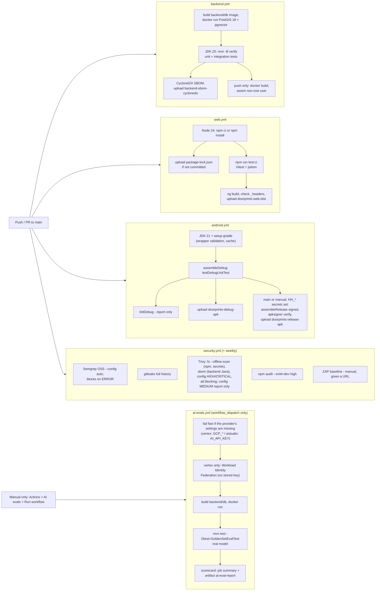

# 07: Secure build and deploy

| Field | Value |
|---|---|
| Document | Secure build, CI/CD and deployment guide |
| Version | 0.10 |
| Date | 2026-09-22 |
| Author | Claude (Cowork) |
| Status | Draft |

## Change log

| Version | Date | Author | Change |
|---|---|---|---|
| 0.1 | 2026-09-22 | Claude (Cowork) | First version: pipeline design, branch protection, secrets, APK signing, free-tier deployment (Supabase/Neon + Render/Koyeb/Oracle + Cloudflare Pages), env vars. No workflows exist in the repo yet. |
| 0.2 | 2026-09-22 | Claude (Cowork) | Wave 2: the pipeline now exists (`backend.yml`, `web.yml`, `android.yml`, `security.yml`, `dependabot.yml`); section 1 describes the real workflows and the CodeQL decision. Hardened Dockerfile and dev compose, `web/public/_headers` in the repo, new environment variables (rate limits, size limits, clock skew, retention, forward headers). |
| 0.3 | 2026-09-22 | Claude (Cowork) | Fixes after the first CI runs: Trivy scans the backend from a CycloneDX SBOM (`trivy sbom`) and runs `trivy fs --offline-scan` (the pom.xml resolution hit Maven Central `429 Too Many Requests`), Trivy DB cached with `actions/cache`; backend.yml publishes the SBOM; `permissions: {}` at the top with per-job `contents: read`; only PR runs are cancelled by newer pushes; Dependabot tuned (Monday schedule, 5 open PRs, grouped minor/patch and security updates, framework majors ignored); gitleaks history note. |
| 0.4 | 2026-09-22 | Claude (Cowork) | Sprint 1 close-out and Sprint 2 ([10](10-sprint-log.md)): section 6.3 CSP note fixed (MapLibre GL 6 module worker from `/maplibre/`, `worker-src 'self'`, no `blob:`); reviewed `.gitleaksignore`; Tomcat 11.0.25 override (F-28) and the version-override rule; `trivy config` blocking on HIGH/CRITICAL (DS-0002 fixed, F-29); `web.yml` runs unit tests; `android.yml` signed release job with `HH_*` secrets (F-11); `APP_API_KEY` minimum 32 and `APP_API_KEY_NEXT` implemented (F-01, SEC-017); compileSdk 37; CI results per sprint; `ai-evals.yml` (manual golden-set eval against a real model) in the section 1 table, diagram and secrets table; section 6.2 note on the non-root DB image (uid 999) and host bind-mount ownership; first-push CI row marked as reconstructed from the `689927d` commit message. |
| 0.5 | 2026-09-22 | Claude (Cowork) | Sprint 3: section 1 `ai-evals.yml` row now says the run also fails when zero cases ran or on a harness error (seeding or reindex failure), with *Errors* and *Why FAIL* sections in the scorecard (fix for the false PASS of the first eval run, E-02 in [10](10-sprint-log.md)); TC-AI-10 reference points to 06 §8. Environment variable table (section 7) lists the new `AI_EMBEDDING_*` settings. |
| 0.6 | 2026-09-22 | Claude (Cowork) | Sprint 3 lead decision: the dev `docker-compose.yml` is owned by the Backend team and now passes every `AI_*` / `APP_AI_*` / `APP_MCP_*` setting to the `api` service. Section 7: the single "AI variables" row is replaced by one row per setting group with the `application.yml` defaults, and a new **Dev compose** column says which variables the dev stack passes; note that `compose.prod.yml` passes only the core variables. |
| 0.7 | 2026-09-22 | Claude (Cowork), Docs team | Product rename to **Doorprints** ([03](03-design.md) ADR-13): CI artifacts are now `doorprints-debug-apk`, `doorprints-release-apk` and `doorprints-web-dist` (pipeline diagram, workflow table, section 5, section 6.4); planned release files `doorprints-vX.Y.Z.apk`; `APP_CORS_ORIGINS` example `https://doorprints.pages.dev`. Kept on purpose: the `HH_*` secrets, the CI keystore file `house-hunt-release.jks`, the image names `house-hunt-api` / `house-hunt-db` and the `househunt` database, user and role names. Section 5 notes that the new `applicationId` `app.doorprints` does not upgrade pre-rename builds. |
| 0.8 | 2026-09-22 | Claude (Cowork), Docs team | Product-owner decisions of 2026-09-22: the repository is renamed to **`Sriram-Codes-SW/doorprints`** and is **public** with an MIT `LICENSE` and `SECURITY.md` (private vulnerability reporting). Section 3 rewritten: the ruleset on `main` blocks deletion and force pushes; **required status checks are deliberately not enabled yet**, because the workflows have path filters and a required check that never runs blocks a PR; they will be enabled once a PR flow exists with an always-running **CI summary** check (3.1). Public-repository rules (3.2): logs and artifacts are public. **CodeQL** is now free (public repository) and is a **Sprint 4a candidate** (section 1). Section 7: new cloud AI access and cost-cap settings (planned, [11](11-feature-parity-and-export-spec.md) 5.13) and a pointer to [ai/vertex-setup.md](ai/vertex-setup.md) for the Vertex AI settings; section 6.5: time-limited staging on Google Cloud (trial credit). |
| 0.9 | 2026-09-22 | Claude (Cowork), Docs team | Review fixes. Section 4: new row for the **Vertex AI / Google Cloud credential** ([02](02-threat-model.md) T-I22): AI-only project, service account with `roles/aiplatform.user` only, no JSON key in repository, image, artifacts or logs, Workload Identity Federation (GitHub OIDC) for CI, quarterly rotation; exact variable names left to the AI team's `ai/vertex-setup.md` (being written). Section 6.5: spend cap budgets do not cover Cloud SQL, so staging needs its own budget alert and a fixed tear-down date. |
| 0.10 | 2026-09-22 | Claude (Cowork), Docs team | Vertex AI code and [ai/vertex-setup.md](ai/vertex-setup.md) landed in the same change set, so the "being written" markers are gone. Section 4: the Vertex AI row names the real settings (GitHub secrets `GCP_WIF_PROVIDER`, `GCP_SA_EMAIL`; GitHub variables `GCP_PROJECT_ID`, `GCP_LOCATION`, optional `AI_VERTEX_EMBEDDING_LOCATION`; `GOOGLE_APPLICATION_CREDENTIALS` for ADC) and splits rotation by credential type: Workload Identity Federation and the Cloud Run service account have no long-lived secret to rotate; only a JSON key on a non-Google host is rotated quarterly (the old "delete the old key" rule applies to that case only). The code supports ADC only, no Vertex API key. `ai-evals.yml` row: `provider` input (default `aistudio`; `vertex` chosen by hand after [ai/vertex-setup.md](ai/vertex-setup.md) steps 1-8; the default moves to `vertex` only after the step-10 run; corrected in review, an earlier draft said the default was `vertex`) and the quota stop. Section 7: new rows `AI_PROVIDER`, `GCP_PROJECT_ID`, `GCP_LOCATION`, `AI_VERTEX_EMBEDDING_LOCATION`, `AI_VERTEX_ENDPOINT`, `AI_VERTEX_API_VERSION`, `AI_INDEX_ON_CHANGE`, `GOOGLE_APPLICATION_CREDENTIALS`. |

Related: [Threat model](02-threat-model.md) · [Test plan](06-test-plan.md) · [Runbook](08-operations-runbook.md) · [AI docs](ai/)

---

## 1. Pipeline overview

The workflows live in `.github/workflows/` (F-22 fixed). `backend.yml`, `web.yml`, `android.yml` and `security.yml` run on push and pull request to `main` and on manual dispatch; the security workflow also runs weekly. `ai-evals.yml` is the exception: it is manual only (`workflow_dispatch`) and never runs on push or PR.

| Run | Backend | Web | Android | Security |
|---|---|---|---|---|
| First push `4b034d3` (Sprint 1)¹ | Failed (test compile error) | Build passed; `npm audit` found F-27 | Failed (compileSdk) | Trivy fs hit Maven Central `429`; gitleaks flagged test keys |
| Commit `689927d` (end of Sprint 1) | Passed | Passed | Passed (`assembleDebug`, unit tests) | Failed only on Trivy: tomcat-embed-core 11.0.24 (F-28) and DS-0002 in `backend/db/Dockerfile` (F-29) |
| Sprint 2 | To be confirmed by the first CI run after merge: F-28 and F-29 fixed, new web unit tests, signed release job, dual-key tests (see [10](10-sprint-log.md)) | | | |

¹ Reconstructed from the `689927d` commit message ("Fix first CI run: test compile error, ... compileSdk 37, ..."); the CI logs of the first push were not reviewed.



`ai-evals.yml` is drawn apart from the push/PR flow on purpose: nothing triggers it except a person pressing Run workflow.

| Workflow | Trigger | What it does | Blocking gates |
|---|---|---|---|
| `backend.yml` | push/PR touching `backend/**`, manual | Builds `backend/db` (service containers cannot be built, so it is `docker run` by hand), waits for TCP readiness, runs `mvn -B -ntp verify` on Temurin 25 with `DB_URL` etc., then generates a CycloneDX JSON SBOM (`cyclonedx-maven-plugin:2.9.3:makeAggregateBom`, runtime scopes) and uploads it as `backend-sbom-cyclonedx`; on push also builds the API image and checks it does not run as root | Tests pass; image user ≠ root |
| `web.yml` | push/PR touching `web/**`, manual | Node 24, `npm ci` if `package-lock.json` exists else `npm install` (and uploads the generated lock file as artifact `web-package-lock` so it can be committed), **`npm run test:ci`** (`ng test --watch=false`: Vitest through `@angular/build:unit-test`, jsdom, no browser), `npm run build`, checks `_headers`/`_redirects` are in the output, uploads `doorprints-web-dist` | Unit tests and build pass |
| `android.yml` | push/PR touching `android/**`, manual | Temurin 21, `gradle/actions/setup-gradle@v6` (validates the wrapper JAR), `./gradlew assembleDebug testDebugUnitTest` (compileSdk 37), `lintDebug` (report only), uploads **`doorprints-debug-apk`** and reports. Not on PRs: job `release-signing-check` looks for the four `HH_*` secrets (a job-level `if` cannot read secrets); when present, job `release` builds a **signed** `assembleRelease` and uploads `doorprints-release-apk` (section 5) | Build + unit tests pass; release: `apksigner verify` passes |
| `security.yml` | push/PR, weekly (Mon 04:17 UTC), manual | Semgrep (container `semgrep/semgrep:1.177.0`), gitleaks (`ghcr.io/gitleaks/gitleaks:v8.30.1`, full history), Trivy (`aquasec/trivy:0.74.0`, see below), `npm audit --audit-level=high --omit=dev` (dev-only tooling such as the Angular CLI is not shipped, so its advisories do not block), optional ZAP baseline against a URL given at dispatch | No Semgrep ERROR, no gitleaks hit, no unfixed Critical/High from Trivy (dependencies and Dockerfiles), no high npm advisory |
| `ai-evals.yml` | **Manual only** (`workflow_dispatch`), never on push or PR (it spends provider quota or credit and model answers are not deterministic). Inputs: `provider` (choice, default **`aistudio`**; choose `vertex` after [ai/vertex-setup.md](ai/vertex-setup.md) steps 1-8, which needs the secrets `GCP_WIF_PROVIDER`, `GCP_SA_EMAIL` and the variable `GCP_PROJECT_ID`; the default moves to `vertex` only after the owner's step-10 run, vertex-setup step 10 item 6), `types` (choice, default `extract,ask,plan`), `delay_ms` (pause between cases, default `4000`, validated as a whole number), `chat_model` and `embedding_model` (optional model overrides, validated as lower-case names; empty keeps the `application.yml` default) | Top-level `permissions: {}`, job-level `contents: read` and `id-token: write` (only used by the Workload Identity Federation step when `provider=vertex`); one run at a time (`concurrency: ai-evals`, never cancelled). Fails fast when the chosen provider's settings are missing: `vertex` needs the secrets `GCP_WIF_PROVIDER`, `GCP_SA_EMAIL` and the variable `GCP_PROJECT_ID` (section 4), `aistudio` needs the `AI_API_KEY` secret; `AI_API_KEY` is passed to the tests only on the `aistudio` path. With `vertex`, `google-github-actions/auth` exchanges the GitHub OIDC token for short-lived Google credentials (no stored key). Builds `backend/db` and runs it with `docker run`, then `mvn -B -ntp test -Dtest=GoldenSetEvalTest` on Temurin 25 with `APP_AI_ENABLED=true` against the golden set ([ai/evals/golden-set.json](ai/evals/golden-set.json)). Always publishes `backend/target/ai-eval-report.md` to the job summary and as artifact **`ai-eval-report`** (kept 30 days); on failure also uploads `ai-eval-test-reports` (7 days) | Not a merge gate. The run fails when no golden-set case ran (0 cases, including no case matching `types`), on any harness error (seeding the fixtures or `POST /api/ai/reindex` failed; listed under *Errors* in the scorecard) or when a metric misses the golden set's thresholds; the scorecard's *Why FAIL* section lists the reasons. When the provider's quota is exhausted (HTTP 429 / `RESOURCE_EXHAUSTED`, one wait of `Retry-After` did not help) the harness stops, the scorecard says **STOPPED: provider quota exhausted** and a separate step fails the job with an error annotation. A person reviews the scorecard (TC-AI-10, [06](06-test-plan.md) §8) |
| `deploy.yml`, `release.yml`, `backup.yml` | – | **Not built yet** (see sections 5, 6 and 08 §3) | – |

Conventions used in every workflow:

| Control | How |
|---|---|
| Least privilege | Top-level `permissions: {}` (no token scopes by default); every job declares `permissions: contents: read` and nothing more; no job writes to the repository; no `pull_request_target` |
| Pinning | GitHub-owned actions by major version tag (`actions/checkout@v7`, `setup-java@v6`, `setup-node@v7`, `upload-artifact@v7`, `gradle/actions/setup-gradle@v6`, latest majors on 2026-09-22); the one third-party action (ZAP) by full commit SHA; scanners run as version-pinned container images instead of third-party actions with mutable tags (tag hijacking, T-T5); pin the images by digest once the first run has confirmed the tags |
| Credentials | `actions/checkout` with `persist-credentials: false` |
| Concurrency | One run per workflow and ref; on pull requests a newer push cancels the older run (`cancel-in-progress: ${{ github.event_name == 'pull_request' }}`); runs on `main` (push, weekly scan) always finish |
| Timeouts | Every job sets `timeout-minutes` (10 to 40) so a hung step cannot burn the free Actions minutes |
| Caching | Maven (`setup-java cache: maven`), Gradle (`setup-gradle`, read-only on branches), Trivy DB (`actions/cache@v6` on `~/.cache/trivy`, daily key), npm once the lock file is committed |
| Artifacts | APK 30 days, backend SBOM 30 days, web dist 14 days, reports 7 days |

**Why no CodeQL.** On a private repository, GitHub code scanning (CodeQL analysis results and SARIF upload to the Security tab) needs a paid GitHub Advanced Security / Code Security licence, which breaks CON-01 (zero cost). Semgrep OSS covers SAST instead and its SARIF is kept as an artifact. **Update 2026-09-22:** the repository is now public, so CodeQL (default or advanced setup) and SARIF upload to the Security tab are free. Adding CodeQL for Java/Kotlin and JavaScript/TypeScript (and uploading the Semgrep SARIF) is a **Sprint 4a candidate** (C-22 in [10](10-sprint-log.md) §8); Kotlin with AGP 9 built-in Kotlin needs a manual build step in advanced setup, to be checked in the story. Until then Semgrep OSS stays the SAST gate.

**Trivy** (job `trivy` in `security.yml`). The first run failed with `remote Maven repository returned 429 Too Many Requests` for `spring-batch-bom-6.0.5.pom`: `trivy fs` resolves every parent POM and imported BOM of `backend/pom.xml` from Maven Central on each run. The job now:

| Step | What | Blocking |
|---|---|---|
| SBOM | `setup-java` (Maven cache) + `mvn org.cyclonedx:cyclonedx-maven-plugin:2.9.3:makeAggregateBom -DoutputFormat=json -DoutputName=bom -DincludeTestScope=false`. Maven resolves the tree (from the cache when warm); Trivy reads CycloneDX **JSON** only, not XML | – |
| DB cache | `actions/cache` on `~/.cache/trivy` (daily key, restore from the latest); the default `--db-repository` already prefers `mirror.gcr.io` over `ghcr.io` | – |
| `trivy fs --offline-scan` | npm lock file vulnerabilities and secrets in the whole repo (skips `docs`, `backend/target`, `backend/pom.xml`); `--offline-scan` means Trivy never fetches POMs remotely | Yes, High/Critical with a fix |
| `trivy sbom` | Backend Java dependencies from `backend/target/bom.json`; runs even if the fs step failed | Yes, High/Critical with a fix |
| `trivy config` (HIGH/CRITICAL) | `backend/Dockerfile`, `backend/db/Dockerfile` and compose (skips `docs`) | **Yes** since Sprint 2. DS-0002 ("Specify at least 1 USER command") in `backend/db/Dockerfile` was fixed at the source with `USER postgres` (F-29), not with a `.trivyignore` entry |
| `trivy config` (MEDIUM) | Same files | No (report only, so MEDIUM findings stay visible) |

The containers run as the runner's user (`--user $(id -u):$(id -g)`) with `--cache-dir /cache`, so `actions/cache` can save the DB. The SBOM is also uploaded (`backend-sbom-cyclonedx`). Known gap: Trivy only covers Gradle with a `gradle.lockfile`; the Android dependencies are covered by Dependabot and Gradle dependency locking can be added later.

**Version overrides for security fixes.** When Trivy reports a Critical/High in a library whose version the Spring Boot BOM manages, and Boot has not shipped a patch yet, override only that version property in `backend/pom.xml` with a comment naming the CVEs and when to remove it. Sprint 2: `<tomcat.version>11.0.25</tomcat.version>` for tomcat-embed-core 11.0.24 CVE-2026-65182, CVE-2026-65905 and CVE-2026-68525 (F-28). Remove the property when the Spring Boot parent manages 11.0.25 or later (Dependabot's grouped Boot patch PR is the trigger to check). Never override across a major or minor line without the framework's support.

**gitleaks** scans the whole git history (`fetch-depth: 0`). The test API keys it flagged in the first commit (`4b034d3`) were throwaway values; the tests now generate their keys at runtime (`"it-" + UUID.randomUUID()`), so nothing key-like is in the current tree. Because the old commit stays in history, the two findings are listed by exact fingerprint (`<commit>:<file>:<rule>:<line>`) in a reviewed, commented `.gitleaksignore` (reviewed 2026-09-22). No `.gitleaks.toml` allowlist and no path-wide rule: any new key in the same file would still fail the scan. Every new entry needs a review note with a date; real secrets are rotated (08 §5), never ignored.

**Dependabot** (`.github/dependabot.yml`). The first push opened many PRs at once, so it is tuned:

| Setting | Value |
|---|---|
| Ecosystems | Maven (`/backend`), npm (`/web`), Gradle (`/android`), GitHub Actions (`/`), Docker (`/backend`, `/backend/db`) |
| Schedule | Weekly, Monday 06:00 Asia/Kolkata |
| Open PRs | `open-pull-requests-limit: 5` per ecosystem |
| Groups | One PR for all minor + patch version updates per ecosystem; security updates grouped separately; all Actions bumps in one PR |
| Ignored | Major bumps of the pinned frameworks: Spring Boot (`org.springframework.boot:*`), Angular (`@angular/*`, `@angular-devkit/*`; TypeScript minor/major, which follow Angular), AGP (`com.android.application`, `com.android.tools.build:*`), Kotlin (`org.jetbrains.kotlin*`, and KSP which follows Kotlin), Docker base image majors (JDK 25, PostgreSQL 18). These upgrades are planned and done by hand (`ng update`, Spring Boot migration guide, AGP upgrade assistant). |

OWASP Dependency-Check is not used: its NVD download is slow and needs an API key; Trivy covers the same Maven/npm ecosystems from the GitHub Advisory database.

## 2. Supply chain rules

| Rule | Why |
|---|---|
| Pin third-party Actions to full commit SHAs. Let Dependabot bump them. | Tag hijack (T-T5) |
| Commit lock files: `web/package-lock.json` (still missing: download the `web-package-lock` artifact from the first `web.yml` run and commit it), Gradle wrapper + optional dependency verification (`gradle/verification-metadata.xml`), Maven versions pinned by the Spring Boot BOM | Reproducible builds |
| `gradle/actions/setup-gradle` validates `gradle-wrapper.jar` | Wrapper tampering |
| Keep dependencies minimal (ADR-06, ADR-12) | Smaller attack surface |
| Build images from official `eclipse-temurin`/`maven` images and rebuild weekly for OS patches | Base image CVEs |
| Record the image digest in the release notes. Deploy by digest. | Integrity |

## 3. Repository and branch protection

The repository is **`Sriram-Codes-SW/doorprints`** (renamed from `house-hunt` on 2026-09-22; GitHub redirects the old
URL) and is **public** with an MIT `LICENSE` and a `SECURITY.md` that points to GitHub's **private vulnerability
reporting** (Security → Report a vulnerability).

| Setting | Value |
|---|---|
| Default branch | `main`, protected by a **ruleset**: **block deletion** and **block force pushes** (active since 2026-09-22). Rulesets are enforced on GitHub Free because the repository is public. |
| Required status checks | **Deliberately not enabled yet** (product-owner decision 2026-09-22). The workflows use path filters (for example `backend.yml` runs only for `backend/**`), so a required check such as `backend` would never report on a docs-only PR and the PR could not merge. They are enabled together with a PR flow (3.1). |
| Require PR, linear history, conversation resolution | Planned with the PR flow (3.1). Today the owner pushes to `main` directly. |
| Reviews | Solo developer: allow self-merge, but keep required checks once they exist. |
| Workflows | Top-level `permissions: {}`, per job `contents: read`. Grant `contents: write` / `packages: write` only in `release.yml`. **Never** use `pull_request_target` with a checkout of PR code (fork PRs on a public repository must not see secrets). Don't interpolate `${{ github.event.* }}` text into `run:`. Pass it through `env:`. |
| Fork PR workflows | Settings → Actions → General → "Approval for running fork pull request workflows from contributors": require approval for all external contributors, so an outside PR cannot run workflows before review. |
| Secret scanning | Enable GitHub secret scanning + push protection (free for public repos). gitleaks in CI either way. |
| Private vulnerability reporting | Enabled; `SECURITY.md` asks reporters not to open public issues. Triage in [08](08-operations-runbook.md) §7 IR-8. |
| Environments | `production` (deploy hook, DB URL for backups) and `release` (keystore). Restricted to `main`/tags. |
| CODEOWNERS | `docs/05-*` for design, `docs/ai/` for the AI team, `backend/src/main/resources/db/migration/` needs careful review |

### 3.1 Future: always-running "CI summary" check

When the PR flow starts (candidate C-23 in [10](10-sprint-log.md) §8), add one job named **`CI summary`** that runs on **every**
pull request (no path filter), waits for or inspects the other workflows for the head commit, and fails if any
triggered workflow failed; a workflow skipped by its path filter counts as passed. Only `CI summary` then becomes the
required status check (together with "require a pull request" and linear history). This avoids both the stuck-PR
problem of path-filtered required checks and running every workflow on every change. Until then, check the Actions
tab after each push and fix a red run before the next change.

### 3.2 Rules that follow from a public repository

| Rule | Why |
|---|---|
| Everything in git history, workflow logs and Actions artifacts is public. Never commit or print secrets or personal data; DB dumps may be artifacts only when encrypted with `age` ([08](08-operations-runbook.md) §3) | [02](02-threat-model.md) T-I11, T-I21 |
| Eval fixtures and scorecards use synthetic data only | T-I20, T-I21 |
| Real user data never goes to the free AI Studio tier; the free key is for evals with synthetic data | [01](01-requirements.md) PRV-022 |
| Security reports go through private vulnerability reporting, not public issues | `SECURITY.md` |
| GitHub Actions minutes are free and unlimited for public repositories on standard runners (CON-04) | Cost |

## 4. Secrets handling

| Secret | Where it lives | Used by | Rotation |
|---|---|---|---|
| `APP_API_KEY` | Host secret store (Render/Koyeb env var marked secret, or VM `.env` with mode 600). Password manager. | API, clients | On suspicion / every 6 months (08 section 5.1) |
| `DB_URL`, `DB_USER`, `DB_PASSWORD` | Host secret store | API | Provider reset + redeploy |
| `BACKUP_DB_URL` | GitHub `production` environment secret (read-only DB role) | `backup.yml` | Yearly |
| `BACKUP_AGE_RECIPIENT` | GitHub variable (public key, not secret). The private key is **offline** in the password manager. | `backup.yml` | Yearly |
| `RENDER_DEPLOY_HOOK_URL` / `VM_SSH_KEY` | `production` environment secret | `deploy.yml` | Yearly / on staff change |
| `APP_API_KEY_NEXT` | Same place as `APP_API_KEY`, only during a rotation; empty otherwise | API | Promoted to `APP_API_KEY` at the end of each rotation (08 §5.1) |
| `HH_KEYSTORE_BASE64`, `HH_KEYSTORE_PASSWORD`, `HH_KEY_ALIAS`, `HH_KEY_PASSWORD` | Repository secrets today; the repo is public since 2026-09-22, so environment protection is free: move them to a `release` environment restricted to `main`. The master keystore copy is offline. | `android.yml` job `release` (never on PRs) | Never for the key (key loss = no in-place updates). Passwords rotate yearly. |
| ~~`NVD_API_KEY`~~ | Not needed: OWASP Dependency-Check is not used (section 1) | – | – |
| LLM provider key `AI_API_KEY` (only with `AI_PROVIDER=aistudio`, the default) | Host secret store ([ai/](ai/) §11). For the manual AI eval run with `provider=aistudio` (TC-AI-10, `ai-evals.yml` (manual, workflow_dispatch)) a separate free-tier key as a repository secret, never exposed to PR runs, used **only with the synthetic golden set** ([01](01-requirements.md) PRV-022). The production key must be a **paid** Gemini API key or Vertex AI credentials with a hard cap (AI-015); Vertex AI: see the next row. | AI module, AI evals | On suspicion / quarterly |
| **Vertex AI / Google Cloud credential** (Application Default Credentials only; the code has no Vertex API key path). GitHub **secrets** `GCP_WIF_PROVIDER` (full Workload Identity provider name) and `GCP_SA_EMAIL` (service-account e-mail); GitHub **variables** `GCP_PROJECT_ID`, `GCP_LOCATION` and, only if needed, `AI_VERTEX_EMBEDDING_LOCATION` (identifiers, not credentials; `ai-evals.yml` also accepts the first two as secrets). On the host: `AI_PROVIDER=vertex`, `GCP_PROJECT_ID`, `GCP_LOCATION`, and `GOOGLE_APPLICATION_CREDENTIALS` only where a credential file is needed. Setup: [ai/vertex-setup.md](ai/vertex-setup.md) | Linked to a billing account, so treat it like a payment secret ([02](02-threat-model.md) T-I22). A **dedicated Google Cloud project for AI only**; a service account with **only** `roles/aiplatform.user` (never Owner or Editor). **CI** (`ai-evals.yml`, `provider=vertex`): **Workload Identity Federation with GitHub OIDC** through `google-github-actions/auth` (`id-token: write` on that job only, provider attribute condition `assertion.repository == 'Sriram-Codes-SW/doorprints'`); the action writes a short-lived credential file in the workspace and sets `GOOGLE_APPLICATION_CREDENTIALS`; no key is stored. **Cloud Run**: the service runs as the service account and gets tokens from the metadata server; no key, no `GOOGLE_APPLICATION_CREDENTIALS`. **Local**: `gcloud auth application-default login` (the developer's own account). **Non-Google host** (Render, Koyeb, a VM), only if Vertex AI is used there: a service-account JSON key as a mode-600 secret file outside the image, named by `GOOGLE_APPLICATION_CREDENTIALS`. **Never** in the repository, the Docker image, build args, CI artifacts or logs. Blast-radius limit: the spend cap budget on the AI project ([08](08-operations-runbook.md) §10.2). | AI module (production), AI evals | WIF and Cloud Run: nothing to rotate (tokens live about an hour); on suspicion remove the principal binding or disable the service account (IR-2, IR-9). JSON key on a non-Google host only: quarterly and at once on suspicion; create the new key, switch, then delete the old key. Local ADC: `gcloud auth application-default revoke` when a machine is lost. |
| GitHub PAT | **Avoid**: use `GITHUB_TOKEN`. If you need one, use a fine-grained PAT, a single repo, minimal scopes, expiry ≤ 90 days. | Local tooling only | At expiry, **and immediately if it was ever pasted into chat, logs or a file** |

Rules: never commit keys (`.gitignore` already covers `.env`, `*.keystore`, `*.jks`, `local.properties`); never put secrets in Docker build args or the APK; never echo secrets in workflow logs; generate keys with `openssl rand -base64 32`; the `docker-compose.yml` defaults are **dev-only** (F-17).

## 5. Android release signing

| Step | Command / note |
|---|---|
| Create the keystore once, offline | `keytool -genkeypair -v -keystore house-hunt-release.jks -alias househunt -keyalg RSA -keysize 4096 -validity 10000` |
| Back up | The keystore + passwords go to the password manager and one offline encrypted copy. **If lost**, updates must be signed with a new key, which forces an uninstall and **wipes local unsynced data**. |
| Gradle config (done, Sprint 2) | `app/build.gradle.kts` reads `HH_KEYSTORE_FILE`, `HH_KEYSTORE_PASSWORD`, `HH_KEY_ALIAS`, `HH_KEY_PASSWORD` from Gradle properties (`-P…` or `~/.gradle/gradle.properties`, never the repo) or environment variables of the same names. `signingConfigs.release` is created only when all four are set; otherwise `assembleRelease` still works but produces an unsigned APK. |
| R8 | `isMinifyEnabled = false` **on purpose** for now: kotlinx.serialization, Room (KSP), MapLibre (JNI) and WorkManager need keep rules that are not written or tested, and there are no instrumented tests to catch a stripped class. Turn on `isMinifyEnabled`/`isShrinkResources` together with `proguard-rules.pro` and a release smoke test (F-11 stays Part until then). |
| Network security | Remove `usesCleartextTraffic="true"`. Add `network_security_config.xml` allowing cleartext only to `10.0.2.2` and `localhost` in `src/debug/` (F-02). |
| Backup | `android:allowBackup="false"` or `dataExtractionRules` excluding `database/`, `file/photos/`, `datastore/` (F-03) |
| Build in CI (done, Sprint 2) | `android.yml`: `release-signing-check` (no permissions) outputs whether all four secrets exist; `release` (needs `build`, `contents: read`) decodes `HH_KEYSTORE_BASE64` with `umask 077` to `$RUNNER_TEMP/house-hunt-release.jks`, runs `./gradlew assembleRelease` with `HH_KEYSTORE_FILE` pointing there, verifies, deletes the file in `always()` and uploads `doorprints-release-apk` (30 days; the artifact was `house-hunt-release-apk` before the Doorprints rename, the keystore file name was kept). Runs only on push to `main` and manual dispatch, never for pull requests, so PR code never runs with the key. To encode the keystore: `base64 -w0 house-hunt-release.jks`. |
| Verify | CI runs `apksigner verify --print-certs` (latest installed build-tools) on `app-release.apk`. Compare the SHA-256 cert fingerprint in the log with the one published in the README. |
| Publish (planned, `release.yml`) | GitHub Release: `doorprints-vX.Y.Z.apk` + `doorprints-vX.Y.Z.apk.sha256`. Notes list the image digest, schema migrations and security fixes (see [CHANGELOG](../CHANGELOG.md)). Until then, download `doorprints-release-apk` from the Actions run. Since the Doorprints rename the `applicationId` is `app.doorprints`; builds made before it (`com.househunt.app`) are a different app to Android and are not upgraded: sync them, then uninstall them (03 ADR-13). |
| Install | The user checks the SHA-256, allows "Install unknown apps" for the browser/file manager once, and turns it off afterwards |

## 6. Free-tier deployment

Check the current free-tier terms before relying on them. Provider limits change.

### 6.1 Database: Supabase or Neon

| Step | Supabase | Neon |
|---|---|---|
| Create | New project, region **ap-south-1 (Mumbai)** (PRV-010), strong generated DB password | New project, nearest region |
| Extensions | Enable `postgis` (and later `vector`) under Database → Extensions. Flyway's `CREATE EXTENSION IF NOT EXISTS postgis` then does nothing. | `CREATE EXTENSION postgis;` works for the owner role |
| Connection for the API | Use the **Session pooler** connection string (IPv4, port 5432). The direct host is IPv6-only on free, and the transaction pooler (6543) breaks JDBC prepared statements. `DB_URL=jdbc:postgresql://aws-0-ap-south-1.pooler.supabase.com:5432/postgres?sslmode=require` | Use the **direct (non-pooled)** endpoint so Flyway works. `?sslmode=require`. Expect about 1 s wake-up after scale-to-zero. |
| Least privilege (SEC-019) | Create a `househunt_app` role that owns a `househunt` schema. Use it for the API. Keep `postgres` for admin only. Create a read-only `househunt_backup` role for backups. | Same |
| Inactivity | Free projects pause after about 1 week idle, so keep-alive via `keepalive.yml` (08) | Scale-to-zero, no pause |

### 6.2 API

**Option A: Render (or Koyeb)**, simplest:

1. New Web Service → connect the repo → Runtime **Docker**, root directory `backend`, instance type **Free**.
2. Env vars: section 7. Render provides `PORT`. The app reads it.
3. Health check path `/actuator/health`. Auto-deploy off. Deploy via the deploy hook from `deploy.yml` after CI passes.
4. Custom domain (optional) through Cloudflare DNS (proxied), so you can add a free WAF rate-limit rule (SEC-008).
5. Expect a cold start of 30 to 60 s after about 15 min idle (NFR-002).

**Option B: Oracle Cloud Always Free VM** (always on, you own the patching):

1. Ampere A1 VM, Ubuntu LTS, SSH key login only, `unattended-upgrades`, `ufw` allow 22 (your IP if possible), 80 and 443. Also open 80/443 in the OCI security list.
2. Install Docker. Use a **prod** compose file (not the dev `docker-compose.yml`, see F-17 / T-E5):

```yaml
# compose.prod.yml (keep on the VM, not in git with values)
services:
  api:
    image: ghcr.io/<owner>/house-hunt-api@sha256:<digest>
    environment:
      DB_URL: ${DB_URL:?required}
      DB_USER: ${DB_USER:?required}
      DB_PASSWORD: ${DB_PASSWORD:?required}
      APP_API_KEY: ${APP_API_KEY:?required}
      APP_API_KEY_NEXT: ${APP_API_KEY_NEXT:-}   # only during a key rotation (08 §5.1)
      APP_CORS_ORIGINS: ${APP_CORS_ORIGINS:?required}
    restart: unless-stopped
    read_only: true
    tmpfs: [/tmp]
    # no "ports:" - only Caddy is exposed
  caddy:
    image: caddy:2
    ports: ["80:80", "443:443"]
    volumes: ["./Caddyfile:/etc/caddy/Caddyfile:ro", "caddy_data:/data"]
    restart: unless-stopped
volumes: { caddy_data: {} }
```

`Caddyfile`: `api.<your-domain> { reverse_proxy api:8080 }`. Caddy gets and renews Let's Encrypt certs automatically. A free DuckDNS subdomain works if you have no domain. If you self-host PostGIS on the VM instead of a managed DB, bind it to the internal network only (no `ports:`) and add the backup job.

**Dockerfile hardening** (F-23, done): the runtime stage creates user `app` (UID 10001) and runs as `USER 10001:10001`, adds `-XX:+ExitOnOutOfMemoryError` and a `HEALTHCHECK` that probes `/actuator/health` with bash's `/dev/tcp` (the JRE image has no curl or wget).

**Dev compose** (F-17, done): `docker-compose.yml` binds Postgres and the API to `127.0.0.1` only, refuses to start without `APP_API_KEY`, waits for a healthy database, and runs the API read-only with `cap_drop: ALL` and `no-new-privileges`. It is still for development only; on a VM use the prod file above.

**Dev/CI database image runs as `postgres`, uid 999** (F-29, Sprint 2): `backend/db/Dockerfile` ends with `USER postgres`, so the official entrypoint starts without root and **cannot `chown` the data directory**. The default `docker-compose.yml` uses the named volume `dbdata18` mounted at `/var/lib/postgresql`; a fresh named or anonymous volume inherits the image's ownership and just works. If you replace it with a **host bind mount** (for example `./pgdata:/var/lib/postgresql`), or reuse a volume first initialised by another uid, the directory must be owned by uid 999 before the first start, otherwise the container exits during startup with a permission error (`initdb` or the entrypoint cannot create or write `/var/lib/postgresql/18/docker`, or Postgres refuses a data directory with the wrong owner). Fix: `sudo chown -R 999:999 ./pgdata` (on the host), or go back to the named volume. Do not work around it with `user: root` in compose, which undoes F-29. The same applies if you self-host this image on a VM (section 6.2). Troubleshooting entry: [08 §9](08-operations-runbook.md#9-troubleshooting).

### 6.3 Web: Cloudflare Pages (or Netlify)

1. Pages → connect the repo, root `web`, build command `npm run build`, output `dist/web/browser`, env `NODE_VERSION=24`.
2. `public/_redirects` handles the SPA fallback and **`public/_headers`** (in the repo, F-10 fixed) sets the CSP, HSTS, `nosniff`, `X-Frame-Options`, `Referrer-Policy: strict-origin-when-cross-origin` (Nominatim needs a referrer), `Permissions-Policy`, COOP and long caching for hashed bundles. `connect-src` allows `https:` because the API address is typed by the user at runtime; `worker-src 'self'`: MapLibre GL 6 loads its ES-module worker from `/maplibre/maplibre-gl-worker.mjs` (copied with `maplibre-gl-shared.mjs` by `angular.json` assets, set with `setWorkerUrl` in `shared/map-style.ts`), so the `blob:` worker source that MapLibre 5 needed is gone (F-27); `angular.json` sets `inlineCritical: false` so `script-src 'self'` holds (no inline `onload` handler). GitHub Pages cannot send headers, so prefer Cloudflare Pages or Netlify.

3. Set `APP_CORS_ORIGINS=https://<project>.pages.dev` (plus a custom domain if you use one) on the API and redeploy.
4. Open the site → Connect → enter the `https://` API URL + key.

### 6.4 Android client

Install the APK (section 5): the signed `doorprints-release-apk` artifact of `android.yml` once the `HH_*` secrets are set, otherwise the debug APK from `doorprints-debug-apk`. A signed release cannot be installed over a debug build (different signer): sync, uninstall, then install. Settings → server URL `https://…` (the app rejects `http://` except for localhost and the emulator), paste the key, then Save and test, then Sync now.

### 6.5 Staging on Google Cloud (trial credit, time-limited)

From Sprint 4 the owner may run a **staging** backend on **Cloud Run** with **Cloud SQL for PostgreSQL** (PostGIS and
pgvector are supported extensions there) for up to the 90 days of the Google Cloud free trial, paid from the trial
credit ([10](10-sprint-log.md) §8, C-27; [08](08-operations-runbook.md) §10.3). Rules: staging holds **synthetic data only**;
secrets in Secret Manager (or Cloud Run secret env vars), not in the image; the smallest Cloud SQL tier, stopped when
unused; a budget with alerts on the staging project. Google Cloud **spend cap budgets do not cover Cloud SQL**, so
nothing stops Cloud SQL charges automatically: write a fixed **tear-down date** (at the latest the trial end) in the
password manager entry and tear down by then (the trial does not charge automatically unless the billing
account is upgraded). Production stays on the free-tier hosts above (CON-01).

## 7. Environment variables

The **Dev compose** column says whether the local `docker-compose.yml` passes the variable to the `api` service. The file is owned by the Backend team (since Sprint 3, [10](10-sprint-log.md) §1) and passes every `AI_*`, `APP_AI_*` and `APP_MCP_*` setting from the host shell or a git-ignored `.env` file, with the same defaults as `application.yml`; its header comment has a Gemini and a local Ollama example. Variables marked *No* still work through `application.yml` defaults but cannot be changed in the dev stack without editing the compose file. `compose.prod.yml` (section 6.2) passes only the core variables: add the AI ones there if you turn AI on.

| Variable | Required | Default (in code) | Example / notes | Secret | Dev compose |
|---|---|---|---|---|---|
| `DB_URL` | Yes (prod) | `jdbc:postgresql://localhost:5432/househunt` | `jdbc:postgresql://<host>:5432/postgres?sslmode=require` | Yes (host info) | Yes (`jdbc:postgresql://db:5432/househunt`) |
| `DB_USER` | Yes (prod) | `househunt` (**dev only**) | `househunt_app` | Yes | Yes (`househunt`) |
| `DB_PASSWORD` | Yes (prod) | `househunt` (**dev only**) | Generated, 32+ chars | Yes | Yes (`${POSTGRES_PASSWORD:-househunt}`) |
| `DB_POOL_SIZE` | No | `5` | Keep ≤ 5 on free DBs | No | No (code default) |
| `APP_API_KEY` | **Yes** (startup fails if missing or shorter than **32** chars; since Sprint 2, was 16) | empty | `openssl rand -hex 32` (64 chars) | Yes | Yes, required (`:?`) |
| `APP_CORS_ORIGINS` | Yes for web | `http://localhost:4200` | `https://doorprints.pages.dev` (comma-separated) | No | Yes |
| `PORT` | No | `8080` | Set by Render/Koyeb | No | No (code default) |
| `JAVA_TOOL_OPTIONS` | No | Set in the Dockerfile: `-XX:MaxRAMPercentage=75 -XX:+UseSerialGC -Xss512k` | Keep for 512 MB hosts | No | No (Dockerfile default) |
| `FORWARD_HEADERS_STRATEGY` | No | `native` | Trust `X-Forwarded-*` from proxies Tomcat considers internal (private ranges): correct client address for rate limits and HTTPS detection for HSTS. Set `none` if the API is exposed directly. | No | No (code default) |
| `RATE_LIMIT_PER_MINUTE`, `RATE_LIMIT_BURST` | No | `600`, `300` | Per client address, all paths except health | No | No (code default) |
| `AUTH_FAILURES_PER_MINUTE`, `AUTH_FAILURE_BURST` | No | `10`, `10` | Wrong/missing keys per address before 429 | No | No (code default) |
| `MAX_JSON_BYTES` | No | `262144` | JSON body cap (413) | No | No (code default) |
| `MAX_PHOTOS_PER_HOUSE` | No | `20` | Keep equal to the Android `MAX_PHOTOS_PER_HOUSE` | No | No (code default) |
| `SYNC_MAX_CLOCK_SKEW_SECONDS`, `SYNC_MAX_FUTURE_DAYS` | No | `300`, `365` | Client clock clamp / reject (F-08) | No | No (code default) |
| `TOMBSTONE_RETENTION_DAYS` | No | `90` | Daily purge at 03:30 server time | No | No (code default) |
| `APP_API_KEY_NEXT` | No (SEC-017, Sprint 2) | empty (= no second key) | Second key accepted alongside `APP_API_KEY` during a rotation; ≥ 32 chars when set, blank means unset. Procedure: 08 §5.1 | Yes | Yes (empty) |
| `APP_AI_ENABLED`, `APP_MCP_ENABLED` | No, off by default (AI-001) | `false`, `false` | `true` turns on the AI endpoints / the MCP server ([ai/](ai/ai-design.md) §11) | No | Yes (`false`) |
| `AI_BASE_URL` | No | `https://generativelanguage.googleapis.com/v1beta/openai/` | Chat endpoint (OpenAI-compatible). Ollama in dev compose: `http://host.docker.internal:11434/v1` (compose maps `host.docker.internal` to `host-gateway`) | No | Yes |
| `AI_API_KEY` | Yes when `APP_AI_ENABLED=true` and `AI_PROVIDER=aistudio` (not used with `vertex`) | empty | Gemini API key (paid tier for real data, PRV-022; a free key only for synthetic evals); any non-empty value for Ollama | **Yes** | Yes (empty) |
| `AI_CHAT_MODEL`, `AI_TIMEOUT`, `AI_MAX_RETRIES` | No | `gemini-3.5-flash`, `60s`, `2` | Ollama: e.g. `qwen3:8b`, `180s` | No | Yes |
| `AI_EMBEDDING_PROVIDER` | No | `google-genai` | `google-genai` (native Gemini `batchEmbedContents`) or `openai` (`AI_BASE_URL` `/embeddings`; **needed for Ollama**); other values stop startup ([08](08-operations-runbook.md) §1.1) | No | Yes |
| `AI_EMBEDDING_MODEL`, `AI_EMBEDDING_DIMENSIONS` | No | `gemini-embedding-2`, `768` | Ollama: `nomic-embed-text`. Dimensions must stay `768` (`vector(768)` column) | No | Yes |
| `AI_EMBEDDING_BASE_URL` | No | `https://generativelanguage.googleapis.com/v1beta` | Only for `google-genai` | No | Yes |
| `AI_EMBEDDING_API_KEY` | No | `AI_API_KEY` | Only for `google-genai`, when embeddings use a different key. Dev compose passes `${AI_EMBEDDING_API_KEY:-${AI_API_KEY:-}}` so an unset value keeps the fallback | **Yes** | Yes |
| `AI_EMBEDDING_TASK_TYPE` | No | empty | Only with `gemini-embedding-001` (e.g. `RETRIEVAL_DOCUMENT`); `gemini-embedding-2` rejects task types | No | Yes |
| `AI_VECTOR_INIT_SCHEMA` | No | `false` | Flyway V2 creates the vector table; keep `false` | No | Yes |
| `AI_MAX_INPUT_CHARS`, `AI_MAX_QUESTION_CHARS`, `AI_MAX_OUTPUT_TOKENS` | No | `8000`, `1000`, `2048` | Input and output caps (AI-009) | No | Yes |
| `AI_RATE_LIMIT_PER_MINUTE`, `AI_RATE_LIMIT_BURST`, `MCP_RATE_LIMIT_PER_MINUTE` | No | `10`, `5`, `60` | Free-tier quota guards (AI-009) | No | Yes |
| `AI_RAG_TOP_K`, `AI_RAG_SIMILARITY_THRESHOLD` | No | `6`, `0.25` | RAG retrieval | No | Yes |
| `AI_AGENT_MAX_TOOL_CALLS`, `AI_AGENT_MAX_CALLS_PER_TOOL`, `AI_AGENT_MAX_STOPS` | No | `12`, `4`, `8` | Planner step limits | No | Yes |
| `AI_PROVIDER` | No | `aistudio` | `aistudio` = Gemini API key (`AI_API_KEY`, OpenAI-compatible chat, native embeddings); `vertex` = Google Cloud Vertex AI with Application Default Credentials ([ai/](ai/ai-design.md) §2.1, §3.3). Other values stop startup. `AI_CHAT_MODEL`, `AI_EMBEDDING_MODEL`, `AI_EMBEDDING_DIMENSIONS`, `AI_EMBEDDING_TASK_TYPE`, `AI_TIMEOUT` and `AI_MAX_RETRIES` apply to both | No | No (code default) |
| `GCP_PROJECT_ID` | Yes when `AI_PROVIDER=vertex` (startup fails without it) | empty | Project **id** of the AI-only project (not the number) | No | No |
| `GCP_LOCATION` | No | `asia-south1` | Vertex AI location for chat (and embeddings unless the next row is set); `global` has the widest model availability but no residency guarantee ([ai/vertex-setup.md](ai/vertex-setup.md) step 8) | No | No |
| `AI_VERTEX_EMBEDDING_LOCATION` | No | empty (= `GCP_LOCATION`) | Only if the embedding model is not offered in `GCP_LOCATION`, e.g. `global` or `us-central1` | No | No |
| `AI_VERTEX_ENDPOINT`, `AI_VERTEX_API_VERSION` | No | empty (derived: `https://<location>-aiplatform.googleapis.com`, `global` → `https://aiplatform.googleapis.com`), `v1beta1` | Base URL override (tests, Private Service Connect) and REST version (`v1` possible) | No | No |
| `AI_INDEX_ON_CHANGE` | No | `true` | `false` = saves are not embedded one by one; only `POST /api/ai/reindex` embeds (fewer provider calls; deletes still leave the index at once). The eval harness sets it to `false` | No | No |
| `GOOGLE_APPLICATION_CREDENTIALS` | Only for Vertex AI on a non-Google host (and in CI, where `google-github-actions/auth` sets it) | unset | Standard ADC variable: path to a credential file. Not needed on Cloud Run (metadata server) or after `gcloud auth application-default login` | The **file** it points to is secret (section 4) | No |

**Vertex AI and cloud AI access (2026-09-22).** Vertex AI is the second active provider next to the Gemini API (AI Studio), selected with `AI_PROVIDER` (rows above); the owner's step-by-step setup is [ai/vertex-setup.md](ai/vertex-setup.md) and the credential rules are in section 4. The planned cloud AI allowlist, per-user quota and global hard cap ([11](11-feature-parity-and-export-spec.md) 5.13, [01](01-requirements.md) AI-013, AI-015) will add settings in Sprint 5; this table gets them when the code lands.

### 7.1 Build-time variables (Android release signing, F-11)

Read by `android/app/build.gradle.kts` as Gradle properties or environment variables. All four must be set, otherwise the release build is unsigned.

| Variable | Where it comes from | Notes | Secret |
|---|---|---|---|
| `HH_KEYSTORE_FILE` | CI: `$RUNNER_TEMP/house-hunt-release.jks` (decoded from the `HH_KEYSTORE_BASE64` secret). Local: an absolute path outside the repo | `*.jks`/`*.keystore` are gitignored anyway | Path only |
| `HH_KEYSTORE_PASSWORD` | GitHub secret / local `~/.gradle/gradle.properties` | – | Yes |
| `HH_KEY_ALIAS` | GitHub secret / local | e.g. `househunt` (section 5) | Low |
| `HH_KEY_PASSWORD` | GitHub secret / local | – | Yes |
| `HH_KEYSTORE_BASE64` | GitHub secret only | `base64 -w0 house-hunt-release.jks`; used only by the CI decode step | Yes |

## 8. Pre-deploy checklist (per environment)

- [ ] `APP_API_KEY` is 32+ random chars (enforced at startup) and differs from dev/staging. `APP_API_KEY_NEXT` is empty unless a rotation is in progress.
- [ ] `DB_URL` has `sslmode=require` and uses the least-privilege role.
- [ ] No dev defaults (`househunt/househunt`) anywhere in prod; the old `local-dev-key-change-me` default no longer exists.
- [ ] `web/public/_headers` is served (check with `curl -I` that `Content-Security-Policy` is present) and the app still loads maps and fonts.
- [ ] `APP_CORS_ORIGINS` lists only the real web origin(s).
- [ ] The API is reachable only over HTTPS. HTTP redirects or is closed.
- [ ] `/actuator/health` returns only `{"status":"UP"}`.
- [ ] The backup job ran successfully and a restore was tested in the last 90 days (TC-O-01).
