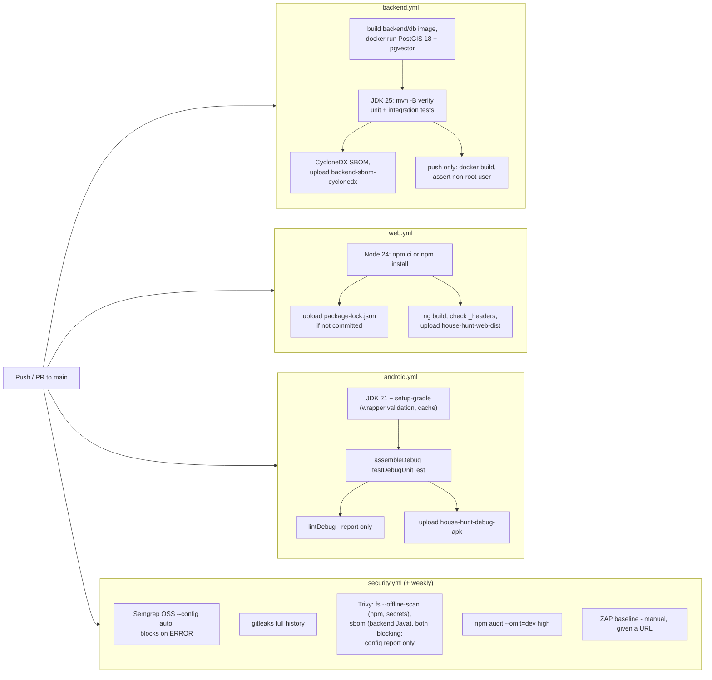

# 07: Secure build and deploy

| Field | Value |
|---|---|
| Document | Secure build, CI/CD and deployment guide |
| Version | 0.3 |
| Date | 2026-09-22 |
| Author | Claude (Cowork) |
| Status | Draft |

## Change log

| Version | Date | Author | Change |
|---|---|---|---|
| 0.1 | 2026-09-22 | Claude (Cowork) | First version: pipeline design, branch protection, secrets, APK signing, free-tier deployment (Supabase/Neon + Render/Koyeb/Oracle + Cloudflare Pages), env vars. No workflows exist in the repo yet. |
| 0.2 | 2026-09-22 | Claude (Cowork) | Wave 2: the pipeline now exists (`backend.yml`, `web.yml`, `android.yml`, `security.yml`, `dependabot.yml`); section 1 describes the real workflows and the CodeQL decision. Hardened Dockerfile and dev compose, `web/public/_headers` in the repo, new environment variables (rate limits, size limits, clock skew, retention, forward headers). |
| 0.3 | 2026-09-22 | Claude (Cowork) | Fixes after the first CI runs: Trivy scans the backend from a CycloneDX SBOM (`trivy sbom`) and runs `trivy fs --offline-scan` (the pom.xml resolution hit Maven Central `429 Too Many Requests`), Trivy DB cached with `actions/cache`; backend.yml publishes the SBOM; `permissions: {}` at the top with per-job `contents: read`; only PR runs are cancelled by newer pushes; Dependabot tuned (Monday schedule, 5 open PRs, grouped minor/patch and security updates, framework majors ignored); gitleaks history note. |

Related: [Threat model](02-threat-model.md) · [Test plan](06-test-plan.md) · [Runbook](08-operations-runbook.md) · [AI docs](ai/)

---

## 1. Pipeline overview

The workflows live in `.github/workflows/` (F-22 fixed). They run on push and pull request to `main` and on manual dispatch; the security workflow also runs weekly. First CI results (2026-09-22): Web build and Semgrep passed; Trivy fs failed on Maven Central rate limiting and gitleaks flagged test API keys, both addressed in v0.3 (below).



| Workflow | Trigger | What it does | Blocking gates |
|---|---|---|---|
| `backend.yml` | push/PR touching `backend/**`, manual | Builds `backend/db` (service containers cannot be built, so it is `docker run` by hand), waits for TCP readiness, runs `mvn -B -ntp verify` on Temurin 25 with `DB_URL` etc., then generates a CycloneDX JSON SBOM (`cyclonedx-maven-plugin:2.9.3:makeAggregateBom`, runtime scopes) and uploads it as `backend-sbom-cyclonedx`; on push also builds the API image and checks it does not run as root | Tests pass; image user ≠ root |
| `web.yml` | push/PR touching `web/**`, manual | Node 24, `npm ci` if `package-lock.json` exists else `npm install` (and uploads the generated lock file as artifact `web-package-lock` so it can be committed), `npm run build`, checks `_headers`/`_redirects` are in the output, uploads `house-hunt-web-dist` | Build passes |
| `android.yml` | push/PR touching `android/**`, manual | Temurin 21, `gradle/actions/setup-gradle@v6` (validates the wrapper JAR), `./gradlew assembleDebug testDebugUnitTest`, `lintDebug` (report only), uploads **`house-hunt-debug-apk`** and reports | Build + unit tests pass |
| `security.yml` | push/PR, weekly (Mon 04:17 UTC), manual | Semgrep (container `semgrep/semgrep:1.177.0`), gitleaks (`ghcr.io/gitleaks/gitleaks:v8.30.1`, full history), Trivy (`aquasec/trivy:0.74.0`, see below), `npm audit --audit-level=high --omit=dev` (dev-only tooling such as the Angular CLI is not shipped, so its advisories do not block), optional ZAP baseline against a URL given at dispatch | No Semgrep ERROR, no gitleaks hit, no unfixed Critical/High from Trivy, no high npm advisory |
| `deploy.yml`, `release.yml`, `backup.yml` | – | **Not built yet** (see sections 5, 6 and 08 §3) | – |

Conventions used in every workflow:

| Control | How |
|---|---|
| Least privilege | Top-level `permissions: {}` (no token scopes by default); every job declares `permissions: contents: read` and nothing more; no job writes to the repository; no `pull_request_target` |
| Pinning | GitHub-owned actions by major version tag (`actions/checkout@v7`, `setup-java@v6`, `setup-node@v7`, `upload-artifact@v7`, `gradle/actions/setup-gradle@v6`, latest majors on 2026-09-22); the one third-party action (ZAP) by full commit SHA; scanners run as version-pinned container images instead of third-party actions with mutable tags (tag hijacking, T-T5); pin the images by digest once the first run has confirmed the tags |
| Credentials | `actions/checkout` with `persist-credentials: false` |
| Concurrency | One run per workflow and ref; on pull requests a newer push cancels the older run (`cancel-in-progress: ${{ github.event_name == 'pull_request' }}`); runs on `main` (push, weekly scan) always finish |
| Timeouts | Every job sets `timeout-minutes` (10 to 40) so a hung step cannot burn the free Actions minutes |
| Caching | Maven (`setup-java cache: maven`), Gradle (`setup-gradle`, read-only on branches), Trivy DB (`actions/cache@v6` on `~/.cache/trivy`, daily key), npm once the lock file is committed |
| Artifacts | APK 30 days, backend SBOM 30 days, web dist 14 days, reports 7 days |

**Why no CodeQL.** On a private repository, GitHub code scanning (CodeQL analysis results and SARIF upload to the Security tab) needs a paid GitHub Advanced Security / Code Security licence, which breaks CON-01 (zero cost). Semgrep OSS covers SAST instead and its SARIF is kept as an artifact. If the repository becomes public, CodeQL and SARIF upload are free and should be added.

**Trivy** (job `trivy` in `security.yml`). The first run failed with `remote Maven repository returned 429 Too Many Requests` for `spring-batch-bom-6.0.5.pom`: `trivy fs` resolves every parent POM and imported BOM of `backend/pom.xml` from Maven Central on each run. The job now:

| Step | What | Blocking |
|---|---|---|
| SBOM | `setup-java` (Maven cache) + `mvn org.cyclonedx:cyclonedx-maven-plugin:2.9.3:makeAggregateBom -DoutputFormat=json -DoutputName=bom -DincludeTestScope=false`. Maven resolves the tree (from the cache when warm); Trivy reads CycloneDX **JSON** only, not XML | – |
| DB cache | `actions/cache` on `~/.cache/trivy` (daily key, restore from the latest); the default `--db-repository` already prefers `mirror.gcr.io` over `ghcr.io` | – |
| `trivy fs --offline-scan` | npm lock file vulnerabilities and secrets in the whole repo (skips `docs`, `backend/target`, `backend/pom.xml`); `--offline-scan` means Trivy never fetches POMs remotely | Yes, High/Critical with a fix |
| `trivy sbom` | Backend Java dependencies from `backend/target/bom.json`; runs even if the fs step failed | Yes, High/Critical with a fix |
| `trivy config` | Dockerfiles and compose | No (report only) |

The containers run as the runner's user (`--user $(id -u):$(id -g)`) with `--cache-dir /cache`, so `actions/cache` can save the DB. The SBOM is also uploaded (`backend-sbom-cyclonedx`). Known gap: Trivy only covers Gradle with a `gradle.lockfile`; the Android dependencies are covered by Dependabot and Gradle dependency locking can be added later.

**gitleaks** scans the whole git history (`fetch-depth: 0`). The flagged test API keys are being removed by the backend team; test code should build its key at runtime instead of hard-coding a realistic-looking one. No `.gitleaks.toml` allowlist is added. If the keys stay in an earlier commit, gitleaks keeps failing on history: before the repo gets other users, either rewrite that commit (the repo is new) or add the exact finding fingerprints from the gitleaks log to a reviewed `.gitleaksignore`, never a path-wide allowlist.

**Dependabot** (`.github/dependabot.yml`). The first push opened many PRs at once, so it is tuned:

| Setting | Value |
|---|---|
| Ecosystems | Maven (`/backend`), npm (`/web`), Gradle (`/android`), GitHub Actions (`/`), Docker (`/backend`, `/backend/db`) |
| Schedule | Weekly, Monday 06:00 Asia/Kolkata |
| Open PRs | `open-pull-requests-limit: 5` per ecosystem |
| Groups | One PR for all minor + patch version updates per ecosystem; security updates grouped separately; all Actions bumps in one PR |
| Ignored | Major bumps of the pinned frameworks: Spring Boot (`org.springframework.boot:*`), Angular (`@angular/*`, `@angular-devkit/*`; TypeScript minor/major, which follow Angular), AGP (`com.android.application`, `com.android.tools.build:*`), Kotlin (`org.jetbrains.kotlin*`, and KSP which follows Kotlin), Docker base image majors (JDK 25, PostgreSQL 18). These upgrades are planned and done by hand (`ng update`, Spring Boot migration guide, AGP upgrade assistant). |

OWASP Dependency-Check is not used: its NVD download is slow and needs an API key; Trivy covers the same Maven/npm ecosystems from the GitHub Advisory database.

## 2. Supply chain rules

| Rule | Why |
|---|---|
| Pin third-party Actions to full commit SHAs. Let Dependabot bump them. | Tag hijack (T-T5) |
| Commit lock files: `web/package-lock.json` (still missing: download the `web-package-lock` artifact from the first `web.yml` run and commit it), Gradle wrapper + optional dependency verification (`gradle/verification-metadata.xml`), Maven versions pinned by the Spring Boot BOM | Reproducible builds |
| `gradle/actions/setup-gradle` validates `gradle-wrapper.jar` | Wrapper tampering |
| Keep dependencies minimal (ADR-06, ADR-12) | Smaller attack surface |
| Build images from official `eclipse-temurin`/`maven` images and rebuild weekly for OS patches | Base image CVEs |
| Record the image digest in the release notes. Deploy by digest. | Integrity |

## 3. Repository and branch protection

| Setting | Value |
|---|---|
| Default branch | `main`, protected (ruleset): require PR, require status checks `backend`, `web`, `android`, `security`, `image`, block force-push and deletion, linear history |
| Reviews | Solo developer: allow self-merge, but keep required checks. Enable "Require conversation resolution". |
| Plan caveat | On **GitHub Free**, rulesets/branch protection and environment reviewers are enforced only on **public** repos. For a private repo on Free, rely on the CI gates plus a local `pre-push` hook (gitleaks + tests), or make the repo public. The code has no secrets, but check your comfort with the personal context in the docs. |
| Workflows | Top-level `permissions: {}`, per job `contents: read`. Grant `contents: write` / `packages: write` only in `release.yml`. **Never** use `pull_request_target` with a checkout of PR code. Don't interpolate `${{ github.event.* }}` text into `run:`. Pass it through `env:`. |
| Secret scanning | Enable GitHub secret scanning + push protection (free for public repos). gitleaks in CI either way. |
| Environments | `production` (deploy hook, DB URL for backups) and `release` (keystore). Restricted to `main`/tags. |
| CODEOWNERS | `docs/05-*` for design, `docs/ai/` for the AI team, `backend/src/main/resources/db/migration/` needs careful review |

## 4. Secrets handling

| Secret | Where it lives | Used by | Rotation |
|---|---|---|---|
| `APP_API_KEY` | Host secret store (Render/Koyeb env var marked secret, or VM `.env` with mode 600). Password manager. | API, clients | On suspicion / every 6 months (08 section 5.1) |
| `DB_URL`, `DB_USER`, `DB_PASSWORD` | Host secret store | API | Provider reset + redeploy |
| `BACKUP_DB_URL` | GitHub `production` environment secret (read-only DB role) | `backup.yml` | Yearly |
| `BACKUP_AGE_RECIPIENT` | GitHub variable (public key, not secret). The private key is **offline** in the password manager. | `backup.yml` | Yearly |
| `RENDER_DEPLOY_HOOK_URL` / `VM_SSH_KEY` | `production` environment secret | `deploy.yml` | Yearly / on staff change |
| `ANDROID_KEYSTORE_BASE64`, `ANDROID_KEYSTORE_PASSWORD`, `ANDROID_KEY_ALIAS`, `ANDROID_KEY_PASSWORD` | `release` environment secrets. The master copy is offline. | `release.yml` | Never (key loss = no in-place updates). Passwords rotate yearly. |
| `NVD_API_KEY` | Repo secret | Dependency-Check | Yearly |
| LLM provider key (e.g. `GEMINI_API_KEY`) | Host secret store. Name TBD by the AI team ([ai/](ai/)). | AI module | On suspicion / quarterly |
| GitHub PAT | **Avoid**: use `GITHUB_TOKEN`. If you need one, use a fine-grained PAT, a single repo, minimal scopes, expiry ≤ 90 days. | Local tooling only | At expiry, **and immediately if it was ever pasted into chat, logs or a file** |

Rules: never commit keys (`.gitignore` already covers `.env`, `*.keystore`, `*.jks`, `local.properties`); never put secrets in Docker build args or the APK; never echo secrets in workflow logs; generate keys with `openssl rand -base64 32`; the `docker-compose.yml` defaults are **dev-only** (F-17).

## 5. Android release signing

| Step | Command / note |
|---|---|
| Create the keystore once, offline | `keytool -genkeypair -v -keystore house-hunt-release.jks -alias househunt -keyalg RSA -keysize 4096 -validity 10000` |
| Back up | The keystore + passwords go to the password manager and one offline encrypted copy. **If lost**, updates must be signed with a new key, which forces an uninstall and **wipes local unsynced data**. |
| Gradle config | `signingConfigs.release` reads `keystore.properties` (gitignored) locally or env vars in CI. `release { isMinifyEnabled = true; isShrinkResources = true; signingConfig = ... }` (F-11). |
| Network security | Remove `usesCleartextTraffic="true"`. Add `network_security_config.xml` allowing cleartext only to `10.0.2.2` and `localhost` in `src/debug/` (F-02). |
| Backup | `android:allowBackup="false"` or `dataExtractionRules` excluding `database/`, `file/photos/`, `datastore/` (F-03) |
| Build in CI | Decode `ANDROID_KEYSTORE_BASE64` to `$RUNNER_TEMP`, run `./gradlew assembleRelease`, delete the file in `always()` |
| Verify | `apksigner verify --print-certs app-release.apk`. Compare the SHA-256 cert fingerprint with the one published in the README. |
| Publish | GitHub Release: `house-hunt-vX.Y.Z.apk` + `house-hunt-vX.Y.Z.apk.sha256`. Notes list the image digest, schema migrations and security fixes. |
| Install | The user checks the SHA-256, allows "Install unknown apps" for the browser/file manager once, and turns it off afterwards |

## 6. Free-tier deployment

Check the current free-tier terms before relying on them. Provider limits change.

### 6.1 Database: Supabase or Neon

| Step | Supabase | Neon |
|---|---|---|
| Create | New project, region **ap-south-1 (Mumbai)** (PRV-010), strong generated DB password | New project, nearest region |
| Extensions | Enable `postgis` (and later `vector`) under Database → Extensions. Flyway's `CREATE EXTENSION IF NOT EXISTS postgis` then does nothing. | `CREATE EXTENSION postgis;` works for the owner role |
| Connection for the API | Use the **Session pooler** connection string (IPv4, port 5432). The direct host is IPv6-only on free, and the transaction pooler (6543) breaks JDBC prepared statements. `DB_URL=jdbc:postgresql://aws-0-ap-south-1.pooler.supabase.com:5432/postgres?sslmode=require` | Use the **direct (non-pooled)** endpoint so Flyway works. `?sslmode=require`. Expect about 1 s wake-up after scale-to-zero. |
| Least privilege (SEC-019) | Create a `househunt_app` role that owns a `househunt` schema. Use it for the API. Keep `postgres` for admin only. Create a read-only `househunt_backup` role for backups. | Same |
| Inactivity | Free projects pause after about 1 week idle, so keep-alive via `keepalive.yml` (08) | Scale-to-zero, no pause |

### 6.2 API

**Option A: Render (or Koyeb)**, simplest:

1. New Web Service → connect the repo → Runtime **Docker**, root directory `backend`, instance type **Free**.
2. Env vars: section 7. Render provides `PORT`. The app reads it.
3. Health check path `/actuator/health`. Auto-deploy off. Deploy via the deploy hook from `deploy.yml` after CI passes.
4. Custom domain (optional) through Cloudflare DNS (proxied), so you can add a free WAF rate-limit rule (SEC-008).
5. Expect a cold start of 30 to 60 s after about 15 min idle (NFR-002).

**Option B: Oracle Cloud Always Free VM** (always on, you own the patching):

1. Ampere A1 VM, Ubuntu LTS, SSH key login only, `unattended-upgrades`, `ufw` allow 22 (your IP if possible), 80 and 443. Also open 80/443 in the OCI security list.
2. Install Docker. Use a **prod** compose file (not the dev `docker-compose.yml`, see F-17 / T-E5):

```yaml
# compose.prod.yml (keep on the VM, not in git with values)
services:
  api:
    image: ghcr.io/<owner>/house-hunt-api@sha256:<digest>
    environment:
      DB_URL: ${DB_URL:?required}
      DB_USER: ${DB_USER:?required}
      DB_PASSWORD: ${DB_PASSWORD:?required}
      APP_API_KEY: ${APP_API_KEY:?required}
      APP_CORS_ORIGINS: ${APP_CORS_ORIGINS:?required}
    restart: unless-stopped
    read_only: true
    tmpfs: [/tmp]
    # no "ports:" - only Caddy is exposed
  caddy:
    image: caddy:2
    ports: ["80:80", "443:443"]
    volumes: ["./Caddyfile:/etc/caddy/Caddyfile:ro", "caddy_data:/data"]
    restart: unless-stopped
volumes: { caddy_data: {} }
```

`Caddyfile`: `api.<your-domain> { reverse_proxy api:8080 }`. Caddy gets and renews Let's Encrypt certs automatically. A free DuckDNS subdomain works if you have no domain. If you self-host PostGIS on the VM instead of a managed DB, bind it to the internal network only (no `ports:`) and add the backup job.

**Dockerfile hardening** (F-23, done): the runtime stage creates user `app` (UID 10001) and runs as `USER 10001:10001`, adds `-XX:+ExitOnOutOfMemoryError` and a `HEALTHCHECK` that probes `/actuator/health` with bash's `/dev/tcp` (the JRE image has no curl or wget).

**Dev compose** (F-17, done): `docker-compose.yml` binds Postgres and the API to `127.0.0.1` only, refuses to start without `APP_API_KEY`, waits for a healthy database, and runs the API read-only with `cap_drop: ALL` and `no-new-privileges`. It is still for development only; on a VM use the prod file above.

### 6.3 Web: Cloudflare Pages (or Netlify)

1. Pages → connect the repo, root `web`, build command `npm run build`, output `dist/web/browser`, env `NODE_VERSION=24`.
2. `public/_redirects` handles the SPA fallback and **`public/_headers`** (in the repo, F-10 fixed) sets the CSP, HSTS, `nosniff`, `X-Frame-Options`, `Referrer-Policy: strict-origin-when-cross-origin` (Nominatim needs a referrer), `Permissions-Policy`, COOP and long caching for hashed bundles. `connect-src` allows `https:` because the API address is typed by the user at runtime; `worker-src blob:` is for MapLibre 5; `angular.json` sets `inlineCritical: false` so `script-src 'self'` holds (no inline `onload` handler). GitHub Pages cannot send headers, so prefer Cloudflare Pages or Netlify.

3. Set `APP_CORS_ORIGINS=https://<project>.pages.dev` (plus a custom domain if you use one) on the API and redeploy.
4. Open the site → Connect → enter the `https://` API URL + key.

### 6.4 Android client

Install the APK (section 5; until release signing exists, the debug APK from the `house-hunt-debug-apk` artifact of `android.yml`). Settings → server URL `https://…` (the app rejects `http://` except for localhost and the emulator), paste the key, then Save and test, then Sync now.

## 7. Environment variables

| Variable | Required | Default (in code) | Example / notes | Secret |
|---|---|---|---|---|
| `DB_URL` | Yes (prod) | `jdbc:postgresql://localhost:5432/househunt` | `jdbc:postgresql://<host>:5432/postgres?sslmode=require` | Yes (host info) |
| `DB_USER` | Yes (prod) | `househunt` (**dev only**) | `househunt_app` | Yes |
| `DB_PASSWORD` | Yes (prod) | `househunt` (**dev only**) | Generated, 32+ chars | Yes |
| `DB_POOL_SIZE` | No | `5` | Keep ≤ 5 on free DBs | No |
| `APP_API_KEY` | **Yes** (startup fails if shorter than 16 chars) | empty | `openssl rand -base64 32` | Yes |
| `APP_CORS_ORIGINS` | Yes for web | `http://localhost:4200` | `https://house-hunt.pages.dev` (comma-separated) | No |
| `PORT` | No | `8080` | Set by Render/Koyeb | No |
| `JAVA_TOOL_OPTIONS` | No | Set in the Dockerfile: `-XX:MaxRAMPercentage=75 -XX:+UseSerialGC -Xss512k` | Keep for 512 MB hosts | No |
| `FORWARD_HEADERS_STRATEGY` | No | `native` | Trust `X-Forwarded-*` from proxies Tomcat considers internal (private ranges): correct client address for rate limits and HTTPS detection for HSTS. Set `none` if the API is exposed directly. | No |
| `RATE_LIMIT_PER_MINUTE`, `RATE_LIMIT_BURST` | No | `600`, `300` | Per client address, all paths except health | No |
| `AUTH_FAILURES_PER_MINUTE`, `AUTH_FAILURE_BURST` | No | `10`, `10` | Wrong/missing keys per address before 429 | No |
| `MAX_JSON_BYTES` | No | `262144` | JSON body cap (413) | No |
| `MAX_PHOTOS_PER_HOUSE` | No | `20` | Keep equal to the Android `MAX_PHOTOS_PER_HOUSE` | No |
| `SYNC_MAX_CLOCK_SKEW_SECONDS`, `SYNC_MAX_FUTURE_DAYS` | No | `300`, `365` | Client clock clamp / reject (F-08) | No |
| `TOMBSTONE_RETENTION_DAYS` | No | `90` | Daily purge at 03:30 server time | No |
| `APP_API_KEY_NEXT` | Planned (SEC-017) | - | Second valid key during rotation | Yes |
| AI variables (`APP_AI_ENABLED`, `APP_MCP_ENABLED`, `AI_API_KEY`, models, limits) | No, off by default (AI-001) | – | See [docs/ai/ai-design.md](ai/ai-design.md) §11 | Keys: Yes |

## 8. Pre-deploy checklist (per environment)

- [ ] `APP_API_KEY` is 32+ random chars and differs from dev/staging.
- [ ] `DB_URL` has `sslmode=require` and uses the least-privilege role.
- [ ] No dev defaults (`househunt/househunt`) anywhere in prod; the old `local-dev-key-change-me` default no longer exists.
- [ ] `web/public/_headers` is served (check with `curl -I` that `Content-Security-Policy` is present) and the app still loads maps and fonts.
- [ ] `APP_CORS_ORIGINS` lists only the real web origin(s).
- [ ] The API is reachable only over HTTPS. HTTP redirects or is closed.
- [ ] `/actuator/health` returns only `{"status":"UP"}`.
- [ ] The backup job ran successfully and a restore was tested in the last 90 days (TC-O-01).
