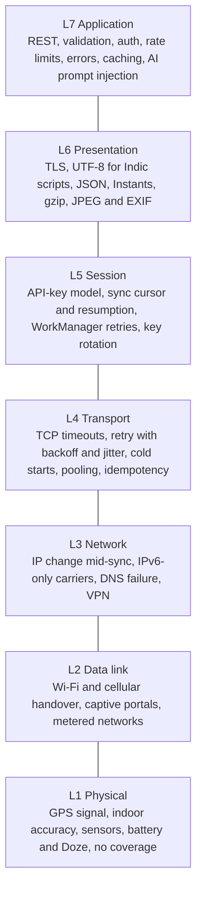

# 09: OSI 7-layer resilience analysis

| Field | Value |
|---|---|
| Document | Network and resilience review, layer by layer |
| Version | 0.7 |
| Date | 2026-09-23 |
| Author | Claude (Cowork) |
| Status | Draft |

## Change log

| Version | Date | Author | Change |
|---|---|---|---|
| 0.1 | 2026-09-22 | Claude (Cowork) | First version. 55 scenarios across L1 to L7, with the mitigations built in wave 2 (retry with backoff and jitter, captive-portal detection, no redirects, Wi-Fi-only photos, battery-aware Hunt mode, gzip, EXIF stripping on the server, deny-by-default auth, rate limits, sync cursor safety). |
| 0.2 | 2026-09-22 | Claude (Cowork) | Sprint 2 ([10](10-sprint-log.md)): row 5.5 (key rotation) is now **Yes**: dual API keys (`APP_API_KEY_NEXT`, SEC-017) give a zero-downtime rotation with no 401 window, procedure in [08 §5.1](08-operations-runbook.md#51-api-key-app_api_key-app_api_key_next); backlog item OSI-B04 marked Done. |
| 0.3 | 2026-09-22 | Claude (Cowork) | F-01 split in [02](02-threat-model.md) v0.6: rows 5.1 and 7.4 (one shared key, no roles) now point at F-01b (per-device keys, Open). No other change. |
| 0.4 | 2026-09-22 | Claude (Cowork), Docs team | Product rename to **Doorprints** ([03](03-design.md) ADR-13): the introduction uses the new name. Source paths (`com/househunt/...`) are unchanged because the packages were kept. No network behaviour changed. |
| 0.5 | 2026-09-22 | Claude (Cowork), Docs team | Sprint 3.5 (KMP `:shared` module, commit `8f583af`, [03](03-design.md) ADR-14): the Android HTTP client is now the shared Ktor `ApiClient` with `RetryPolicy` on one app-wide `HttpClient` (OkHttp 5.5 engine), replacing OkHttp 4 with `RetryInterceptor`. Same numbers and rules, so no scenario changes its result; the component table and rows 2.1, 2.2, 3.1, 3.2, 4.1, 4.2, 4.4, 5.7, 6.4, 6.8 and the section 9 transport row name the new classes and tests (`ApiClientContractTest`, `RetryPolicyTest`). New in row 4.2: a connection that drops while a retriable response body is read is retried too, and every call is limited to 4 minutes including retries. |
| 0.6 | 2026-09-23 | Claude (Cowork), Docs team | Row **7.6** corrected: it said the web app's hashed bundles are cached for a year. The live host is now Cloudflare Pages ([03](03-design.md) ADR-21), and on 2026-09-23 the Web team removed every long-lived `immutable` rule from `web/public/_headers`, because Pages matches header rules by request path and its SPA fallback answers a missing file with the HTML shell and status 200, so a year-long rule would cache HTML under an old chunk's name. The row now gives the real policy (`no-cache` for `sw.js`, the manifest and `index.html`; Pages' default `public, max-age=0, must-revalidate` with an ETag for everything else; the service worker precache after the first visit) and says why no long `max-age` may come back. No other change. |
| 0.7 | 2026-09-23 | Claude (Cowork), Docs team | The live web host is **Firebase Hosting** at `https://doorprints.web.app` (owner decision of 2026-09-23, [03](03-design.md) ADR-21), replacing the Cloudflare Pages plan, which was never set up. Row **7.6**: `Cache-Control: no-cache` on every path from `web/firebase.json` (Firebase's own default would be `max-age=3600`), and the `**` rewrite is why no path may get a long `max-age`/`immutable`; the header check now also asserts `no-cache`. Row **3.2**: whether `doorprints.web.app` publishes an AAAA record is to be checked on the first deploy (it could not be resolved from the docs environment). Row **6.2** names Firebase Hosting among the TLS-terminating hosts; row **7.7** names `web/firebase.json` as the web headers' source. |

Related: [Threat model](02-threat-model.md) · [Design](03-design.md) · [DFDs](04-data-flow-diagrams.md) · [Test plan](06-test-plan.md) · [Build and deploy](07-secure-build-and-deploy.md)

---

## 1. Purpose and method

Doorprints (called House Hunt until 2026-09-22) is used outdoors, on a phone, on Indian mobile networks, against an API on a free host that sleeps. Most failures are not bugs in the business logic. They are a lost GPS fix, a hotel Wi-Fi sign-in page, a cold start or a clock that runs fast. This document walks the OSI model from the radio up to the application and records, for each layer:

- **Scenario**: what can go wrong.
- **Current behaviour**: what the code does now (after wave 2).
- **Risk**: impact if it goes wrong, rated **H**igh, **M**edium or **L**ow like [02](02-threat-model.md).
- **Mitigation**: what we do about it.
- **Implemented?**: **Yes** with file references, **Part**, **No** (backlog) or **N/A** (outside our control, accepted).
- **Test**: the test case in [06](06-test-plan.md), or the new unit/integration test.

The OSI model is a teaching model. The app does not implement layers 1 to 4 itself; it relies on Android, the browser, the JVM and the host. For those layers the question is: *how does the app behave when the layer misbehaves?*

Main code locations referenced below:

| Short name | File |
|---|---|
| `ApiClient` | `android/shared/src/commonMain/kotlin/com/househunt/shared/api/ApiClient.kt` (Ktor, since Sprint 3.5; the app-wide `HttpClient` is created in `android/app/.../data/Api.kt` through `AndroidApiHttp`) |
| `RetryPolicy` | `android/shared/.../api/RetryPolicy.kt` (replaced `data/RetryInterceptor.kt`, same rules) |
| `NetworkState` | `android/.../data/NetworkState.kt` |
| `SyncWorker` | `android/.../data/SyncWorker.kt` |
| `Repository` | `android/.../data/Repository.kt` |
| `HuntService` | `android/.../location/HuntService.kt` |
| `ApiKeyFilter`, `RequestPaths` | `backend/src/main/java/com/househunt/config/` |
| `SyncVersions`, `ClientClock` | `backend/.../sync/` |
| `ImageSanitizer` | `backend/.../photo/ImageSanitizer.java` |

## 2. L1 Physical: GPS, sensors, power, coverage

| # | Scenario | Current behaviour | Risk | Mitigation | Implemented? | Test |
|---|---|---|---|---|---|---|
| 1.1 | GPS signal lost indoors, under a flyover or between tall buildings | Fixes worse than 50 m are shown on the Hunt card but never trigger alerts or visits. When no fix has arrived for 2 minutes the card says "Waiting for a GPS signal". | M: false "you've seen this one" alerts, or phantom visits | Accuracy gate (`HuntService.MAX_ACCURACY_M` = 50 m), stale-fix hint (`HuntState.lastFixAt`) | Yes: `HuntService.onLocation`, `MapScreen.HuntCard` | TC-U-08, TC-F-05 |
| 1.2 | Indoor accuracy good enough (20 to 40 m) but neighbouring houses 15 m apart | Alerts pick the nearest saved house within the alert radius (default 30 m, 15 to 100 m in Settings) | L: wrong house named | User-adjustable radius; pins can be re-saved while standing at the house; Settings text explains 5 to 20 m GPS accuracy | Yes: `SettingsScreen` | TC-F-02 |
| 1.3 | Mock-location app feeds fake positions | Accepted as real | L: only the phone owner is affected (T-S5) | Accept | N/A | – |
| 1.4 | Battery drain from high-accuracy GPS | 15 s interval while walking, **60 s / 10 m while standing still** (a detected stay, e.g. inside a flat you are viewing) | M: Hunt mode left on drains the phone (T-D6) | Stationary slow-down (`HuntService.requestUpdates(stationary = true)`) | Yes: `HuntService` | TC-F-06 |
| 1.5 | Battery low while Hunt mode runs | Checked at most every 2 minutes; at 15% or below and not charging the service stops itself and posts "Hunt mode stopped: battery low" | M: a dead phone during a viewing day | Auto-stop (`HuntService.stopIfBatteryLow`, `LOW_BATTERY_PERCENT`) | Yes | TC-F-09 (new) |
| 1.6 | Doze / App Standby while the screen is off | Hunt mode is a foreground service of type `location`, which is exempt from Doze location throttling; sync is a WorkManager job, which Doze defers to maintenance windows | L: sync a few minutes late | Accept; sync also runs on the next app start and 3 s after each change | Yes: manifest `foregroundServiceType="location"`, `SyncWorker` | TC-F-07 |
| 1.7 | No coverage at all (basement, rural road) | Everything works from the Room database; changes queue as `dirty` rows and photo files | L | Offline-first design (FR-019) | Yes | TC-F-08 |
| 1.8 | Camera or storage full when taking a photo | `addPhoto` returns `UNREADABLE` and the edit screen says "Could not read that image" | L | Result type instead of a silent failure | Yes: `Repository.addPhoto` | TC-M-08 (new) |

## 3. L2 Data link: Wi-Fi, cellular, captive portals, metered links

| # | Scenario | Current behaviour | Risk | Mitigation | Implemented? | Test |
|---|---|---|---|---|---|---|
| 2.1 | Wi-Fi to cellular handover in the middle of a sync | The TCP connection breaks; the engine throws an `IOException`; `ApiClient` retries idempotent calls on the new network (`RetryPolicy`); if all 3 attempts fail, WorkManager retries the whole sync with exponential backoff | M: partial sync | Every step is idempotent (PUT with client ids, upload with a client photo id, cursor saved only after a batch) | Yes: `ApiClient` + `RetryPolicy`, `SyncWorker` | `ApiClientContractTest.retriesNetworkErrorsForIdempotentCalls` |
| 2.2 | **Captive portal** (hotel, airport, café Wi-Fi) answers with its own HTML sign-in page or a redirect | Before the fix: the API key was sent to whatever answered, and HTML was parsed as JSON ("unexpected character" errors). Now: (a) `SyncWorker` skips the run when Android reports `NET_CAPABILITY_CAPTIVE_PORTAL`; (b) the client does **not follow redirects** (Ktor `followRedirects = false` and the OkHttp engine's own setting), and a 3xx is reported as "this Wi-Fi needs a sign-in"; (c) a 200 whose `Content-Type` is not JSON (or not an image for photo downloads) is treated the same | H: key leak via redirect to another host; confusing errors | (a) `NetworkState.captivePortal`; (b) `followRedirects = false`; (c) content-type check in `ApiClient.call` | Yes | `SyncOutcomeTest`, `ApiClientContractTest` (`htmlSignInPageIsACaptivePortal`, `redirectsAreNeverFollowed`, `jsonCallsNeedAJsonContentType`), TC-S-13 (manual with a portal emulator) |
| 2.3 | Metered network (mobile data, phone hotspot) and many photos | Houses and visits always sync (small JSON). Photos upload and download **only on unmetered networks** when "Photos only on Wi-Fi" is on (default). Skipped photos are counted ("Photos waiting for Wi-Fi: 3") and a separate WorkManager job with `NetworkType.UNMETERED` moves them as soon as Wi-Fi is available | M: surprise data bills on prepaid plans | `AppSettings.photosOnWifiOnly`, `SyncWorker.syncPhotosOnWifi`, photo cursor held back until skipped downloads are done | Yes | TC-F-10 (new) |
| 2.4 | Weak 2G/EDGE link | Read timeout 90 s, call timeout 4 min, gzip on JSON | L: slow but completes | See L4 and L6 | Yes | TC-P-02 |
| 2.5 | Browser on a captive portal (web app) | Requests fail CORS or return HTML; `HttpClient` reports an error; the page shows "Could not reach the server" | L | Accept; the browser's own portal detection handles sign-in | N/A | TC-M-05 |

## 4. L3 Network: addressing, DNS, VPN

| # | Scenario | Current behaviour | Risk | Mitigation | Implemented? | Test |
|---|---|---|---|---|---|---|
| 3.1 | IP address changes mid-sync (handover, carrier NAT rebinding) | Same as 2.1: connection error, retry | L | Idempotent requests + retries | Yes | `ApiClientContractTest` |
| 3.2 | IPv6-only mobile network (Jio is IPv6-first; some carriers use 464XLAT) | Android's DNS64/NAT64 and 464XLAT reach IPv4-only hosts; the OkHttp engine under Ktor tries all resolved addresses (happy-eyeballs style fallback across routes) | L | Prefer hosts that publish AAAA records (Render and Fly do; for the web host, check `dig AAAA doorprints.web.app` on the first deploy — not verified from the docs environment; without one, DNS64/NAT64 and 464XLAT still reach it) | N/A | TC-F-11 (new, informational) |
| 3.3 | DNS failure or a slow resolver | `UnknownHostException` → retry, then "no connection to the server" | L | Retries; errors shown as a category, never as raw text | Yes | `SyncOutcomeTest` |
| 3.4 | Android Geocoder unavailable (no Play services, offline) | `ReverseGeocoder.lookup` returns null; street alerts pause; house alerts continue | L | Graceful degradation (AS-04) | Yes: `Geo.kt` | TC-F-03 |
| 3.5 | Corporate or consumer VPN that intercepts TLS with its own CA | Android app trusts **only system CAs** (`network_security_config.xml` has no `user` trust anchor), so a user-installed interception CA is rejected. The browser follows the OS trust store. | M: key and data visible to the VPN operator | System CAs only on Android; HSTS on the web | Yes: `res/xml/network_security_config.xml` | TC-S-07 |
| 3.6 | Private LAN server (self-hosted API on `192.168.x.x`) | Blocked: cleartext is only allowed for `localhost`, `127.0.0.1` and `10.0.2.2`, and the Settings screen rejects other `http://` URLs | L: self-hosters must use HTTPS (e.g. a free Cloudflare Tunnel) | Documented in 07 | Yes: `ServerUrl` | `ServerUrlTest` |

## 5. L4 Transport: TCP, timeouts, retries, pooling, idempotency

| # | Scenario | Current behaviour | Risk | Mitigation | Implemented? | Test |
|---|---|---|---|---|---|---|
| 4.1 | TCP connect hangs (black-holed route) | `connectTimeout` 20 s | L | Timeout, then retry | Yes: `AndroidApiHttp` (connect 20 s, read 90 s, write 60 s) | – |
| 4.2 | Transient 502/503/504 from the host's proxy, or 408/429 | Retried up to 3 attempts with **exponential backoff and full jitter**: wait = random(0, min(15 s, 1 s × 2^(attempt−1))). A short `Retry-After` is honoured; a long one is handed back so WorkManager retries later instead of blocking a thread | M: thundering-herd retries or a stuck worker | `RetryPolicy` in `ApiClient` (idempotent methods only, plus the photo upload marked idempotent); since Sprint 3.5 a connection dropped while a retriable response body is read is retried too, and a whole call including retries is limited to 4 minutes (`ApiTimeoutException`) | Yes | `RetryPolicyTest`, `ApiClientContractTest` (retry, `Retry-After` and timeout cases) |
| 4.3 | **Cold start** of a free host (Render/Koyeb sleep: 30 to 60 s for a Java app) | Read timeout 90 s; the first sync after a pause simply takes longer; the web shows the loading state | M: users think it is broken | Long read timeout; a keep-alive ping from the uptime monitor (08) | Yes (timeouts), Part (web "waking server" hint is backlog NFR-002) | TC-P-02 |
| 4.4 | Many small requests in one sync (one PUT per changed row) | One app-wide Ktor `HttpClient` (OkHttp engine) shared by every `ApiClient`, so the connection pool and dispatcher are reused (keep-alive, HTTP/2 where offered) | L | Shared client (`Api.http` in `data/Api.kt`) | Yes | – |
| 4.5 | Retried non-idempotent request creates duplicates | Houses and visits use PUT with client-generated UUIDs; photos use POST with a client-chosen `id` (a repeat returns the same id, never a second row); AI POSTs are **not** retried | M | Client ids everywhere; server upload is idempotent (`PhotoService.upload`) | Yes | `ApiIntegrationTest.photoUploadStripsMetadataAndDeletesSyncAsTombstones` (retry with same id) |
| 4.6 | Slow-loris or idle connections on the small API host | Tomcat `connection-timeout` 20 s; JSON body cap 256 KB (413); multipart 5 MB / 6 MB | M: free-tier exhaustion | `application.yml` `server.tomcat.*`, `RequestSizeLimitFilter` | Yes | `rejectsOversizedJsonBodies` |
| 4.7 | Request floods (with or without a key) | Per-address token bucket, 600/min with a burst of 300 (429 + `Retry-After`); wrong keys limited to 10/min per address | M (T-D1) | `ApiRateLimitFilter`, `ApiKeyFilter` failure bucket; Cloudflare in front if the host allows | Yes | `ApiKeyFilterTest.throttlesRepeatedWrongKeysButNeverTheRightOne` |
| 4.8 | Database connections under load | Hikari pool of 5 (free Postgres allows few connections) | L | Keep the pool small | Yes | TC-P-02 |

## 6. L5 Session: auth model, sync sessions, retries, rotation

| # | Scenario | Current behaviour | Risk | Mitigation | Implemented? | Test |
|---|---|---|---|---|---|---|
| 5.1 | Session model | There is no login session: every request carries the shared API key (`X-API-Key`, or `Authorization: Bearer` for MCP clients). No cookies, so no CSRF. | M (F-01b: one key, full access) | Constant-time compare; deny by default; failed attempts logged with a salted address hash and throttled | Yes: `ApiKeyFilter` | TC-I-01, `ApiKeyFilterTest` |
| 5.2 | Sync interrupted half way | Push is per row (`markClean` only after the server accepted it); pull advances the cursor only after a whole batch is stored; photos have their own cursor that does not move past skipped downloads | L | Resumable by design: the next run continues from the saved cursors | Yes: `Repository.sync`, `SettingsStore.cursors` | TC-F-08 |
| 5.3 | **Cursor skips a change** because a lower sync version commits after a higher one was already read (F-09) | Writers take a transaction-scoped advisory lock before `nextval('sync_seq')`, so versions become visible in assignment order and a reader can never pass an uncommitted version | M | `SyncVersions.lock()/next()` in every house, visit, photo and purge write | Yes | TC-I-14 (design argument in 03 §10.4; a concurrency test is backlog) |
| 5.4 | Job retry policy | WorkManager: exponential backoff from 30 s, up to 5 attempts per run; an auth failure stops retrying (the user must fix the key); a periodic job every 30 minutes | L | `SyncWorker` | Yes | – |
| 5.5 | Key rotation | Since Sprint 2 the API accepts a second key, `APP_API_KEY_NEXT`, alongside `APP_API_KEY` (both at least 32 characters). The operator sets the new key as NEXT, clients move to it while the old key still works, then NEXT is promoted to `APP_API_KEY` and cleared; only then does the old key get 401. An emergency rotation (leaked key) skips the overlap on purpose | M: every device must be updated; with the overlap there is no 401 window, so no sync failures | Dual keys (SEC-017) with the procedure in runbook [08 §5.1](08-operations-runbook.md#51-api-key-app_api_key-app_api_key_next); do not leave NEXT set after a rotation (two valid keys) | Yes: `ApiKeyFilter`, `AppProperties`, `docker-compose.yml` | TC-O-02 (drill), TC-U-18 `ApiKeyFilterTest.acceptsBothKeysDuringRotation`, TC-I-21 `ApiIntegrationTest.acceptsTheNextKeyDuringRotation` |
| 5.6 | Key at rest on the client | Android: AES-256-GCM with a Keystore key, never in backups; masked in Settings (only the last 4 characters are shown). Web: sessionStorage by default, localStorage only with "Remember on this device" | H (T-I1, T-I2) | `ApiKeyCipher`, `data_extraction_rules.xml`, `ConfigService` | Yes | TC-S-07, TC-M-06 |
| 5.7 | Server-sent "retry later" | 429 carries `Retry-After`; the Android client and the web AI pages show it | L | – | Yes | `ApiClientContractTest` (`shortRetryAfterIsHonouredThenRetried`, `longRetryAfterIsReportedAsRateLimited`) |

## 7. L6 Presentation: TLS, encodings, time, compression, images

| # | Scenario | Current behaviour | Risk | Mitigation | Implemented? | Test |
|---|---|---|---|---|---|---|
| 6.1 | Plain HTTP to the API | Android: cleartext blocked except local dev hosts; Settings rejects `http://` URLs. Web: an HTTPS page cannot call an HTTP API (mixed content); the Connect page warns. API: HSTS when the request arrived over HTTPS (`server.forward-headers-strategy=native` behind the host's proxy) | H (F-02) | `network_security_config.xml`, `ServerUrl`, `SecurityHeadersFilter` | Yes | `ServerUrlTest`, TC-S-09 |
| 6.2 | TLS version and ciphers | Android 8+ uses TLS 1.2/1.3 by default; free hosts terminate TLS 1.2+ (Render, Fly, Firebase Hosting for the web app). The JVM never terminates TLS itself (the host does) | L | Check with SSL Labs / testssl.sh | N/A (host) | TC-S-09 |
| 6.3 | **Certificate pinning?** | Not pinned | M | **Decision: no pinning.** Free hosts rotate certificates and even CAs (Let's Encrypt, Google Trust Services) without notice; a pinned sideloaded APK would stop syncing with no way to push an update. The system-CA-only trust store (3.5) already blocks user-installed interception CAs. Revisit with a backup pin set if the app ever gets an update channel (Play Store). | Yes (decision) | – |
| 6.4 | **Indic scripts** (Hindi, Tamil, Telugu) in names, notes and street names | UTF-8 end to end: Android strings and kotlinx.serialization (UTF-8), JSON request body `application/json; charset=UTF-8` (Ktor `ApiClient`, same as the earlier OkHttp client), Spring/Jackson UTF-8, Tomcat URI decoding UTF-8 (street name in the query string), PostgreSQL database encoding UTF8 (the official image initialises with `en_US.utf8`; Supabase/Neon are UTF8). `lower(street)` is a no-op for these scripts (no case), so street matching is exact for them. Web: `<meta charset="utf-8">`, Noto fonts | M: mojibake or failed street matches | Keep UTF-8 defaults; the test round-trips all three scripts | Yes | `ApiIntegrationTest.indicTextRoundTripsEndToEnd` |
| 6.5 | Unicode normalisation (the same Tamil word typed in NFC and NFD) | Not normalised | L: a street typed differently does not match | Backlog: normalise street names to NFC on save | No | – |
| 6.6 | Collation and sorting | Sorting is done on the clients (score, price, date), not by text in SQL | L | – | N/A | – |
| 6.7 | Time zones and clock skew | All timestamps are `Instant` (UTC) end to end: epoch milliseconds on Android, ISO-8601 with `Z` in JSON, `timestamptz` in Postgres, `hibernate.jdbc.time_zone: UTC`; clients render in the device time zone. A client `updatedAt` more than 5 minutes ahead is clamped to server time; more than 365 days ahead or before 2000 is rejected (F-08) | M (T-T2) | `ClientClock`, `application.yml` | Yes | `ClientClockTest`, `clientClockIsClampedOrRejected` |
| 6.8 | Compression | The API gzips JSON and problem responses over 1 KB (`server.compression`); the Ktor OkHttp engine and browsers decompress transparently. Photos are JPEG (already compressed) and are not gzipped. BREACH does not apply: no secret is reflected in a compressed response (the key is a request header) | L | `application.yml` | Yes | TC-P-02 |
| 6.9 | **Photo metadata** (Exif GPS position, time, device model) reveals where and when a photo was taken | Android decodes and re-encodes every photo with `Bitmap.compress` (no Exif is written; orientation is applied to the pixels first). The web re-encodes through a canvas. The **server** now also detects the type from magic bytes and strips JPEG APP1 (Exif/XMP), APP3–APP13, APP15, COM segments and trailers after EOI (motion-photo payloads), PNG `eXIf/tEXt/zTXt/iTXt/tIME` and WebP `EXIF/XMP` chunks, without re-encoding | H (PRV-008) | `Repository.addPhoto`, `image-resize.ts`, `ImageSanitizer` | Yes | `ImageSanitizerTest` (3 formats), `photoUploadStripsMetadataAndDeletesSyncAsTombstones`, TC-U-11 |
| 6.10 | Spoofed image type (HTML or SVG uploaded as `image/jpeg`) | Rejected: the type comes from magic bytes (F-07); responses carry `nosniff` | M (T-T3) | `ImageSanitizer.sanitize`, `SecurityHeadersFilter` | Yes | `ImageSanitizerTest.rejectsNonImagesAndTruncatedFiles` |

## 8. L7 Application: REST, validation, authz, errors, caching, AI

| # | Scenario | Current behaviour | Risk | Mitigation | Implemented? | Test |
|---|---|---|---|---|---|---|
| 7.1 | Auth bypass through path tricks (`/api;x/houses`, `/%61pi/houses`, `//api/houses`, `/api/./houses`, trailing dots) (F-20) | **Deny by default**: every path needs the key except `GET/HEAD /actuator/health[/**]` and real CORS preflights. Any path with `;`, `%`, `\`, an empty segment, a dot segment or a segment ending in `.` gets 400 before routing, so the filter and Spring MVC always agree on the path | H | `ApiKeyFilter`, `RequestPaths.isCanonical` | Yes | `ApiKeyFilterTest` (17 bad paths), `pathTricksCannotBypassTheKeyFilter`, TC-S-10 |
| 7.2 | REST semantics | PUT upserts are idempotent; DELETE is idempotent (a second delete of a photo or visit is a no-op); `GET ?since=` feeds for houses, visits and photos | L | – | Yes | TC-I-05 |
| 7.3 | Input validation | Bean validation on DTOs; `nearby` lat/lon ranges and positive radius; street name 1–200 chars; visit `leftAt` not before `arrivedAt`; client clock checks | M (F-19) | Built-in MVC method validation (Spring 6.1+) | Yes | `nearbyRejectsOutOfRangeParameters`, TC-I-06 |
| 7.4 | Authorisation | Single user, single key: no roles (F-01b, T-E1 accepted for v1) | M | Per-device keys are backlog (SEC-025) | No | – |
| 7.5 | Error handling | RFC 7807 problem details; 400/404/409/413/428/429/503; no stack traces. Android shows a translated category, never the server body (F-12). Web maps 401/429/503 to translated messages | L | `ApiExceptionHandler`, `SyncOutcome`, `aiErrorMsg` | Yes | `SyncOutcomeTest` |
| 7.6 | HTTP caching of private data | JSON: `Cache-Control: no-store` (no disk or proxy caching of locations and phone numbers). Photos: `private, max-age=30 days` (immutable by id). Web static files (Firebase Hosting, `https://doorprints.web.app`): `Cache-Control: no-cache` on **every** path from the `**` rule of `web/firebase.json` (Firebase's own default would be `max-age=3600`, and a rule for `/index.html` alone would not match `/` or a deep link), revalidated with an ETag (a 304 per file on a repeat visit); after the first visit the service worker serves the build from its precache. **No long `max-age`/`immutable` rule for any path**: the `**` rewrite answers a missing file (an old build's chunk) with the HTML shell and status 200, and header rules match the request path, so such a rule would cache HTML under a chunk's name ([07](07-secure-build-and-deploy.md) §6.3 item 3, `web/README.md` "Deploy") | M | `SecurityHeadersFilter`, `PhotoController`, `web/firebase.json` | Yes | `securityHeadersAndNoStoreOnJson`; TC-S-23 (`no-cache` on `/`, `/compare`, `sw.js` and the manifest, and no `immutable`, on each deploy) |
| 7.7 | Security headers | API: `nosniff`, `X-Frame-Options: DENY`, `Referrer-Policy: no-referrer`, CSP `default-src 'none'`, HSTS on HTTPS. Web: strict CSP, HSTS, `frame-ancestors 'none'`, `X-Frame-Options`, `nosniff`, `Referrer-Policy`, `Permissions-Policy`, COOP via `web/firebase.json` on Firebase Hosting (F-10; `_headers` until 2026-09-23) | M | – | Yes | TC-S-04 |
| 7.8 | Storage exhaustion by photos (F-06) | 20 live photos per house (409 above that), 5 MB per upload | M | `PhotoService`, Android `MAX_PHOTOS_PER_HOUSE` | Yes | `photoUploadStripsMetadataAndDeletesSyncAsTombstones` |
| 7.9 | Deleted data lingering (F-15, F-16) | Photo deletes become tombstones that sync; deleting a house blanks its content, tombstones its photos and unlinks its visits; tombstones are purged after 90 days; `GET /api/export` and `DELETE /api/data` (with `X-Confirm-Delete: DELETE-ALL-MY-DATA`) | H (T-I10) | `DataService`, `HouseService.purge`, V3 migration | Yes | `deletingAHousePurgesItsContent`, `deleteAllNeedsTheConfirmationHeader`, `exportContainsLiveDataAsAnAttachment` |
| 7.10 | AI prompt injection through listing text or notes | The extractor has no tools and its output is schema-validated; RAG answers cite only retrieved ids; the planner's tools are read-only with step limits; AI endpoints have their own rate limit. The UI renders AI output as text only (Angular interpolation, Compose `Text`), shows AI warnings and never saves automatically | M (T-T7, T-E2) | [docs/ai/ai-design.md](ai/ai-design.md) §9; UI: `ask-page`, `plan-page`, `house-detail-page` import, Android `AssistantScreen`, `PasteListingDialog` | Yes | TC-AI-04..06 |
| 7.11 | AI provider down or out of free quota | 503 with `retryable: true`; clients show "The AI provider is unavailable or out of free quota" | L | – | Yes | TC-AI-07 |

## 9. What changed in wave 2 (summary)

| Area | Change | Files |
|---|---|---|
| Transport | Retry with exponential backoff and full jitter for idempotent calls; shared connection pool; call timeout; no redirects | `ApiClient.kt`, `RetryPolicy.kt` (`:shared`), `AndroidApiHttp.kt`, `Api.kt` |
| Link / portal | Captive-portal detection (network capability, redirect, non-JSON body) | `NetworkState.kt`, `Api.kt`, `SyncWorker.kt` |
| Metered links | "Photos only on Wi-Fi" (default on) with an UNMETERED follow-up job | `Settings.kt`, `Repository.kt`, `SyncWorker.kt`, `SettingsScreen.kt` |
| Power | Stationary slow-down and low-battery auto-stop in Hunt mode; GPS-lost hint | `HuntService.kt`, `HuntState.kt`, `MapScreen.kt` |
| Presentation | gzip on the API; UTC timestamps configured; server-side metadata stripping and magic-byte type detection | `application.yml`, `ImageSanitizer.java` |
| Session | Keystore-encrypted key; sessionStorage by default on the web; ordered sync versions | `ApiKeyCipher.kt`, `config.service.ts`, `SyncVersions.java` |
| Application | Deny-by-default auth with canonical paths; rate limits; body size cap; security headers; clock clamping; tombstones, export and delete-all | `config/*`, `sync/*`, `privacy/*`, `photo/*` |

## 10. Backlog from this review

| ID | Item | Layer | Priority |
|---|---|---|---|
| OSI-B01 | Web: "the server is waking up" hint after 5 s on the first request (NFR-002) | L4 | S |
| OSI-B02 | Unicode NFC normalisation of street names before save and search | L6 | C |
| OSI-B03 | A concurrency integration test for the sync cursor (two writers, one reader) | L5 | S |
| OSI-B04 | ~~Dual API keys for zero-downtime rotation (SEC-017)~~ **Done in Sprint 2**: `APP_API_KEY_NEXT`, rotation procedure in [08 §5.1](08-operations-runbook.md#51-api-key-app_api_key-app_api_key_next), row 5.5 | L5 | S |
| OSI-B05 | Web offline support (service worker) for read-only use on the move | L1/L2 | C |
| OSI-B06 | Measure Hunt mode battery use with the stationary slow-down (TC-F-06) and tune the intervals | L1 | S |
