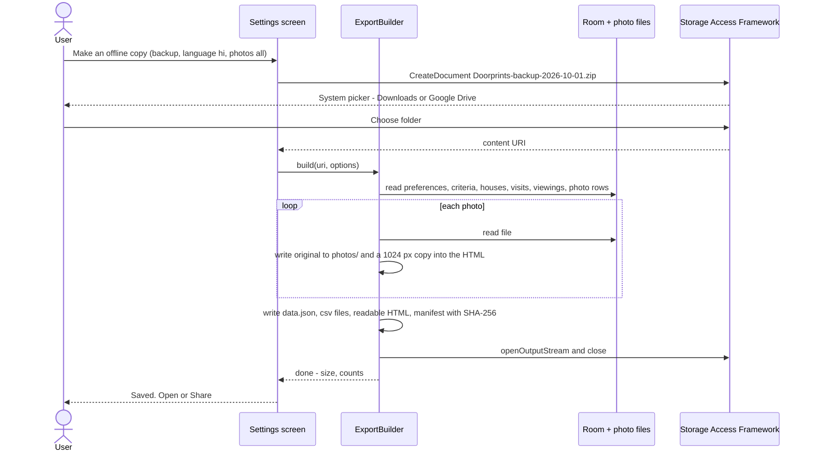
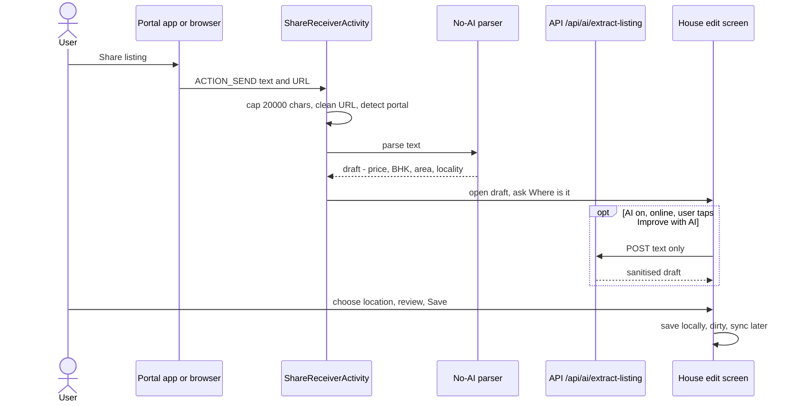
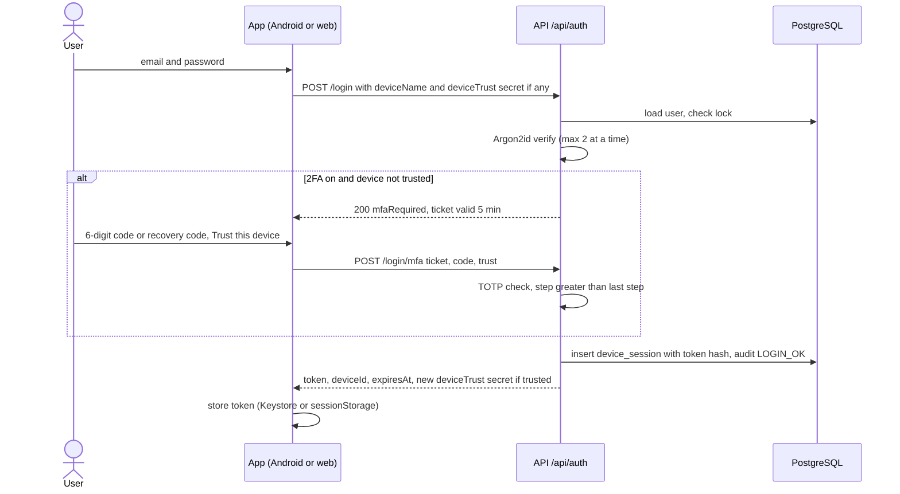
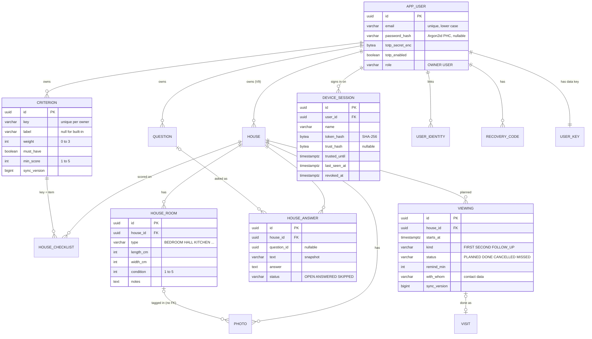

# 11: Feature parity (SeenHouse) and offline copy: specification

| Field | Value |
|---|---|
| Document | Feature parity and offline-copy export specification |
| Version | 0.1 |
| Date | 2026-09-22 |
| Author | Claude (Cowork) – Product/Architecture |
| Status | Draft, for product-owner review at Sprint 4 planning |

## Change log

| Version | Date | Author | Change |
|---|---|---|---|
| 0.1 | 2026-09-22 | Claude (Cowork) – Product/Architecture | First version. Product-owner (Sriram) decisions (A) parity with SeenHouse and (B) an offline copy of the user's data. Gap analysis against the code as of 2026-09-22 (Flyway V1–V3, Room v2, API-key auth), designs, user stories US-16..US-34, new requirement IDs FR-042..FR-076, NFR-021..NFR-028, SEC-031..SEC-051, PRV-012..PRV-018, Flyway V4..V11, API, UI, i18n/a11y, STRIDE additions, tests, and a phased plan (Sprint 4, Sprint 5, Sprint 6+). |

Related: [01 Requirements](01-requirements.md) · [02 Threat model](02-threat-model.md) · [03 Design](03-design.md) · [04 DFDs](04-data-flow-diagrams.md) · [05 UX/a11y/i18n](05-ux-accessibility-i18n.md) · [06 Test plan](06-test-plan.md) · [10 Sprint log](10-sprint-log.md) · [AI design](ai/ai-design.md)

> **Status of this document.** It is a proposal. It adds no code and changes no existing document (a rename is in
> progress in the other docs). When the product owner accepts it, the Docs team copies the accepted requirement
> rows into [01](01-requirements.md), the threat rows into [02](02-threat-model.md), the data model and API into
> [03](03-design.md), the flows into [04](04-data-flow-diagrams.md) and the tests into [06](06-test-plan.md)
> (section 16 lists what goes where). IDs here are reserved for that purpose.

---

## 1. Summary

| | |
|---|---|
| **Goal A** | Doorprints offers every feature SeenHouse (seenhouse.uk) offers, adapted to India and to zero running cost (CON-01). |
| **Goal B** | The user can make an **offline copy** of their data that stays readable without the app: one self-contained HTML file (read, print to PDF) plus a machine-readable backup (JSON + CSV + photos in one ZIP) that Doorprints can **re-import**. Android builds it on the phone from Room, with no server; the web builds it from server data. |
| **Result of the gap analysis** | 5 SeenHouse features are already there, 7 are partial, 10 are missing (section 2). The biggest gap is identity: Doorprints has one shared API key (ADR-03, F-01b open); SeenHouse has accounts with 2FA. |
| **Plan** | **Sprint 4:** offline copy (export + import), custom weighted criteria and ranking, viewing questions, rooms, photo tags, viewings with reminders and second viewings, Share to Doorprints, PWA install. **Sprint 5:** accounts, Argon2id, TOTP 2FA, trusted devices, Google sign-in, per-user authorization, encrypted photos. **Sprint 6+:** API-key mode removed, the earlier AI and map candidates. |
| **Decisions needed** | Section 15. The biggest one: is Doorprints a **public hosted service** (like SeenHouse) or **self-hosted for one family**? This decides open sign-up, email sending, photo storage and quota. |

## 2. Feature gap table

Status: **Have** = built and in [01](01-requirements.md); **Partial** = part is built; **Missing** = not built.

| # | SeenHouse feature | Doorprints today | Status | How we build it (India, zero cost) | New IDs | Sprint |
|---|---|---|---|---|---|---|
| G-01 | Property logging | Houses with location, price in ₹, BHK, status, contact, notes (FR-001, FR-002, FR-006) | Have | Add carpet area (sq ft) and "approximate location" for houses saved from a listing before a visit | FR-056, FR-065 | 4 |
| G-02 | Import from listing URL (Rightmove/Zoopla) with details filled in | `listing_url` field; AI fills a draft from **pasted text** (FR-038, AI-004); no URL import | Partial | **No server-side scraping** of MagicBricks, 99acres, NoBroker or Housing.com (their terms and robots rules; CON-05). Instead: Android **"Share to Doorprints"** (receive shared text + URL from the portal apps and browsers), PWA **Web Share Target**, and a paste box on the web. Fill the draft with the existing AI extractor (`/api/ai/extract-listing`, only when AI is on) or a **no-AI parser** on the device. Always store the listing URL; warn on duplicates. | FR-063..FR-066 | 4 |
| G-03 | Custom weighted scoring (own criteria, weights) | Fixed 10-item checklist 0–5, equal weights, 50/50 blend with stars (FR-004, FR-005) | Partial | User-defined criteria plus the 10 built-in ones, weights Ignore/Low/Medium/High plus a "must-have" flag. Default weights give **exactly** today's FR-005 score (section 4.2). | FR-048..FR-050 | 4 |
| G-04 | Automatic shortlist ranking by priorities | List sort by score (web `map.sort.score`, Android list) | Partial | "Ranking" view: must-have failures last, then weighted score, coverage, price | FR-051 | 4 |
| G-05 | Side-by-side comparison | Compare 2–4 houses (FR-011) | Have | Extend with weighted score, must-have flags, rooms and answers | FR-052 | 4 |
| G-06 | Searchable viewing history | Visits are recorded (FR-008); list search covers houses only | Partial | "Viewings" timeline (past visits and planned viewings) with search over house, street, locality, visit notes and answers, and date/type filters | FR-062 | 4 |
| G-07 | Photo capture with tagging to rooms/features | Photos (FR-007), no tags | Partial | Room link, fixed tag list (damp, crack, view, water tank, meter...) plus custom tags, caption; tags sync | FR-057 | 4 |
| G-08 | Notes | House notes (FR-002) | Have | Add notes per visit and per room | FR-058 | 4 |
| G-09 | Custom viewing question checklists | – | Missing | Question bank (India defaults: maintenance, deposit, water source, power backup, lock-in, pets, brokerage, OC/RERA for buyers...) and per-house answers | FR-053, FR-054 | 4 |
| G-10 | Viewing reminders and second-viewing scheduling | – (the AI planner orders a day's route, FR-039) | Missing | Planned viewings with reminders (Android local alarms, no server push), "Add to calendar" (intent / `.ics`), "Book a second viewing" that carries open questions forward | FR-059..FR-061 | 4 |
| G-11 | Room sizes and condition notes | – | Missing | Rooms per house: type, name, size (ft or m), condition 1–5, notes | FR-055, FR-056 | 4 |
| G-12 | Accounts: email + password sign-up (no postal address) | One shared API key (SEC-001, ADR-03) | Missing | `users` table, email + password, email verification if an email service is chosen (D-03) | FR-070, SEC-031..SEC-034 | 5 |
| G-13 | Google sign-in | – | Missing | Google OIDC (free): Credential Manager on Android, authorization-code flow with PKCE through the API on the web | FR-071, SEC-039 | 5 |
| G-14 | Two-factor authentication (TOTP) | – | Missing | RFC 6238 TOTP, 10 single-use recovery codes | FR-072, SEC-035..SEC-037 | 5 |
| G-15 | Argon2id password hashing | Not applicable (no passwords) | Missing | Spring Security `Argon2PasswordEncoder` (BouncyCastle), OWASP parameters | SEC-032 | 5 |
| G-16 | Encrypted photo storage at rest | Provider disk encryption only (03 §12); Android FBE | Partial | App-level AES-256-GCM, per-user data key wrapped by a master key from the environment, key rotation, crypto-shredding on account delete | SEC-044..SEC-046 | 5 |
| G-17 | Trusted device management | – (C-04 per-device keys open, F-01b) | Missing | Device sessions list with name, platform, last seen, "trust for 30 days", revoke, "sign out everywhere else". Replaces C-04. | FR-073, SEC-038 | 5 |
| G-18 | Mobile-first, installable (PWA), no app install | Responsive Angular web app; native Android app | Partial | `@angular/pwa`: manifest, icons, service worker for the app shell, install prompt, share target | FR-067..FR-069 | 4 |
| G-19 | Completely free | Zero running cost (CON-01), no ads, no payments | Have | Every choice here uses free tiers or on-device work (section 3) | – | – |
| G-20 | (Account) data export / deletion | JSON `GET /api/export`, `DELETE /api/data` (FR-031, FR-032), no app buttons (R-05) | Partial | Covered by Goal B and account deletion | FR-042..FR-047, FR-074 | 4, 5 |
| G-21 | Rate limiting / abuse protection on login | Per-address limits for the key (SEC-008) | Partial | Per-address and per-account limits on auth endpoints, lockout, Argon2 concurrency cap | SEC-040, SEC-041 | 5 |
| G-22 | **Goal B: offline copy** (not a SeenHouse feature) | JSON export only, photos as URLs, no import | Partial | Section 4.1 | FR-042..FR-047 | 4 |

Doorprints keeps its lead where SeenHouse has nothing: Hunt mode (FR-013..FR-018), full offline Android app,
map, AI assistant, four Indian languages.

## 3. Principles for this work

| # | Principle |
|---|---|
| P-1 | **Zero cost.** On-device work first (parsing, export, reminders, ranking). No paid APIs, no server push service, no scraping service. New third parties only when free and disclosed (PRV-007). |
| P-2 | **Offline-first stays.** Every Sprint 4 feature works on Android with no network (NFR-004 extends to FR-042..FR-061). The web stays online-first. |
| P-3 | **Backward compatible sync.** Old clients must not wipe new data: a **missing (null) collection in a PUT means "unchanged"**, an empty array means "clear" (NFR-025). New fields are optional. |
| P-4 | **Same formula everywhere.** Scoring, ranking and the no-AI parser have shared test-vector files that the Android and web tests both run. |
| P-5 | **Your data, your copy.** Export is always available, needs no server on Android, and is readable without Doorprints. |
| P-6 | **No new PII on the server without a reason.** Accounts add email and (optionally) Google subject only. No postal address, no phone of the user, no geo-IP. |

## 4. Feature designs

### 4.1 Offline copy: export and re-import (Goal B)

**Two products, one screen** ("Make an offline copy" in Android Settings and the web Account/Data page):

| Output | File | Contents | For |
|---|---|---|---|
| **Readable copy** | `Doorprints-<yyyy-mm-dd>.html` | One self-contained HTML file: inline CSS, **no JavaScript**, photos as `data:` URIs (resized to 1024 px, JPEG quality 70), a strict CSP `<meta>` (`default-src 'none'; img-src data:; style-src 'unsafe-inline'`). Sections: cover (date, counts, language, options used, privacy note), ranking table, then one page per house (`#house-<id>`): details, weighted score breakdown with weights, checklist, rooms, questions and answers, visits and planned viewings, notes, photos with tags and captions, contact (optional). `@media print` puts each house on a new page. | Reading and printing (Print → Save as PDF) on any phone or laptop, with or without Doorprints |
| **Full backup** | `Doorprints-backup-<yyyy-mm-dd>.zip` | `manifest.json`, `data.json`, `csv/*.csv`, `photos/<photoId>.<ext>` (original stored size), **and** the readable copy `Doorprints-<date>.html` | Re-import into Doorprints, spreadsheets, long-term archive |

**Options** (remembered per device):

| Option | Values | Default | Note shown |
|---|---|---|---|
| Photos | All · Shortlisted houses only · None | All (readable copy: resized; backup: stored size) | Estimated size shown before export; warning above 100 MB for the HTML file |
| Contact details (owner/broker names and phones) | Include · Leave out | **Include** (it is the user's own copy) | "This copy contains phone numbers of owners and brokers. Keep it private; choose *Leave out* before sharing it with anyone." (PRV-012) |
| Language of the readable copy | en · hi · ta · te | App language | Labels, dates (`en-IN`/locale), ₹ with lakh/crore grouping |
| Include deleted/rejected houses | Rejected: yes/no; tombstones: never | Rejected: yes | – |

**Backup format `doorprints-backup/1`** (new; the old `house-hunt-export/1` from `GET /api/export` stays as it is):

| File | Content |
|---|---|
| `manifest.json` | `format`, `formatVersion`, `appVersion`, `platform` (android/web), `exportedAt`, `language`, `options`, `counts`, `files[{path, sha256, bytes}]` |
| `data.json` | `preferences`, `criteria[]`, `questions[]` (bank), `houses[]` (HouseDto v2 with `checklist`, `rooms[]`, `answers[]`), `visits[]`, `viewings[]`, `photos[]` (metadata incl. `roomId`, `tags`, `caption`, `file`) |
| `csv/houses.csv`, `csv/scores.csv`, `csv/rooms.csv`, `csv/answers.csv`, `csv/visits.csv`, `csv/viewings.csv`, `csv/photos.csv` | UTF-8 **with BOM** (Excel shows Indic scripts), RFC 4180 quoting, formula-injection guard (SEC-048), header row in English keys (stable for tools) |
| `photos/` | One file per live photo, EXIF-free (PRV-008) |

**Where the copy is built**

| | Android | Web |
|---|---|---|
| Source | Room + `filesDir/photos` on the phone; **works with no server and no network** | Server data: `GET /api/backup/data` + `GET /api/photos/{id}` |
| Builder | `ExportBuilder` (Kotlin): streams into `ZipOutputStream`; HTML written with a small escaping template (no WebView); photos resized one at a time | `export.service.ts`: `fflate` (MIT, streaming ZIP) in a Web Worker; HTML from the same template structure and the web i18n |
| Save | **Storage Access Framework**: `ActivityResultContracts.CreateDocument` (user picks Downloads, Google Drive, SD card...), write via `ContentResolver.openOutputStream`; or **share sheet** via the existing `FileProvider` (`cache/exports/`, deleted after 24 h) | Download (`<a download>`); Chromium: `showSaveFilePicker` streams to disk for large files |
| Survives uninstall | Yes: SAF targets are user storage, never `getExternalFilesDir` (FR-044 AC) | Yes (a normal download) |
| Progress | Progress dialog with cancel; long runs use a WorkManager job with a foreground notification (`FOREGROUND_SERVICE_DATA_SYNC`, Android 14+) | Progress bar; cancel |
| Optional scheduled backup | Weekly WorkManager job to a folder chosen once with `OpenDocumentTree` (persisted URI permission), keeps the last 4 files, only when charging, off by default (FR-045, D-06) | Not offered (no background work in a web page) |

**Re-import** (`Import backup` on Android and web):

1. Pick a `.zip` (SAF `OpenDocument` / file input). 2. Validate (SEC-047): `manifest.format == doorprints-backup`,
   `formatVersion ≤ supported`, SHA-256 of each file, entry count ≤ 5 000, total uncompressed ≤ 1 GB, no `..`/absolute
   paths (zip slip), every record through the same validation as the API DTOs. 3. **Preview**: "*N* houses (*a* new,
   *b* newer in the file, *c* newer here), *P* photos". 4. **Merge** by UUID, last-write-wins on `updatedAt` (as sync,
   ADR-04); records newer on the device are kept. Option "Import as a copy" gives every record a new UUID (for loading
   someone else's shared backup). 5. Imported rows are `dirty` and sync as usual.
   The web imports in the browser (unzip with `fflate`) and sends records with **`POST /api/import/batch`** (≤ 50
   houses or 200 visits/viewings per call) and photos with the existing upload endpoint, so no request exceeds free-tier
   request size limits.

### 4.2 Custom weighted criteria and ranking

| Item | Design |
|---|---|
| Criterion | `key` (built-in: `water`..`commute`, unchanged; custom: `c_<8 hex>`), `label` (null for built-ins, which stay translated; user text for custom), `weight` 0 Ignore · 1 Low · 2 Medium · 3 High, `mustHave` (bool), `minScore` (1–5, default 3), `sort`, `archived`. At most 40 criteria (built-in included). |
| Scores | Still `house_checklist(item, score 0–5)`; `item` = criterion key. The API already accepts any key ≤ 100 chars (`HouseDto.checklist`), so **no change to existing rows**. |
| Weighted checklist | `wc = Σ(wᵢ·sᵢ) / Σ(wᵢ)` over criteria with a score and `wᵢ > 0`; null when none. |
| Overall score | `overall = (1 − r)·wc + r·rating` when both exist, else whichever exists; `r` = preference `score.ratingShare`, default **0.5**. |
| Compatibility | Migration seeds the 10 built-ins with weight 2 and `mustHave = false`: with equal weights and `r = 0.5` the result is **identical to FR-005**. Test vectors check this (TC-U-22). |
| Coverage | `Σ wᵢ (scored) / Σ wᵢ (all > 0)`, shown as "scored 7 of 10 that matter". |
| Must-have | A house fails when any must-have criterion has a score below `minScore`. An unscored must-have is "not checked yet", not a failure. |
| Ranking | Scope: SHORTLISTED (toggle: + NEW). Order: (1) no failed must-have first, (2) `overall` desc (null last), (3) coverage desc, (4) price asc, (5) `updatedAt` desc. Computed on the client (Room/web); no server endpoint needed. |
| Old clients | Android stores the checklist as a JSON map and web as a `Record`, so custom keys round-trip; to verify in TC-I-23 before release. |

### 4.3 Viewing question checklists

| Item | Design |
|---|---|
| Question bank | `question`: `text` (≤ 300), `category` (Money, Water & power, Rules, Building, Legal (buy), Other), `appliesTo` RENT/SALE/BOTH, `defaultOn`, `sort`, `archived`. Seeded on first run from translated defaults in the user's language (the text is then user data and is not re-translated). |
| India defaults (examples) | Maintenance per month and what it covers · Deposit (months) and refund terms · Lock-in and notice period · Water source (corporation, borewell, tanker) and hours · Power backup (full/lift only) · Pets / bachelors / non-veg rules · Brokerage · Parking slot allotted? · Which floor, lift? · Buy: OC and CC received? RERA registration number? Khata / property tax paid? |
| Per house | `answers[]` embedded in `HouseDto`: `{id, questionId?, text (snapshot), answer (≤ 2 000), status OPEN/ANSWERED/SKIPPED, sort}`. The snapshot keeps the copy readable if the bank question is deleted. Ad-hoc questions for one house are allowed (`questionId` null). |
| At a viewing | "Questions to ask" card on the house screen and in the viewing reminder; open questions first; large touch targets for one-handed use. |

### 4.4 Rooms with sizes and condition

`rooms[]` embedded in `HouseDto`: `{id, type (BEDROOM, HALL, KITCHEN, BATHROOM, BALCONY, POOJA, STUDY, UTILITY, STORE, OTHER), name (≤ 60), lengthCm, widthCm (0–5 000), condition 1–5 (null = not checked), notes (≤ 2 000), sort}`.
Display in feet (default, India) or metres (preference `units.length`); area in sq ft or m². At most 30 rooms per house.
House gets `areaSqft` (carpet area as the user writes it). Sizes are stored in centimetres so the unit choice never loses precision.

### 4.5 Photo tags

Photo metadata: `roomId` (a room of the same house or null), `tags` (≤ 10; fixed keys `EXTERIOR, ENTRANCE, KITCHEN_FITTINGS, BATHROOM_FITTINGS, DAMP, CRACK, LEAK, VIEW, WATER_TANK, METER, PARKING, LIFT, GOOD_POINT, PROBLEM` translated in the UI, plus custom tags ≤ 30 chars), `caption` (≤ 200).
Edited with `PUT /api/photos/{id}/meta` (LWW on `metaUpdatedAt`, new `sync_version`), carried in the photo change feed.
A `roomId` that no longer exists is shown as "untagged" (no foreign key, so photos may sync before the house).

### 4.6 Viewings: schedule, reminders, second viewing, history

| Item | Design |
|---|---|
| Planned viewing | New entity `viewing`: `houseId`, `startsAt`, `durationMin` (default 30), `kind` FIRST/SECOND/FOLLOW_UP, `status` PLANNED/DONE/CANCELLED/MISSED, `remindMin` (default 60; 0 = none), `withWhom` (free text, e.g. "broker"; treated as contact data), `notes`, `visitId` (set when done). |
| Link to visits | When Hunt mode records an AUTO or MANUAL visit at the house within ±2 h of a planned viewing, the app offers "Mark viewing done". Visits get `notes` and `viewingId`. |
| Reminders, Android | `AlarmManager.setWindow` (10-minute window, no exact-alarm permission), rescheduled on `BOOT_COMPLETED`, time and time-zone change; notification `VISIBILITY_PRIVATE` with a redacted public version (SEC-022 pattern); actions: Open house, Directions (Maps intent, user tap only), Questions. Works offline, no server push (out of scope in 01 §11.3). |
| Reminders, web/PWA | In-app "Upcoming" list and an `.ics` download per viewing (built in the browser). Web Push is **not** in Sprint 4 (needs a push service subscription and VAPID keys; D-07). |
| Calendar | Android "Add to calendar": `Intent(ACTION_INSERT, CalendarContract.Events.CONTENT_URI)`, no calendar permission; the event title is the house label (the user sees and edits it). |
| Second viewing | After a viewing is DONE: "Book a second viewing?" pre-fills kind SECOND and a "re-check" list = open questions + criteria scored ≤ 2 + photos tagged PROBLEM. |
| History | "Viewings" screen: timeline of visits and viewings, search (house label, street, locality, visit notes, answers), filters (date range, kind, status). Room `LIKE` queries are enough for ≤ 1 000 houses (AS-05). |

### 4.7 Share to Doorprints (listing import for Indian portals)

| Item | Design |
|---|---|
| Why not URL fetching | Fetching portal pages from our server would be automated scraping. MagicBricks, 99acres, NoBroker and Housing.com restrict it in their terms/robots rules, pages need JavaScript, and a free-tier IP would be blocked. **Doorprints never fetches the listing page** (keeps 01 §11.3 "scraping property portals" out of scope). |
| Android | New activity `ShareReceiverActivity` (exported, `ACTION_SEND`, `text/plain`) receives `EXTRA_TEXT` / `EXTRA_SUBJECT` from portal apps and browsers. Text is capped at 20 000 chars and treated as untrusted (SEC-049). |
| Parse | (1) First `https://` URL → `listingUrl` (tracking parameters `utm_*`, `fbclid`, `gclid` removed); portal recognised by host allowlist (`magicbricks.com`, `99acres.com`, `nobroker.in`, `housing.com`) → source label. (2) **No-AI parser** (Kotlin and TypeScript, same fixtures): price (`₹ 25,000`, `25k`, `45 Lac`, `1.2 Cr`, `/month`), RENT/SALE words, BHK (`2 BHK`, `2BHK`, `2 bedroom`), area (`1200 sq ft`, `sqft`), locality (`in <X>, <City>`), furnishing. Phone numbers are **not** auto-filled from shared text (PRV-013). (3) If AI is on and online, the user may tap "Improve with AI" → `POST /api/ai/extract-listing` with the text (never the URL fetched); the result goes through `DraftSanitizer` as today (AI-004, AI-005). |
| Location | Portal share text rarely has coordinates, and a house needs `lat/lon`. The draft asks "Where is it?": current location · pick on map · look up the locality (Android Geocoder, on the user's tap; already disclosed in PRV-007). Houses saved this way get `locationSource = APPROX` and a hollow marker, and **do not trigger Hunt-mode alerts** until the user confirms the location (FR-065). |
| Duplicates | Same normalised `listingUrl` or same label within 100 m → "You saved this on 12 Sep. Open it?" |
| Web / PWA | Manifest `share_target` (GET `/share?title&text&url`, Chromium on Android when the PWA is installed) and a "Paste a listing link or text" box on the new-house page run the same parser. |
| Nothing is saved until the user presses Save | Same rule as AI-004. |

### 4.8 PWA install (web)

| Item | Design |
|---|---|
| Setup | `ng add @angular/pwa` (Angular 22): `manifest.webmanifest` (name Doorprints, `display: standalone`, theme colours from the design tokens, icons 192/512 + maskable), `ngsw-config.json`, `provideServiceWorker('ngsw-worker.js', { enabled: !isDevMode(), registrationStrategy: 'registerWhenStable:30000' })`. |
| Caching | `assetGroups`: app shell (index, main bundles, CSS, i18n, MapLibre worker) **prefetch**; lazy page chunks **lazy**. **No `dataGroups` for the API**: responses hold personal data, the API origin is chosen at run time and requests carry a key or token (SEC-050). No map-tile caching (OpenFreeMap fair use). Offline, the PWA opens, shows "You are offline" and the Connect/Login page; data needs the network (Android is the offline app). |
| Updates | `SwUpdate.versionUpdates` → "A new version is ready. Reload". |
| Install prompt | Chromium: capture `beforeinstallprompt`, show "Install app" in the menu (never a pop-up on first visit). iOS Safari: a help sheet "Share → Add to Home Screen". |
| Headers | `web/public/_headers`: `/ngsw.json` and `/ngsw-worker.js` → `Cache-Control: no-cache` (today `/*.js` is immutable for a year), `/manifest.webmanifest` → `no-cache`. CSP already allows `worker-src 'self'`. `Permissions-Policy: camera=()` stays: photo capture uses `<input type="file" accept="image/*" capture="environment">`, which opens the system camera; to verify on Chrome Android (TC-M-15). GitHub Pages cannot set headers (07). |
| Sign-out | Clears Cache Storage entries written by the app (none with data) and session/local storage. |

**PWA or Android app?**

| Need | Android app | PWA |
|---|---|---|
| Hunt mode (foreground location, alerts, stay detection) | Yes | No (no background location on the web) |
| Full offline work and on-device export | Yes | No (online; export needs the server) |
| iPhone, laptop, family members, "no install" | No | Yes |
| Reminders | Local notifications | In-app list + `.ics` (Web Push later, D-07) |
| Share from portal apps | Share sheet | Share target (Android Chromium, installed PWA only) |

Positioning: **the Android app is for the hunt, the PWA is for everyone and everything else.** Both share the server and the data format.

### 4.9 Accounts and per-user data (Sprint 5)

| Topic | Design |
|---|---|
| Model | `app_user` (email lower-cased, unique; `password_hash` PHC string, null for Google-only users; `email_verified`; `locale`; `totp_secret_enc`; `totp_enabled`; `totp_last_step`; `failed_logins`; `locked_until`; `role` OWNER/USER). `user_identity` (provider `google`, `subject`, unique pair). No postal address, no phone. |
| Ownership | `owner_id uuid` on `house`, `visit`, `photo`, `criterion`, `question`, `viewing`, `preference`, `vector_store` metadata; child tables inherit through `house`. Every repository query filters by the caller's `owner_id`; access to another user's ID returns **404** (not 403). The shared `sync_seq` stays (per-user cursors tolerate gaps); the advisory lock becomes per user (`pg_advisory_xact_lock(hashtext(owner_id))`, R-08). RAG retrieval and MCP tools add an `ownerId` metadata filter (AI team). Optional defence in depth: Postgres row-level security with `SET LOCAL app.user_id` (D-09). |
| Tokens | **Opaque bearer tokens** (`dp_` + 256-bit random), stored as SHA-256 in `device_session`; `Authorization: Bearer`. Looked up per request with a 60 s in-memory cache (revocation effective ≤ 60 s). Lifetime: Android 90 days sliding (background sync must survive days offline), web 30 days sliding with "remember this device", else session only. No JWT: revocation and device listing need the table anyway. |
| Web token storage | `sessionStorage` by default, `localStorage` only with "remember this device" (same as today's key, SEC-010). HttpOnly cookies are not possible without a shared site (Cloudflare Pages `*.pages.dev` and Render `*.onrender.com` are different sites); a Cloudflare Pages Function proxy would make it same-origin (free tier, D-10). |
| Android token storage | AES-256-GCM with an Android Keystore key (as `ApiKeyCipher` today), excluded from backups (SEC-011). |
| Passwords | `Argon2PasswordEncoder(16, 32, 1, 19456, 2)` (salt 16 B, hash 32 B, p = 1, m = 19 MiB, t = 2: OWASP minimum). Needs `org.bouncycastle:bcprov-jdk18on` on the classpath; **to verify** against the Spring Security version in Spring Boot 4.1 and add a contract test with a known PHC string. Hashing limited to 2 concurrent (semaphore) to protect the 512 MB heap (NFR-010). Minimum 10 characters, max 128, no composition rules, checked against a bundled top-10 000 common-password list (no third-party call). `upgradeEncoding` rehashes on login when parameters change. |
| 2FA (TOTP) | RFC 6238: SHA-1, 6 digits, 30 s, ±1 step, replay blocked with `totp_last_step`. 160-bit secret, encrypted with the data key (4.10). Enrolment: QR (server renders SVG with ZXing core, Apache-2.0) + text secret; confirm with a code; then **10 recovery codes** (10 base32 chars each, shown once, stored hashed, single use). Disabling 2FA needs password + code. Own ~60-line implementation tested with the RFC 6238 vectors (fewer dependencies) or a small MIT library (backend lead). |
| Trusted devices | Each sign-in creates a `device_session` (name "Pixel 7 · Android app" or browser + OS, editable; created; last seen, day precision; kind). "Trust this device for 30 days" skips the 2FA step on the next sign-in from that device (a separate device-trust secret, hashed). List, rename, revoke one, "sign out everywhere else". Password change and 2FA reset revoke all other sessions. |
| Google sign-in | OIDC, free. **Android:** Credential Manager + Sign in with Google → ID token → `POST /api/auth/google`. **Web:** authorization code + PKCE + `state` + `nonce` through the API (`/api/auth/google/start` → Google → `/api/auth/google/callback` → redirect to the SPA with a one-time code, exchanged for a token); no Google JavaScript on our pages, so the web CSP does not change. ID token checks: signature (Google JWKS), `iss`, `aud` ∈ our client IDs, `exp`, `nonce`, `email_verified`. **No automatic linking** to an existing password account with the same email: the user signs in with the password and links Google in Account settings. Needs a free Google Cloud OAuth client and consent screen (basic scopes `openid email profile` only). |
| Sign-up and email | `APP_SIGNUP` = `closed`, `invite` or `open` (default `invite`: the owner creates single-use invite links for family). Email verification and password reset need an email sender (free tier, e.g. an SMTP relay with a daily free quota) → **D-03**. Without email: no reset by email; recovery codes and the owner resetting a family member's password. |
| Rate limits | See SEC-040: login 5/min per address and 10 failures per account → 15 min lock (message does not reveal whether the account exists; unknown emails hash a dummy password for equal timing); sign-up 3/h per address; 2FA 5 attempts per MFA ticket; recovery 5/h per account. |
| Account deletion | `DELETE /api/account` with password (+ TOTP when on): offers the offline copy first; hard-deletes owned rows, photos, embeddings, sessions and the user's data key (crypto-shredding makes photo bytes in old DB backups unreadable); audit rows are anonymised. Immediate or 7-day grace → D-08. |
| Audit | `audit_event` (login ok/fail, 2FA on/off, recovery code used, device revoked, password changed, export, account deleted) with salted address hash (SEC-016 rule), 90-day retention. Shown to the user as "Recent security activity". |
| Migration from API-key mode | `app.auth.mode` = `api-key`, `both` or `accounts`. Release 1 (Sprint 5) deploys `both`: V8/V9 add users and nullable `owner_id`. **Claim:** `POST /api/auth/claim` with the current `X-API-Key` + email + password creates the OWNER and assigns every row with `owner_id IS NULL` to them in one transaction; only possible while no OWNER exists. In `both` mode the API key acts as the OWNER (old Android builds keep syncing). Release 2 (Sprint 6): V11 sets `owner_id NOT NULL`, mode `accounts`, `APP_API_KEY` no longer accepted. |
| Android offline-first | The app works with no account (local only), as today without a server. Signing in is needed only to sync. The phone remembers the account ID it synced with; signing in as a **different** account asks: "Upload this phone's houses to the new account" or "Start empty (make an offline copy first)". A revoked or expired token pauses sync with a "Sign in again" notification; local changes stay dirty and are not lost. |

### 4.10 Encrypted photos at rest (Sprint 5)

| Item | Design |
|---|---|
| Scheme | Envelope encryption. **KEK** (master key) 256-bit from `APP_DATA_KEY` (base64, env var / host secret store; free, no KMS), with a key ID. **DEK** per user (random 256-bit) stored in `user_key` wrapped by the KEK (AES-256-GCM). Each photo: AES-256-GCM with the user's DEK, random 96-bit nonce, **AAD = photo id ‖ house id ‖ owner id** (a row cannot be swapped). Columns `enc_version`, `key_id`, `nonce`. TOTP secrets use the same scheme. |
| Rotation | KEK: set `APP_DATA_KEY_NEXT`, a job re-wraps all DEKs (seconds), then swap (same drill as `APP_API_KEY_NEXT`, 08 §5.1). DEK: re-encrypt job per user, batches of 50 photos, only on suspicion of compromise. |
| Migration | V10 adds the columns; a scheduled job encrypts existing plaintext photos in batches (`enc_version 0 → 1`), resumable; reads handle both versions. |
| Loss | Losing `APP_DATA_KEY` loses every photo, including in backups. The runbook must store it in the owner's password manager, separate from DB backups (08 §5). |
| Android | Photos stay in app-private `filesDir` under file-based encryption (AS-02), excluded from cloud backup (SEC-011). No extra app-level encryption on the phone (Jetpack Security Crypto is deprecated; cost in speed and complexity; D-11). |
| Object storage | If photos move out of `bytea` (ADR-08, D-02), the same ciphertext goes to the object store unchanged. |

## 5. User stories

Continues [01 §5](01-requirements.md#5-user-stories) (US-01..US-15).

| ID | As a... | I want to... | So that... | Acceptance criteria (summary) | Req | Sprint |
|---|---|---|---|---|---|---|
| US-16 | hunter | save a readable copy of everything to Downloads or Google Drive | I still have my notes and photos if I uninstall the app or lose the server | Works in flight mode on Android; file opens in Chrome on another device with the app not installed; every house, score, room, answer, visit and photo is there; language as chosen; prints one house per page | FR-042, FR-044 | 4 |
| US-17 | hunter | make a full backup and load it again on a new phone or the web | I can move or restore my hunt | Export → factory-fresh install → import gives the same houses, scores, rooms, answers, viewings, photos and tags; records newer on the device are kept; nothing is duplicated when importing twice | FR-043, FR-047 | 4 |
| US-18 | hunter | choose whether owner/broker phone numbers go into the copy | I can share a copy with family safely | "Leave out" removes contact name, phone and `withWhom` from HTML, JSON and CSV; the default "Include" shows the privacy note | FR-042, PRV-012 | 4 |
| US-19 | hunter | add my own criteria ("near my parents", "school bus stop") and say how much each matters | the score reflects what my family cares about | Up to 40 criteria; weights Ignore/Low/Medium/High; built-in labels stay translated; with default weights the score equals today's score | FR-048, FR-049 | 4 |
| US-20 | hunter | mark a criterion as a must-have | houses that fail it drop to the bottom of my shortlist | A must-have scored below its minimum marks the house "Fails: water" and ranks it after all others | FR-050, FR-051 | 4 |
| US-21 | hunter | see my shortlist ranked automatically | I know which house is best at a glance | Ranking view with rank, score, coverage and must-have status; updates as soon as a score or weight changes; works offline | FR-051 | 4 |
| US-22 | hunter | keep a list of questions to ask at every viewing and record the answers | I don't forget to ask about maintenance, deposit or water | Default India questions in my language; add/edit/reorder/hide; per-house answers with Open/Answered/Skipped; open questions shown first | FR-053, FR-054 | 4 |
| US-23 | hunter | note each room's size and condition | I can compare space and repair work later | Rooms with type, name, size in ft or m, condition 1–5, notes; total area shown; up to 30 rooms | FR-055, FR-056 | 4 |
| US-24 | hunter | tag photos with the room and what they show (damp, crack, view) | I can find the photo of the leaking bathroom | Tag while capturing or later; filter a house's photos by room and tag; tags in the offline copy | FR-057 | 4 |
| US-25 | hunter | schedule a viewing and get a reminder | I arrive on time with my questions ready | Reminder at the chosen time before the viewing, even offline and after a reboot; lock screen shows no address | FR-059, FR-060, PRV-016 | 4 |
| US-26 | hunter | book a second viewing of a house I liked | I re-check what I wasn't sure about | "Book a second viewing" after a done viewing; the re-check list holds open questions, low scores and problem photos | FR-061 | 4 |
| US-27 | hunter | search all my past viewings | I can find "the one with the big balcony in Madhapur" | Search by house, street, locality, visit notes and answers; filter by date and type | FR-062 | 4 |
| US-28 | hunter | share a listing from the MagicBricks, 99acres, NoBroker or Housing.com app to Doorprints | I don't retype price, BHK and area | Doorprints appears in the share sheet; a draft with URL, price, BHK and area opens; nothing saved until I press Save; works offline without AI | FR-063..FR-066 | 4 |
| US-29 | family member | install Doorprints from the browser on my iPhone or laptop | I can look at the shortlist without installing an APK | Add to home screen works on Chrome Android, Samsung Internet, iOS Safari and desktop Chrome/Edge; opens standalone; offline shows a clear message | FR-067..FR-069 | 4 |
| US-30 | hunter | sign up with only my email and a password, or with Google | I have my own account and my family has theirs | No postal address or phone asked; Google button where configured; data of one account is never visible to another | FR-070, FR-071, SEC-042 | 5 |
| US-31 | hunter | turn on two-step verification with an authenticator app | nobody can get in with just my password | QR + text key; recovery codes shown once; code asked on new devices; 30-day "trust this device" | FR-072, FR-073 | 5 |
| US-32 | hunter | see and revoke the devices signed in to my account | a lost phone cannot sync my data | List with name, platform, last seen; revoke takes effect within 60 s; "sign out everywhere else" | FR-073, SEC-034 | 5 |
| US-33 | hunter | delete my account after the hunt | nothing about me stays on the server | Offer to make an offline copy first; after deletion nothing can be read back, photo bytes in old backups cannot be decrypted | FR-074, PRV-015 | 5 |
| US-34 | operator | turn my existing single-key server into an account without losing data | I keep my houses | Claim with the old key once; all rows belong to me; old Android builds keep syncing until I switch the key off | FR-075 | 5 |

## 6. New requirements (proposed for 01)

Priorities: M = must, S = should, C = could (as in 01).

### 6.1 Functional

| ID | Requirement | Pri | Sprint |
|---|---|---|---|
| FR-042 | The user can create a **readable copy**: one self-contained HTML file (no scripts, no external resources) with every live house, its weighted score breakdown, checklist, rooms, questions and answers, visits, viewings, notes, photos (resized, embedded) with tags and captions, and (optional) contact details, in the chosen language, printable with one house per page. | M | 4 |
| FR-043 | The user can create a **full backup** ZIP in format `doorprints-backup/1`: `manifest.json` (with SHA-256 per file), `data.json`, CSV files, photos and the readable copy (section 4.1). | M | 4 |
| FR-044 | Android builds FR-042/FR-043 **on the device from Room without a network or server** and saves it with the Storage Access Framework (user-chosen location) or the share sheet. Files are never written to app-specific storage that is removed on uninstall. Options: photos (all / shortlisted / none), contact details (include / leave out), language. | M | 4 |
| FR-045 | Android can make an automatic backup weekly to a folder the user chose once, keeping the last 4 (configurable 1–10); off by default; runs only while charging; failure shows a notification. | C | 4 (stretch) |
| FR-046 | The web builds FR-042/FR-043 in the browser from `GET /api/backup/data` and the photo endpoint, with progress and cancel, and downloads the file. | M | 4 |
| FR-047 | The user can **import** a `doorprints-backup/1` ZIP on Android and the web: validate, preview counts, merge by UUID with last-write-wins (default) or import as a copy with new IDs; imported data then syncs as usual. Importing the same file twice changes nothing. | M | 4 |
| FR-048 | The user can add, rename, reorder, archive and weight **criteria** (built-in 10 plus up to 30 custom); weights Ignore (0), Low (1), Medium (2), High (3). Criteria sync across devices. | M | 4 |
| FR-049 | The overall score is the **weighted** checklist mean blended with the star rating by `score.ratingShare` (default 0.5), section 4.2. With default weights it equals FR-005. FR-005 is amended accordingly. | M | 4 |
| FR-050 | A criterion can be a **must-have** with a minimum score (default 3); a house scoring below it on any must-have is marked as failing. | S | 4 |
| FR-051 | A **Ranking** view orders shortlisted houses (optionally also NEW) by the rules in section 4.2 and shows rank, score, coverage and failed must-haves. Works offline on Android. | M | 4 |
| FR-052 | Compare (FR-011) also shows the weighted score, must-have status, rooms (count, total area) and answers side by side. | S | 4 |
| FR-053 | The user has a **question bank** seeded with translated India defaults; add, edit, reorder, hide; filter by RENT/SALE. | M | 4 |
| FR-054 | Each house has **answers** to the bank questions (and ad-hoc questions): answer text, status Open/Answered/Skipped; the question text is kept with the answer. | M | 4 |
| FR-055 | Each house has up to 30 **rooms**: type, name, length and width, condition 1–5, notes. | M | 4 |
| FR-056 | The house has a carpet area in sq ft; sizes display in feet or metres (preference `units.length`), area in sq ft or m². | S | 4 |
| FR-057 | A photo can be linked to one room of its house and carry up to 10 **tags** (fixed list + custom) and a caption; the house gallery filters by room and tag. | M | 4 |
| FR-058 | Visits get **notes**; rooms and answers have their own notes (FR-054, FR-055). | S | 4 |
| FR-059 | The user can **plan a viewing** (date, time, duration, kind, who with, notes) and mark it done, cancelled or missed; a visit near the planned time can be linked to it. | M | 4 |
| FR-060 | Android **reminds** the user before a planned viewing (default 60 min, configurable, per viewing) with local notifications that survive reboot and work offline; the web shows upcoming viewings and offers an `.ics` file; Android offers "Add to calendar". | M | 4 |
| FR-061 | After a viewing is done, the user can **book a second viewing** with a re-check list (open questions, criteria scored ≤ 2, photos tagged PROBLEM). | S | 4 |
| FR-062 | A **Viewings** screen lists visits and viewings as a timeline with search (house label, street, locality, visit notes, answers) and filters (date range, kind, status). | M | 4 |
| FR-063 | Android receives **shared text/URLs** (`ACTION_SEND`, `text/plain`) and opens a new-house draft filled by the on-device no-AI parser; the listing URL is stored without tracking parameters; the portal is recognised for MagicBricks, 99acres, NoBroker and Housing.com. The app never fetches the listing page. | M | 4 |
| FR-064 | With AI on and a network, the draft screen offers "Improve with AI", which sends only the shared text to `/api/ai/extract-listing` (AI-004, AI-005 apply). | S | 4 |
| FR-065 | A house saved without a GPS or map position has `locationSource = APPROX`, is drawn as a hollow marker and is excluded from Hunt-mode alerts (FR-013) until the user confirms its position. `locationSource` values: GPS, MAP, GEOCODED, APPROX. | M | 4 |
| FR-066 | Saving a listing whose normalised URL already exists, or a house with the same label within 100 m, warns and offers to open the existing house. | S | 4 |
| FR-067 | The web app is an installable **PWA** (manifest, icons, service worker for the app shell, install button, iOS help). | M | 4 |
| FR-068 | The installed PWA is a **share target** (`/share?title&text&url`) using the same parser as FR-063; the new-house page has a "Paste a listing" box. | S | 4 |
| FR-069 | The PWA shows an offline message instead of a broken page, and an update prompt when a new version is deployed. | S | 4 |
| FR-070 | Users can **sign up and sign in** with email and password (no postal address or phone), sign out, change password, and (if email is configured, D-03) verify email and reset the password. Sign-up mode closed / invite / open. | M | 5 |
| FR-071 | Users can sign in with **Google** (OIDC) on Android and the web when the operator configures a client ID; linking to an existing password account is explicit. | S | 5 |
| FR-072 | Users can turn on **TOTP two-step verification** with 10 single-use recovery codes, regenerate codes, and turn it off with password + code. | M | 5 |
| FR-073 | Users can see **signed-in devices**, trust a device for 30 days (skips the 2FA step), rename, revoke one, and sign out all others. | M | 5 |
| FR-074 | Users can **delete their account** after re-authentication; the app offers an offline copy first (D-08: immediate or 7-day grace). | M | 5 |
| FR-075 | The operator can **claim** an existing API-key installation: the first OWNER created with the current key receives all existing data; `app.auth.mode` api-key, both or accounts controls the transition. | M | 5 |
| FR-076 | Android works without an account (local only) and binds its local data to the account it first syncs with; switching accounts asks whether to upload local data or start empty; an expired or revoked session pauses sync without losing local changes. | M | 5 |

### 6.2 Non-functional

| ID | Category | Requirement | Measure / target | Pri |
|---|---|---|---|---|
| NFR-021 | Performance | Export on the phone | Full backup of 1 000 houses and 2 000 photos in ≤ 3 min on a mid-range phone, with at most +64 MB heap (streaming, one photo in memory at a time); readable copy of 100 houses with 400 photos ≤ 60 MB | S |
| NFR-022 | Portability | The readable copy opens without Doorprints | Current and previous major versions of Chrome, Firefox, Safari, Samsung Internet, Edge; offline; no scripts; prints on A4 and Letter; readable at 200% zoom | M |
| NFR-023 | Compatibility | Backup format lifetime | Every app version imports every earlier `formatVersion`; the format is documented in 03 | M |
| NFR-024 | Offline | New Android features need no network | FR-042..FR-045, FR-047..FR-063, FR-065, FR-066 work in flight mode (FR-064 needs the network) | M |
| NFR-025 | Compatibility | Old clients never erase new data | In `PUT /api/houses/{id}` a missing/null `rooms`, `answers`, `areaSqft`, `locationSource` means "unchanged"; an empty array means "clear"; unknown checklist keys are kept by all clients | M |
| NFR-026 | Usability | PWA quality | Installable per Chromium criteria; repeat-visit app shell from the service worker < 2 s on a mid-range phone on 3G | S |
| NFR-027 | Performance | Sign-in on the free tier | Login p95 < 1.5 s with a warm server, including Argon2id; no OOM at 20 parallel logins in 512 MB (TC-P-06) | S |
| NFR-028 | Capacity | Per-account quotas (accounts mode) | Configurable: houses per user (default 1 000), photos per user (default 2 000), total photo bytes per user; 409 with a clear message when reached (see D-02) | M |

### 6.3 Security

| ID | Requirement | Sprint |
|---|---|---|
| SEC-031 | Deny by default stays: every `/api/**` request needs a valid session token, except public auth endpoints (`/api/auth/config`, `signup`, `login`, `login/mfa`, `google*`, `exchange`, `password/*`, `verify-email`) and health. In mode `both` the API key authenticates as the OWNER; in mode `accounts` the key is rejected. | 5 |
| SEC-032 | Passwords are hashed with Argon2id (m = 19 MiB, t = 2, p = 1, 16 B salt, 32 B hash) via Spring Security `Argon2PasswordEncoder` with BouncyCastle; parameters upgraded on login. | 5 |
| SEC-033 | Password rules: 10–128 characters, any characters, paste allowed, rejected if in the bundled common-password list or equal to the email. | 5 |
| SEC-034 | Session tokens are 256-bit random, stored only as SHA-256, sent as `Authorization: Bearer`, expire (Android 90 days sliding, web 30 days sliding or browser session) and are revocable with effect in ≤ 60 s. Android stores them with a Keystore AES-GCM key, excluded from backup; web in `sessionStorage` unless "remember this device". | 5 |
| SEC-035 | TOTP per RFC 6238 (SHA-1, 6 digits, 30 s, ±1 step); a used time step cannot be reused; secrets encrypted at rest (SEC-046). | 5 |
| SEC-036 | Recovery codes: 10 per set, ≥ 50 bits each, stored hashed, single use, new set invalidates the old one; using one is audited and shown to the user. | 5 |
| SEC-037 | Changing password, email, 2FA or Google link needs recent re-authentication (≤ 5 min); password change and 2FA reset revoke all other sessions. | 5 |
| SEC-038 | Device trust is a separate secret per device, hashed on the server, valid 30 days, removed on revoke; the MFA ticket is single use and valid 5 min. | 5 |
| SEC-039 | Google ID tokens are verified (JWKS signature, `iss`, `aud`, `exp`, `nonce`, `email_verified`); the web uses authorization code + PKCE + `state`; no automatic linking by email. | 5 |
| SEC-040 | Auth rate limits: login 5/min per address; account lock 15 min after 10 failures; sign-up 3/h per address; 5 codes per MFA ticket; generic error messages and equal timing for unknown accounts. | 5 |
| SEC-041 | At most 2 Argon2 computations run at once; others wait ≤ 5 s then get 503 with `Retry-After`. | 5 |
| SEC-042 | Every data access is filtered by the caller's `owner_id`; another user's IDs give 404; change feeds, export, delete-all, stats, nearby and street search are per user. An automated IDOR test covers every endpoint (TC-I-30). | 5 |
| SEC-043 | RAG retrieval, the planner and MCP tools filter by owner; embeddings carry `ownerId` metadata (AI team). | 5 |
| SEC-044 | Photo bytes are encrypted at the application level with AES-256-GCM (per-user DEK wrapped by the KEK from `APP_DATA_KEY`; AAD binds photo, house and owner IDs). | 5 |
| SEC-045 | `APP_DATA_KEY` must be 32 random bytes (base64); the API refuses to start without it when encryption is on; `APP_DATA_KEY_NEXT` supports rotation (re-wrap job); the procedure goes into 08. | 5 |
| SEC-046 | TOTP secrets are encrypted with the same envelope scheme. | 5 |
| SEC-047 | Backup import rejects: unknown format or newer `formatVersion`, SHA-256 mismatch, more than 5 000 entries, more than 1 GB uncompressed or a compression ratio over 100:1 per entry, absolute or `..` paths, records failing DTO validation; `POST /api/import/batch` bodies ≤ 2 MB and the normal rate limits. | 4 |
| SEC-048 | Export output encoding: all user text in the HTML is escaped for element and attribute context; no `<script>`, no event handlers, CSP `<meta>` `default-src 'none'; img-src data:; style-src 'unsafe-inline'`; CSV cells starting with `=`, `+`, `-`, `@`, tab or CR are prefixed with `'`. | 4 |
| SEC-049 | `ShareReceiverActivity` is the only newly exported component; it accepts only `text/plain`, caps input at 20 000 characters, accepts only `http`/`https` URLs, makes no network call and saves nothing without a user action. | 4 |
| SEC-050 | The service worker caches only the app shell (no API responses, no tiles); sign-out clears storage; `ngsw.json` and `ngsw-worker.js` are served `no-cache`. | 4 |
| SEC-051 | Security events are audited (section 4.9) with salted address hashes, kept 90 days, and shown to the user; no passwords, tokens, codes or secrets in logs (extends SEC-016). | 5 |

### 6.4 Privacy

| ID | Requirement | Sprint |
|---|---|---|
| PRV-012 | Export includes third-party contact data by default (the user's own copy) with a visible warning; "Leave out" removes contact name, phone and viewing `withWhom` from every file. | 4 |
| PRV-013 | Phone numbers in shared listing text are not auto-filled; `withWhom` is treated as contact data (redacted before any AI use, left out of AI indexing like contact fields, AI-010). | 4 |
| PRV-014 | Accounts store only email, optional display name, optional Google subject, locale and security data; no postal address, phone, date of birth or geo-IP. | 5 |
| PRV-015 | Account deletion erases all of the user's data, sessions and data key (crypto-shredding covers photo bytes in DB backups); the offline copy is offered first. Extends PRV-005 and addresses the "erasure does not reach backups" gap of PRV-009 for photos. | 5 |
| PRV-016 | Viewing reminders use `VISIBILITY_PRIVATE` with a redacted public version; calendar events are created only on the user's tap (the event then belongs to their calendar provider; disclosed per PRV-007). | 4 |
| PRV-017 | New free-text fields (answers, room notes, visit notes, viewing notes) are included in AI indexing only after `ContactRedactor`, and only when AI is on (AI team decides whether to index them at all). | 4 |
| PRV-018 | Scheduled backups are off by default; the backup folder is chosen by the user; the app explains that files outside the app are no longer protected or deleted by it (erasure in PRV-005 does not reach them). | 4 |

## 7. Data model changes

### 7.1 Flyway migrations (current highest: `V3__photo_tombstones_and_privacy.sql`)

| Version | File | Changes | Sprint |
|---|---|---|---|
| V4 | `V4__criteria_and_preferences.sql` | `criterion` (id uuid PK, key varchar(100) UNIQUE, label varchar(100), weight int 0–3, must_have bool, min_score int 1–5, sort int, archived bool, updated_at, deleted, sync_version); seed the 10 built-ins (weight 2); `preference` (id uuid PK, key varchar(60) UNIQUE, value varchar(500), updated_at, deleted, sync_version) | 4 |
| V5 | `V5__rooms_questions_house_fields.sql` | `house_room` (id uuid PK, house_id FK CASCADE, type, name, length_cm, width_cm, condition, notes, sort); `question` (bank, synced like `criterion`); `house_answer` (id uuid PK, house_id FK CASCADE, question_id uuid NULL, text varchar(300), answer text, status, sort); `house.area_sqft integer`, `house.location_source varchar(10) DEFAULT 'GPS'`; the V3 tombstone rule extends: deleting a house deletes its rooms and answers | 4 |
| V6 | `V6__photo_metadata.sql` | `photo.room_id uuid NULL` (no FK, section 4.5), `photo.tags text[] CHECK (cardinality(tags) <= 10)`, `photo.caption varchar(200)`, `photo.meta_updated_at timestamptz` | 4 |
| V7 | `V7__viewings_and_visit_notes.sql` | `viewing` (id uuid PK, house_id FK, starts_at, duration_min, kind, status, remind_min, with_whom varchar(200), notes text, visit_id uuid NULL, updated_at, deleted, sync_version; indexes `sync_version`, `(house_id)`, `(starts_at)`); `visit.notes text`, `visit.viewing_id uuid NULL` | 4 |
| V8 | `V8__accounts.sql` | `app_user`, `user_identity`, `recovery_code`, `device_session`, `mfa_ticket`, `invite`, `email_token`, `audit_event` (section 4.9) | 5 |
| V9 | `V9__ownership.sql` | `owner_id uuid NULL REFERENCES app_user` on `house`, `visit`, `photo`, `criterion`, `question`, `viewing`, `preference`; indexes `(owner_id, sync_version)`; unique keys become `(owner_id, key)` for `criterion` and `preference` | 5 |
| V10 | `V10__photo_encryption.sql` | `user_key` (user_id PK, kek_id, wrapped_dek bytea, created_at); `photo.enc_version smallint DEFAULT 0`, `photo.key_id`, `photo.nonce bytea` | 5 |
| V11 | `V11__owner_not_null.sql` | After the claim: fail if any `owner_id IS NULL`, then `SET NOT NULL` | 6 |

V2 (pgvector) is owned by the AI team; the owner filter uses JSON metadata and needs a reindex, not a migration.
Every new table that syncs uses `sync_seq` and the advisory lock (SEC-027), tombstones without content (PRV-005) and the 90-day tombstone purge.

### 7.2 Android Room

| Version | Change | Sprint |
|---|---|---|
| 2 → 3 | Turn on `exportSchema` and add `MigrationTestHelper` tests first (R-06). New tables `criteria`, `questions`, `viewings`, `preferences` (each with `dirty`). `houses`: `rooms` and `answers` as JSON (TypeConverter, like `checklist`), `areaSqft`, `locationSource`. `photos`: `roomId`, `tags` (JSON), `caption`, `metaUpdatedAt`, `metaDirty`. `visits`: `notes`, `viewingId`. `HouseEntity.score` takes the criteria list. | 4 |
| Sprint 5 | No Room change: the bound account ID and session live in encrypted settings. | 5 |

## 8. API changes

| Method | Path | Body / params | Notes | Sprint |
|---|---|---|---|---|
| GET, PUT, DELETE | `/api/criteria`, `/api/criteria/{id}` | `since`; `CriterionDto` | Same sync pattern as visits; max 40 live | 4 |
| GET, PUT, DELETE | `/api/questions`, `/api/questions/{id}` | `since`; `QuestionDto` | Max 200 live | 4 |
| GET, PUT, DELETE | `/api/viewings`, `/api/viewings/{id}` | `since`, or `houseId`, or `from`/`to`; `ViewingDto` | LWW | 4 |
| GET, PUT | `/api/preferences`, `/api/preferences/{key}` | `since`; `{value, updatedAt}` | Allowlisted keys: `score.ratingShare`, `units.length`, `reminder.defaultMin`, `ranking.includeNew` | 4 |
| PUT | `/api/houses/{id}` | HouseDto v2: + `rooms[]`, `answers[]`, `areaSqft`, `locationSource` | NFR-025 null semantics; rooms/answers replaced by ID diff | 4 |
| PUT | `/api/photos/{id}/meta` | `{roomId, tags[], caption, updatedAt}` | LWW on `metaUpdatedAt`; new `sync_version`; `GET /api/photos?since` returns the fields | 4 |
| PUT | `/api/visits/{id}` | + `notes`, `viewingId` | | 4 |
| GET | `/api/backup/data` | – | `data.json` of `doorprints-backup/1` (no photo bytes); `Content-Disposition` attachment | 4 |
| POST | `/api/import/batch` | `{criteria[], questions[], preferences[], houses[], visits[], viewings[], photoMeta[]}` ≤ 2 MB | Per record `{id, outcome: created, updated, keptNewer, invalid, reason}`; photo bytes use the existing upload | 4 |
| GET | `/api/auth/config` | – (public) | `{signup, google: {webClientId, androidClientId} or null, emailEnabled}` | 5 |
| POST | `/api/auth/signup`, `/api/auth/login`, `/api/auth/login/mfa`, `/api/auth/logout` | JSON | Section 4.9 sequence | 5 |
| POST / GET | `/api/auth/google` (Android ID token); `/api/auth/google/start`, `/api/auth/google/callback`, `POST /api/auth/exchange` (web) | | SEC-039 | 5 |
| POST | `/api/auth/claim` | `X-API-Key` + email, password | Only while no OWNER exists (FR-075) | 5 |
| POST | `/api/auth/password/forgot`, `/api/auth/password/reset`, `/api/auth/verify-email` | | Only if email is configured (D-03) | 5 |
| GET, PATCH, DELETE | `/api/account` | DELETE needs password (+ code) and `X-Confirm-Delete: DELETE-MY-ACCOUNT` | FR-074 | 5 |
| POST | `/api/account/password`, `/api/account/2fa/setup`, `/enable`, `/disable`, `/recovery-codes` | | setup returns `otpauth` URI and QR SVG; enable returns recovery codes once | 5 |
| GET, PATCH, DELETE, POST | `/api/account/devices`, `/{id}`, `/revoke-others` | | FR-073 | 5 |
| GET | `/api/account/activity` | | Last 90 days of audit events for the caller | 5 |
| POST, GET, DELETE | `/api/account/invites` | | OWNER only | 5 |
| (changed) | all existing `/api/**` | | Owner-scoped (SEC-042); `/api/export`, `/api/data`, `/api/stats` act on the caller's data | 5 |

CORS already allows `Authorization`. The web CSP does not change (no Google script; the Google redirect is a top-level navigation).

## 9. UI changes

| Area | Android (Compose) | Web (Angular / PWA) | Sprint |
|---|---|---|---|
| Offline copy | Settings → "Your data": Make an offline copy (readable / full backup, options sheet, SAF picker or Share), Import backup, Automatic backup (stretch) | New page `/data` (menu "Your data"): same options, progress, download; Import backup with preview | 4 |
| Criteria | Settings → "What matters to you": list with weight chips, must-have switch, reorder with Move up/down buttons, add custom | `/criteria` page, same controls | 4 |
| Scoring | House screen: checklist shows custom criteria and weights; score card shows breakdown and coverage | House page: same | 4 |
| Ranking | New "Ranking" tab (or list sort "Best match") with must-have badges | Map page list: "Best match" sort + `/ranking` page | 4 |
| Compare | Adds weighted score, must-haves, rooms, answers rows | Same | 4 |
| Questions | House screen "Questions" section; Settings → "Questions to ask" bank | House page section; `/questions` page | 4 |
| Rooms | House screen "Rooms" section with size inputs (ft/m), condition stars, notes | Same | 4 |
| Photos | Tag sheet after capture (room + chips + caption), gallery filter chips | Same | 4 |
| Viewings | "Plan viewing" on the house; new "Viewings" tab (timeline, search, filters); reminder notification actions; "Book second viewing"; "Add to calendar" | House section + `/viewings` page; `.ics` download | 4 |
| Listing import | Share sheet entry "Doorprints"; draft screen with "Where is it?" step; hollow marker for APPROX | "Paste a listing" box on new-house page; `/share` route for the share target | 4 |
| PWA | – | Install button in menu, iOS help sheet, offline banner, update snackbar | 4 |
| Accounts | Settings → "Account": server URL, Sign in / Create account / Continue with Google, 2FA code screen with "Trust this device", Security (2FA, recovery codes, devices, activity), Delete account; "Advanced: API key (old servers)" while mode `both` exists | Connect page becomes Server + Sign in; `/signup`, `/login`, `/account` (profile, password, 2FA, devices, activity, Google link, delete) | 5 |

## 10. i18n and accessibility

| Topic | Note |
|---|---|
| Strings | About 250 new strings × 4 languages (en, hi, ta, te) in `web/src/app/i18n/*.ts` and `values{,-hi,-ta,-te}/strings.xml`; the web build fails on missing keys, Android lint reports them (README rule). Native-speaker review for Hindi, Tamil and Telugu (Design team). |
| New glossary terms (05) | criterion, weight / priority, must-have, best match, coverage, viewing, second viewing, question bank, room condition, carpet area, offline copy, full backup, import, two-step verification, authenticator app, recovery code, trusted device, sign out everywhere |
| Built-in vs user text | Built-in criteria, tag names, room types and default questions are translated keys; default questions are copied into the bank in the user's language on first run and are then user text (never auto-translated). |
| Export language | The readable copy uses the chosen language for labels, `lang` attribute, `Intl`/`en-IN` number and date formats, ₹ with lakh/crore grouping; font stack `system-ui, "Noto Sans", "Noto Sans Devanagari", "Noto Sans Tamil", "Noto Sans Telugu", "Nirmala UI", sans-serif` (no embedded fonts: size). Verify rendering on Windows and in "Save as PDF" (TC-A-10). |
| Units | Feet default, metres optional; labels always include the unit ("Length (ft)"); screen readers read "12 by 10 feet". |
| Accessibility, web (WCAG 2.2 AA) | Weights as radio groups (not only sliders); reorder with buttons, no drag-only (2.5.7); ranking changes announced via the existing `AnnouncerService`; OTP field `autocomplete="one-time-code"`, `inputmode="numeric"`; password fields allow paste and password managers (3.3.8 Accessible Authentication); QR code always with the text key; 24 px minimum targets (2.5.8); install prompt never a modal on load. |
| Accessibility, Android | 48 dp targets, TalkBack labels for weight chips and condition stars ("Condition 3 of 5"), headings, 200% font scale (NFR-020); reminder notifications with text actions; date/time pickers from Material 3. |
| Readable copy | Semantic headings per house, `<table>` with `<th scope>`, alt text from room + tags + caption ("Bathroom: damp, leak"), sufficient contrast in print, no colour-only meaning (must-have failures also in text). |

## 11. Security, privacy and threats

### 11.1 New STRIDE items (proposed for 02)

| ID | STRIDE | Threat | Mitigation | Req |
|---|---|---|---|---|
| T-S8 | Spoofing | Credential stuffing and password spraying on `/api/auth/login` | Argon2id, per-address and per-account limits, lockout, TOTP, common-password list | SEC-032, SEC-033, SEC-040 |
| T-S9 | Spoofing | Web session token stolen via XSS from `sessionStorage`/`localStorage` | Strict CSP (`script-src 'self'`), no third-party scripts, token lifetime, device revoke, audit | SEC-034, SEC-051 |
| T-S10 | Spoofing | Forged or replayed Google ID token (wrong audience, other app's token), account takeover by auto-linking | Full ID-token validation, `nonce`, PKCE, `state`, no auto-link | SEC-039 |
| T-S11 | Spoofing | A malicious app sends crafted data to the exported `ShareReceiverActivity` | Input caps, scheme allowlist, no network or save without the user | SEC-049 |
| T-T8 | Tampering | Malicious backup ZIP: zip slip, zip bomb, oversized records, IDs that overwrite newer data | Import validation, preview, LWW, "import as copy", owner reassignment in accounts mode | SEC-047 |
| T-T9 | Tampering | Stored XSS / CSV formula injection through notes or answers into the exported files | Output encoding, no scripts, CSP meta, CSV prefixing | SEC-048 |
| T-T10 | Tampering | Old client overwrites new fields (rooms, answers) with nothing | Null means unchanged | NFR-025 |
| T-R3 | Repudiation | No record of sign-ins, device revokes, 2FA changes | `audit_event`, user-visible activity | SEC-051 |
| T-I12 | Info disclosure | IDOR: one user reads another's houses, photos, feeds or export | Owner filter everywhere, 404, IDOR test matrix | SEC-042 |
| T-I13 | Info disclosure | Offline copy with contacts, addresses and photos leaks from Drive/Downloads or a shared phone | Warning, "Leave out contacts", user-chosen location, scheduled backups off by default (optional passphrase: D-05) | PRV-012, PRV-018 |
| T-I14 | Info disclosure | `APP_DATA_KEY` leaked with a DB dump, or lost | Key only in the host secret store, separate from backups; rotation; documented escrow | SEC-044, SEC-045 |
| T-I15 | Info disclosure | RAG, planner or MCP returns another user's houses | Owner metadata filter, reindex, tests | SEC-043 |
| T-I16 | Info disclosure | Reminder notifications show address/time on the lock screen | `VISIBILITY_PRIVATE`, redacted public version | PRV-016 |
| T-I17 | Info disclosure | Service worker caches personal data on a shared computer | No API caching, sign-out clears storage | SEC-050 |
| T-D7 | Denial of service | Many parallel logins exhaust memory (19 MiB per Argon2 hash in 512 MB) | Concurrency cap 2, rate limits | SEC-041 |
| T-D8 | Denial of service | Large export/import exhausts phone or server memory, or the DB quota | Streaming, batch limits, per-user quotas | NFR-021, NFR-028, SEC-047 |
| T-E6 | Elevation | Account recovery abuse (recovery codes, password reset links) | Hashed single-use codes, short-lived single-use reset tokens, all sessions revoked, user notified | SEC-036, SEC-037 |
| T-E7 | Elevation | The old shared API key keeps full access after accounts go live | Mode `both` maps the key to the OWNER only; V11 + mode `accounts` removes it; claim only while no OWNER exists | SEC-031, FR-075 |

### 11.2 New data flows (proposed for 04)

| ID | Flow | Data | Boundary |
|---|---|---|---|
| DF-33 | Portal app / browser → `ShareReceiverActivity` | Listing text, URL | Other app → Doorprints (untrusted input) |
| DF-34 | Doorprints → user storage via SAF / share sheet (Downloads, Google Drive, messaging apps) | Full copy incl. contacts, photos | Leaves app control (PRV-018) |
| DF-35 | Android / web ↔ Google OIDC | Email, Google subject, ID token | New third party (disclose in PRV-007) |
| DF-36 | API → email relay (if D-03) | Email address, one-time link | New third party |
| DF-37 | Android → calendar provider (user tap) | House label, time | User's calendar account |
| DF-38 | Browser → service worker Cache Storage | App shell only | Device |

### 11.3 Residual risks (proposed for 02 §RR)

| ID | Risk | Level |
|---|---|---|
| RR-07 | Exported files are outside Doorprints' control; erasure cannot reach them | Medium (accepted: user's own copy, warned) |
| RR-08 | Losing `APP_DATA_KEY` makes all server photos unreadable | Medium (escrow procedure) |
| RR-09 | Web bearer token in browser storage is exposed to any XSS | Medium (strict CSP; cookie option D-10) |

## 12. Test cases (proposed for 06)

| ID | Level | Test | Req |
|---|---|---|---|
| TC-U-22 | Unit (Android + web, shared vectors) | Weighted score; default weights equal FR-005 for 50 fixture houses | FR-049 |
| TC-U-23 | Unit | Ranking order: must-have failures, nulls, coverage, price, ties | FR-050, FR-051 |
| TC-U-24 | Unit (Kotlin + TS, shared fixtures) | No-AI parser: ₹ formats, k/Lac/Cr, BHK, sq ft, RENT/SALE, locality; fictitious share texts from each portal | FR-063 |
| TC-U-25 | Unit | URL cleaning, portal detection, duplicate detection, `javascript:`/`intent:` rejected | FR-063, FR-066, SEC-049 |
| TC-U-26 | Unit | HTML export: payloads in every text field stay inert; no `<script>`; CSP meta present; contacts absent when "Leave out" | SEC-048, PRV-012 |
| TC-U-27 | Unit | CSV: BOM, quoting, formula prefix | SEC-048 |
| TC-U-28 | Unit | Import validator: zip slip, bomb ratio, entry count, SHA-256 mismatch, newer `formatVersion` | SEC-047 |
| TC-U-29 | Unit | Room size cm ↔ ft/m, area rounding | FR-055, FR-056 |
| TC-U-30 | Unit (Robolectric) | Reminder scheduling, reschedule after boot and time-zone change, cancelled viewing removes alarm | FR-060 |
| TC-U-31 | Unit | TOTP with RFC 6238 vectors, ±1 window, replay rejected | SEC-035 |
| TC-U-32 | Unit / contract | `Argon2PasswordEncoder` with BouncyCastle verifies a known PHC string; `upgradeEncoding` | SEC-032 |
| TC-U-33 | Unit | AES-GCM envelope round trip; wrong AAD fails; KEK re-wrap | SEC-044, SEC-045 |
| TC-I-22 | Integration | Sync of criteria, questions, viewings, preferences: `since`, LWW, tombstones, caps | FR-048, FR-053, FR-059 |
| TC-I-23 | Integration | HouseDto without `rooms`/`answers` keeps them; custom checklist keys round-trip through Android and web mappers | NFR-025 |
| TC-I-24 | Integration | Photo metadata PUT and change feed | FR-057 |
| TC-I-25 | Integration | `/api/backup/data` complete; `/api/import/batch` outcomes; second import is a no-op | FR-046, FR-047 |
| TC-I-26 | Integration | Flyway V4–V7 on a V3 database with data; scores unchanged after migration | FR-049 |
| TC-I-27 | Android | Room 2 → 3 with `MigrationTestHelper` | R-06 |
| TC-I-28 | Integration | Sign-up, login, MFA, trust device, logout, revoke, password change revokes others | FR-070..FR-073 |
| TC-I-29 | Integration | Claim assigns all rows; second claim refused; mode `both` / `accounts` behaviour | FR-075, SEC-031 |
| TC-I-30 | Integration | IDOR matrix: user B against every endpoint with user A's IDs → 404; feeds, stats, export exclude A | SEC-042 |
| TC-I-31 | Integration (AI) | RAG, planner and MCP return only the caller's houses | SEC-043 |
| TC-I-32 | Contract | Google ID-token verification against a local JWKS and recorded Google responses (Process note, 10 §1) | SEC-039 |
| TC-I-33 | Integration | Photo encryption job: resumable, mixed `enc_version` reads, crypto-shred on account delete | SEC-044, PRV-015 |
| TC-S-16 | Security | Login rate limit, lockout, no account enumeration (message and timing) | SEC-040 |
| TC-S-17 | Security | Revoked token gets 401 within 60 s | SEC-034 |
| TC-S-18 | Security | Malicious backups rejected without writes | SEC-047 |
| TC-S-19 | Security | Exported HTML with XSS payloads opened in Chrome/Firefox from `file://`: nothing runs | SEC-048 |
| TC-S-20 | Security | Share-intent fuzzing (huge text, other MIME types, bad URLs) | SEC-049 |
| TC-S-21 | Security | Cache Storage holds no API responses after a session; sign-out clears storage | SEC-050 |
| TC-S-22 | Security | API key accepted as OWNER only in mode `both`, rejected in `accounts` | SEC-031, T-E7 |
| TC-M-12 | Manual (Android) | Offline copy to Google Drive via SAF in flight mode; uninstall; open HTML on a laptop and another phone; print to PDF | FR-044, NFR-022 |
| TC-M-13 | Manual (Android) | Share from the MagicBricks, 99acres, NoBroker and Housing.com apps and Chrome; record anonymised share-text shapes as fixtures | FR-063 |
| TC-M-14 | Manual (Android) | Reminders under Doze, after reboot, after time-zone change | FR-060 |
| TC-M-15 | Manual (web) | PWA install on Chrome Android, Samsung Internet, iOS Safari, desktop; camera capture with `camera=()` policy; share target | FR-067, FR-068 |
| TC-M-16 | Manual | Google sign-in on Android and web; account-switch prompt on Android | FR-071, FR-076 |
| TC-A-08 | Accessibility (web) | axe + keyboard on ranking, criteria, questions, rooms, viewings, data, login, 2FA, account pages | NFR-006 |
| TC-A-09 | Accessibility (Android) | TalkBack and 200% font on the new screens | NFR-020 |
| TC-A-10 | Accessibility | Readable copy: headings, tables, alt text, `lang`, print in all 4 languages | FR-042, NFR-022 |
| TC-P-05 | Performance | Export of 1 000 houses / 2 000 photos on a mid-range phone | NFR-021 |
| TC-P-06 | Performance | 20 parallel logins in a 512 MB container: no OOM, p95 target | NFR-027, SEC-041 |

## 13. Phased plan and sizing

Sizes are story points (1, 2, 3, 5, 8, 13) relative to earlier sprints (Sprint 2 ≈ 35 points). Both sprints are much
larger than Sprints 1–3, so each has a **cut line**: stories below it move to the next sprint if the sprint runs long
(D-04).

### 13.1 Sprint 4: parity features and the offline copy (no accounts yet)

Goal: every SeenHouse feature except identity, plus the offline copy, on Android (offline) and web (online, installable).

| ID | Story | Teams | Pts | Depends on |
|---|---|---|---|---|
| S4-00 | Foundations: Room `exportSchema` + migration test (R-06), HouseDto v2 with null semantics (NFR-025), shared test-vector files for scoring and the parser | Android, Backend, Web | 3 | – |
| S4-01 | Backend: V4–V7, criteria/questions/viewings/preferences endpoints, photo metadata, visit notes, `/api/backup/data`, `/api/import/batch` | Backend | 8 | S4-00 |
| S4-02 | Offline copy on Android: readable HTML + full backup, options, SAF and share sheet, progress | Android, Design | 8 | S4-00 |
| S4-03 | Offline copy on the web (Web Worker, `fflate`) | Web | 5 | S4-01 |
| S4-04 | Import backup on Android and web (validation, preview, merge) | Android, Web | 8 | S4-02, S4-03 |
| S4-05 | Custom weighted criteria, must-haves, ranking, compare additions | Android, Web, Design | 8 | S4-01 |
| S4-06 | Viewing question bank and answers (India defaults in 4 languages) | Android, Web, Design | 5 | S4-01 |
| S4-07 | Rooms with sizes and condition, carpet area, units | Android, Web | 5 | S4-01 |
| S4-10 | Share to Doorprints, no-AI parser, "Where is it?" step, APPROX houses excluded from Hunt alerts, duplicates, web paste box | Android, Web | 5 | S4-00 |
| S4-11 | PWA: manifest, service worker, install prompt, share target, `_headers` | Web, DevOps / Security | 3 | – |
| S4-12 | Docs: 01, 02, 03, 04, 05, 06, 08, CHANGELOG from this spec; translations reviewed | Docs, Design | 5 | all |
| | **Cut line** (above: 63 pts) | | | |
| S4-08 | Photo tags, room link, caption, gallery filters | Android, Web | 3 | S4-01, S4-07 |
| S4-09 | Viewings: plan, reminders, calendar, second viewing, Viewings timeline and search | Android, Web | 8 | S4-01 |
| S4-13 | Carry-ins: C-19 local labels for `[contact]` (2), C-20 AI-enabled CI smoke test (2) | Android, Web, DevOps | 4 | – |
| S4-14 | Automatic weekly backup on Android (FR-045) | Android | 3 | S4-02 |
| | **Sprint 4 total** | | **81** | |

### 13.2 Sprint 5: accounts, security and encrypted photos

Goal: SeenHouse-level identity and protection; each user sees only their own data.

| ID | Story | Teams | Pts | Depends on |
|---|---|---|---|---|
| S5-01 | ADR-14: adopt Spring Security 7 (filter chain, `oauth2Login` for the web Google flow, `spring-security-crypto` for Argon2id) vs keep custom filters; verify BouncyCastle/Argon2 with Boot 4.1 | Backend, Security | 3 | – |
| S5-02 | V8 accounts: sign-up (invite/open/closed), login, logout, sessions, Argon2id, rate limits, lockout, audit | Backend | 8 | S5-01 |
| S5-03 | V9 ownership: owner filters on every query, per-user lock, IDOR test matrix; RAG/planner/MCP owner filter and reindex (+ C-21 golden-set contact fixture) | Backend, AI | 8 | S5-02 |
| S5-04 | Claim migration, mode `both`, Android and web sign-in flows, Android account binding, token storage | Backend, Android, Web | 8 | S5-02 |
| S5-05 | TOTP 2FA and recovery codes | Backend, Android, Web | 5 | S5-02 |
| S5-06 | Trusted devices: list, trust 30 days, rename, revoke, sign out others; activity page (replaces C-04) | Backend, Android, Web | 5 | S5-02 |
| S5-07 | Encrypted photos: V10, envelope encryption, migration job, `APP_DATA_KEY` rotation drill in 08 | Backend, Docs | 5 | S5-03 |
| S5-08 | Account deletion with crypto-shredding; export link on the account page | Backend, Android, Web | 3 | S5-07 |
| S5-09 | Security review against OWASP ASVS L2 (V2 authentication, V3 sessions, V4 access control, V6 cryptography); threat model and docs | Security, Docs | 3 | all |
| | **Cut line** (above: 48 pts) | | | |
| S5-10 | Google sign-in: Android Credential Manager, web code flow + PKCE, contract test | Backend, Android, Web | 8 | S5-02 |
| S5-11 | Email verification and password reset (only if D-03 = yes) | Backend, Web, Android | 5 | S5-02 |
| | **Sprint 5 total** | | **61** | |

Release order in Sprint 5: deploy V8–V10 with `app.auth.mode = both` → owner claims → new Android build signs in →
check sync on every device → keep `both` until Sprint 6.

### 13.3 Sprint 6 and later: where the earlier Sprint 4 candidates go

| Candidate (10 §7) | New place | Reason |
|---|---|---|
| C-19 local labels for `[contact]` | **Sprint 4** (S4-13, below the cut line) | Small, already overdue (S3-05), touches the same screens |
| C-20 AI-enabled CI smoke test | **Sprint 4** (S4-13) | Independent DevOps work; guards the AI module while `HouseDto` changes |
| C-21 golden-set contact fixture | **Sprint 5** (S5-03) | Goes with the RAG owner-filter tests |
| C-04 per-device API keys | **Closed as superseded** by S5-06 | Device sessions give names and revocation |
| C-15 natural-language map filter | **Sprint 6** | The filter schema should include custom criteria, rooms and viewings from Sprint 4 |
| C-16 voice notes | **Sprint 6** | Targets now include answers and room notes (Sprint 4 model) |
| C-18 alert one-liner + Directions | **Sprint 6** (Directions already in S4-09 reminders) | Uses weighted score and must-haves in the one-liner |
| C-14 offline map areas | **Sprint 6** | Not a parity item; OpenFreeMap bulk-download terms to check first |
| C-17 neighbourhood summary | **Sprint 7+** | New third-party flows receiving house coordinates; not a parity item |
| New: V11 owner NOT NULL, mode `accounts`, API key removed | **Sprint 6** | After all devices run the Sprint 5 build |
| New: photos to free object storage (if D-02) | **Sprint 6** | Needed before open sign-up (quota) |
| New: Web Push reminders (if D-07) | **Sprint 6+** | Needs a push subscription flow and VAPID keys |
| Open C-01..C-03, C-05, C-06, C-08..C-11 | Unchanged backlog | Pull in as capacity allows; C-02/C-03 (release pipeline, R8) before any public launch |

## 14. Risks

| ID | Risk | Impact | Mitigation |
|---|---|---|---|
| RK-01 | Sprint 4 (81 pts) and Sprint 5 (61 pts) are 2× earlier sprints | Unfinished stories, rushed reviews | Cut lines; ship behind small PRs; parity features before stretch |
| RK-02 | **Public sign-up on free tiers**: photos in Postgres `bytea` (ADR-08) fill the ~500 MB DB with a few users | Outage, data loss risk | D-01/D-02: invite-only until photos move to free object storage; per-user quotas (NFR-028) |
| RK-03 | Portal share-text formats change or carry little data; portal terms | Weak auto-fill | Parser tolerant, fixtures refreshed in TC-M-13; never fetch pages; AI optional |
| RK-04 | Argon2id via BouncyCastle not verified with Spring Boot 4.1 / Spring Security 7 | Build or runtime failure | S5-01 spike, contract test TC-U-32 |
| RK-05 | Two export renderers (Kotlin, TypeScript) drift | Different copies per platform | Shared structure spec in 03, shared fixture expected sections, TC-U-26 on both |
| RK-06 | Large readable copies (hundreds of photos) are slow to open on phones | Poor UX | Resize to 1024 px, "shortlisted only" option, size estimate, 100 MB warning |
| RK-07 | Losing `APP_DATA_KEY` | All server photos lost | Escrow in password manager, runbook drill, offline copies |
| RK-08 | Multi-user retrofit misses a query (IDOR) | Data leak between users | Owner filter in one place (repository base / RLS option D-09), TC-I-30 over every endpoint, ASVS review |
| RK-09 | Old Android builds after mode `accounts` | Sync stops for users who did not update | Mode `both` for one sprint; the API returns a clear 401 problem type "update the app" |
| RK-10 | Android reminders delayed by Doze or OEM battery savers (common on Indian OEM phones) | Missed viewing | `setWindow` + "Add to calendar"; help text on battery optimisation; TC-M-14 on 2 OEMs |
| RK-11 | Google OAuth consent screen / verification requirements | Google sign-in blocked or limited to test users | Basic scopes only; Google sign-in is below the Sprint 5 cut line and optional per server |
| RK-12 | Web token in browser storage (no HttpOnly cookie across `pages.dev`/`onrender.com`) | Token theft via XSS | Strict CSP; D-10 same-origin proxy option |

## 15. Decisions needed from the product owner

| ID | Decision | Options | Recommendation |
|---|---|---|---|
| **D-01** | What Doorprints is after Sprint 5 | (a) self-hosted per person/family (as today, invite-only) · (b) a **public hosted service** like SeenHouse (open sign-up) | (a) for Sprints 4–5, (b) only after D-02 and C-02/C-03; open sign-up on today's free DB would fill it quickly |
| D-02 | Photo storage for many users | Postgres `bytea` (ADR-08) · free object storage (Cloudflare R2 10 GB free, Backblaze B2 10 GB free; both need a card on file for sign-up, check) | Keep `bytea` + quotas while invite-only; move before (b) |
| D-03 | Email sending (verification, password reset) | None (recovery codes + owner reset) · free SMTP relay tier (daily cap, new third party) | None in Sprint 5; revisit with D-01 (b) |
| D-04 | Scope of Sprint 4 if it runs long | Order below the cut line: photo tags, viewings/reminders, carry-ins, auto-backup | Viewings/reminders first (SeenHouse headline), then tags |
| D-05 | Passphrase-protect the full backup ZIP? | No · optional AES-256 ZIP / age passphrase | Optional passphrase for the **backup** only; the readable copy stays plain so it is always readable |
| D-06 | Automatic backups | Off · weekly to a chosen folder (Android) | Offer, off by default (FR-045, stretch) |
| D-07 | Web reminders | `.ics` + in-app list · Web Push (VAPID, push service subscription) | `.ics` now, Web Push later |
| D-08 | Account deletion | Immediate · 7-day grace with undo | Immediate, after offering the offline copy (simpler, clearer erasure) |
| D-09 | Postgres row-level security in addition to app filters | Yes · no | Yes if S5-03 has room; otherwise Sprint 6 |
| D-10 | Web session storage | Bearer in `sessionStorage` · same-origin proxy (Cloudflare Pages Function) + HttpOnly cookie | Bearer now; proxy when a custom domain or D-01 (b) |
| D-11 | App-level encryption of photos on the phone | Rely on Android FBE · encrypt files with a Keystore key | Rely on FBE (AS-02) |
| D-12 | Rating vs checklist share | Keep 50/50 default (`score.ratingShare = 0.5`) and let users change it · treat the star rating as one more criterion | Keep 50/50 default, user-adjustable (no change for existing users) |
| D-13 | Objective criteria from data (budget fit from price, BHK match) | Later · Sprint 4 | Later (Sprint 6), manual scores first |
| D-14 | Hindi/Tamil/Telugu default question texts | Team translation + native review · English only for the bank | Translated (NFR-007) |

## 16. Documents to update when this is accepted

| Document | What to add |
|---|---|
| [01](01-requirements.md) | US-16..US-34, FR-042..FR-076 (amend FR-005, FR-011, FR-031; out-of-scope list: "multi-tenant accounts" moves in scope in Sprint 5, "scraping property portals" stays out), NFR-021..NFR-028, SEC-031..SEC-051 (SEC-025 superseded by SEC-034/SEC-038), PRV-012..PRV-018, assumptions AS-01 and PER-3 change in Sprint 5, RTM rows |
| [02](02-threat-model.md) | T-S8..T-S11, T-T8..T-T10, T-R3, T-I12..T-I17, T-D7, T-D8, T-E6, T-E7; RR-07..RR-09; F-01b closed by Sprint 5 |
| [03](03-design.md) | Section 6 ERD and Room v3, section 6.3 weighted formula, section 9 API, new sequences (4.1, 4.7, 4.9), ADR-14 (security framework), ADR-15 (opaque tokens), ADR-16 (no portal scraping; share intent), ADR-17 (envelope encryption), ADR-18 (PWA scope); R-05 and R-06 closed |
| [04](04-data-flow-diagrams.md) | DF-33..DF-38 and classification of the export files |
| [05](05-ux-accessibility-i18n.md) | New screens, glossary terms, export template typography |
| [06](06-test-plan.md) | TC-U-22..33, TC-I-22..33, TC-S-16..22, TC-M-12..16, TC-A-08..10, TC-P-05..06 |
| [07](07-secure-build-and-deploy.md) / [08](08-operations-runbook.md) | `APP_DATA_KEY(_NEXT)`, `APP_AUTH_MODE`, `APP_SIGNUP`, Google client IDs; claim procedure; data-key rotation and escrow; restore from an offline copy |
| [10](10-sprint-log.md) | Sprint 4 and 5 plans from section 13; candidate moves |
