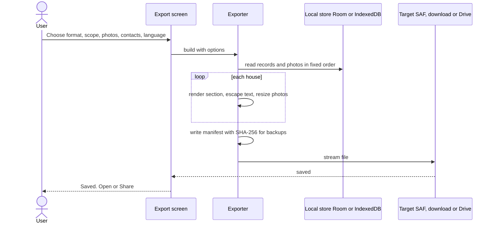
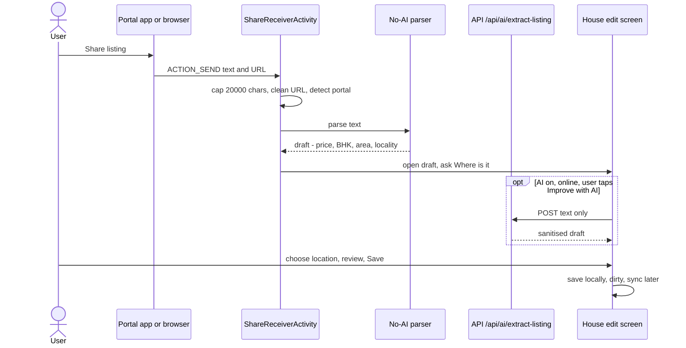
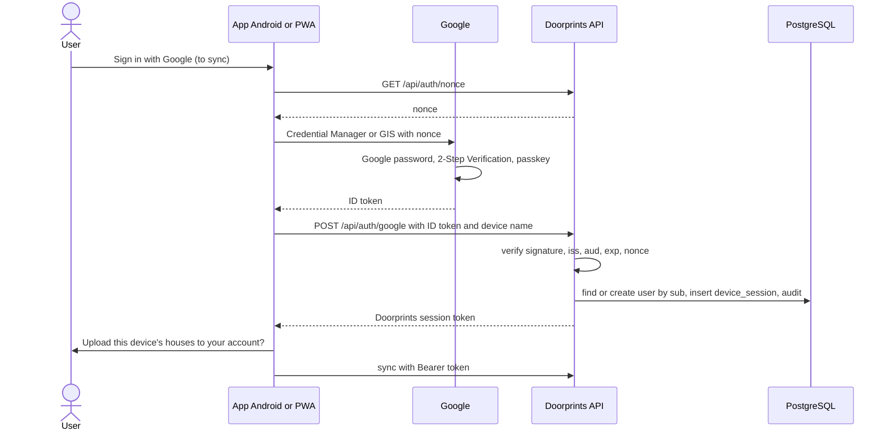
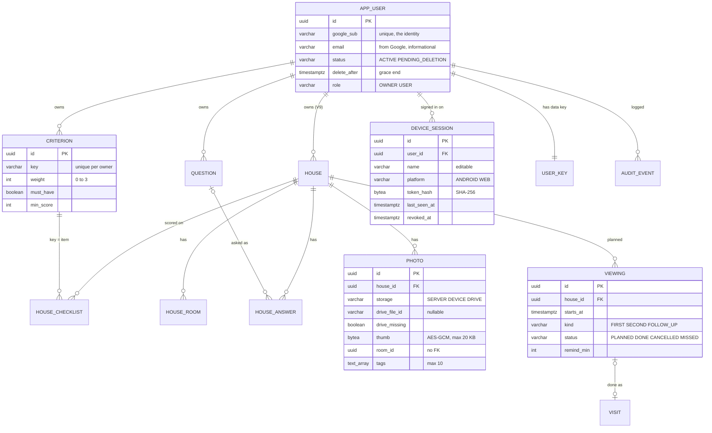

# 11: Feature parity (SeenHouse) and offline copy: specification

| Field | Value |
|---|---|
| Document | Feature parity and offline-copy export specification |
| Version | 0.50 |
| Date | 2026-09-30 |
| Author | Claude (Cowork) – Product/Architecture |
| Status | Draft: product-owner decisions D-01, D-02, D-03, D-08, D-21 (AI access) and D-23..D-25 (Sprint 4b reminders, hunting areas, location permissions) and D-26 (India's boundaries on the map, 2026-09-24) applied; ready for Sprint 4 planning |

## Change log

| Version | Date | Author | Change |
|---|---|---|---|
| 0.1 | 2026-09-22 | Claude (Cowork) – Product/Architecture | First version (commit `baf26b8`). Product-owner (Sriram) decisions (A) parity with SeenHouse and (B) an offline copy of the user's data. Gap analysis against the code as of 2026-09-22 (Flyway V1–V3, Room v2, API-key auth), designs, user stories, new requirement IDs, Flyway V4..V11, API, UI, i18n/a11y, STRIDE additions, tests, phased plan, open decisions D-01..D-14. |
| 0.2 | 2026-09-22 | Claude (Cowork) – Product/Architecture | Product-owner decisions applied (section 2). **D-01**: local-first. Doorprints is fully usable without signing in (Android Room, PWA IndexedDB); optional **Google Sign-In** unlocks sync, the web app with your data, Google Drive storage and more AI. No own email/password accounts: Argon2id and TOTP parity is **delegated to Google** (section 3.1), trusted devices stay. Guest AI allowance with a fair sign-in prompt. **D-02**: photos on the device by default, optionally in the user's own Google Drive (`drive.file`), only thumbnails and metadata on the server. **D-03**: no transactional email; reminders are local notifications. **D-08**: account deletion with a 7-day grace period. **Export**: deterministic offline exporters for HTML, PDF, CSV, XLSX, JSON backup and Markdown, plus an **AI custom export** (5.3). Requirement IDs renumbered (FR-042..FR-082, NFR-021..NFR-029, SEC-031..SEC-048, PRV-012..PRV-021; still only proposals). Removed: own passwords, Argon2id, TOTP, recovery codes, email, invites, `/api/backup/data`, `/api/import/batch`. Sprint 4 split into 4a/4b; Sprint 5 re-planned around Google. Repository rename note. |
| 0.3 | 2026-09-22 | Claude (Cowork), Docs team | Product-owner decision **D-21, AI access policy** (section 2): guests get **no cloud AI**. On Android they get on-device AI (Gemini Nano through the ML Kit GenAI Prompt API, beta) where the device supports it; elsewhere AI is hidden. Cloud AI is only for the owner and Google accounts the owner invites, on a paid key with a hard cap (Vertex AI or the paid Gemini API tier; the free AI Studio tier is never used with real user data, [02](02-threat-model.md) T-I20). **D-22: bring-your-own-key rejected** (consumer UX, payment-linked secret risk, support burden). Section 5.13 rewritten (the guest AI allowance, installation ID, `X-Doorprints-Install` and the sign-in-for-more-AI prompt are removed). Changed: summary, D-01 row, V8 (`ai_usage` per user, `ai_cloud_allowed`), G-02, G-19, G-21, P-1, P-3, 5.1, 5.3, US-35, FR-049, FR-067, FR-075, FR-079, SEC-031, SEC-036, SEC-047, PRV-014, PRV-020, API, UI, a11y, T-D7, DF-39, RR-09, TC-U-34, TC-S-21, S5-07, C-15, RK-07, D-15, D-20, section 17. Repository note: renamed to `Sriram-Codes-SW/doorprints` (public, MIT). Requirement IDs copied into [01](01-requirements.md) v0.9 as AI-013..AI-016 and PRV-022..PRV-023. |
| 0.4 | 2026-09-22 | Claude (Cowork), Docs team | Review fixes. 5.13 hard cap: layer (2) is now a Google Cloud **spend cap budget** (Preview; monthly, before credits) on an AI-only project instead of an unverified Quotas-page limit, which is optional; SEC-047 and D-21 updated; provider row names the Vertex credential rules (02 T-I22, 07 §4). T-D7 mitigation updated. Status note: accepted AI-access rows are already in 01 v0.9 and 02 v0.10. |
| 0.5 | 2026-09-22 | Claude (Cowork), Docs team | Vertex AI code and [ai/vertex-setup.md](ai/vertex-setup.md) landed in the same change set: "being written" markers removed from D-21 and 5.13. 5.13 provider row: the Vertex credential is Application Default Credentials only (no Vertex API key), and the spend cap trip gets its own requirement ([01](01-requirements.md) AI-017). |
| 0.6 | 2026-09-22 | Claude (Cowork), Docs team | **Product-owner decisions of 2026-09-22 (Sprint 4b scope additions and the location permission model)**, section 2 D-23..D-25: new **5.16 Hunt mode reminders** (local notification 5 to 60 min before a planned viewing, default 15, actions Start Hunt mode / Dismiss; exact alarm when the user allows "Alarms & reminders", otherwise an early-starting 10-minute window, corrected in v0.7), **5.17 Hunting areas and area wake-up** (up to 20 circles of 200 m to 2 km, Geofencing API ENTER geofences, notification with a Start Hunt mode action, never auto-start, 6-hour cooldown per area, re-registration after reboot and update), **5.18 location permission model** (foreground-only by default; "Allow all the time" only when area wake-up is turned on, after a rationale screen; auto-off when downgraded; re-check on resume; approximate location; Play policy note). Accepted rows copied to [01](01-requirements.md) v0.12: FR-083..FR-088, NFR-030, SEC-049, PRV-024..PRV-027 (PRV-001 amended). New US-38, US-39; T-I23, T-I24, T-E8, DF-40; TC-U-38..40, TC-M-18, TC-F-12, TC-S-22, TC-A-12; stories S4-17..S4-19 (Sprint 4b grows to 63 points, RK-01 and RK-15); Room 3 adds `hunting_areas` and `viewings.huntReminder`; UI and section 17 rows. Sprint 3.5 (KMP `:shared` module, [03](03-design.md) ADR-14): **ADR-14 is now the KMP decision**, so this spec's proposed ADRs are renumbered ADR-15 (identity), ADR-16 (Drive), ADR-17 (no portal scraping), ADR-18 (AI custom export); Room `exportSchema` is already on (8.2, S4-00: only the migration test remains); area model and cooldown logic are `:shared` candidates. |
| 0.7 | 2026-09-22 | Claude (Cowork), Docs team | Review fixes. **5.16 Scheduling and Settings**: v0.6 relied on a `setWindow` window of at most 5 minutes ("up to 5 minutes late"), which the platform does not give: the official guide "Schedule alarms" (checked 2026-09-22) says `windowLengthMillis` under 600000 is typically clipped to 10 minutes for apps targeting Android 12+, and `setWindow` is not allow-while-idle. Now: `setExactAndAllowWhileIdle` when `canScheduleExactAlarms()` is true; otherwise `setWindow(T − 10 min, 10 min)` so the reminder is early, never late (except in Doze or battery saver); `SCHEDULE_EXACT_ALARM` declared (not `USE_EXACT_ALARM`) with an optional Settings link to `ACTION_REQUEST_SCHEDULE_EXACT_ALARM`; reschedule on grant broadcast, resume and boot. Merge rule with the viewing reminder is now 10 minutes. 5.8 Android reminders use the same scheduler. Settings copy: "may arrive up to about 10 minutes early (or later if the phone is in battery saver)". **TC-U-38** asserts the early window and no exact call without the permission. **T-E8 / TC-S-22**: notification-action and alarm `PendingIntent`s immutable; the geofencing `PendingIntent` mutable (required) and explicit to a non-exported receiver. RK-10 mitigation updated. T-I23, T-I24, T-E8 copied to [02](02-threat-model.md) and TC-U-38..40, TC-M-18, TC-F-12, TC-S-22, TC-A-12 to [06](06-test-plan.md) (section 17). |
| 0.8 | 2026-09-22 | Claude (Cowork), Docs team | Sprint 4a as built (tickets S4-00/c and the Android handover item 6 from `docs/schemas/README.md` §9). **5.2 Import**: "Import writes to Room / IndexedDB only; no server endpoint is needed" contradicted the shipped `POST /api/import` (`?dryRun=true` for the preview; [01](01-requirements.md) FR-047, [03](03-design.md) §9 and ADR-20); it now says devices import locally and the server has its own restore endpoint, and lists the **bare `data.json`** (the server's `GET /api/export` download) as an import source Android accepts. **Section 9**: the "dropped" note no longer says imports are local only. **5.10 Updates, install**: "menu item" → the *Your data* card plus a one-time banner with a 30-day "Not now". **SEC-044 row**: this build's files, not "the app shell only". Plan text elsewhere is left as the plan. |
| 0.9 | 2026-09-22 | Claude (Cowork), Docs team | Android round of 2026-09-22 23:10–23:15 (`android/shared/README.md` 1.9, handover item 9). **5.2 Options**: a JSON backup of *All houses* now carries the visits that belong to no house (Android, `ExportBundle.unlinkedVisits`, last in `data.json`); the readable copies and tables do not; the web writer still drops them. |
| 0.10 | 2026-09-23 | Claude (Cowork), Docs team | Owner decision of 2026-09-23: the web app is hosted on **Cloudflare Pages** at `https://<project>.pages.dev` ([03](03-design.md) ADR-21), and `web/public/_headers` is now actually served. **RK-06**: the web origin *is* a `pages.dev` subdomain now, so the authorised-domain question is concrete for S5-01. **RK-12**: `_headers` sends `Cross-Origin-Opener-Policy: same-origin`, which Google documents as breaking the Sign in with Google popup when FedCM is not used (it asks for `same-origin-allow-popups`), so S5-01 must decide COOP together with the GIS CSP additions (SEC-048). No scope change. |
| 0.11 | 2026-09-23 | Claude (Cowork), Docs team | **Owner decisions of 2026-09-23.** The web app is on **Firebase Hosting at `https://doorprints.web.app`** ([03](03-design.md) ADR-21), replacing the Cloudflare Pages plan, which was never set up: **RK-06** (a `web.app` subdomain is Google-owned, so it cannot be verified as the owner's authorised domain; a custom domain comes only after web import ships, [12](12-brand-and-naming.md) section D) and **RK-12** (the COOP header now comes from `web/firebase.json`). **Naming** ([12](12-brand-and-naming.md) section G; brand advisor): "import" is reserved for Doorprints backups, so **G-02** and **§5.9** say *add* ("Add a shared listing"), not import; the AI helper is *Fill in from listing text*. The approved import definition is [01](01-requirements.md) §6.9 (FR-089..FR-097). §5.10 *Headers* row: as built, `web/firebase.json`. |
| 0.12 | 2026-09-23 | Claude (Cowork), Docs team | Android §9 item 22 applied (coordinator's final review of 2026-09-23): **§10 UI changes** records the Android add-house flow as it is (*Add a house on the map* → the Map tab and, from the house list, a tip naming *Save house here* and long-press; *Save house here* at the current location) and its **parity target, an accessible pick-a-spot mode** (centre crosshair and a 48 dp *Save house at centre*), planned for Sprint 4b and listed under **§14.2**; a *Map orientation* row records that both maps are north-up (Android 1.31; the web in the working tree since 2026-09-23, handover 33). |
| 0.13 | 2026-09-24 | Claude (Cowork), Docs team | **Owner decision D-26 (2026-09-24, P0): India's boundaries on the map** ([03](03-design.md) ADR-22, [01](01-requirements.md) FR-098). Section 2 gains **D-26**; **§10 UI changes** gains the row *Map boundaries (India)*: web and Android apply the same five rules with the same layer and source ids to the same bundled file, so both draw the same map; the one deliberate difference is the "Natural Earth" attribution credit on the web only (`android/shared/README.md` 1.36 item 37, `web/README.md` row of 2026-09-24). |
| 0.14 | 2026-09-24 | Claude (Cowork), Docs team | Round 1 review of the Docs change for India's boundaries (major). **§10 *Map boundaries (India)*** no longer says "Identical on both": compared rule by rule (`IndiaViewRules.kt` and `IndiaView.kt` against `india-boundaries.ts`, code as of 2026-09-23 19:56 UTC, 2026-09-24 01:26 IST), Android's rule 2 also requires an adm0 side on `boundary_2` lines (`android/shared/README.md` 1.37) and the web's does not. Recorded as an **open parity gap** handed to Web (Android §9 item 36), not a deliberate difference; the row goes back to "the same five rules" when Web adds the guard and its spec cases. Android's `in-boundary-world` maxzoom `Math.nextDown(5f)` is recorded as the same behaviour as the web's exclusive maxzoom 5. The only deliberate difference is still the web's "Natural Earth" credit. |
| 0.15 | 2026-09-24 | Claude (Cowork), Docs team | **§10 *Map boundaries (India)*** re-synced with the code at HEAD `3ad2b58` (comment and docs round, no behaviour change): the web's `shared/india-boundaries.ts` has rule 2's adm0 clause (`COUNTRY_LINE_RULE`, `COUNTRY_LINE_RULE_LEGACY`) and the tile-zoom guard (`TILE_ZOOM_GUARD`), the same as Android's `IndiaViewRules.kt`, so the **open parity gap is removed** and the row says "the same five rules" again, naming the guard. The row records that the guard is defence in depth on both renderers (read from source), and the two known limits shared by both apps (the Assam-Arunachal Pradesh state line from zoom 5, S4b-BL-15; doubled lines, S4b-BL-11 and S4b-BL-16). Still one deliberate difference: the web's "Natural Earth" credit. |
| 0.16 | 2026-09-24 | Claude (Code), Docs team | **§10 *Map boundaries (India)*** re-synced with branch `fix/india-boundary-lines` (PR #16, HEAD `9e0036e`): both apps' country-line rule also leaves out India's line with China (`INDIA_CHINA_LINE`, both syntaxes), both have the new state layer `in-boundary-state` (from zoom 5, directly above `boundary_3`, drawn like it), and the data file stays byte-identical (sha256 `2c497e2e…56d7`, kinds `world`, `claim`, `state`); the known limits of the state line and the two close lines are fixed (S4b-BL-11, -15, -16). |
| 0.17 | 2026-09-24 | Claude (Code), Docs team | **§10 *Map boundaries (India)*** after the Singalila spur fix (round 2 reviews): sha256 `25984afa…a024`; the shared known limits sized (Sikkim tri-junction loops about 13 x 3 km and 2 km; the tile line's overrun at Jomotsangkha and Longwa from about zoom 10 (a small hook at Jomotsangkha from zoom 9)). No parity change. |
| 0.18 | 2026-09-24 | Claude (Code), engineer | Legacy House Hunt names renamed (owner request of 2026-09-24; [03](03-design.md) ADR-24). The repository note says packages, storage keys and database names follow the brand since 2026-09-24. |
| 0.19 | 2026-09-24 | Claude (Code), engineer | The Room migration test (R-06) is done: CMP-4 P4a, [06](06-test-plan.md) TC-U-63 (the Room row and S4-00). |
| 0.20 | 2026-09-29 | Claude (Code), lead | Map boundaries row: maplibre-gl 6.11.2 `worker_tile.ts:110` ([10](10-sprint-log.md) §16). |
| 0.21 | 2026-09-29 | Claude (Code), lead | New owner decision **D-23**: signed-in users may bring their own Gemini key (stored encrypted and write-only on the hosted server, used only for them); it supersedes **D-22**. To be built with Google sign-in, after the release security gate. |
| 0.22 | 2026-09-29 | Claude (Code), lead | New **D-27** (a signed-in person's own Gemini key stays on their device; OAuth to the Gemini API and "using a key by reference" considered and not taken) and **D-28** (no hosted server: Google sign-in syncs through each person's own Google Drive). |
| 0.23 | 2026-09-29 | Claude (Code), lead | New **D-29**: AI with the person's own Gemini key on the device, next to server AI ([03](03-design.md) ADR-26). |
| 0.24 | 2026-09-29 | Claude (Code), lead | New **D-30** and 5.19..5.26 (app lock, offline maps, the real cost of a house, my places, area notes, moving in, brokers; voice notes parked); 14.2: S4-11 widened, new S4-20..22. |
| 0.25 | 2026-09-29 | Claude (Code), lead | 5.19 **app lock built** on Android and iPhone (S4b-FR-5): the choices of time, turning it on or off behind the credential, the fail-closed read. |
| 0.26 | 2026-09-29 | Claude (Code), lead | New **5.27**: the path trace built (S4b-FR-2) on Android, inside `HuntEngine` so the iPhone gets it with S4b-BL-69. |
| 0.27 | 2026-09-29 | Claude (Code), lead | 5.27: the path trace is recorded on iPhone too (S4b-BL-69, Hunt mode on iPhone; [10](10-sprint-log.md) §13.14). |
| 0.28 | 2026-09-30 | Claude (Code), lead | 5.20 **offline maps built** on Android and iPhone (S4b-FR-6): the map's visible area as one of MapLibre's offline packs, the estimate and the cap in common code; the website is S4b-BL-79. |
| 0.29 | 2026-09-30 | Claude (Code), lead | New **5.28**, the design of sharing updates between two people who know each other (S4b-FR-3): an update file in the backup format, sent through any app, imported with the existing merge; the Drive folder of D-28 later as the automatic channel. New US-40. |
| 0.30 | 2026-09-30 | Claude (Code), lead | 5.28 **built on Android** (S4b-FR-3): *Share updates with…* from Settings > Your data, the update file, a received file opening in the Import screen. |
| 0.31 | 2026-09-30 | Claude (Code), lead | New **5.29**, the design of a house from a listing link (S4b-FR-4) with brokers (S4b-FR-11): the portal's share text parsed on the device, never the page (5.9 stands); brokers as the data-model change of (4c). New US-41. |
| 0.32 | 2026-09-30 | Claude (Code), lead | 5.29 **built** (S4b-FR-4, the listing flow): the no-AI parser on Android and the web with one fixture file, the Android share receiver, the map step, the duplicate check. |
| 0.33 | 2026-09-30 | Claude (Code), lead | New **5.30**, the design of the Sprint 4b data model in one change of format (N13 4c; [03](03-design.md) ADR-28): nested house values, one record envelope for every other new entity, `doorprints-backup/2`, Room 4 and IndexedDB 2, six slices. 8.1 and 8.2 updated. |
| 0.34 | 2026-09-30 | Claude (Code), lead | 5.30 **slice 0 built** (the records foundations, [10](10-sprint-log.md) §13.18): the format rule, the server's `record` table and endpoints, the `records` table and store with their sync, the web's upgrade path. |
| 0.35 | 2026-09-30 | Claude (Code), lead | 5.30 **slice 1a built** (the house's cost, carpet area and location source, [10](10-sprint-log.md) §13.19): slice 1 goes in three steps, 1a these values, 1b brokers, 1c rooms; 5.21 built. |
| 0.36 | 2026-09-30 | Claude (Code), lead | 5.30 **slice 1b built** (brokers, [10](10-sprint-log.md) §13.20): the first record type and the first `doorprints-backup/2` list; 5.25 built. |
| 0.37 | 2026-09-30 | Claude (Code), lead | 5.6 and 5.30 **slice 1c built** (rooms, [10](10-sprint-log.md) §13.21): rooms nested in the house, the length units, the `/2` rule now "a broker or a room". |
| 0.38 | 2026-09-30 | Claude (Code), lead | 5.4 and 5.30 **slice 2 built** (criteria and ranking, [10](10-sprint-log.md) §13.22): criteria and preferences as records, one scoring implementation per stack, the *Criteria* screen, the ranking. |
| 0.39 | 2026-09-30 | Claude (Code), lead | 5.5 and 5.30 **slice 3a built** (viewing questions, [10](10-sprint-log.md) §13.23); slice 3 is split into 3a questions, 3b viewings with reminders, 3c Hunt reminders. |
| 0.40 | 2026-09-30 | Claude (Code), lead | **Slice 3b designed** (5.8 viewings, [10](10-sprint-log.md) §13.24): the `viewing` record, the split into 3b-1 (data, screens, history, calendar file, backup, copies, server) and 3b-2 (the reminders on Android, iPhone and the website), the pure reminder rules, the vectors V1..V6. |
| 0.41 | 2026-09-30 | Claude (Code), lead | 5.8 and 5.30 **slice 3b-1 built** (viewings: the record, screens, history, calendar file, backup, copies, AI, server; [10](10-sprint-log.md) §13.24). The reminders (3b-2) and the Hunt reminder (3c) are not built. |
| 0.42 | 2026-09-30 | Claude (Code), lead | **Slice 3b-2 designed** (5.8 reminders: one pure rule set, Android alarms, iPhone notifications, the website's while-open notifications; [10](10-sprint-log.md) §13.25). |
| 0.43 | 2026-09-30 | Claude (Code), lead | **Slice 3b-2 built** (5.8 reminders on Android, iPhone and the website; [10](10-sprint-log.md) §13.25). |
| 0.44 | 2026-09-30 | Claude (Code), lead | **Slice 3c designed** (5.16 Hunt mode reminder before a viewing; [10](10-sprint-log.md) §13.26). |
| 0.45 | 2026-09-30 | Claude (Code), lead | **Slice 3c built** (5.16 Hunt mode reminder; [10](10-sprint-log.md) §13.26). |
| 0.46 | 2026-09-30 | Claude (Code), lead | **Slice 4a designed** (hunting areas as records, my places with distances, area notes; [10](10-sprint-log.md) §13.27). The area wake-up (geofences, 5.17/5.18) is slice 4b. |
| 0.47 | 2026-09-30 | Claude (Code), lead | **Slice 4a built** (areas, places, area notes; [10](10-sprint-log.md) §13.27). The wake-up (4b) is not built. |
| 0.48 | 2026-09-30 | Claude (Code), lead | **Slice 4b designed** (5.17 and 5.18: the area wake-up, the background-location rationale and the cooldown; [10](10-sprint-log.md) §13.28). |
| 0.49 | 2026-09-30 | Claude (Code), lead | **Slice 4b built** (the area wake-up on Android; [10](10-sprint-log.md) §13.28). The iPhone part (S4b-BL-96) follows. |
| 0.50 | 2026-09-30 | Claude (Code), lead | **Slice 5 designed** (5.7 photo tags, 5.24 moving in: the statuses Taken and Not chosen, the move-in checklist and condition record, *Close this hunt*; [10](10-sprint-log.md) §13.29). |

Related: [01 Requirements](01-requirements.md) · [02 Threat model](02-threat-model.md) · [03 Design](03-design.md) · [04 DFDs](04-data-flow-diagrams.md) · [05 UX/a11y/i18n](05-ux-accessibility-i18n.md) · [06 Test plan](06-test-plan.md) · [10 Sprint log](10-sprint-log.md) · [AI design](ai/ai-design.md)

> **Status of this document.** It adds no code. Accepted AI-access rows were copied into [01](01-requirements.md) v0.9
> (AI-013..AI-016, PRV-022, PRV-023) and [02](02-threat-model.md) v0.10, and the accepted Sprint 4b additions
> (D-23..D-25: Hunt mode reminders, hunting areas, location permission model) into [01](01-requirements.md) v0.12
> (FR-083..FR-088, NFR-030, SEC-049, PRV-024..PRV-027); the rest is a proposal. When the product
> owner accepts it, the Docs team copies the accepted rows into 01, 02, 03, 04, 05, 06, 07, 08 and 10 (section 17).
> IDs here are reserved for that purpose.
>
> **Repository name.** Done on 2026-09-22: the repository is now **`Sriram-Codes-SW/doorprints`**, public, with an
> MIT `LICENSE` and a `SECURITY.md` (private vulnerability reporting). GitHub redirects the old `house-hunt` URL; the
> README was updated in the same change. Code packages, storage keys and database names kept the old name until
> 2026-09-24 (ADR-13) and use Doorprints since then (ADR-24).

---

## 1. Summary

| | |
|---|---|
| **Goal A** | Doorprints offers every feature SeenHouse (seenhouse.uk) offers, adapted to India and zero running cost (CON-01). |
| **Goal B** | The user can export their data **in several formats** that stay readable without the app: self-contained HTML (print to PDF), PDF, CSV, XLSX, Markdown, and an exact, re-importable JSON backup (ZIP with photos). All of these are **deterministic and work offline** on Android and in the PWA. An optional **AI custom export** writes free-form summaries ("a WhatsApp summary of my shortlist in Tamil for my parents"); it is labelled as AI-generated and is never a backup. |
| **Product shape (D-01)** | **Local-first.** Anyone installs Doorprints (Android APK or PWA) and uses **every** feature without signing in; data lives on the device. **Google Sign-In is optional** and unlocks what needs an account: sync across devices, the web app with your data, Google Drive storage for photos and backups. **AI (D-21):** guests get on-device AI only (Android devices that support Gemini Nano), otherwise AI is hidden; cloud AI is only for the owner and invited users. |
| **Gaps (section 3)** | Of 22 rows: 4 Have, 10 Partial, 5 Missing, and 3 (own accounts, Argon2id, TOTP 2FA) **met by delegation to Google** (3.1); trusted devices are built by us. (v0.1 miscounted this as 5/7/10.) |
| **Plan (section 14)** | **Sprint 4a:** local-first web (IndexedDB), all deterministic exporters, import, PWA. **Sprint 4b:** weighted criteria and ranking, viewing questions, rooms, photo tags, viewings and reminders, Hunt mode reminders, hunting areas with area wake-up, Share to Doorprints. **Sprint 5:** Google Sign-In, sync ownership per Google user, Google Drive storage, trusted devices, account deletion, AI access tiers (AI custom export below the cut line). **Sprint 6+:** API-key mode removed, earlier AI and map candidates. |
| **Still open** | Section 16: smaller decisions only (invited-user quota and hard-cap numbers, cover thumbnail, Drive encryption, CSP for Google's script). |

## 2. Product-owner decisions (2026-09-22)

| ID | Decision | Consequences in this spec |
|---|---|---|
| D-01 | **Local-first; optional Google Sign-In.** No login needed for any feature that can run on the device. Sign-in unlocks: cross-device sync, the web app with the user's data, Google Drive storage. No own email/password accounts; password security and 2FA are delegated to Google. Trusted devices are still built. Sign-in prompts appear only at features that need an account, never as item limits. (The v0.2 guest AI allowance is replaced by D-21.) | 5.1, 5.11; web becomes local-first (IndexedDB, 5.10); section 3.1 equivalence; own-account items from v0.1 removed |
| D-02 | **Photos: the user chooses.** Default: photos stay on the device. With the user's permission: photos and backups go to the user's own Google Drive (`drive.file` scope, app-created files only, a "Doorprints" folder). Revoked access and deleted files are handled gracefully. Only minimal thumbnails and metadata on our server. | 5.12, 5.15; server no longer stores full photos for new data (ADR-08 revisited); DB quota risk from v0.1 largely gone |
| D-03 | **No transactional email.** Reminders are local notifications (Android AlarmManager/WorkManager, PWA notifications). | No email service, no password reset (Google handles account recovery); 5.8 |
| D-08 | **Account deletion: 7-day grace period.** Offer an offline copy first. Deletion removes server data; Drive files stay in the user's Drive and the user is told so. | 5.14 |
| Export | **Multiple formats**: deterministic offline exporters for HTML, PDF, CSV, XLSX, JSON full backup (exact, re-importable) and Markdown; plus an **AI custom export** that works only from a structured export of the selected data, is labelled AI-generated, is never the backup, has numbers and prices validated against the source, excludes contacts unless the user opts in, and follows the AI access rules (D-21). | 5.2, 5.3 |
| D-21 | **AI access policy.** Guests get **no cloud AI**. On Android, guests (and signed-in users who are not invited) get **on-device AI**: Gemini Nano through the **ML Kit GenAI Prompt API** where the device supports it (feature-status check at runtime); where it is not supported, and in the web app/PWA, AI entry points are **hidden**, with no sign-in prompt. **Cloud AI** (Ask, planner, extraction and custom export on the server) is only for the **owner and Google accounts the owner invites**, on a **paid key with a hard cap**. The paid key is on Vertex AI or the paid Gemini API tier, because the free AI Studio tier may use prompts to improve Google's products; the free tier is kept for evals with synthetic data only. The AI Studio code path is kept so the owner can switch back (`AI_PROVIDER`; [ai/vertex-setup.md](ai/vertex-setup.md) step 13). | 5.1, 5.13; FR-079, SEC-031, SEC-036, SEC-047, PRV-020; 01 AI-013..AI-016, PRV-022, PRV-023 |
| D-23 | **Hunt mode reminders** (2026-09-22, Sprint 4b). A planned viewing can remind the user shortly before it (default 15 min, 5 to 60) with a "Start Hunt mode" action; global and per-viewing switches; offline, Do Not Disturb respected, 4 languages, accessible. | 5.16; [01](01-requirements.md) FR-083, FR-084 |
| D-24 | **Hunting areas / area wake-up** (2026-09-22, Sprint 4b). The user marks neighbourhoods; Android geofences offer Hunt mode on entering one; never auto-start; cooldown per area; stored locally, exported, synced later. | 5.17; [01](01-requirements.md) FR-085..FR-088, NFR-030 |
| D-25 | **Location permission model** (2026-09-22). Foreground-only by default; "Allow all the time" only when area wake-up is turned on, after a rationale screen; area wake-up turns itself off if the permission goes away. | 5.18; [01](01-requirements.md) PRV-024..PRV-027, SEC-049, PRV-001 amended |
| D-26 | **India's boundaries as the Government of India depicts them** (2026-09-24, P0 on the live site). Every map on both apps shows all of Jammu and Kashmir and Ladakh (PoK, Gilgit-Baltistan, Shaksgam, Aksai Chin included) and Arunachal Pradesh inside India, with no Line of Control, Line of Actual Control or other claim line. The only view: every user is in India, so no switch. | [03](03-design.md) ADR-22; [01](01-requirements.md) FR-098; §10 *Map boundaries (India)*; [02](02-threat-model.md) RR-16 |
| D-22 | **Superseded by D-23 (2026-09-29).** **Bring-your-own-key (BYOK) rejected.** Users will not paste their own Gemini/Vertex key. Reasons: consumer UX (creating a Cloud project, billing and a key is far beyond a house hunter), a payment-linked secret on phones and in our server is a high-value target with unbounded cost if leaked, and the support burden (quota errors, billing questions, revoked keys) falls on one owner. | None of the v0.2 text had BYOK; recorded so it is not proposed again |
| D-23 | **Bring-your-own-key allowed for signed-in users; replaces D-22** (owner, 2026-09-29: "We should also allow AI for users who have their own SSO and own key"). A user signed in with Google (D-01) may add their own Gemini API key in Settings; cloud AI then works for them without an invitation, on their key and at their cost. Invited users keep the owner's capped key (D-21); guests keep on-device AI only; self-hosters keep the key in their server's settings. How D-22's reasons are met: the key is optional and the user guide explains getting one (and the paid tier); it is stored only on the hosted server, encrypted at rest, write-only (the app shows its last four characters), used only for that user's requests, deletable (*Remove key*), never kept in the browser; the server's own per-user limits still apply; adding a key shows the free-tier privacy warning (Google may read what is sent) with a link to the guide's paid tier; a key the provider refuses shows a clear error and never falls back to the owner's key. Stored user keys are a new threat-model item and part of the release security gate's authorisation tests (one user can never use or read another's key). Built with Google sign-in ([14](14-lead-backlog-and-handoff.md) N13). | Changes D-22, P-1 ("never bring a key") and the AI tiers in 5.13 when built |
| D-27 | **A signed-in user's own Gemini key stays on their device; it never goes to the hosted server** (owner, 2026-09-29, on hosted-server trust: "I don't think the user will be comfortable with pasting their key there"; amends D-23, whose "stored only on the hosted server, encrypted at rest" no longer holds). (1) The key is kept only on the user's phone or browser, in the same secure storage as the device key (Android Keystore, iOS Keychain, the browser's storage), and sent straight from there to Google; the hosted server never receives it. Listing extraction calls Gemini from the device; for Ask and the visit planner the server finds the user's houses and returns them, and the device makes the Gemini call, so the prompts and the grounding checks run on the device too (a Sprint 5 cost, built with Google sign-in). (2) The user guide has users make a **separate key just for Doorprints** in AI Studio, which they can delete there at any time, with a budget alert (and on the paid tier a quota cap) in Google Cloud. **Considered and not taken now:** using the key "by reference" is not possible (an API key is sent by whoever calls; Google has no delegation for it); OAuth to the Gemini API (the user approves Doorprints on Google's consent screen) is, in Google's own words, a setup "appropriate for a testing environment", needs the broad `cloud-platform` scope and Google's verification for outside users, and does not cover billing a third-party app's calls to each user's own project; Google's advice for third-party tools is an API key. Revisit if Google adds delegated Gemini access. Self-hosters are unchanged: their key is on their own server (the owner page, [03](03-design.md) §12.1). | 5.11, 5.12; [03](03-design.md) §12.1, ADR-25 |
| D-28 | **No hosted server: Google sign-in syncs through each person's own Google Drive** (owner, 2026-09-29: "I don't want to host a server for the Google Sign in"). Replaces the hosted-server part of D-01 and the owner's capped key for invited users in D-21; D-23 and D-27 apply as "every signed-in person uses their own Gemini key, kept on their device". (1) *Sign in with Google* on the website, Android and iPhone; the houses, visits and photos sync through a private app folder in the person's own Drive (`drive.appdata`), and shared lists (S4b-FR-3) through a Drive folder they share (`drive.file`). Both scopes are **non-sensitive**: only Google's basic app verification (name, logo, privacy policy, the `doorprints.web.app` domain), free, no security assessment (Google's *Choose Google Drive API scopes*). (2) AI runs on the device with the person's own key (D-27): the app finds the relevant houses itself (a personal list is small) and calls Gemini directly. (3) The owner hosts nothing and holds nobody's data; the owner's only part is the free Google Cloud project that registers Doorprints for sign-in. The self-hosted server stays as the advanced option, with device pairing and the owner page ([03](03-design.md) §12.1, ADR-25). | 5.1, 5.11, 5.12; [03](03-design.md) §12.1 |
| D-29 | **AI with your own Gemini key on the device, next to server AI, behind one interface** (owner, 2026-09-29: "both are separate modules and the calling AI is common … he can simply enter an API key and get responses as well as choose the server"). Built before Google sign-in, which reuses it (D-27). | All three apps: Settings or *Connect* → *AI features* offers *Use my own Gemini key on this device* and *Use my server*; design [03](03-design.md) §13.1, ADR-26 |
| D-30 | **Features for an offline house hunt, from the gap review of 2026-09-29** (owner: "I would like to go ahead with your suggestion"). Take: an app lock (5.19), offline maps for the hunting area (5.20), the real cost of a house with my offer and the agreed price (5.21), my places and distances (5.22), area notes (5.23), moving in (5.24), brokers (5.25). Park: voice notes (5.26). Each goes with work already planned, so the data model and the sync, backup and export formats change once (14.2). | Order: [14](14-lead-backlog-and-handoff.md) N13; designs 5.19..5.26; tickets [10](10-sprint-log.md) §15 S4b-FR-5..12 |

v0.1 decisions now closed (v0.3 adds D-21 and D-22): D-01, D-02, D-03, D-07 (Web Push: not planned; local notifications only), D-08, D-10
(web session storage: see 5.11), D-11 (rely on device encryption). Still open: section 16.

## 3. Feature gap table

Status: **Have** = built and in [01](01-requirements.md); **Partial** = part is built; **Missing** = not built;
**Delegated** = met through the user's Google account.

| # | SeenHouse feature | Doorprints today | Status | How we build it (India, zero cost) | New IDs | Sprint |
|---|---|---|---|---|---|---|
| G-01 | Property logging | Houses with location, price in ₹, BHK, status, contact, notes (FR-001, FR-002, FR-006) | Have | Add carpet area and "approximate location" for houses saved from a listing before a visit | FR-059, FR-068 | 4b |
| G-02 | Add a house from a listing link or shared listing, with details filled in (*Add a shared listing*; not an "import", [12](12-brand-and-naming.md) G.3) | `listing_url` field; AI fills a draft from pasted text (FR-038, AI-004) | Partial | **No server-side scraping** of MagicBricks, 99acres, NoBroker or Housing.com. Android **Share to Doorprints**, PWA **share target**, paste box; on-device **no-AI parser**; optional "Improve with AI" (on-device where supported, cloud for invited users, D-21) | FR-066..FR-069 | 4b |
| G-03 | Custom weighted scoring | Fixed 10-item checklist, equal weights (FR-004, FR-005) | Partial | User criteria + weights + must-haves; default weights give exactly today's score | FR-051..FR-053 | 4b |
| G-04 | Automatic shortlist ranking | Sort by score | Partial | Ranking view (must-haves, weighted score, coverage, price) | FR-054 | 4b |
| G-05 | Side-by-side comparison | Compare 2–4 houses (FR-011) | Have | Add weighted score, must-haves, rooms, answers | FR-055 | 4b |
| G-06 | Searchable viewing history | Visits recorded (FR-008), list search on houses only | Partial | Viewings timeline with search and filters | FR-065 | 4b |
| G-07 | Photo capture with tagging | Photos (FR-007), no tags | Partial | Room link, tags, caption | FR-060 | 4b |
| G-08 | Notes | House notes | Have | Notes per visit, room, answer | FR-061 | 4b |
| G-09 | Custom viewing question checklists | – | Missing | Question bank with India defaults, per-house answers | FR-056, FR-057 | 4b |
| G-10 | Viewing reminders, second viewings | – | Missing | Planned viewings, **local** reminders (Android alarms, PWA notifications), `.ics`, second viewing with re-check list | FR-062..FR-064 | 4b |
| G-11 | Room sizes and condition | – | Missing | Rooms with size (ft/m), condition 1–5, notes | FR-058, FR-059 | 4b |
| G-12 | Accounts (email/password, no postal address) | Shared API key (ADR-03) | Missing → **Delegated** | **No own accounts.** Optional Google Sign-In creates a Doorprints account keyed by the Google subject; we store no password. Without sign-in everything works locally. | FR-074, FR-075 | 5 |
| G-13 | Google sign-in | – | Missing | Credential Manager (Android), Google Identity Services (web), server verifies the ID token | FR-074, SEC-032 | 5 |
| G-14 | Two-factor authentication (TOTP) | – | Missing → **Delegated** | Google 2-Step Verification (authenticator app, passkeys, security keys, prompts) protects the account (3.1) | – | 5 |
| G-15 | Argon2id password hashing | – | Missing → **Delegated** | No passwords stored by Doorprints; Google stores and protects credentials (3.1) | – | 5 |
| G-16 | Encrypted photo storage at rest | Provider disk encryption, Android FBE | Partial | Device: FBE / browser storage; Drive: Google encryption at rest; server thumbnails: app-level AES-256-GCM (5.15) | SEC-040 | 5 |
| G-17 | Trusted device management | – (C-04 open) | Missing | Signed-in devices list (name, platform, last seen), revoke one, sign out all others; replaces C-04 | FR-076, SEC-034 | 5 |
| G-18 | Mobile-first, installable PWA, no app install | Responsive, online-only web app | Partial | `@angular/pwa` + **local-first web** (IndexedDB), works fully without sign-in | FR-070..FR-073 | 4a |
| G-19 | Completely free | Zero running cost | Have | On-device first; Google Drive uses the user's own free 15 GB; AI on-device for guests; cloud AI only for invited users on the owner's hard-capped paid key (D-21) | – | – |
| G-20 | Data export and account deletion | JSON `GET /api/export`, `DELETE /api/data` | Partial | Goal B exporters; deletion with 7-day grace | FR-042..FR-050, FR-080 | 4a, 5 |
| G-21 | Login rate limiting | Per-address limits (SEC-008) | Partial | Rate limits on sign-in and on cloud AI per invited user; Google protects the credential step | SEC-036 | 5 |
| G-22 | **Goal B: offline copy** (beyond SeenHouse) | JSON export only | Partial | Six deterministic formats + AI custom export (5.2, 5.3) | FR-042..FR-050 | 4a, 5 |

Doorprints keeps its lead where SeenHouse has nothing: Hunt mode (FR-013..FR-018), a fully offline Android app,
map, AI assistant, four Indian languages, and now **no account needed at all**.

### 3.1 Security parity by delegation to Google

SeenHouse runs its own accounts, so it must hash passwords and offer 2FA. Doorprints never handles passwords: the
Google account is the only credential, and Doorprints issues its own revocable device sessions after Google has
authenticated the user.

| SeenHouse control | Doorprints equivalent | Who provides it | Note |
|---|---|---|---|
| Email + password sign-up, no postal address | Google Sign-In; we keep the Google subject ID, email and (optional) name only | Google | Nothing to sign up for when used locally |
| Argon2id password hashing | No password is stored or seen by Doorprints | Google | Removes the whole password-database risk (breach, credential stuffing against us) |
| TOTP two-factor authentication | Google 2-Step Verification: authenticator app (TOTP), passkeys, security keys, Google prompts | Google | We cannot see or enforce it; the Account screen recommends turning it on with a link to Google's security settings |
| Password reset by email | Google account recovery | Google | Fits D-03 (no transactional email) |
| Brute-force protection on login | Google's risk checks on sign-in; our rate limits on `/api/auth/google` (SEC-036) | Google + Doorprints | |
| Trusted device management | Doorprints device sessions: list, rename, revoke, sign out others (5.11) and Google's own device list | **Doorprints** + Google | Revoking a Doorprints session stops sync and Drive use from that device within 60 s |
| Encrypted photos at rest | FBE on Android, Drive encryption at rest, AES-256-GCM for server thumbnails | Device / Google / **Doorprints** | 5.15 |

Residual: Doorprints account security equals the user's Google account security, and a stolen Google session can
sign in to Doorprints (T-S9). Users without a Google account can still use every local feature; they only miss sync,
the web app with synced data and Drive storage (cloud AI also needs an owner invitation, D-21).

## 4. Principles

| # | Principle |
|---|---|
| P-1 | **Zero cost for users.** On-device first. Google Drive storage is the user's own free quota. No email service, no push service, no scraping. The only paid API is cloud AI for the owner and invited users, on the owner's key with a hard cap (D-21); users never pay and never bring a key (D-22). |
| P-2 | **Local-first everywhere.** Android (Room) and the PWA (IndexedDB) hold the data; every non-AI feature works offline and without an account (NFR-024). The server is an optional sync hub for signed-in users. |
| P-3 | **Sign-in only where an account is needed.** Prompts appear at sync, the web app with synced data and Drive. AI is never a sign-in incentive (D-21). Never item limits, never blocking a local feature, never nagging (5.13). |
| P-4 | **Backward compatible sync.** A missing (null) collection in a PUT means "unchanged", an empty array means "clear" (NFR-025). |
| P-5 | **Same formula everywhere.** Scoring, ranking, the no-AI parser and the exporters share test-vector files run by the Android and web tests. |
| P-6 | **Your data, your copy.** Exports are deterministic, offline and readable without Doorprints. AI output is never the backup. |
| P-7 | **Least data on our server.** Signed-in users sync houses, visits and metadata; full photos stay on the device or in the user's Drive; the server holds thumbnails and metadata only. |

## 5. Feature designs

### 5.1 Local-first with optional Google Sign-In

| | **Guest (default)** | **Signed in with Google** |
|---|---|---|
| Where data lives | Android: Room + `filesDir/photos`. PWA: IndexedDB (records and photo blobs) | Same local stores, **plus** sync to the Doorprints server (per Google user) |
| All house, scoring, question, room, viewing, reminder, map, Hunt-mode features | Yes | Yes |
| Deterministic exports and import | Yes (on the device) | Yes |
| Sync between phone, PWA and laptop | – | Yes |
| Web app showing the phone's data | – (the PWA has its own local data) | Yes |
| Photos and backups in Google Drive | – | Optional (separate Drive permission, 5.12) |
| On-device AI (Improve with AI, AI custom export) | Android with Gemini Nano support only; otherwise hidden (5.13) | Same |
| Cloud AI (Ask, planner, listing extraction, AI custom export) | – | Only if the owner invited this Google account (5.13) |
| Self-hosted server with API key (today's mode) | Kept until Sprint 6 for the owner's existing install (5.11 migration) | – |

Where the server is: the app ships with the **Doorprints hosted server URL** as default (free tier, operated by the
owner). Advanced settings keep "Use my own server" for self-hosters, who configure their own Google OAuth client.

### 5.2 Export: deterministic formats and re-import (Goal B)

Every format below is built **on the device** (Android from Room, PWA from IndexedDB), **offline**, and gives the
same output for the same data and options (fixed ordering by `createdAt` then `id`, no timestamps inside except the
export time in the cover/manifest).

| Format | File | Content | Android builder | Web/PWA builder |
|---|---|---|---|---|
| **HTML** (readable copy) | `Doorprints-<date>.html` | Self-contained: inline CSS, **no JavaScript**, photos as `data:` URIs (1024 px, JPEG q70), CSP `<meta>` `default-src 'none'; img-src data:; style-src 'unsafe-inline'`. Cover (date, counts, options, privacy note), ranking table, one section per house: details, weighted score breakdown, checklist, rooms, questions and answers, visits and viewings, notes, tagged photos, contact (optional). `@media print`: one house per page | Kotlin template with HTML escaping | TypeScript template, same structure |
| **PDF** | `Doorprints-<date>.pdf` | Same content and order as HTML, A4, one house per page, photos smaller | `android.graphics.pdf.PdfDocument` + `StaticLayout` (platform text shaping handles Devanagari, Tamil, Telugu; no library) | Print view of the HTML with `window.print()` → "Save as PDF" (browser shaping; JS PDF libraries do not shape Indic scripts well) |
| **CSV** | `Doorprints-<date>-csv.zip` | `houses.csv`, `scores.csv`, `rooms.csv`, `answers.csv`, `visits.csv`, `viewings.csv`, `photos.csv`; UTF-8 with BOM, RFC 4180, formula-injection guard | Own writer | Own writer + `fflate` (MIT) for the ZIP |
| **XLSX** | `Doorprints-<date>.xlsx` | One sheet per CSV table, header row frozen, ₹ and dates as typed cells, formula guard | Small own SpreadsheetML writer (XLSX is zipped XML; Apache POI is too large for the APK) | Same own writer in TS + `fflate` (avoid SheetJS: its current releases are not on npm) |
| **Markdown** | `Doorprints-<date>.md` | Headings per house, tables for scores/rooms/answers, photo list by file name (no images embedded); escapes Markdown control characters | Own writer | Own writer |
| **JSON full backup** | `Doorprints-backup-<date>.zip` | `manifest.json` (format `doorprints-backup/1`, versions, options, counts, SHA-256 per file), `data.json` (exact: preferences, criteria, questions, houses with checklist/rooms/answers, visits, viewings, photo metadata incl. Drive IDs), `photos/<id>.jpg` (local photos; Drive-only photos are downloaded if Drive is connected, else listed as `driveOnly`), plus the HTML copy | Streaming `ZipOutputStream` | `fflate` streaming in a Web Worker |

**Options:** scope (all · shortlisted · selected houses), photos (all · shortlisted only · none), contact details
(include, the default, with the warning "This copy contains phone numbers of owners and brokers…" · leave out),
language (en/hi/ta/te), include rejected houses. Tombstones are never exported. **Visits that belong to no house** (Hunt mode records a dwell at a place that is not a house yet with no `houseId`) are carried **only in the JSON backup**, only for scope *All houses*, after the grouped visits in `data.json` (docs/schemas/README.md §5 order); the readable copies and the tables leave them out. Android does this since `android/shared/README.md` 1.9 (`ExportBundle.unlinkedVisits`, `BackupTest.visitsWithoutAHouseAreInTheBackupAndComeLast`); **the web writer still drops them** (`export-model.ts`), so a web backup restored elsewhere loses them — [10](10-sprint-log.md) §11.3 item 11.

**Save:** Android: Storage Access Framework (`CreateDocument`: Downloads, Google Drive app, SD card), share sheet
(`FileProvider`, `cache/exports/`, deleted after 24 h), or, when connected, **straight to the Doorprints folder in
Google Drive** (5.12). Never app-specific storage, so the file survives uninstall. PWA: download (`<a download>`,
`showSaveFilePicker` on Chromium for large files) or Web Share API with files.

**Automatic backups (optional, off by default):** weekly JSON backup, only while charging (Android), to a folder
picked once (`OpenDocumentTree`) or to Google Drive `Doorprints/Backups`, keeping the last 4.

**Import (exact round trip):** pick a `doorprints-backup` ZIP → validate (format, version, SHA-256, ≤ 5 000 entries,
≤ 1 GB uncompressed, ratio ≤ 100:1, no `..`/absolute paths, DTO validation) → preview ("*a* new, *b* newer in file,
*c* newer here") → merge by UUID with last-write-wins, or "import as a copy" with new IDs → imported rows are local
and dirty, so they sync if the user is signed in. A device import writes to Room / IndexedDB and needs no server.
*As built (Sprint 4a):* the server also has a restore endpoint, `POST /api/import` with `?dryRun=true` for the
preview ([03](03-design.md) §9, ADR-20), and Android also accepts a **bare `data.json`** — what the server's
`GET /api/export` downloads (`Doorprints-backup-<UTC date>.json`) — whose photo rows are reported as missing from
the file; the web app has no import yet ([10](10-sprint-log.md) §11.3).
Only the JSON backup is importable; HTML, PDF, CSV, XLSX, Markdown and AI output are not.

```mermaid
sequenceDiagram
    actor U as User
    participant S as Export screen
    participant E as Exporter
    participant L as Local store Room or IndexedDB
    participant T as Target SAF, download or Drive
    U->>S: Choose format, scope, photos, contacts, language
    S->>E: build with options
    E->>L: read records and photos in fixed order
    loop each house
        E->>E: render section, escape text, resize photos
    end
    E->>E: write manifest with SHA-256 for backups
    E->>T: stream file
    T-->>S: saved
    S-->>U: Saved. Open or Share
```

### 5.3 AI custom export

| Item | Design |
|---|---|
| What | The user describes the output in their own words ("a WhatsApp-ready summary of my shortlist in Tamil for my parents", "a letter comparing my top 2 houses for my landlord", "a table of rents and deposits"). |
| Input to the model | **Only a structured export of the data the user selected** (the same JSON as the backup, trimmed to chosen houses and fields, max 30 houses / 64 KB), built on the device. Contact names, phones and `withWhom` are **removed unless the user ticks "Include contact details"**; the server's `ContactRedactor` runs on free text regardless of the tick for fields other than the contact fields. No photos. The instruction is capped at 500 characters. |
| Endpoint | `POST /api/ai/custom-export {instruction, language, style: message/letter/table/summary, data}`. No tools, no retrieval; the data is delimited as untrusted (AI-008). Cloud path for invited users only; guests use the on-device path (5.13). |
| Number check | The server extracts every number from the output (₹ amounts, `k`/lakh/crore, sq ft, BHK, dates, counts, ranks, scores) and normalises it; each must match a value in the input data or a simple derivation listed in the prompt (rank position, count, difference of two prices). The prompt asks for digits, not number words. Mismatches: one automatic retry; if still wrong, the output is shown with the unverified numbers highlighted and "Check these numbers before sending", and the Copy/Share buttons ask for confirmation. |
| Contact check | Without the opt-in, any phone-number pattern or input contact name in the output is removed and noted. |
| Labelling | Always shown under the heading "AI-generated from your Doorprints data, <date>. Check before sharing." (translated); the saved or shared text keeps a one-line footer "Written with AI from Doorprints data" that the user can see and edit. |
| Output use | Copy, share (Android share sheet / Web Share API, e.g. WhatsApp), save as `.txt` or `.md`. **Never** saved as a backup, never importable, not stored on the server (only usage counters). |
| Offline | Not available offline (AI needs the network); the deterministic formats are offered instead. |
| Evals | New golden cases: number fidelity, Tamil/Hindi/Telugu output, contact exclusion, injection text inside notes (AI-012). |
### 5.4 Custom weighted criteria and ranking

| Item | Design |
|---|---|
| Criterion | `key` (built-in: `water`..`commute`, unchanged; custom: `c_<8 hex>`), `label` (null for built-ins, which stay translated; user text for custom), `weight` 0 Ignore · 1 Low · 2 Medium · 3 High, `mustHave` (bool), `minScore` (1–5, default 3), `sort`, `archived`. At most 40 criteria (built-in included). |
| Scores | Still `house_checklist(item, score 0–5)`; `item` = criterion key. The API already accepts any key ≤ 100 chars (`HouseDto.checklist`), so **no change to existing rows**. |
| Weighted checklist | `wc = Σ(wᵢ·sᵢ) / Σ(wᵢ)` over criteria with a score and `wᵢ > 0`; null when none. |
| Overall score | `overall = (1 − r)·wc + r·rating` when both exist, else whichever exists; `r` = preference `score.ratingShare`, default **0.5**. |
| Compatibility | Migration seeds the 10 built-ins with weight 2 and `mustHave = false`: with equal weights and `r = 0.5` the result is **identical to FR-005**. Test vectors check this (TC-U-22). |
| Coverage | `Σ wᵢ (scored) / Σ wᵢ (all > 0)`, shown as "scored 7 of 10 that matter". |
| Must-have | A house fails when any must-have criterion has a score below `minScore`. An unscored must-have is "not checked yet", not a failure. |
| Ranking | Scope: SHORTLISTED (toggle: + NEW). Order: (1) no failed must-have first, (2) `overall` desc (null last), (3) coverage desc, (4) price asc, (5) `updatedAt` desc. Computed on the client (Room/web); no server endpoint needed. |
| Old clients | Android stores the checklist as a JSON map and web as a `Record`, so custom keys round-trip; to verify in TC-I-23 before release. |

**Built (2026-09-30, slice 2 of 5.30; [10](10-sprint-log.md) §13.22).** Criteria are records of type `criterion` (id = the key) and the rating share a
record of type `preference`, so there is no new table or migration; a built-in with no record uses the defaults, and only what
differs is stored. One `HouseScore`/`scoring.ts` implementation per stack over eight shared vectors; every caller of the old
two-argument score now passes the effective scoring. Archived criteria and weight-0 criteria (*Ignore*) do not count, an unscored
must-have is "not checked yet", and a score under a key that is not a known criterion is ignored. The house list's *best first*, Compare
and the readable copies rank by the five-step order above; a house that misses a must-have shows a chip and sorts after the rest. Settings >
Criteria (a card on Your data on the web) sets weights, must-haves, order, archiving, custom criteria and the rating share, and resets to the
defaults. Backup: `criteria` and `preferences` lists (docs/schemas §3.6). The objective criteria from data (D-13: budget fit, BHK match) are later.

### 5.5 Viewing question checklists

| Item | Design |
|---|---|
| Question bank | `question`: `text` (≤ 300), `category` (Money, Water & power, Rules, Building, Legal (buy), Other), `appliesTo` RENT/SALE/BOTH, `defaultOn`, `sort`, `archived`. Seeded on first run from translated defaults in the user's language (the text is then user data and is not re-translated). |
| India defaults (examples) | Maintenance per month and what it covers · Deposit (months) and refund terms · Lock-in and notice period · Water source (corporation, borewell, tanker) and hours · Power backup (full/lift only) · Pets / bachelors / non-veg rules · Brokerage · Parking slot allotted? · Which floor, lift? · Buy: OC and CC received? RERA registration number? Khata / property tax paid? |
| Per house | `answers[]` embedded in `HouseDto`: `{id, questionId?, text (snapshot), answer (≤ 2 000), status OPEN/ANSWERED/SKIPPED, sort}`. The snapshot keeps the copy readable if the bank question is deleted. Ad-hoc questions for one house are allowed (`questionId` null). |
| At a viewing | "Questions to ask" card on the house screen and in the viewing reminder; open questions first; large touch targets for one-handed use. |

**Built (2026-09-30, slice 3a of 5.30; [10](10-sprint-log.md) §13.23).** The bank is a `question` record per question (fixed ids `qd_…` for the fourteen
seeded defaults in `docs/schemas/default-questions.json`, so two devices seed the same records; `q_` plus eight hex for your own) and the answers are
nested in the house (`answers`, at most 60, Room 8 and Flyway V10). Seeding writes the texts once in the app's language and never brings back a
deleted default; *Reset to defaults* does. *Add the usual questions* asks the `defaultOn`, non-archived questions that fit the house (rent, buy or both)
that it does not have yet, and pre-fills the deposit, maintenance, brokerage and lock-in answers from the house's cost (5.21). The form's *Questions
to ask*, *Settings > Questions* (a card on Your data on the web), the readable copies (a Questions table on each house page, `answers.csv`, an Answers
sheet), the AI documents (answered and still-open questions, contact details redacted) and search over answers are built. The reminder card in a
viewing reminder waits for 3b.

### 5.6 Rooms with sizes and condition

`rooms[]` embedded in `HouseDto`: `{id, type (BEDROOM, HALL, KITCHEN, BATHROOM, BALCONY, POOJA, STUDY, UTILITY, STORE, OTHER), name (≤ 60), lengthCm, widthCm (0–5 000), condition 1–5 (null = not checked), notes (≤ 2 000), sort}`.
Display in feet (default, India) or metres (preference `units.length`); area in sq ft or m². At most 30 rooms per house.
House gets `areaSqft` (carpet area as the user writes it). Sizes are stored in centimetres so the unit choice never loses precision.

**Built (2026-09-30, slice 1c of 5.30; [10](10-sprint-log.md) §13.21):** the fields as designed, `rooms` after `cost` on the house
in all three stacks (Room 7, Flyway V9), at most 30, ordered by `sort`; the length unit (*Feet* or *Metres*) is a local
setting, not synced and not in a backup; sizes show as feet and inches or metres with one decimal, and a room's area in sq ft
or m². The form's **Rooms** section adds, edits and deletes rooms (no reordering yet, S4b-BL-87), Compare shows the count and
the total area, the copies gain a `rooms` column, `rooms.csv`, a Rooms sheet and a Rooms table on each house page, the AI
documents carry names, sizes and condition (never a room's notes), and search covers room names and notes. The house's
*floor*, which the duplicate-flat warning needs, is not a field yet (S4b-BL-85).

### 5.7 Photo tags

Photo metadata: `roomId` (a room of the same house or null), `tags` (≤ 10; fixed keys `EXTERIOR, ENTRANCE, KITCHEN_FITTINGS, BATHROOM_FITTINGS, DAMP, CRACK, LEAK, VIEW, WATER_TANK, METER, PARKING, LIFT, GOOD_POINT, PROBLEM` translated in the UI, plus custom tags ≤ 30 chars), `caption` (≤ 200).
Edited with `PUT /api/photos/{id}/meta` (LWW on `metaUpdatedAt`, new `sync_version`), carried in the photo change feed.
A `roomId` that no longer exists is shown as "untagged" (no foreign key, so photos may sync before the house).

### 5.8 Viewings: schedule, local reminders, second viewing, history

| Item | Design |
|---|---|
| Planned viewing | Entity `viewing`: `houseId`, `startsAt`, `durationMin` (30), `kind` FIRST/SECOND/FOLLOW_UP, `status` PLANNED/DONE/CANCELLED/MISSED, `remindMin` (60; 0 = none), `withWhom` (contact data), `notes`, `visitId`. |
| Link to visits | A visit at the house within ±2 h of a planned viewing offers "Mark viewing done". Visits get `notes` and `viewingId`. |
| Reminders, Android | Local only (D-03): the same scheduler as 5.16 (exact `setExactAndAllowWhileIdle` when "Alarms & reminders" is allowed, otherwise an early-starting `setWindow(target − 10 min, 10 min)` so the reminder comes early, never late), WorkManager as fallback; rescheduled on boot, time and time-zone change; `VISIBILITY_PRIVATE` with a redacted public version; actions Open house, Directions (Maps intent on tap), Questions. Offline, no server. |
| Reminders, PWA | `Notification` / `ServiceWorkerRegistration.showNotification` scheduled by the app while it is open or recently used; **browsers cannot wake a closed PWA without a push service**, which D-03/D-07 exclude. So the PWA also shows an "Upcoming" list, offers an `.ics` file per viewing (the phone's calendar then reminds reliably), and says so in the reminder settings. iOS: notifications only for an installed PWA (iOS 16.4+). |
| Calendar | Android `ACTION_INSERT` into `CalendarContract` (no permission); PWA `.ics`. |
| Second viewing | After DONE: "Book a second viewing?" with a re-check list (open questions, criteria scored ≤ 2, photos tagged PROBLEM). |
| History | "Viewings" screen: timeline of visits and viewings; search (house label, street, locality, visit notes, answers); filters (date, kind, status). |

**Design of 2026-09-30 (slice 3b of 5.30; [10](10-sprint-log.md) §13.24).** Decisions taken before building:

| Item | Decision |
|---|---|
| Storage | A `viewing` is a record (ADR-28: type `viewing`, `id` `v_` plus eight hex, the app's own key). Payload keys in this order: `houseId` (required; may dangle, shown as "a house that is gone"), `startsAt` (epoch ms), `durationMin` (5..480, default 30), `kind` (`FIRST`, `SECOND`, `FOLLOW_UP`), `status` (`PLANNED`, `DONE`, `CANCELLED`), `remindMin` (0, 15, 30, 60, 120, 1440; default 60; 0 is none), `huntReminder` (boolean, default false; used by 3c), `withWhom` (0..200, contact data), `notes` (0..2000), `visitId` (optional, the visit that made it DONE). At most 5,000 live viewings (the record cap); a house may have any number. |
| MISSED | Not stored. A PLANNED viewing that ended more than 2 hours ago shows as "Missed?" with the buttons *It happened* (DONE) and *Cancel*; nothing writes it by itself, so two devices never fight over it. The enum in the file is `PLANNED`, `DONE`, `CANCELLED`; an unknown status reads as PLANNED. |
| Link to visits | A visit at the house within 2 hours of a PLANNED viewing offers *Mark viewing done* (sets `status` DONE and `visitId`). `Visit.viewingId` is **not** added: the link is one way, from the viewing, so visits stay as they are and no visit migration is needed. |
| Second viewing | After DONE: *Book a second viewing?* opens the form with `kind` SECOND and the house; the re-check list is the house's open questions, its criteria scored 2 or less, and (when 5.7 exists) its PROBLEM photos. |
| Screens | *Viewings* (Settings on Android, a page on the website; also a card on the house screen: next viewing, *Plan a viewing*): the timeline of planned, done and cancelled viewings with filters (date range, kind, status) and search over house label, street, locality, `withWhom`, `notes`. The form: house, date and time (the phone's locale, 24 h or 12 h), duration, kind, reminder, Hunt reminder switch (hidden until 3c), with whom, notes. |
| Calendar | Android `ACTION_INSERT` on `CalendarContract.Events` (no permission); the website and the iPhone share a `.ics` file per viewing (one `VEVENT`, `UID` = `<id>@doorprints`, `DTSTAMP`, `DTSTART`, `DTEND`, `SUMMARY` "Viewing: <house>", `LOCATION` the address when known, `DESCRIPTION` the notes without `withWhom`, one `VALARM` `-PT<remindMin>M` when `remindMin` > 0; UTC times, CRLF lines, lines folded at 75 octets, text escaped). |
| Reminders | **3b-2.** Pure rules in `:shared` and the website: `ViewingReminders.nextAt(startsAt, remindMin) = startsAt - remindMin minutes`; a viewing that is not PLANNED, or whose time has passed, has none; the reminders to schedule are the next 60 by time (iOS keeps 64 pending notifications). Android: `AlarmManager` as in 5.16 (exact when allowed, otherwise the early window), rescheduled on boot, time and time-zone change, app update and every edit; actions *Open house*, *Directions*, *Questions*; private lock-screen version. iPhone: `UNUserNotificationCenter` calendar triggers, rescheduled on every start and edit (needs the notification permission, asked at the first reminder, never at start-up). Website: the *Upcoming* list, the `.ics` and a notification while the app is open. The words of the reminder never carry `withWhom`. |
| Backup and copies | A `viewings` list after `questions` in `doorprints-backup/2` (a copy with a viewing is `/2`); `withWhom` is blanked in a copy made without contact details, the rest is kept. Copies: a Viewings table on each house page, `viewings.csv`, a Viewings sheet; the AI documents carry "Viewing: date, kind, status, notes" (no `withWhom`, contact details redacted). |
| Server | Nothing new: `viewing` is a record type of `/api/records`, plus validation in the backup import (same style as `question`). |
| Slices | **3b-1** the record, screens, history, calendar file and insert, backup, copies, AI, search, server. **3b-2** the reminders on the three platforms and the Settings words. **3c** the Hunt reminder (5.16). |
| Vectors | V1 `nextAt` for 60 min before 10:00 is 09:00; V2 `remindMin` 0 gives none; V3 a CANCELLED or DONE viewing gives none; V4 a past viewing gives none; V5 the pending list keeps the earliest 60 of 70; V6 the `.ics` of a fixed viewing equals `docs/schemas/viewing-sample.ics` byte for byte. |

**Built (2026-09-30, slice 3b-1 of 5.30; [10](10-sprint-log.md) §13.24).** The `viewing` record (`docs/schemas/README.md` §3.10), the *Viewings* history (Settings on Android, `/viewings` on the website) with
the filters, search and the *Missed?* buttons, the form (plan, edit, cancel, delete, *Add to calendar*: Android's calendar insert, the website's `.ics` download), the house card (next viewing, *Plan a viewing*, *Mark
viewing done* when a visit is within two hours, the second-viewing dialog with its re-check list), the `viewings` list in `doorprints-backup/2` (`withWhom` blanked without contact details), a Viewings section in the readable
copies plus `viewings.csv` and a sheet, the AI lines and the server (a `viewing` record type with its import validation). **Not built:** any reminder (3b-2), the iPhone's `.ics` share, a backup importer on the website.

**Design of slice 3b-2, the reminders (2026-09-30; [10](10-sprint-log.md) §13.25).** Builds on the 5.16 scheduling text; 3c adds the Hunt action later.

| Item | Decision |
|---|---|
| The rule (shared) | `ViewingReminders` (`:shared` commonMain, TypeScript twin): a viewing has a reminder at `fireAt = startsAt - remindMin minutes` when it is PLANNED, `remindMin` > 0 and `fireAt` is after now. `upcoming(viewings, nowMs, limit = 60)` returns the (viewing, `fireAt`) pairs, earliest first, ties by id. A reminder whose time has passed is not sent (nothing fires late or at once when a viewing is planned close to its start). Vectors R1 60 min before 10:00 is 09:00; R2 `remindMin` 0 gives none; R3 DONE or CANCELLED gives none; R4 a `fireAt` at or before now gives none; R5 70 viewings give the earliest 60. |
| Setting | Local setting `viewings.remind` (default on, not synced): *Remind me about viewings*, in Settings > Viewings on the phones and on the Viewings page of the website (there it means *Notify me while Doorprints is open* and needs a tap to ask the browser). Off cancels every scheduled reminder. |
| Android | `:app` scheduler as in 5.16: `setExactAndAllowWhileIdle` when `canScheduleExactAlarms()`, otherwise `setWindow(fireAt - 10 min, 10 min)` (early, never late), WorkManager one-time work when an alarm cannot be set; one `PendingIntent` per viewing (request code from its id, immutable); `SCHEDULE_EXACT_ALARM` and `RECEIVE_BOOT_COMPLETED` declared. Everything is rescheduled from the stored viewings (cancel all known ids, tombstones included, set the upcoming 60) on app start, on every change of the viewings, on boot, time and time-zone change, app update and the exact-alarm permission change. Notification channel `viewings` (default importance, private on the lock screen with the public text "Doorprints reminder"); the text is worked out when it is shown ("Viewing at <house> in 25 min"); actions *Open house*, *Directions* (a `geo:` intent, only when the house has a real position) and *Questions* (opens the house at its questions); never `withWhom`. POST_NOTIFICATIONS (Android 13+) is asked when the first reminder is saved, never at start-up. Settings shows the 5.16 note and the *Allow on-time reminders* button while exact alarms are not allowed. |
| iPhone | `UNUserNotificationCenter`: on start, on resume and after each change remove the pending requests whose identifier starts with `viewing-` and add the upcoming 60 (iOS keeps 64) with calendar triggers at `fireAt`; the body "Viewing at <house> at 10:00", `hiddenPreviewsBodyPlaceholder` "Doorprints reminder"; a tap opens the house through the existing tap handler; the authorization is asked when the first reminder is saved. |
| Website | While the app is open (a timer re-checks every minute, nothing long-lived): when permission is granted the reminder is a browser notification through the service worker, otherwise an in-page banner; the text carries the time only ("A viewing at 10:00. Open Doorprints for the place") because a browser notification has no private version. The Viewings page says: "Reminders on the website only work while it is open. Add to calendar for a reminder that always arrives." |
| Not here | The Hunt action (3c); a server push (excluded by D-03). |

**Built (2026-09-30, slice 3b-2 of 5.30; [10](10-sprint-log.md) §13.25).** `ViewingReminders` (R1..R6) on both stacks; the local setting `viewings.remind`; on Android the scheduler, receivers, channel `viewings`
(notification id 9, tag `viewing:<id>`), the exact-alarm note and button, and the notification permission asked when the first reminder is saved; on the iPhone `IosViewingReminders` (compiled, not yet run on a device); on the website the
while-open timer, banner and browser notification with a click handler in the service worker. **As built, differing from or adding to the design:** the title says "in N min" only up to 90 minutes ahead, further ahead it says "Viewing at X" and
"Starts <date time>"; the alarm checks the stored viewing again when it fires (still PLANNED, not started, at most about 11 minutes early) so an alarm left behind by a deletion shows nothing; the *Questions* action opens the house but
does not scroll to its questions; the exact-alarm note shows only while reminders are on; the permission question shares the single "asked" flag with Export and Import.

**Design of slice 3c, the Hunt mode reminder (2026-09-30; [10](10-sprint-log.md) §13.26).** Builds on 5.16 and on the 3b-2 reminders.

| Item | Decision |
|---|---|
| Field and setting | The viewing's `huntReminder` (already in the record and the backup) gets its switch in the viewing form on the phones (*Offer Hunt mode before this viewing*, off by default, hidden on the website, which has no Hunt mode). The lead time is the local, unsynced setting `hunt.reminderMin` (5, 10, 15, 20, 30, 45 or 60; default 15) and the global switch *Offer Hunt mode before viewings* (`hunt.remind`, default on), both in Settings > Hunt mode. |
| The rule (shared) | `HuntReminders.fireAt(viewing, leadMin) = startsAt - leadMin minutes` for a PLANNED viewing with `huntReminder` true; `upcoming(viewings, leadMin, nowMs, limit)` as `ViewingReminders.upcoming` (after now, earliest first, ties by id). `merged(viewings, leadMin, nowMs)` joins a viewing reminder and a Hunt reminder of the same viewing when their times are within 10 minutes: one notification at the earlier time carrying both actions. Vectors H1 15 min before 10:00 is 09:45; H2 `huntReminder` false gives none; H3 DONE/CANCELLED gives none; H4 a past time gives none; H5 the viewing reminder at 09:00 and the Hunt reminder at 09:45 stay two; H6 at 09:50 and 09:45 they merge into one at 09:45; H7 the cap of 60 over both kinds. |
| Android | The 3b-2 scheduler also schedules the Hunt reminders (the same exact or early-window rules, the same reschedule triggers and WorkManager fallback); channel `hunt_reminders` (default importance, no full-screen intent, no Do Not Disturb bypass, private on the lock screen with the public text "Doorprints reminder"); the text is worked out when shown ("Viewing at <house> in 15 min. Start Hunt mode?"); actions **Start Hunt mode** (an immutable `PendingIntent` that starts `HuntService` when foreground location is granted, otherwise opens the app at the location question of 5.18) and **Dismiss**; tapping the body opens the viewing. A merged notification also carries *Open house*. Hunt mode already on: the action is left out. |
| iPhone | A `viewing-hunt-<id>` calendar notification with the same text; a tap opens the app (an iPhone app cannot start location tracking from a notification action), and if Hunt mode is off the Map offers it. |
| Website | Nothing (no Hunt mode there). |

**Built (2026-09-30, slice 3c of 5.30; [10](10-sprint-log.md) §13.26).** `HuntReminders` with H1..H7, the local settings `hunt.remind` and `hunt.reminderMin`, the form switch (phones only), Settings > Hunt mode, the Android alarms for both kinds
through the 3b-2 scheduler (a merged pair is one alarm at the earlier time, posted as the Hunt notification, with *Open house*), channel `hunt_reminders` (id 10, tag `hunt:<id>`), *Start Hunt mode* (starts the service with fine location,
otherwise opens the Map, which asks through its own Hunt switch) and *Dismiss*, and the iPhone `viewing-hunt-<id>` notification (compiled, not yet run). **Not built:** TalkBack labels on the notification actions (a notification action has no
content description), "the Map offers Hunt mode" after an iPhone tap (a tap opens the viewing).

### 5.9 Share to Doorprints: *Add a shared listing* (Indian portals)

"Share to Doorprints" is the team's internal name; users see **Add a shared listing**. It creates **one new house** from
shared text or a link and is **not an import** (only a Doorprints backup is imported: [01](01-requirements.md) §6.9,
[12](12-brand-and-naming.md) section G). In the system share sheet the target shows only the brand, **Doorprints**.

| Item | Design |
|---|---|
| Why not URL fetching | Fetching portal pages from our server would be automated scraping. MagicBricks, 99acres, NoBroker and Housing.com restrict it in their terms/robots rules, pages need JavaScript, and a free-tier IP would be blocked. **Doorprints never fetches the listing page** (keeps 01 §11.3 "scraping property portals" out of scope). |
| Android | New activity `ShareReceiverActivity` (exported, `ACTION_SEND`, `text/plain`) receives `EXTRA_TEXT` / `EXTRA_SUBJECT` from portal apps and browsers. Text is capped at 20 000 chars and treated as untrusted (SEC-043). |
| Parse | (1) First `https://` URL → `listingUrl` (tracking parameters `utm_*`, `fbclid`, `gclid` removed); portal recognised by host allowlist (`magicbricks.com`, `99acres.com`, `nobroker.in`, `housing.com`) → source label. (2) **No-AI parser** (Kotlin and TypeScript, same fixtures): price (`₹ 25,000`, `25k`, `45 Lac`, `1.2 Cr`, `/month`), RENT/SALE words, BHK (`2 BHK`, `2BHK`, `2 bedroom`), area (`1200 sq ft`, `sqft`), locality (`in <X>, <City>`), furnishing. Phone numbers are **not** auto-filled from shared text (PRV-013). (3) If AI is available (5.13), the user may tap "Improve with AI": on-device Gemini Nano for guests, or, for invited users, `POST /api/ai/extract-listing` with the text (never the URL fetched); the result goes through `DraftSanitizer` as today (AI-004, AI-005). |
| Location | Portal share text rarely has coordinates, and a house needs `lat/lon`. The draft asks "Where is it?": current location · pick on map · look up the locality (Android Geocoder, on the user's tap; already disclosed in PRV-007). Houses saved this way get `locationSource = APPROX` and a hollow marker, and **do not trigger Hunt-mode alerts** until the user confirms the location (FR-068). |
| Duplicates | Same normalised `listingUrl` or same label within 100 m → "You saved this on 12 Sep. Open it?" |
| Web / PWA | Manifest `share_target` (GET `/share?title&text&url`, Chromium on Android when the PWA is installed) and a "Paste a listing link or text" box on the new-house page run the same parser. |
| Nothing is saved until the user presses Save | Same rule as AI-004. |

```mermaid
sequenceDiagram
    actor U as User
    participant P as Portal app or browser
    participant SR as ShareReceiverActivity
    participant NP as No-AI parser
    participant API as API /api/ai/extract-listing
    participant ED as House edit screen
    U->>P: Share listing
    P->>SR: ACTION_SEND text and URL
    SR->>SR: cap 20000 chars, clean URL, detect portal
    SR->>NP: parse text
    NP-->>SR: draft - price, BHK, area, locality
    SR->>ED: open draft, ask Where is it
    opt AI on, online, user taps Improve with AI
        ED->>API: POST text only
        API-->>ED: sanitised draft
    end
    U->>ED: choose location, review, Save
    ED->>ED: save locally, dirty, sync later
```

### 5.10 PWA: installable and local-first

| Item | Design |
|---|---|
| Setup | `ng add @angular/pwa`: manifest (standalone, design-token colours, 192/512 + maskable icons, `share_target` GET `/share?title&text&url`), `ngsw-config.json`, `provideServiceWorker(... registerWhenStable:30000)`. |
| **Local store** | IndexedDB through `Dexie` (Apache-2.0) or `idb` (ISC): tables mirror Room (houses, visits, photos as `Blob`, criteria, questions, viewings, preferences, sync cursors, `dirty` flags). The web data layer (`house-api.service.ts` today) becomes a repository over IndexedDB; the network is used only by the sync engine (signed in, or the legacy API-key server). The Connect page is no longer the entry point: the app opens straight to the map. |
| Sync engine (TS) | Same algorithm as Android (03 §10): push dirty rows, pull with `since` cursors, LWW, tombstones, photo metadata; runs on start, on change (debounced 3 s), on `online`, and every 30 min while open. |
| Storage durability | Call `navigator.storage.persist()` after the first saved house; show used space (`storage.estimate()`). **Safari may delete a non-installed site's storage after 7 days without use**: iOS guests see "Install to Home Screen or make a backup to keep your data" (NFR-027). |
| Caching | App shell prefetch, lazy chunks lazy. **No API responses in Cache Storage** (they are in IndexedDB under app control); no map tiles (OpenFreeMap fair use). Offline the PWA works fully except AI and sync. |
| Updates, install | `SwUpdate` "new version, reload"; `beforeinstallprompt` → "Install app", never a pop-up. *As built:* a permanent card on *Your data* and a banner shown once after the first saved house ("Not now" = 30 days); iOS Add-to-Home-Screen steps ([05](05-ux-accessibility-i18n.md) §14.4). |
| Headers | `/ngsw.json`, `/ngsw-worker.js`, `/manifest.webmanifest` → `Cache-Control: no-cache` in `web/public/_headers`. *As built (2026-09-23):* no `ngsw` files (a hand-written `sw.js`), and `Cache-Control: no-cache` on every path from `web/firebase.json` on Firebase Hosting ([07](07-secure-build-and-deploy.md) §6.3). |
| Sign-out on a shared computer | "Sign out" asks: "Keep this browser's copy" or "Remove all Doorprints data from this browser" (clears IndexedDB, Cache Storage, storage). |
| Migration of today's online web users | First start of the new web app while an API key is configured: "Download your houses to this browser" (pull all into IndexedDB), then continue in legacy-sync mode until Sprint 5 sign-in. |

**PWA or Android app?** Android: Hunt mode (background-capable foreground location), reliable reminders, share from
portal apps on any browser. PWA: iPhone, laptop, family, no APK. Both are local-first and use the same formats and sync.

### 5.11 Google Sign-In, device sessions and sync ownership

| Topic | Design |
|---|---|
| Android sign-in | Credential Manager with Sign in with Google (`GetSignInWithGoogleOption`) → Google **ID token** (with a server nonce) → `POST /api/auth/google`. Needs Google Play services (AS-04); without it, local use continues. |
| Web sign-in | Google Identity Services (GIS) "Sign in with Google" button → ID token → same endpoint. GIS loads `https://accounts.google.com/gsi/client`: CSP gains `script-src https://accounts.google.com/gsi/client`, `frame-src https://accounts.google.com/gsi/`, `style-src https://accounts.google.com/gsi/style` (only on the web app, SEC-048). Alternative without Google script: authorization-code flow through the API (v0.1 design); decision D-16. |
| Server check | Verify the ID token: JWKS signature, `iss`, `aud` ∈ configured client IDs, `exp`, `nonce`, `email_verified`. Find or create `app_user` by Google `sub` (not email). |
| Doorprints session | Opaque 256-bit token (`dp_…`), stored as SHA-256 in `device_session`, `Authorization: Bearer`, 90 days sliding (Android), 30 days sliding (web with "keep me signed in", else browser session); revocation effective ≤ 60 s. Android keeps it with a Keystore AES-GCM key, excluded from backup; web in `sessionStorage` / `localStorage`. Google tokens are **not** used as API tokens and are never sent to our server except the one-time ID token. |
| Trusted devices | "Signed-in devices": name (editable, e.g. "Pixel 7 · Android app"), platform, created, last seen (day), current device marked; **revoke** one; **sign out all other devices**. Revoke stops sync at once; on the revoked device local data stays and the app shows "Signed out on another device". No 2FA-skip trust flag (2FA is Google's). |
| Sensitive actions | Deleting the account and revoking all devices need a fresh Google sign-in in the last 5 minutes (new ID token), SEC-035. |
| Ownership | `owner_id` on every synced table; every query filtered by the caller; another user's IDs → 404; per-user advisory lock; RAG/planner/MCP filter by owner (AI team). |
| First sign-in on a device with local data | "Upload this device's houses to your account" (default) · "Keep them only on this device". A device that later signs in to a **different** Google account asks again and never merges silently (FR-082). |
| Existing self-hosted install (API key) | Mode `both` in Sprint 5: the owner signs in with Google, then **claims** the existing data with the current API key (`POST /api/auth/claim`); existing full photos stay readable and the app offers "Move my photos to Google Drive" (5.12). Sprint 6: mode `accounts`, API key removed, `owner_id NOT NULL`. |
| Audit | `audit_event`: sign-in, device revoked, Drive connected/disconnected, deletion requested/cancelled/done; salted address hash; 90 days; shown as "Recent activity". |

```mermaid
sequenceDiagram
    actor U as User
    participant C as App Android or PWA
    participant G as Google
    participant A as Doorprints API
    participant DB as PostgreSQL
    U->>C: Sign in with Google (to sync)
    C->>A: GET /api/auth/nonce
    A-->>C: nonce
    C->>G: Credential Manager or GIS with nonce
    G->>G: Google password, 2-Step Verification, passkey
    G-->>C: ID token
    C->>A: POST /api/auth/google with ID token and device name
    A->>A: verify signature, iss, aud, exp, nonce
    A->>DB: find or create user by sub, insert device_session, audit
    A-->>C: Doorprints session token
    C->>U: Upload this device's houses to your account?
    C->>A: sync with Bearer token
```

### 5.12 Google Drive storage for photos and backups (optional)

| Item | Design |
|---|---|
| Choice | Settings → Photos: **"On this device only"** (default) · **"Also in my Google Drive"**. Asked again only when the user opens that setting or exports to Drive. |
| Scope | `https://www.googleapis.com/auth/drive.file` only: the app sees only files it created (or the user opened with it). Non-sensitive scope: no Google security assessment. Requested **incrementally** when the user turns Drive on, not at sign-in. Android: `Identity.getAuthorizationClient().authorize(...)`; web: GIS token client (`initTokenClient`). Access tokens stay on the device; **our server never receives Drive tokens or photo bytes**. |
| Layout | Folder `Doorprints` (created by the app; its ID synced in preferences so all devices use it) with `Photos/` and `Backups/`. Photo file name `<house label>-<date>-<photoId8>.jpg`, `appProperties` `{doorprintsPhotoId, houseId}`. |
| Upload | Android: WorkManager, Wi-Fi only if "Photos only on Wi-Fi" (FR-035), resumable upload, retries with backoff. PWA: while open. After upload the photo row gets `driveFileId`; the local file is kept unless the user turns on "Free up space: keep only thumbnails on this phone" (off by default). |
| Other devices | See the server thumbnail at once; the full photo loads from Drive with that device's own token (same OAuth project; cross-client visibility of `drive.file` files to be confirmed in the S5-01 spike). |
| Server copy | Only a **thumbnail** (max 320 px, ~15 KB, EXIF-free, AES-GCM encrypted, 5.15) and metadata (house, room, tags, caption, `driveFileId`, storage mode). Default: thumbnails for every photo of signed-in users; per-user cap (NFR-028). |
| Access revoked (user removed Doorprints in Google account settings, or token refresh fails with `invalid_grant`) | Drive work stops; banner "Google Drive disconnected. Photos are safe on this device. Reconnect?"; queued uploads wait; nothing local is deleted; server thumbnails stay. |
| File deleted or trashed in Drive (404 / `trashed`) | Photo marked `driveMissing`; if a local copy exists: "Upload again?"; else the thumbnail is shown with "Full photo was deleted from your Drive". Never re-creates silently, never errors in a loop. |
| Drive full (`storageQuotaExceeded`) | Pause uploads, notify once, keep photos locally. |
| Backups | Exports and automatic backups can be saved to `Doorprints/Backups`; the last 4 automatic backups are kept (older ones deleted by the app, which only touches files it created). |
| Existing server photos (owner's install) | "Move my photos to Google Drive": download from the server, upload to Drive, then the server keeps only the thumbnail and deletes the full bytes. Without Drive, the owner can choose "Keep on my devices only" (download to the device, then delete on the server). |

### 5.13 AI access: on-device where supported, cloud AI for invited users (D-21)

| Item | Design |
|---|---|
| Tiers | **Guest, or signed in but not invited:** on-device AI only. **Owner and invited users:** cloud AI on the owner's paid, hard-capped key, plus on-device AI where supported. **Nobody** brings their own key (D-22). |
| On-device AI (Android) | Gemini Nano through the **ML Kit GenAI Prompt API** (beta: no SLA, may change). At start the app checks the feature status; if the model is downloadable it offers the download on Wi-Fi; if unsupported, AI entry points are hidden. Features: "Improve with AI" on a listing draft and AI custom export (smaller limit than the cloud, e.g. 10 houses, because of the on-device context size; numbers set in the S5-07 spike). Output goes through the same on-device checks as the cloud path (draft sanitising, number and contact checks, 5.3, 5.9). Nothing leaves the phone (PRV-023). Ask and the viewing planner need the server index and tools, so they stay cloud-only. |
| Web app / PWA | No on-device model is committed. Guests and non-invited users see no AI entry points (browser built-in AI can be evaluated later, not planned). Invited users get cloud AI. |
| Cloud AI allowlist | The owner invites Google accounts by email on an owner-only screen; the flag is `app_user.ai_cloud_allowed` (V8), set when that account signs in. `/api/ai/*` checks the allowlist on every call; the owner's API-key install counts as the owner until Sprint 6. |
| Hard cap | In an AI-only Google Cloud project ([08](08-operations-runbook.md) §10.2): (1) per-user daily request quota and the existing rate limit (10/min), and a **global daily cap** on cloud requests and tokens in the app; when reached, cloud AI shows "AI is resting until tomorrow" (on-device AI still works). (2) A Google Cloud **spend cap budget** (Preview) on the AI project and the Vertex AI or Gemini API service: when the monthly target is passed, Google blocks new AI usage until the owner lifts the cap or the month ends (monthly only, counted before credits, not instant). The app treats the resulting provider errors like the global cap (cloud AI paused, on-device AI still works). (3) Budget alerts at 50/90/100 %, which only notify. A Quotas-page limit on the model is used only if the model exposes an adjustable one (to verify at setup). |
| Provider | Vertex AI (active) or the paid Gemini API tier (AI Studio key with billing). The free AI Studio tier may use prompts to improve Google products, so it is used only for evals with synthetic data (PRV-022). Selected with `AI_PROVIDER` (`aistudio` default, `vertex`); setup: [ai/vertex-setup.md](ai/vertex-setup.md). The Vertex credential is a payment-linked secret: Application Default Credentials only (no Vertex API key), AI-only project, service account with `roles/aiplatform.user` only, Workload Identity Federation in CI, no JSON key in the repository or CI ([02](02-threat-model.md) T-I22, [07](07-secure-build-and-deploy.md) §4). When the spend cap trips, the API must return a clear "cloud AI paused" problem that is not retried ([01](01-requirements.md) AI-017). |
| Disclosure | Invited users see which provider receives their question and selected data (AI-010). On-device AI says "Runs on this phone; nothing is sent". |
| No sign-in pressure | AI is not an incentive to sign in: there is no allowance counter or "sign in for more AI" prompt for guests. |
| Server | `ai_usage(day, user_id, count, tokens)` for invited users only; no installation ID and no guest records. |

### 5.14 Account deletion (7-day grace)

| Step | Behaviour |
|---|---|
| 1 | Account screen → "Delete my Doorprints account": explains what is deleted (everything on our server: synced houses, visits, thumbnails, AI index, sessions) and what **stays**: files in your Google Drive `Doorprints` folder ("they are yours; delete the folder in Google Drive if you want them gone") and the data on each of your devices. |
| 2 | Offers an offline copy first (5.2) with one tap. |
| 3 | Fresh Google sign-in (SEC-035), then confirm. Account status `PENDING_DELETION`, `delete_after = now + 7 days`; all sessions except the current one revoked; sync stops. |
| 4 | During the 7 days: signing in again shows "Your account will be deleted on <date>" with "Keep my account" (cancels) and "Continue". |
| 5 | After 7 days a scheduled job hard-deletes all owned rows, thumbnails, embeddings, sessions and the user's data key (crypto-shredding of thumbnails in DB backups); audit rows are anonymised. Local data on devices stays until the user clears it ("Also remove from this device" offered at step 3). |

### 5.15 Data at rest

| Where | Protection |
|---|---|
| Android | App-private storage under file-based encryption (AS-02); excluded from cloud backup (SEC-011); tokens Keystore-encrypted. |
| PWA | Browser profile storage (OS-level disk encryption where enabled); "Remove data from this browser" on sign-out. |
| Google Drive | Google's encryption at rest; files are normal JPEG/ZIP so the user can open them without Doorprints. Optional passphrase for backup ZIPs: D-17. |
| Server | Thumbnails and legacy full photos: AES-256-GCM, per-user data key wrapped by a master key from `APP_DATA_KEY` (env, no KMS), AAD = photo ‖ house ‖ owner IDs; rotation with `APP_DATA_KEY_NEXT` (re-wrap job); migration job encrypts existing rows. Losing the master key loses thumbnails only (full photos are on devices or Drive). |

### 5.16 Hunt mode reminders (Sprint 4b, D-23)

Builds on 5.8 (planned viewings). The reminder does not start anything by itself; it offers Hunt mode at the right
moment.

| Item | Design |
|---|---|
| Trigger | A viewing with status PLANNED and `huntReminder = true`. Lead time `huntReminderMin` (preference, default **15**, choices 5, 10, 15, 20, 30, 45, 60 minutes). Separate from the 5.8 viewing reminder (`remindMin`, default 60); when both are due within 10 minutes of each other (the length of the inexact window, see Scheduling), one notification carries both actions and fires at the earlier time. |
| Notification | "Viewing at <house> in 15 min. Start Hunt mode?" (the minutes are computed from `startsAt` when the notification is shown, because an inexact reminder can come early). Actions **Start Hunt mode** and **Dismiss**; tapping the body opens the viewing. Channel "Hunt mode reminders" (default importance, so Do Not Disturb applies as the user set it; no full-screen intent, no DND bypass). `VISIBILITY_PRIVATE` with the public version "Doorprints reminder" (no house name or address, SEC-022 style). |
| Start Hunt mode | The action's immutable `PendingIntent` starts `HuntService` (or opens `MainActivity`, which starts it). Android lets a foreground service start from the background, and lets a location foreground service use while-in-use location, when it is started by the user's interaction with a notification (Android developer docs, "Restrictions on starting a foreground service from the background", checked 2026-09-22). If foreground location is not granted (or was "Only this time"), the action opens the app and asks first (5.18). |
| Scheduling | Target time `T = startsAt − huntReminderMin`. (1) If `canScheduleExactAlarms()` is true (the user allowed "Alarms & reminders"): `setExactAndAllowWhileIdle(RTC_WAKEUP, T, …)`, so the reminder is on time, also in Doze (the system rate-limits allow-while-idle alarms per app, which one reminder per viewing does not hit). (2) Otherwise an inexact window that **ends** at the target: `setWindow(RTC_WAKEUP, T − 10 min, 10 min, …)`, so the reminder lands in [T − 10 min, T], early and never late. The window is 10 minutes because for apps targeting Android 12 or higher `windowLengthMillis` values under 600000 are typically clipped to 600000, and the system can delay a window alarm by at least 10 minutes; `setWindow` is not allow-while-idle, so while the phone is in Doze or battery saver it can arrive later than T (official guide "Schedule alarms", developer.android.com/develop/background-work/services/alarms/schedule, page last updated 2026-09-16, checked 2026-09-22). If `T − 10 min` is already past, schedule at now. The manifest declares `SCHEDULE_EXACT_ALARM` (not `USE_EXACT_ALARM`, which is limited to alarm-clock and calendar apps and to Play policy); it is not pre-granted to fresh installs targeting Android 13+, so the app never depends on it and never asks for it at start-up, only through the optional Settings link below. Without a declared "Alarms & reminders" permission an exact call on Android 12+ throws `SecurityException`, so the scheduler checks `canScheduleExactAlarms()` before every exact call and falls back to (2). On `ACTION_SCHEDULE_EXACT_ALARM_PERMISSION_STATE_CHANGED` (sent when the permission is granted) and on every app resume it reschedules all reminders; when the permission is revoked the system stops the app and cancels its future exact alarms, so the next start (and the boot receiver) reschedules them as window alarms. WorkManager one-time work as a fallback when an alarm cannot be set. Rescheduled on boot, time and time-zone change, app update, and when a viewing is edited, cancelled or done. Offline, no server. |
| Settings | Settings → Hunt mode: "Remind me before viewings" (global, default on), lead time; per viewing: "Hunt mode reminder" switch. Without exact alarms a note says "Reminders may arrive up to about 10 minutes early (or later if the phone is in battery saver)." with a button **Allow on-time reminders** that opens `Settings.ACTION_REQUEST_SCHEDULE_EXACT_ALARM` for the app (Android 12+; the user decides, no Play policy issue for `SCHEDULE_EXACT_ALARM`, which is user-granted); the note and button hide when `canScheduleExactAlarms()` is true (checked on resume). |
| i18n and a11y | All texts in en/hi/ta/te; action buttons with TalkBack labels ("Start Hunt mode for the viewing at <house>"); no time-limited UI. |
| Shared module | Lead-time and "next reminder" calculation are pure functions, candidates for `:shared` (`commonMain`). |

### 5.17 Hunting areas and area wake-up (Sprint 4b, D-24)

| Item | Design |
|---|---|
| Hunting areas | The user marks neighbourhoods they are searching in: tap the map (or long-press) to place a circle, drag the handle or pick a radius **200 m to 2 km** (default 500 m), name it ("Indiranagar 2nd stage"). At most **20 areas** (geofencing allows 100 per app; 20 keeps the list and battery small). Edit, enable/disable, delete. Stored in Room (`hunting_areas`, 8.2), included in every export and the JSON backup (5.2), synced later with sign-in (Sprint 5). |
| Area wake-up | Setting "Wake me in my hunting areas" (off by default). When on and the background permission is granted (5.18), one geofence per enabled area is registered with the Geofencing API (Google Play services location), `GEOFENCE_TRANSITION_ENTER` only, no expiry, default responsiveness. |
| On entering | A `BroadcastReceiver` (not exported; the geofencing `PendingIntent` is mutable as the API requires, and targets only that receiver) checks the cooldown and shows "You're in <area>. Start Hunt mode?" with **Start Hunt mode** and **Dismiss**. It **never starts tracking without a tap**. This is a privacy decision, not a platform limit: Android does exempt geofencing events from the background foreground-service start restriction (checked 2026-09-22), but Doorprints only ever starts Hunt mode on the user's tap. The start works as in 5.16. |
| Cooldown | Once per area per **6 hours** (`lastNotifiedAt` per area); no notification while Hunt mode is already on; "Dismiss" counts as notified. Pure logic, a `:shared` candidate (`AreaCooldown`). |
| Re-registration | After `BOOT_COMPLETED`, `MY_PACKAGE_REPLACED` (defensive), `GEOFENCE_NOT_AVAILABLE` (location turned off; re-register when it is back), permission changes, and app data restore. Removed when the feature is turned off or the permission is lost. |
| Latency and battery | Android delivers ENTER alerts usually within about 2 minutes, up to about 6 minutes when the phone was still; the Settings text says "within a few minutes". No location requests of our own (NFR-030). Recommended minimum radius per Android docs is 100 to 150 m, so 200 m is safe. |
| Offline | Works offline (geofencing uses on-device location; no server). Needs Google Play services (AS-04); without them the setting is hidden. |
| Shared module | `HuntingArea` model with validation (radius range, name length, count cap) and the cooldown are `commonMain` candidates; geofence registration stays in `:app` (an iOS app would use `CLLocationManager` region monitoring, which allows 20 regions per app, matching the cap). |

### 5.18 Location permission model (D-25, applies to Hunt mode and area wake-up)

| Situation | Behaviour |
|---|---|
| First launch, normal use, Hunt mode | Ask only for **foreground** location (`ACCESS_FINE_LOCATION` + `ACCESS_COARSE_LOCATION`: "While using the app" or "Only this time"). Never ask for background location at first launch. Hunt mode is a foreground service started from the visible app or a notification action, which works with foreground permission. |
| "Only this time" | Permission ends when the app leaves the foreground for a while; the next Hunt mode start asks again. The prompt text explains that "While using the app" avoids the repeated question. |
| Approximate only | House-level alerts need precise location (the alert radius is 30 m). The app explains this and offers the precise upgrade dialog; house alerts and stay detection do not start on approximate fixes (the map still works). |
| Area wake-up turned on | 1. In-app **rationale screen** (why: to notice when you enter your hunting areas; what: Google Play services checks the areas on the phone, Doorprints stores no location history; battery: small; how to turn off). 2. Request `ACCESS_BACKGROUND_LOCATION` ("Allow all the time"). On Android 11+ this cannot be granted from a dialog: the system opens the app's location permission page; the rationale screen tells the user which option to pick and the app deep-links there (`Settings.ACTION_APPLICATION_DETAILS_SETTINGS` as the fallback). On Android 10 the system dialog offers the option directly. |
| Denied, downgraded or revoked | Area wake-up switches itself off, geofences are removed, and a one-time notice says why (in the app on next open). Hunt mode, reminders and everything else keep working. |
| Every app resume | Re-check fine/coarse/background state (and notification permission on Android 13+) and update the switches; no prompt without a user action. |
| Play policy (if ever published) | Google Play requires a background-location declaration in the Play Console with a video, an in-app prominent disclosure before the request, and a core-feature justification. The rationale screen is written to serve as that disclosure; the declaration is a pre-publication task (CON-02: sideloaded today). |
| Design review | Rationale screen and permission copy go through the Design Director review in [05](05-ux-accessibility-i18n.md) (4 languages, non-manipulative wording, equal Allow/Not now buttons). |

### 5.19 App lock (D-30)

An optional lock for the phone apps: PIN, fingerprint or face (Android BiometricPrompt with device-credential fallback;
iOS LocalAuthentication), asked when the app opens and after it has been in the background for a chosen time (default
1 minute). Why: the app holds other people's names, phone numbers and home locations, and phones are often shared in a
family. Off by default; turned on in Settings. No own PIN store: the phone's own lock screen credential is used, so
nothing new to forget or leak. The website gets no lock (a browser's profile is the boundary there; *Clear everything*
stays the tool for shared computers). Recent-apps preview hidden while locked (FLAG_SECURE on Android, the iOS
privacy snapshot). Goes with Google sign-in (14, N13 3b), which puts account tokens on the phone. Threat model: new
item for the lost or shared phone; tests on the emulator (a device credential can be set in CI) and TC-M on a device.

**Built (2026-09-29, S4b-FR-5).** Settings > Privacy > *Lock Doorprints*, on both phones. The times are *Right away*,
*1 minute* (the default), *5 minutes* and *15 minutes* in the background, measured on the phone's monotonic clock (a
changed wall clock does not open it). Turning the lock on or off asks for the phone's credential first (it proves the
lock works, and someone handed the unlocked phone cannot quietly turn it off). Without a screen lock on the phone the
switch says to set one; if the screen lock is removed while the app lock is on, the app opens and the lock turns off
(removing it needed that credential). Android: the platform's BiometricPrompt with the device credential (API 29+),
the keyguard's confirm-credential screen on API 26-28, no extra library; the recents picture off from API 33
(`setRecentsScreenshotEnabled`, screenshots stay possible), `FLAG_SECURE` below. iOS: LocalAuthentication's
device-owner policy (Face ID, Touch ID or the passcode; `NSFaceIDUsageDescription`), the app covered when it resigns
active. The screens stay composed under the lock, so a half-typed house is kept; Back on the lock screen leaves the
app. A rotation or a language switch is not leaving the app. A settings file that cannot be read locks (fail closed).
Tests: `AppLockGateTest`, `SettingsStoreTest`, the `app_lock` screenshots ([06](06-test-plan.md) TC-U-90); on a
device TC-M-29; the emulator test with a device PIN is S4b-BL-67.

### 5.20 Offline maps for the hunting area (D-30)

Today the houses are on the device but the map tiles come from OpenFreeMap over the network (NFR-004 promises only
cached tiles). *Save this area for offline*: the user draws or picks an area (a city or a hunting area, 5.17) and the
app downloads that area's vector tiles up to a street zoom (about 14) into a single file, then draws from it with no
network; free sources only (an OpenStreetMap extract in PMTiles, or OpenFreeMap's own tiles fetched once within its
terms; the size shown before download, a cap per area, Wi-Fi only by default). **India's boundary rules must hold on
the offline tiles too** (ADR-22: the same style changes apply, and the offline file is checked with TC-M-25 before it
ships); the boundary file itself is already bundled. Web: the PWA stores the file in the Origin Private File System or
Cache Storage, with the storage estimate shown. Goes with the path trace (S4b-FR-2), so the map changes and the
boundary re-check happen once.

**Built (2026-09-30, Android and iPhone; S4b-FR-6, [10](10-sprint-log.md) §13.15).** On the Map, *Save this area for
offline* (the download button among the controls) takes the box on screen: the dialog says the size to download
(about 50 KB a tile, every zoom from 0 to 14, street level; `OfflineTiles` in common code), warns on mobile data
("Wi-Fi is cheaper for this"; there is no setting: the person decides each time), takes a name (the area's locality
from the geocoder, or "My area") and refuses a box over 2,000 tiles with the numbers ("zoom in"). The download is
MapLibre's own offline pack on each phone (Android `OfflineManager`, iPhone `MLNOfflineStorage` through the Swift
shell), the same store as the map's cache, so no new library, no second file, and the offline tiles serve the map's
style as it is; the download carries on in the background and is picked up after a restart. Settings > Offline maps
lists the areas with their size or progress and deletes one after asking. India's boundary rules apply on every style
load, offline as online (ADR-22); the on-device re-check offline is TC-M-32 (owner). The source stays OpenFreeMap's
public tiles, one person's area at a time within the cap ([03](03-design.md) §11.2; the owner's word on the terms is
in [14](14-lead-backlog-and-handoff.md) §6). Not built: drawing an area or picking a hunting area (5.17 comes with
4c), and the website (S4b-BL-79: the service worker ignores cross-origin tiles, so it needs MapLibre's `addProtocol`
over Cache Storage). Tests: `OfflineTilesTest`, the `offline_maps` screenshots ([06](06-test-plan.md) TC-U-95).

### 5.21 The real cost of a house, my offer and the agreed price (D-30)

New house fields, all optional: **deposit** (rupees, or months of rent, shown as both), **maintenance** per month and
whether the rent includes it, **brokerage** (rupees or months), **lock-in** and **notice** (months), **available from**
(date), and for negotiation **my offer** and **agreed price**. With **carpet area** (already planned with rooms, S4-11)
the apps show, and Compare lines up: **monthly cost** (rent + maintenance, or for a sale, none), **money needed to move
in** (deposit + brokerage + first month), and **cost per sq ft**. The asked price stays the listing's price; the agreed
price, when set, is what ranking and exports use. Search grows with these values (CLAUDE.md rule: the new text fields
are not searchable; the numbers join the filters). One data-model change with rooms and criteria (S4-08): HouseDto v2,
the backup format and every exporter, on web and Android together, with the viewing questions for deposit and
maintenance (5.5) pre-filled from these fields.

**Built (2026-09-30, slice 1a of 5.30; [10](10-sprint-log.md) §13.19):** the fields, the arithmetic, the form's *Cost*
section, Compare and the copies; the viewing questions' pre-fill waits for 5.5 (slice 3) and the filters for S4b-BL-84.

### 5.22 My places and distances (D-30)

The user saves the places that matter (work, school, parents' home; a name and a point, at most 10). Every house then
shows its straight-line distance and an estimated travel time to each (the same offline estimate as Plan: haversine x
1.3 road factor, walking or a chosen speed), in its detail and as optional columns in the list and Compare, sortable.
The checklist's *commute* score stays the user's own judgement; the numbers only inform it. Stored and synced like
hunting areas (5.17), and in the backup; not sent to AI unless the user asks about commute (then only names and
distances, never the coordinates).

### 5.23 Area notes (D-30)

A note attached to a hunting area (5.17) or a street ("this road floods in the monsoon", "water tanker every morning"),
shown on every house inside that area or on that street, and in exports. Plain text, the same length limits and
redaction as house notes (contacts removed before any AI use); searchable (the search rule).

**Design of slice 4a (2026-09-30; [10](10-sprint-log.md) §13.27).** The data, screens, distances and area notes of 5.17, 5.22 and 5.23. The geofence wake-up, the background-location rationale and the cooldown of 5.17/5.18 are **slice 4b**.

| Item | Decision |
|---|---|
| Area | Record type `area`, id `a_` plus eight hex. Payload keys in this order: `name` (1..100), `lat`, `lon` (valid coordinates), `radiusM` (200..2000; other reads 500), `enabled` (written only when false; used by 4b). At most 20 live areas. |
| Place | Record type `place`, id `p_` plus eight hex: `name` (1..60), `lat`, `lon`. At most 10 live places. |
| Area note | Record type `areanote`, id `n_` plus eight hex: exactly one of `areaId` (an area's id; may dangle) or `street` (1..100, compared case-insensitively after trimming with a house's `street`), then `text` (1..1000). At most 200 live notes. A note row with neither or both targets, or a blank text, is skipped on read and refused in a file. |
| Which houses a note reaches | A note on an area reaches every house whose point is within the area's `radiusM` (the haversine distance of `RouteOptimizer.haversineMeters`, on the web its twin; a house with `locationSource` APPROX is not placed and gets none); a note on a street reaches the houses with that street. A house may get several. |
| Distances | To each place: straight-line kilometres `haversine / 1000` shown with one decimal, and (screens only) the Plan estimate, `distance x DETOUR_FACTOR (1.3)` at the speed of the user's travel mode in Plan. The house detail has a *Distances* section (per place: name, km, minutes); Compare gets one row per place; a sortable list column is not built (S4b-BL). Vectors D1 (13.0067, 80.2574) to (13.0827, 80.2707) is 8 572.7 m, 8.6 km; D2 the same point is 0 m, 0.0 km; D3 (12.9716, 77.5946) to (13.0, 77.6) is 3 211.7 m, 3.2 km (one decimal, half up; the metres to one decimal). |
| Screens | *My areas* and *My places* (Settings on Android, cards on Your data and pages on the website): a list, add (name, then the point: *Use my current location*, *Pick on the map* with the existing picker, or on the website the coordinates and the map), edit, delete, the radius as a slider of 100 m steps for an area; *Area notes* are added from the house page (*Add a note for this street / this area*) and listed on the areas screen; the caps say "At most 20 areas", "At most 10 places", "At most 200 notes". Four languages, both themes. |
| House page and search | The house detail shows *Area notes* (the notes that reach it, newest first) and *Distances*. The house list search and `searchText` include the text of the notes that reach a house. |
| Backup and copies | Lists `areas`, `places`, `areaNotes` after `viewings` in `doorprints-backup/2` (any of them makes a copy `/2`); the manifest counts after `counts.viewings`. A copy made without contact details keeps them all (a place is the person's own data, not a contact). The house page of the readable copies gets an *Area notes* section and a *Distances* table (name, km) after the Viewings section; no new file. |
| AI | After the viewing lines: `Area note: <text>` (at most 5, newest first, through the contact redactor) and `Distance to <place>: <km> km` (names and distances only, at most 10; never the coordinates of a place). The three stacks write the same words. |
| Server | Three record types with import validation as the questions; `HouseDocuments` computes the same notes and distances. |

**Built (2026-09-30, slice 4a of 5.30; [10](10-sprint-log.md) §13.27).** The three record types (`docs/schemas/README.md` §3.12), *My areas* and *My places* (Settings on Android, cards on Your data on the website) with the radius slider, the point
(current location, typed coordinates, and *Pick on the map* on Android; on the website the map picker and the coordinates), the area notes list, the house page's *Area notes* (add for the street or an area) and *Distances* sections, a Compare row per
place, search over the notes that reach a house, the Area notes and Distances sections of the readable copies, the AI lines, the backup lists and the server. As built: a house at exactly (0,0) or with an APPROX position counts as having no point for
area-based notes (an APPROX house keeps its distances; street notes always reach); the minutes are the Plan walking estimate ("about N min on foot"), there being no travel-mode setting; deleting an area leaves its notes, shown as "An area that is gone";
*Pick on the map* is not run on a device. **Not built:** the sortable distance column of the list, any wake-up (4b).

**Design of slice 4b, the area wake-up (2026-09-30; [10](10-sprint-log.md) §13.28).** Android only (an iPhone needs region monitoring and "Always" permission; it is left to a later slice, S4b-BL-96). It turns the `enabled` flag of 4a into behaviour and follows 5.17 and 5.18.

| Item | Decision |
|---|---|
| Setting | Local, unsynced `areas.wakeup` (default off): *Wake me in my hunting areas*, in Settings > My areas. Hidden where Google Play services are missing (`GoogleApiAvailability`) and on the iPhone and the website (`PlatformFeatures`). |
| Turning it on | 1. The in-app **rationale screen** (why: to notice when you arrive in an area you are searching; what: Google Play services compares your position with your areas on the phone and Doorprints keeps no location history; battery: small; how to turn it off), buttons **Continue** and **Not now** of equal weight. 2. Fine/coarse foreground location first when missing (5.18). 3. **Allow all the time** (`ACCESS_BACKGROUND_LOCATION`): on Android 10 the system dialog; on Android 11 and later the app's location permission page (`Settings.ACTION_APPLICATION_DETAILS_SETTINGS` when the direct page is not available), the screen says which option to pick. The switch stays on only when background location is granted when the person returns; otherwise it is off and a line says why. |
| Geofences | One geofence per enabled area (radius = `radiusM`, `GEOFENCE_TRANSITION_ENTER` only, no expiry), registered with the Geofencing API behind a small interface (faked in tests); the `PendingIntent` is mutable as the API requires, explicit, to a non-exported `AreaGeofenceReceiver`. Registered again after boot, app update, `GEOFENCE_NOT_AVAILABLE` (location switched back on), every change to the areas or the setting, every app resume, and a permission change; removed when the setting is off, when an area is disabled or deleted, and when the permission is lost. At most the 20 areas (the API allows 100). |
| On entering | `AreaCooldown` (pure, `:shared`): notify when the area's `lastNotifiedAt` (local, unsynced, per area id) is at least 6 hours old, Hunt mode is not running and the setting is on; *Dismiss* counts as notified. The notification on channel `area_wakeup` (default importance, private on the lock screen with the public text "Doorprints reminder", no full-screen intent, no Do Not Disturb bypass): "You're in <area>. Start Hunt mode?" with **Start Hunt mode** (the 3c path: the service with fine location, otherwise the Map asks) and **Dismiss**. It never starts tracking by itself. |
| Revoked or downgraded | On resume, when background (or fine) location is no longer granted the setting is switched off, the geofences are removed and a card in My areas says once why ("Area wake-up is off because Doorprints no longer has location access all the time."). Hunt mode, reminders and the rest keep working. |
| Vectors | C1 never notified: notify; C2 notified 5 h 59 min ago: no; C3 exactly 6 h ago: notify; C4 Hunt mode running: no; C5 the setting off: no; C6 a disabled or deleted area: no geofence; C7 the registered set equals the enabled areas, at most 20. |

**Built (2026-09-30, slice 4b of 5.30; [10](10-sprint-log.md) §13.28).** `AreaCooldown` and `AreaWakeup` (C1..C7) in `:shared`; the local settings `areas.wakeup`, a stamp per area and the one-time "switched off" notice; on Android `AreaGeofenceManager`
(ENTER only, no expiry, radius `radiusM`, request id = the area id, initial trigger 0; the mutable, explicit PendingIntent to the non-exported `AreaGeofenceReceiver`), registered again at start, on every change, on resume, after boot and an
update and on `GEOFENCE_NOT_AVAILABLE`; the channel `area_wakeup` (notification id 11, tag `area:<id>`), *Start Hunt mode* (the 3c path; the service with precise location, otherwise the Map asks) and *Dismiss*; the rationale screen and the permission
steps (precise location first, then "Allow all the time": the system dialog on Android 10, the app's location page on Android 11 and later, `ACTION_APPLICATION_DETAILS_SETTINGS` as the fallback); the card when the permission is lost. As built: the
wake-up needs precise as well as background location (geofencing requires it); the cooldown stamp is set when the notification is posted and again on *Dismiss*; there is no listener for "location switched back on" (Android 8+ gives a manifest receiver
no `PROVIDERS_CHANGED`), so recovery after `GEOFENCE_NOT_AVAILABLE` comes at the next resume, boot or edit. The switch is hidden without Google Play services and on the iPhone. **Not run:** real geofencing and the permission pages (TC-M).

### 5.24 Moving in (D-30)

When a house is chosen: status **Taken** (new; only one at a time, the others can be marked *Not chosen* in one step),
then a **move-in checklist** (India defaults in four languages, editable: rental agreement signed and registered, police
verification, ID copies exchanged, deposit receipt, meter readings, keys) and a **move-in condition record**: dated
photos per room with tags (5.7) and notes, which the user keeps for when the deposit is returned. Finally *Close this
hunt*: the hunt's houses are archived, not deleted, and a readable copy is offered. Goes with viewings (5.8, S4-12).

**Design of slice 5 (2026-09-30; [10](10-sprint-log.md) §13.29).** Photo tags (5.7) and moving in (5.24), in one change of the photo and house data.

| Item | Decision |
|---|---|
| Photo meta | A photo gains `roomId` (a room id of its house, at most 64 characters, may dangle: shown as "untagged"), `tags` (at most 10, each a fixed key `EXTERIOR, ENTRANCE, KITCHEN_FITTINGS, BATHROOM_FITTINGS, DAMP, CRACK, LEAK, VIEW, WATER_TANK, METER, PARKING, LIFT, GOOD_POINT, PROBLEM, MOVE_IN` or a custom text of 1..30 characters; no duplicates ignoring case; a custom tag may not equal a fixed key) and `caption` (at most 200), with `metaUpdatedAt` (epoch ms, 0 = never edited) for last-write-wins. Server: `PUT /api/photos/{id}/meta` (an older `metaUpdatedAt` changes nothing and answers the current meta), `PhotoDto` carries the fields so the change feed does; Flyway V12. Android Room **9** (columns on `photos`), the website's IndexedDB photos gain the fields (no version change). Backup photo rows: `id, houseId, fileName, createdAt, roomId, tags, caption, metaUpdatedAt`, the new keys written only when set. |
| Statuses | `HouseStatus` gains `TAKEN` and `NOT_CHOSEN` (a file with either is `/2`). At most one house is TAKEN: choosing TAKEN for a house returns the previous TAKEN one to SHORTLISTED, and asks *Mark the other houses Not chosen?* (**Mark them Not chosen** / **Keep them**). `closeTargets(houses, takenId)` = every house that is not the TAKEN one and not already REJECTED or NOT_CHOSEN. The lists and filters show the two new statuses; REJECTED keeps its meaning (rejected after looking). |
| Moving in | A TAKEN house has a **Moving in** card: *Start moving in* adds the six default items of `docs/schemas/default-movein.json` (fixed ids, the app's language, added once: an id already there is skipped), each item can be ticked, edited, removed, and the person adds their own (at most 30 items, text 1..200); the move-in date (optional) and notes (at most 2000); the **condition record**: the photos tagged MOVE_IN, grouped by room, each with its date and caption, and *Add a photo* which takes a photo with MOVE_IN already chosen. Stored nested in the house as `moveIn` (after `answers`): `date` (epoch ms, optional), `notes` (optional), `items` (`id`, `text`, `done` only when true, `sort`); Room 9 (`houses.moveIn`), Flyway V11 (`move_in jsonb`, blanked by the tombstone purge). |
| Close this hunt | On the Moving in card: **Close this hunt** marks every `closeTargets` house NOT_CHOSEN in one step (nothing is deleted), then offers *Save a copy* of everything. |
| Copies, AI, search | The house page of the readable copies gets a **Moving in** section (date, notes, the items with a tick) and a photo listing with room, tags and caption; `photos.csv` gains the columns room, tags, caption; the AI lines `Moving in: <done> of <total> done` and `Moving in notes: <text>` (redacted, one line); the list search includes the move-in item texts and notes and each photo's caption and tags where the list has them. |
| Vectors | M1 choosing TAKEN returns the previous TAKEN house to SHORTLISTED; M2 `closeTargets` leaves out the TAKEN, REJECTED and NOT_CHOSEN houses; M3 after any sequence of choices at most one house is TAKEN; M4 *Start moving in* adds the six items in order and again adds nothing; M5 the cap of 30 items; M6 a custom tag equal to a fixed key (any case) is refused, a repeated tag is dropped, more than 10 tags are refused. |

### 5.25 Brokers (D-30)

A broker (or owner) becomes a contact of its own: name, phone, agency, fee terms, the user's notes and rating; a house
links to one. The apps list *all houses from this broker*, keep one copy of the number, and warn when two brokers show
the same flat (the duplicate check of S4-13, within about 30 m with the same bedrooms and floor). The existing contact
name and phone on a house are migrated into brokers on first run (one broker per distinct phone number). Contacts stay
on the device and in the user's own sync; never sent to AI (the existing redaction applies). Goes with *Add a house
from a listing link* (S4b-FR-4), since listings bring the broker's details with them.

**Built (2026-09-30, slice 1b of 5.30; [10](10-sprint-log.md) §13.20):** a broker is a record of type `broker` (name, phone,
agency, fee terms, notes, rating) and a house carries `brokerId` with copies of the broker's name and phone in its own
contact fields, so old apps, the exports and the AI redaction keep working. Saving a house with a phone number links the
broker with that number or creates it (one broker per distinct number, compared on the last ten digits); the contacts of
existing houses were migrated once the same way. *Brokers* (Settings) lists them, and a broker's page edits it, calls it
and lists its houses. Not built: the duplicate-flat warning (S4b-BL-85; it needs the floor, which arrives with rooms).

### 5.26 Voice notes (parked, D-30)

Parked: the phones' keyboards already turn speech into text in Hindi, Tamil and Telugu, and audio files would add to
every sync, backup and Drive copy. Revisit if users ask for recordings rather than text.

### 5.27 The path trace (S4b-FR-2)

**Built (2026-09-29, Android; the iPhone since S4b-BL-69 the same day, [10](10-sprint-log.md) §13.14).** Settings > Hunt mode > *Trace my path on the map*, off by
default. While it is on and Hunt mode runs, the engine keeps the fixes that pass Hunt mode's accuracy gate (50 m or
better), thinned to one point per 20 m or 5 minutes (`TrackRecorder`), and the Map draws them as a purple line under
the house markers, split into one line per walk (a gap of 30 minutes or more starts a new line, so the map never draws
a leap between two walks). The privacy review ([02](02-threat-model.md) T-I30, [01](01-requirements.md) PRV-028): the
trace is location history, so it stays on the phone only, in its own table (`track_points`, Room version 3), and is
never in a backup, a readable copy, the sync to a self-hosted server or an AI request; it is pruned to the last 30
days each time Hunt mode starts, and *Clear the path* under the switch removes it at once. Turning the switch off
stops recording and keeps what is there until it ages out or is cleared, so a day with the trace off does not lose
the week. The line's colour (`#8E24AA`) is none of the marker colours and none of the base map's own line colours
(roads, India's boundary, the state lines), readable on the light tiles both themes show; TC-M-30 checks it on a
device. Phone accuracy only, so the DST guidelines' 1 m threshold does not apply ([03](03-design.md) §11.1). The
website has no Hunt mode and so no trace. Tests: `HuntEngineTest` (the trace and the pruning), `TrackGeoJsonTest`,
`JsonStyleOpsTest` (the layer under the houses on iOS), `AppDatabaseMigrationTest` (2 to 3), the `hunt_trace`
screenshots ([06](06-test-plan.md) TC-U-94).

### 5.28 Sharing updates with someone you know (S4b-FR-3, design)

**The ask** (owner, 2026-09-28): two people who know each other, say a couple or a parent and a child, hunt together,
each on their own phone, and want each other's updates: a house one of them saved, a visit, a note, a status change.
Zero cost and no public server (owner rules), and it must work before Google sign-in exists (its OAuth client is the
owner's to make, [14](14-lead-backlog-and-handoff.md) §6).

**Design (lead, 2026-09-30; ADR-27).** Sharing is a file, in the backup format the apps already write and read,
sent through whatever app the two people already talk on (WhatsApp, email, AirDrop, a USB cable), and imported with
the merge that exists. Nothing new is stored anywhere but the two phones, so it costs nothing and needs no account.

1. **Share updates with…** (Settings > Your data, next to *Save a copy*; the Map's and the list's share is a later
   round): the person picks who it is for from a short list of names they typed once ("Priya", "Amma"), or adds one.
   Doorprints keeps, per name, when the last update went to them (`share_contacts`: id, name, `lastSharedAt`; on
   the phone only, never synced or exported). The first share to a name is the whole list (with the usual scope:
   all, or shortlisted); every later one carries only what changed since `lastSharedAt`: the houses, visits and
   photos with `updatedAt` after it, plus the photos of a changed house. The file is a normal backup ZIP
   (`doorprints-backup/1`, docs/schemas), with two manifest fields added, `sharedSince` (ISO-8601, absent on a full
   share) and `sharedTo` (the name, so the recipient's import can say "updates from Ravi for Priya"); its name is
   `Doorprints-updates-<date>.zip`. The contact-details choice and its warning apply as to any copy; the size is
   shown before the share sheet opens. `lastSharedAt` moves forward only once the share sheet reports the file
   handed over.
2. **Receiving**: the file opens in Doorprints from the other app (Android: an intent filter for the backup's
   MIME type and name pattern that starts the Import screen with the file; iPhone: the document type and
   `onOpenURL`, once the iPhone has imports, S4b-BL-81; web: a PWA `file_handlers` entry, once the web has a backup
   reader, S4b-BL-75). The Import screen's preview and merge are unchanged: "*a* new, *b* newer in file, *c* newer
   here", last write wins on `updatedAt`, *Keep mine, add only what's new* for a cautious import, *import as a
   copy* for a separate list. Importing the same file twice changes nothing.
3. **Conflicts and deletions**: the existing rule, last edit wins per row, both phones converging once each has
   imported the other's latest file. A deletion does not travel in the first version (the backup format carries no
   tombstones, docs/schemas §6 rule 5): the other person's copy keeps the house until they delete it too. Carrying
   deletions is S4b-BL-82 (a `deleted` marker in the update file, applied only by an update import, never by a
   backup restore).
4. **Later, automatically**: with Google sign-in (D-28) the same update file goes into a Drive folder the two share
   (`drive.file`), and each phone imports what the other put there; the file format, the per-name bookkeeping and
   the merge stay as built here. A shared self-hosted server (ADR-25 pairing) stays the option for people who run
   one: it needs no files at all.

**Why a file, not a server or a link.** No server exists that the owner will host (D-28), a self-hosted one is for
few, and a peer-to-peer link needs both phones online at once and a relay. A file works offline, on every platform,
through the apps people already trust each other on, and it is the format the apps already test in three stacks
(TC-U-93). What it costs: the two people must remember to share; the update carries no deletions at first; the
iPhone and the website need their import first.

**Built on Android (2026-09-30, [10](10-sprint-log.md) §13.16).** Settings > Your data > *Share updates with…*: the
names (`ShareContact` in the settings store, on the phone only: id, name, `lastSharedAt`), *Add a name*, what the
chosen person last got and when, *Include contact details* with its warning, *Include photos*, the counts the file
will hold ("3 houses, 2 visits and 4 photos"; "Nothing has changed since then" disables the button), and *Share
updates with Priya*: the export worker writes a backup ZIP into the share-copies folder with `since` and `sharedTo`
in the options (`ExportBundle.build` keeps the houses and visits with `updatedAt` after `since`, the photos with
`createdAt` after it, every visit and photo of a changed house, and the unchanged house of a changed visit so it has
somewhere to land), the share sheet opens with it and the name's `lastSharedAt` moves to the export's instant once
the sheet has opened (Android does not report whether a file was sent, so this is the nearest moment). The manifest
carries `sharedSince` and `sharedTo` (docs/schemas §2); the file is `Doorprints-updates-<date>.zip`. A ZIP or JSON
another app opens in Doorprints (*open with*, or *share to Doorprints*) arrives as `DeepLink.ImportFile` and the
Import screen picks it as if chosen; its header then reads "Updates for Priya, made on <date>". Tests
[06](06-test-plan.md) TC-U-96; the exchange between two phones TC-M-33 (owner).

**Order of work.** (1) Android: the per-name bookkeeping, the "since" filter in `ExportBundle`, the manifest
fields, the share sheet, the intent filter, the Import screen's "updates from" line; the readable copies unchanged.
(2) The web's backup reader (S4b-BL-75) and then its share and file handler. (3) iPhone copies and imports
(S4b-BL-81), then its share. Privacy review: PRV-029 (the names and times stay on the phone; the file is what the
person chose to send; contact details as in any copy). Tests: the "since" filter and the manifest fields in the
backup format tests of all three stacks; the intent filter's checks (F-25: a file, not a link, validated as any
import); TC-U row; a device exchange between two phones (TC-M).

### 5.29 A house from a listing link, and brokers (S4b-FR-4, S4b-FR-11, design)

**The ask** (owner, 2026-09-28): "a house from a MagicBricks, 99acres, Housing.com, NoBroker, Square Yards or
NestAway listing link", the photos and details filling in the new-house form; and brokers as contacts of their own
(5.25, D-30), since listings bring the broker's details.

**Design (lead, 2026-09-30).** 5.9 stands: **Doorprints never fetches the listing page.** The portals' terms and robots
rules restrict automated reading, the pages need JavaScript, a free-tier address would be blocked, and the website
cannot read another site from the browser at all. Open Graph preview data is the page too. So "from a link" means
what the portal itself hands over when the person taps *Share* on a listing: its share text (title, price, BHK,
locality, sometimes the area and the furnishing) and the link. That text is parsed **on the device, without AI**, into
the new-house form; the link is kept (`listingUrl`, cleaned of `utm_*`, `fbclid` and `gclid`) and the portal named
from a host allowlist. Photos are never fetched (the portal's copyright, and no fetch); the person's own screenshots
go in through the photo picker as any photo. *Fill in from listing text* (FR-038, AI on the device with the person's
key, or the server) stays as the optional second pass over the same text.

1. **The no-AI parser** (`ListingText.parse` in `:shared`, a TypeScript port on the web, one fixture file of real
   share texts per portal in `docs/schemas/listing-fixtures.json` that both run): price (`₹ 25,000`, `25k`, `45 Lac`,
   `1.2 Cr`, `per month`), RENT or SALE from the words, BHK (`2 BHK`, `2BHK`, `2 bedroom`), the locality ("in
   Indiranagar, Bengaluru"), the first `https://` link, and the carpet area and furnishing into the notes (no fields
   of their own until 4c). A phone number only when it is in the text. The result is a `HouseDraftDto` through the
   existing `DraftSanitizer` (caps, the phone and the link must be in the text), so the form's *Fill in from listing
   text* merge (`mergeListing`) and its summary of what was filled apply unchanged.
2. **The flow.** Android: `ShareReceiverActivity` (exported, `ACTION_SEND` `text/plain`, the text capped at 20,000
   characters, untrusted, SEC-043) hands the text over as `DeepLink.NewHouseFromListing`; the Map opens with "Where is
   it?" (tap the map, or *Save house here* with the location), and the new-house form opens with the parsed draft
   merged and the summary ("Filled in price, BHK, locality and the link"). Web: the share page (`/share`, FR-072)
   runs the same parser and the same map step. A listing pasted into *Fill in from listing text* runs the parser
   first, AI second. The house is saved only when the person taps *Save* (AI-004).
3. **Duplicates.** Before the form opens: the same cleaned `listingUrl`, or the same label within 100 m of the chosen
   place, says "You saved this on 12 Sep. Open it?" with *Open* and *Add anyway*.
4. **Location.** A house needs `lat`/`lon` before it is saved, as today, so "Where is it?" comes first; the locality
   lookup (forward geocoding: Android's `Geocoder.getFromLocationName`, the iPhone's `CLGeocoder`, the website's
   Nominatim search under its one-request-a-second policy, on the person's tap) is S4b-BL-83. The hollow
   "approximate" marker and the Hunt-alert exclusion of FR-068 need a house field and come with the data-model change
   of (4c).
5. **Brokers** (5.25, S4b-FR-11) are a data-model change on all three stacks: a `brokers` table (id, name, phone,
   agency, fee terms, notes, rating, `updatedAt`, `deleted`, `dirty`) and `houses.brokerId`, Room version 4 with the
   contact name and phone migrated into one broker per distinct phone number, the server's Flyway migration and sync
   endpoints, the website's IndexedDB store, and the backup format's additive `brokers` list and `brokerId` (the
   format id stays `doorprints-backup/1`: a reader ignores unknown keys; docs/schemas says which fields are new);
   never sent to AI (the redaction applies). Built as its own change after the listing flow, in the (4c) batch of
   data-model changes, so the format, the schemas and the three stacks' tests change once.

**Why this shape.** It keeps the zero-cost and terms rules of 5.9, needs no new library, and reuses what exists: the
share handler on the web, the AI fill's merge and summary on both apps, the photo picker. What it costs: only what the
portal's share text says fills in (usually the price, BHK and locality; no photos); brokers wait for the data-model
change.

**Built (2026-09-30, [10](10-sprint-log.md) §13.17).** `ListingText.parse` (`:shared`) and `parseListingText`
(`web/src/app/shared/listing-text.ts`), both over `docs/schemas/listing-fixtures.json` (seven share texts in the
portals' shapes, hand-written; `ListingFixturesTest`, `listing-text.spec.ts`): the label from the first line, the
price (₹ or Rs with k, lakh or crore, or a bare lakh or crore amount; ten lakh and above without rent words is a
sale), RENT or SALE from the words, BHK or a studio, the locality before a city name, the area and the furnishing at
the top of the notes with the whole text under them, the first link with `utm_*`, `fbclid` and `gclid` removed, the
portal from a host allowlist, a phone number only from the text; on Android through `DraftSanitizer`. Android:
MainActivity takes `ACTION_SEND` `text/plain` (the subject first, the text capped at 20,000 characters) as
`DeepLink.NewHouseFromListing`; a house with the same cleaned link asks "You saved this listing on 12 Sep" with
*Open* or *Add anyway*; else the Map opens with "Where is this house?" and the new-house form takes the parsed draft
through the same merge and summary as *Fill in from listing text*. Web: the share page's text reaches the new-house
page as before and the parser fills the fields on arrival, the AI fill staying the second pass. Tests
[06](06-test-plan.md) TC-U-97; on a phone TC-M-34 (owner). The label-within-100 m duplicate and the locality lookup
(S4b-BL-83) are not built.

**Order of work.** (1) The parser with its fixtures, the Android share receiver, the web share page's parser, the
duplicate check, the map step (one change). (2) S4b-BL-83, the locality lookup. (3) Brokers with (4c).

### 5.30 The Sprint 4b data model, in one change of format (N13 4c, design)

**The ask** (owner, D-30 and N13 of 2026-09-29): the Sprint 4b set of 14.2, enlarged by the gap review, "in one
data-model and format change": weighted criteria (5.4), the viewing questions (5.5), rooms (5.6), photo tags (5.7),
viewings (5.8), hunting areas (5.17), the real cost of a house (5.21, S4b-FR-7), my places (5.22, S4b-FR-8), area notes
(5.23, S4b-FR-9), moving in (5.24, S4b-FR-10) and brokers (5.25, S4b-FR-11). Zero cost; the repository kept optimised
(no new library, few files per field); the search rule; the docs of [14](14-lead-backlog-and-handoff.md) §8 findings
3, 4, 12 and 14, which this design settles.

**Design (lead, 2026-09-30; [03](03-design.md) ADR-28).** Two shapes carry everything, so that the format, the
schemas and the three stacks change once and each later entity costs one class per stack instead of nine:

1. **The house keeps its own new values, nested.** `HouseDto` version 2 is additive: `cost` (one object:
   `deposit`, `depositMonths`, `maintenance`, `maintenanceIncluded`, `brokerage`, `brokerageMonths`, `lockInMonths`,
   `noticeMonths`, `availableFrom` (a date, `YYYY-MM-DD`), `myOffer`, `agreedPrice`; rupees are whole `Long`s,
   months `Int`s), `areaSqft`, `locationSource` (`GPS`, `MAP` or `APPROX`; FR-068's hollow marker and Hunt-alert
   exclusion read `APPROX`), `brokerId`, `rooms[]` (5.6) and `answers[]` (5.5), plus the status `TAKEN` and
   `NOT_CHOSEN` (5.24). On Android `cost` is `@Embedded(prefix = "cost_")` and `rooms`/`answers` JSON text columns
   through the converters the checklist already uses; on the web the same nested object in the `houses` store; on
   the server three `jsonb` columns (`cost`, `rooms`, `answers`) and the scalar columns, Flyway `V7` (slice 1; `V6` is the `record`
   table of slice 0), no `house_room` or `house_answer` table (the earlier 8.1 rows V5 and V7 fold into it; nothing queries a room by
   itself). Named arguments in every mapper (finding 4a, done) and a round-trip completeness test per stack keep the
   eleven same-typed numbers from mis-mapping.
2. **Every other new thing is a record.** `criteria`, `questions`, `viewings`, `huntingAreas`, `places`,
   `areaNotes`, `brokers`, `photoMeta` (5.7: `roomId`, `tags`, `caption`, keyed by the photo's id, so the photo
   endpoints and bytes are untouched), `moveIn` (5.24: the checklist and the condition record, keyed by the house's
   id) and `preferences` are each a small `@Serializable` class in `:shared` (with its caps and validation, the
   TypeScript twin on the web), kept in **one `records` table** on the phone and **one `records` store** in the browser
   (`type`, `id`, `payload` as JSON text, `updatedAt`, `deleted`, `dirty`; an index on `type`), read through typed
   accessors in common code (`RecordType<T>`: the name, the serializer, the caps), so a new kind of data is one class
   and no table, no DAO and no migration; and **one sync path**: the envelope `{type, id, updatedAt, deleted, syncVersion, payload}` (finding 14). The server stores
   it opaquely in one `record` table (`type`, `id`, `owner` later, `payload jsonb`, `updated_at`, `deleted`,
   `sync_version`, `PRIMARY KEY (type, id)`; `GET /api/records?type=&since=` and `PUT /api/records/{type}/{id}`,
   the same cursor rule as houses, payload at most 64 KB, at most 5 000 rows per type) and never reads a payload:
   no server entity, DTO or controller per record type, and the server's AI never sees them. Houses, visits and
   photos keep their tables and endpoints (they have the geo queries and the bytes). Google Drive sync (D-28) and
   sharing (5.28) carry the same envelope list, so the three transports share one code path (`RecordSync` in
   common code).
3. **The backup format becomes `doorprints-backup/2`** (finding 3, S4b-BL-72; the rule written into
   docs/schemas/README.md): a new entity list means a new format number; readers accept `1..MAX` (one constant per
   stack), write the newest, and refuse a newer file with "update the app" instead of dropping its lists in silence.
   `data.json` gains the house fields of item 1 and the lists of item 2 by their names (`criteria`, `questions`,
   `viewings`, `huntingAreas`, `places`, `areaNotes`, `brokers`, `photoMeta`, `moveIn`, `preferences`), each ordered
   by `updatedAt` then `id`, `counts` gaining one integer per list; the server's `GET /api/export` and
   `POST /api/import` follow. The path trace stays out (5.27). The six readable copies gain the new values: the
   cost lines and the rooms on the house's page in HTML, PDF and Markdown; `rooms.csv`, `viewings.csv`,
   `brokers.csv` and `areas.csv` in the CSV ZIP and as sheets in XLSX. `backup-sample.json` gains one row of every
   list, and the web byte golden is regenerated once.
4. **Local stores.** Room **4** (`AppDatabase.MIGRATION_3_4` in slice 0: the `records` table; Room **5** in slice 1:
   the house columns, and the contact name and phone of every house copied into one broker per distinct phone
   number, `brokerId` set, the old columns kept until Sprint 5); IndexedDB **2** (the `records` store and the photo index) in
   slice 0 and **3** (the house values) in slice 1, after S4b-BL-71 gives the web an
   upgrade path (the pilot is the photo index, S4b-BL-66, in the same change), the browser's `versionchange` closing
   the older tab with the update banner.
5. **Who sees what.** AI documents (`AiHouse`, the server's index) gain the cost, the rooms and the answers, with
   the redaction of 5.13; brokers, places (the coordinates), area notes' authorship and the move-in record are never
   sent to AI, and `my offer` is never sent either (a negotiation is the person's own). Exports include everything;
   *without contact details* now also leaves the brokers out. **Search** (the owner's rule): the broker's name and
   agency (in place of the contact name), the room names, the answers' text, the viewing notes and the area notes
   join it, on both apps with the shared case list (`HouseSearch`, `map-list.spec.ts`).
6. **Screens** (design step of §12 before each slice: four languages, both themes, loading, empty and error
   states): the house form gains four sections (Cost, Rooms, Questions, Broker) behind section headers, shot per
   section in the screenshot tests (S4b-BL-77); Compare gains monthly cost, money to move in and cost per sq ft;
   the list gains sort by distance to a place; *Criteria*, *Viewings*, *Hunting areas* (with my places and area
   notes) and *Brokers* are screens of their own under Settings and the house; *Taken* with the move-in checklist on
   the house. Reminders as 5.8 and 5.16 (Android alarms, the iPhone's `UNUserNotificationCenter` that Hunt mode
   already uses, the web's `.ics`).

**Why this shape.** One envelope means one server migration and one sync path for ten kinds of data, on a server the
owner does not host (D-28), with the same envelope serving Drive and sharing; nested house values mean the readable
copies, the forms and the mappers grow by one object, not by eleven columns; a numbered format means an old app
refuses rather than loses. What it costs: a format bump the web importer (S4b-BL-75) must read before anyone shares
a `/2` file with a browser, and the server cannot query inside a record (nothing needs it before Sprint 6).

**Slice 3 is split** (2026-09-30): **3a** the viewing questions (5.5, built), **3b** viewings with their local reminders, the second-viewing prompt and
the history (5.8; a `viewing` record, Android alarms, the iPhone's notifications, the website's `.ics`), **3c** the Hunt mode reminder before a
viewing (5.16). 3b and 3c are platform work and get their own design step.

**Order of work**, each slice its own pull request with the model, both apps, the server, the backup and the
readable copies, the search, the tests and the docs, in this order so that every slice ships something usable:
(0) the foundations: the format rule and `/2` readers (S4b-BL-72; the writers stay at `/1` until slice 1 writes the
first list), the IndexedDB upgrade path with the photo index (S4b-BL-71, S4b-BL-66), the server's `record` table and
endpoints, the `records` table and store with their sync, no visible change;
(1) the house's own values and brokers, in three steps so each pull request stays readable: **1a** the cost, the carpet
area and `locationSource` with the hollow marker (S4b-FR-7; within `/1`, since they are optional fields on a row that
exists), **1b** brokers with the migration (S4b-FR-11; the first list, so `/2`), **1c** rooms (5.6); Compare and search
with each;
(2) criteria and ranking with the preferences (5.4);
(3) viewing questions and viewings with reminders and the history screen (5.5, 5.8, 5.16);
(4) hunting areas, area wake-up, my places and area notes (5.17, 5.18, S4b-FR-8, S4b-FR-9);
(5) photo tags and moving in (5.7, 5.24, S4b-FR-10).
Slices 1 to 5 change the format once more only if a slice adds a list slice 0 did not name; the list above is
complete, so `/2` is the format for all of them.

**Built, slice 0 (2026-09-30, [10](10-sprint-log.md) §13.18).** The versioning rule in docs/schemas README §1.1 with every
reader accepting `/1` and `/2`; the server's `record` table (Flyway V6) and `/api/records`; Room 4 with the `records`
table, `RecordType<T>` and the records' sync in `:shared`; IndexedDB 2 with the upgrade path, the `records` store,
the `houseId` indexes and the "updated in another tab" notice on the web. No record type yet: brokers open slice 1.

**Built, slice 1a (2026-09-30, [10](10-sprint-log.md) §13.19).** `areaSqft`, `locationSource` (`GPS`, `MAP`, `APPROX`) and
the nested `cost` on the house in all three stacks (Room 5, Flyway V7, the backup within `/1`, the six readable copies,
the AI documents without *my offer*); `CostSummary` in common code with its TypeScript twin over one list of vectors
(monthly cost, money to move in, cost per sq ft); the form's **Cost** section and *Approximate location* switch; the
hollow marker on both maps and its legend entry; Hunt mode never alerts at an approximate house; Compare's new rows;
the listing parser fills the carpet area. Search is unchanged (numbers are not searched; the filters are a later
round, S4b-BL-84).

**Built, slice 1b (2026-09-30, [10](10-sprint-log.md) §13.20).** Brokers as the first record type: `Broker` in `:shared` and
TypeScript, `houses.brokerId` (Room 6, Flyway V8), the repository's `ensureBroker`, `saveBroker`, `deleteBroker` and the
once-only migration of contacts, the first `doorprints-backup/2` list (`brokers`, written only when the copy has one), the
server mapping the list to its `record` table, a `broker` column and `brokers.csv` in the copies, search over the broker's
name, agency and fee terms, and the *Brokers* screen on both apps. Brokers are never sent to AI.

**Built, slice 1c (2026-09-30, [10](10-sprint-log.md) §13.21).** Rooms nested in the house: `rooms` after `cost`, Room 7, Flyway V9, the length-unit
setting, a writer that now writes `/2` when a copy holds a broker or a room, the copies, the AI line, search and the form's Rooms
section on both apps.

## 6. User stories

Continues [01 §5](01-requirements.md#5-user-stories) (US-01..US-15).

| ID | As a... | I want to... | So that... | Acceptance criteria (summary) | Req | Sprint |
|---|---|---|---|---|---|---|
| US-16 | hunter | save a readable copy (HTML or PDF) to Downloads or Google Drive | I keep my notes and photos even if I uninstall the app | Works in flight mode without an account; opens on another device without Doorprints; all houses, scores, rooms, answers, visits, photos; chosen language; one house per printed page | FR-042, FR-043, FR-045 | 4a |
| US-17 | hunter | get my data as a spreadsheet (CSV or XLSX) or Markdown | I can sort it in Excel/Sheets or paste it into notes | Tables for houses, scores, rooms, answers, visits, viewings, photos; ₹ and dates typed; opens in Excel, Google Sheets, LibreOffice; Indic text intact | FR-042 | 4a |
| US-18 | hunter | make a full backup and restore it on a new phone or in the browser | I can move or restore my hunt without an account | Export → fresh install → import gives identical data; importing twice changes nothing; newer local records kept | FR-044, FR-047 | 4a |
| US-19 | hunter | choose whether owner/broker phone numbers go into a copy | I can share a copy with family safely | "Leave out" removes contact fields from every format; default "Include" shows the warning | FR-046, PRV-012 | 4a |
| US-20 | hunter | ask for a custom summary, like "a WhatsApp message in Tamil for my parents about my top 3" | I can share my shortlist the way my family reads it | Uses only the selected data; labelled AI-generated; numbers checked against my data; no phone numbers unless I tick the box; share to WhatsApp; never offered as a backup | FR-049, FR-050, PRV-021 | 5 |
| US-21 | hunter | add my own criteria and say how much each matters | the score reflects what my family cares about | Up to 40 criteria; weights Ignore/Low/Medium/High; default weights give today's score | FR-051, FR-052 | 4b |
| US-22 | hunter | mark a criterion as a must-have | houses that fail it drop to the bottom | "Fails: water" badge; ranked after all others | FR-053, FR-054 | 4b |
| US-23 | hunter | see my shortlist ranked automatically | I know which house is best at a glance | Rank, score, coverage, must-have status; updates instantly; offline | FR-054 | 4b |
| US-24 | hunter | keep questions to ask at every viewing and record answers | I don't forget maintenance, deposit or water | India defaults in my language; edit/reorder/hide; Open/Answered/Skipped per house | FR-056, FR-057 | 4b |
| US-25 | hunter | note each room's size and condition | I can compare space and repairs | Type, name, size in ft or m, condition 1–5, notes | FR-058, FR-059 | 4b |
| US-26 | hunter | tag photos with the room and what they show | I find the photo of the leaking bathroom | Room + tags + caption; gallery filters; in every export | FR-060 | 4b |
| US-27 | hunter | schedule a viewing and get reminded | I arrive on time with my questions | Android: local reminder even offline and after reboot, no address on the lock screen; PWA: reminder while open, `.ics` for the calendar | FR-062, FR-063, PRV-016 | 4b |
| US-28 | hunter | book a second viewing | I re-check what I wasn't sure about | Re-check list of open questions, low scores, problem photos | FR-064 | 4b |
| US-29 | hunter | search my viewing history | I find "the one with the big balcony in Madhapur" | Search notes and answers; date/type filters | FR-065 | 4b |
| US-30 | hunter | share a listing from MagicBricks, 99acres, NoBroker or Housing.com to Doorprints | I don't retype price, BHK and area | Draft with URL, price, BHK, area; nothing saved until Save; works offline without AI | FR-066..FR-069 | 4b |
| US-31 | anyone | install Doorprints from the browser and use it without an account | I can try it on my iPhone or laptop right away | Installs on Chrome Android, Samsung Internet, iOS Safari, desktop; all local features work offline; no sign-in asked | FR-070, FR-071, FR-073 | 4a |
| US-32 | hunter | sign in with Google only when I want sync | my phone and laptop show the same houses | Sign-in offered in Sync settings and "Open on the web"; first sign-in offers to upload local data; another account never merges silently | FR-074, FR-075, FR-082 | 5 |
| US-33 | hunter | keep my photos in my own Google Drive | they are backed up and visible on my other devices | Off by default; `drive.file` only; "Doorprints" folder; revoked access or deleted files never lose local photos | FR-077, FR-078, PRV-019 | 5 |
| US-34 | hunter | see and revoke my signed-in devices | a lost phone stops syncing | List with name, platform, last seen; revoke ≤ 60 s; sign out all others | FR-076, SEC-034 | 5 |
| US-35 | guest | use AI that runs on my phone without an account | I get help without my data leaving the phone | On a supported Android device "Improve with AI" and custom export run on-device; unsupported devices and the web show no AI entry points and no sign-in prompt for AI; nothing else blocked | FR-079 | 5 |
| US-36 | hunter | delete my account and change my mind within a week | a mistake is not permanent | Offline copy offered; 7-day grace with "Keep my account"; told that Drive files and device data stay | FR-080, PRV-015 | 5 |
| US-37 | operator | move my existing API-key install to my Google account | I keep my houses and photos | Claim once with the old key; all rows mine; "Move photos to Drive"; old builds sync until Sprint 6 | FR-081 | 5 |
| US-38 | hunter | be reminded shortly before a viewing and start Hunt mode from the reminder | I don't forget to turn on alerts as I walk to the house | Reminder 5 to 60 min before (default 15); Start Hunt mode works from the notification with the app closed; Dismiss; offline; Do Not Disturb respected; no address on the lock screen | FR-083, FR-084 | 4b |
| US-41 | hunter | share a listing from a portal app or a browser into Doorprints and get a house drafted from it | I do not type what the ad already says | The share sheet shows Doorprints; the price, BHK, locality and link fill the form; I place it on the map; a duplicate is offered to open instead; nothing is fetched from the portal and nothing is saved until I save (5.29) | S4b-FR-4 | 4b |
| US-40 | hunter hunting with someone | share my latest houses, visits and notes with the other person, and get theirs, without an account or a server | we hunt as one from two phones | *Share updates with…* makes a file of what changed since the last share to that person; sent through any app; opens in Doorprints on the other phone; merged with last edit wins; the same file twice changes nothing (5.28) | S4b-FR-3 | 4b |
| US-39 | hunter | mark the neighbourhoods I'm searching in and be asked to start Hunt mode when I get there | I never walk through my target area with Hunt mode off | Up to 20 areas, 200 m to 2 km; off by default; asks for "Allow all the time" only when I turn it on, with an explanation first; never starts tracking by itself; once per area per 6 h; still works after a reboot; turns itself off if I remove the permission | FR-085..FR-088, PRV-024..PRV-027 | 4b |

## 7. New requirements (proposed for 01)

Priorities: M = must, S = should, C = could.

### 7.1 Functional

| ID | Requirement | Pri | Sprint |
|---|---|---|---|
| FR-042 | The user can export in **six deterministic formats**: HTML, PDF, CSV (ZIP of tables), XLSX, Markdown and JSON full backup (5.2). The same data and options give the same content. | M | 4a |
| FR-043 | HTML and PDF are self-contained readable copies: every selected house with details, weighted score breakdown, checklist, rooms, questions and answers, visits, viewings, notes, tagged photos and (optional) contacts, in the chosen language, one house per printed page. HTML has no scripts and no external resources. | M | 4a |
| FR-044 | The JSON full backup (`doorprints-backup/1`) is **exact**: import restores every field, including IDs, timestamps, criteria, questions, preferences and photo metadata. | M | 4a |
| FR-045 | Android (from Room) and the PWA (from IndexedDB) build every format **on the device, offline, without an account or server**; save via Storage Access Framework, share sheet, download, Web Share, or Google Drive when connected; never to storage that is removed on uninstall. | M | 4a |
| FR-046 | Export options: scope (all / shortlisted / selected), photos (all / shortlisted / none), contact details (include by default with a warning / leave out), language, include rejected houses. | M | 4a |
| FR-047 | The user can import a JSON backup on Android and in the PWA: validate, preview, merge by UUID with last-write-wins, or import as a copy with new IDs; importing twice is a no-op. Other formats are not importable. | M | 4a |
| FR-048 | Optional automatic weekly JSON backup (Android: chosen folder or Google Drive; keep last 4; while charging; off by default). | C | 4a (stretch), Drive target 5 |
| FR-049 | **AI custom export**: the user describes an output; the model receives only a structured export of the selected data (no photos; contact fields only with opt-in); output can be copied, shared or saved as text/Markdown. Guests: on-device only where supported (D-21); invited users: cloud. | S | 5 |
| FR-050 | AI custom export output is labelled "AI-generated" in the UI and in a visible footer, every number is validated against the input data (5.3), and it is never saved as, or accepted as, a backup. | M | 5 |
| FR-051 | Custom **criteria**: 10 built-in + up to 30 custom, weights 0–3, reorder, archive; synced when signed in. | M | 4b |
| FR-052 | The overall score is the weighted checklist mean blended with the star rating by `score.ratingShare` (default 0.5); default weights equal FR-005 (FR-005 amended). | M | 4b |
| FR-053 | **Must-have** criteria with a minimum score; failing houses are marked. | S | 4b |
| FR-054 | **Ranking** view of shortlisted (optionally NEW) houses, offline. | M | 4b |
| FR-055 | Compare (FR-011) adds weighted score, must-haves, rooms and answers. | S | 4b |
| FR-056 | **Question bank** seeded with translated India defaults; add, edit, reorder, hide; RENT/SALE filter. | M | 4b |
| FR-057 | Per-house **answers** (text, Open/Answered/Skipped) with the question text kept. | M | 4b |
| FR-058 | Up to 30 **rooms** per house: type, name, length, width, condition 1–5, notes. | M | 4b |
| FR-059 | Carpet area (sq ft); units feet or metres. | S | 4b |
| FR-060 | Photo **tags** (≤ 10), room link and caption; gallery filters. | M | 4b |
| FR-061 | Notes on visits (rooms and answers have their own). | S | 4b |
| FR-062 | **Plan a viewing**; mark done/cancelled/missed; link a nearby visit. | M | 4b |
| FR-063 | **Local reminders** only (no email, no server push): Android alarms that survive reboot and work offline; PWA notifications while the app runs plus `.ics`; Android "Add to calendar". | M | 4b |
| FR-064 | **Second viewing** with a re-check list. | S | 4b |
| FR-065 | **Viewings** timeline with search and filters. | M | 4b |
| FR-066 | Android receives shared text/URLs; on-device no-AI parser fills a draft; URL stored without tracking parameters; the listing page is never fetched. | M | 4b |
| FR-067 | "Improve with AI" on the draft: on-device where supported, or cloud for invited users (D-21). | S | 4b |
| FR-068 | Houses without a GPS/map position are `APPROX`, drawn hollow, excluded from Hunt-mode alerts until confirmed. | M | 4b |
| FR-069 | Duplicate warning on the same normalised URL or same label within 100 m. | S | 4b |
| FR-070 | The web app is an installable **PWA** (manifest, icons, service worker, install item, iOS help). | M | 4a |
| FR-071 | The web app is **local-first**: all data in IndexedDB, every non-AI feature works offline and **without signing in**; the network is used only for sync, AI and map tiles. | M | 4a |
| FR-072 | The installed PWA is a share target using the FR-066 parser; the new-house page has a paste box. | S | 4a (target), 4b (parser) |
| FR-073 | The PWA shows an update prompt, requests persistent storage, shows used space, and warns iOS guests about storage eviction. | S | 4a |
| FR-074 | Optional **Sign in with Google** (Android Credential Manager, web GIS); Doorprints stores no passwords and has no own sign-up. | M | 5 |
| FR-075 | Signing in unlocks sync across devices, the web app with synced data, Google Drive storage; cloud AI needs sign-in **and** an owner invitation; nothing else requires an account. | M | 5 |
| FR-076 | **Signed-in devices**: list, rename, revoke one, sign out all others; activity list. | M | 5 |
| FR-077 | Photo storage choice: device only (default) or also Google Drive (`drive.file`, `Doorprints/Photos`); the server keeps thumbnails and metadata only. Optional "keep only thumbnails on this phone". | M | 5 |
| FR-078 | Google Drive: backups to `Doorprints/Backups`; revoked access, deleted/trashed files and a full Drive are handled without data loss or error loops (5.12). | M | 5 |
| FR-079 | **AI access tiers** (D-21, 5.13): on-device AI (Gemini Nano, ML Kit GenAI Prompt API) for everyone on supported Android devices, AI hidden elsewhere; cloud AI only for the owner and invited users within a per-user quota and a global hard cap. | M | 5 |
| FR-080 | **Account deletion** with a 7-day grace period, offline copy offered first, clear statement that Drive files and device data stay (5.14). | M | 5 |
| FR-081 | **Claim** of an existing API-key install by the first Google user with the current key; move legacy server photos to Drive or devices. | M | 5 |
| FR-082 | A device binds its local data to the first account it syncs with; signing in to another account asks, never merges silently; sign-out offers to keep or remove local data. | M | 5 |
| FR-083..FR-088 | Hunt mode reminders (5.16) and Hunting areas with area wake-up (5.17). **Accepted** (D-23, D-24) and defined in [01](01-requirements.md) v0.12 §6.7; not repeated here. | S/M | 4b |

### 7.2 Non-functional

| ID | Category | Requirement | Measure / target | Pri |
|---|---|---|---|---|
| NFR-021 | Performance | Export on the device | JSON backup of 1 000 houses / 2 000 photos ≤ 3 min on a mid-range phone with ≤ +64 MB heap; PDF of 100 houses ≤ 60 s | S |
| NFR-022 | Portability | Readable copies open without Doorprints | HTML/PDF in current and previous Chrome, Firefox, Safari, Samsung Internet, Edge, and Android/iOS PDF viewers; XLSX in Excel, Google Sheets, LibreOffice | M |
| NFR-023 | Compatibility | Backup format lifetime and determinism | Every version imports every earlier `formatVersion`; identical input + options → identical output apart from the export time | M |
| NFR-024 | Offline | Local-first | Every non-AI, non-sync feature works in flight mode, without an account, on Android and in the installed PWA | M |
| NFR-025 | Compatibility | Old clients never erase new data | Null collections in PUT = unchanged; unknown checklist keys kept | M |
| NFR-026 | Usability | PWA quality | Installable per Chromium criteria; app shell from the service worker < 2 s on repeat visits | S |
| NFR-027 | Durability | Browser storage | Persistent storage requested; iOS eviction warning; backup reminder after 30 days without a backup for guests (dismissible) | S |
| NFR-028 | Capacity | Server stays in the free DB | No full photos for new data; thumbnails ≤ 20 KB; per-user caps (1 000 houses, 2 000 thumbnails, configurable) | M |
| NFR-029 | Quality | AI custom export | p95 < 20 s; 100% of numbers verified on the eval set; contact leakage 0 without opt-in | S |
| NFR-030 | Battery | Area wake-up | Accepted, defined in [01](01-requirements.md) v0.12 | S |

### 7.3 Security

| ID | Requirement | Sprint |
|---|---|---|
| SEC-031 | Deny by default stays. Public: health, `/api/auth/config`, `/api/auth/nonce`, `/api/auth/google`. AI endpoints need a session of an invited user (or the owner's API key while mode `both`); no guest access. Everything else needs a Doorprints session (or the API key while mode `both`). | 5 |
| SEC-032 | Google ID tokens are verified (JWKS signature, `iss`, `aud`, `exp`, single-use server `nonce`, `email_verified`); users are keyed by `sub`, never by email. | 5 |
| SEC-033 | Doorprints session tokens: 256-bit random, stored as SHA-256, Bearer, sliding expiry (Android 90 days, web 30 days or browser session), revocation ≤ 60 s; Android Keystore-encrypted and excluded from backup. | 5 |
| SEC-034 | Device sessions can be listed, renamed and revoked; "sign out all others". | 5 |
| SEC-035 | Account deletion and "sign out all others" need a Google sign-in within the last 5 minutes. | 5 |
| SEC-036 | Rate limits: `/api/auth/google` 10/min per address; cloud AI per invited user per minute and per day, plus a global daily hard cap; 429 with `Retry-After`. | 5 |
| SEC-037 | Per-user authorization on every endpoint and change feed; other users' IDs → 404; automated IDOR test over every endpoint. | 5 |
| SEC-038 | RAG, planner and MCP filter by owner (AI team). | 5 |
| SEC-039 | Google Drive uses only `drive.file`, requested incrementally; Drive tokens stay on the device; the server never receives Drive tokens or full photos. | 5 |
| SEC-040 | Server thumbnails (and legacy full photos until moved) are encrypted with AES-256-GCM envelope encryption; `APP_DATA_KEY` required when accounts are on; rotation via `APP_DATA_KEY_NEXT`. | 5 |
| SEC-041 | Backup import validation (format, version, SHA-256, entry count, size, ratio, paths, DTO rules) before any write. | 4a |
| SEC-042 | Export output encoding: HTML escaped, no scripts, CSP meta; CSV/XLSX formula guard; Markdown control characters escaped; PDF holds only text and images (no JavaScript, no links). | 4a |
| SEC-043 | `ShareReceiverActivity` accepts only `text/plain`, ≤ 20 000 chars, `http(s)` URLs only, no network and no save without a user action. | 4b |
| SEC-044 | The service worker caches this build's own files only (as built: the whole build, one cache per build); IndexedDB and caches can be cleared on sign-out; no API responses in Cache Storage. | 4a |
| SEC-045 | AI custom export: data delimited as untrusted, no tools, instruction ≤ 500 chars, output validated for numbers and contacts, output rendered as text only. | 5 |
| SEC-046 | Security events audited (sign-in, revoke, Drive connect/disconnect, deletion) with salted address hashes, 90 days, visible to the user; no tokens in logs. | 5 |
| SEC-047 | The cloud AI allowlist is managed only by the owner; removing an invitation takes effect on the next request; the provider credential is a server secret (never in clients; least-privilege service account, 02 T-I22), capped by a spend cap budget on the AI project (5.13). (v0.2 guest installation ID withdrawn.) | 5 |
| SEC-048 | CSP changes for Google Identity Services are limited to `https://accounts.google.com/gsi/*` (script, frame, style) and apply only to the web app. | 5 |
| SEC-049 | Notification actions and boot receiver for reminders and area wake-up. Accepted, defined in [01](01-requirements.md) v0.12 | 4b |

### 7.4 Privacy

| ID | Requirement | Sprint |
|---|---|---|
| PRV-012 | Exports include contact data by default with a visible warning; "Leave out" removes contact name, phone and `withWhom` from every format. | 4a |
| PRV-013 | Phone numbers in shared listing text are not auto-filled; `withWhom` counts as contact data. | 4b |
| PRV-014 | A Doorprints account stores only Google `sub`, email, optional name, locale and security data; no postal address, phone or geo-IP. Guests have no server-side record. | 5 |
| PRV-015 | Deletion: 7-day grace, then all server data and the user's data key are erased; the user is told that Drive files and device data stay and how to remove them. | 5 |
| PRV-016 | Viewing reminders are private on the lock screen; calendar entries only on the user's tap. | 4b |
| PRV-017 | New free-text fields go to AI indexing only through `ContactRedactor`, and only when AI is on. | 4b |
| PRV-018 | Exported files leave Doorprints' control; the app says so; automatic backups are off by default. | 4a |
| PRV-019 | Google Drive files are the user's own; Doorprints sees only files it created; our server holds thumbnails and metadata only. Disclosed in PRV-007 (Google as a processor for sign-in and Drive). | 5 |
| PRV-020 | On-device AI sends nothing off the phone and says so; cloud AI (invited users) discloses the provider (AI-010) and uses only a paid tier or Vertex AI (01 PRV-022). | 5 |
| PRV-021 | AI custom export sends contact fields only with the user's explicit tick for that export; output is not stored on the server. | 5 |
| PRV-024..PRV-027 | Location permission model (5.18) and geofence privacy. Accepted (D-25), defined in [01](01-requirements.md) v0.12; PRV-001 amended there | 4b |

## 8. Data model changes

### 8.1 Flyway migrations (current highest: `V3__photo_tombstones_and_privacy.sql`)

| Version | File | Changes | Sprint |
|---|---|---|---|
| V4 | `V4__criteria_and_preferences.sql` | `criterion` (id, key UNIQUE, label, weight 0–3, must_have, min_score, sort, archived, updated_at, deleted, sync_version); seed 10 built-ins with weight 2; `preference` (id, key UNIQUE, value, updated_at, deleted, sync_version) | 4b |
| V5 | `V5__rooms_questions_house_fields.sql` | `house_room`, `question`, `house_answer`; `house.area_sqft`, `house.location_source` (default `GPS`) | 4b |
| V6 | `V6__photo_metadata.sql` | `photo.room_id` (no FK), `photo.tags text[]` (≤ 10), `photo.caption`, `photo.meta_updated_at` | 4b |
| V7 | `V7__viewings_and_visit_notes.sql` | `viewing`; `visit.notes`, `visit.viewing_id` | 4b |
| V8 | `V8__google_accounts.sql` | `app_user` (id, google_sub UNIQUE, email, display_name, locale, status ACTIVE/PENDING_DELETION, delete_after, role OWNER/USER, created_at, last_sign_in_at); `auth_nonce` (hash, expires_at, used); `device_session`; `audit_event`; `ai_usage` (day, user_id, count, tokens; invited users only, D-21); `app_user.ai_cloud_allowed` (boolean, set by the owner) | 5 |
| V9 | `V9__ownership.sql` | Nullable `owner_id` on `house`, `visit`, `photo`, `criterion`, `question`, `viewing`, `preference`; indexes `(owner_id, sync_version)`; unique `(owner_id, key)` | 5 |
| V10 | `V10__photo_storage_and_encryption.sql` | `photo.storage` (SERVER legacy / DEVICE / DRIVE), `photo.drive_file_id`, `photo.drive_missing`, `photo.thumb bytea`, `photo.enc_version`, `photo.key_id`, `photo.nonce`; `user_key` (user_id, kek_id, wrapped_dek) | 5 |
| V11 | `V11__owner_not_null_and_legacy_photos.sql` | Fail if any `owner_id IS NULL`, then NOT NULL; purge full bytes of photos already moved | 6 |

No password, TOTP, recovery-code, email-token or invite tables (v0.1 V8 replaced).

**Revised by 5.30 (2026-09-30):** the server's shipped migrations went on to `V4__device_keys_and_pairing.sql` and
`V5__server_secrets.sql` (ADR-25), so the 4b change is **`V6__records.sql`** (the one `record` table of 5.30 item 2, slice 0)
and **`V7__house_values.sql`** (the house's scalar and `jsonb` columns of item 1, slice 1), in place of the V4..V7 rows
above; V8 onwards renumber when Sprint 5 starts.

```mermaid
erDiagram
    APP_USER ||--o{ HOUSE : "owns (V9)"
    APP_USER ||--o{ CRITERION : "owns"
    APP_USER ||--o{ QUESTION : "owns"
    APP_USER ||--o{ DEVICE_SESSION : "signed in on"
    APP_USER ||--|| USER_KEY : "has data key"
    APP_USER ||--o{ AUDIT_EVENT : "logged"
    HOUSE ||--o{ HOUSE_CHECKLIST : "scored on"
    CRITERION ||--o{ HOUSE_CHECKLIST : "key = item"
    HOUSE ||--o{ HOUSE_ROOM : "has"
    HOUSE ||--o{ HOUSE_ANSWER : "has"
    QUESTION |o--o{ HOUSE_ANSWER : "asked as"
    HOUSE ||--o{ PHOTO : "has"
    HOUSE ||--o{ VIEWING : "planned"
    VIEWING |o--o| VISIT : "done as"
    APP_USER {
        uuid id PK
        varchar google_sub "unique, the identity"
        varchar email "from Google, informational"
        varchar status "ACTIVE PENDING_DELETION"
        timestamptz delete_after "grace end"
        varchar role "OWNER USER"
    }
    DEVICE_SESSION {
        uuid id PK
        uuid user_id FK
        varchar name "editable"
        varchar platform "ANDROID WEB"
        bytea token_hash "SHA-256"
        timestamptz last_seen_at
        timestamptz revoked_at
    }
    PHOTO {
        uuid id PK
        uuid house_id FK
        varchar storage "SERVER DEVICE DRIVE"
        varchar drive_file_id "nullable"
        boolean drive_missing
        bytea thumb "AES-GCM, max 20 KB"
        uuid room_id "no FK"
        text_array tags "max 10"
    }
    CRITERION {
        uuid id PK
        varchar key "unique per owner"
        int weight "0 to 3"
        boolean must_have
        int min_score
    }
    VIEWING {
        uuid id PK
        uuid house_id FK
        timestamptz starts_at
        varchar kind "FIRST SECOND FOLLOW_UP"
        varchar status "PLANNED DONE CANCELLED MISSED"
        int remind_min
    }
```

### 8.2 Local stores

| Store | Version | Change | Sprint |
|---|---|---|---|
| Room | 2 (unchanged) | 4a exporters read today's schema. `exportSchema` is on since Sprint 3.5 (`2.json` committed, `RoomSchemaTest`); the `MigrationTestHelper` test (R-06) is done in CMP-4 P4a ([06](06-test-plan.md) TC-U-63) | 4a |
| Room | 3 | `track_points`, the path trace (5.27, S4b-FR-2; on the phone only, never in a backup). `3.json`, `MIGRATION_2_3` tested | 4a (built 2026-09-29) |
| Room | 4 | The 4b model of **5.30**, slice 0: one `records` table (`type`, `id`, `payload` JSON, `updatedAt`, `deleted`, `dirty`) for criteria, questions, viewings, hunting areas, places, area notes, brokers, photo metadata, the move-in record and preferences. `4.json`, `MIGRATION_3_4` tested | 4b |
| Room | 5 | Slice 1: `houses.cost_*` (embedded), `rooms`/`answers` (JSON), `areaSqft`, `locationSource`, `brokerId`; the contacts migrated into brokers. `5.json`, `MIGRATION_4_5` tested | 4b |
| Room | 6 | `photos.storage`, `driveFileId`, `driveMissing`, `thumbOnly`; bound account ID in encrypted settings | 5 |
| IndexedDB | 1 → 4 | Mirrors Room 2 (version 1, 4a), Room 4 and 5 (versions 2 and 3, 4b, with the upgrade path S4b-BL-71), Room 6 (version 4, 5); the hand-written wrapper of `local-db.ts`, no Dexie (4a decision) | 4a–5 |

Definition of done for every 4b/5 story that adds data: the new fields appear in **all six export formats** and round-trip through the JSON backup.

## 9. API changes

| Method | Path | Notes | Sprint |
|---|---|---|---|
| GET, PUT, DELETE | `/api/criteria`, `/api/questions`, `/api/viewings`, `/api/preferences` (+ `/{id}` or `/{key}`) | Sync pattern with `since`, LWW, tombstones, caps | 4b |
| PUT | `/api/houses/{id}` | HouseDto v2: `rooms[]`, `answers[]`, `areaSqft`, `locationSource` (null = unchanged) | 4b |
| PUT | `/api/photos/{id}/meta` | Room, tags, caption; in the photo change feed | 4b |
| PUT | `/api/visits/{id}` | `notes`, `viewingId` | 4b |
| GET | `/api/auth/config` (public) | Google client IDs, server mode, whether cloud AI is available to this user | 5 |
| GET, POST | `/api/auth/nonce`, `/api/auth/google`, `/api/auth/logout` | 5.11 | 5 |
| POST | `/api/auth/claim` | API key + signed-in session; only while no OWNER exists | 5 |
| GET, PATCH | `/api/account` | Profile, locale, storage mode | 5 |
| DELETE, POST | `/api/account`, `/api/account/deletion/cancel` | 7-day grace (fresh sign-in) | 5 |
| GET, PATCH, DELETE, POST | `/api/account/devices`, `/{id}`, `/revoke-others` | FR-076 | 5 |
| GET | `/api/account/activity` | Audit, 90 days | 5 |
| PUT, GET | `/api/photos/{id}/thumbnail` | Upload/read the encrypted thumbnail; `storage`, `driveFileId` in metadata | 5 |
| POST | `/api/photos/{id}/release` | Server drops legacy full bytes after the device confirms the photo is in Drive or on the device | 5 |
| GET | `/api/ai/allowance` | Remaining cloud requests today for an invited user (403 otherwise) | 5 |
| POST | `/api/ai/custom-export` | 5.3 | 5 |
| (changed) | all `/api/**` data endpoints; `/api/ai/*` | Owner-scoped; AI only for invited users | 5 |

Dropped from v0.1: `/api/backup/data`, `/api/import/batch` (devices export and import locally), all password, 2FA, email and invite endpoints. *As built:* Sprint 4a added `POST /api/import` (restore a `doorprints-backup/1` `data.json` onto the server, `?dryRun=true` for a preview) and changed `GET /api/export` to emit that format ([03](03-design.md) §9).

## 10. UI changes

| Area | Android | Web / PWA | Sprint |
|---|---|---|---|
| App start | Unchanged (local) | Opens to the map with local data; no Connect page required | 4a |
| Add a house at a chosen spot | **Today:** *Add a house on the map* (`common_add_on_map`, on the house list's first run and the Export and Compare empty states) switches to the Map tab; from the house list it also shows a tip in a snackbar (`map_add_tip`: "Tip: tap ‘Save house here’ when you are at the house, or long-press the map to place one anywhere.", or `map_add_tip_a11y` with TalkBack or without location). *Save house here* uses the current location. Long-press is not available to TalkBack or switch-access users ([05](05-ux-accessibility-i18n.md) A11Y-B02), and the current location is wrong for someone planning from home. **Parity target (Android handover 22, `android/shared/README.md` 1.17): an accessible pick-a-spot mode** — entered from *Add a house on the map*, a centre crosshair over the map plus a labelled 48 dp *Save house at centre* button, the Android equivalent of the web's add mode | Add mode: *Add house* puts the map into add mode (crosshair, *Place here*, the hint of [05](05-ux-accessibility-i18n.md) §5); without WebGL 2, *Add at my location* and *Type latitude and longitude* | Android pick-a-spot mode: **4b** |
| Map orientation | North-up: rotation, tilt and the compass off (`MAP_NORTH_UP`, 1.31) | North-up and flat in every map (`createMlMap`: no drag-rotate, twist, tilt or Shift+arrow rotate; Android handover 33, in the working tree since 2026-09-23) | 4a |
| Map boundaries (India) | `applyIndiaView(style)` (`ui/IndiaView.kt`, rules as data in `ui/IndiaViewRules.kt`) from `MapScreen.loadStyle`, before the house layers, on every style load; data `asset://geo/in-boundaries.geojson`; a skipped rule is `Log.w` (tag `IndiaView`). No "Natural Earth" attribution credit (MapLibre Android 13.6.1 has no API for a runtime source's attribution; public domain, so none is required) | `applyIndiaBoundaries` (`shared/india-boundaries.ts`) registered by `createMlMap` on every `style.load` (Map, Plan, house pages; also after `watchMapStyle`'s offline retry); data `geo/in-boundaries.geojson` against the base href, precached; a skipped rule is `console.warn`; "Natural Earth" in the attribution. **The same five rules on both** (compared rule by rule with the code at HEAD `3ad2b58`, 2026-09-24, and the India-China rule and the state layer at `9e0036e`, branch `fix/india-boundary-lines`): the same file (sha256 `25984afa…a024`, kinds `world`, `claim` and `state`; byte identity held by `IndiaBoundaryDataTest`), the same ids (`in-boundaries`, `in-boundary-world`, `in-boundary-claim`, `in-boundary-state`), the state layer from zoom 5 directly above `boundary_3` with its paint copied, else directly below `in-boundary-world` with Liberty's `boundary_3` values (web `STATE_FALLBACK_LINE_PAINT`, Android `STATE_FALLBACK_LINE_*` and `statePlacement()`), rules 1, 3, 4 and 5, all of rule 2: its minzoom `max(own, 5)`, the country-line rule (an adm0 side present, not a PAK/CHN pair, and not India's line with China, that is CHN on one side and IND or no country on the other, `INDIA_CHINA_LINE` on both; web `COUNTRY_LINE_RULE` and `COUNTRY_LINE_RULE_LEGACY`, Android `COUNTRY_LINE_EXTRA_FILTER` and `_LEGACY`) and the tile-zoom guard `[">=", ["zoom"], 5]` on `boundary_2`, `boundary_3` and every other `boundary` line layer from zoom 5, never `boundary_disputed`, and skipped with a warning on a deprecated-syntax filter (web `TILE_ZOOM_GUARD`, Android `TILE_ZOOM_GUARD`), the name lists, the placement and fallback paint, the deprecated-syntax safety net. The world lines hand over at exactly zoom 5.0 on both: the web's maxzoom 5 is exclusive in maplibre-gl, and Android's is `Math.nextDown(5f)` because maplibre-native includes both ends of a zoom range; the same behaviour, not a difference. Both renderers already leave a zoom 0-4 tile out of a minzoom 5 layer (maplibre-gl 6.11.2 `worker_tile.ts:110`, maplibre-native android-v13.6.1 `geometry_tile.cpp:317`, read from source), so the guard is defence in depth on both ([03](03-design.md) ADR-22 rule 2). **Deliberate difference:** the "Natural Earth" credit, web only. **Known limits, the same on both:** along the 7 stretches where the tiles draw India's border themselves, no line at zoom 5+ while those tiles load or offline without them; the small steps at the hand-overs and loops at Sikkim's two tri-junctions (about 13 x 3 km at Nepal-China-India (on glaciers, seen only from about zoom 10) and about 2 km at Doklam) and, from about zoom 10 (a small hook at Jomotsangkha from zoom 9), the tile line running on past the hand-over at Jomotsangkha (about 9 km) and Longwa (about 3 km) (the two close lines and the missing Assam-Arunachal Pradesh state line are fixed on `fix/india-boundary-lines`; [10](10-sprint-log.md) S4b-BL-11, S4b-BL-15, S4b-BL-16) (D-26, [03](03-design.md) ADR-22, [05](05-ux-accessibility-i18n.md) §7.3) | 4a fix (2026-09-24); no parity gap |
| Export and import | Settings → "Your data": format list (HTML, PDF, Spreadsheet CSV/XLSX, Markdown, Full backup), options sheet, save target (device, share, Drive when connected), Import backup, Automatic backup | Same, page `/data` | 4a |
| AI custom export | "Your data" → "Custom (AI)": house picker, text box with examples, language, style, contact tick, result with AI label, number warnings, Copy/Share/Save | Same | 5 |
| Parity screens | Criteria, ranking, compare additions, questions, rooms, photo tags, viewings timeline, reminders, second viewing, share draft (as v0.1) | Same (with `.ics`) | 4b |
| Hunt mode reminders, hunting areas | Settings → Hunt mode: reminder switch and lead time, "Wake me in my hunting areas"; per-viewing reminder switch; map layer and editor for areas (circle, radius, name, list); background-location rationale screen and settings hand-off; one-time notice when area wake-up switched itself off (5.16..5.18) | Areas listed read-only after sync (Sprint 5); no geofencing in the PWA | 4b |
| PWA | – | Install item, iOS help, update snackbar, storage used, iOS eviction warning | 4a |
| Account | Settings → "Sync and account": Sign in with Google (explains what it unlocks), signed-in devices, activity, photo storage (device / Drive), Drive status and Reconnect, delete account; "Use my own server" (advanced) | Same page `/account` | 5 |
| AI access | On-device badge "Runs on this phone"; model download on Wi-Fi; AI hidden when unsupported; invited users see the remaining cloud count; owner's "Invite to cloud AI" screen (5.13) | No on-device AI; cloud AI only for invited users | 5 |

## 11. i18n and accessibility

| Topic | Note |
|---|---|
| Strings | About 300 new strings × en/hi/ta/te (web build fails on missing keys; Android lint). Native-speaker review, especially for the sign-in prompt and deletion texts, which must stay neutral and non-manipulative in every language. |
| Glossary (05) | criterion, weight, must-have, best match, coverage, viewing, second viewing, question bank, carpet area, offline copy, full backup, custom export (AI), guest, sign in with Google, signed-in devices, sync, Google Drive storage, grace period |
| Export languages | All six formats use the chosen language for labels and `en-IN`/locale formats; ₹ lakh/crore grouping; HTML/Markdown `lang`; PDF via Android `StaticLayout` shapes Indic scripts; XLSX/CSV keep UTF-8 (CSV with BOM). Column keys in CSV/XLSX stay English for tools, with a translated header row option. HTML font stack `system-ui, "Noto Sans", "Noto Sans Devanagari", "Noto Sans Tamil", "Noto Sans Telugu", "Nirmala UI", sans-serif`. |
| AI output language | The custom export writes in the chosen language; numbers always in Western digits (validation). |
| Web a11y (WCAG 2.2 AA) | Radio groups for weights; reorder with buttons (2.5.7); announcements via `AnnouncerService`; Google button with an accessible name; remaining cloud count as text, not colour; dialogs focus-trapped with Escape = cancel; 24 px targets (2.5.8); no time limits. |
| Android a11y | 48 dp, TalkBack labels ("Condition 3 of 5", "Weight: High"), 200% font (NFR-020). |
| Exports | Semantic headings and tables with `<th scope>`, alt text from room + tags + caption, tagged PDF not available from `PdfDocument` (known limit: the HTML copy is the accessible one), XLSX header row and sheet names. |

## 12. Security, privacy and threats

### 12.1 New STRIDE items (proposed for 02)

| ID | STRIDE | Threat | Mitigation | Req |
|---|---|---|---|---|
| T-S8 | Spoofing | Attacker with the victim's Google session signs in to Doorprints | Delegated to Google (2-Step Verification recommended in-app); device list, activity, revoke | FR-076, SEC-046 |
| T-S9 | Spoofing | Forged or replayed Google ID token, token for another app | Full verification, single-use nonce, `aud` check | SEC-032 |
| T-S10 | Spoofing | Doorprints session token stolen from web storage via XSS (incl. a compromised third-party script) | Strict CSP, GIS limited to `accounts.google.com/gsi`, token lifetime, revoke | SEC-033, SEC-048 |
| T-S11 | Spoofing | Crafted share intent from a malicious app | Caps, allowlist, no auto network/save | SEC-043 |
| T-T8 | Tampering | Malicious backup ZIP (zip slip, bomb, overwrite newer data) | Validation, preview, LWW, import as copy | SEC-041 |
| T-T9 | Tampering | Injection through notes into HTML, CSV, XLSX, Markdown exports | Output encoding, no scripts, formula guard | SEC-042 |
| T-T10 | Tampering | Old client erases new fields | Null = unchanged | NFR-025 |
| T-T11 | Tampering | AI custom export invents or changes prices, rents or sizes | Number validation, retry, highlighted warnings, AI label, never a backup | FR-050, SEC-045 |
| T-T12 | Tampering | Prompt injection in notes steers the custom export | Untrusted delimiting, no tools, text-only output | SEC-045, AI-008 |
| T-R3 | Repudiation | No record of sign-ins, revokes, deletion | Audit events | SEC-046 |
| T-I12 | Info disclosure | IDOR between Google users | Owner filters, 404, IDOR matrix | SEC-037 |
| T-I13 | Info disclosure | Exports with contacts leak from Downloads/Drive/chats | Warning, "Leave out", automatic backups off | PRV-012, PRV-018 |
| T-I14 | Info disclosure | `APP_DATA_KEY` leaked or lost | Host secret store, rotation; impact now thumbnails only | SEC-040 |
| T-I15 | Info disclosure | RAG/planner/MCP cross-user results | Owner filter, reindex, tests | SEC-038 |
| T-I16 | Info disclosure | Reminders on the lock screen | Private notifications | PRV-016 |
| T-I17 | Info disclosure | Local data left in a shared browser | Sign-out choice to remove local data | SEC-044, FR-082 |
| T-I18 | Info disclosure | Over-broad Google scopes or Drive tokens on our server | `drive.file` only, incremental, tokens stay on the device | SEC-039 |
| T-I19 | Info disclosure | Custom export sends or prints contact numbers | Contact fields only with opt-in, output scan | PRV-021 |
| T-D7 | Denial of service / cost | An invited user's stolen session or a bug drains the paid AI budget | Per-user daily quota, global hard cap, spend cap budget on the AI project, budget alerts; guests have no cloud AI | SEC-036, SEC-047 |
| T-D8 | Denial of service | Large export/import exhausts phone or browser memory | Streaming, limits | NFR-021, SEC-041 |
| T-E6 | Elevation | Someone claims an existing install | Claim needs the API key and works only while no OWNER exists | FR-081 |
| T-E7 | Elevation | Old shared API key keeps access after accounts | Mode `both` maps it to the OWNER only; removed in Sprint 6 | SEC-031 |
| T-E8 | Elevation | Another app triggers "Start Hunt mode" or the boot receiver to start location tracking | Notification-action and alarm `PendingIntent`s are immutable (`FLAG_IMMUTABLE`) and explicit to non-exported components; the geofencing `PendingIntent` is **mutable** (`FLAG_MUTABLE`, required by the Geofencing API on Android 12+ so Play services can add the event) but explicit (component set) to a non-exported receiver (5.17); the service starts only from the user's notification tap; boot receiver only re-registers | SEC-049 |
| T-I23 | Info disclosure | Over-broad location permission: background location held for longer or for more than area wake-up needs (least privilege) | Foreground-only by default; background only while area wake-up is on, after a rationale; auto-off when revoked; no own background location requests; re-check on resume | PRV-024, PRV-025, PRV-026 |
| T-I24 | Info disclosure | Hunting areas reveal where the user plans to live (stolen phone, shared export) | Stored on the device only (encrypted storage, AS-02), in exports under the same warnings as other data, no geofence history kept | PRV-027, PRV-018 |

### 12.2 New data flows (proposed for 04)

| ID | Flow | Data |
|---|---|---|
| DF-33 | Portal app / browser → `ShareReceiverActivity` | Listing text, URL (untrusted) |
| DF-34 | Device → user storage (SAF, download, share targets) | Exports incl. contacts and photos |
| DF-35 | Device ↔ Google Sign-In; ID token → Doorprints API | Google `sub`, email, name |
| DF-36 | Device ↔ Google Drive API (never through our server) | Full photos, backups |
| DF-37 | Device → Doorprints API | Thumbnails, photo metadata, synced records |
| DF-38 | Device → calendar provider (tap) / `.ics` file | House label, time |
| DF-39 | Device → API → LLM provider (custom export, invited users only) | Selected structured data, instruction; paid tier or Vertex AI only. On-device AI has no external flow |
| DF-40 | App ↔ Google Play services location (on the device): geofence registration and ENTER events | Area centres and radii; the device's location stays inside Play services (Google's location services may use it as for fused location, PRV-007) |

### 12.3 Residual risks (proposed for 02)

| ID | Risk | Level |
|---|---|---|
| RR-07 | Exported files are outside Doorprints' control | Medium (accepted, warned) |
| RR-08 | Account security equals the user's Google account security | Medium (accepted by D-01; 2SV recommended) |
| RR-09 | Paid AI spend up to the hard cap if an invited account is misused | Low (hard cap, alerts) |
| RR-10 | Browser storage eviction (Safari) for guests who do not install or back up | Medium (warnings, backup reminder) |

## 13. Test cases (proposed for 06)

| ID | Level | Test | Req |
|---|---|---|---|
| TC-U-22 | Unit (Android + web, shared vectors) | Weighted score; default weights equal FR-005 | FR-052 |
| TC-U-23 | Unit | Ranking order | FR-053, FR-054 |
| TC-U-24 | Unit (Kotlin + TS) | No-AI parser fixtures for all four portals | FR-066 |
| TC-U-25 | Unit | URL cleaning, portal detection, duplicates, bad schemes | FR-066, FR-069, SEC-043 |
| TC-U-26 | Unit (both platforms) | **Golden-file exports**: fixture data → HTML, CSV, XLSX (unzipped XML), Markdown, JSON identical to checked-in files; PDF page count and extracted text | FR-042, NFR-023 |
| TC-U-27 | Unit | Output encoding: script/attribute payloads inert in HTML; formula guard in CSV/XLSX; Markdown escaping; contacts absent with "Leave out" | SEC-042, PRV-012 |
| TC-U-28 | Unit | Import validator: zip slip, bomb, entry count, hash mismatch, newer version | SEC-041 |
| TC-U-29 | Unit | Backup round trip: export → import on an empty store → deep-equal | FR-044, FR-047 |
| TC-U-30 | Unit (Robolectric) | Reminder scheduling, reboot, time-zone change | FR-063 |
| TC-U-31 | Unit (web) | IndexedDB repository and sync engine with a fake API (cursor, LWW, tombstones, photo metadata) | FR-071 |
| TC-U-32 | Unit | AI custom export validator: Indian number formats, derived values, mismatches flagged, phone scrub | FR-050, SEC-045 |
| TC-U-33 | Unit | Thumbnail AES-GCM envelope, wrong AAD fails, KEK re-wrap | SEC-040 |
| TC-U-34 | Unit | AI access: allowlist check, per-user quota, IST reset, global hard cap; on-device feature-status handling hides AI when unsupported | FR-079, SEC-036 |
| TC-I-22 | Integration | Sync of criteria, questions, viewings, preferences | FR-051, FR-056, FR-062 |
| TC-I-23 | Integration | Null-collection semantics; custom keys round-trip | NFR-025 |
| TC-I-24 | Integration | Flyway V4–V7 on a V3 DB with data; scores unchanged | FR-052 |
| TC-I-25 | Android | Room 2 → 3 → 4 migrations | R-06 |
| TC-I-26 | Contract | Google ID-token verification against a local JWKS and recorded Google responses (10 §1 Process) | SEC-032 |
| TC-I-27 | Contract | Drive client against recorded responses: create folder, resumable upload, 401 `invalid_grant`, 404, trashed, `storageQuotaExceeded`, 429 | FR-078 |
| TC-I-28 | Integration | Sign-in, sessions, revoke ≤ 60 s, sign out others, fresh-sign-in rule | FR-074, FR-076, SEC-035 |
| TC-I-29 | Integration | IDOR matrix over every endpoint and feed | SEC-037 |
| TC-I-30 | Integration | Claim, mode `both`, legacy photo release | FR-081, SEC-031 |
| TC-I-31 | Integration | Deletion: grace, cancel, purge job, crypto-shred | FR-080, PRV-015 |
| TC-I-32 | Integration (AI) | RAG/planner/MCP owner filter; custom-export golden cases (numbers, languages, contacts, injection) | SEC-038, NFR-029 |
| TC-S-16 | Security | Exported HTML with payloads opened from `file://`: nothing runs | SEC-042 |
| TC-S-17 | Security | Malicious backups rejected without writes | SEC-041 |
| TC-S-18 | Security | Share-intent fuzzing | SEC-043 |
| TC-S-19 | Security | Cache Storage has no API data; "remove local data" clears IndexedDB | SEC-044 |
| TC-S-20 | Security | Server never receives Drive tokens or full photos (proxy capture of a sync session) | SEC-039 |
| TC-S-21 | Security | Cloud AI without an invitation (guest, non-invited user, removed invitation) gets 403; global cap stops cloud calls | SEC-031, SEC-036, SEC-047 |
| TC-M-12 | Manual (Android) | Each format in flight mode without account; save to Drive app via SAF; uninstall; open on laptop; print PDF | FR-045, NFR-022 |
| TC-M-13 | Manual | Share from MagicBricks, 99acres, NoBroker, Housing.com apps and Chrome | FR-066 |
| TC-M-14 | Manual | Reminders under Doze, reboot, on 2 Indian-market OEM phones; PWA reminder while open; `.ics` import | FR-063 |
| TC-M-15 | Manual | PWA install and offline use on Chrome Android, Samsung Internet, iOS Safari, desktop; iOS eviction warning | FR-070..FR-073 |
| TC-M-16 | Manual | Google sign-in, Drive connect, revoke access in Google settings, delete a file in Drive, Drive full | FR-074, FR-077, FR-078 |
| TC-A-08 | Accessibility (web) | axe + keyboard on new pages incl. sign-in prompt and custom export | NFR-006 |
| TC-A-09 | Accessibility (Android) | TalkBack, 200% font on new screens | NFR-020 |
| TC-A-10 | Accessibility / content | Exports in 4 languages: headings, tables, alt text, print | FR-043 |
| TC-A-11 | UX review | Sign-in prompt and deletion flow checked against a dark-pattern checklist (equal buttons, no timers, no confirmshaming, shown ≤ once/day) in all 4 languages | FR-079, FR-080 |
| TC-P-05 | Performance | Export timings on a mid-range phone | NFR-021 |
| TC-U-38 | Unit (Robolectric) | Hunt mode reminder: lead time 5 to 60, per-viewing and global switches; with `canScheduleExactAlarms()` false the scheduler calls `setWindow` with window start `T − 10 min` and length 10 min (never a window that starts at or after T), and makes no exact call; with it true, `setExactAndAllowWhileIdle` at T; `T − 10 min` in the past schedules at now; reschedule on permission-granted broadcast, resume, boot, time zone, edit, cancel; WorkManager fallback; merged with the viewing reminder when due within 10 min of each other; Settings note and **Allow on-time reminders** button shown only without exact alarms | FR-083, FR-084 |
| TC-U-39 | Unit (`:shared` commonTest) | `HuntingArea` validation (radius 200 m to 2 km, name, 20-area cap) and `AreaCooldown` (6 h per area, Dismiss counts, none while Hunt mode is on) | FR-085, FR-086 |
| TC-U-40 | Unit | Permission state → feature state: foreground only, "Only this time", approximate only, background granted/denied/revoked (area wake-up switches off, Hunt mode unaffected) | PRV-024..PRV-026 |
| TC-M-18 | Manual (Android 10, 11, 12, 13, 14+ and one Indian-market OEM phone) | **Permission matrix**: first launch asks foreground only; "Only this time" re-asks at the next Hunt start; approximate only explained; area wake-up rationale → settings hand-off → granted; downgrade to "While using the app" in system settings → area wake-up off with notice, Hunt mode still starts; reminder and area notifications in 4 languages and under Do Not Disturb | PRV-024..PRV-027, FR-083..FR-088 |
| TC-F-12 | Field | Walk into a hunting area: notification within a few minutes, no tracking before the tap, tap starts Hunt mode with the app closed; second entry within 6 h is silent; after a reboot the areas still work; battery over a day with 20 areas (NFR-030) | FR-086, FR-087, NFR-030 |
| TC-S-22 | Security | `adb shell am broadcast` / `am startservice` from another app cannot start Hunt mode or register geofences; `PendingIntent` flags checked in a manifest and code review: notification-action and alarm intents immutable, the geofencing intent mutable and explicit to a non-exported receiver (a reviewer must not force `FLAG_IMMUTABLE` on it, which breaks geofence delivery) | SEC-049 |
| TC-A-12 | Accessibility / content | Rationale screen and reminder/area texts: TalkBack, 200% font, equal Allow/Not now buttons, 4 languages, Design Director review | FR-088, PRV-025 |

## 14. Phased plan and sizing

Story points (1, 2, 3, 5, 8, 13); Sprint 2 was about 35 points. The v0.1 Sprint 4 (81 points) is split into **4a** and
**4b** because making the web app local-first (IndexedDB + sync engine) adds a large story, and every parity feature
should be built once, on top of the local stores. Stories below a cut line move to the next sprint if time runs out.

### 14.1 Sprint 4a: local-first web, offline copy in all formats, PWA

Goal: anyone can install Doorprints (APK or PWA), use it without an account, and export or restore everything offline.

| ID | Story | Teams | Pts | Depends on |
|---|---|---|---|---|
| S4-00 | Foundations: HouseDto null semantics (NFR-025), Room migration test (R-06, done in CMP-4 P4a, [06](06-test-plan.md) TC-U-63; `exportSchema` and `RoomSchemaTest` already landed in Sprint 3.5), shared fixture files (scores, parser, export golden files) | Backend, Android, Web | 3 | – |
| S4-01 | Web local-first: IndexedDB repository, TS sync engine against today's API-key server (optional), "download my houses to this browser" migration, persistent storage | Web | 13 | S4-00 |
| S4-02 | Android exporters: HTML, PDF, CSV, XLSX, Markdown, JSON backup; options; SAF, share | Android, Design | 13 | S4-00 |
| S4-03 | Web exporters: same six formats (PDF via print view) from IndexedDB; download, Web Share | Web, Design | 8 | S4-01 |
| S4-04 | Import JSON backup on Android and web (validation, preview, merge, as copy) | Android, Web | 5 | S4-02, S4-03 |
| S4-05 | PWA: manifest, service worker, install item, iOS help, share-target route, `_headers`, storage warnings | Web, DevOps / Security | 3 | S4-01 |
| S4-06 | Docs: 01, 02, 03, 04, 05, 06, 10 updated for 4a; README repository-rename links (after the owner renames the repo) | Docs | 3 | all |
| | **Cut line** (48 pts) | | | |
| S4-07 | Android automatic weekly backup to a chosen folder | Android | 3 | S4-02 |
| | **Sprint 4a total** | | **51** | |

### 14.2 Sprint 4b: SeenHouse parity features

| ID | Story | Teams | Pts | Depends on |
|---|---|---|---|---|
| S4-08 | Backend V4–V7 and sync endpoints (criteria, questions, viewings, preferences, HouseDto v2, photo metadata, visit notes); Room 3 and IndexedDB 2 | Backend, Android, Web | 8 | S4-00 |
| S4-09 | Weighted criteria, must-haves, ranking, compare additions (+ exports) | Android, Web, Design | 8 | S4-08 |
| S4-10 | Viewing question bank and answers, India defaults in 4 languages (+ exports) | Android, Web, Design | 5 | S4-08 |
| S4-11 | Rooms, carpet area, units, **and the real cost of a house (5.21, D-30): deposit, maintenance, brokerage, lock-in, notice, available from, my offer, agreed price; monthly cost, money to move in, cost per sq ft** (+ exports) | Android, Web | 8 | S4-08 |
| S4-12 | Viewings, local reminders (Android alarms, PWA notifications, `.ics`, calendar), second viewing, timeline and search | Android, Web | 8 | S4-08 |
| S4-21 | Moving in (5.24, D-30): *Taken* status, move-in checklist, condition record with tagged photos, close the hunt | Android, Web, Design | 3 | S4-12, S4-15 |
| S4-13 | Share to Doorprints, no-AI parser (Kotlin + TS), "Where is it?", APPROX houses, duplicates, PWA share target and paste box | Android, Web | 5 | S4-05 |
| S4-14 | Docs and translations for 4b | Docs, Design | 3 | all |
| S4-17 | Hunt mode reminders (5.16, D-23): scheduler, notification actions, settings, 4 languages | Android, Design | 3 | S4-12 |
| S4-18 | Hunting areas and area wake-up (5.17, D-24): Room table, map editor, geofence registrar, boot/package receivers, cooldown in `:shared`, exports | Android, Design | 8 | S4-08, S4-19 |
| S4-20 | My places and distances (5.22) and area notes (5.23), D-30 | Android, Web, Design | 5 | S4-18 |
| S4-22 | Brokers (5.25, D-30): broker contacts, links, migration of existing contacts, duplicate warning | Android, Web | 3 | S4-13 |
| S4-19 | Location permission model (5.18, D-25): foreground-only flow, rationale screen, settings hand-off, re-check on resume, approximate handling; Design Director review; permission matrix TC-M-18 | Android, Design, Security | 3 | – |
| | **Cut line** (56 pts; was 42 before D-23..D-25) | | | |
| S4-15 | Photo tags, room link, caption, gallery filters (+ exports) | Android, Web | 3 | S4-08, S4-11 |
| S4-16 | Carry-ins: C-19 local labels for `[contact]` (2), C-20 AI-enabled CI smoke test (2) | Android, Web, DevOps | 4 | – |
| | **Sprint 4b total** | | **77** (63 + 14 for D-30) | |

**D-30 (2026-09-29)** adds S4-20, S4-21 and S4-22 and widens S4-11 (+14 points); the S4-08 migration takes their fields
too, so the data model and the sync, backup and export formats change once. Two D-30 items come **before** Sprint 4b:
the app lock (5.19) with Google sign-in, and offline maps (5.20) with the path trace (S4b-FR-2); order in
[14](14-lead-backlog-and-handoff.md) N13. Voice notes (5.26) are parked.

The three new stories (product owner, 2026-09-22) push Sprint 4b well past the ~35-point history (RK-01). If the
product owner wants to keep it near 49 points, the candidates to move to Sprint 5 are S4-13 (Share to Doorprints) and
S4-15; S4-19 must stay with S4-18, because area wake-up must not ship without the permission model.

**Also for Sprint 4b, not yet pointed** (Android handover 22, 2026-09-23): the Android **pick-a-spot add mode** of
section 10 (centre crosshair, *Save house at centre*, 48 dp and labelled), so that adding a house at a chosen spot
no longer depends on a long-press. Owners: Android and Design; it belongs with the web import's parity work in
[10](10-sprint-log.md) §12.

### 14.3 Sprint 5: Google Sign-In, sync ownership, Drive, trusted devices, deletion

| ID | Story | Teams | Pts | Depends on |
|---|---|---|---|---|
| S5-01 | Spike + ADR-15 (identity) and ADR-16 (Drive) (renumbered in v0.6: ADR-14 is the KMP decision in [03](03-design.md)): Credential Manager, `AuthorizationClient` with `drive.file`, GIS on the web and its CSP, cross-client visibility of `drive.file` files, ID-token verification library (e.g. Nimbus via `spring-security-oauth2-jose`), OAuth consent screen requirements | Backend, Android, Web, Security | 3 | – |
| S5-02 | Google Sign-In on Android and web; V8; nonce, ID-token check, device sessions, rate limits, audit | Backend, Android, Web | 8 | S5-01 |
| S5-03 | Sync ownership per Google user: V9, owner filters, per-user lock, IDOR matrix, RAG/planner/MCP owner filter (+ C-21 fixture), claim and mode `both`, first-sign-in upload and account binding | Backend, AI, Android, Web | 8 | S5-02 |
| S5-04 | Signed-in devices: list, rename, revoke, sign out others, activity | Backend, Android, Web | 3 | S5-02 |
| S5-05 | Google Drive storage: photos (Android, PWA), thumbnails to server (V10, encryption, `APP_DATA_KEY`), revoked/deleted/full handling, exports and backups to Drive, "move my photos" for legacy server photos | Backend, Android, Web | 13 | S5-03 |
| S5-06 | Account deletion with 7-day grace, purge job, crypto-shred, UI texts | Backend, Android, Web | 3 | S5-03 |
| S5-07 | AI access tiers (D-21): cloud AI allowlist and invite screen, per-user quota, global hard cap; Android on-device AI spike and integration (ML Kit GenAI Prompt API, feature status, model download); AI hidden where unsupported | Backend, AI, Android, Web, Design | 5 | S5-02 |
| S5-08 | Security review (ASVS L2: V3 sessions, V4 access control, V6 crypto, V51 OAuth) and docs incl. section 3.1 equivalence | Security, Docs | 3 | all |
| | **Cut line** (46 pts) | | | |
| S5-09 | AI custom export: endpoint, number and contact validators, UI, golden eval cases | AI, Android, Web | 8 | S5-07 |
| S5-10 | Automatic backups to Google Drive (extends S4-07) | Android | 2 | S5-05 |
| | **Sprint 5 total** | | **56** | |

Release order in Sprint 5: deploy V8–V10 with `app.auth.mode = both` → owner signs in with Google and claims →
new Android and web builds → check sync and Drive on every device → keep `both` until Sprint 6.

### 14.4 Sprint 6 and later

| Item | Place | Reason |
|---|---|---|
| V11, mode `accounts`, API key removed; legacy full photos purged | Sprint 6 | After all devices run the Sprint 5 build |
| OAuth consent screen publishing (brand verification, privacy policy page, authorised domain) | Before inviting the public (Sprint 6) | Google limits unverified apps; see RK-06 |
| C-02, C-03 (release pipeline, R8) | Sprint 6 | Before a public launch |
| C-15 natural-language map filter | Sprint 6 | Filter schema includes criteria, rooms, viewings; follows the AI access tiers (D-21) |
| C-16 voice notes | Sprint 6 | Fills answers and room notes; transcript only to the provider |
| C-18 alert one-liner (+ Directions, already in S4-12) | Sprint 6 | Uses weighted score and must-haves |
| C-14 offline map areas | Sprint 6 | Local-first fits; OpenFreeMap bulk-download terms first |
| C-17 neighbourhood summary | Sprint 7+ | New third-party flows with coordinates |
| C-19, C-20 | Sprint 4b (S4-16) | Small, overdue |
| C-21 | Sprint 5 (S5-03) | With the owner-filter tests |
| C-04 per-device keys | Closed, superseded by S5-04 | |
| Other open candidates (C-01, C-05, C-06, C-08..C-11) | Backlog | As capacity allows |

## 15. Risks

| ID | Risk | Impact | Mitigation |
|---|---|---|---|
| RK-01 | Three large sprints (51, 63, 56 pts; 4b was 49 before D-23..D-25) against ~35-point history | Slips | Cut lines; 4a/4b split; small PRs; move S4-13/S4-15 to Sprint 5 if needed (14.2) |
| RK-02 | Web rewrite to local-first (S4-01) regresses today's web app | Broken web for the owner | Behind a build flag until the IndexedDB repository passes the existing page tests; migration path from online mode |
| RK-03 | Six formats × two platforms drift apart | Inconsistent copies | Golden-file tests from one fixture set (TC-U-26); one format spec in 03 |
| RK-04 | Safari evicts IndexedDB of non-installed sites after 7 days unused | Guest data loss on iOS | Install/backup warnings, backup reminder, sign-in for sync offered (NFR-027) |
| RK-05 | `drive.file` files created on Android may not be visible to the web client (or the reverse) | Photos not shown across devices | S5-01 spike; same Cloud project for all clients; fallback: thumbnails + "open on the phone" |
| RK-06 | Google OAuth consent screen: unverified apps are limited to test users, production needs a privacy policy and an authorised domain (a `web.app` or `onrender.com` subdomain belongs to Google or Render, so the owner cannot verify it as his own; since 2026-09-23 the web app's origin **is** `https://doorprints.web.app`, [03](03-design.md) ADR-21) | Public sign-in blocked; a domain costs money | Verify in S5-01 whether publishing needs a verified domain for these scopes; `drive.file` and basic scopes avoid security assessment; if a domain is needed, that is a product-owner decision (`doorprints.in`, about ₹500/year), and moving the web app to it must wait until web import ships ([12](12-brand-and-naming.md) section D) |
| RK-07 | Paid cloud AI costs more than planned; ML Kit GenAI Prompt API (beta) changes or supports few Indian-market phones | Money spent; guests see no AI | Hard cap and budget alerts (5.13); on-device AI treated as a bonus, every feature works without AI; Test Lab runs on Indian-market devices ([10](10-sprint-log.md)) |
| RK-08 | AI custom export number check misses number words, Indic numerals or rounding ("about 25k") | Wrong figures shared with family | Prompt asks for digits; Indic digit normalisation; warnings instead of silent pass; eval cases |
| RK-09 | IDOR after the multi-user retrofit | Data leak | Central owner filter, IDOR matrix over every endpoint, ASVS review |
| RK-10 | Android reminders delayed by OEM battery savers | Missed viewing | Exact alarm when allowed, otherwise an early-starting `setWindow` (5.16), calendar option, battery-optimisation help, OEM tests |
| RK-11 | PWA reminders do not fire when the app is closed (no push by D-03) | Missed viewing on iPhone/laptop | Clear text in settings; `.ics` to the phone calendar |
| RK-12 | Google Identity Services script on our origin | Supply-chain / XSS surface; and, now that Firebase Hosting sends the headers of `web/firebase.json` (2026-09-23), its `Cross-Origin-Opener-Policy: same-origin` breaks the Sign in with Google popup when FedCM is not used (Google asks for `same-origin-allow-popups`) | CSP limited to `/gsi/`; alternative code flow kept as D-16; S5-01 decides the COOP value together with the CSP additions (SEC-048) and re-runs the header check ([07](07-secure-build-and-deploy.md) §6.3) |
| RK-13 | Dependency on Google (Play services absent, policy change, account suspension) | No sync for affected users | Local-first: every feature except sync, Drive and cloud AI still works; exports independent of Google |
| RK-14 | Repository rename to `doorprints` breaks hard-coded links, badges or CI references | Broken links | Renamed 2026-09-22 (`Sriram-Codes-SW/doorprints`); GitHub redirects; README updated; grep for `house-hunt` URLs, keep package names |
| RK-15 | Area wake-up (5.17) depends on Google Play services geofencing, OEM battery savers and a permission users are wary of; geofence alerts can take minutes | Missed or late area prompts; users refuse "Allow all the time" | Opt-in only, clear rationale, "within a few minutes" in the text, OEM battery help, TC-M-18 and TC-F-12 on an Indian-market phone; everything else works without it (D-25) |

## 16. Open decisions (smaller)

| ID | Decision | Options | Recommendation |
|---|---|---|---|
| D-04 | Accept the Sprint 4a/4b split | Split · one big Sprint 4 | Split |
| D-09 | Postgres row-level security as defence in depth | Yes · no | Sprint 6 |
| D-12 | Rating vs checklist share | 50/50 default, user-adjustable · rating as a criterion | 50/50 default |
| D-13 | Objective criteria from data (budget fit, BHK match) | Later · 4b | Later |
| D-14 | Translated default questions | Team translation + native review · English only | Translated |
| D-15 | Cloud AI quota and hard cap | Per invited user per day and a global daily cap (configurable) | e.g. 50 per user, global cap within the monthly budget; reviewed after 2 weeks of counters |
| D-16 | Web Google sign-in method | GIS script (needed anyway for Drive on the web) · server code flow without Google script (then no Drive on the web) | GIS, limited CSP |
| D-17 | Passphrase for backup ZIPs (device, Drive) | No · optional | Optional, backups only; readable copies stay plain |
| D-18 | Server thumbnails | Every photo · one cover per house | Every photo within the per-user cap |
| D-19 | Domain for OAuth publishing, if Google requires one (RK-06) | Free subdomain · buy a domain | Decide after S5-01 |
| D-20 | AI custom export timing | Sprint 5 below the cut line · Sprint 6 | Sprint 5 if the AI access tiers land early |

## 17. Documents to update when this is accepted

| Document | What to add |
|---|---|
| [01](01-requirements.md) | US-16..US-37; FR-042..FR-082 (amend FR-005, FR-011, FR-024 Connect page, FR-031); NFR-021..NFR-029; SEC-031..SEC-048 (SEC-025 superseded); PRV-012..PRV-021; PRV-007 adds Google Sign-In and Drive; section 2 scope (local-first, optional Google); 11.3 out of scope: "multi-tenant accounts" now in via Google, "scraping property portals", "push notifications" and "own passwords/email" stay out; AS-01, PER-3 change in Sprint 5 |
| [02](02-threat-model.md) | T-S8..T-S11, T-T8..T-T12, T-R3, T-I12..T-I19, T-D7, T-D8, T-E6, T-E7; RR-07..RR-10; F-01b closed in Sprint 5; section 3.1 equivalence |
| [03](03-design.md) | Local-first web architecture, IndexedDB schema, ERD, weighted formula, export format spec, API, sequences (5.2, 5.11), ADR-08 revisited (no full photos on the server), ADR-15 identity (Google only), ADR-16 Drive, ADR-17 no portal scraping, ADR-18 AI custom export (ADR-14 is taken by the KMP decision); R-05, R-06 closed; Sprint 4b: design of reminders, hunting areas and the permission model (5.16..5.18), ADR-01 note (done in 03 v0.8) |
| [04](04-data-flow-diagrams.md) | DF-33..DF-39; export files and Drive in the data classification |
| [05](05-ux-accessibility-i18n.md) | New screens, glossary, sign-in prompt copy rules, export typography |
| [06](06-test-plan.md) | TC-U-22..34, TC-I-22..32, TC-S-16..21, TC-M-12..16, TC-A-08..11, TC-P-05 |
| [07](07-secure-build-and-deploy.md) / [08](08-operations-runbook.md) | `APP_DATA_KEY(_NEXT)`, `APP_AUTH_MODE`, Google client IDs, cloud AI allowlist, quota and hard-cap settings, budget alerts; claim procedure; key rotation; deletion purge job; Google consent-screen setup |
| [10](10-sprint-log.md) | Sprints 4a, 4b, 5 from section 14; candidate moves |
| Sprint 4b additions (D-23..D-25) | Done in v0.6 for 01 (FR-083..FR-088, NFR-030, SEC-049, PRV-024..PRV-027, PRV-001) and 03 (ADR-01 note). Done in v0.7 for 02 v0.14 (T-I23, T-I24, T-E8, least privilege) and 06 v0.12 section 13 (TC-U-38..40, TC-M-18, TC-F-12, TC-S-22, TC-A-12). Still to copy when 4b starts: 04 (DF-40), 05 (rationale screen and permission copy in 4 languages, Design Director review), 10 (S4-17..S4-19) |
| README | Local-first positioning, optional Google sign-in (repository rename done 2026-09-22) |
