# 13: User guide

| Field | Value |
|---|---|
| Document | User guide: how to use Doorprints on the website, on Android and on iPhone, for a first-time user |
| Version | 0.1 |
| Date | 2026-09-29 |
| Author | Claude (Code), Docs team |
| Status | Draft, English only (Hindi, Tamil and Telugu versions and an in-app **Help** link are backlog item S4b-BL-60 in [10](10-sprint-log.md) §12.7) |

## Change log

| Version | Date | Author | Change |
|---|---|---|---|
| 0.1 | 2026-09-29 | Claude (Code), Docs team | First version (owner request of 2026-09-29: "a user guide with images to help new users navigate the app UI"). Web screenshots taken from the live site `https://doorprints.web.app` with made-up sample houses; Android screenshots from the approved screenshot tests and the emulator test run on `main`; iPhone screenshots from the screenshot tests and the simulator launch check. Labels checked against `web/src/app/i18n/en.ts` and `android/ui/src/commonMain/composeResources/values/strings.xml` ([10](10-sprint-log.md) §17). |

Related: [Brand and naming](12-brand-and-naming.md) (the words used here) · [UX, accessibility and i18n](05-ux-accessibility-i18n.md) · [Root README](../README.md) (installing the Android app, running a server)

---

**Contents:** [What Doorprints is](#what-doorprints-is) · [Website, Android or iPhone?](#website-android-or-iphone) ·
[The screen at a glance](#the-screen-at-a-glance) · [Add your first house](#add-your-first-house) ·
[Keep notes on a house](#keep-notes-on-a-house) · [Find a house again](#find-a-house-again) ·
[Compare houses](#compare-houses) · [Plan a round of visits](#plan-a-round-of-visits) ·
[Save a copy of your data](#save-a-copy-of-your-data) · [Import a backup](#import-a-backup) ·
[Connect your own server (optional)](#connect-your-own-server-optional) ·
[Add a shared listing](#share-a-listing--add-a-shared-listing) · [Hunt mode (Android)](#hunt-mode-android) ·
[Language and theme](#language-and-theme) · [Your privacy](#your-privacy) · [Troubleshooting and FAQ](#troubleshooting-and-faq)

The houses in the website pictures are made up for this guide ("Green Villa, 2BHK" and friends). The names, rents and
phone numbers are not real.

## What Doorprints is

Doorprints remembers the houses you visit while you look for a home to rent or buy in India. It is not a listings
site: it holds only the houses you have seen yourself.

For each house you can keep the rent or price, BHK, address, the owner's or broker's contact, notes, photos, a star
rating and a ten-item checklist (water supply, power backup, parking and so on). Doorprints puts every house on a map,
lets you search and sort them, and compares your favourites side by side.

You need no account. Your houses stay on your phone or in your browser. A server of your own is optional.

## Website, Android or iPhone?

Open the website at **https://doorprints.web.app** in any modern browser, on a computer or a phone. The Android app
is installed from the project's GitHub page (see the [README](../README.md#install-the-android-app-no-build-needed));
it is not in the Play Store yet. The iPhone app is new and still being tested; it is not in the App Store.

| What you can do | Website | Android app | iPhone app (early) |
|---|---|---|---|
| Map of your houses | Yes | Yes | Not yet |
| Add a house | Yes, pick the spot on the map | Yes, where you stand or anywhere on the map | Not yet |
| Edit a house, rating, checklist, visits | Yes | Yes | Yes, for houses from your server |
| Add photos | Yes | Yes (camera or gallery) | Not yet |
| Search, filter, sort, **Compare** | Yes | Yes | Yes |
| **Save a copy** (HTML, PDF, CSV, Excel, Markdown, full backup) | Yes | Yes, plus a weekly automatic backup | Not yet |
| **Import a backup** | Not yet | Yes | Not yet |
| **Add a shared listing** (share text from another app) | Yes, when installed as an app | No | No |
| **Hunt mode** (alerts when you pass a house you have seen) | No | Yes | No |
| Ask and Plan visits (AI) | Only with your own server with AI turned on | Same | Same |
| Works offline | Yes, after the first visit | Yes | Yes |

## The screen at a glance

### Website

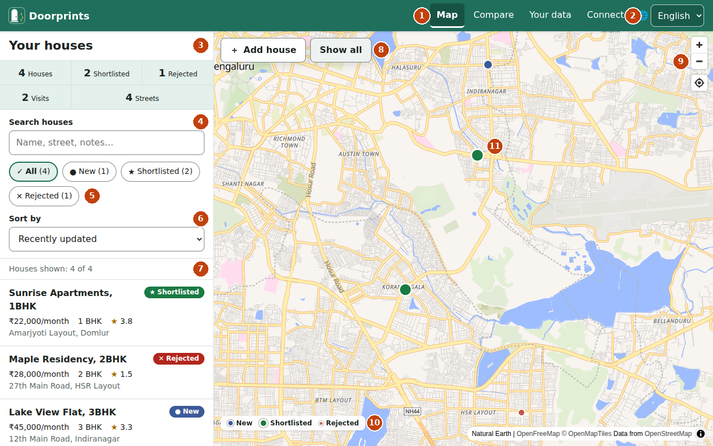

1. **Menu:** **Map**, **Compare**, **Your data** and **Connect**. **Ask** and **Plan** appear here only when your own server has AI turned on.
2. **Language:** English, हिन्दी, தமிழ், తెలుగు.
3. **Your houses:** counts of houses, shortlisted, rejected, visits and streets.
4. **Search houses:** type part of a name, street, locality or note.
5. **Status filter:** **All**, **New**, **Shortlisted**, **Rejected**, with how many are in each.
6. **Sort by:** **Recently updated**, **Best score** or **Lowest price**.
7. The house list. Choose a house to open it.
8. **Add house** starts adding a house; **Show all** zooms the map to fit every house.
9. **Zoom in**, **Zoom out** and **Show my location**.
10. The legend: blue is **New**, green is **Shortlisted**, red is **Rejected**.
11. A house on the map. Choose a pin to open that house.

On a phone the same page stacks the map above the list, and the menu moves to a bar at the bottom (**Map**,
**Compare**, **Your data**; **Connect** is inside **Your data**).

### Android

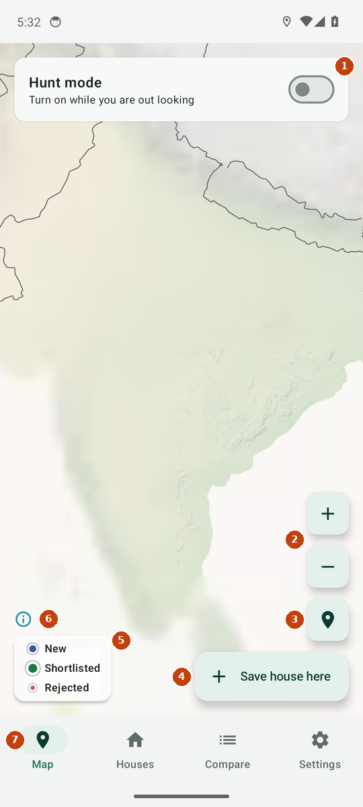

1. **Hunt mode:** turn it on while you are out looking (see [Hunt mode](#hunt-mode-android)).
2. **Zoom in** and **Zoom out**.
3. **My location.**
4. **Save house here** saves a house where you are standing. You can also long-press the map anywhere.
5. The legend: **New**, **Shortlisted**, **Rejected**.
6. Map credits.
7. The tabs: **Map**, **Houses**, **Compare** and **Settings**. An **Assistant** tab appears when your server has AI turned on.

This picture comes from an automated test on an emulator, which does not draw place names. On a real phone the map
has names and your houses as coloured pins, like the website's map. The **Houses** tab is the list:

### iPhone

The iPhone app is an early version. It opens on **Houses**. It cannot add houses yet: connect your own server in
**Settings**, and the houses you added elsewhere show up. The **Map** tab says the map is not on iPhone yet.

 

## Add your first house

**On the website**

1. On **Map**, choose **Add house**.
2. Choose the spot on the map where the house is, or move the map so the cross is on it and choose **Place here**.
3. The **New house** form opens. Type a **Name** (for example "2BHK near the park"). Everything else is optional.
4. Choose **Add house** at the top right.

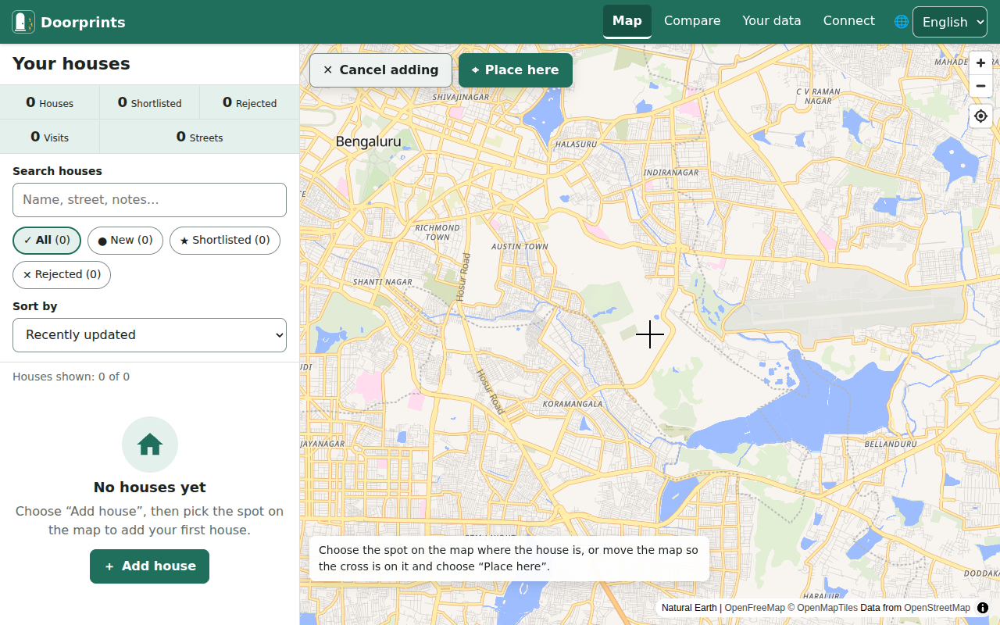

You can move the pin later: drag it on the small map, type the **Latitude** and **Longitude**, or choose
**Use my location**. **Fill address from map** fills in the street and locality for you.

**On Android**

Stand at the house and tap **Save house here** on the **Map**, or long-press any spot on the map. The **Save a house**
form opens with the place already set. Give it a name and tap **Save**.

## Keep notes on a house

Open a house from the list or the map. On it you can:

- set the **Status**: **New**, **Shortlisted** or **Rejected**;
- give **Your rating** out of five stars;
- fill in the price, **BHK**, address, contact and **Listing link**, and write **Notes**;
- score the **Checklist**, each item from 0 (bad) to 5 (great);
- record a visit: **Mark visited now** on the website, **I am here now** on Android;
- add photos: **Add photos** on the website, **Take photo** or **From gallery** on Android (save the house first).

Doorprints works out an overall **score** out of 5 from your rating and the checklist. Remember to choose **Save**.

 

**Delete house** removes a house with its notes, contact details and photos. Its visits stay in your history.

## Find a house again

Type in **Search houses** (Android: **Search name, street, notes**). The list shrinks as you type. The search looks at
the name, address, street, locality and notes; the website also looks at the contact name. Use the status chips to show
only **Shortlisted** houses, for example, and **Sort by** to put the best score or the lowest price first.

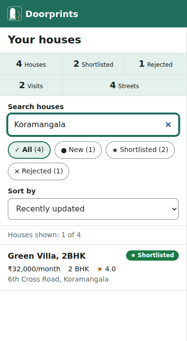 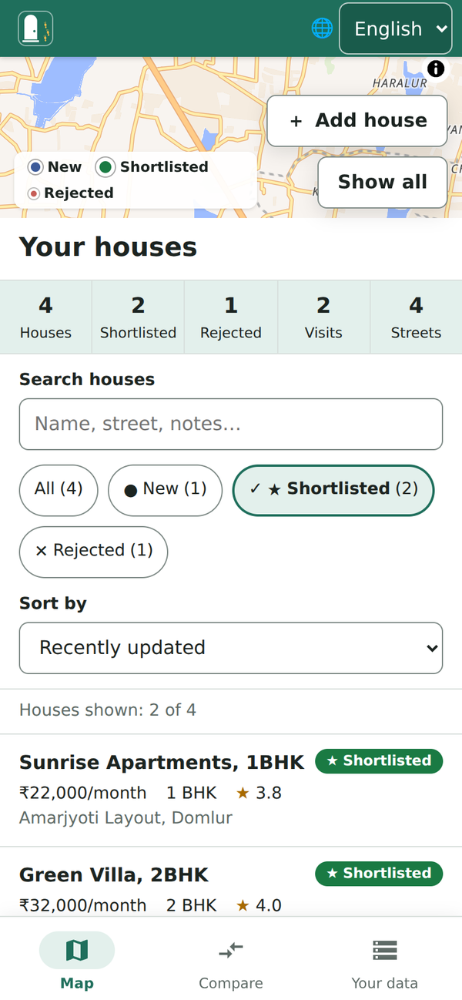

If nothing matches, choose **Clear search and filter**.

## Compare houses

Open **Compare**. Pick two to four houses (on Android, up to four; shortlisted ones come first). Rejected houses are
left out. Each row shows one detail: overall score, price, BHK, your rating, visits, street and each checklist item.
On the website the best value in each row is highlighted and marked ✓. Choose a house's name to open it.

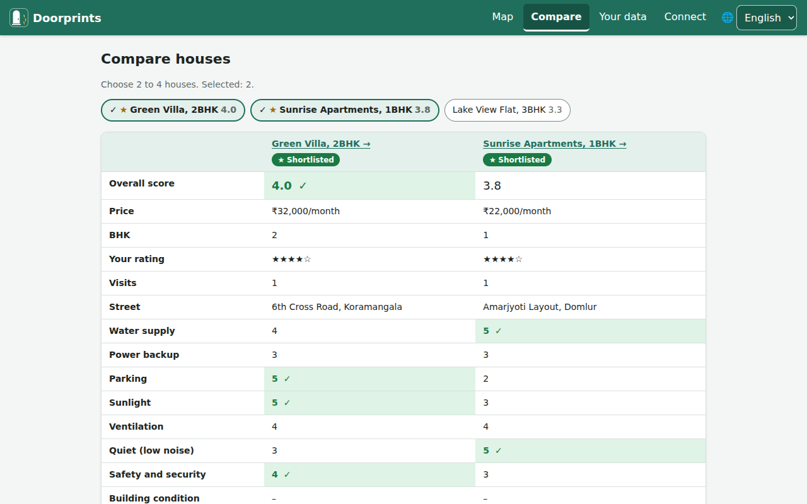

## Plan a round of visits

**Plan visits** puts the houses you want to see into a walking route, and **Ask** answers questions such as "Which
house had the best water supply?" from your own notes. Both use AI, so they need
[your own server](#connect-your-own-server-optional) with AI features turned on. Without one, **Ask** and **Plan** do
not appear in the website's menu, and Android has no **Assistant** tab.

When they are on: on the website, open **Plan**, describe what you want to see (for example "Shortlisted 2BHKs under
35k this afternoon"), set the **Start point** and choose **Plan route**. On Android, open **Assistant**, then
**Plan visits**, and tap **Plan from my location**. Walking times are estimates.

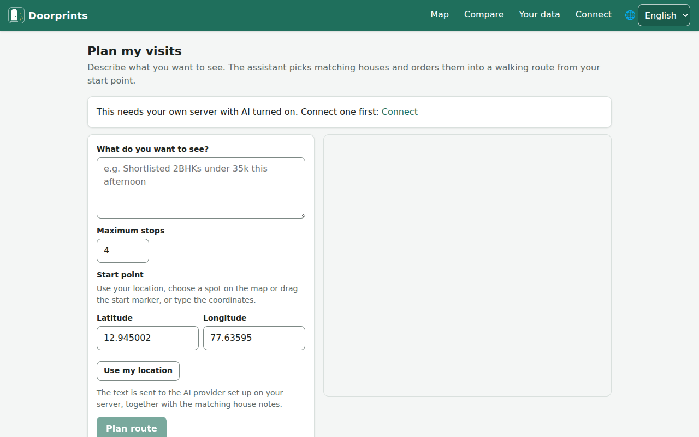

## Save a copy of your data

A copy is a file that is yours. It opens without Doorprints and without the internet. Make one now and then, and
before you change phones or clear your browser.

**On the website:** open **Your data**. Under **Save a copy**, choose a **Format**, then **What to include** (all
houses or **Shortlisted only**, which photos, **Include rejected houses**, **Include contact names and phone numbers**),
and the **Language of the file**. Choose **Download** (for PDF, **Open print view**, then "Save as PDF").

**On Android:** open **Settings**, then **Save a copy**, pick the format and options, and tap **Save to…** or **Share**.
**Weekly automatic backup** saves a backup once a week while the phone is charging, to a folder you choose.

- **Web page (HTML)**, **PDF**, CSV tables, **Excel** and **Markdown** are *readable copies*: good for reading,
  printing and sharing with family.
- **Full backup (ZIP)** holds everything, photos included. It is the only file Doorprints can read back in.

A copy with contact details holds owners' and brokers' phone numbers. Share it carefully.

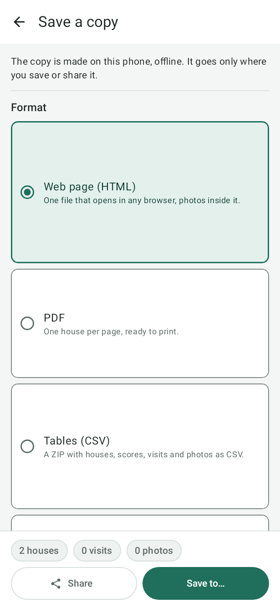 

## Import a backup

**Import a backup** brings houses, visits and photos back from a **Full backup (ZIP)**. Today only the Android app
can do this; the website cannot import yet. A full backup made on the website can be imported on Android.

1. On Android, open **Settings**, then **Import a backup**, and tap **Choose a backup file**.
2. Doorprints checks the file and shows **What this would change**. Nothing changes yet.
3. Choose how: **Merge with what I have** (a house is updated only if the backup's version is newer) or **Add
   everything as new copies**.
4. Tap **Import**.

Readable copies (HTML, PDF, CSV, Excel, Markdown) cannot be imported.

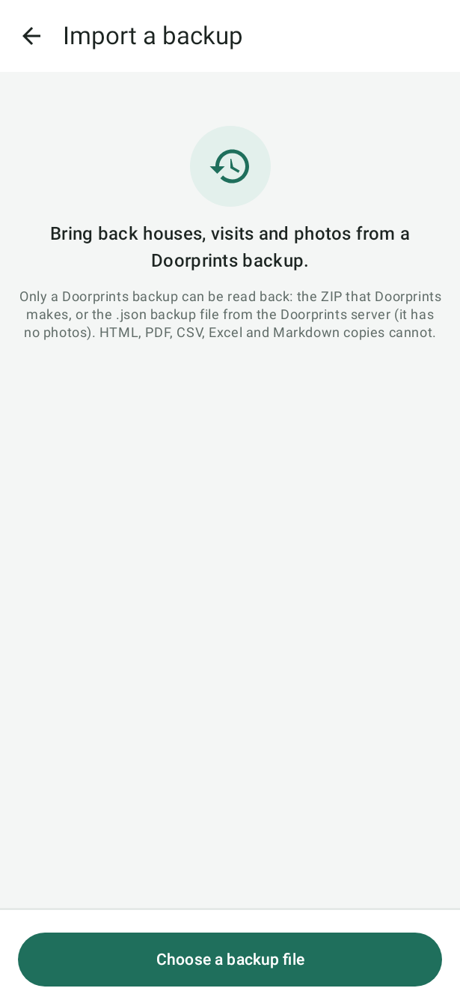

## Connect your own server (optional)

Doorprints works fully without a server. A server lets you keep the same houses on your phone and in your browser,
and turns on the AI features if its owner set them up. Doorprints does not run a public server; you (or someone you
trust) run one yourself (see the [README](../README.md#run-the-api-locally-docker)). The server's owner gives you its
address and an API key.

- **Website:** open **Connect**, fill in **API address (URL)** and **API key**, choose **Test connection**, then
  **Save and continue**. Leave **Remember on this device** off on a shared computer.
- **Android and iPhone:** open **Settings**, find **Server (optional)**, fill in **Server URL** and **API key**, and tap
  **Save and test**. **Sync now** syncs straight away. On Android, **Photos only on Wi-Fi** saves mobile data.

The address must start with `https://`. **Disconnect** on the website forgets the address and key on that device.

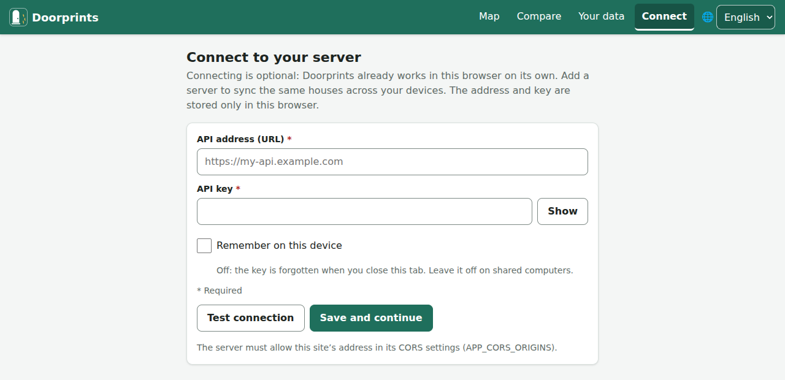

## Share a listing / Add a shared listing

Saw a good ad on WhatsApp or a website? Keep its text with a new house.

- **Website installed as an app on an Android phone:** in the other app choose Share, then Doorprints. The
  **Add a shared listing** page shows the text. Choose **Add a house from this**, then pick the spot on the map. The
  text goes into the new house's **Notes**. (To install the website, see **Install the app** on **Your data**.)
- **Any device:** paste the ad's text into a house's **Notes**. With AI turned on, **Fill in from listing text** on the
  form for a new house suggests the details for you to check.

## Hunt mode (Android)

Turn on **Hunt mode** on the **Map** while you walk around a neighbourhood. Your phone then tells you, with a
notification, when you come near a house you have already saved, and shows whether you have been on this street
before. If you stay near a house long enough, Doorprints records a visit for you.

In **Settings**, under **Hunt mode**, choose how close counts ("Alert when I am within 30 m of a saved house") and how
long a stay counts as a visit. GPS is usually accurate to 5–20 m, so neighbouring houses can be confused. Alerts pause
when the signal is weak, and Hunt mode stops by itself when the battery is low. It needs precise location and
notifications.

## Language and theme

Doorprints speaks English, हिन्दी, தமிழ் and తెలుగు. The Hindi, Tamil and Telugu wording is still being reviewed.

- **Website:** pick the language in the menu at the top right.
- **Android:** **Settings**, then **Language** (**System default** follows your phone).
- **iPhone:** Doorprints uses your iPhone's language; **Open iPhone Settings** lets you pick one just for Doorprints.

Light and dark themes follow your device's setting on all three.

## Your privacy

- Your houses, visits and photos stay in your browser or on your phone, and on your own server if you connect one.
  There is no Doorprints account and no advertising.
- The map pictures come from OpenFreeMap. On the website, **Fill address from map** asks OpenStreetMap's address
  service; on Android, street names come from the phone's built-in geocoder (Google).
- The AI features send your question and the matching house notes to the AI provider set up on your server.
- Hunt mode's location stays on your phone.
- India's boundaries on the map are shown as the Government of India depicts them.

## Troubleshooting and FAQ

**"Your data may not be kept."** Some browsers may delete a website's data when space runs low. Choose **Save a
backup**, or on **Your data** choose **Ask the browser to keep my data**. Installing the website as an app helps. On
iPhone and iPad, Safari can delete a site's data if you have not used it for a while: add Doorprints to the Home
Screen and save a backup regularly.

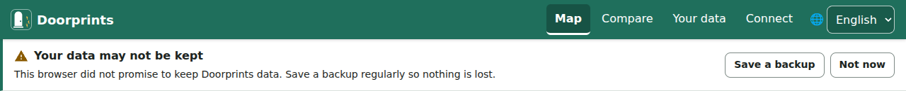

**The map is blank or grey.** The map needs an internet connection; your houses are still in the list. To add one
offline, use **Add at my location** or **Type latitude and longitude**.

**I don't see Ask, Plan or Assistant.** They appear only when a connected server has AI turned on.

**Can I move my houses from the website to my phone?** Yes: on the website, **Save a copy** as a **Full backup (ZIP)**,
then on Android use **Import a backup**. Or connect both to the same server.

**I added the same house twice.** Open the extra one and choose **Delete house**.

**Does Doorprints work offline?** Yes. The website works offline after your first visit; the apps work offline
always. Changes reach your server the next time you are online.

**Can I remove everything from this browser?** On **Your data**, **Remove all data** deletes every house, visit and
photo kept in this browser. Save a backup first if you want to keep them.
