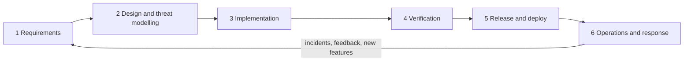

# Doorprints: Secure SDLC documentation

| Field | Value |
|---|---|
| Document | SSDLC document index |
| Version | 0.49 |
| Date | 2026-09-24 |
| Author | Claude (Cowork) |
| Status | Draft |

## Change log

| Version | Date | Author | Change |
|---|---|---|---|
| 0.1 | 2026-09-22 | Claude (Cowork) | First version. Index, phase map and update rules. |
| 0.2 | 2026-09-22 | Claude (Cowork) | Added 09 (OSI layer analysis) and the CI-backed update workflow; documents 01–08 moved to v0.2 after wave 2. |
| 0.3 | 2026-09-22 | Claude (Cowork) | Added 10 (sprint log) and the root [CHANGELOG](../CHANGELOG.md); story and candidate id prefixes; update rule for the changelog and sprint log. Sprint 2 versions: 01 v0.3, 02 v0.4, 03 v0.3, 06 v0.4, 07 v0.4, 08 v0.3, 09 v0.2 (row 5.5 and OSI-B04: dual API keys done). |
| 0.4 | 2026-09-22 | Claude (Cowork) | Sprint 2 outcome (all four workflows green on `f7da5ab` and `0e4e22a`) and Sprint 3 (first AI eval run: native Gemini embeddings and scorecard fixes, in code, waiting on an eval run). Versions: 01 v0.4 (RTM: TC-AI-11..14), 02 v0.5 (F-01 text: 32 characters; embedding flow re-checked), 03 v0.4, 04 v0.3 (DF-32 embedding request), 06 v0.5 (TC-AI-10 verdict, TC-AI-11..14), 07 v0.5, 08 v0.4 (AI settings, `AI_EMBEDDING_*`), 10 v0.2; 05 and 09 unchanged (v0.2). |
| 0.5 | 2026-09-22 | Claude (Cowork) | Sprint 3 lead decisions: F-01 split into F-01a (Fixed) and F-01b (Open); F-30 (contact name to the LLM provider) Fixed in code by the AI team (C-13); dev `docker-compose.yml` owned by Backend and passes the AI settings; senior reviewers with runtime pre-mortem, wire-format verification and contract tests. F-xx scheme allows a letter suffix for split findings. Versions: 01 v0.5, 02 v0.6, 03 v0.5, 04 v0.4, 06 v0.6 (TC-AI-15, TC-AI-16), 07 v0.6 (env table), 08 v0.5, 09 v0.3, 10 v0.3; 05 unchanged (v0.2). |
| 0.6 | 2026-09-22 | Claude (Cowork) | Sprint 3 coordinator rework: 01 v0.6 (PRV-009 reason for Part), 02 v0.7 (F-30 status cell per ai-design v0.10: rules, client label contract, limits, reindex after the v0.10 deploy), 06 v0.7 (TC-AI-12: 5-minute log window; TC-AI-15 final redaction cases), 08 v0.6 (reindex after the v0.10 deploy), 10 v0.4; 03, 04, 07 and 09 unchanged since v0.5. |
| 0.7 | 2026-09-22 | Claude (Cowork) | Sprint 3 outcome (`6a348cc`: Backend and Security green; first successful real Gemini eval run, 12/13 cases passed, `citationPrecision` 0.86 vs 0.90 open as E-03): 02 v0.8 (F-30 closed as Fixed by lead decision, evidence TC-AI-15), 01 v0.7 (AI-010 and PRV-009 evidence, AI-012 first eval result), 06 v0.8 (TC-AI-10 gap row: first real scorecard recorded; section 1 AI evals row: golden set v0.3 and the first real run; TC-AI-09 traces `allowedCitations`; new TC-AI-17 for the Ask prompt citation and contrast rules), 10 v0.5 (Sprint 3 CI, eval run and sign-off table, S3-05, section 7 Sprint 4 candidates C-14..C-21, not committed). |
| 0.8 | 2026-09-22 | Claude (Cowork), Docs team | Product rename to **Doorprints** (tagline "Remember every house you've seen."; the repository is still `house-hunt`): title and introduction; new ADR-13 in 03 records what changed and what did not. Versions: 01 v0.8 (also TC-AI-17 in the RTM), 02 v0.9, 03 v0.6, 04 v0.5, 05 v0.3, 06 v0.9, 07 v0.7, 08 v0.7, 09 v0.4, 10 v0.6. The v0.7 row now lists everything 06 v0.8 changed (it named only the TC-AI-10 gap row). |
| 0.9 | 2026-09-22 | Claude (Cowork), Docs team | Product-owner decisions of 2026-09-22: repository renamed to `Sriram-Codes-SW/doorprints` and public (MIT `LICENSE`, `SECURITY.md`), AI access policy (on-device AI for guests, cloud AI for the owner and invited users on a paid, hard-capped key, bring-your-own-key rejected), Vertex AI next to AI Studio, Google Cloud trial plan. Versions: 01 v0.9, 02 v0.10, 07 v0.8, 08 v0.8, 10 v0.7, 11 v0.3. Index lists 11 and `SECURITY.md`. |
| 0.10 | 2026-09-22 | Claude (Cowork), Docs team | Review fixes for the paid-AI hard cap and the Vertex credential: 01 v0.10 (AI-015 three layers with a Google Cloud spend cap budget), 02 v0.11 (new T-I22 Vertex credential leak; T-D4), 07 v0.9 (credential row in section 4; Cloud SQL not covered by spend caps), 08 v0.9 (section 10.2 rewritten, IR-9 spend cap tripped), sprint log v0.8, feature spec 11 v0.4. |
| 0.11 | 2026-09-22 | Claude (Cowork), Docs team | Vertex AI provider code landed (AI team, same change set), docs synced: 01 v0.11 (AI-016 implemented, new AI-017 spend cap response), 02 v0.12 (T-I22: ADC only, no Vertex API key; rotation by credential type), 03 v0.7 (section 13 both providers, `AI_QUOTA_EXHAUSTED`, section 9 `setupHint`), 04 v0.6 (E6, DF-21, DF-32 with Vertex endpoints incl. `us`/`eu` multi-regions, OAuth tokens and location), 06 v0.10 (TC-AI-10, TC-AI-16, new TC-AI-18..22 incl. `AiExceptionHandlerTest`), 07 v0.10 (section 4 real variable names, section 7 new settings; `ai-evals.yml` `provider` defaults to `aistudio` until vertex-setup step 10), 08 v0.10 (section 1.1, 5.2, IR-9, section 9 `setupHint`, 10.2 trial alert thresholds), 10 v0.9 (C-24 code landed, spend cap acceptance item), 11 v0.5 (markers removed). |
| 0.12 | 2026-09-22 | Claude (Cowork), Docs team | Sprint 3.5 "KMP foundation" (`8f583af`), the Sprint 4b scope additions and the Vertex AI setup outcome: 01 v0.12 (FR-083..FR-088, NFR-030, SEC-049, PRV-024..PRV-027, PRV-001 amended; RTM with the shared-module tests), 02 v0.13 (T-I20 data residency: chat in `asia-south1`, embeddings on `global`), 03 v0.8 (ADR-14 KMP, section 4.2.1 module boundaries, R-06 part, ADR-01 note), 04 v0.7 (transport path with the Ktor client; DF-32 location), 06 v0.11 (commonTest suites, TC-U-35..37, TC-M-17), 07 v0.11 (`shared-ios.yml`, `gradle-dependency-graph`, Vertex variables), 08 v0.11 (trial end checklist 10.4), 09 v0.5 (Ktor client rows), 10 v0.10 (sections 9 and 10), 11 v0.6 (5.16..5.18, D-23..D-25; its ADR proposals renumbered to ADR-15..18), ai/ai-design v0.17 and ai/vertex-setup v0.3 (edited by the Docs team this sprint; the AI team is idle). Android bullet names the `:shared` module. |
| 0.13 | 2026-09-22 | Claude (Cowork), Docs team | Review fixes: 01 v0.13 and 11 v0.7 (Hunt mode reminder scheduling: exact alarm when allowed, otherwise a 10-minute window ending at the reminder time; mutable geofencing `PendingIntent` in T-E8/SEC-049), 02 v0.14 (T-I23, T-I24, T-E8), 06 v0.12 (section 13, Sprint 4b tests), 10 v0.12 (CI runs of `8f583af` and `feb0294`, first Vertex eval), [ai/ai-design.md](ai/ai-design.md) v0.18 and [ai/vertex-setup.md](ai/vertex-setup.md) v0.4 (inline-marker Ask citation rule, Vertex run 35753477789). |
| 0.14 | 2026-09-22 | Claude (Cowork), Docs team | **Doc debt cleared and Sprint 4a (S4-06).** Debt: commit `19006bc` recorded green on Backend, Security, Android and Shared iOS compile, with the path-filter caveat spelled out (only Backend and Security are triggered by that push; Web's last green run is still `0e4e22a`) and the `feb0294` follow-ups closed; the `provider=vertex` eval run **35758157317** recorded (13/13 cases and every metric, golden set v0.5, 198 s, two provider `503`s absorbed by the retry), replacing the "not yet confirmed" and "re-run open" placeholders in the CHANGELOG and 10; the CHANGELOG `[Unreleased]` section now names `19006bc` as the current green commit instead of leaving `0e4e22a` to be read as one; 07 v0.13 Dependabot table (the `npm-dev-major` group, the docker `maven` ranges that keep the build image on JDK 25, and a *not yet exercised* row for both) and the dependency-graph state (repository setting now enabled; the `Submitted ...` notice still to be read). **PO-9** recorded in 10 §10.3: **both AI providers stay**, the owner takes the billing risk, no removal story. Sprint 4a: 01 v0.14, 02 v0.15, 03 v0.9, 04 v0.8, 05 v0.4, 06 v0.14, 10 v0.14 (new section 11). Where the code differs from [11](11-feature-parity-and-export-spec.md)'s plan, the docs describe the code: no new npm dependency, four CSV tables not seven, no PDF writer on the web, and **the web app cannot import yet**. |
| 0.15 | 2026-09-22 | Claude (Cowork), Docs team | **Review fixes on the v0.14 change set.** The green Vertex run had closed E-03 in 10 §10.2, C-24, 01 AI-012 and the CHANGELOG, but not in the places a reader consults for defect and test status: **10 v0.15** (§5.2 E-03 **Fixed, closed** by run 35758157317; the AI-012 bar restated as 01 states it; §5.5, S3-01, C-07 and the §7 intro follow; **C-22 flipped from candidate to landed**) and **06 v0.15** (section 1 AI evals row and the section 10 TC-AI-10 gap row record the run and close the E-03 action, keeping the AI Studio re-run, the credit check and vertex-setup step 9 as what is open; §14.2 TC-U-30 → TC-U-42). **07 v0.14**: the two CI changes that landed in the same tree — `codeql.yml` and the `web.yml` Pages jobs — are now in section 1, the false “only job in the repository with a write scope” claim about `gradle-dependency-graph` is corrected to name all four reviewed exceptions, “Why no CodeQL” becomes “CodeQL landed, Semgrep stays the gate”, and 6.3 gains a GitHub Pages note (F-31). **02 v0.16** and **03 v0.10**: RR-10 / §16.4 no longer claim “Safari never grants `persist()`” — reworded to MDN's *Storage quotas and eviction criteria* (automatic decision from interaction history, no prompt; seven-day eviction without user interaction; Home Screen apps get the browser quota), and the blank line before 02 §5.1's *Totals* paragraph is restored. **README**: the web app described as local-first with the PWA, and the feature table marked as covering unreleased 4a work. |
| 0.16 | 2026-09-22 | Claude (Cowork), Docs team | **Second review round on the 4a change set: four doc-versus-code mismatches.** **01 v0.15** — FR-048 no longer claims an unmetered-network constraint (`AutoBackupWorker` sets charging + battery-not-low only, and a network constraint on a local SAF write would be wrong to add); SEC-041 states the cap the reader enforces, **16 MiB** (`BackupFormat.MAX_DATA_JSON_BYTES` in `:shared`), and stops claiming "the same rules" hold in the web and server readers; NFR-027 uses RR-10's MDN wording. **02 v0.17** — T-T8's `data.json` cap corrected to 16 MiB. **04 v0.9** — the D9 retention cell still carried the "Safari never grants `persist()`" claim this review had already rejected in 02 RR-10 and 03 §16.4. **05 v0.5** — §14.5's Safari rule and UX-B07's "the pure `ImportPlan` port is the small part". **07 v0.15** — the `codeql.yml` row and the SAST paragraph now say the coverage is described from the workflow source, which has never run. **10 v0.16** — §11.3 item 1 no longer records the web `ImportPlan` port as done (there is no TypeScript import code in `web/src` at all), S4-07 drops the unmetered claim, S4-06 lists the versions the documents actually carry, and two new §11.3 rows carry the `data.json` cap disagreement (16 / 64 / 8 MiB across `:shared`, schemas/README §7 + the web mirror, and the server body cap) and the unmade decision about an unmetered auto backup. **CHANGELOG**: the same unmetered-network claim removed. Passed to the Web team, not ours to fix: `web/src/app/data/storage.service.ts:14` carries the stale "Safari never grants it" comment. |
| 0.17 | 2026-09-22 | Claude (Cowork), Docs team | **Third review round on the 4a change set: GitHub Pages is switched on.** The owner set Settings → Pages → Source = “GitHub Actions”, so the web app is public at https://sriram-codes-sw.github.io/doorprints/ from the first 4a push to `main`. **07 v0.16** (section 1 `web.yml` row, diagram, section 6 intro and 6.3: real URL instead of `<owner>`; `continue-on-error` still in `web.yml`, removed by DevSecOps after the first green deploy; S4-05a named; the manifest has `start_url`/`scope` `"./"` and **no `id`**, for the MDN reason; build-time `<meta>` CSP and the shared origin), **10 v0.17** (new S4-05a row; §11.1 postscript; §11.2 watch point 3; §11.3 row 2 — F-31 live, owner decision needed), **02 v0.18** (F-31, T-T13; RR-11 no longer accepted but awaiting the owner's explicit decision, since its "preview host" condition lapsed), **04 v0.10** (DF-46 and D10: Cache Storage is per origin and the github.io origin is shared, so the cache is named by deployment path and only this app's caches are deleted; DF-45 and D5 note the shared origin for IndexedDB and `localStorage`). Root README Web row and CHANGELOG *Unreleased* follow. |
| 0.18 | 2026-09-22 | Claude (Cowork), Docs team | **Fourth review round on the 4a change set: the test plan catches up with the PWA and Pages changes.** **06 v0.16** — §14.2 no longer says Pages serves the app "without CSP": Pages sends no response headers and only the built `index.html`/`404.html` carries a `<meta>` CSP (no `frame-ancestors`, not yet built in CI); new **TC-U-43** (written: `pwa.service.spec.ts`, `sw-precache.spec.ts`), new **TC-M-19** (the live check on https://sriram-codes-sw.github.io/doorprints/ after the first 4a push, not yet run), **TC-S-19** widened to the shared origin, and a gap row for `public/sw.js`, which has no unit test. **02 v0.19** — F-31 §5.1 worded as found, and `Referrer-Policy` recorded as not sent on Pages but equal to the browser default. **07 v0.17** — Pages republishes only on pushes that touch `web/**` or `web.yml`; `Referrer-Policy` in the missing-headers list; the manifest identity without `id` resolves against the manifest URL, not `<base href>`; TC-M-19 is the condition for removing `continue-on-error`. **04 v0.11** — DF-46 and D10 describe what Cache Storage really holds since the per-build stamp. **10 v0.18** — S4-05a, S4-06, §11.1, §11.2 watch point 3 (plus the map-worker symptom) and §11.3 row 2 follow. |
| 0.19 | 2026-09-22 | Claude (Cowork), Docs team | **Fifth review round on the 4a change set: docs versus the code as built.** **01 v0.16** (FR-048 folder forgotten on turn-off, FR-070 install card + one-time banner + build-stamped manifest `id`, FR-072 share-target handling, SEC-041 one 16 MiB cap, SEC-044 build files, RTM). **02 v0.20** (new T-I25 persisted Android document grants, T-I26 share target as untrusted inbound text; Safari hedge on the referrer default in F-31/T-T13; T-T8 cap). **03 v0.11** (`PwaService`, §16.4 install/cache/navigation drift, PDF: new tab on phones and hidden frame on desktops, ADR-20 pinning). **04 v0.12** (new §6b and DF-47 share target, DF-48 weekly backup, store D11 persisted grants; D10 legacy `doorprints-shell-v1` caveat). **05 v0.6** (§14.1 *Preparing…*, *Open print view*, Photos only for HTML/PDF/backup, progress bar, one primary button; §14.4 rewritten; phone bottom navigation and `--nav-h` in 2.4.11; new §14.8). **06 v0.17** (TC-I-34 per ticket S4-00/e, TC-U-43 manifest id, new TC-U-44..47 and TC-M-20, counts 18 web specs / 27 Android test classes, new §14.3 file-to-row map). **07 v0.18** (build-stamped manifest `id`; CORS origin `https://sriram-codes-sw.github.io` in 6.3, section 7 and the checklist; `MAX_IMPORT_BYTES`/`ROWS`). **08 v0.12** and **11 v0.8** (ticket S4-00/c: the API export is `doorprints-backup/1`, restore through `POST /api/import`). **10 v0.19** (S4-00/03/05a/07 results, §11.3 items 7 fixed, 9 and 10 new, §11.5 Android handovers). Root README: CORS origins in the deploy and local-API steps. Where an old change-log row was wrong, a bracketed note was appended to it; its original text is unchanged. |
| 0.20 | 2026-09-22 | Claude (Cowork), Docs team | **Sixth review round on the 4a change set: the CI changes DevSecOps made after the fifth round.** `backend.yml`, `android.yml` and `web.yml` changed in the working tree (2026-09-22 23:07–23:08, not yet triggered in CI). **07 v0.19** (section 1: `backend.yml` runs on `backend/**` plus every outside file its tests read — `docs/ai/evals/**`, `docs/schemas/**`, `docker-compose.yml`, the web golden, `backup-export.ts`, `Backup.kt` — each named with its test; `android.yml` also on `docs/schemas/**`; section 3's path-filter example made path-neutral; the manifest-id guard requires `id` to equal `/doorprints/` exactly and fails when it is absent, in section 1 and 6.3). **06 v0.18** (TC-I-34 and §14.2: the parity path-filter gap is fixed in the working tree; new **TC-U-48** for the web sync's 429 handling, FR-071/NFR-027/SEC-008; §10's general-429 gap narrowed to the server side). **10 v0.20** (§11.3 item 10 struck through as fixed in the working tree; §11.2 guard wording; §9.2 `19006bc` backend filter corrected). **02 v0.21**, **04 v0.13**, **01 v0.17** (share target T-I26 / DF-47 / FR-072: the text leaves the URL but stays in `history.state` until the map strips it or the house is saved, an abandoned form keeps it until the tab closes, and session restore may keep it — residual, with a proposed Web ticket; 01 also traces SEC-008 to TC-U-48). **Android round 7** (`android/shared/README.md` 1.9, 23:10–23:15, landed during this round): **05 v0.7** (§14.3 the *checklist scores will be cleared* preview warning in four languages; §14.1 the backup's visit count), **11 v0.9** (§5.2 a JSON backup of *All houses* carries visits that belong to no house, Android only), 06 TC-U-29/TC-U-42 name the new tests, 10 §11.3 item 11 (web backups still drop them) and §11.5 rows 5, 7, 8, 9. |
| 0.21 | 2026-09-23 | Claude (Cowork), Docs team | **Owner decision (Sriram, 2026-09-23 07:30 IST): the web app is hosted on Cloudflare Pages, not GitHub Pages**, at the root of its own origin `https://<project>.pages.dev` — GitHub Pages cannot send `_headers`, and its origin `https://sriram-codes-sw.github.io` is shared with the owner's other Pages sites, including secure-doc-viewer (verified on 2026-09-23 to run no scripts at the time). **02 v0.22** (F-31 Fixed by the move, pending live evidence; RR-11 closed; new RR-12, old deployments stay reachable; T-T13, T-I26), **03 v0.12** (new ADR-21 hosting; §5 deployment; §16.3 import writes), **07 v0.20** (§1 `deploy-cloudflare`; §4 Cloudflare secrets; §6.3 rewritten with the owner setup; §7/§8 `APP_CORS_ORIGINS` = the `pages.dev` origin), **06 v0.19** (TC-M-19 for the live Cloudflare site, new TC-S-23 post-deploy header check and TC-U-49 frame refusal), **10 v0.21** (§11.6 the decision; §11.3 items 2 and 9; §11.5 Android handovers 10–13), **04 v0.14**, **01 v0.18**, **08 v0.13**, **11 v0.10** (COOP vs Google sign-in for Sprint 5). Also the Android rounds 8 and 9 in **05 v0.8**: §4.5 Android token mapping, §4.3 Android Indic line heights, §14.2 the calm amber contact note on both platforms, §14.3 rewritten to the shipped import screen. Root README and CHANGELOG updated. |
| 0.22 | 2026-09-23 | Claude (Cowork), Docs team | **Review fixes on the Cloudflare Pages change set.** **07 v0.21** (§6.3 item 1 caching: only `no-cache` rules for `sw.js`, the manifest and `index.html`, Pages' default `max-age=0, must-revalidate` for everything else, and why no long `max-age` rule may come back — Cloudflare's SPA fallback answers a missing chunk with HTML and status 200; no address guessed from the project name; Conventions *Pinning* records `cloudflare/wrangler-action@v4` as an open exception; §4 and §6.3 recommend the Cloudflare secrets as environment secrets of `cloudflare-pages` restricted to `main`; CORS trailing slash is tolerated, a path is not; the probe step fails first), **09 v0.6** (row 7.6 caching), **02 v0.23** (secure-doc-viewer evidence = its `gh-pages` branch at `68e3a625`; T-T5 pinning exception; T-T13 caching residual), **03 v0.13** (ADR-21 (c) no longer says "verified"; §16.4 caching line), **10 v0.22** (§11.6 Web caching, DevSecOps open items, owner step to record the real address), **08 v0.14** (§5.2: replace the Cloudflare token where it is stored). Root README (no guessed address; Sprint 4a "not pushed yet") and CHANGELOG updated. |
| 0.23 | 2026-09-23 | Claude (Cowork), Docs team | **Owner decisions of 2026-09-23, later that morning.** (1) **The web app is hosted on Firebase Hosting at `https://doorprints.web.app`** (Spark plan, no billing account, project and site `doorprints`; the owner's setup is done, the first deploy follows the next push to `main`), replacing the Cloudflare Pages plan, which the owner rejected because a `*.pages.dev` address reads as a test site and which was never set up. (2) **The import definition is approved** (Sprint 4b story S4b-00). (3) The **brand advisor's naming brief** becomes new document **12**. (4) Android rounds 10–12 are recorded. Versions: **01 v0.19** (new §6.9 FR-089..FR-097; FR-038 *Fill in from listing text*; FR-047 undelete status; CON-01), **02 v0.24** (T-T13 and T-T5 for Firebase; new T-T14 deploy path, T-D9 Spark quota; RR-12 withdrawn; new RR-13..RR-15; TB8), **03 v0.14** (ADR-21 rewritten with the history; §5 Web row incl. `Referrer-Policy`; §16.4), **04 v0.15**, **05 v0.9** (§14.1, §14.3 undelete with "visits and photos" pending device check 10b, §14.6 vocabulary, I18N-B06, §14.10), **06 v0.20** (TC-S-23, new TC-S-24, TC-M-19, TC-U-42, new TC-U-50 and TC-M-21, backend test gap), **07 v0.22** (§6.3 rewritten: setup status, the owner's steps as done, deploy identity, `web/firebase.json`; §1, §4, §7, §8), **08 v0.15** (usage monitoring, IR-5, new IR-10 rollback, §5.2 deploy identity), **09 v0.7**, **10 v0.23** (§11.6 rewritten, §11.5 rows 14–18, Vertex credit check ₹45, new section 12 Sprint 4b), **11 v0.11** (RK-06, RK-12, G-02 and §5.9 say *add*), **new 12 v0.1**, **schemas v1.4** (section 0 "What an import is" only), new `ops/firebase-hosting-setup.md` (pointer). |
| 0.24 | 2026-09-23 | Claude (Cowork), Docs team | **Final Sprint 4a round: the whole-app UX audit and the owner's decisions of 2026-09-23.** 01 v0.20 (RTM names the audit's tests), 05 v0.10 (Android handovers 20–34, the web shell of round 3, new §5.1 and §7.2, and **§15 Design and UX self-check**), 06 v0.21 (TC-U-51..53, TC-M-22..24, TC-A-13, the release guard in §11), 07 v0.23 (**Appendix A Security self-check**), 10 v0.24 (the UX go-ahead sign-off §11.7, handovers 19–34, owner decisions §12.5, the licence change as the next item §12.6), 11 v0.12 (Android pick-a-spot add mode), 12 v0.2 (*Import a backup* done on Android). The index rows for 05 and 07 name the two self-checks. |
| 0.25 | 2026-09-23 | Claude (Cowork), Docs team | **The owner's recorded decisions of 2026-09-23, 17:53–20:03 IST** (Docs pre-review buddy). 10 v0.25 (§12.5: the full release security gate, with automated, manual and pentest parts; new story S4b-SEC-3 for a future `docs/13-release-security-checklist.md`; web deploys pass the gate once it exists; the seven process improvements, 3 on hold, with checks kept inside the existing workflows; **the first release's Definition of Done**; handover 19 applied). 06 v0.22 (§11 *First web deploy* and *Play Store release* rows; two web specs traced). 05 v0.11 (hi/ta/te ship *under review*; the Telugu empty-state wording differs between the platforms; a failed save cancels "Saving…"; §15.5 rule 5). 07 v0.24 (A.5 items 5 and 6). 12 v0.3 (N-06, the app icon). 03 v0.15 (ADR-13 icon note). schemas README v1.5 (the device note under §6 rule 6). |
| 0.26 | 2026-09-23 | Claude (Cowork), Docs team | **Round 1 review of the Docs final Sprint 4a round** (one major, two minors), checked against the lead's decision log rather than the playbooks. 10 v0.26 (§12.5 Decision 2: S4b-EFF-4 states the owner-approved review rules, namely one complete pass in round 1, later rounds the delta plus its regressions only, the blocker/major/minor rubric, out-of-scope findings as `BACKLOG:` minors that never block, and `NEW RULE:` for a new class; measures 4 and 5 in use since the final Sprint 4a round; S4b-EFF-6's target 35 % to more than 70 % first-pass by the end of Sprint 4b). 05 v0.12 (§15.5 opens with the same rules; rule 6's goal aligned). 07 v0.25 (A.5 opens with the same rules). 06 v0.23 (the 0.22 change-log row reattached to its table; TC-U-53 and §14.3 add `connect-page.spec.ts` and `shared/run-result.spec.ts`, written after v0.22). |
| 0.27 | 2026-09-23 | Claude (Cowork), Docs team | **Pre-deploy close-out** (Sprint 4a; the delivery coordinator's final review, second pass). **05 v0.13**: §15.3 R9 and R17 gain the three rules of the web README's round 2 handover. An in-progress message is replaced or withdrawn on every way its task can end, and a shared announcer's cancel removes only its caller's message. A repeatable alert or status is keyed on its run. Every busy indicator has its failure and cancel paths checked. R16 gains the markdown table rule, and §9.3 and I18N-B03 record the owner's confirmation that hi/ta/te ship *under review*. **06 v0.24**: §11 *First web deploy* and TC-S-19 point to `web/README.md`, *Storage audit on the live site*. TC-S-19 also covers the wider "Remove all data" (`hh.*` and `doorprints.*` localStorage keys, and the app's own worker). TC-U-53 and §14.3 add `shared/locate-once.spec.ts` and the new spec cases (the Web team's close-out handover). **10 v0.27**: new §12.7 lists what is left before the first deploy, backlog tickets S4b-BL-1..5 (BL-3, the 32 px favicon, and the map and Plan geolocation guard were done by Web in the same round) and the `NEW RULE:` candidates (a)–(g); §12.5 Decision 1 now points to the storage audit steps too. **Update rule 2** states the change-log date convention: the real date of the change. The root CHANGELOG's *Unreleased* gains the Web close-out changes: the location guard and the 32 px tab icon under Fixed, and the wider "Remove all data" under Security. |
| 0.28 | 2026-09-23 | Claude (Cowork), Docs team | **Round 1 review of the pre-deploy close-out** (two majors, two minors): the Web team's buddy pre-review row in `web/README.md`, which landed after v0.27, is applied. **06 v0.25**: TC-U-53 and §14.3 add `pages/plan/start-field.spec.ts`; TC-S-19 and the §14.3 `session-leftovers` row cover the `sessionStorage` sweep of every `hh.*` and `doorprints.*` key (`house-hunt.api-config` is left to `ConfigService.clear()`) and the expected `hh.mapView` after the first map start. **10 v0.28**: §11.7 W2, the §12.4 Web row and §12.7 S4b-BL-5, (W2) and candidate (f) record W2 and S4b-BL-5 as done, awaiting review; new candidate (h). The root CHANGELOG adds the sessionStorage sweep under Security and W2 and S4b-BL-5 under Fixed. **Update rule 7**: only `ai/` belongs to another team; 05 is maintained by Docs from the Design and UX handovers (the document set's 05 row says so too). **New update rule 11**: a Docs hand-off names the last handover row it applied from each team README. |
| 0.29 | 2026-09-23 | Claude (Cowork), Docs team | **Last Docs sync before the first deploy** (the delivery coordinator's final review of the pre-deploy close-out; Docs items only). Handovers applied (update rule 11): `web/README.md` up to its row dated 2026-09-22, *Pre-deploy close-out, round 3 review fixes (Sprint 4a, 2026-09-23)*, with the round 1 and 2 rows before it; `android/shared/README.md` up to 1.34 (unchanged since the earlier round). **05 v0.14**: §5 *Start point (web)* (the default view is never a start the user chose; every way of setting the start withdraws the message under the start fields; `start-msg` in both fields' `aria-describedby`, the focused field `aria-invalid`); §15.3 R6 and R9 gain the coordinator's two NEW rules, with pointers from R11 and R18. **06 v0.26**: TC-U-53 and §14.3 add `nextTypedStart` and the stored-map-view cases (`parseMapView`, `startPointFromView`, `loadStartPoint`); TC-S-19 adds the untouched `hh.mapView` that is never read back as a user choice, and storage blocked for the site. **10 v0.29**: §11.7 W2 (`nextTypedStart`); §12.7 backlog tickets S4b-BL-6 and S4b-BL-7 (owner Web), candidate (f)'s third finished case, and candidates (i)–(k). The root CHANGELOG adds the four round 1 and 2 web fixes under Fixed (not yet built in CI) and the docs versions under Changed. |
| 0.30 | 2026-09-23 | Claude (Cowork), Docs team | **Owner decision: CI runs on every branch** ([10](10-sprint-log.md) §12.5 Decision 5). 02 v0.25 (T-E4, T-I21), 07 v0.26 (§1 *Branch runs*, triggers, diagram, Conventions, pinning of `gradle/actions`, §3, §4, §5, 6.3), 10 v0.30 (§12.5 Decision 5). Rule 10 says to push to a branch and merge when green. Root README and CHANGELOG *Changed* follow. |
| 0.31 | 2026-09-23 | Claude (Cowork), Docs team | **Pre-review fixes to the branch-runs change.** 07 v0.27 (the `main` ref guard is not a boundary for the `HH_*` repository secrets, since a branch can edit it; the `release` environment restricted to `main` is the control, planned as S4b-BL-8; §3 *Environments* planned, not in place; concurrency on `main`: an in-progress run is never cancelled, only the newest waiting run starts; §3.1 what a branch run does not test), 02 v0.26 (T-E4), 10 v0.31 (Decision 5 items 2, 3, 7 and Status; S4b-BL-8; C-22 trigger). Rule 10: green means the latest run of each triggered workflow on the branch, with the branch up to date with `main`. Root README (CI paragraph with `codeql.yml`, house rule 1) and CHANGELOG follow. |
| 0.32 | 2026-09-24 | Claude (Cowork), Docs team | **Owner issue P0 of 2026-09-24: India's boundaries on the map.** 01 v0.21 (FR-098), 02 v0.27 (RR-16, review trigger), 03 v0.16 (ADR-22), 05 v0.15 (§7.3), 06 v0.27 (§15: TC-U-54, TC-U-55, TC-S-25, TC-M-25), 07 v0.28 (CI checks of the boundary file), 10 v0.32 (§12.8, S4b-BL-9, S4b-BL-10), 11 v0.13 (D-26, §10). Root README (*Map data and credits*) and CHANGELOG *Fixed* follow. |
| 0.33 | 2026-09-24 | Claude (Cowork), Docs team | **Round 1 review of the India's boundaries Docs change** (two majors, one minor; code compared as of 2026-09-23 19:56 UTC, 2026-09-24 01:26 IST). 01 v0.22 (FR-098: Impl on Android, Partial on the web), 02 v0.28 (RR-16 residual), 03 v0.17 (ADR-22 rule 2's adm0 guard and why, the world maxzoom on both, Consequences: doubled lines inside the claim areas, offline, `boundary_3`), 05 v0.16 (§7.3 rows corrected; §15.3 R20 gains the parity `NEW RULE:`), 06 v0.28 (TC-U-55: 15 tests; TC-U-54 and §15: the web gap; TC-M-25: doubled-line pass rule, admin lines, loading, offline, cold start, zoom 5.0, street zoom), 10 v0.33 (§12.8, S4b-BL-11, S4b-BL-12), 11 v0.14 (§10: open parity gap, not "identical"). CHANGELOG *Fixed* follows. |
| 0.34 | 2026-09-24 | Claude (Cowork), Docs team | **Comment and docs sync of the India's boundaries change** (no behaviour change; code compared at HEAD `3ad2b58` of `fix/india-boundaries`; last team rows applied: `android/shared/README.md` 1.39 and the `web/README.md` row of 2026-09-24, *comment and README sync*). The web has had rule 2's adm0 clause and tile-zoom guard since `aef007c`, so every "open parity gap (web)" is removed: 01 v0.23 (FR-098 Impl on both), 02 v0.29 (RR-16), 03 v0.18 (ADR-22: constant names `COUNTRY_LINE_RULE`, `COUNTRY_LINE_RULE_LEGACY`, `TILE_ZOOM_GUARD`; the tile-zoom guard in rule 2 and rule 5; renderer claim corrected from the sources, the guards are defence in depth on both maplibre-gl 6.10.0 and maplibre-native android-v13.6.1; measured offsets instead of "about a kilometre"; doubled-line list per Android README 1.38 item 38 (b); the Assam-Arunachal Pradesh state line limit), 05 v0.17 (§7.3, new *State lines* row), 06 v0.29 (TC-U-54 37 cases, TC-U-55 18 tests, TC-M-25 thresholds and the Arunachal-Bhutan, Arunachal-Myanmar and Jammu-Sialkot failure rule), 10 v0.34 (§11.5 items 36 and 38, §12.7 S4b-BL-11 corrected and new S4b-BL-13 to S4b-BL-16, §12.8), 11 v0.15 (§10 "the same five rules"). Root README (*Map data and credits* known limits) and CHANGELOG *Fixed* follow. |
| 0.35 | 2026-09-24 | Claude (Code), Docs team | **The doubled lines and the Assam-Arunachal Pradesh state line** (owner request of 2026-09-24; branch `fix/india-boundary-lines`, PR #16, HEAD `9e0036e`; S4b-BL-11, S4b-BL-15, S4b-BL-16 done there; after the design review the India-China border is India's outline alone). 01 v0.24 (FR-098 known limits), 02 v0.30 (RR-16 residual, sha256, CI kinds), 03 v0.20 (ADR-22: rule 2's India-China clause, the 7 shared stretches, connectors, the `state` kind and layer, Consequences), 05 v0.18 (§7.3), 06 v0.30 (TC-U-54 41 cases, TC-U-55 20 tests, TC-S-25, TC-M-25 incl. step (3) with Google Maps' India region, §10 gap row), 07 v0.29 (`pwa-files` requires kind `state`), 10 v0.36 (§12.7, §12.8, new §12.10), 11 v0.16 (§10 parity row), 14 v0.3 (§1, N2). Root README (*Map data and credits*), `web/README.md` (intro and a row of 2026-09-24), `android/shared/README.md` 1.41 and 1.42, CHANGELOG *Fixed*. |
| 0.36 | 2026-09-24 | Claude (Code), Docs team | **Round 2 reviews of PR #16** (branch `fix/india-boundary-lines`): the Singalila spur fix (data sha256 `25984afa…a024`, `claim` 5 pieces), the known minors sized (Sikkim tri-junction loops; the tile line's overrun at Jomotsangkha and Longwa; the Tumen China-North Korea line) and the review results. 01 v0.25 (FR-098), 02 v0.31 (RR-16 sha256 and the India-China clause in *Mitigation*), 03 v0.21 (ADR-22 data and Consequences), 05 v0.19 (§7.3), 06 v0.31 (TC-U-55, TC-M-25), 10 v0.37 (§12.10, new S4b-BL-17 in §12.7), 11 v0.17 (§10), 14 v0.4 (N2, S4b-BL-1..17). Root README, `web/README.md` (intro and a new row), `android/shared/README.md` 1.43, CHANGELOG. |
| 0.37 | 2026-09-24 | Claude (Code), Docs team | **Compose Multiplatform track** (owner request of 2026-09-24; CMP-1 done in `be86f50`): 03 v0.22 (new ADR-23, ADR-14 amended, §1 and §4.2.1 with the `:ui` module), 06 v0.32 (`ServerStatusTest` in `:ui` `commonTest`; TC-U-37 covers `:ui`'s iOS klibs), 07 v0.30 (`android.yml` and `shared-ios.yml` with the `:ui` tasks and paths), 10 v0.38 (new §13, tickets CMP-1..CMP-9), 14 v0.5 (P3 points to ADR-23; next step CMP-2; PR #16 merged at `4100f7a`; Dependabot). New `android/ui/README.md` 1.1; `android/shared/README.md` 1.44; the intro above names `:ui`. Root README, CHANGELOG, CLAUDE.md. |
| 0.38 | 2026-09-24 | Claude (Code), Docs team | **Testing the APK and the live web UI** (owner requests of 2026-09-24; commit `afe4064`): 03 v0.23 (ADR-23 guard rails), 06 v0.33 (§16: TC-U-56 screenshot tests, TC-I-35 emulator and Test Lab smoke tests, TC-M-26 live UI test with the first run), 07 v0.31 (`android-emulator.yml`, permissions and pins, §7.2 Firebase Test Lab owner setup), 10 v0.39 (CMP-0, §13.3), 14 v0.6 (standing rule: the live UI test after every merge to `main`); new index row [ops/firebase-test-lab-setup.md](ops/firebase-test-lab-setup.md). |
| 0.39 | 2026-09-24 | Claude (Code), Docs team | **Round 2 of the test-harness pull request**: 06 v0.34 (TC-I-35 found a real crash on its first run, fixed in `Root.kt`; round 2 test changes; new §10 gaps), 07 v0.32 (§7.2 rewritten: Test Lab has its own Workload Identity provider and the secret `FTL_WIF_PROVIDER`; §4 row), 10 v0.40 (§13.3: the crash, CMP-0-BL-1..5), 14 v0.7, ops/firebase-test-lab-setup.md 0.2. |
| 0.40 | 2026-09-24 | Claude (Code), Docs team | Round 3 review of PR #18: 01 v0.26 (RTM: TC-U-56, TC-I-35, TC-M-26), 03 v0.24, 06 v0.35 (TC-U-60 renumbered TC-U-56; the second emulator run; CMP-0-BL-6 gap), 07 v0.33 (the emulator job is not main-only; `android-emulator.yml` paths are `android/**` and the workflow only; §7.2 requires a new pool, role sources, `roles/storage.legacyBucketReader`), 10 v0.41, 14 v0.8, ops/firebase-test-lab-setup.md 0.3. |
| 0.41 | 2026-09-24 | Claude (Code), Docs team | Round 4 of PR #18: 07 v0.34 (§7.2: an owner-created Test Lab results bucket and the variable `FTL_RESULTS_BUCKET`; the cost check finds that a bucket needs a billing account, so the step waits for an owner decision), 14 v0.9, ops/firebase-test-lab-setup.md 0.4. |
| 0.42 | 2026-09-24 | Claude (Code), Docs team | PR #18 round 5: 06 v0.36 (TC-I-35 passed on the emulator, CI, commit `bc57361`; TC-M-26 escapes every regex metacharacter, CodeQL fix), 10 v0.42 (§13.3: the result, Test Lab off by default at zero cost, current doc versions), 14 v0.10. |
| 0.43 | 2026-09-24 | Claude (Code), Docs team | PR #18 round 6 (06 v0.37, 10 v0.43, 14 v0.11): a second real bug found by the pull-request emulator run on `bc57361` (the Map's camera moved off the main thread after `currentLocation()`; fixed in `MapScreen.kt` with `withContext(Dispatchers.Main.immediate)`); the result now reads "passed on the emulator; one of two runs on `bc57361` found a threading bug, fixed in the next commit; the re-run is pending". |
| 0.44 | 2026-09-24 | Claude (Code), Docs team | PR #18 round 7: 06 v0.38 (Test Lab off by default at zero cost in §1, §2, §10 and TC-I-35; the agreed emulator wording), 07 v0.35 (bucket in `us-central1`; why the bucket grant is kept), 10 v0.44 (CMP-0-BL-7), 14 v0.12, ops/firebase-test-lab-setup.md 0.5. |
| 0.45 | 2026-09-24 | Claude (Code), engineer | Legacy House Hunt names renamed (owner request of 2026-09-24; [03](03-design.md) ADR-24). The introduction says code packages, storage keys and database names follow the brand since 2026-09-24. Versions: 01 v0.27, 02 v0.32, 03 v0.25, 04 v0.16, 05 v0.20, 06 v0.39, 07 v0.36, 08 v0.16, 09 v0.8, 10 v0.45, 11 v0.18, 12 v0.5, schemas 1.6, ai-design v0.20. |
| 0.46 | 2026-09-24 | Claude (Code), Docs team | Reviews of PR #19 (CMP-2, the UI strings as Compose resources, [03](03-design.md) ADR-23; and the ADR-24 rename). Row 0.45 now lists the versions that change set gave 06, 07 and 10 (v0.39, v0.36, v0.45; it said v0.38, v0.35, v0.44). Versions: 01 v0.28 (RTM FR-036), 02 v0.33 (T-T8 example), 03 v0.26 (ADR-23 P2 as built), 05 v0.21 (§8.2 two homes of the strings, §9.1 and §9.2 step 5), 06 v0.40 (TC-U-59, TC-U-60, TC-M-27; TC-U-57 and TC-U-58 traceability), 07 v0.37 (rename errors), 08 v0.17 (§11: dump and restore mandatory), 10 v0.46 (§13.4 CMP-2, S4b-BL-18..21), 14 v0.13 (PR #19, N7, N9, self-hoster to-dos); 04 v0.16, 09 v0.8, 11 v0.18 and 12 v0.5 unchanged. Also `android/ui/README.md` 1.5 and the CHANGELOG. |
| 0.47 | 2026-09-24 | Claude (Code), engineer | CMP-3, the platform seams and a common `Format` ([03](03-design.md) ADR-23 P3). Versions: 03 v0.27 (ADR-23 P3 as built, §4.2.1), 05 v0.22 (§8.2 *Formatting*), 06 v0.41 (TC-U-51 and TC-U-55 in `:ui`, TC-U-61, TC-U-62), 10 v0.47 (§13.5 CMP-3, S4b-BL-18 done, S4b-BL-22), 14 v0.14 (§1, N6, N7, N9); the others unchanged. Also `android/ui/README.md` 1.6 and the CHANGELOG. |
| 0.48 | 2026-09-24 | Claude (Code), engineer | CMP-4 P4a, the Room database as Room KMP code in `:shared` ([03](03-design.md) ADR-23 P4a). Versions: 01 v0.29 (RTM FR-019), 03 v0.28 (ADR-23 P4a as built, §4.2.1, §6.2, R-06 closed), 06 v0.42 (TC-U-36 in `:shared`, TC-U-63), 10 v0.48 (CMP-4 row, §13.6, S4b-BL-23, S4b-BL-24), 14 v0.15 (§1, N6, N7, N9), 11 v0.19 (the Room migration test is done); the others unchanged. Also `android/shared/README.md` 1.48, `android/ui/README.md` 1.7 and the CHANGELOG. |
| 0.49 | 2026-09-24 | Claude (Code), engineer | CMP-4 P4b, settings on DataStore KMP, a `SecretStore` interface and `ServerUrl` in `:shared` ([03](03-design.md) ADR-23 P4b). Versions: 01 v0.30 (RTM FR-030, SEC-010), 02 v0.34 (F-02, F-03 files), 03 v0.29 (ADR-23 P4b as built, §4.2, §4.2.1), 04 v0.17 (D3), 06 v0.43 (TC-U-15, TC-U-64, TC-U-65; TC-M-26 only after a web change), 10 v0.49 (CMP-4 row, §13.7, S4b-BL-26 to S4b-BL-30; §13.3 owner rule refined), 14 v0.16 (§1, N6, N7, N8, N9, §5), 07 v0.38 (§1: the live UI test only after a web change); the others unchanged. Also `android/shared/README.md` 1.49 and `android/ui/README.md` 1.8. |

---

Doorprints ("Remember every house you've seen.") is a personal, single-user app that keeps a record of the rental and for-sale houses you see while house hunting in India. It is not a property-listings site. It was called House Hunt until 2026-09-22; the repository was renamed the same day, and code packages, storage keys and database names followed on 2026-09-24 ([03](03-design.md) ADR-13, ADR-24). It has three parts:

- an offline-first **Android app** (Kotlin, Compose, Room, WorkManager, foreground "Hunt mode" location service, MapLibre with OpenFreeMap tiles), whose platform-neutral rules and Ktor API client live in a Kotlin Multiplatform module `:shared` that also compiles for iOS (no iOS app; [03](03-design.md) ADR-14), and whose UI is moving to Compose Multiplatform in a module `:ui` that also compiles for iOS ([03](03-design.md) ADR-23),
- a **Spring Boot 4.1 / Java 25 API** backed by **PostgreSQL + PostGIS**,
- an **Angular 22 web app**, local-first and installable, hosted as static files on Firebase Hosting at `https://doorprints.web.app` ([03](03-design.md) ADR-21).

Everything must run on free tiers. These documents follow a Secure Software Development Life Cycle (SSDLC). They are based on the code as it was on 2026-09-22 (`backend/`, `android/`, `web/`, `docker-compose.yml`).

## Document set

| # | Document | Purpose | Owner |
|---|---|---|---|
| 01 | [Requirements (SRS)](01-requirements.md) | Scope, personas, user stories, FR / NFR / SEC / PRV / AI requirements, MoSCoW, acceptance criteria, traceability matrix | Architecture |
| 02 | [Threat model](02-threat-model.md) | STRIDE per DFD element, abuse cases, risk ratings, findings in current code, OWASP mappings | Architecture / Security |
| 03 | [Software design](03-design.md) | C4 diagrams, deployment, ERD, sequences, states, API reference, sync and geospatial design, ADRs | Architecture |
| 04 | [Data flow diagrams](04-data-flow-diagrams.md) | DFD levels 0, 1 and 2, trust boundaries, data dictionary with sensitivity | Architecture / Security |
| 05 | [UX, accessibility and i18n](05-ux-accessibility-i18n.md) | WCAG 2.2 AA, TalkBack, English / Hindi / Tamil / Telugu; §15 the **design and UX self-check** (Definition of Ready for every UI hand-off) | **Design team** (decisions); maintained by the Docs team from the Design and UX handovers |
| 06 | [Test plan](06-test-plan.md) | Test strategy, security testing, field walk test, AI evals, entry/exit criteria | QA / Architecture |
| 07 | [Secure build and deploy](07-secure-build-and-deploy.md) | CI/CD, branch protection, secrets, signing, free-tier deployment, environment variables; Appendix A the **security self-check** (Security Definition of Ready for every hand-off) | DevOps |
| 08 | [Operations runbook](08-operations-runbook.md) | Monitoring, backups, key rotation, incident response, data export/deletion, release checklist | Operations |
| 09 | [OSI 7-layer resilience analysis](09-osi-layer-analysis.md) | Scenario → behaviour → risk → mitigation → test for GPS/power, Wi-Fi/cellular/captive portals, DNS/IPv6/VPN, TCP retries and cold starts, sessions and sync cursors, TLS/UTF-8/time/EXIF, REST/auth/caching/AI | Architecture / Security |
| 10 | [Sprint log](10-sprint-log.md) | Agile record: working agreement, sprint goals, stories, team sign-offs, CI results, retrospectives, next-sprint candidates | Docs team (all senior reviewers sign off) |
| 11 | [Feature parity and export spec](11-feature-parity-and-export-spec.md) | Proposal (draft): SeenHouse parity, local-first with optional Google Sign-In, exports, AI access policy (D-21, D-22), Sprint 4b Hunt mode reminders, hunting areas and the location permission model (D-23..D-25, accepted) | Product / Architecture, Docs team |
| 12 | [Brand and naming](12-brand-and-naming.md) | The web address `doorprints.web.app` and why, the one app icon on both platforms, site-ID fallbacks, brand screening, custom-domain policy (later, only after web import ships), standing naming guidelines, and the import / backup / copy vocabulary in four languages (drafts pending native review) | Docs team, from the brand advisor |
| 14 | [Lead backlog and handoff](14-lead-backlog-and-handoff.md) | Where things stand, open pull requests, the ordered next steps, parked items and owner rules still in force, for a new session to continue from | Lead |
| – | [ops/firebase-hosting-setup.md](ops/firebase-hosting-setup.md) | Pointer named by `web.yml`'s skip notice: the Firebase Hosting owner guide and its status live in [07 §6.3](07-secure-build-and-deploy.md#63-web-firebase-hosting) | Docs team |
| – | [ops/firebase-test-lab-setup.md](ops/firebase-test-lab-setup.md) | Pointer to the Firebase Test Lab owner guide and its status (the `android-emulator.yml` Test Lab job is skipped until it is done); the guide lives in [07 §7.2](07-secure-build-and-deploy.md#72-firebase-test-lab-owner-setup-keyless) | Docs team |
| – | [Shared schemas](schemas/) | `doorprints-backup/1`: the one backup format the server, Android and web all implement, plus the canonical `backup-sample.json`: the server and Android tests read it, and the web writer's golden copy is checked against it by the backend's `BackupParityTest` (S4-00, [03](03-design.md) ADR-20, [06](06-test-plan.md) TC-I-34). Section 0, "What an import is" (the approved definition, Sprint 4b S4b-00), is maintained by the Docs team | Backend (section 0: Docs team) |
| – | [CHANGELOG](../CHANGELOG.md) (repo root) | Release notes in Keep a Changelog format: Unreleased + released versions | Docs team |
| – | [SECURITY.md](../SECURITY.md) (repo root) | How to report a vulnerability privately | Owner |
| AI | [AI features](ai/) | Spring AI design, RAG, extractor, agent, MCP server, prompts, evals; [Vertex AI setup](ai/vertex-setup.md) (owner guide and this project's setup outcome) | **AI team** (Docs team while the AI team is idle, Sprint 3.5 follow-up) |

## SSDLC phase map

| SSDLC phase | Security activities | Documents |
|---|---|---|
| 1 Requirements | Security, privacy and AI requirements, abuse cases, data classification | 01, 04 (data dictionary), 05, ai/ |
| 2 Design | Architecture review, threat modelling (STRIDE), trust boundaries, ADRs | 03, 04, 02, ai/ |
| 3 Implementation | Secure coding rules, input validation, secret handling, dependency hygiene | 03 (design rules), 07 (pre-commit, secret scanning) |
| 4 Verification | Unit/integration tests, SAST, SCA, secret scanning, DAST, accessibility, AI evals, field test, network resilience review | 06, 09 |
| 5 Release and deploy | Signed builds, protected branches, CI gates, least-privilege secrets, hardened config | 07 |
| 6 Operations | Monitoring, backups, key rotation, incident response, data subject rights | 08 |
| Across all phases | Sprint planning, senior review (runtime pre-mortem, wire-format check, contract tests) and sign-off, CI results, retrospectives, release notes | 10, [CHANGELOG](../CHANGELOG.md) |

## Requirement ID scheme

| Prefix | Meaning | Defined in |
|---|---|---|
| FR-xxx | Functional requirement | 01 |
| NFR-xxx | Non-functional requirement | 01 |
| SEC-xxx | Security requirement | 01 (mitigations in 02) |
| PRV-xxx | Privacy requirement | 01 |
| AI-xxx | AI feature requirement | 01 (detail in ai/) |
| UX-xxx, A11Y-xxx, I18N-xxx | UX / accessibility / language | 05 (design team) |
| T-xx | Threat | 02 |
| F-xx | Security finding in current code; a split finding gets a letter suffix (F-01a, F-01b) | 02 |
| R-xx | Risk (non-security, e.g. free-tier limits) | 03 / 08 |
| TC-xxx | Test case | 06 |
| DF-xx | Data flow | 04 |
| ADR-xx | Architecture decision record | 03 |
| S<n>-xx | Sprint story (sprint n) | 10 |
| C-xx | Next-sprint candidate | 10 |

## How to update these documents

1. **Bump the version** in the header table: minor (0.1 to 0.2) for additions and fixes, major (0.x to 1.0) when a document is baselined for a release.
2. **Add a change log row**: version, date (YYYY-MM-DD), author and a one-line summary. Never rewrite old rows. **Date convention (from 2026-09-23):** the date is the real calendar date, in India time (IST), on which the change is written. It is not the sprint's start date or a date given in a task text, so every row written on 2026-09-23 says 2026-09-23. Rows written earlier with another date are history and are not rewritten. For example, the web and Android READMEs date their 2026-09-23 work 2026-09-22, as their task text said. The delivery coordinator asked for one convention for Sprint 4b, so this one is proposed for those change logs too (`web/README.md`, `android/shared/README.md`).
3. **Keep IDs stable.** Never renumber or reuse an ID. To retire a requirement, strike it through (`~~FR-010~~`) and mark it *Withdrawn in vX.Y*. New requirements get the next free number.
4. **Keep traceability current.** When you add or change an FR/NFR/SEC/PRV/AI item, update the traceability matrix in [01 section 12](01-requirements.md#12-requirements-traceability-matrix). Link it to the design section (03), the code module and the test case (06). A requirement without a test is a gap. List it in 06 section 10.
5. **Re-run the threat model** (02) when you add a data flow, an external service, a trust boundary or an endpoint. The AI features and any new auth method need this too. Update the findings table when a finding is fixed. Keep the row and set its status to *Fixed in <commit/PR>*.
6. **Diagrams** are Mermaid and render on GitHub. Put labels in quotes (`A["Label (with parens)"]`). In sequence diagrams, avoid `;` and `#` in message text. Preview on GitHub or in the Mermaid live editor before merging.
7. **Cross-team documents**: only `ai/` belongs to another team (the AI team). Link to it and don't copy its content here. `05-ux-accessibility-i18n.md` is maintained by the Docs team from the Design and UX handovers (the team READMEs' *For Docs* notes and the design and UX reviews): Docs edits it, and the design and UX decisions in it stay the Design team's.
8. Review the docs in the same pull request as the code change they describe.
9. **Changelog and sprint log.** Every user-visible or security change adds a line under *Unreleased* in the root [CHANGELOG](../CHANGELOG.md) (Added / Changed / Fixed / Security, with F-xx ids). At the end of each sprint, record the stories, the manager sign-offs, the CI results and the retrospective in [10](10-sprint-log.md).
10. **CI is the check.** The workflows in `.github/workflows/` (07 §1) run the tests named in 06, on a push to any branch (since 2026-09-23) and on pull requests to `main`: push the change to a branch and merge it when the latest run of each workflow it triggered is green (the Actions tab filtered by the branch, not only the head commit's checks, because path filters work per push) and the branch is up to date with `main` (a branch run tests the branch head, not the merge; 07 §3.1). When you add a test, add its TC id to 06 and to the RTM in 01; when you add an endpoint, update 03 §9, the DFD (04) and re-check 02 and 09. The root [README](../README.md) links here and must stay in sync with 07 (deploy steps) and 03 (architecture).
11. **Hand-offs when teams edit at the same time.** A Docs hand-off names the last handover row it applied from each team README (`web/README.md`, `android/shared/README.md`), with its date and title. A reviewer checks those READMEs for rows added after it. Such a handover landed after the Docs read and is not yet applied, so it goes to the next Docs round and is not a new finding against the Docs engineer ([10](10-sprint-log.md) §12.7 candidate (h)).
