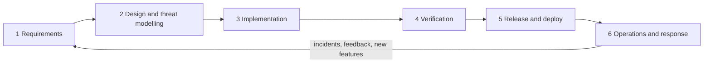

# House Hunt: Secure SDLC documentation

| Field | Value |
|---|---|
| Document | SSDLC document index |
| Version | 0.6 |
| Date | 2026-09-22 |
| Author | Claude (Cowork) |
| Status | Draft |

## Change log

| Version | Date | Author | Change |
|---|---|---|---|
| 0.1 | 2026-09-22 | Claude (Cowork) | First version. Index, phase map and update rules. |
| 0.2 | 2026-09-22 | Claude (Cowork) | Added 09 (OSI layer analysis) and the CI-backed update workflow; documents 01–08 moved to v0.2 after wave 2. |
| 0.3 | 2026-09-22 | Claude (Cowork) | Added 10 (sprint log) and the root [CHANGELOG](../CHANGELOG.md); story and candidate id prefixes; update rule for the changelog and sprint log. Sprint 2 versions: 01 v0.3, 02 v0.4, 03 v0.3, 06 v0.4, 07 v0.4, 08 v0.3, 09 v0.2 (row 5.5 and OSI-B04: dual API keys done). |
| 0.4 | 2026-09-22 | Claude (Cowork) | Sprint 2 outcome (all four workflows green on `f7da5ab` and `0e4e22a`) and Sprint 3 (first AI eval run: native Gemini embeddings and scorecard fixes, in code, waiting on an eval run). Versions: 01 v0.4 (RTM: TC-AI-11..14), 02 v0.5 (F-01 text: 32 characters; embedding flow re-checked), 03 v0.4, 04 v0.3 (DF-32 embedding request), 06 v0.5 (TC-AI-10 verdict, TC-AI-11..14), 07 v0.5, 08 v0.4 (AI settings, `AI_EMBEDDING_*`), 10 v0.2; 05 and 09 unchanged (v0.2). |
| 0.5 | 2026-09-22 | Claude (Cowork) | Sprint 3 lead decisions: F-01 split into F-01a (Fixed) and F-01b (Open); F-30 (contact name to the LLM provider) Fixed in code by the AI team (C-13); dev `docker-compose.yml` owned by Backend and passes the AI settings; senior reviewers with runtime pre-mortem, wire-format verification and contract tests. F-xx scheme allows a letter suffix for split findings. Versions: 01 v0.5, 02 v0.6, 03 v0.5, 04 v0.4, 06 v0.6 (TC-AI-15, TC-AI-16), 07 v0.6 (env table), 08 v0.5, 09 v0.3, 10 v0.3; 05 unchanged (v0.2). |
| 0.6 | 2026-09-22 | Claude (Cowork) | Sprint 3 coordinator rework: 01 v0.6 (PRV-009 reason for Part), 02 v0.7 (F-30 status cell per ai-design v0.10: rules, client label contract, limits, reindex after the v0.10 deploy), 06 v0.7 (TC-AI-12: 5-minute log window; TC-AI-15 final redaction cases), 08 v0.6 (reindex after the v0.10 deploy), 10 v0.4; 03, 04, 07 and 09 unchanged since v0.5. |

---

House Hunt is a personal, single-user app for hunting rental and for-sale houses in India. It has three parts:

- an offline-first **Android app** (Kotlin, Compose, Room, WorkManager, foreground "Hunt mode" location service, MapLibre with OpenFreeMap tiles),
- a **Spring Boot 4.1 / Java 25 API** backed by **PostgreSQL + PostGIS**,
- an **Angular 22 web app** hosted as static files.

Everything must run on free tiers. These documents follow a Secure Software Development Life Cycle (SSDLC). They are based on the code as it was on 2026-09-22 (`backend/`, `android/`, `web/`, `docker-compose.yml`).

## Document set

| # | Document | Purpose | Owner |
|---|---|---|---|
| 01 | [Requirements (SRS)](01-requirements.md) | Scope, personas, user stories, FR / NFR / SEC / PRV / AI requirements, MoSCoW, acceptance criteria, traceability matrix | Architecture |
| 02 | [Threat model](02-threat-model.md) | STRIDE per DFD element, abuse cases, risk ratings, findings in current code, OWASP mappings | Architecture / Security |
| 03 | [Software design](03-design.md) | C4 diagrams, deployment, ERD, sequences, states, API reference, sync and geospatial design, ADRs | Architecture |
| 04 | [Data flow diagrams](04-data-flow-diagrams.md) | DFD levels 0, 1 and 2, trust boundaries, data dictionary with sensitivity | Architecture / Security |
| 05 | [UX, accessibility and i18n](05-ux-accessibility-i18n.md) | WCAG 2.2 AA, TalkBack, English / Hindi / Tamil / Telugu | **Design team** |
| 06 | [Test plan](06-test-plan.md) | Test strategy, security testing, field walk test, AI evals, entry/exit criteria | QA / Architecture |
| 07 | [Secure build and deploy](07-secure-build-and-deploy.md) | CI/CD, branch protection, secrets, signing, free-tier deployment, environment variables | DevOps |
| 08 | [Operations runbook](08-operations-runbook.md) | Monitoring, backups, key rotation, incident response, data export/deletion, release checklist | Operations |
| 09 | [OSI 7-layer resilience analysis](09-osi-layer-analysis.md) | Scenario → behaviour → risk → mitigation → test for GPS/power, Wi-Fi/cellular/captive portals, DNS/IPv6/VPN, TCP retries and cold starts, sessions and sync cursors, TLS/UTF-8/time/EXIF, REST/auth/caching/AI | Architecture / Security |
| 10 | [Sprint log](10-sprint-log.md) | Agile record: working agreement, sprint goals, stories, team sign-offs, CI results, retrospectives, next-sprint candidates | Docs team (all senior reviewers sign off) |
| – | [CHANGELOG](../CHANGELOG.md) (repo root) | Release notes in Keep a Changelog format: Unreleased + released versions | Docs team |
| AI | [AI features](ai/) | Spring AI design, RAG, extractor, agent, MCP server, prompts, evals | **AI team** |

## SSDLC phase map

| SSDLC phase | Security activities | Documents |
|---|---|---|
| 1 Requirements | Security, privacy and AI requirements, abuse cases, data classification | 01, 04 (data dictionary), 05, ai/ |
| 2 Design | Architecture review, threat modelling (STRIDE), trust boundaries, ADRs | 03, 04, 02, ai/ |
| 3 Implementation | Secure coding rules, input validation, secret handling, dependency hygiene | 03 (design rules), 07 (pre-commit, secret scanning) |
| 4 Verification | Unit/integration tests, SAST, SCA, secret scanning, DAST, accessibility, AI evals, field test, network resilience review | 06, 09 |
| 5 Release and deploy | Signed builds, protected branches, CI gates, least-privilege secrets, hardened config | 07 |
| 6 Operations | Monitoring, backups, key rotation, incident response, data subject rights | 08 |
| Across all phases | Sprint planning, senior review (runtime pre-mortem, wire-format check, contract tests) and sign-off, CI results, retrospectives, release notes | 10, [CHANGELOG](../CHANGELOG.md) |

## Requirement ID scheme

| Prefix | Meaning | Defined in |
|---|---|---|
| FR-xxx | Functional requirement | 01 |
| NFR-xxx | Non-functional requirement | 01 |
| SEC-xxx | Security requirement | 01 (mitigations in 02) |
| PRV-xxx | Privacy requirement | 01 |
| AI-xxx | AI feature requirement | 01 (detail in ai/) |
| UX-xxx, A11Y-xxx, I18N-xxx | UX / accessibility / language | 05 (design team) |
| T-xx | Threat | 02 |
| F-xx | Security finding in current code; a split finding gets a letter suffix (F-01a, F-01b) | 02 |
| R-xx | Risk (non-security, e.g. free-tier limits) | 03 / 08 |
| TC-xxx | Test case | 06 |
| DF-xx | Data flow | 04 |
| ADR-xx | Architecture decision record | 03 |
| S<n>-xx | Sprint story (sprint n) | 10 |
| C-xx | Next-sprint candidate | 10 |

## How to update these documents

1. **Bump the version** in the header table: minor (0.1 to 0.2) for additions and fixes, major (0.x to 1.0) when a document is baselined for a release.
2. **Add a change log row**: version, date (YYYY-MM-DD), author and a one-line summary. Never rewrite old rows.
3. **Keep IDs stable.** Never renumber or reuse an ID. To retire a requirement, strike it through (`~~FR-010~~`) and mark it *Withdrawn in vX.Y*. New requirements get the next free number.
4. **Keep traceability current.** When you add or change an FR/NFR/SEC/PRV/AI item, update the traceability matrix in [01 section 12](01-requirements.md#12-requirements-traceability-matrix). Link it to the design section (03), the code module and the test case (06). A requirement without a test is a gap. List it in 06 section 10.
5. **Re-run the threat model** (02) when you add a data flow, an external service, a trust boundary or an endpoint. The AI features and any new auth method need this too. Update the findings table when a finding is fixed. Keep the row and set its status to *Fixed in <commit/PR>*.
6. **Diagrams** are Mermaid and render on GitHub. Put labels in quotes (`A["Label (with parens)"]`). In sequence diagrams, avoid `;` and `#` in message text. Preview on GitHub or in the Mermaid live editor before merging.
7. **Cross-team documents**: `05-ux-accessibility-i18n.md` and `ai/` belong to other teams. Link to them. Don't copy their content here.
8. Review the docs in the same pull request as the code change they describe.
9. **Changelog and sprint log.** Every user-visible or security change adds a line under *Unreleased* in the root [CHANGELOG](../CHANGELOG.md) (Added / Changed / Fixed / Security, with F-xx ids). At the end of each sprint, record the stories, the manager sign-offs, the CI results and the retrospective in [10](10-sprint-log.md).
10. **CI is the check.** The workflows in `.github/workflows/` (07 §1) run the tests named in 06. When you add a test, add its TC id to 06 and to the RTM in 01; when you add an endpoint, update 03 §9, the DFD (04) and re-check 02 and 09. The root [README](../README.md) links here and must stay in sync with 07 (deploy steps) and 03 (architecture).
