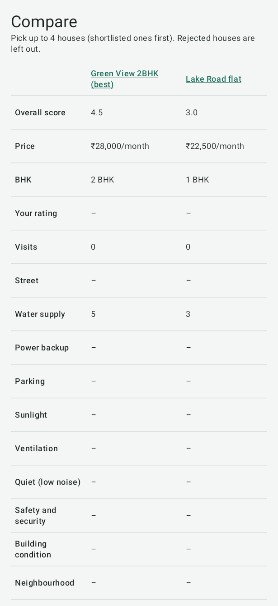
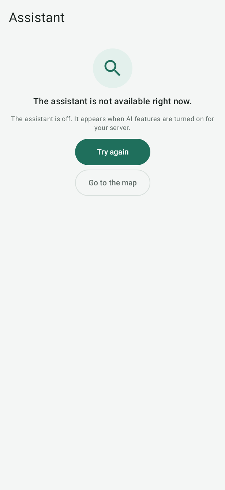

# Compare and plan

## Compare houses

Open **Compare**. Pick two to four houses (on Android, up to four; shortlisted ones come first). Rejected houses are
left out. Each row shows one detail: overall score, price, BHK, your rating, visits, street and each checklist item.
On the website the best value in each row is highlighted and marked ✓. Choose a house's name to open it.

## Plan a round of visits

**Plan visits** puts the houses you want to see into a walking route, and **Ask** answers questions such as "Which
house had the best water supply?" from your own notes. Both use AI, so they need
[your own server](server-and-sharing.md#connect-your-own-server-optional) with AI features turned on. Without one, **Ask** and **Plan** do
not appear in the website's menu, and Android has no **Assistant** tab.

When they are on: on the website, open **Plan**, describe what you want to see (for example "Shortlisted 2BHKs under
35k this afternoon"), set the **Start point** and choose **Plan route**. On Android, open **Assistant**, then
**Plan visits**, and tap **Plan from my location**. Walking times are estimates.

