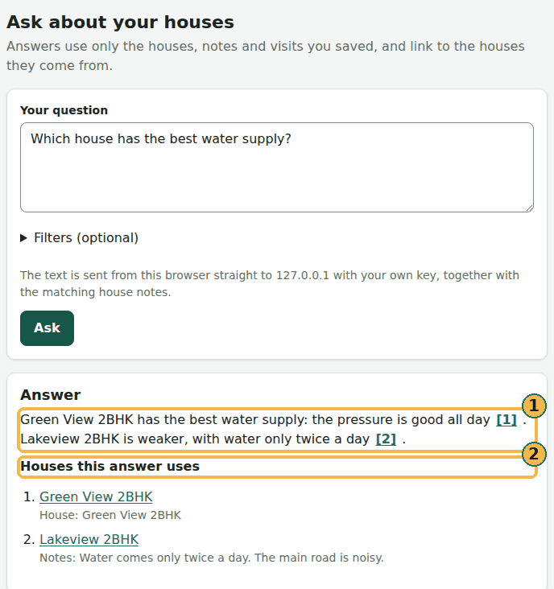
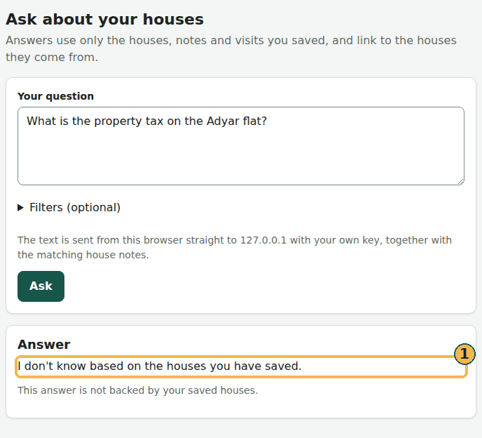
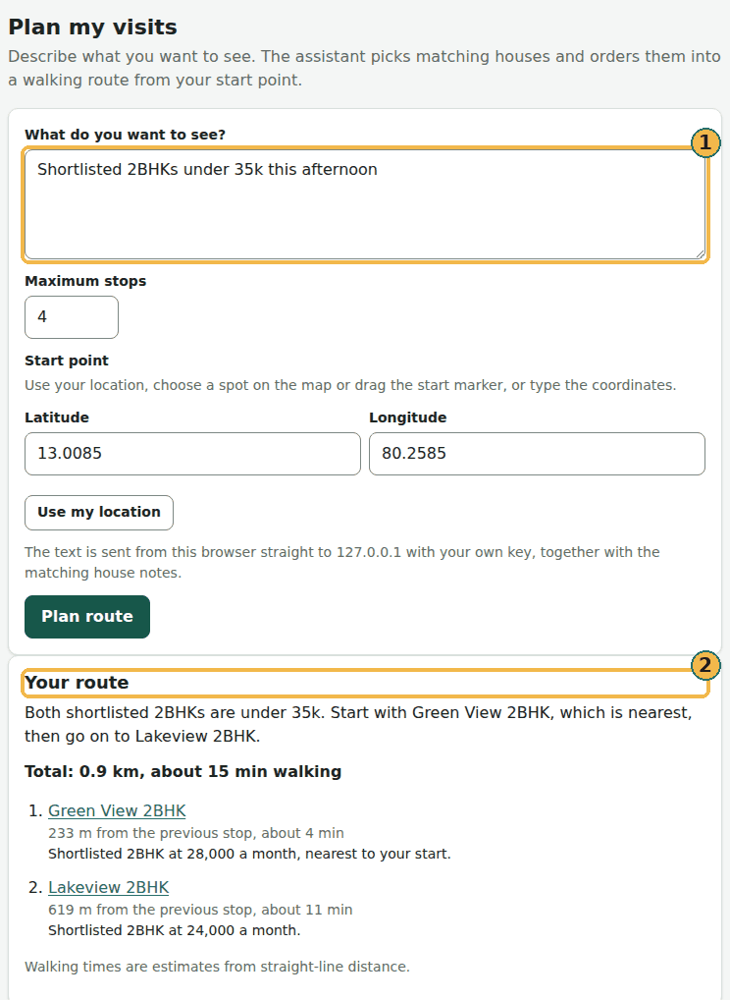

# Compare and plan

## Compare houses

1. Open **Compare**.
2. Pick two to four houses. Shortlisted houses are offered first. Rejected and Not chosen houses are left out. To bring
   one back, change its status to Shortlisted or New.

Each row shows one detail: overall score, price, BHK, your rating, visits, street and each checklist item. On the
website, the best value in each row is highlighted and marked ✓. Choose a house's name to open it.

## Plan a round of visits

Two features use AI (the computer reads your notes and works things out for you):

- **Plan visits** puts the houses you want to see into a walking route.
- **Ask** answers questions from your own notes, such as "Which house had the best water supply?"

Both need AI turned on, in one of two ways: [your own server](server-and-sharing.md#connect-your-own-server-optional)
with AI features on, or [the AI provider you chose](settings-and-privacy.md#ai-without-a-server), with your own key
with no server at all. Until then, **Ask** and **Plan** do not show in the website's menu, and the phones have no
**Assistant** tab.

When AI is on, to plan on the website:

1. Open **Plan**.
2. Describe what you want to see, for example "Shortlisted 2BHKs under 35k this afternoon".
3. Set the **Start point**.
4. Choose **Plan route**.

To plan on Android:

1. Open **Assistant**.
2. Open **Plan visits**.
3. Tap **Plan from my location**.

**Plan visits** leaves out Rejected and Not chosen houses too, in the same way as Compare.

The walking times are only a rough guess.

(Without AI, you reach this page only by typing its address. The menu hides **Plan** until AI is on.)

## What Ask and Plan look like with AI on

These pictures show the website with AI turned on. They were made with three made-up houses and a stand-in for the AI
service on the same computer: nothing was sent anywhere and no key was used. The words of each answer were scripted,
so every picture below is an **example answer**. Your own answers depend on the AI service and model you choose.

**Ask** with an answer that cites its houses. Each number in the answer (1) opens the house it comes from, and **Houses
this answer uses** (2) lists them:

When your saved houses do not say, **Ask** gives one fixed sentence and cites no house:

**Plan** with your request (1) and the route it makes (2): the saved houses that match, in walking order, with a rough
time for each leg:

To see what we test, and how it did the last time we measured it, see [What we test](what-we-test.md).
