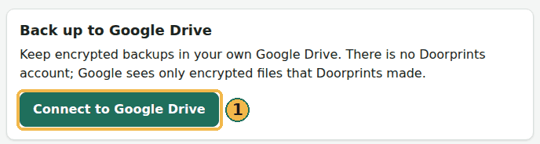

# Back up to Google Drive

*Hindi, Tamil and Telugu translations of this page are under review.*

Doorprints can keep encrypted backups in **your** Google Drive. There is no Doorprints account. Google sees only
encrypted files that Doorprints created (the one Drive permission `drive.file`). Photos upload on Wi-Fi unless you
choose otherwise.

Android and iPhone Drive work is paused. This page describes the **website**.

## Connect (website)

1. Open **Your data**.
2. Under **Back up to Google Drive**, choose **Connect to Google Drive** and sign in with Google.
3. Doorprints shows a **recovery key once**. Copy it and keep it somewhere safe. Tick **I have saved my recovery key
   in a safe place**, then continue. You can skip after a warning; without the key a new browser cannot join later.
4. **Back up now** writes an encrypted Full backup to Drive. **Import a backup** on a row hands the file to the
   *Import a backup* card on the same page; nothing is written until you confirm there.
5. **Automatic backup** makes a backup about once a day while Doorprints is open in this browser.

## Another browser

On a second computer, **Connect** then type the recovery key. You can also compare an **8-digit code** (copy a pairing
request from the new browser, paste it on one that is already connected, paste the reply back; both screens must show
the same eight digits). A new browser can also show a QR code; the connected browser scans it or you paste the code.

## Delete

- **Delete older backups** (L1) does not need a passkey.
- **Delete all backups** and **Delete everything Doorprints keeps in Google Drive** (L2/L3) need a
  **passkey** on this browser (fingerprint, face or screen lock). Without one, Doorprints asks you to use a phone.
- There is a confirmation tick box. The website does not wait a countdown.

## Privacy

The website's [privacy page](https://doorprints.web.app/privacy.html) says what Google Drive is used for. Your houses stay encrypted. Disconnect
this browser from **Your data** if you used a shared computer.
