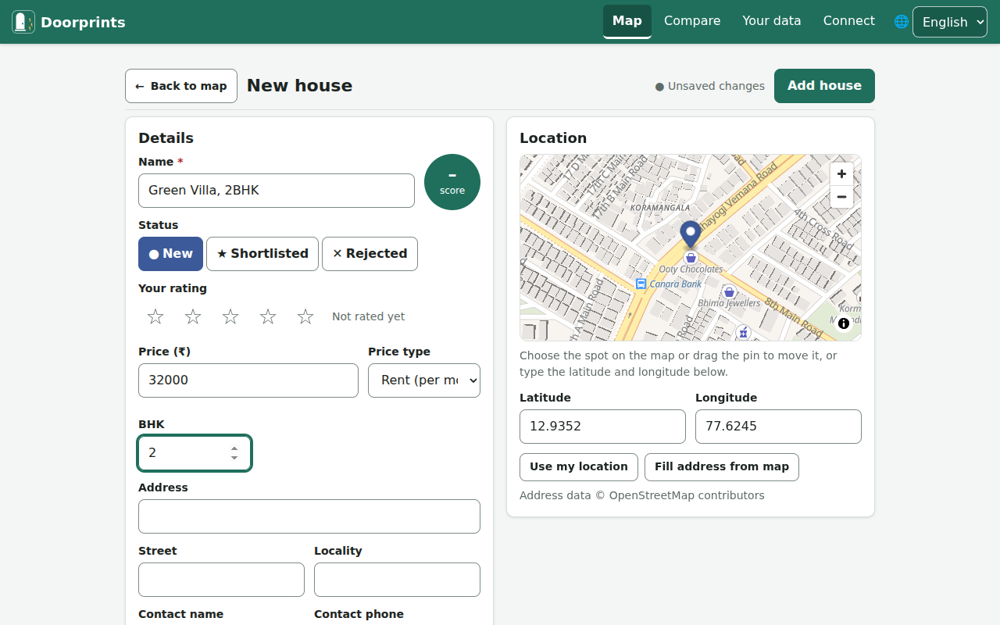
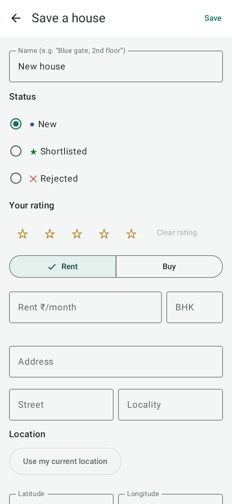
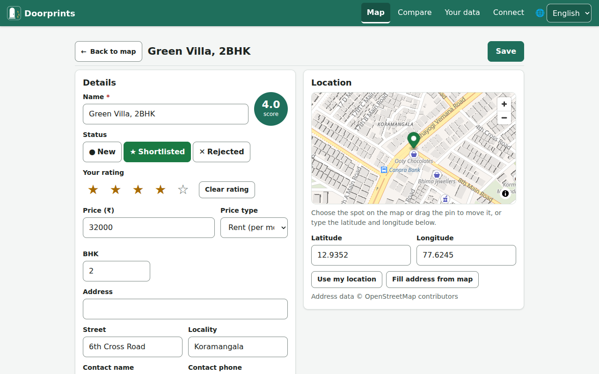
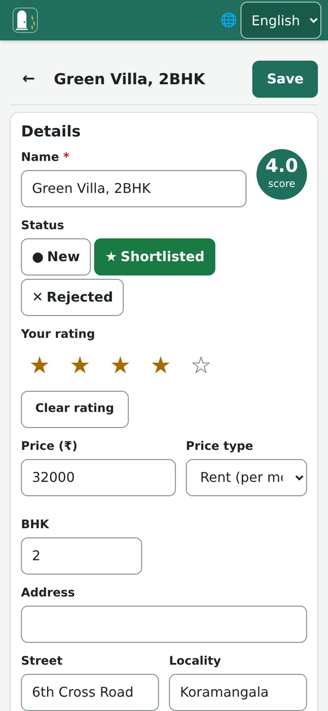
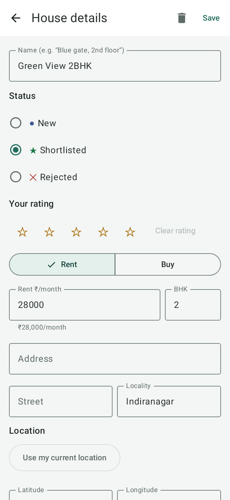
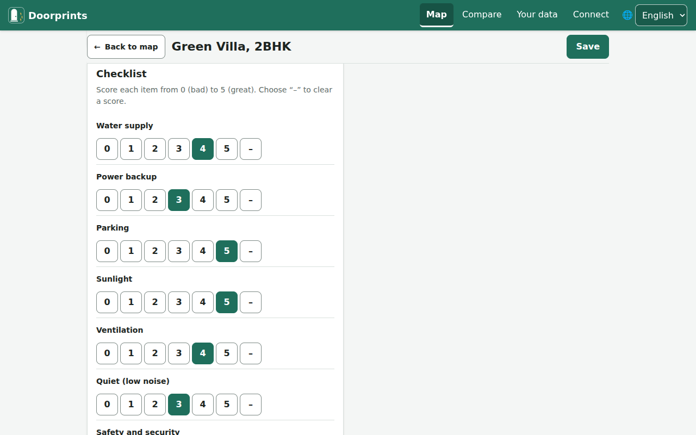
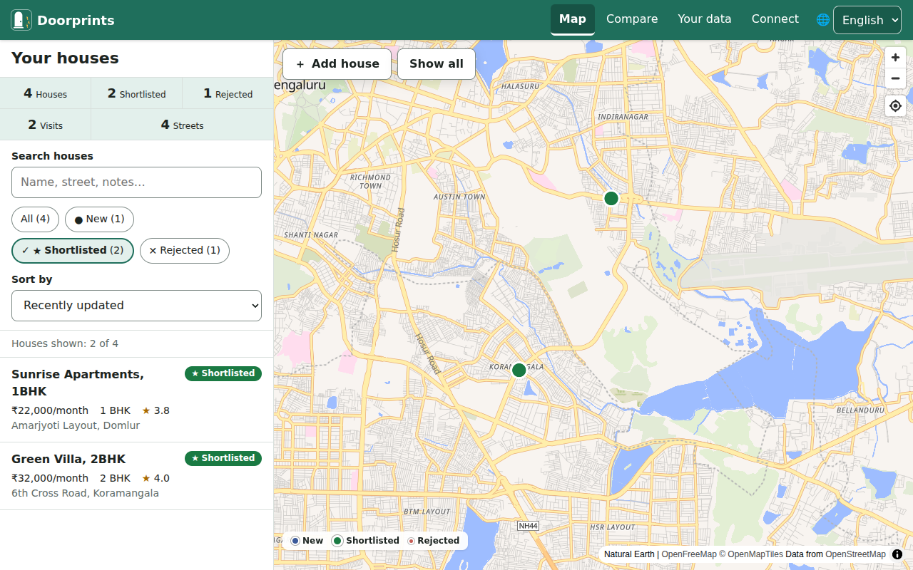

# Your houses

## Add your first house

**On the website**

1. On **Map**, choose **Add house**.
2. Show where the house is. Either choose that spot on the map, or move the map until the cross is on it and choose **Place here**.
3. The **New house** form opens. Type a **Name**, for example "2BHK near the park". You can leave everything else empty.
4. Choose **Add house** at the top right.

You can move the house's pin later in three ways:

- drag the pin on the small map;
- type the **Latitude** and **Longitude** (the two numbers that mark a spot on the map);
- choose **Use my location**.

**Fill address from map** fills in the street and locality for you.

**On Android**

1. Stand at the house and tap **Save house here** on the **Map**. Or press and hold any spot on the map.
2. The **Save a house** form opens. The place is already set.
3. Type a name.
4. Tap **Save**.

## Add a house from a listing you found online

In the portal's app or your browser, share the listing to **Doorprints** (on Android, from the share sheet; on the
website, once it is installed as an app). Doorprints asks where the house is: tap **Save house here** if you are
standing at it, or press and hold the map on the spot. The form then opens with what the listing said, such as the
price, the number of bedrooms, the area name, the link and a phone number, and the whole text in the notes for you
to check. Nothing is fetched from the portal's site, and nothing is saved until you tap **Save**. If you shared the
same listing before, Doorprints offers to open the house you already have.

## Keep notes on a house

Open a house from the list or the map. There you can:

- set the **Status**: **New**, **Shortlisted** or **Rejected**;
- give **Your rating**, from one to five stars;
- fill in the price, **BHK**, **Carpet area**, address, contact and **Listing link** (the web address of an advert for
  the house);
- under **Cost**, what the advert does not say at first: the deposit (in rupees or months of rent), the maintenance
  and whether the rent includes it, the brokerage, the lock-in and notice periods, the date the house is free from,
  your offer and the price you agreed. Doorprints then shows the **monthly cost**, the **money to move in** and the
  **cost per sq ft**, and **Compare** lines them up across houses;
- turn on **Approximate location** when you only know the area, not the building: the house shows as a hollow ring
  on the map and Hunt mode will not alert you there until you fix the spot;
- see or change the house's **Broker**: the person who showed it. Saving a house with a phone number adds that person to
  **Settings > Brokers**, where each broker has an agency, fee terms, notes, a rating, a **Call** button and a list of the
  houses they showed you;
- add up to 30 **Rooms**: for each, its type, name, length and width, a condition from one to five stars and a note. Doorprints
  shows each room's area and the total; switch between feet and metres with **Length units** in **Settings**;
- keep a list of **Questions to ask** at the viewing: **Add the usual questions** brings the standard ones that fit the house (for a rent: maintenance,
  deposit, brokerage, lock-in, water, power, parking, floor) and fills in what you already noted under **Cost**; write the answer as you hear it, or
  **Skip** one. Change the standard list, or add your own, in **Settings > Questions**;
- **Plan a viewing** from the house's **Viewings** card: pick the day and time, how long, whether it is the first or a second visit, and whom you meet. **Add to calendar** puts it in your calendar; all of them are listed under **Viewings**, where a viewing that passed without being marked shows as **Missed?**. Choose **Reminder** in the form to be told before it starts (on the phone; on the website only while the site is open, so use **Add to calendar** there). After a viewing, **Mark viewing done** and, if you like, book a second one;
- write **Notes**;
- score each **Checklist** item from 0 (bad) to 5 (great);
- note that you visited: **Mark visited now** on the website, **I am here now** on Android;
- add photos: **Add photos** on the website, **Take photo** or **From gallery** on Android. Save the house first.

Doorprints gives each house an overall **score** out of 5. It works this out from your rating and the checklist. Open **Settings > Criteria**
to choose what matters: set each item to Ignore, Low, Medium or High, mark **must-haves** with a minimum score, add your own items and choose
how much your star rating counts. A house that misses a must-have is marked and listed after the others.
Remember to choose **Save**.

 

**Delete house** removes a house with its notes, contact details and photos. Its visits stay in your history.

## Find a house again

1. Type in **Search houses** (on Android: **Search name, street, notes**). The list gets shorter as you type.
2. To show only some houses, tap a status chip (a small button), such as **Shortlisted**.
3. To put the best score or the lowest price first, use **Sort by**.

The search looks at the name, address, street, locality and notes. The website also looks at the contact name.

 

If no house matches, choose **Clear search and filter**.
