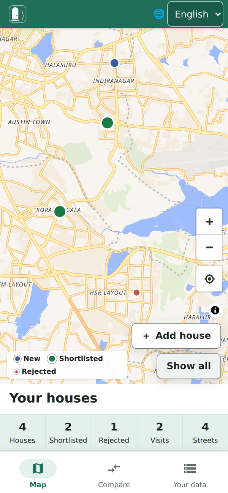
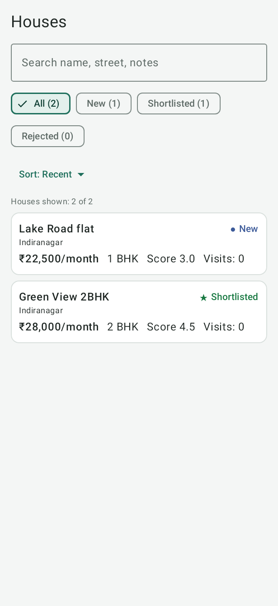
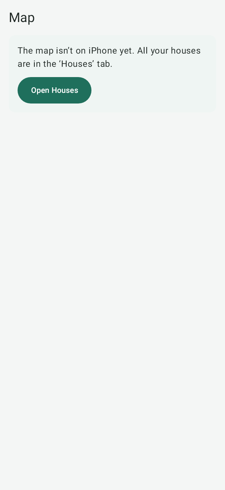

# The screen at a glance

## Website

1. **Menu:** **Map**, **Compare**, **Your data** and **Connect**. **Ask** and **Plan** show here once you turn on AI features (see [AI without a server](settings-and-privacy.md#ai-without-a-server)).
2. **Language:** English, हिन्दी, தமிழ், తెలుగు.
3. **Your houses:** how many houses, shortlisted houses, rejected houses, visits and streets you have.
4. **Search houses:** type part of a name, street, locality or note.
5. **Status filter:** show **All**, **New**, **Shortlisted** or **Rejected** houses. Each shows how many houses it has.
6. **Sort by:** put the list in order by **Recently updated**, **Best score** or **Lowest price**.
7. The house list. It says how many houses are shown. Choose a house to open it.
8. **Add house** starts adding a house. **Show all** moves the map so you can see every house.
9. **Zoom in**, **Zoom out** and **Show my location**.
10. The colour key: blue is **New**, green is **Shortlisted**, red is **Rejected**.
11. A house on the map. Choose its pin (the coloured marker) to open that house.

On a phone, the same page puts the map above the list. The menu moves to a bar at the bottom: **Map**, **Compare**
and **Your data**. **Connect** is inside **Your data**.

## Android

1. **Hunt mode:** turn it on while you are out looking (see [Hunt mode](hunt-mode.md)).
2. **Zoom in** and **Zoom out**.
3. **My location.**
4. **Save house here** saves a house at the spot where you are standing. You can also press and hold the map anywhere.
5. The colour key: **New**, **Shortlisted**, **Rejected**.
6. Map credits (who made the map, and **Boundary: Survey of India** for India's northern boundary).
7. The tabs: **Map**, **Houses**, **Compare** and **Settings**. An **Assistant** tab shows once you turn on AI features, through your server or with your own Gemini key.

This picture was taken by an automatic test on a pretend phone on a computer. That pretend phone does not show place
names. On a real phone, the map has place names and shows your houses as coloured pins, like the website's map.

The **Houses** tab is the list:

## iPhone

The iPhone app is an early version. It opens on the **Map**, which works as on Android:

- tap **Save house here** to add a house where you stand;
- or touch and hold the map to add a house anywhere.

The tabs are **Map**, **Houses**, **Compare** and **Settings**. It has no Hunt mode, no photos and no **Save a copy**
yet. To see the houses you added on other devices, connect your own server in **Settings**.

