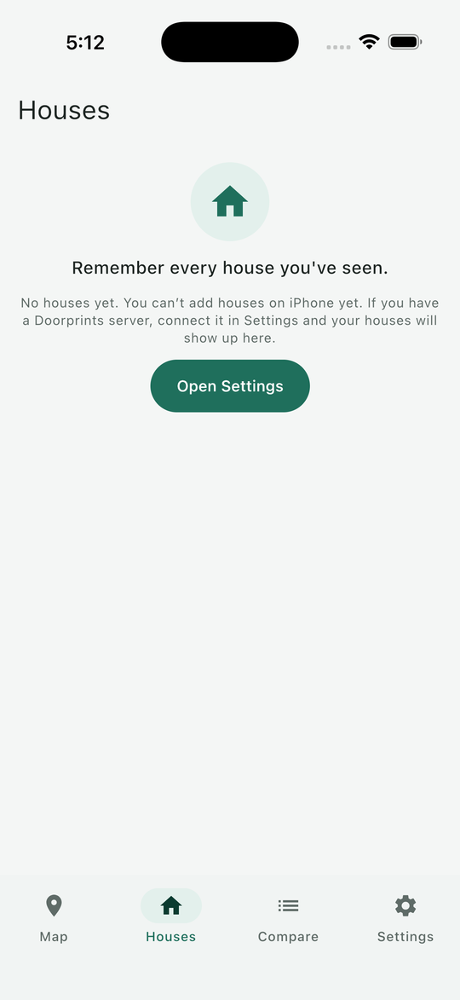

# The screen at a glance

## Website

1. **Menu:** **Map**, **Compare**, **Your data** and **Connect**. **Ask** and **Plan** appear here only when your own server has AI turned on.
2. **Language:** English, हिन्दी, தமிழ், తెలుగు.
3. **Your houses:** counts of houses, shortlisted, rejected, visits and streets.
4. **Search houses:** type part of a name, street, locality or note.
5. **Status filter:** **All**, **New**, **Shortlisted**, **Rejected**, with how many are in each.
6. **Sort by:** **Recently updated**, **Best score** or **Lowest price**.
7. The house list, with how many houses are shown. Choose a house to open it.
8. **Add house** starts adding a house; **Show all** zooms the map to fit every house.
9. **Zoom in**, **Zoom out** and **Show my location**.
10. The legend: blue is **New**, green is **Shortlisted**, red is **Rejected**.
11. A house on the map. Choose a pin to open that house.

On a phone the same page stacks the map above the list, and the menu moves to a bar at the bottom (**Map**,
**Compare**, **Your data**; **Connect** is inside **Your data**).

## Android

1. **Hunt mode:** turn it on while you are out looking (see [Hunt mode](hunt-mode.md)).
2. **Zoom in** and **Zoom out**.
3. **My location.**
4. **Save house here** saves a house where you are standing. You can also long-press the map anywhere.
5. The legend: **New**, **Shortlisted**, **Rejected**.
6. Map credits.
7. The tabs: **Map**, **Houses**, **Compare** and **Settings**. An **Assistant** tab appears when your server has AI turned on.

This picture comes from an automated test on an emulator, which does not draw place names. On a real phone the map
has names and your houses as coloured pins, like the website's map. The **Houses** tab is the list:

## iPhone

The iPhone app is an early version. It opens on **Houses**. It cannot add houses yet: connect your own server in
**Settings**, and the houses you added elsewhere show up. The **Map** tab says the map is not on iPhone yet.

 
