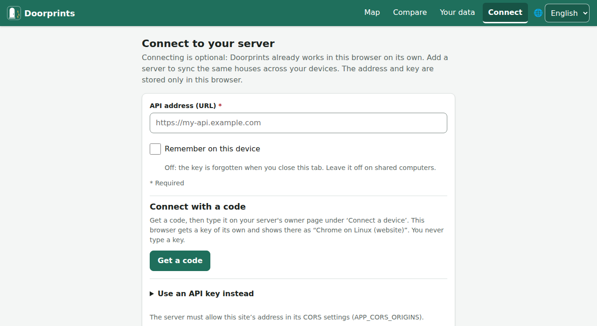
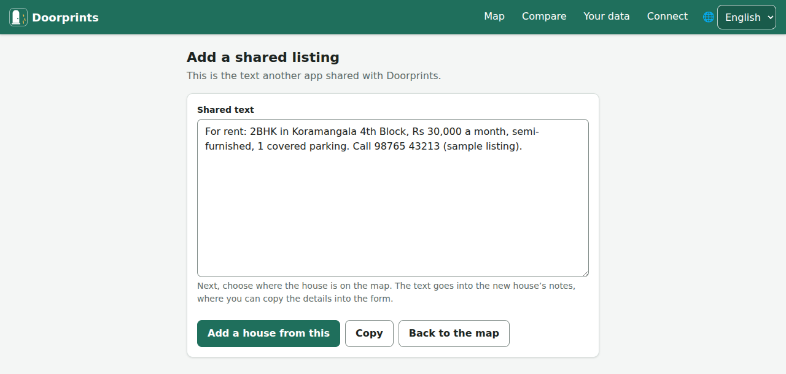

# Server and sharing

## Connect your own server (optional)

Doorprints works fully without a server. A server is a computer you own that keeps a copy of your houses. With one,
you get two extras:

- **Sync:** the same houses on your phone and in your browser.
- **AI features**, if the server's owner set them up.

Doorprints does not run a public server. You, or someone you trust, run one on a home computer.
**[Set up your own server](set-up-a-server.md)** walks you through it step by step. No programming is needed.

The server gives you two things to type into the apps:

- its **address**, like a website address;
- your **Doorprints API key**. This is a long password the apps show to your server, so it knows they are yours.

The AI has its own key (the Gemini key). It stays on the server; the apps never ask for it.

**On the website:**

1. Open **Connect**.
2. Fill in **API address (URL)** and **API key**.
3. Choose **Test connection**.
4. Choose **Save and continue**.

On a shared computer, leave **Remember on this device** off.

**On Android and iPhone:**

1. Open **Settings** and find **Server (optional)**.
2. Fill in **Server URL** and **API key**.
3. Tap **Save and test**.

**Sync now** syncs straight away. On Android, **Photos only on Wi-Fi** saves mobile data.

The address must start with `https://`. (HTTPS means the connection is locked, so no one on the way can read it.)
**Disconnect** on the website forgets the address and key on that device.

## Add a shared listing

Saw a good ad on WhatsApp or a website? Keep its text with a new house.

**Website installed as an app on an Android phone:**

1. In the other app, choose Share, then Doorprints. The **Add a shared listing** page shows the text.
2. Choose **Add a house from this**.
3. Pick the spot on the map. The text goes into the new house's **Notes**.

To install the website, see **Install the app** on **Your data**.

**Website and Android:** paste the ad's text into a house's **Notes**. With AI turned on, **Fill in from listing
text** on the form for a new house suggests the details. Check them before you save.

