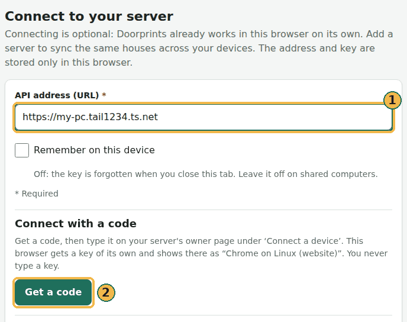

# Set up your own server

This page is for you if you want sync or the AI features and you are not a programmer. It takes you through every
step, from an empty computer to **Ask** and **Plan** working on your phone. It takes about an hour. Most of that time
is waiting for downloads. Everything on this page is free.

A **server** is a program that runs all the time on one computer and looks after your houses for your other devices.
Think of it as a home post office that all your devices send to and collect from.

You don't need a server to use Doorprints. A server only adds three things:

- the same houses on your phone and in your browser. This is called sync: the apps keep in step with each other;
- the AI features: **Ask**, **Plan**, the Android **Assistant** and **Fill in from listing text**, with its owner's
  Gemini key (without a server, you can [use your own key](settings-and-privacy.md#ai-without-a-server));
- an extra copy of your houses on a computer you own.

## Two different keys

People mix up these two keys more than anything else. They are not the same thing.

| | **Doorprints API key** | **Gemini API key** |
|---|---|---|
| What it is | A long password that you make up for your server | A key from Google that lets your server use Google's AI |
| Needed for | Sync, and the AI features | Only the AI features |
| Needed at the start? | **Yes.** The server won't start without it. | **No.** Add it later, whenever you want AI. |
| Where you get it | You make it yourself in [step 3](#step-3-make-your-doorprints-api-key) | From Google AI Studio, in [step 4](#step-4-optional-get-a-free-gemini-key-for-ai) |
| Where you type it | In the server's settings file. The apps don't need it: they connect with a short code or a QR code ([step 9](#step-9-connect-the-apps)). | On your owner page ([step 8](#step-8-open-your-owner-page)), or in the server's settings file. The apps never ask for it. |

!!! tip "Keep both keys secret"
    Anyone with your Doorprints API key and your server's address can read and change your houses. Anyone with your
    Gemini key can use up your AI allowance. Keep both keys in a password manager. Don't put them in a chat or an
    email.

## What you need

- **A computer that stays on:** a Windows 10 or 11 PC, or a Mac. This computer is your server. It must be on and
  awake whenever you want to sync or use AI. When it is off, the apps still work as normal. They sync the next time
  they can reach it.
- **At least 8 GB of memory (RAM) and about 10 GB of free disk space.** You also need Wi-Fi for the first download.
- **No sleeping:** stop the computer from going to sleep by itself.
    - Windows: open **Settings → System → Power** (**Power & sleep** on Windows 10). Set **Sleep** to **Never** when
      plugged in.
    - Mac: open **System Settings → Battery** (or **Energy**) **→ Options**. Turn on **Prevent automatic sleeping**.
- **Free accounts:** Docker (for the server), Tailscale (so your phone can reach the server safely) and, for AI, a
  Google account.

## How it fits together


1. **Docker** runs the Doorprints server on your computer.
2. **Tailscale** gives the server a private `https://` address. Only your own devices can open it. (Other people may
   see the address's name, but they cannot open it.)
3. The Doorprints apps on your phone and in your browser use that address and your Doorprints API key.
4. If you turn on AI, the server sends your questions to Google's Gemini, with your Gemini key. The apps never talk to
   Gemini themselves.

## A few words you'll meet

- **Docker:** a free program that runs the Doorprints server for you. It is like a box that holds everything the
  server needs, so you don't install each part yourself.
- **Tailscale:** a free app that joins your own devices into a private network. It is like a private road between
  your phone and your computer that nobody else can use.
- **Terminal:** a window where you type commands instead of clicking. Step 2 shows how to open one.
- **API key:** a long password. The apps show it to your server to prove they are allowed in.
- **Address:** where to find your server, like a website address (for example `https://…`).
- **HTTPS:** the safe kind of web address. It starts with `https://` and shows a padlock in a browser.

## Step 1: Install Docker Desktop

1. Go to [docker.com/products/docker-desktop](https://www.docker.com/products/docker-desktop/). Download Docker
   Desktop for your computer. It is free for personal use.
2. Install it, then open it.
3. On Windows, the installer may ask to restart the computer, or to install "WSL". Say yes.
4. It may say virtualisation is turned off. This is a setting in the BIOS, the computer's built-in setup screen. Your
   computer maker's help pages show how to turn it on. You may want a friend's help with this one step.
5. Wait until Docker Desktop says **Engine running** (bottom left). You don't need to sign in.

## Step 2: Download Doorprints

1. Open [the Doorprints code page](https://github.com/Sriram-Codes-SW/doorprints). Choose the green **Code** button,
   then **Download ZIP**.
2. Unzip it into your **Documents** folder. You now have a folder called **doorprints-main**.
3. Open that folder. If you see another **doorprints-main** folder inside, open that one too. The right folder has a
   file called **docker-compose.yml** in it. On the rest of this page, **doorprints-main** means that folder.
4. Open a terminal in that folder:
    - **Windows:** open **doorprints-main** in File Explorer. Right-click an empty space in the folder and choose
      **Open in Terminal**. (On Windows 10: hold **Shift** while you right-click, then choose
      **Open PowerShell window here**.)
    - **Mac:** in Finder, right-click the **doorprints-main** folder and choose **New Terminal at Folder**. (If you
      don't see it, turn it on in **System Settings → Keyboard → Keyboard Shortcuts → Services → Files and Folders**.)

Keep this terminal window open for the next steps. You will type (or paste) the commands below into it. Press
**Enter** after each one.

!!! warning "Keep the folder name"
    The server stores your houses under the folder's name. If you later rename or move **doorprints-main**, the
    server starts with an empty list. Your houses are not lost. Move the folder back to see them again.

## Step 3: Make your Doorprints API key

Your key must be at least 32 characters long and hard to guess. Let the computer make one for you.

- **Windows** (in the terminal from step 2). This command makes a long random key:

    ```powershell
    [guid]::NewGuid().ToString('N') + [guid]::NewGuid().ToString('N')
    ```

- **Mac.** This command makes a long random key:

    ```bash
    openssl rand -hex 32
    ```

You get one long line of letters and numbers, like `3f9c…e71a`. Copy it into your password manager. Name it
**Doorprints API key**.

## Step 4 (optional): Get a free Gemini key for AI

Skip this step if you only want sync. You can come back to it later.

1. Go to [aistudio.google.com/apikey](https://aistudio.google.com/apikey) and sign in with a Google account.
2. Accept Google's terms if it asks.
3. Choose **Create API key**.
4. Copy the key into your password manager. Name it **Gemini API key**.

The free tier has a daily limit. When you reach it, AI answers fail until the next day. Everything else keeps
working.

!!! warning "What the AI sees, and Google's free-tier terms"
    Before anything goes to the AI, Doorprints removes each house's saved contact name and most phone numbers. Some
    things are still sent: other names in your notes, your questions, and the other details of your houses. Text you
    paste into **Fill in from listing text** is sent too. For its free tier, Google says three things
    ([Gemini API terms](https://ai.google.dev/gemini-api/terms)): people may read what you send; Google may use it to
    improve its products; and you should not send personal information. If that worries you, use the paid tier
    (below), leave AI off, or keep personal details out of your notes.

### The paid tier: a small cost, more privacy

You can move the same key to Google's paid tier. This helps in two ways:

- **Privacy:** on the paid tier, Google says it does **not** use what you send to improve its products. This is the
  main reason to pay.
- **No daily limit to run out of** in normal use.

**What it costs.** You pay only for what you use. There is no monthly fee. The AI counts text in small pieces called
"tokens" (a token is roughly part of a word). On Google's price list of September 2026, the model Doorprints uses
(Gemini 3.5 Flash) costs US$1.50 for every million tokens sent and US$9 for every million received.

- One **Ask** question sends a few thousand tokens and gets a few hundred back. It costs about **one US cent**
  (around a rupee).
- **Plan** asks the AI several times, so one plan costs a few cents.
- Keeping your houses searchable costs far less.
- A month of house-hunting with a hundred questions costs roughly US$1 to US$2.

Prices change. Check [Google's price list](https://ai.google.dev/gemini-api/docs/pricing).

**How to switch:**

1. Open [aistudio.google.com/apikey](https://aistudio.google.com/apikey). Next to your project, in the
   **Billing Tier** column, choose **Set up billing**.
2. Create or pick a Google Cloud billing account and add a payment card.
3. Choose **Prepay** and add the minimum, US$5. Prepay means you pay first. With automatic top-up left off, Google
   never charges you more than you put in.
4. Optional but wise: on the **Spend** page, under **Monthly spend cap**, choose **Edit spend cap**. Set a small
   limit, for example US$2. (Google says the cap can take about ten minutes to start working.)

Your Gemini key stays the same, so you don't change anything on your server. Doorprints also limits AI use by
itself: at most 10 AI requests a minute, and each answer is kept short.

## Step 5: Write the server's settings file

The server reads its settings from a file called `.env` (a dot, then "env") in **doorprints-main**. Type this command
in the terminal to open it:

- **Windows:** `notepad .env`. When Notepad asks to create a new file, choose **Yes**.
- **Mac:** `touch .env && open -e .env`

Paste these lines into the file. Then replace the two "paste-your" parts with your own keys:

```ini
APP_API_KEY=paste-your-Doorprints-API-key-here
APP_CORS_ORIGINS=https://doorprints.web.app
APP_AI_ENABLED=true
AI_API_KEY=paste-your-Gemini-API-key-here
```

- **Without AI:** leave out the last two lines.
- **Gemini key on the owner page instead:** keep `APP_AI_ENABLED=true` and leave out the `AI_API_KEY` line. You then
  paste the key on your owner page in step 8. The server keeps it there in a locked (encrypted) form.
- Put no spaces around the `=` signs, and no quotation marks.
- `APP_CORS_ORIGINS` lets the Doorprints website at `https://doorprints.web.app` talk to your server. Type it exactly
  as shown.

Save the file and close the editor.

## Step 6: Start the server

In the terminal, run this command. It downloads what the server needs, builds it and starts it:

```bash
docker compose up --build -d
```

The first start takes 10 to 20 minutes. Later starts take seconds.

To check it works:

1. Wait until the terminal says it is done.
2. **On that computer**, open [http://localhost:8080/actuator/health](http://localhost:8080/actuator/health) in a
   browser.
3. You should see a short line of text that includes `"status":"UP"`. The server may need one more minute. If you don't see it yet, reload the page.

Docker Desktop now shows **doorprints-main** under **Containers**, with a green dot.

For a fuller check, run `tools/server-smoke.sh` in **doorprints-main** (it needs `bash` and `curl`: a Mac has both; on Windows use Git Bash or WSL). It tries sync, an import and an export with made-up houses, prints PASS or FAIL for each, and then deletes them. Run it once, before you add your own houses.

## Step 7: Reach your server from your phone (Tailscale)

The apps only connect to addresses that start with `https://`. Also, your server should not be open to the whole
internet. Tailscale solves both. It gives the server a private `https://` address. Only devices signed in to your
Tailscale account can open it.

1. Make a free account at [tailscale.com](https://tailscale.com/). You can sign in with Google or Apple.
2. Install Tailscale **on the server computer** and sign in.
3. Install the Tailscale app **on your phone** (Play Store or App Store). Also install it on any other computer where
   you'll use the Doorprints website. Sign in to the **same** account on each, and switch Tailscale on.
4. **Windows only:** close the terminal and open a new one in **doorprints-main** (step 2). A terminal opened
   before you installed Tailscale can't find the `tailscale` command. On a Mac, go straight to the next step.
5. Run this command. It shares your server with your own Tailscale devices, at a private `https://` address:

    ```bash
    tailscale serve --bg 8080
    ```

    On a **Mac**, type this longer form instead. It does the same thing; the Mac app doesn't add the short
    `tailscale` command:

    ```bash
    /Applications/Tailscale.app/Contents/MacOS/Tailscale serve --bg 8080
    ```

6. The first time, it shows a link and asks you to turn on HTTPS for your account. Open the link and allow it. Then
   run the same command again.
7. The command shows your server's address. It looks like `https://my-pc.tail1234.ts.net`. Save it in your password
   manager, next to your Doorprints API key.

To test it: on your phone, switch Tailscale on. Open your address with `/actuator/health` added to the end (for
example `https://my-pc.tail1234.ts.net/actuator/health`). You should see text that includes `"status":"UP"`.

`tailscale serve` keeps working after the computer restarts. To stop sharing the server, run
`tailscale serve reset`. (On a Mac, use the longer form of `tailscale` shown above.)

## Step 8: Open your owner page

Your server has a page just for you, its owner: the **owner page**. There you let your devices in, choose which of
them may use AI, and can paste your Gemini key. Nobody else needs it.

1. Show the server's logs: run `docker compose logs api` in **doorprints-main**. (Or, in Docker Desktop, open
   **Containers**, then **doorprints-main**, then **api**, and read its **Logs**.)
2. Find the lines under **Doorprints owner page**. They hold a link that ends in `/owner#setup=` and a long run of
   letters.
3. On the server computer, open the first link (it starts with `http://localhost:8080`). On another computer, use
   the second one: put your address from step 7 in place of `<your-server-address>`.
4. The owner page opens and your browser stays signed in to it. The link works only once, within an hour. Until a
   browser is signed in, the server writes a new one every time it starts, so if it no longer works, restart the server
   (`docker compose restart api`) and look again. Once a browser is signed in, the logs no longer hold a link: to sign
   in another browser, open the owner page in the signed-in one and choose **Add another browser**.
5. For AI: under **AI (Google Gemini)**, paste your Gemini key and choose **Save key**. It takes effect at once; you
   don't restart anything. The page then shows only the key's last four characters. **AI on this server** turns AI
   off (and on again) for every device at once.

Keep the owner page's address in your password manager: `https://` your address from step 7, then `/owner`.

## Step 9: Connect the apps

Each app connects with a short code or a QR code, so you never type the API key into an app. Each one gets a key of
its own. You can take one back at any time on the owner page with **Revoke**, without changing anything on your other
devices.

**With a QR code (phones):**

1. On your owner page, under **Add a device with a QR code**, choose **Make a QR code**.
2. Point the phone's camera at it and tap the link that appears. The Doorprints app opens and asks
   **Connect to a server?**, showing your server's address.
3. Check the address, then tap **Connect**. The code works once, within 10 minutes.

**With a code (the website, or a phone):**

1. Type your address from step 7 in the app: on the website, open **Connect** and use **API address (URL)**; on a
   phone, open **Settings** and use **Server URL**.
2. Choose **Get a code**. The app shows a code like `K7MQ-4XRD`.
3. On your owner page, type that code under **Connect a device** and choose **Find**. Check that the name shown is
   the device in front of you, then choose **Approve**.
4. Within a few seconds the app says it is connected.



*The address in the picture is only an example. Use your own from step 7.*

On the server computer itself, there is a shortcut for the website: on the owner page, choose **Make a QR code**, then
**Open the website connected to this server**. The website asks once whether to connect, and connects.

[Connect your own server](server-and-sharing.md#connect-your-own-server-optional) shows the screens. Keep Tailscale
switched on on your phone whenever you want to sync.

**AI is off for each new device until you turn it on**, in two places, so nobody uses your Gemini allowance without
you knowing:

- on your owner page, under **Devices**, tick **AI** for that device;
- in the app itself: on the website, on the **Connect** page, under **AI features**, tick **Use AI features in this
  browser**; on a phone, in **Settings** under **Server**, turn on **Use AI features on this phone**. It says there
  what is sent to Google.

Then you will see **Ask** and **Plan** in the website's menu, and the **Assistant** tab on a phone.

## Everyday use

- **After the computer restarts:** open Docker Desktop. Then open a terminal in **doorprints-main** and run
  `docker compose up -d`. To save one step next time, turn on
  **Start Docker Desktop when you sign in to your computer** in Docker Desktop's settings. (You still need to run the
  command.)
- **To turn AI on or off later:** use **AI on this server** on your owner page (step 8). To turn AI off for good,
  change the lines in `.env` (step 5), save, and run `docker compose up -d` again.
- **To update the server:** first choose **Save a copy** in one of the apps (see [Your data](your-data.md)). Then:
    1. run `docker compose stop` in **doorprints-main**;
    2. download the new ZIP and unzip it somewhere else, for example your **Downloads** folder;
    3. copy your `.env` file from the old **doorprints-main** into the new folder (the one with
       **docker-compose.yml**). On a Mac, files whose names start with a dot are hidden. Press **Cmd + Shift + .** in
       Finder to see them;
    4. rename the old folder to **doorprints-old**. Move the new folder into **Documents** and name it
       **doorprints-main**;
    5. open a terminal in the new **doorprints-main** and run `docker compose up --build -d`.

    When everything works, you can delete **doorprints-old**.

- **To stop the server:** run `docker compose stop`. Your houses stay on the computer.

## Sharing your list with someone you trust

The other person needs two things:

1. access to your server in Tailscale. In the Tailscale admin console (its settings website), open **Machines**.
   Choose the server computer, then **Share**, and send them the invite;
2. your server's address.

Then they connect their own phone or browser with a code, and you approve it on your owner page (step 9). You don't
give them your Doorprints API key. Their device appears under **Devices** on your owner page: you choose whether it may
use AI (and so your Gemini allowance), and **Revoke** takes it back at any time.

A connected device can read and change every house on the server. Approve only someone you'd give your house keys
to.

!!! warning "Sharing a computer in Tailscale shares all of it"
    The other person can reach anything else that computer shares on the network, not only Doorprints. For example,
    shared folders or Remote Desktop. Share only with someone you trust with that computer, or turn those features
    off first.

## If something goes wrong

First, see what the server says about the problem. These messages are called logs. In Docker Desktop, open
**Containers**, then **doorprints-main**, then the **api** container, and read its **Logs**. (Or run
`docker compose logs api` in the terminal.)

| What you see | What to do |
|---|---|
| `no configuration file provided` | The terminal is in the wrong folder. Open it in the folder that has **docker-compose.yml** in it (step 2). |
| `Set APP_API_KEY to a random secret…` when you start the server | The `.env` file is missing, in the wrong folder, or has no `APP_API_KEY` line. Check that its name is exactly `.env` and that it is in **doorprints-main**. |
| The server starts and then stops again | Read the logs (above). Most often, the key is shorter than 32 characters. Make a new one (step 3). Put it in `.env` and in the apps. |
| `docker: command not found`, `The term 'docker' is not recognized`, or the command doesn't work at all | Docker Desktop is not running. Open it, wait for **Engine running**, and try again. |
| **Save and test** (Android) or **Test connection** (website) fails | One of these: Tailscale is off on the phone; the server computer is asleep or off; or the address doesn't start with `https://`. To check, open the `/actuator/health` address on the phone (step 7). |
| The phone connects but the website doesn't | Check that the `APP_CORS_ORIGINS` line in `.env` is exactly `https://doorprints.web.app`. Then run `docker compose up -d`. Make sure Tailscale is on for that computer too. If the browser asks to allow access to devices on your network, choose **Allow**. |
| **Ask**, **Plan** or **Assistant** don't appear | `.env` needs `APP_AI_ENABLED=true` (after a change, run `docker compose up -d`). Then check three things: a Gemini key is saved on the owner page (or in `AI_API_KEY`); **AI on this server** is on; and **AI** is ticked for that device under **Devices**. In the app, also turn on **Use AI features in this browser** (website, **Connect** page) or **Use AI features on this phone** (phone, **Settings**). |
| **Get a code** says the server cannot connect by code yet | The server is older than this guide. Update it (see *Everyday use*), or open **Use an API key instead** and type your Doorprints API key. |
| The owner page link no longer works | It works only once, within an hour. If no browser has signed in yet, restart the server with `docker compose restart api` and use the new link in the logs. If one has, the logs hold no link: in that browser, open the owner page and choose **Add another browser**. |
| `tailscale` is not recognized, or `command not found` | Windows: open a new terminal after installing Tailscale. Mac: use the longer form in step 7. |
| AI answers fail after working earlier | You have probably reached the free daily limit. Try again the next day. |
| All your houses are gone from the server | The folder was renamed or moved (see step 2). Move it back. Or, on Android, use **Import a backup** with your latest copy, then **Sync now**. |

## Other ways to run a server

You can also run the server on a free cloud service (someone else's computer on the internet), with a free database.
Then it doesn't need your computer to be on. This needs more technical setup. It also puts your server on the public
internet, so read the security notes there first. The steps are in the project's
[deployment notes](https://github.com/Sriram-Codes-SW/doorprints/blob/main/docs/07-secure-build-and-deploy.md#6-free-tier-deployment).
