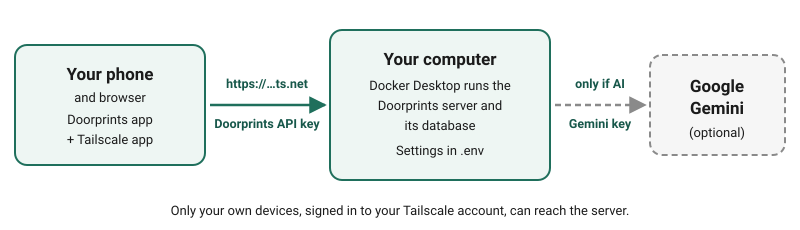

# Set up your own server

This page is for anyone who wants to sync or use the AI features and is not a programmer. It walks you through every
step, from an empty computer to **Ask** and **Plan** working on your phone. It takes about an hour, most of it
waiting for downloads. Everything on this page is free.

You don't need a server to use Doorprints. It only adds three things:

- the same houses on your phone and in your browser (sync);
- the AI features: **Ask**, **Plan**, the Android **Assistant** and **Fill in from listing text**;
- an extra copy of your houses on a computer you own.

## Two different keys

People mix these two up most often. They are not the same thing.

| | **Doorprints API key** | **Gemini API key** |
|---|---|---|
| What it is | A long password that you make up for your server | A key from Google that lets your server use Google's AI |
| Needed for | Syncing, and the AI features | Only the AI features |
| Where you get it | You create it yourself in [step 3](#step-3-make-your-doorprints-api-key) | From Google AI Studio, in [step 4](#step-4-optional-get-a-free-gemini-key-for-ai) |
| Where you type it | In the server's settings file **and** in each app (**Connect** or **Settings**) | **Only** in the server's settings file. The apps never ask for it. |

!!! tip "Keep both keys secret"
    Anyone with your Doorprints API key and your server's address can read and change your houses. Anyone with your
    Gemini key can use up your AI allowance. Keep them in a password manager, not in a chat or an email.

## What you need

- **A computer that stays on:** a Windows 10 or 11 PC, or a Mac. It is your server, so it has to be on and awake
  whenever you want to sync or use AI. When it is off, the apps keep working as normal and sync the next time they can
  reach it.
- **At least 8 GB of memory (RAM), about 10 GB of free disk space**, and a Wi-Fi connection for the first download.
- **No sleeping:** set the computer not to go to sleep by itself. On Windows: **Settings → System → Power** (**Power &
  sleep** on Windows 10), then set **Sleep** to **Never** when plugged in. On a Mac: **System Settings → Battery** (or
  **Energy**) **→ Options**, then turn on **Prevent automatic sleeping**.
- **Free accounts:** Docker (for the server), Tailscale (so your phone can reach the server safely) and, for AI, a
  Google account.

## How it fits together



1. **Docker** runs the Doorprints server on your computer.
2. **Tailscale** gives the server a private `https://` address that only your own devices can open. (The address's
   name is not secret, but nobody else can open it.)
3. The Doorprints apps on your phone and in your browser use that address and your Doorprints API key.
4. If you turn on AI, the server (never the apps) sends your questions to Google's Gemini with your Gemini key.

## A few words you'll meet

- **Terminal:** a window where you type commands instead of clicking. Step 2 shows how to open one.
- **API key:** a long password that an app sends to a server to prove it is allowed in.
- **HTTPS:** the secure kind of web address, starting with `https://`, the one with the padlock in a browser.

## Step 1: Install Docker Desktop

1. Go to [docker.com/products/docker-desktop](https://www.docker.com/products/docker-desktop/) and download Docker
   Desktop for your computer. It is free for personal use.
2. Install it and open it. On Windows the installer may ask to restart the computer, or to install "WSL": say yes. If
   it says virtualisation is turned off, the computer's maker's help pages show how to turn it on (it is a setting in
   the BIOS); this is the one step you may want a friend's help with.
3. Wait until Docker Desktop says **Engine running** (bottom left). You can skip signing in.

## Step 2: Download Doorprints

1. Open [the Doorprints code page](https://github.com/Sriram-Codes-SW/doorprints), choose the green **Code** button,
   then **Download ZIP**.
2. Unzip it into your **Documents** folder. You now have a folder called **doorprints-main**. Open it: if you see
   another **doorprints-main** folder inside, open that one too. The right folder is the one that contains a file
   called **docker-compose.yml**. In the rest of this page, **doorprints-main** means that folder.
3. Open a terminal in that folder:
    - **Windows:** open **doorprints-main** in File Explorer, right-click an empty space in the folder and choose
      **Open in Terminal**. (On Windows 10: hold **Shift** while you right-click, then choose
      **Open PowerShell window here**.)
    - **Mac:** in Finder, right-click the **doorprints-main** folder and choose **New Terminal at Folder**. (If you
      don't see it, turn it on in **System Settings → Keyboard → Keyboard Shortcuts → Services → Files and Folders**.)

Keep this terminal window open for the next steps. You'll type (or paste) the commands shown below into it and press
**Enter**.

!!! warning "Keep the folder name"
    Your houses are stored under the folder's name. If you later rename or move **doorprints-main**, the server
    starts with an empty list. (Your houses are not lost; move the folder back to see them again.)

## Step 3: Make your Doorprints API key

Your key must be at least 32 characters long and hard to guess. Let the computer make one:

- **Windows** (in the terminal from step 2):

    ```powershell
    [guid]::NewGuid().ToString('N') + [guid]::NewGuid().ToString('N')
    ```

- **Mac:**

    ```bash
    openssl rand -hex 32
    ```

You get one long line of letters and numbers, like `3f9c…e71a`. Copy it into your password manager as
**Doorprints API key**.

## Step 4 (optional): Get a free Gemini key for AI

Skip this step if you only want sync. You can come back to it later.

1. Go to [aistudio.google.com/apikey](https://aistudio.google.com/apikey) and sign in with a Google account.
2. Accept Google's terms if asked, then choose **Create API key**.
3. Copy the key into your password manager as **Gemini API key**.

The free tier has a daily limit. When it runs out, AI answers fail until the next day, and everything else keeps
working.

!!! warning "What the AI sees, and Google's free-tier terms"
    Before anything goes to the AI, Doorprints removes each house's saved contact name and most phone numbers. Other
    names you wrote in your notes, your questions, and the other details of your houses are still sent, and so is text
    you paste into **Fill in from listing text**. For its free tier, Google says that people may read what is sent,
    that it may be used to improve Google's products, and that you should not send personal information
    ([Gemini API terms](https://ai.google.dev/gemini-api/terms)). If that worries you, leave AI off, or keep personal
    details out of your notes.

## Step 5: Write the server's settings file

The settings live in a file called `.env` (a dot, then "env") inside **doorprints-main**. Open it with this command:

- **Windows:** `notepad .env`, then choose **Yes** when Notepad asks to create a new file.
- **Mac:** `touch .env && open -e .env`

Paste these lines into it, then put in your own keys:

```ini
APP_API_KEY=paste-your-Doorprints-API-key-here
APP_CORS_ORIGINS=https://doorprints.web.app
APP_AI_ENABLED=true
AI_API_KEY=paste-your-Gemini-API-key-here
```

- **Without AI:** leave out the last two lines.
- Check that there are no spaces around the `=` signs and no quotation marks.
- `APP_CORS_ORIGINS` lets the Doorprints website at `https://doorprints.web.app` talk to your server. Type it exactly
  as shown.

Save the file and close the editor.

## Step 6: Start the server

In the terminal, run:

```bash
docker compose up --build -d
```

The first start downloads and builds everything and takes 10 to 20 minutes. Later starts take seconds. When the
terminal shows it is done, open [http://localhost:8080/actuator/health](http://localhost:8080/actuator/health) in a
browser **on that computer**. It should show `{"status":"UP"}`. The server may need another minute after the command
finishes; reload the page if it doesn't show yet.

Docker Desktop now shows **doorprints-main** under **Containers**, with a green dot.

## Step 7: Reach your server from your phone (Tailscale)

The apps only connect to addresses that start with `https://`, and your server should not be open to the whole
internet. Tailscale solves both: it gives the server a private `https://` address that only devices signed in to your
Tailscale account can open.

1. Create a free account at [tailscale.com](https://tailscale.com/) (you can sign in with Google or Apple).
2. Install Tailscale **on the server computer** and sign in.
3. Install the Tailscale app **on your phone** (Play Store or App Store), and on any other computer where you'll use
   the Doorprints website. Sign in to the **same** account on each, and switch Tailscale on.
4. In the terminal on the server computer, run:

    ```bash
    tailscale serve --bg 8080
    ```

    - **Windows:** close the terminal and open a new one in **doorprints-main** first (a terminal opened before
      Tailscale was installed can't find the `tailscale` command).
    - **Mac:** type this longer form instead, because the Mac app doesn't add the short `tailscale` command:

        ```bash
        /Applications/Tailscale.app/Contents/MacOS/Tailscale serve --bg 8080
        ```

    The first time, it prints a link and asks you to turn on HTTPS for your account. Open the link, allow it, and then
    run the same command again.

5. The command prints your server's address. It looks like `https://my-pc.tail1234.ts.net`. Save it in your password
   manager next to your Doorprints API key.

To test: on your phone, with Tailscale on, open that address followed by `/actuator/health` (for example
`https://my-pc.tail1234.ts.net/actuator/health`). You should see `{"status":"UP"}`.

`tailscale serve` keeps running after a restart. To stop sharing the server, run `tailscale serve reset` (on a Mac,
with the longer form of `tailscale` shown above).

## Step 8: Connect the apps

Use the address from step 7 and your Doorprints API key (not the Gemini key). See
[Connect your own server](server-and-sharing.md#connect-your-own-server-optional) for where to type them in each
app. Keep Tailscale switched on on your phone whenever you want to sync.

If you turned on AI, **Ask** and **Plan** appear in the website's menu, and the Android **Assistant** tab appears,
once the app is connected.

## Everyday use

- **After the computer restarts:** open Docker Desktop, then in a terminal in **doorprints-main** run
  `docker compose up -d`. To skip this in future, turn on **Start Docker Desktop when you sign in to your computer** in Docker
  Desktop's settings (the server itself still needs the command).
- **To turn AI on or off later:** change the lines in `.env` (step 5), save, then run `docker compose up -d` again.
- **To update the server:** first choose **Save a copy** in one of the apps (see [Your data](your-data.md)). Then:
    1. run `docker compose stop` in **doorprints-main**;
    2. download the new ZIP and unzip it somewhere else, for example your **Downloads** folder;
    3. copy your `.env` file from the old **doorprints-main** into the new folder (the one with
       **docker-compose.yml**). On a Mac, press **Cmd + Shift + .** in Finder to see files whose names start with a
       dot;
    4. rename the old folder to **doorprints-old**, and move the new folder into **Documents** with the name
       **doorprints-main**;
    5. open a terminal in the new **doorprints-main** and run `docker compose up --build -d`.

    When everything works, you can delete **doorprints-old**.

- **To stop the server:** `docker compose stop`. Your houses stay on the computer.

## Sharing your list with someone you trust

The other person needs three things:

1. access to your server in Tailscale: in the Tailscale admin console, open **Machines**, choose the server computer,
   then **Share**, and send them the invite;
2. your server's address;
3. your Doorprints API key.

Anyone with these can read and change every house on the server, so share them only with someone you'd give your
house keys to.

!!! warning "Sharing a computer in Tailscale shares all of it"
    The other person can reach anything else that computer offers on the network, such as shared folders or Remote
    Desktop, not only Doorprints. Share only with someone you trust with that computer, or turn those features off
    first.

## If something goes wrong

First, to see what the server says about a problem: in Docker Desktop open **Containers**, then **doorprints-main**,
then the **api** container, and read its **Logs**. (Or run `docker compose logs api` in the terminal.)

| What you see | What to do |
|---|---|
| `no configuration file provided` | The terminal is in the wrong folder. Open it in the folder that contains **docker-compose.yml** (step 2). |
| `Set APP_API_KEY to a random secret…` when you start the server | The `.env` file is missing, in the wrong folder, or has no `APP_API_KEY` line. Check that it is named exactly `.env` and sits in **doorprints-main**. |
| The server starts and then stops again | Read the logs (above). Most often the key is shorter than 32 characters. Make a new one (step 3) and put it in `.env` and in the apps. |
| `docker: command not found`, `The term 'docker' is not recognized`, or the command doesn't work at all | Docker Desktop is not running. Open it, wait for **Engine running**, and try again. |
| **Save and test** (Android) or **Test connection** (website) fails | Tailscale is switched off on the phone, the server computer is asleep or off, or the address doesn't start with `https://`. Open the `/actuator/health` address on the phone to check (step 7). |
| The phone connects but the website doesn't | Check the `APP_CORS_ORIGINS` line in `.env` is exactly `https://doorprints.web.app`, then run `docker compose up -d`. Make sure Tailscale is on for that computer too. If the browser asks to allow access to devices on your network, choose **Allow**. |
| **Ask**, **Plan** or **Assistant** don't appear | `.env` needs `APP_AI_ENABLED=true` and an `AI_API_KEY` line. Run `docker compose up -d` after changing it, then reconnect the app. |
| `tailscale` is not recognized, or `command not found` | Windows: open a new terminal after installing Tailscale. Mac: use the longer form in step 7. |
| AI answers fail after working earlier | The free daily limit has probably run out. Try again the next day. |
| All your houses are gone from the server | The folder was renamed or moved (see step 2). Move it back. Or, on Android, use **Import a backup** with your latest copy, then **Sync now**. |

## Other ways to run a server

If you are comfortable with cloud services, the server can also run on a free cloud host with a free database, so it
doesn't depend on your computer being on. That takes more technical setup, and it puts your server on the public internet, so read the security notes there
first. The steps are in the project's
[deployment notes](https://github.com/Sriram-Codes-SW/doorprints/blob/main/docs/07-secure-build-and-deploy.md#6-free-tier-deployment).
