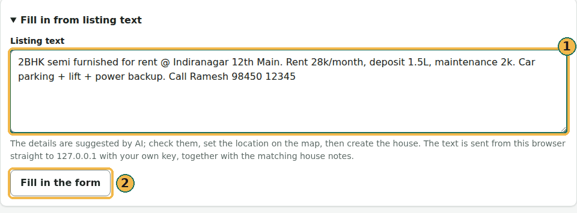
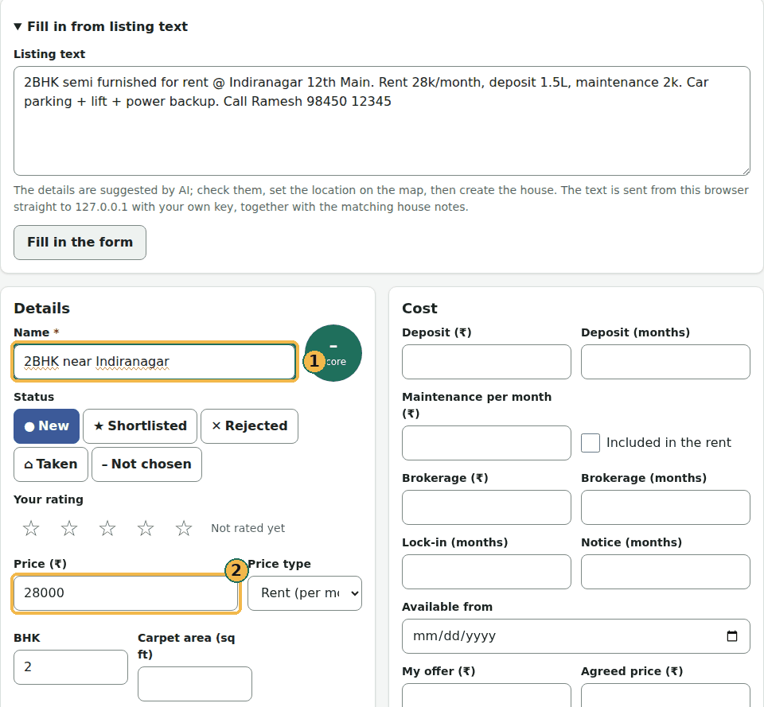

# Language, theme and privacy

## Language and theme

Doorprints speaks English, हिन्दी, தமிழ் and తెలుగు. The Hindi, Tamil and Telugu wording is still being reviewed.

- **Website:** pick the language in the menu at the top right.
- **Android:** open **Settings**, then **Language**. **System default** follows your phone's language.
- **iPhone:** Doorprints uses your iPhone's language. **Open iPhone Settings** lets you pick one just for Doorprints.

Light and dark themes follow your device's setting on all three.

## Your privacy and the map

- Your houses, visits and photos stay in your browser or on your phone, and on your own server if you connect one.
  There is no Doorprints account and no advertising.
- The map pictures come from OpenFreeMap. On the website, **Fill address from map** and **Find "<area>" on the map**
  ask OpenStreetMap's address service, only when you tap them. On the phones, street and place names come from the
  phone's built-in address finder (Google's on Android, Apple's on iPhone).
- The AI features send your question and the matching house notes to the AI provider you chose (its name is shown where
  you set it): through your server, or, with your own key, straight from your phone or browser. The contact names and phone numbers saved with a house are
  left out.
- Hunt mode's location stays on your phone.
- India's boundaries on the map are shown as the Government of India depicts them.

## Save an area of the map for offline

On the **Map**, zoom to the neighbourhood you are hunting in and tap the **download** button (the arrow into a tray,
next to the zoom buttons). Doorprints tells you how much it will download (a neighbourhood is a few MB, a whole
city a few tens of MB), warns you if you are on mobile data, and suggests a name. Tap **Save**. From then on that
area draws down to street level with no network, your houses on it. The saved areas are in **Settings** under
**Offline maps**, with their size, where you can delete one. An area that is too large is refused: zoom in and try
again. Map data © OpenStreetMap contributors, tiles from OpenFreeMap.

**On the website** it works the same way: on the **Map**, choose **Save this area for offline**, check the size and
the room left in the browser, and choose **Save area**. The saved areas are on **Your data** under **Offline maps**.
They stay in this browser only; **Remove all data** removes them too.

## Lock Doorprints on your phone

If you share your phone, or hand it to someone to show a house, you can make Doorprints ask for your phone's own
screen lock (PIN, pattern, password, fingerprint or face) before it opens.

1. Open **Settings** and find **Privacy**.
2. Turn on **Lock Doorprints**. Your phone asks you to confirm it is you.
3. Choose when it locks again after you leave it: **Right away**, **1 minute**, **5 minutes** or **15 minutes**.

While the lock is on, Doorprints is hidden in the phone's list of recent apps. Doorprints keeps no PIN of its own, so
there is nothing new to remember. Your phone needs a screen lock first: set one in the phone's settings. On Android,
while the lock is on, Hunt mode's alerts show nothing on the phone's locked screen. The website has no lock; on a
shared computer, use **Remove all data** on **Your data** when you are done.

## AI without a server

You can use **Ask**, **Plan** and **Fill in from listing text** without running a server. Your phone or browser then
asks an AI service itself, with a key of your own. You choose the service: Google Gemini (free on Google's free tier),
OpenAI, OpenRouter, Groq, Anthropic, a model on your own computer (Ollama or LM Studio), or any other service that speaks the same
chat language.

### What it looks like

**Fill in from listing text** is on the form for a new house. Paste an ad (1) and choose **Fill in the form** (2):

The form then holds the AI's suggestions: the name (1) and the price (2) are filled in, with the BHK below. Check them,
set the location on the map and save. A detail the ad does not give stays empty.

These pictures are an **example answer**, made with a made-up ad and a stand-in for the AI service on the same
computer (no key, nothing sent anywhere); the words of the answer were scripted. What you get depends on the service
and model you choose. For **Ask** and **Plan** see [Compare and plan](compare-and-plan.md#what-ask-and-plan-look-like-with-ai-on), and for what we test
and what it costs, [What we test](what-we-test.md).

### On Android and iPhone

1. Make a key with the service you want to use (a model on your own computer needs none). For Gemini, open
   [Google AI Studio](https://aistudio.google.com/apikey), sign in with a Google account and choose
   **Create API key**. Make one just for Doorprints, so you can delete it there at any time.
2. In Doorprints, open **Settings** and find **AI features**.
3. Turn on **Use AI features on this phone**. Read what it says is sent to an AI service.
4. Choose **Use my own AI on this phone**, then pick your service under **AI service**.
5. For **Gemini**, paste the key and tap **Save key**; Doorprints checks the key with Google first, then says **Google
   accepted this key**. For any other service the **Base URL** is filled in (only **Custom** lets you change it: it must
   start with `https://`, or be on this device, such as `http://localhost`; the Android emulator may also use
   `http://10.0.2.2`). Type the **Model** exactly as the service lists it (for example `gpt-4o-mini`), paste the
   **API key** and tap **Save**. Then tap **Test**: Doorprints says which host accepted the key, or what is wrong (the
   key was refused, the model is unknown, you reached the limit, or the host could not be reached). **Anthropic** works like the others, with its address filled in and fixed; it always needs a key, made in the [Anthropic Console](https://console.anthropic.com/settings/keys).

The key stays on your phone, locked (encrypted), and goes only to the service you chose: the address is written under
the form, and again above every question you send. **Test** (**Test key** for Gemini) checks it again; **Remove key**
forgets the key and your choice of service. If you also connect a server, you choose which one answers:
**Use my server** or your own AI.

### On the website

1. Make a key with the service you want to use. For Gemini, use [Google AI Studio](https://aistudio.google.com/apikey),
   as in step 1 above. A model on your own computer needs no key.
2. Open **Your data**, then **Connect** (on a computer, **Connect** is in the menu at the top).
3. Under **AI features**, turn on **Use AI features in this browser**.
4. Choose **Use my own AI on this browser** (with no server, it is already chosen), then pick your service under
   **AI service**.
5. For **Gemini**, paste the key and select **Save key**; Doorprints checks the key with Google first. For any other
   service, the **Base URL** is filled in (only **Custom** lets you change it: it must start with `https://`, or be on
   this computer, such as `http://localhost`). Type the **Model** exactly as the service lists it (for example
   `gpt-4o-mini`), paste the **API key** and select **Save**. Then select **Test**: Doorprints says which host accepted
   the key, or what is wrong (the key was refused, the model is unknown, you reached the limit, or the host could not
   be reached). **Anthropic** works like the others, with its address filled in and fixed; it always needs a key, made in the [Anthropic Console](https://console.anthropic.com/settings/keys).

The key stays in this browser and goes only to the service you chose: the address is written under the form, and again
above every question you send. It is forgotten when you close the tab, unless you tick **Remember on this device**;
leave that off on a shared computer. **Remove key** forgets the key and your choice of service; **Remove all data** on
**Your data** also removes them.

!!! note "Ollama and LM Studio on your own computer"
    The browser only lets this website talk to a program on your computer if that program allows it. For Ollama,
    start it with `OLLAMA_ORIGINS=https://doorprints.web.app` set; in LM Studio, allow `https://doorprints.web.app`
    in its server's CORS setting. Otherwise **Test** says it could not reach `localhost`.

### AI speed and cost {#ai-speed-and-cost}

On the website (the Connect page, under **AI features**) and in the Android and iPhone apps (**Settings**, then **AI features**),
when you use **Google Gemini** with your own key, a group called **AI speed and cost** lets you choose how long the model thinks
before it answers:

- **Quality**: the model's own default setting. Nothing is changed; this is what you get if you never touch the group.
- **Balanced**: thinks a medium amount, between Quality and Economy on speed and cost.
- **Economy**: in our tests about 40% cheaper and about twice as fast, with answers as good.

Most of what a Gemini answer costs is the model's thinking, so a lower setting saves money on a key that has billing turned
on. Your choice is kept on this browser or phone and applies at once, with no Save. It is only for Google Gemini keys: with any other service, or
with AI features off, the group is not shown and nothing is sent (a choice you made stays saved). **Remove key** forgets
the choice too. It works the same on the website and in the apps. The figures are from our own test runs, so yours may differ.

On the website, **Your data** also has a **Privacy page** link (`privacy.html`) and **Back up to Google Drive**.
See [Back up to Google Drive](google-drive.md).

!!! warning "Google's free tier"
    On the free tier, Google may use what you send to improve its products, and people may read it. Keep personal
    details out of your notes, or turn on billing for the key in Google AI Studio (see
    [the paid tier](set-up-a-server.md#the-paid-tier-a-small-cost-more-privacy)).
