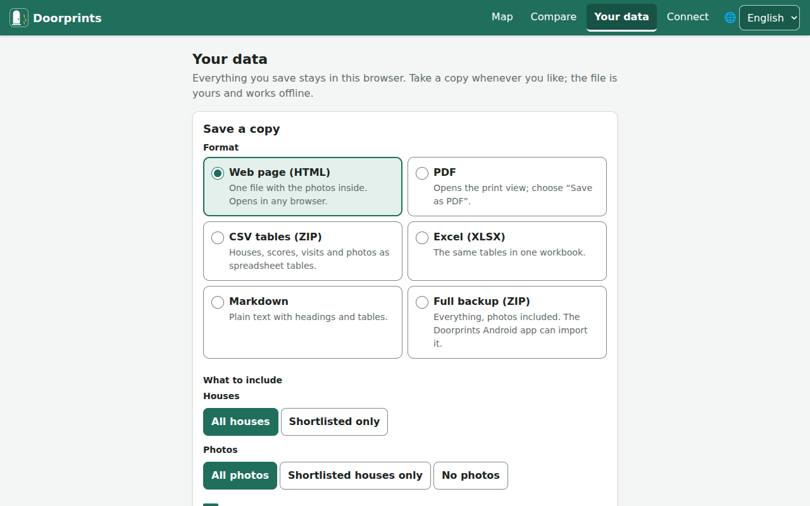
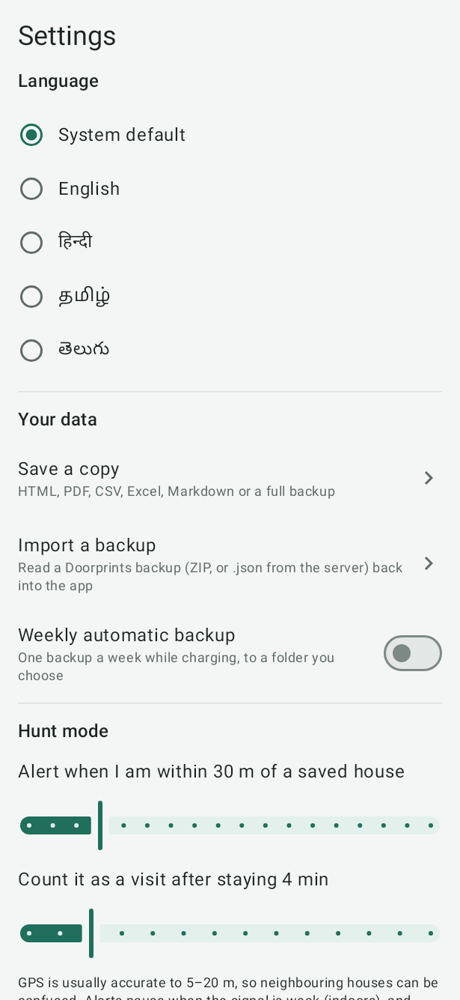

# Your data

## Save a copy of your data

A copy is a file that belongs to you. It opens without Doorprints and without the internet. Make one now and then.
Always make one before you change phones or clear your browser.

**On the website:**

1. Open **Your data**.
2. Under **Save a copy**, choose a **Format**.
3. Under **What to include**, choose all houses or **Shortlisted only**, and which photos. You can also turn on
   **Include rejected houses** and **Include contact names and phone numbers**.
4. Choose the **Language of the file**.
5. Choose **Download**. For a PDF, choose **Open print view**, then "Save as PDF".

**On Android:**

1. Open **Settings**, then **Save a copy**.
2. Pick the format and options.
3. Tap **Save to…** or **Share**.

**On iPhone:** open **Settings**, then **Save a copy**, and save it to Files or share it. Every format but the PDF.

**Weekly automatic backup** (Android) saves a backup once a week while the phone is charging. It goes to a folder you choose.

- **Web page (HTML)**, **PDF**, CSV tables, **Excel** and **Markdown** are *readable copies*. They are good for
  reading, printing and sharing with family. In the tables (CSV and Excel) each house is a row, with its costs, the
  number of rooms and the floor; more tables list the rooms, scores, answers, visits, viewings, photos and brokers.
- **Full backup (ZIP)** holds your houses, visits and photos. It holds everything, unless you left some out under
  *What to include*. It is the only file Doorprints can read back in, with the backup file of your server (`.json`).

A copy with contact details holds owners' and brokers' phone numbers, and the list of your **Brokers**. Share it carefully.

 

## Share updates with someone you hunt with

On Android or iPhone, in **Settings**, under **Your data**, tap **Share updates with…**. Add the person's name once ("Priya"), then tap
**Share updates with Priya**: Doorprints makes a file of everything that changed since you last shared with her
(the first time, your whole list) and opens the share sheet, so you can send it on WhatsApp, by email or any other
way. On her phone, opening the file starts Doorprints, which shows what would change and merges it with her list
when she taps **Import**. When both of you share your updates now and then, you hunt as one from two phones. Turn
**Include contact details** off to keep owners' and brokers' phone numbers out of the file. A house you deleted is
deleted on her phone too when she imports your update (**Houses deleted by the sender** in the preview), unless she
changed it after you deleted it. She can also import your update on the website or on an iPhone.

## Import a backup

**Import a backup** brings houses, visits and photos back from a **Full backup (ZIP)**, the server's backup file
(`.json`, without photos) or an update someone shared with you. Every app can read a backup made by any other.

1. On the website, open **Your data** and find **Import a backup**. On Android or iPhone, open **Settings**, then
   **Import a backup**.
2. Choose **Choose a backup file**. (On a phone you can also open the file from another app, such as WhatsApp or
   Files, and choose Doorprints.) If you installed the website on a computer (Chrome or Edge), you can also
   double-click a Doorprints backup (`.zip`) to open it in **Import a backup**.
3. Doorprints checks the file and shows **What this would change**. Nothing changes yet.
4. Choose how to import:
    - **Merge with what I have:** a house already on this phone is updated only if the backup's version is newer.
      When the file would replace something you have, Doorprints offers **Keep mine, add only what's new**: what
      you already have stays as it is, even where the file is newer. If you deleted houses here that the file still
      has, turn on **Also bring back … houses deleted on this phone** (or *in this browser*) to get them back.
    - **Add everything as new copies:** nothing on this phone is changed. Houses you already have will appear twice.
5. Tap **Import**.

The preview also counts the new and updated brokers. If a house's floor in the file is outside -5 to 200, the
preview says so: that house comes in with its floor left blank.

On the website and on Android, **Undo this import** removes the copies an **Add everything as new copies** import
made (on the website, until you leave the page).

Readable copies (HTML, PDF, CSV, Excel, Markdown) cannot be imported.

